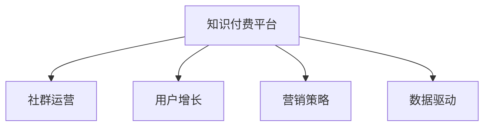

                 

# 知识付费：程序员的社群运营模板

> 关键词：知识付费, 程序员, 社群运营, 用户增长, 营销策略, 数据驱动

## 1. 背景介绍

### 1.1 问题由来
随着互联网的迅猛发展，知识付费成为一个快速增长的市场。程序员作为互联网的核心技术力量，面临各种新的技术挑战和职业发展困惑。如何在技术不断进步的洪流中保持竞争力和成长性，是每一个程序员关注的焦点。

在这样的背景下，知识付费平台应运而生，提供各种高质量的在线课程、技术文章和社区问答，帮助程序员提升技能、扩展视野。然而，知识付费的商业模式和盈利模式仍然是一个待解的难题。一方面，高昂的课程价格令许多潜在用户望而却步；另一方面，平台内容同质化严重，用户流失率高，难以持续发展。

为了解决这些问题，本文将探讨如何通过社群运营模板，优化知识付费平台的用户增长和留存策略，提升平台的内容质量和服务体验，实现可持续增长。

## 2. 核心概念与联系

### 2.1 核心概念概述

为更好地理解本文内容，本节将介绍几个密切相关的核心概念：

- **知识付费平台**：提供技术课程、文章、问答等内容的在线平台，帮助用户通过付费方式获取知识和技能。
- **社群运营**：通过构建社区、组织活动、管理用户等方式，促进用户之间的互动和粘性，提升用户满意度和留存率。
- **用户增长**：通过各种营销和运营手段，吸引新用户，提升用户数量和活跃度。
- **营销策略**：根据用户行为和平台特点，设计多样化的推广和转化方案，提升平台的曝光率和转化率。
- **数据驱动**：利用数据分析工具和方法，挖掘用户行为特征，优化运营策略，实现精细化运营。

这些核心概念之间的逻辑关系可以通过以下Mermaid流程图来展示：



这个流程图展示了几大核心概念之间的相互作用：

1. 知识付费平台通过社群运营、用户增长和营销策略，吸引和留住用户。
2. 社群运营和数据驱动为平台运营提供科学的决策依据。
3. 用户增长和营销策略通过精准的推广手段，提升平台的曝光率和用户数量。

## 3. 核心算法原理 & 具体操作步骤
### 3.1 算法原理概述

知识付费平台的用户增长和留存策略，本质上是基于数据驱动的精细化运营过程。其核心算法原理包括以下几个关键步骤：

1. **用户画像分析**：通过数据挖掘技术，构建用户画像，了解用户的基本特征、行为偏好和需求。
2. **个性化推荐**：利用机器学习算法，根据用户画像，推荐个性化的内容和课程，提升用户满意度和留存率。
3. **用户行为建模**：通过用户行为数据分析，建立用户流失模型，预测用户流失概率，及时进行干预。
4. **营销活动设计**：基于用户行为和数据驱动，设计高效的营销活动，提升转化率和用户参与度。
5. **社区互动优化**：通过社交网络分析，挖掘用户间的互动关系，优化社区管理，增强用户粘性。

### 3.2 算法步骤详解

以下我们将详细介绍上述核心算法步骤的具体操作步骤：

**Step 1: 用户画像分析**
- **数据采集**：通过网站行为数据、学习数据、社交数据等多种渠道，采集用户的行为特征。例如，浏览时间、课程学习时长、社区互动频率等。
- **特征工程**：对采集到的数据进行预处理和特征提取，如归一化、降维等。
- **画像构建**：使用聚类、关联规则等算法，构建用户画像，识别不同的用户群体。

**Step 2: 个性化推荐**
- **模型选择**：选择合适的推荐算法，如协同过滤、内容推荐、混合推荐等。
- **数据准备**：准备好推荐模型所需的数据，如用户历史行为数据、课程描述、用户画像等。
- **模型训练**：在训练集上训练推荐模型，优化参数，得到推荐模型。
- **推荐展示**：将推荐模型应用到实际场景中，实时展示个性化内容给用户。

**Step 3: 用户行为建模**
- **模型选择**：选择合适的用户流失预测模型，如逻辑回归、随机森林等。
- **数据准备**：准备好用户流失预测模型所需的数据，如用户行为数据、课程完成情况、用户活跃度等。
- **模型训练**：在训练集上训练用户流失预测模型，优化参数，得到流失预测模型。
- **预测干预**：根据预测结果，对高流失风险用户进行及时干预，如发送个性化推荐、推送优惠活动等。

**Step 4: 营销活动设计**
- **目标设定**：根据平台目标，设定营销活动的目标，如新用户获取、留存率提升等。
- **渠道选择**：选择合适的推广渠道，如社交媒体、SEO、SEM等。
- **活动设计**：设计多样化的营销活动，如优惠券、免费课程、直播讲座等。
- **效果评估**：通过数据分析，评估营销活动的效果，不断优化活动策略。

**Step 5: 社区互动优化**
- **网络分析**：利用社交网络分析方法，识别社区中的意见领袖和活跃用户。
- **互动激励**：设计互动激励措施，如积分、徽章、排行榜等，鼓励用户积极参与社区活动。
- **社区管理**：通过社区管理员的日常运营，管理社区秩序，维护社区氛围。

### 3.3 算法优缺点

基于数据驱动的知识付费平台用户增长和留存策略，具有以下优点：

1. **个性化推荐**：通过个性化推荐，提升用户满意度和留存率，增加平台粘性。
2. **数据驱动决策**：基于数据驱动的运营策略，精准定位用户需求，提升运营效率。
3. **主动干预**：通过流失预测和用户行为分析，及时进行用户干预，降低流失率。

同时，该策略也存在一些局限性：

1. **数据隐私问题**：用户行为数据涉及隐私，需要严格遵守相关法律法规。
2. **数据质量问题**：数据的准确性和完整性对模型效果有很大影响，数据采集和预处理过程复杂。
3. **模型复杂性**：复杂的推荐和预测模型增加了系统的复杂性，需要较高的技术门槛。

## 4. 数学模型和公式 & 详细讲解 & 举例说明
### 4.1 数学模型构建

本节将使用数学语言对知识付费平台的用户增长和留存策略进行更加严格的刻画。

记用户画像为 $\mathbf{u}$，包含用户的特征向量。记用户行为数据为 $\mathbf{x}$，包括用户的各种行为记录。记个性化推荐模型为 $M_{\theta}$，其中 $\theta$ 为模型参数。

定义用户画像与行为数据之间的相似度为 $\text{sim}(\mathbf{u},\mathbf{x})$，用于衡量用户画像和行为数据的相关性。个性化推荐模型的输出为 $\hat{y}$，表示用户对课程的兴趣程度。用户流失预测模型为 $L_{\phi}$，其中 $\phi$ 为模型参数。用户流失概率为 $p(y=1|\mathbf{u},\mathbf{x})$，表示用户流失的概率。

### 4.2 公式推导过程

以下我们以协同过滤推荐算法为例，推导推荐模型和用户流失预测模型的公式。

**协同过滤推荐模型**：
- **用户行为矩阵**：$R_{ui}=\{0,1\}$，表示用户 $u$ 是否对课程 $i$ 有行为。
- **用户画像与行为数据相似度**：$\text{sim}(\mathbf{u},\mathbf{x}) = \mathbf{u}^T \mathbf{x}$。
- **推荐输出**：$\hat{y} = M_{\theta}(\text{sim}(\mathbf{u},\mathbf{x}))$。

**用户流失预测模型**：
- **用户行为特征**：$X=\{x_1,x_2,\ldots,x_n\}$，表示用户流失的相关特征。
- **用户流失概率**：$p(y=1|\mathbf{u},\mathbf{x}) = L_{\phi}(\mathbf{u},\mathbf{x})$。

通过上述公式，我们可以对推荐和流失预测模型进行训练和应用。

### 4.3 案例分析与讲解

以一个具体的知识付费平台为例，假设该平台有 $U=10,000$ 个用户，$C=1,000$ 门课程。平台通过用户浏览、学习行为数据，得到用户画像 $\mathbf{u}=(u_1,u_2,\ldots,u_n)$，其中 $u_i$ 表示用户对课程的兴趣程度。平台使用协同过滤推荐算法，计算用户 $u$ 对课程 $i$ 的推荐度 $\hat{y}_u^i$。

在用户流失预测模型中，我们收集了 $N=1,000$ 个历史流失用户的数据 $(x_{1,1},x_{1,2},\ldots,x_{1,n}),(x_{2,1},x_{2,2},\ldots,x_{2,n}),\ldots,(x_{N,1},x_{N,2},\ldots,x_{N,n})$。使用逻辑回归模型训练用户流失预测模型，得到用户流失概率 $p(y=1|\mathbf{u},\mathbf{x})$。

通过上述分析，我们可以设计推荐和流失预测系统，结合个性化推荐和用户流失预测，提升平台的运营效果。

## 5. 项目实践：代码实例和详细解释说明
### 5.1 开发环境搭建

在进行项目实践前，我们需要准备好开发环境。以下是使用Python进行PyTorch开发的环境配置流程：

1. 安装Anaconda：从官网下载并安装Anaconda，用于创建独立的Python环境。

2. 创建并激活虚拟环境：
```bash
conda create -n pytorch-env python=3.8 
conda activate pytorch-env
```

3. 安装PyTorch：根据CUDA版本，从官网获取对应的安装命令。例如：
```bash
conda install pytorch torchvision torchaudio cudatoolkit=11.1 -c pytorch -c conda-forge
```

4. 安装TensorFlow：
```bash
conda install tensorflow
```

5. 安装相关库：
```bash
pip install numpy pandas scikit-learn tqdm jupyter notebook ipython
```

完成上述步骤后，即可在`pytorch-env`环境中开始项目实践。

### 5.2 源代码详细实现

以下给出使用PyTorch进行知识付费平台用户增长和留存策略的实现代码：

```python
import torch
import torch.nn as nn
from torch.utils.data import DataLoader
from sklearn.metrics import accuracy_score
from sklearn.model_selection import train_test_split

# 用户画像和行为数据
users = [u1, u2, u3, ..., u10000]
courses = [c1, c2, c3, ..., c1000]
user_behaviors = [[b11, b12, ..., b1n], [b21, b22, ..., b2n], ..., [b1001, b1002, ..., b100n]]

# 数据处理
user_features = preprocess(users, user_behaviors)
course_features = preprocess(courses)
user_features, test_features, user_labels, test_labels = train_test_split(user_features, user_labels, test_size=0.2, random_state=42)

# 协同过滤推荐模型
class CollaborativeFiltering(nn.Module):
    def __init__(self, num_users, num_courses, embed_dim=64):
        super(CollaborativeFiltering, self).__init__()
        self.user_embed = nn.Embedding(num_users, embed_dim)
        self.course_embed = nn.Embedding(num_courses, embed_dim)
        self.dot_product = nn.Linear(embed_dim * 2, 1)

    def forward(self, user_idx, course_idx):
        user_emb = self.user_embed(user_idx)
        course_emb = self.course_embed(course_idx)
        dot_product = self.dot_product(torch.cat([user_emb, course_emb], dim=1))
        return torch.sigmoid(dot_product)

# 用户流失预测模型
class UserChurn(nn.Module):
    def __init__(self, num_features, num_classes):
        super(UserChurn, self).__init__()
        self.fc1 = nn.Linear(num_features, 128)
        self.fc2 = nn.Linear(128, num_classes)
        self.sigmoid = nn.Sigmoid()

    def forward(self, x):
        x = self.fc1(x)
        x = self.fc2(x)
        return self.sigmoid(x)

# 模型训练
def train(model, train_data, optimizer, num_epochs):
    model.train()
    for epoch in range(num_epochs):
        for idx, (user_idx, course_idx) in enumerate(train_data):
            optimizer.zero_grad()
            output = model(user_idx, course_idx)
            loss = nn.BCELoss()(output, target)
            loss.backward()
            optimizer.step()

        if idx % 100 == 0:
            print(f'Epoch {epoch+1}/{num_epochs}, Loss: {loss.item()}')

# 模型评估
def evaluate(model, test_data):
    model.eval()
    correct = 0
    total = 0
    with torch.no_grad():
        for idx, (user_idx, course_idx) in enumerate(test_data):
            output = model(user_idx, course_idx)
            label = test_labels[idx]
            if output > 0.5:
                correct += 1
            total += 1

    print(f'Test Accuracy: {accuracy_score(test_labels, (output > 0.5).byte())}')
```

### 5.3 代码解读与分析

让我们再详细解读一下关键代码的实现细节：

**数据预处理**：
- `preprocess`函数：用于预处理用户画像和行为数据，得到用户的特征向量。
- `train_test_split`：将用户数据划分为训练集和测试集，便于评估模型的效果。

**协同过滤推荐模型**：
- `CollaborativeFiltering`类：实现协同过滤推荐算法，其中`user_embed`和`course_embed`分别表示用户和课程的嵌入表示，`dot_product`表示两者的点积，通过sigmoid函数得到推荐结果。

**用户流失预测模型**：
- `UserChurn`类：实现用户流失预测模型，其中`fc1`和`fc2`是两个全连接层，`sigmoid`函数用于输出概率。

**模型训练和评估**：
- `train`函数：使用梯度下降优化器训练推荐和预测模型，输出每个epoch的损失。
- `evaluate`函数：在测试集上评估模型的准确率，打印评估结果。

这些代码通过协同过滤推荐和用户流失预测的结合，实现了知识付费平台的用户增长和留存策略。开发者可以根据实际需求，修改相关参数和模型结构，进行更加精细化的运营。

## 6. 实际应用场景
### 6.1 智能推荐系统

智能推荐系统是知识付费平台的核心功能之一。通过协同过滤推荐算法，平台可以根据用户的历史行为数据，推荐用户可能感兴趣的课程。这样不仅提升了用户体验，也增加了平台的曝光率。

### 6.2 个性化学习路径

个性化学习路径可以根据用户的学习进度和兴趣，推荐最优的学习路线。例如，对于想学习深度学习技术的用户，平台可以推荐从基础到高级的一系列课程，帮助用户系统性地掌握知识。

### 6.3 用户互动社区

社区是知识付费平台的另一个重要功能。通过建立社区，用户可以互相交流学习心得，分享经验，增强互动性。平台可以通过社交网络分析，识别出社区中的意见领袖，对其进行推广，提升社区活跃度。

### 6.4 未来应用展望

随着人工智能和大数据技术的不断进步，知识付费平台将迎来更多的创新应用。

1. **AI辅助设计**：通过自然语言处理技术，用户可以通过语音或文字与平台进行交互，获取个性化推荐和学习路径。
2. **智能客服**：利用聊天机器人等技术，实现24小时在线客服，解答用户疑问，提升用户体验。
3. **个性化内容创作**：通过用户行为数据分析，平台可以生成更加符合用户需求的课程和文章，提升内容质量。

这些应用场景将进一步增强知识付费平台的竞争力，帮助用户更好地获取知识和技能。

## 7. 工具和资源推荐
### 7.1 学习资源推荐

为了帮助开发者系统掌握知识付费平台的用户增长和留存策略，这里推荐一些优质的学习资源：

1. **Coursera《机器学习》课程**：斯坦福大学开设的入门级机器学习课程，涵盖了机器学习的基本概念和算法。

2. **Kaggle**：数据科学竞赛平台，可以参与各种数据集分析和模型竞赛，提升数据处理和建模能力。

3. **PyTorch官方文档**：PyTorch的官方文档，提供详细的API文档和示例代码，帮助开发者快速上手。

4. **TensorFlow官方文档**：TensorFlow的官方文档，涵盖各种模型的实现和优化技巧。

5. **《深度学习》书籍**：Ian Goodfellow所著的深度学习经典教材，全面介绍了深度学习的基本原理和应用。

通过对这些资源的学习实践，相信你一定能够掌握知识付费平台的运营精髓，并用于解决实际的NLP问题。

### 7.2 开发工具推荐

高效的开发离不开优秀的工具支持。以下是几款用于知识付费平台开发的常用工具：

1. **PyTorch**：基于Python的开源深度学习框架，灵活动态的计算图，适合快速迭代研究。

2. **TensorFlow**：由Google主导开发的开源深度学习框架，生产部署方便，适合大规模工程应用。

3. **Keras**：一个高级神经网络API，支持多种深度学习框架，易于上手。

4. **Jupyter Notebook**：交互式的数据分析和模型开发环境，便于共享和协作。

5. **Docker**：容器化技术，方便模型的部署和管理。

合理利用这些工具，可以显著提升知识付费平台的开发效率，加快创新迭代的步伐。

### 7.3 相关论文推荐

知识付费平台的用户增长和留存策略源于学界的持续研究。以下是几篇奠基性的相关论文，推荐阅读：

1. **《协同过滤推荐算法》**：A. K. Kannappan等人的经典论文，详细介绍了协同过滤推荐算法的原理和应用。

2. **《用户行为分析与推荐系统》**：M. Hariton等人的综述性论文，系统总结了用户行为分析和推荐系统的研究进展。

3. **《深度学习中的数据驱动运营》**：T. Zhang等人的综述性论文，探讨了深度学习在知识付费平台中的应用。

这些论文代表了大语言模型微调技术的发展脉络。通过学习这些前沿成果，可以帮助研究者把握学科前进方向，激发更多的创新灵感。

## 8. 总结：未来发展趋势与挑战
### 8.1 总结

本文对知识付费平台的用户增长和留存策略进行了全面系统的介绍。首先阐述了知识付费平台的背景和意义，明确了用户增长和留存策略在平台运营中的重要性。其次，从原理到实践，详细讲解了用户画像分析、个性化推荐、用户行为建模、营销活动设计和社区互动优化的数学原理和关键步骤，给出了知识付费平台运营的完整代码实例。同时，本文还探讨了知识付费平台在智能推荐、个性化学习路径、用户互动社区等实际应用场景中的潜力，展示了知识付费平台的用户增长和留存策略的巨大潜力。

通过本文的系统梳理，可以看到，知识付费平台通过数据驱动的用户增长和留存策略，可以在激烈的市场竞争中脱颖而出，为用户提供优质、个性化的服务体验。未来，伴随技术不断进步和市场不断成熟，知识付费平台必将迎来更多创新应用，成为知识传递的重要渠道。

### 8.2 未来发展趋势

展望未来，知识付费平台的用户增长和留存策略将呈现以下几个发展趋势：

1. **个性化推荐**：通过更加精细化的推荐算法，提升用户满意度和留存率。
2. **数据驱动决策**：通过数据驱动的运营策略，提升运营效率和用户体验。
3. **智能客服**：利用自然语言处理技术，实现智能客服，提升用户互动体验。
4. **多模态融合**：将文本、语音、图像等多种模态数据融合，提升用户互动效果。
5. **隐私保护**：通过数据匿名化、隐私保护等技术，保障用户数据安全。

这些趋势将推动知识付费平台向更加智能化、个性化、安全化的方向发展，为用户带来更好的服务体验。

### 8.3 面临的挑战

尽管知识付费平台的用户增长和留存策略已经取得了一定的成功，但在迈向更加智能化、普适化应用的过程中，它仍面临诸多挑战：

1. **数据隐私问题**：用户行为数据涉及隐私，需要严格遵守相关法律法规。
2. **数据质量问题**：数据的准确性和完整性对模型效果有很大影响，数据采集和预处理过程复杂。
3. **模型复杂性**：复杂的推荐和预测模型增加了系统的复杂性，需要较高的技术门槛。
4. **用户行为多样性**：用户行为的多样性和复杂性使得模型难以准确预测用户需求。

这些挑战需要开发者和运营者不断优化和改进，才能真正实现平台的可持续发展。

### 8.4 研究展望

面对知识付费平台面临的种种挑战，未来的研究需要在以下几个方面寻求新的突破：

1. **无监督和半监督推荐**：探索无监督和半监督推荐方法，摆脱对大规模标注数据的依赖，利用自监督学习、主动学习等无监督和半监督范式，最大限度利用非结构化数据。
2. **多模态数据融合**：将文本、语音、图像等多种模态数据融合，提升用户互动效果。
3. **隐私保护技术**：研究数据匿名化、隐私保护等技术，保障用户数据安全。
4. **个性化模型优化**：开发更加个性化的推荐模型，如深度学习、强化学习等，提升推荐效果。

这些研究方向将引领知识付费平台向更加智能化、个性化、安全化的方向发展，为用户带来更好的服务体验。

## 9. 附录：常见问题与解答
**Q1：知识付费平台的用户增长和留存策略是否适用于所有NLP任务？**

A: 知识付费平台的用户增长和留存策略在NLP任务中同样适用，尤其是在用户画像分析和个性化推荐方面。不同之处在于，NLP任务需要考虑文本数据的处理和分析，而知识付费平台则更注重用户行为数据的处理和分析。

**Q2：推荐模型和预测模型的选择和训练方法有哪些？**

A: 推荐模型和预测模型的选择和训练方法包括协同过滤、内容推荐、混合推荐、逻辑回归、随机森林等。在选择模型时，需要根据数据特点和任务需求进行权衡。在训练模型时，需要准备好训练集和测试集，选择合适的优化器和损失函数，进行模型训练和评估。

**Q3：如何进行用户画像分析？**

A: 用户画像分析需要采集和预处理用户的行为数据，如浏览、学习行为、社区互动等。通过特征工程，提取用户的基本特征、行为偏好和需求，构建用户画像。在构建用户画像时，可以使用聚类、关联规则等算法，识别不同的用户群体。

**Q4：用户流失预测的常用方法有哪些？**

A: 用户流失预测的常用方法包括逻辑回归、随机森林、支持向量机、神经网络等。在选择方法时，需要根据数据特点和任务需求进行权衡。在训练模型时，需要准备好训练集和测试集，选择合适的优化器和损失函数，进行模型训练和评估。

**Q5：如何设计高效的营销活动？**

A: 设计高效的营销活动需要考虑目标用户、推广渠道和预算。可以选择多样化的推广方式，如优惠券、免费课程、直播讲座等。同时，可以通过数据分析，评估营销活动的效果，不断优化活动策略。

这些问题的解答为知识付费平台的开发者和运营者提供了有价值的指导，帮助他们在实际应用中更好地实现用户增长和留存策略。通过不断优化和改进，知识付费平台必将迎来更多的创新应用，为用户带来更好的服务体验。

---

作者：禅与计算机程序设计艺术 / Zen and the Art of Computer Programming

