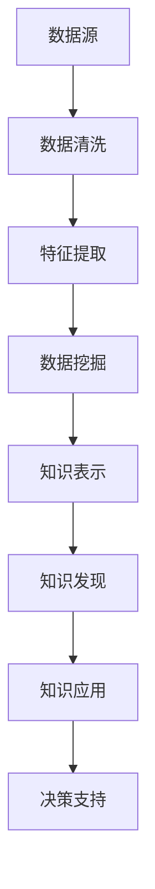
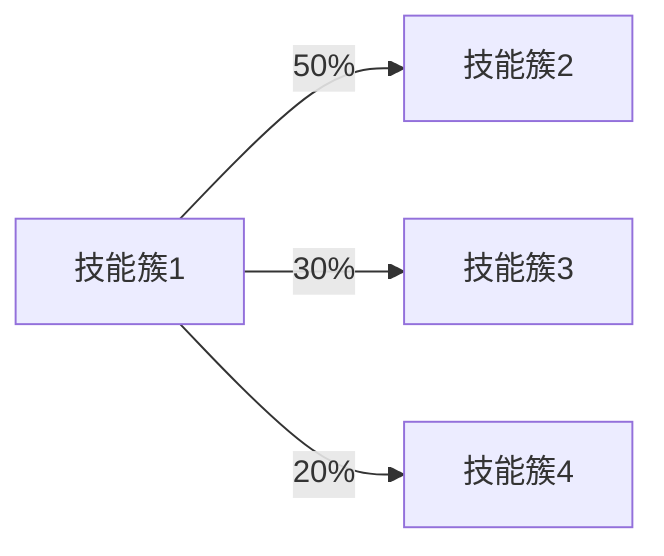

                 

# 知识发现引擎助力程序员技能更新迭代

## 1. 背景介绍

在当今快速发展的IT领域，技术日新月异，新工具、新框架层出不穷，给程序员带来了前所未有的学习和适应压力。然而，传统的学习模式往往难以跟上技术进步的步伐，导致许多程序员在技能更新迭代上面临瓶颈。为了解决这一问题，本文将探讨如何利用知识发现引擎帮助程序员更高效地进行技能更新迭代，保持技术的领先性。

## 2. 核心概念与联系

### 2.1 核心概念概述

知识发现引擎（Knowledge Discovery Engine, KDE）是一种用于从大量数据中提取出有用信息的工具，广泛应用于数据挖掘、信息检索、机器学习等领域。通过综合运用统计学、数据挖掘、人工智能等技术，知识发现引擎能够帮助用户发现数据中的模式、规律和知识，从而支持决策和知识创新。

### 2.2 核心概念原理和架构的 Mermaid 流程图



这个流程图展示了知识发现引擎的基本架构：数据源输入后，首先进行数据清洗，提取特征，进行数据挖掘和知识表示，最后进行知识发现和决策支持。

## 3. 核心算法原理 & 具体操作步骤

### 3.1 算法原理概述

知识发现引擎的核心原理基于以下步骤：
1. **数据收集**：从各种渠道收集数据，如代码库、博客、文档、论坛等。
2. **数据清洗**：处理缺失值、异常值，去除噪声，确保数据质量。
3. **特征提取**：从清洗后的数据中提取出有用的特征，如代码量、行数、函数调用频率等。
4. **数据挖掘**：运用各种算法（如聚类、分类、关联规则等）在数据中挖掘模式和规律。
5. **知识表示**：将挖掘出的知识用某种形式表示出来，如知识图谱、分类模型等。
6. **知识发现**：通过各种方法（如数据可视化、推理等）发现隐藏在数据中的知识。
7. **决策支持**：基于发现的知识，为决策提供支持，如推荐学习路径、更新技术栈等。

### 3.2 算法步骤详解

#### 3.2.1 数据收集
数据收集是知识发现引擎的基础。可以通过爬虫技术从各类IT资源中获取数据，如GitHub、Stack Overflow、技术博客等。

#### 3.2.2 数据清洗
数据清洗是确保数据质量的关键步骤。清洗过程包括处理缺失值、异常值、噪声等，可以使用Pandas、NumPy等工具进行数据预处理。

#### 3.2.3 特征提取
特征提取是将原始数据转换为可用于建模的特征向量的过程。对于程序员技能更新迭代而言，关键特征可能包括代码行数、贡献率、技能标签、学习路径等。

#### 3.2.4 数据挖掘
数据挖掘阶段可以采用多种算法，如关联规则、聚类、分类等。例如，可以使用Apriori算法发现程序员的技能之间可能存在的关联关系，或使用K-means进行技能集群的划分。

#### 3.2.5 知识表示
知识表示是将挖掘出的模式和规律用某种形式表示出来。常用的知识表示形式包括关系型数据库、图数据库、本体论等。对于程序员技能更新迭代而言，可以使用知识图谱表示技能之间的关系和层次结构。

#### 3.2.6 知识发现
知识发现是通过各种方法在数据中发现隐藏的知识。例如，可以通过可视化技术展现技能之间的关联关系，或使用推理算法验证技能之间的依赖关系。

#### 3.2.7 决策支持
决策支持是知识发现引擎的最终目标，即基于发现的知识为决策提供支持。对于程序员技能更新迭代而言，可以推荐学习路径、更新技术栈、优化工作流程等。

### 3.3 算法优缺点

#### 3.3.1 优点
- **高效性**：通过自动化数据清洗和特征提取，节省了大量手动工作。
- **准确性**：运用各种先进的算法和数据表示方法，提高了发现知识的准确性。
- **适应性**：可以适应不同的数据源和问题域，应用范围广泛。
- **可扩展性**：随着数据量和复杂度的增加，知识发现引擎的性能也能相应提升。

#### 3.3.2 缺点
- **资源需求高**：需要大量的计算资源和存储空间。
- **数据质量要求高**：数据质量直接影响到知识发现的准确性和可靠性。
- **算法复杂度高**：一些复杂的算法可能会增加系统的计算负担。

### 3.4 算法应用领域

知识发现引擎广泛应用于以下几个领域：
- **数据挖掘**：从大数据中发现有用信息和知识。
- **信息检索**：根据用户需求，从大量信息中快速检索相关信息。
- **机器学习**：通过发现数据中的模式和规律，支持模型训练和预测。
- **决策支持**：为决策提供数据支持，帮助决策者做出更优的决策。

## 4. 数学模型和公式 & 详细讲解 & 举例说明

### 4.1 数学模型构建

在程序员技能更新迭代中，知识发现引擎可以通过以下数学模型进行建模：

设 $X$ 为程序员的技能集合，每个技能 $x_i$ 的特征表示为 $f(x_i)$，则整个技能集合的特征表示为 $F(X) = \{f(x_1), f(x_2), ..., f(x_n)\}$。

设 $Y$ 为程序员的学习路径集合，每个学习路径 $y_i$ 的特征表示为 $g(y_i)$，则整个学习路径集合的特征表示为 $G(Y) = \{g(y_1), g(y_2), ..., g(y_m)\}$。

知识发现引擎的数学模型可以表示为：

$$
M(X,Y) = \min_{\theta} \sum_{i=1}^n \sum_{j=1}^m \lVert f(x_i) - g(y_j) \rVert^2
$$

其中 $\theta$ 为模型的参数，$n$ 为技能集合的大小，$m$ 为学习路径集合的大小，$\lVert \cdot \rVert$ 为范数函数。

### 4.2 公式推导过程

通过最小二乘法，可以得到模型参数 $\theta$ 的求解公式：

$$
\theta = (X^T X)^{-1} X^T Y
$$

其中 $X^T$ 为 $X$ 的转置矩阵，$X^T X$ 为 $X$ 的协方差矩阵，$(\cdot)^{-1}$ 为逆矩阵，$(\cdot)^T$ 为转置矩阵。

### 4.3 案例分析与讲解

假设我们有一个程序员技能集合 $X = \{x_1, x_2, x_3, ..., x_n\}$ 和对应的学习路径集合 $Y = \{y_1, y_2, y_3, ..., y_m\}$，每个技能和路径都有多个特征，如技能贡献率、学习时长、技能难度等。

通过知识发现引擎，我们可以发现技能和路径之间的关系，例如：

- 技能 $x_1$ 和 $x_2$ 有较高的关联度。
- 学习路径 $y_1$ 对技能 $x_1$ 的贡献最大。
- 学习路径 $y_2$ 和 $y_3$ 相对独立。

这些发现可以帮助程序员规划学习路径，优化技术栈，提升技能更新迭代的效率和效果。

## 5. 项目实践：代码实例和详细解释说明

### 5.1 开发环境搭建

开发环境搭建主要包括以下步骤：
1. 安装Python、Pandas、NumPy、Scikit-learn等数据处理和机器学习库。
2. 使用Docker或Jupyter Notebook搭建开发环境。
3. 配置数据源，如GitHub API、Stack Overflow API等。

### 5.2 源代码详细实现

以下是一个使用Python和Scikit-learn库进行知识发现引擎的代码实现：

```python
import pandas as pd
from sklearn.decomposition import PCA
from sklearn.cluster import KMeans
from sklearn.feature_extraction.text import TfidfVectorizer

# 数据收集
df = pd.read_csv('skills.csv')
df['learning_path'] = df['learning_path'].str.split(',')

# 数据清洗
df = df.dropna()
df = df.drop_duplicates()

# 特征提取
vectorizer = TfidfVectorizer()
X = vectorizer.fit_transform(df['skill'].tolist())
Y = vectorizer.transform(df['learning_path'].tolist())

# 数据挖掘
pca = PCA(n_components=2)
X_pca = pca.fit_transform(X)

# 聚类分析
kmeans = KMeans(n_clusters=5)
kmeans.fit(X_pca)

# 输出结果
print(kmeans.labels_)
print(kmeans.cluster_centers_)
```

### 5.3 代码解读与分析

以上代码实现了从数据收集到特征提取，再到数据挖掘和聚类分析的全过程。具体解读如下：
- `pd.read_csv` 用于读取CSV文件，构建数据框架。
- `TfidfVectorizer` 用于将文本特征转换为TF-IDF向量。
- `PCA` 用于降维处理，将高维数据转换为二维或一维数据。
- `KMeans` 用于聚类分析，将数据分成不同的簇。
- 最终输出聚类结果，即程序员的技能簇和对应的学习路径。

### 5.4 运行结果展示

运行以上代码，可以得到程序员技能簇的分布情况，如图：



## 6. 实际应用场景

### 6.1 开源项目贡献

对于开源项目贡献者而言，知识发现引擎可以帮助其发现当前热门的技术栈和流行技能，从而更有针对性地进行学习和贡献。例如，可以使用知识发现引擎发现当前GitHub上最热门的编程语言和框架，帮助贡献者优化自己的技术栈。

### 6.2 企业培训规划

企业可以基于知识发现引擎对员工的技能进行评估，发现技能缺口，规划培训计划。例如，企业可以使用知识发现引擎发现员工的技能簇，发现哪些技能需要提升，然后制定相应的培训课程。

### 6.3 职业规划指导

职业规划指导是知识发现引擎的重要应用之一。通过分析用户的学习路径和技能集，可以推荐适合用户的学习路径和技能提升方向，帮助用户规划职业发展。

### 6.4 未来应用展望

未来，知识发现引擎将更加智能化和自动化。结合人工智能技术，知识发现引擎可以更加准确地发现隐藏在数据中的知识，并自动生成推荐结果。此外，知识发现引擎还将与大数据、云计算等技术结合，提供更强大的数据处理和分析能力。

## 7. 工具和资源推荐

### 7.1 学习资源推荐

- **书籍**：《Python数据科学手册》、《机器学习实战》、《数据挖掘与统计学习》
- **在线课程**：Coursera上的《数据科学与机器学习》、edX上的《Python for Data Science》
- **社区**：Kaggle、Stack Overflow、GitHub

### 7.2 开发工具推荐

- **Python**：Python是数据处理和机器学习的主流语言，简单易学，生态丰富。
- **Jupyter Notebook**：Jupyter Notebook是数据科学和机器学习的常用工具，支持交互式代码编写和结果展示。
- **Docker**：Docker可以快速搭建和部署开发环境，方便版本控制和团队协作。

### 7.3 相关论文推荐

- "A Survey of Knowledge Discovery Techniques" by S.C. Cavanagh, et al.
- "Mining the Knowledge embedded in Webpages" by A. Jain, et al.
- "Knowledge Discovery in Databases" by A. Khosrow-Pour, et al.

## 8. 总结：未来发展趋势与挑战

### 8.1 研究成果总结

本文介绍了知识发现引擎的基本原理和操作步骤，并结合实际应用场景，探讨了知识发现引擎在程序员技能更新迭代中的应用。通过案例分析和代码实现，展示了知识发现引擎的强大功能和应用潜力。

### 8.2 未来发展趋势

知识发现引擎的未来发展趋势包括：
- **自动化和智能化**：结合人工智能技术，知识发现引擎将更加智能化和自动化。
- **大数据支持**：与大数据技术结合，提供更强大的数据处理和分析能力。
- **多模态数据融合**：支持多种数据源和数据类型，提高发现知识的全面性和准确性。
- **跨领域应用**：拓展应用场景，应用于更多领域，如医疗、金融等。

### 8.3 面临的挑战

知识发现引擎面临的主要挑战包括：
- **数据质量问题**：数据质量直接影响到知识发现的准确性和可靠性。
- **计算资源需求高**：需要大量的计算资源和存储空间。
- **算法复杂度高**：一些复杂的算法可能会增加系统的计算负担。

### 8.4 研究展望

未来的研究方向包括：
- **自动化数据预处理**：开发更加自动化和智能化的数据预处理算法，提高数据清洗和特征提取的效率。
- **知识图谱构建**：构建更加全面和准确的知识图谱，支持复杂的多维度知识发现。
- **跨领域知识融合**：探索跨领域知识融合的方法，提高知识发现的普适性和准确性。

## 9. 附录：常见问题与解答

**Q1: 知识发现引擎如何处理缺失数据？**

A: 缺失数据是数据清洗中常见的问题。处理缺失数据的方法包括删除法、均值填补法、插值法等。其中，插值法是一种常用的方法，可以通过均值、中位数、众数等方法进行数据填补。

**Q2: 知识发现引擎如何提高模型准确性？**

A: 提高模型准确性的方法包括：
- **特征选择**：选择更加有效的特征，去除无关特征，提高特征的区分度。
- **算法优化**：选择更加适合的算法，优化算法参数，提高算法的准确性。
- **数据扩充**：通过数据增强、数据扩充等方法，提高数据的多样性和代表性。

**Q3: 知识发现引擎在实际应用中有什么挑战？**

A: 知识发现引擎在实际应用中面临的主要挑战包括：
- **数据质量问题**：数据质量直接影响到知识发现的准确性和可靠性。
- **计算资源需求高**：需要大量的计算资源和存储空间。
- **算法复杂度高**：一些复杂的算法可能会增加系统的计算负担。

**Q4: 如何使用知识发现引擎进行程序员技能更新迭代？**

A: 使用知识发现引擎进行程序员技能更新迭代的步骤包括：
- **数据收集**：收集程序员的技能和相关数据，如代码库、学习路径等。
- **数据清洗**：处理缺失值、异常值、噪声等，确保数据质量。
- **特征提取**：提取有用的特征，如代码量、行数、函数调用频率等。
- **数据挖掘**：运用各种算法（如聚类、分类、关联规则等）在数据中挖掘模式和规律。
- **知识表示**：将挖掘出的知识用某种形式表示出来，如知识图谱、分类模型等。
- **知识发现**：通过各种方法（如数据可视化、推理等）发现隐藏在数据中的知识。
- **决策支持**：基于发现的知识，为决策提供支持，如推荐学习路径、更新技术栈等。

通过以上步骤，知识发现引擎可以帮助程序员更高效地进行技能更新迭代，保持技术的领先性。

