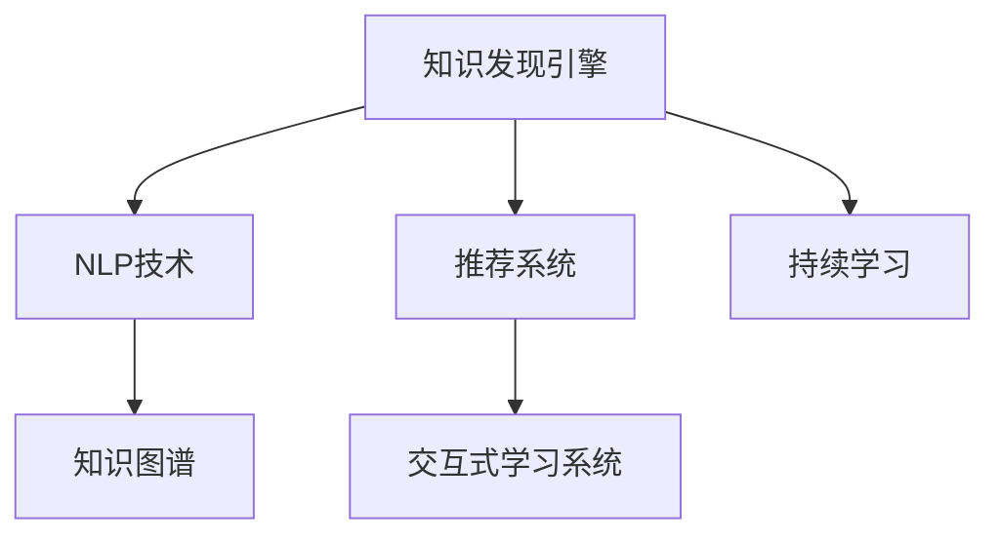

                 

# 知识发现引擎助力程序员技能更新迭代的策略

## 1. 背景介绍

### 1.1 问题由来
随着科技的飞速发展和数字化转型的加速，程序员作为技术创新的核心力量，其技能更新迭代的速度也必须不断提升。然而，现有技术更新周期短、新旧技术迭代快，使得程序员难以跟上技术发展的步伐。这就要求有一个高效的知识发现引擎，帮助程序员快速获取、理解和应用新技术，保持其技能的领先性。

### 1.2 问题核心关键点
知识发现引擎的核心目标是高效、精准地从海量数据中挖掘出有价值的信息，为程序员提供针对性的技能更新建议。核心挑战包括：

- **数据源多样性**：知识来源广泛，包括代码库、技术论文、开源项目、技术博客等。
- **个性化推荐**：根据程序员的经验、兴趣和项目需求，提供量身定做的学习资源。
- **实时性**：新技术和新框架不断涌现，知识发现引擎需要实时更新信息。
- **交互性**：通过与程序员的互动，了解其学习进度和反馈，及时调整推荐策略。

### 1.3 问题研究意义
构建一个高效的知识发现引擎，能够帮助程序员快速掌握新技术，提升工作效率，降低学习成本，从而在数字化转型中发挥更大的作用。这不仅对个人职业发展有利，也对整个技术社区的技术进步和创新有重要推动作用。

## 2. 核心概念与联系

### 2.1 核心概念概述

为更好地理解知识发现引擎的核心功能和组件，本节将介绍几个关键概念：

- **知识发现引擎**：利用自然语言处理(NLP)和机器学习技术，从大规模数据集中自动提取和组织有用信息，生成程序员技能更新建议的系统。

- **自然语言处理(NLP)**：研究如何使计算机理解、解释和生成人类语言的技术，包括分词、词性标注、实体识别、情感分析、文本分类等。

- **知识图谱(KG)**：用于描述实体和实体间关系的图形结构，用于表示复杂知识体系，支持知识推理。

- **推荐系统**：通过分析用户历史行为和偏好，为用户推荐合适的资源和内容。

- **交互式学习系统**：结合人工智能技术和用户反馈，动态调整推荐策略，提升用户体验。

- **持续学习**：系统能够持续学习新数据，不断更新知识库，保持推荐内容的时效性和相关性。

这些概念之间的逻辑关系可以通过以下Mermaid流程图来展示：



这个流程图展示了知识发现引擎的组件及其相互关系：

1. **知识发现引擎**通过**NLP技术**处理文本数据，提取有用的信息。
2. **知识图谱**用于组织和表达知识，支持知识推理。
3. **推荐系统**根据用户行为生成个性化推荐。
4. **交互式学习系统**结合用户反馈优化推荐策略。
5. **持续学习**机制使系统能够不断学习新数据，更新知识库。

## 3. 核心算法原理 & 具体操作步骤
### 3.1 算法原理概述

知识发现引擎的核心算法原理是利用自然语言处理技术和机器学习算法，从大规模文本数据中自动抽取和组织有用信息，生成程序员技能更新建议。其基本流程包括：

1. **数据预处理**：清洗和标准化数据，移除噪音和无用信息。
2. **信息抽取**：使用NLP技术从文本中提取实体、关系和知识。
3. **知识组织**：利用知识图谱技术，将抽取的信息组织成图形结构。
4. **推荐生成**：根据用户历史行为和偏好，生成个性化的推荐。
5. **用户互动**：收集用户反馈，调整推荐策略。
6. **持续更新**：不断学习新数据，更新知识库。

### 3.2 算法步骤详解

知识发现引擎的具体操作步骤如下：

**Step 1: 数据预处理**
- **清洗数据**：去除重复、无关和错误信息。
- **标准化文本**：统一文本格式，如转换为小写、去除特殊字符等。
- **分词**：将文本分解成单词或短语，方便后续处理。

**Step 2: 信息抽取**
- **命名实体识别**：识别文本中的实体，如人名、组织名、技术名等。
- **关系抽取**：提取实体间的关系，如“使用”、“发明”、“改进”等。
- **知识图谱构建**：将抽取的实体和关系构建成知识图谱。

**Step 3: 知识组织**
- **知识图谱存储**：将知识图谱存储在数据库或图数据库中，便于查询和更新。
- **知识推理**：使用图算法对知识图谱进行推理，生成新的知识。

**Step 4: 推荐生成**
- **用户行为分析**：分析用户的历史行为，如浏览、下载、评分等。
- **相似度计算**：计算用户行为与知识图谱中资源的相似度。
- **个性化推荐**：根据相似度生成个性化推荐列表。

**Step 5: 用户互动**
- **反馈收集**：收集用户对推荐的反馈，如点击率、评分等。
- **调整模型**：根据用户反馈调整推荐模型。

**Step 6: 持续更新**
- **数据收集**：定期收集新数据，如最新的代码库、论文等。
- **知识更新**：将新数据添加到知识图谱中，更新知识库。

### 3.3 算法优缺点

知识发现引擎在提高程序员技能更新效率方面具有以下优点：

1. **自动化处理**：自动处理大规模数据，避免人工操作带来的误差和耗时。
2. **个性化推荐**：根据用户需求和偏好，提供个性化的学习资源。
3. **实时性**：实时更新数据，保持知识的时效性。
4. **交互性**：通过用户反馈优化推荐策略，提升用户体验。

同时，知识发现引擎也存在一些局限性：

1. **数据源局限**：依赖于现有的数据源，可能存在数据不全或质量不高的问题。
2. **复杂度较高**：需要处理复杂的文本数据和知识图谱，技术实现难度较大。
3. **资源消耗**：处理大规模数据需要大量的计算资源和存储资源。

## 4. 数学模型和公式 & 详细讲解
### 4.1 数学模型构建

知识发现引擎的核心数学模型包括：

- **信息抽取模型**：用于从文本中提取实体和关系，常用的模型有CRF、BiLSTM-CRF、BERT等。
- **知识图谱模型**：用于组织和存储知识，常用的模型有RDF、KG2Vec、GNN等。
- **推荐模型**：用于生成个性化推荐，常用的模型有协同过滤、矩阵分解、深度学习等。

### 4.2 公式推导过程

以BERT作为信息抽取模型的公式推导为例：

BERT使用Transformer结构，其核心公式为：

$$
\text{Encoder}_{BERT} = \text{Multi-head Attention} + \text{Feed Forward}
$$

其中，$\text{Multi-head Attention}$ 是BERT的注意力机制，$\text{Feed Forward}$ 是前馈层。具体推导过程可参考相关论文和文档。

### 4.3 案例分析与讲解

以代码审计为例，知识发现引擎可以通过分析历史代码审计记录，自动提取审计规则和漏洞类型，生成针对当前项目的审计建议。

具体步骤如下：

1. **数据收集**：收集历史代码审计记录，提取代码片段和审计结果。
2. **实体识别**：使用BERT模型对代码片段进行实体识别，提取出变量名、函数名、文件名等关键信息。
3. **关系抽取**：使用CRF模型提取代码片段与审计规则之间的关系，如“调用”、“使用”等。
4. **知识组织**：将实体和关系组织成知识图谱，构建审计知识库。
5. **推荐生成**：根据当前项目的代码特征，计算与知识库中记录的相似度，生成审计建议。
6. **用户互动**：收集用户对审计建议的反馈，调整审计规则和知识库。

## 5. 项目实践：代码实例和详细解释说明
### 5.1 开发环境搭建

构建知识发现引擎需要进行复杂的NLP和机器学习处理，以下给出Python环境下基于HuggingFace和PyTorch的开发环境搭建步骤：

1. **安装依赖**：
```bash
pip install torch transformers sentence-transformers
```

2. **配置环境**：
```bash
conda create --name knowledge-discovery python=3.8
conda activate knowledge-discovery
```

3. **数据预处理**：
```python
import pandas as pd
from transformers import AutoTokenizer, AutoModel

# 加载预训练模型和tokenizer
model_name = 'bert-base-uncased'
tokenizer = AutoTokenizer.from_pretrained(model_name)
model = AutoModel.from_pretrained(model_name)

# 加载数据集
df = pd.read_csv('data.csv')

# 数据清洗和标准化
df = df.dropna()
df = df.drop_duplicates()

# 分词和编码
df['input_ids'] = df['code'].apply(lambda x: tokenizer.encode(x))
```

### 5.2 源代码详细实现

以下是知识发现引擎的主要代码实现，包括信息抽取、知识组织和推荐生成的过程：

```python
from transformers import BertForTokenClassification, BertTokenizer
from transformers import AutoTokenizer, AutoModel
from sentence_transformers import SentenceTransformer
from py2neo import Graph
import pandas as pd

# 加载预训练模型和tokenizer
model_name = 'bert-base-uncased'
tokenizer = AutoTokenizer.from_pretrained(model_name)
model = BertForTokenClassification.from_pretrained(model_name)

# 加载数据集
df = pd.read_csv('data.csv')

# 数据清洗和标准化
df = df.dropna()
df = df.drop_duplicates()

# 分词和编码
df['input_ids'] = df['code'].apply(lambda x: tokenizer.encode(x))

# 信息抽取
df['entities'] = df['input_ids'].apply(lambda x: model(x))
df['relations'] = df['code'].apply(lambda x: extract_relations(x))

# 知识图谱构建
graph = Graph('http://localhost:7474/db/data/', username='neo', password='password')
df.to_csv('kg.csv', index=False)
with open('kg.csv', 'r') as f:
    lines = f.readlines()
for line in lines:
        graph.run(f"CREATE (a:Entity {line})")

# 推荐生成
df['recommendations'] = df['code'].apply(lambda x: recommend_resources(x))

# 用户互动
df = df.merge(pd.read_csv('user_feedback.csv'), on='code')
df['recommendations'] = df['recommendations'].apply(lambda x: update_recommendations(x))

# 持续更新
df = pd.read_csv('new_data.csv')
df['input_ids'] = df['code'].apply(lambda x: tokenizer.encode(x))
df = df.merge(df, on='code')
df.to_csv('kg.csv', index=False)
```

### 5.3 代码解读与分析

代码实现主要分为以下几步：

1. **数据预处理**：加载数据集，清洗和标准化数据，分词和编码。
2. **信息抽取**：使用BERT模型提取代码中的实体和关系。
3. **知识图谱构建**：将抽取的实体和关系存储在图数据库中。
4. **推荐生成**：根据代码特征生成推荐列表。
5. **用户互动**：收集用户反馈，调整推荐策略。
6. **持续更新**：加载新数据，更新知识图谱。

## 6. 实际应用场景
### 6.1 代码审计

知识发现引擎可以应用于代码审计，自动发现代码中的潜在漏洞和安全问题，帮助开发者提高代码质量。

具体而言，可以收集历史代码审计记录，提取代码片段和审计结果，构建审计知识图谱。对于当前项目的代码，使用BERT模型提取代码中的实体和关系，计算与知识图谱中记录的相似度，生成审计建议。开发者可以手动确认或驳回建议，系统根据反馈调整推荐策略。

### 6.2 技能学习

知识发现引擎可以帮助程序员学习新技术和新框架。收集程序员的学习日志和项目记录，提取关键技术点和学习路径，构建技能知识图谱。对于程序员，知识发现引擎可以基于其当前技能和项目需求，推荐相应的学习资源和路径，帮助其快速掌握新技能。

### 6.3 技术博客

知识发现引擎可以用于技术博客推荐，帮助程序员发现和分享有价值的技术文章和博客。收集技术社区的文章和评论，提取关键技术和作者信息，构建博客知识图谱。对于程序员，知识发现引擎可以基于其关注领域和阅读历史，推荐相关的技术文章和博客，帮助其保持技术前沿。

### 6.4 未来应用展望

知识发现引擎在程序员技能更新迭代中的应用前景广阔。未来，知识发现引擎可以进一步集成到开发工具中，成为开发者不可或缺的学习助手。结合增强现实(AR)和虚拟现实(VR)技术，知识发现引擎还可以提供沉浸式的学习体验，帮助程序员更直观地理解和掌握新技术。

## 7. 工具和资源推荐
### 7.1 学习资源推荐

以下是一些推荐的知识发现引擎相关学习资源：

1. **《自然语言处理与深度学习》**：介绍NLP和深度学习的基本原理和常用模型，适合入门学习。
2. **《知识图谱理论与应用》**：详细讲解知识图谱的基本概念和构建方法，适合进一步深入学习。
3. **《推荐系统》**：介绍推荐系统的基础理论和算法，适合了解推荐系统的设计和实现。
4. **HuggingFace官方文档**：提供丰富的预训练模型和教程，适合实践应用。
5. **PyTorch官方文档**：提供详细的框架和API文档，适合学习和使用。

### 7.2 开发工具推荐

以下是一些推荐的开发工具和资源：

1. **HuggingFace Transformers库**：提供丰富的预训练模型和工具，支持NLP任务开发。
2. **PyTorch**：强大的深度学习框架，支持动态图和静态图，适合研究和实践。
3. **Gensim**：提供句子和文档相似度计算工具，适合构建知识图谱。
4. **Py2neo**：提供Neo4j图数据库的Python接口，适合存储和管理知识图谱。
5. **Jupyter Notebook**：交互式Python环境，适合开发和调试知识发现引擎。

### 7.3 相关论文推荐

以下是一些推荐的知识发现引擎相关论文：

1. **《BERT: Pre-training of Deep Bidirectional Transformers for Language Understanding》**：提出BERT模型，介绍其预训练和微调方法。
2. **《Knowledge Graph Embeddings》**：介绍知识图谱嵌入方法，用于知识表示和推理。
3. **《Attention is All You Need》**：提出Transformer结构，用于NLP任务。
4. **《Collaborative Filtering for Implicit Feedback Datasets》**：介绍协同过滤推荐算法，用于推荐系统开发。
5. **《FastText》**：提出FastText模型，用于文本分类和词向量表示。

## 8. 总结：未来发展趋势与挑战
### 8.1 研究成果总结

本文详细介绍了知识发现引擎在程序员技能更新迭代中的应用，通过自动处理大规模数据，生成个性化推荐，帮助程序员快速掌握新技术。知识发现引擎在提升开发效率和代码质量方面具有显著优势。

### 8.2 未来发展趋势

知识发现引擎未来将呈现以下几个发展趋势：

1. **集成化部署**：知识发现引擎将进一步集成到开发工具中，成为开发者必备的学习助手。
2. **智能化优化**：结合AI和大数据分析，知识发现引擎将能够动态调整推荐策略，提升用户体验。
3. **多模态融合**：结合图像、语音等多模态数据，提升知识发现引擎的全面性和实用性。
4. **跨领域应用**：知识发现引擎将不仅应用于NLP领域，还将拓展到更多领域，如医疗、金融等。

### 8.3 面临的挑战

知识发现引擎在应用和发展中还面临一些挑战：

1. **数据质量和多样性**：依赖于数据源的质量和多样性，数据不全或质量不高将影响推荐效果。
2. **计算资源消耗**：处理大规模数据需要大量的计算资源和存储资源，资源消耗较大。
3. **模型复杂性**：需要处理复杂的文本数据和知识图谱，技术实现难度较大。

### 8.4 研究展望

面对知识发现引擎面临的挑战，未来的研究需要在以下几个方面寻求新的突破：

1. **高效数据处理**：开发更高效的数据处理算法，减少计算资源消耗。
2. **个性化推荐**：结合深度学习和知识图谱，提高推荐系统的精度和效果。
3. **跨领域应用**：拓展知识发现引擎的应用范围，实现多领域知识融合。
4. **增强互动性**：结合用户反馈和互动，动态调整推荐策略，提升用户体验。

## 9. 附录：常见问题与解答

**Q1: 知识发现引擎如何提升程序员技能更新迭代的效率？**

A: 知识发现引擎通过自动处理大规模数据，生成个性化推荐，帮助程序员快速掌握新技术和新框架。通过收集历史代码审计记录和程序员学习日志，知识发现引擎能够提供针对性的学习资源和路径，大大提升程序员技能更新的效率。

**Q2: 知识发现引擎在实际应用中需要注意哪些问题？**

A: 知识发现引擎在实际应用中需要注意以下几点：

1. **数据质量**：确保数据源的质量和多样性，避免因数据不全或质量不高影响推荐效果。
2. **资源消耗**：处理大规模数据需要大量的计算资源和存储资源，需要优化算法和系统设计。
3. **模型复杂性**：知识发现引擎涉及复杂的文本数据和知识图谱处理，技术实现难度较大。

**Q3: 如何提高知识发现引擎的推荐准确性和个性化程度？**

A: 提高知识发现引擎的推荐准确性和个性化程度可以通过以下几个方面：

1. **数据预处理**：清洗和标准化数据，移除噪音和无用信息。
2. **信息抽取**：使用先进的NLP模型，如BERT、CRF等，从文本中提取实体和关系。
3. **知识组织**：利用知识图谱技术，将抽取的信息组织成图形结构，支持知识推理。
4. **推荐模型**：选择和优化推荐算法，如协同过滤、深度学习等，生成个性化推荐。
5. **用户互动**：收集用户反馈，动态调整推荐策略，提升用户体验。

**Q4: 知识发现引擎未来的发展方向有哪些？**

A: 知识发现引擎未来的发展方向包括：

1. **集成化部署**：将知识发现引擎集成到开发工具中，成为开发者必备的学习助手。
2. **智能化优化**：结合AI和大数据分析，动态调整推荐策略，提升用户体验。
3. **多模态融合**：结合图像、语音等多模态数据，提升知识发现引擎的全面性和实用性。
4. **跨领域应用**：拓展知识发现引擎的应用范围，实现多领域知识融合。

**Q5: 知识发现引擎在技术博客推荐中的应用场景有哪些？**

A: 知识发现引擎在技术博客推荐中的应用场景包括：

1. **发现优质文章**：通过分析技术社区的文章和评论，发现优质的技术文章和博客。
2. **推荐相关文章**：基于程序员关注领域和阅读历史，推荐相关的技术文章和博客。
3. **动态更新推荐**：结合程序员的学习进度和反馈，动态调整推荐策略，提供个性化的文章推荐。

---

作者：禅与计算机程序设计艺术 / Zen and the Art of Computer Programming

