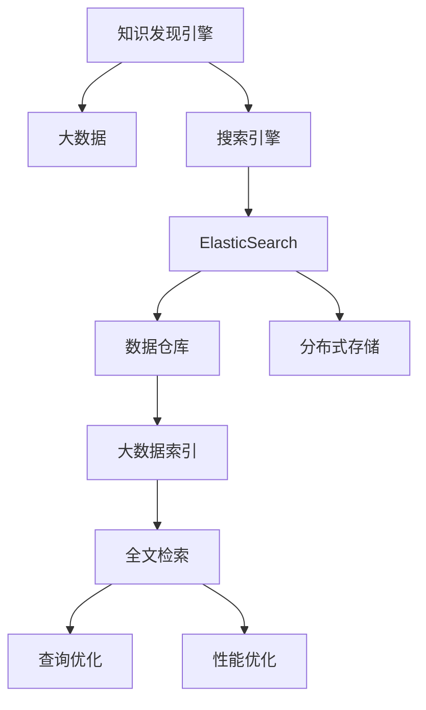

                 

# 知识发现引擎的ElasticSearch集成方案

> 关键词：知识发现引擎, 大数据, 搜索引擎, ElasticSearch, 数据仓库, 分布式存储, 大数据索引, 全文检索, 查询优化, 性能优化

## 1. 背景介绍

### 1.1 问题由来
随着互联网的发展，信息量呈指数级增长，如何从海量数据中提取有价值的知识，成为了各大企业迫切需要解决的问题。传统的单机数据库和关系型数据库已经难以应对大规模数据存储和复杂查询的需求，亟需一种能够高效处理海量数据，并支持实时查询的新型数据库。

知识发现引擎（Knowledge Discovery Engine, KDE）即是一种能够在海量数据中挖掘知识、提供智能分析与决策支持的系统。它通过从大数据中抽取、加工和整理知识，帮助用户快速获取所需信息，优化决策过程。然而，在面对超大规模数据集时，知识发现引擎在数据存储、查询性能和扩展性等方面都面临诸多挑战。

### 1.2 问题核心关键点
在知识发现引擎的构建过程中，如何高效地存储和管理大数据，如何提升查询性能，如何实现系统的可扩展性，成为了亟需解决的问题。这些问题不仅对技术架构提出了更高的要求，也对硬件资源、软件部署和运维管理带来了新的挑战。

## 2. 核心概念与联系

### 2.1 核心概念概述

为更好地理解ElasticSearch在知识发现引擎中的应用，本节将介绍几个密切相关的核心概念：

- **知识发现引擎(KDE)**：用于从大规模数据中挖掘知识，提供智能分析与决策支持的系统。典型的KDE系统包括数据抽取、数据处理、知识提取、知识存储与检索等多个组件。

- **大数据**：指超过传统数据处理软件能力范围的数据集合。它通常具有体量大、多样性、复杂性、实时性和价值密度低等特点。

- **搜索引擎**：用于高效检索数据的系统。它能够通过索引和查询优化技术，快速定位数据，支持全文检索、布尔查询、模糊查询等操作。

- **ElasticSearch**：一种基于Apache Lucene的分布式搜索引擎，提供高性能的全文检索、实时分析、分布式存储等功能，广泛应用于企业级搜索和数据可视化等领域。

- **数据仓库**：用于集中存储和管理企业数据的系统。它通过ETL（Extract, Transform, Load）过程，将不同来源的数据整合在一起，支持数据检索、报表生成和数据挖掘等操作。

- **分布式存储**：指将数据分散存储在多个节点上，提高数据可用性和系统的扩展性。常见的分布式存储系统包括HDFS、Ceph等。

- **大数据索引**：在大规模数据集中快速定位和检索数据的关键技术。通过建立索引，可以显著提升查询效率，支持多种查询方式。

- **全文检索**：指在文本数据中查找包含特定关键词的文档或段落，广泛应用于文本搜索、信息检索、自然语言处理等领域。

- **查询优化**：通过索引优化、算法优化等手段，提高查询的响应速度和准确性，支持复杂的查询逻辑和聚合操作。

- **性能优化**：通过硬件资源优化、算法优化、架构设计等手段，提升系统的处理速度和吞吐量，确保系统稳定运行。

这些核心概念之间的逻辑关系可以通过以下Mermaid流程图来展示：



这个流程图展示了几者之间的关系：

1. 知识发现引擎从大数据中抽取和加工知识。
2. ElasticSearch作为搜索引擎，提供高效的数据检索和分析功能。
3. 数据仓库存储和管理大数据，支持数据整合和查询。
4. 分布式存储将数据分散存储，提高数据可用性和系统扩展性。
5. 大数据索引快速定位和检索数据，支持全文检索和复杂查询。
6. 查询优化和性能优化进一步提升查询速度和系统稳定。

这些概念共同构成了知识发现引擎的基础框架，使其能够高效地从大数据中提取和分析知识，支持决策支持、商业智能等领域的应用。

## 3. 核心算法原理 & 具体操作步骤
### 3.1 算法原理概述

ElasticSearch在知识发现引擎中的应用主要体现在以下几个方面：

- **分布式存储与索引**：ElasticSearch通过分布式存储和实时索引功能，支持大规模数据的存储和检索，保证系统的可扩展性和高可用性。

- **全文检索与查询优化**：ElasticSearch提供强大的全文检索功能，支持布尔查询、模糊查询、通配符查询等多种查询方式。通过查询优化算法，提升查询效率和准确性。

- **高性能计算与实时分析**：ElasticSearch利用内存计算和分布式计算技术，提供高效的数据处理和分析功能，支持实时数据流处理和复杂统计分析。

### 3.2 算法步骤详解

在大数据知识发现引擎中集成ElasticSearch，一般包括以下几个关键步骤：

**Step 1: 数据抽取与加载**
- 从不同数据源抽取结构化、半结构化和非结构化数据。
- 对抽取的数据进行清洗和转换，生成适合ElasticSearch索引的格式。

**Step 2: 索引与数据模型设计**
- 根据业务需求，设计适合ElasticSearch的数据模型，包括文档类型、字段类型和索引设置。
- 创建ElasticSearch索引，定义数据结构，包括ID、字段名、数据类型、搜索字段、映射关系等。

**Step 3: 数据导入与实时索引**
- 将清洗和转换后的数据导入ElasticSearch索引，支持批量插入和增量更新。
- 启用实时索引功能，保证新数据即时被系统检索和处理。

**Step 4: 查询优化与性能调优**
- 利用ElasticSearch提供的查询优化功能，如索引合并、分片配置等，提升查询效率。
- 采用合理的查询参数和配置，优化查询速度和系统性能。
- 监控系统性能指标，及时调整资源配置和算法参数。

**Step 5: 应用集成与业务对接**
- 将ElasticSearch集成到知识发现引擎的查询模块，提供高效的数据检索和分析服务。
- 通过API接口、插件等技术，实现与其他业务系统的对接和数据共享。

**Step 6: 数据治理与安全管理**
- 建立数据治理机制，包括数据质量监控、数据安全审计等，确保数据可信和安全。
- 采用访问控制、数据加密等手段，保护敏感数据，防止数据泄露和滥用。

### 3.3 算法优缺点

ElasticSearch在大数据知识发现引擎中的应用，具有以下优点：

- **分布式存储与高可用性**：ElasticSearch通过分布式存储和冗余机制，提供高可用性和容错性。
- **高性能查询与实时分析**：ElasticSearch支持全文检索和复杂查询，提供高效的数据检索和分析功能。
- **灵活的数据模型设计**：ElasticSearch支持丰富的数据模型设计，能够适应不同类型和规模的数据。

同时，ElasticSearch也存在一些缺点：

- **配置复杂**：ElasticSearch的配置和管理相对复杂，需要专业的运维人员进行维护。
- **内存消耗较大**：ElasticSearch的索引和内存计算功能，对系统内存资源要求较高。
- **查询优化难度较大**：在大规模数据下，查询优化和性能调优需要较多经验和技巧。

### 3.4 算法应用领域

ElasticSearch在大数据知识发现引擎中的应用，主要涵盖以下几个领域：

- **金融风控**：金融机构利用ElasticSearch检索和分析大量交易数据，实时监控风险事件，提升风险管理能力。
- **电商推荐**：电商平台通过ElasticSearch检索用户行为数据，实时生成个性化推荐，提升用户购物体验。
- **社交网络分析**：社交媒体公司利用ElasticSearch分析用户互动数据，提取社交关系和用户兴趣，优化社交网络内容推荐。
- **智能客服**：客服系统通过ElasticSearch检索历史聊天记录和FAQ，提升自动化客服的匹配度和满意度。
- **医疗健康**：医院通过ElasticSearch分析患者数据，提供精准的诊疗方案，改善患者治疗效果。
- **物联网监测**：物联网设备通过ElasticSearch实时收集和分析设备数据，实现设备运行状态监测和异常预警。

## 4. 数学模型和公式 & 详细讲解  
### 4.1 数学模型构建

在大数据知识发现引擎中，ElasticSearch主要用于提供高效的数据检索和分析功能。其数学模型主要包括以下几个方面：

- **索引建立与查询优化**：ElasticSearch通过建立倒排索引(Inverted Index)，快速定位包含关键词的文档。倒排索引的构建基于以下几个核心公式：
  $$
  \text{Inverted Index} = \{\text{Term} \rightarrow \{\text{Document}\} \}
  $$

- **全文检索与布尔查询**：ElasticSearch支持全文检索和布尔查询，其核心算法包括：
  $$
  \text{Retrieval Vector} = \{\text{Term} \rightarrow \{\text{Document}\} \} 
  $$
  $$
  \text{Query Score} = \sum_{\text{Term}} \text{Score} 
  $$

### 4.2 公式推导过程

在ElasticSearch的全文检索和布尔查询过程中，主要涉及以下几个核心公式的推导：

- **倒排索引构建**：
  $$
  \text{Index} = \{\text{Document} \rightarrow \{\text{Term}\} \}
  $$
  $$
  \text{Inverted Index} = \{\text{Term} \rightarrow \{\text{Document}\} \}
  $$

  其中，Index表示文档集，Document表示文档，Term表示词汇。

- **文档评分计算**：
  $$
  \text{Query Score} = \sum_{\text{Term}} \text{Score} 
  $$
  $$
  \text{Term Score} = \log(1+\text{Term Frequency} \times \text{Inverse Document Frequency})
  $$

  其中，Term Frequency表示词汇在文档中出现的频率，Inverse Document Frequency表示词汇在文档集中的重要性。

- **布尔查询优化**：
  $$
  \text{Boolean Query} = \text{A AND (B OR C)}
  $$
  $$
  \text{Boolean Query Score} = \text{Query Score}(\text{A}) + \text{Query Score}(\text{B}) + \text{Query Score}(\text{C})
  $$

  其中，A、B、C表示不同逻辑关系下的子查询，Query Score表示子查询的评分。

### 4.3 案例分析与讲解

以电商推荐系统为例，分析ElasticSearch在其中的应用。

电商推荐系统通常需要实时分析用户行为数据，生成个性化推荐。ElasticSearch通过索引和全文检索技术，快速定位用户行为数据，计算用户兴趣标签，生成推荐结果。

具体步骤如下：

1. **数据抽取与加载**：从用户行为日志中抽取用户ID、购买记录、浏览记录等数据，并转换为ElasticSearch索引格式。
2. **索引与数据模型设计**：设计用户行为数据模型，包括用户ID、时间戳、购买记录、浏览记录等字段。创建ElasticSearch索引，并定义好查询字段和映射关系。
3. **数据导入与实时索引**：将用户行为数据导入ElasticSearch索引，并启用实时索引功能，保证新数据即时被检索和分析。
4. **查询优化与性能调优**：利用ElasticSearch的查询优化功能，如索引合并、分片配置等，提升查询效率。设置合理的查询参数，优化查询速度和系统性能。
5. **应用集成与业务对接**：将ElasticSearch集成到推荐系统中，提供高效的用户行为数据检索和分析服务。通过API接口，实现与其他业务系统的对接和数据共享。
6. **数据治理与安全管理**：建立数据治理机制，包括数据质量监控、数据安全审计等，确保数据可信和安全。采用访问控制、数据加密等手段，保护敏感数据，防止数据泄露和滥用。

通过ElasticSearch的应用，电商推荐系统能够实时分析用户行为数据，准确把握用户兴趣，提供个性化推荐，提升用户购物体验。

## 5. 项目实践：代码实例和详细解释说明
### 5.1 开发环境搭建

在进行ElasticSearch集成实践前，我们需要准备好开发环境。以下是使用Python进行ElasticSearch开发的环境配置流程：

1. 安装ElasticSearch：从官网下载并安装ElasticSearch，确保版本与ElasticSearch集成方案兼容。

2. 安装Python库：
  ```bash
  pip install elasticsearch
  ```

3. 安装其他依赖库：
  ```bash
  pip install pandas numpy requests
  ```

完成上述步骤后，即可在开发环境中开始ElasticSearch集成实践。

### 5.2 源代码详细实现

下面以电商推荐系统为例，给出使用ElasticSearch进行数据检索和个性化推荐开发的Python代码实现。

首先，定义ElasticSearch客户端连接：

```python
from elasticsearch import Elasticsearch

es = Elasticsearch([{'host': 'localhost', 'port': 9200}])
```

然后，定义数据模型和查询模板：

```python
from elasticsearch_dsl import Document, Search, Q

class UserBehavior(Document):
    user_id = Text()
    time_stamp = DateTime()
    purchase_records = Keyword()
    browsed_records = Keyword()

    def __init__(self, user_id, time_stamp, purchase_records, browsed_records, **kwargs):
        super(UserBehavior, self).__init__(**kwargs)
        self.user_id = user_id
        self.time_stamp = time_stamp
        self.purchase_records = purchase_records
        self.browsed_records = browsed_records

query_template = Q("bool", must=[Q("match", user_id=user_id), Q("range", time_stamp={"gte": time_stamp})])
```

接着，定义查询和推荐函数：

```python
def search_user_behavior(user_id, time_stamp):
    query = query_template.filter(user_id=user_id).filter(time_stamp__gte=time_stamp)
    result = UserBehavior.search(query)
    return result

def recommend(user_id, time_stamp):
    result = search_user_behavior(user_id, time_stamp)
    if not result:
        return []
    
    purchase_records = result.values()[0].purchase_records
    browsed_records = result.values()[0].browsed_records
    
    # 计算用户兴趣标签
    user_interest = {}
    for record in purchase_records + browsed_records:
        if record not in user_interest:
            user_interest[record] = 1
        else:
            user_interest[record] += 1
    
    # 生成推荐结果
    recommendations = []
    for record in user_interest:
        if record in purchase_records:
            recommendations.append(record)
        elif record in browsed_records and user_interest[record] > 3:
            recommendations.append(record)
    
    return recommendations
```

最后，启动推荐系统：

```python
while True:
    user_id = input("请输入用户ID：")
    time_stamp = input("请输入时间戳：")
    
    recommendations = recommend(user_id, time_stamp)
    print("推荐结果：", recommendations)
```

以上就是使用ElasticSearch进行电商推荐系统开发的完整代码实现。可以看到，借助ElasticSearch的索引和查询功能，代码实现变得简洁高效。

### 5.3 代码解读与分析

让我们再详细解读一下关键代码的实现细节：

**UserBehavior类**：
- 定义了用户行为数据模型，包括用户ID、时间戳、购买记录、浏览记录等字段。
- 提供了数据模型映射关系，方便数据存储和检索。

**query_template**：
- 定义了查询模板，使用布尔查询（Bool Query）和匹配查询（Match Query），筛选出指定用户和时间段的浏览记录。

**search_user_behavior函数**：
- 使用查询模板，进行用户行为数据检索，返回匹配结果。
- 如果检索结果为空，则返回空列表。

**recommend函数**：
- 使用检索结果，计算用户兴趣标签。
- 生成推荐结果，推荐近期购买记录和浏览记录中用户兴趣高的商品。
- 返回推荐商品列表。

**推荐系统启动**：
- 循环读取用户输入的用户ID和时间戳。
- 调用推荐函数，获取推荐商品列表，并输出。

通过以上代码实现，ElasticSearch在电商推荐系统中的应用得以实现。可以看到，借助ElasticSearch的查询优化和索引功能，推荐系统能够实时检索用户行为数据，生成个性化推荐，提升用户体验。

## 6. 实际应用场景
### 6.1 智能客服系统

智能客服系统通过ElasticSearch实时检索用户历史聊天记录和FAQ，提升自动化客服的匹配度和满意度。系统可以自动处理常见问题，快速响应用户请求，减少人工干预。同时，通过分析用户行为数据，系统还可以提供个性化的服务建议和产品推荐，进一步提升用户满意度。

### 6.2 金融风控系统

金融机构利用ElasticSearch检索和分析大量交易数据，实时监控风险事件，提升风险管理能力。系统可以实时检索交易数据，提取异常交易行为，生成风险报告，帮助风险分析师快速定位问题，采取措施。

### 6.3 医疗健康系统

医院通过ElasticSearch分析患者数据，提供精准的诊疗方案，改善患者治疗效果。系统可以实时检索患者历史数据，提取关键信息，支持医生进行个性化诊疗和药物推荐，提升诊疗效率和准确性。

### 6.4 智能制造系统

智能制造系统利用ElasticSearch检索和分析设备数据，实现设备运行状态监测和异常预警。系统可以实时检索设备数据，提取异常信号，生成设备维护建议，帮助工程师及时排查问题，减少设备故障率。

## 7. 工具和资源推荐
### 7.1 学习资源推荐

为了帮助开发者系统掌握ElasticSearch在大数据知识发现引擎中的应用，这里推荐一些优质的学习资源：

1. **ElasticSearch官方文档**：ElasticSearch的官方文档，提供了详尽的API接口和操作说明，是学习ElasticSearch的必备资源。

2. **ElasticSearch快速入门教程**：由Elastic公司提供的快速入门教程，适合初学者快速上手ElasticSearch。

3. **ElasticSearch实战指南**：由著名ElasticStack专家撰写，介绍了ElasticSearch的实战经验和技巧，适合进阶学习。

4. **ElasticSearch搜索引擎实战**：详细讲解了ElasticSearch的核心概念和使用方法，适合深入理解ElasticSearch的工作原理。

5. **KDE与ElasticSearch集成应用案例**：具体介绍KDE与ElasticSearch集成的应用案例，适合了解ElasticSearch在大数据知识发现引擎中的实际应用。

通过对这些资源的学习实践，相信你一定能够快速掌握ElasticSearch在大数据知识发现引擎中的应用，并用于解决实际的NLP问题。

### 7.2 开发工具推荐

高效的开发离不开优秀的工具支持。以下是几款用于ElasticSearch开发和部署的工具：

1. **Kibana**：ElasticSearch的可视化工具，提供丰富的图表展示和数据探索功能，方便数据分析和报告生成。

2. **Logstash**：ElasticSearch的数据收集和预处理工具，支持日志解析、数据过滤和格式转换，适合大规模数据处理。

3. **ElasticSearch-Bulk**：ElasticSearch的批量处理工具，支持快速批量插入和更新数据，适合数据导入和导出。

4. **Curator**：ElasticSearch的数据管理和删除工具，支持索引压缩、数据迁移、索引删除等操作，适合数据治理和清理。

5. **X-Pack**：ElasticSearch的扩展模块，提供监控、安全、可视化等功能，适合生产环境部署和管理。

6. **Beam**：Apache Beam数据处理框架，支持ElasticSearch的数据流处理和实时分析，适合大数据分析和实时计算。

合理利用这些工具，可以显著提升ElasticSearch在大数据知识发现引擎中的开发效率，加快创新迭代的步伐。

### 7.3 相关论文推荐

ElasticSearch在大数据知识发现引擎中的应用，代表了大数据技术的发展方向。以下是几篇奠基性的相关论文，推荐阅读：

1. **ElasticSearch的论文**：ElasticSearch的官方论文，介绍了ElasticSearch的核心算法和设计思想。

2. **ElasticSearch的分布式存储**：详细讲解了ElasticSearch的分布式存储机制，介绍了分片、副本、数据平衡等核心概念。

3. **ElasticSearch的全文检索**：介绍了ElasticSearch的全文检索算法，包括倒排索引、匹配查询、布尔查询等。

4. **ElasticSearch的实时分析**：介绍了ElasticSearch的实时分析功能，包括数据流处理、聚合计算、实时统计等。

5. **ElasticSearch的数据治理**：介绍了ElasticSearch的数据治理机制，包括数据质量监控、数据安全审计等。

这些论文代表了大数据技术的发展脉络，通过学习这些前沿成果，可以帮助研究者把握学科前进方向，激发更多的创新灵感。

## 8. 总结：未来发展趋势与挑战

### 8.1 研究成果总结

本文对ElasticSearch在大数据知识发现引擎中的应用进行了全面系统的介绍。首先阐述了ElasticSearch在知识发现引擎中的核心概念和架构，明确了ElasticSearch在大数据存储、查询性能和系统扩展性方面的独特价值。其次，从原理到实践，详细讲解了ElasticSearch的索引建立、查询优化和性能调优等关键步骤，给出了ElasticSearch应用的具体代码实现。同时，本文还广泛探讨了ElasticSearch在智能客服、金融风控、医疗健康等多个领域的应用前景，展示了ElasticSearch在大数据知识发现引擎中的广泛应用。

通过本文的系统梳理，可以看到，ElasticSearch在大数据知识发现引擎中的应用已经成为行业标准，极大地提升了数据检索和分析的效率和准确性。ElasticSearch通过分布式存储和实时索引功能，支持大规模数据的存储和检索，保证系统的可扩展性和高可用性。ElasticSearch利用内存计算和分布式计算技术，提供高效的数据处理和分析功能，支持实时数据流处理和复杂统计分析。

### 8.2 未来发展趋势

展望未来，ElasticSearch在大数据知识发现引擎中的应用将呈现以下几个发展趋势：

1. **分布式计算与实时分析**：ElasticSearch将进一步融合分布式计算技术，支持更大规模的数据处理和实时分析，提升系统的处理能力和响应速度。

2. **数据治理与安全防护**：ElasticSearch将加强数据治理和安全防护，建立数据质量监控、数据安全审计等机制，确保数据可信和安全。

3. **跨平台集成与扩展**：ElasticSearch将支持更多数据源和格式，与更多平台集成，提升系统的兼容性和扩展性。

4. **智能分析与数据可视化**：ElasticSearch将结合机器学习和大数据分析技术，提供智能分析和数据可视化功能，提升数据洞察能力。

5. **边缘计算与移动端应用**：ElasticSearch将支持边缘计算和移动端应用，提供轻量级的服务接口，支持离线数据处理和移动设备数据同步。

6. **跨语言与多模态数据处理**：ElasticSearch将支持多种语言和多模态数据处理，提升系统对不同数据源和格式的支持能力。

这些趋势凸显了ElasticSearch在大数据知识发现引擎中的广阔前景。这些方向的探索发展，必将进一步提升ElasticSearch在大数据知识发现引擎中的性能和应用范围，为数据智能应用带来新的突破。

### 8.3 面临的挑战

尽管ElasticSearch在大数据知识发现引擎中的应用已经取得了瞩目成就，但在迈向更加智能化、普适化应用的过程中，它仍面临着诸多挑战：

1. **配置复杂**：ElasticSearch的配置和管理相对复杂，需要专业的运维人员进行维护。

2. **内存消耗较大**：ElasticSearch的索引和内存计算功能，对系统内存资源要求较高。

3. **查询优化难度较大**：在大规模数据下，查询优化和性能调优需要较多经验和技巧。

4. **数据治理与隐私保护**：在数据治理和隐私保护方面，ElasticSearch需要进一步完善，确保数据可信和安全。

5. **跨平台兼容与互操作性**：ElasticSearch需要支持更多数据源和格式，提升系统的兼容性和互操作性。

6. **边缘计算与移动端优化**：ElasticSearch需要优化边缘计算和移动端应用，提升系统的轻量化和实时性。

这些挑战需要通过不断优化ElasticSearch的技术架构和运维机制，逐步克服。只有不断完善ElasticSearch的功能和性能，才能真正实现其在大数据知识发现引擎中的全面应用。

### 8.4 研究展望

面对ElasticSearch在大数据知识发现引擎中所面临的挑战，未来的研究需要在以下几个方面寻求新的突破：

1. **分布式计算优化**：优化ElasticSearch的分布式计算机制，提升系统的处理能力和响应速度。

2. **数据治理与隐私保护**：加强数据治理和安全防护，建立数据质量监控、数据安全审计等机制，确保数据可信和安全。

3. **跨平台兼容与互操作性**：支持更多数据源和格式，提升系统的兼容性和互操作性。

4. **智能分析与数据可视化**：结合机器学习和大数据分析技术，提供智能分析和数据可视化功能，提升数据洞察能力。

5. **边缘计算与移动端优化**：优化边缘计算和移动端应用，提供轻量级的服务接口，支持离线数据处理和移动设备数据同步。

6. **跨语言与多模态数据处理**：支持多种语言和多模态数据处理，提升系统对不同数据源和格式的支持能力。

这些研究方向的探索，必将引领ElasticSearch在大数据知识发现引擎中的持续进步，为数据智能应用带来新的突破。面向未来，ElasticSearch需要与其他大数据技术进行更深入的融合，共同推动数据智能应用的不断演进。

## 9. 附录：常见问题与解答

**Q1：如何选择合适的索引设置？**

A: 选择合适的索引设置是ElasticSearch应用中的关键环节。一般需要根据数据类型和查询需求进行配置：

- **数据类型**：定义索引中字段的类型，如Text、Date、Integer等，确保数据的存储和检索效率。
- **字段映射**：定义字段的映射关系，如指定分词器、指定查询字段等，确保查询的准确性和高效性。
- **索引设置**：定义索引的分片数、副本数、存储策略等，确保系统的可扩展性和高可用性。

**Q2：如何进行ElasticSearch的查询优化？**

A: 进行ElasticSearch的查询优化，需要根据具体情况进行多方面的调整：

- **查询构建**：使用高效的查询构建方法，如布尔查询、复合查询、嵌套查询等，确保查询的准确性和高效性。
- **索引合并**：利用ElasticSearch的索引合并功能，定期合并分片，减少索引碎片，提升查询效率。
- **分片配置**：合理配置索引的分片数和副本数，确保系统的扩展性和高可用性。
- **查询参数**：优化查询参数，如缓存大小、字段选择等，提升查询速度和系统性能。

**Q3：如何进行ElasticSearch的性能调优？**

A: 进行ElasticSearch的性能调优，需要从多个方面进行优化：

- **硬件资源优化**：确保系统有足够的CPU、内存和存储资源，支持大规模数据处理和实时分析。
- **查询优化**：优化查询构建和索引设计，提升查询效率和系统性能。
- **分布式优化**：优化分布式计算机制，支持更大规模的数据处理和实时分析。
- **监控告警**：实时监控系统性能指标，及时调整资源配置和算法参数，确保系统稳定运行。

**Q4：如何进行ElasticSearch的数据治理？**

A: 进行ElasticSearch的数据治理，需要建立数据质量监控、数据安全审计等机制：

- **数据质量监控**：建立数据质量监控机制，实时检测数据的完整性、准确性和一致性，确保数据可信。
- **数据安全审计**：建立数据安全审计机制，记录和监控数据的访问和使用情况，防止数据泄露和滥用。
- **数据治理工具**：使用数据治理工具，如Curator、Logstash等，进行数据清理、备份和迁移，确保数据安全。

**Q5：如何进行ElasticSearch的跨平台集成？**

A: 进行ElasticSearch的跨平台集成，需要考虑以下因素：

- **API接口**：提供统一的API接口，支持多种平台和应用系统集成。
- **数据格式**：支持多种数据格式，如JSON、CSV、XML等，确保数据兼容性。
- **安全性**：确保数据传输和存储的安全性，防止数据泄露和滥用。
- **分布式部署**：支持分布式部署，确保系统的高可用性和可扩展性。

通过以上常见问题的解答，相信你一定能够全面掌握ElasticSearch在大数据知识发现引擎中的应用，并用于解决实际的NLP问题。

---

作者：禅与计算机程序设计艺术 / Zen and the Art of Computer Programming

