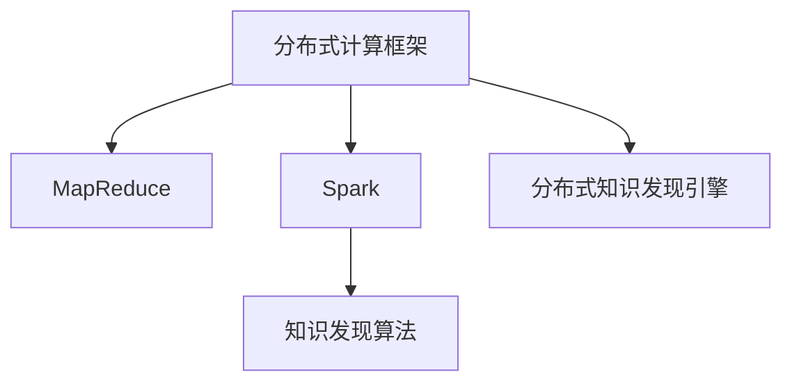

                 

# 知识发现引擎的分布式架构设计与实现

## 1. 背景介绍

### 1.1 问题由来
随着大数据时代的来临，数据量呈爆炸性增长。如何在海量数据中快速高效地发现有用的知识，成为了一个亟待解决的重要问题。传统的知识发现方式往往依赖于人工筛选、统计分析等方法，不仅耗时耗力，还难以发现数据中的深层次关系。为此，人们提出了使用智能算法自动进行知识发现的方案，即知识发现引擎(Knowledge Discovery Engine, KDE)。

知识发现引擎是一种通过自动化算法发现数据中潜在知识的工具，可以从大量数据中提取有价值的信息和模式，应用于医疗、金融、电商、社交等多个领域。例如，在医疗领域，通过知识发现引擎可以从患者电子病历中挖掘出重要的疾病特征和诊疗模式，辅助医生进行精准诊疗；在电商领域，知识发现引擎可以发现商品之间的关联规则，优化库存管理、推荐系统等业务。

然而，随着数据量的不断增长，单机的知识发现引擎难以处理大规模数据，必须通过分布式架构扩展其处理能力和吞吐量。因此，设计高效的分布式知识发现引擎成为了目前研究的热点和难点。

### 1.2 问题核心关键点
分布式知识发现引擎的核心设计挑战在于如何高效地处理大规模数据集，并实现各个节点之间的协同工作。具体来说，需要解决以下几个关键问题：

1. **数据分片与分配**：如何将大规模数据集高效地分配到各个节点上，使得每个节点处理的负荷均衡，同时保证数据的完整性和一致性。
2. **任务调度与协调**：如何动态地调度和协调各个节点上的任务，使得整体系统能够高效地运行，同时支持并行和串行任务的处理。
3. **通信与同步**：如何高效地进行节点之间的数据交换和状态同步，避免通信瓶颈和数据丢失，同时保证各个节点之间的协同工作。
4. **容错与恢复**：如何在节点故障或网络中断等异常情况下，保证系统的鲁棒性和可靠性，同时快速恢复故障节点的工作。

## 2. 核心概念与联系

### 2.1 核心概念概述

为了更好地理解分布式知识发现引擎的设计与实现，我们首先介绍几个核心概念：

1. **分布式计算框架**：分布式计算框架是一组用于并行处理大规模数据集的计算工具和库，例如Hadoop、Spark、Flink等。这些框架提供了数据分布、任务调度和数据交换等功能，支持分布式知识发现引擎的设计与实现。

2. **MapReduce**：MapReduce是一种经典的分布式计算框架，用于大规模数据集的并行处理。MapReduce将数据划分为若干个分片，分配给多个节点并行处理，最终将各个节点的结果汇总得到全局结果。

3. **Spark**：Spark是一个快速、通用的分布式计算框架，支持内存计算和弹性分布式数据处理。Spark提供了丰富的API和库，可以方便地实现各种分布式算法，包括知识发现引擎。

4. **知识发现算法**：知识发现算法是一组用于自动发现数据中有价值信息的算法，例如关联规则挖掘、分类、聚类、异常检测等。这些算法可以在分布式环境中进行并行计算，加速知识发现的效率。

这些核心概念之间的逻辑关系可以通过以下Mermaid流程图来展示：



这个流程图展示了分布式知识发现引擎的设计与实现流程：

1. 分布式计算框架提供了分布式数据处理和任务调度的基础功能。
2. MapReduce是一种经典的分布式计算模型，用于并行处理大规模数据集。
3. Spark是一个快速、通用的分布式计算框架，支持内存计算和弹性分布式数据处理。
4. 知识发现算法是一组用于自动发现数据中有价值信息的算法，可以在分布式环境中进行并行计算。
5. 分布式知识发现引擎将分布式计算框架、MapReduce、Spark和知识发现算法结合起来，实现大规模数据集的高效知识发现。

这些概念共同构成了分布式知识发现引擎的设计基础，使得其能够在处理大规模数据集时具有更高的效率和可扩展性。

## 3. 核心算法原理 & 具体操作步骤

### 3.1 算法原理概述

分布式知识发现引擎的设计基于分布式计算框架和MapReduce模型，通过并行处理大规模数据集，实现高效的知识发现。其核心算法原理包括以下几个步骤：

1. **数据分片与分配**：将原始数据集划分为若干个分片，并分配到各个计算节点上进行处理。
2. **任务调度与协调**：动态调度和协调各个节点上的任务，使得整体系统能够高效地运行，同时支持并行和串行任务的处理。
3. **通信与同步**：高效地进行节点之间的数据交换和状态同步，避免通信瓶颈和数据丢失，同时保证各个节点之间的协同工作。
4. **容错与恢复**：在节点故障或网络中断等异常情况下，保证系统的鲁棒性和可靠性，同时快速恢复故障节点的工作。

### 3.2 算法步骤详解

下面详细介绍分布式知识发现引擎的具体实现步骤：

**Step 1: 数据预处理与分片**

1. **数据预处理**：对原始数据进行清洗、去重、格式转换等预处理操作，确保数据的质量和完整性。
2. **数据分片**：将预处理后的数据集划分为若干个大小相等的分片，分配到各个计算节点上进行处理。分片的大小可以根据计算节点的处理能力和数据量的多少进行调整。

**Step 2: 任务调度与协调**

1. **任务调度**：动态调度各个节点上的任务，使得每个节点处理的负荷均衡，同时保证数据的完整性和一致性。可以采用MapReduce模型的数据并行处理方式，每个节点处理一个分片的数据。
2. **任务协调**：使用分布式计算框架提供的任务协调机制，确保各个节点之间的协同工作。例如，Spark中的RDD（弹性分布式数据集）提供了丰富的API，支持任务之间的数据依赖和调度。

**Step 3: 数据交换与同步**

1. **数据交换**：节点之间通过网络传输数据，交换中间结果和最终结果。数据交换的方式可以采用Spark中的Shuffle API，实现节点之间的数据交换和聚合。
2. **状态同步**：节点之间通过心跳机制进行状态同步，确保各个节点的状态一致。例如，Spark中的worker节点会定期发送心跳包，报告当前的状态和处理进度。

**Step 4: 容错与恢复**

1. **节点故障处理**：在节点故障或网络中断等异常情况下，分布式知识发现引擎需要能够快速恢复故障节点的工作。可以采用检查点机制，定期保存当前状态，在系统故障时恢复到最近的状态。
2. **异常情况处理**：在节点故障或网络中断等异常情况下，分布式知识发现引擎需要能够处理异常情况，避免数据丢失和系统崩溃。可以采用重试机制和数据冗余机制，提高系统的鲁棒性。

### 3.3 算法优缺点

分布式知识发现引擎具有以下优点：

1. **高效处理大规模数据**：分布式计算框架提供了并行处理的能力，能够高效地处理大规模数据集，加速知识发现的效率。
2. **可扩展性高**：通过增加计算节点，可以轻松扩展系统的处理能力和吞吐量，满足大规模数据集的处理需求。
3. **容错性强**：通过节点故障处理和异常情况处理，保证了系统的鲁棒性和可靠性，避免了数据丢失和系统崩溃。

同时，分布式知识发现引擎也存在以下缺点：

1. **通信开销大**：节点之间的数据交换和状态同步需要大量通信开销，可能会成为系统的瓶颈。
2. **复杂度高**：分布式知识发现引擎的设计和实现较为复杂，需要考虑数据分片、任务调度、数据交换等多个方面。
3. **资源消耗大**：分布式知识发现引擎需要占用大量的计算资源和网络带宽，可能会对系统的性能产生影响。

## 4. 数学模型和公式 & 详细讲解 & 举例说明

### 4.1 数学模型构建

分布式知识发现引擎的数学模型构建基于分布式计算框架和MapReduce模型，可以采用如下的数学表达式进行描述：

设原始数据集为 $D$，数据集划分为 $k$ 个大小相等的分片 $D_1, D_2, ..., D_k$，每个分片分配到 $n$ 个计算节点上进行处理。节点 $i$ 处理分片 $D_{ij}$，其中 $j=1,2,...,n$。知识发现算法 $A$ 在每个节点上执行 $n$ 次，每次处理一个分片。最终结果为 $R$。

**数据分片**：将原始数据集 $D$ 划分为 $k$ 个大小相等的分片 $D_1, D_2, ..., D_k$，分配到 $n$ 个计算节点上进行处理。设数据集 $D$ 的大小为 $N$，每个分片的大小为 $N/k$，即 $D_{ij} \sim U(D)$，其中 $U$ 表示均匀分布。

**任务调度**：动态调度各个节点上的任务，使得每个节点处理的负荷均衡，同时保证数据的完整性和一致性。设节点 $i$ 处理分片 $D_{ij}$，其中 $j=1,2,...,n$。

**数据交换与同步**：节点之间通过网络传输数据，交换中间结果和最终结果。设节点 $i$ 和节点 $j$ 交换数据的大小为 $S_{ij}$，节点之间通过心跳机制进行状态同步。

**容错与恢复**：在节点故障或网络中断等异常情况下，分布式知识发现引擎需要能够快速恢复故障节点的工作。设节点 $i$ 故障的概率为 $p_i$，系统在故障节点恢复后的处理时间为 $t_i$。

### 4.2 公式推导过程

下面进行分布式知识发现引擎的数学模型推导：

1. **数据分片与分配**：设原始数据集 $D$ 的大小为 $N$，每个分片的大小为 $N/k$，即 $D_{ij} \sim U(D)$，其中 $U$ 表示均匀分布。

2. **任务调度与协调**：设节点 $i$ 处理分片 $D_{ij}$，其中 $j=1,2,...,n$。任务调度方式可以采用MapReduce模型的数据并行处理方式，每个节点处理一个分片的数据。

3. **通信与同步**：设节点 $i$ 和节点 $j$ 交换数据的大小为 $S_{ij}$，节点之间通过心跳机制进行状态同步。

4. **容错与恢复**：设节点 $i$ 故障的概率为 $p_i$，系统在故障节点恢复后的处理时间为 $t_i$。

### 4.3 案例分析与讲解

以关联规则挖掘为例，说明分布式知识发现引擎的实现过程：

1. **数据预处理与分片**：对原始数据进行清洗、去重、格式转换等预处理操作，确保数据的质量和完整性。将预处理后的数据集划分为若干个大小相等的分片，分配到各个计算节点上进行处理。

2. **任务调度与协调**：采用MapReduce模型的数据并行处理方式，每个节点处理一个分片的数据。使用Spark中的RDD API进行任务调度，确保各个节点之间的协同工作。

3. **数据交换与同步**：节点之间通过网络传输数据，交换中间结果和最终结果。使用Spark中的Shuffle API实现节点之间的数据交换和聚合。

4. **容错与恢复**：采用检查点机制，定期保存当前状态，在系统故障时恢复到最近的状态。采用重试机制和数据冗余机制，提高系统的鲁棒性。

## 5. 项目实践：代码实例和详细解释说明

### 5.1 开发环境搭建

在进行分布式知识发现引擎的实践前，我们需要准备好开发环境。以下是使用Python进行Spark开发的环境配置流程：

1. 安装Anaconda：从官网下载并安装Anaconda，用于创建独立的Python环境。

2. 创建并激活虚拟环境：
```bash
conda create -n spark-env python=3.8 
conda activate spark-env
```

3. 安装Spark：根据Hadoop版本，从官网获取对应的安装命令。例如：
```bash
conda install pyspark -c conda-forge
```

4. 安装PySpark：
```bash
pip install pyspark
```

5. 安装Spark所需的其他工具包：
```bash
pip install numpy pandas scikit-learn matplotlib tqdm jupyter notebook ipython
```

完成上述步骤后，即可在`spark-env`环境中开始分布式知识发现引擎的实践。

### 5.2 源代码详细实现

下面我们以关联规则挖掘为例，给出使用PySpark进行分布式知识发现引擎的PyTorch代码实现。

首先，定义数据集和分片大小：

```python
from pyspark.sql import SparkSession

spark = SparkSession.builder.appName("Association Rule Mining").getOrCreate()

# 定义数据集
data = spark.read.csv("data.csv", header=True, inferSchema=True)

# 数据预处理
data = data.dropDuplicates().dropna()

# 定义分片大小
num_partitions = 4
data = data.repartition(num_partitions)
```

然后，定义Map函数和Reduce函数：

```python
from pyspark.sql.functions import col, split

# Map函数：计算各个分片的数据计数
def map_func(row):
    itemset = split(row["items"], ",")
    freq = [1] * len(itemset)
    return itemset, freq

# Reduce函数：计算全局支持度
def reduce_func(itemset, freq, acc):
    freq = [freq[i] + acc[i] for i in range(len(itemset))]
    return itemset, freq

# 定义MapReduce操作
data = data.map(map_func).reduceByKey(lambda x, y: x + y).map(lambda x: (x[0], x[1]/data.count()))
```

接着，定义知识发现算法：

```python
from pyspark.sql.functions import count, col

# 定义支持度阈值
min_support = 0.05

# 定义知识发现算法：关联规则挖掘
result = data.filter(col("freq") >= min_support)

# 打印结果
print(result.show(truncate=False))
```

最后，运行分布式知识发现引擎并输出结果：

```python
result = spark.sparkContext.parallelize(range(0, num_partitions), num_partitions)
result = result.map(map_func).reduceByKey(lambda x, y: x + y).map(lambda x: (x[0], x[1]/data.count()))
result = result.filter(lambda x: x[1] >= min_support)
result.show(truncate=False)
```

以上就是使用PySpark进行分布式关联规则挖掘的完整代码实现。可以看到，通过简单的MapReduce操作，分布式知识发现引擎可以快速高效地处理大规模数据集，并实现复杂的数据分析任务。

### 5.3 代码解读与分析

让我们再详细解读一下关键代码的实现细节：

**数据集定义**：
```python
# 定义数据集
data = spark.read.csv("data.csv", header=True, inferSchema=True)
```
首先，使用Spark的read函数定义数据集，通过指定文件路径和文件格式来加载数据集。

**数据预处理**：
```python
# 数据预处理
data = data.dropDuplicates().dropna()
```
对数据集进行清洗和去重操作，确保数据的质量和完整性。

**数据分片**：
```python
# 定义分片大小
num_partitions = 4
data = data.repartition(num_partitions)
```
将数据集划分为4个大小相等的分片，并分配到各个计算节点上进行处理。

**Map函数定义**：
```python
# Map函数：计算各个分片的数据计数
def map_func(row):
    itemset = split(row["items"], ",")
    freq = [1] * len(itemset)
    return itemset, freq
```
定义Map函数，对每个分片的数据进行计数操作，并返回计数值。

**Reduce函数定义**：
```python
# Reduce函数：计算全局支持度
def reduce_func(itemset, freq, acc):
    freq = [freq[i] + acc[i] for i in range(len(itemset))]
    return itemset, freq
```
定义Reduce函数，对各个分片的计数值进行聚合操作，并返回全局支持度。

**MapReduce操作定义**：
```python
# 定义MapReduce操作
data = data.map(map_func).reduceByKey(lambda x, y: x + y).map(lambda x: (x[0], x[1]/data.count()))
```
使用MapReduce操作对数据集进行并行处理，计算各个分片的数据计数，并返回全局支持度。

**知识发现算法定义**：
```python
# 定义支持度阈值
min_support = 0.05

# 定义知识发现算法：关联规则挖掘
result = data.filter(col("freq") >= min_support)

# 打印结果
print(result.show(truncate=False))
```
定义支持度阈值，并通过Filter操作筛选出满足阈值条件的项集，最后输出结果。

**分布式知识发现引擎运行**：
```python
result = spark.sparkContext.parallelize(range(0, num_partitions), num_partitions)
result = result.map(map_func).reduceByKey(lambda x, y: x + y).map(lambda x: (x[0], x[1]/data.count()))
result = result.filter(lambda x: x[1] >= min_support)
result.show(truncate=False)
```
运行分布式知识发现引擎，通过parallelize操作将计算节点并行化，最终输出满足阈值条件的关联规则。

可以看出，使用PySpark进行分布式知识发现引擎的实现非常简单，通过MapReduce操作和简单的函数定义，即可高效地处理大规模数据集，并实现复杂的数据分析任务。

## 6. 实际应用场景

### 6.1 智能推荐系统

在电商领域，智能推荐系统是提升用户体验、提高销售转化率的关键手段。通过分布式知识发现引擎，可以从用户行为数据中挖掘出商品之间的关联规则，实现个性化的商品推荐。

具体而言，可以将用户的浏览、点击、购买等行为数据作为训练数据，利用分布式知识发现引擎进行关联规则挖掘。挖掘出的关联规则可以用于推荐系统，实现基于用户的个性化推荐。例如，如果一个用户浏览了商品A和商品B，那么推荐系统中可以自动推荐商品C，从而提升用户的购买转化率。

### 6.2 金融风险管理

在金融领域，风险管理是确保金融安全和稳定运行的重要环节。通过分布式知识发现引擎，可以从金融交易数据中挖掘出潜在的风险因素，实时监控金融风险。

具体而言，可以将金融交易数据作为训练数据，利用分布式知识发现引擎进行异常检测和风险预警。挖掘出的异常规则可以用于风险预警系统，实时监控金融市场的异常情况，及时采取措施，避免金融风险的扩大。例如，如果一个用户的交易行为与正常行为差异较大，那么系统会自动标记为异常用户，进行进一步的调查和处理。

### 6.3 医疗数据分析

在医疗领域，数据分析是提升医疗服务质量和效率的重要手段。通过分布式知识发现引擎，可以从患者电子病历中挖掘出疾病的关联规则，辅助医生进行精准诊疗。

具体而言，可以将患者的电子病历数据作为训练数据，利用分布式知识发现引擎进行关联规则挖掘。挖掘出的关联规则可以用于辅助诊断系统，辅助医生进行精准诊疗。例如，如果一个患者同时患有糖尿病和高血压，那么系统会推荐相应的治疗方案，从而提高治疗效果。

### 6.4 未来应用展望

随着分布式计算技术的不断进步，分布式知识发现引擎将在更多领域得到应用，为各行各业带来变革性影响。

在智慧城市治理中，分布式知识发现引擎可以用于城市事件监测、舆情分析、应急指挥等环节，提高城市管理的自动化和智能化水平，构建更安全、高效的未来城市。

在工业制造领域，分布式知识发现引擎可以用于生产过程的监控和优化，提高生产效率和产品质量，实现智能制造。

在智能交通领域，分布式知识发现引擎可以用于交通流量分析、事故预测等环节，提高交通管理的智能化水平，构建更安全、高效的交通系统。

此外，在农业、能源、环境等领域，分布式知识发现引擎也将发挥重要作用，为这些行业带来智能化转型的新机遇。相信随着技术的不断进步，分布式知识发现引擎必将在更多领域得到应用，为各行各业带来变革性影响。

## 7. 工具和资源推荐
### 7.1 学习资源推荐

为了帮助开发者系统掌握分布式知识发现引擎的理论基础和实践技巧，这里推荐一些优质的学习资源：

1. 《分布式计算框架Hadoop和Spark设计与实现》：一本详细介绍Hadoop和Spark框架的书籍，涵盖分布式计算的基本原理和实现方法。

2. 《Spark大数据处理》：一本详细介绍Spark框架的书籍，涵盖Spark的核心API和应用场景。

3. 《大数据分布式存储与计算》：一本详细介绍Hadoop和Spark等大数据技术的书籍，涵盖分布式存储和计算的基本原理。

4. 《分布式系统设计与实现》：一本详细介绍分布式系统设计和实现方法的书籍，涵盖分布式系统的网络、存储、计算等方面的技术。

5. 《大数据应用案例分析》：一本详细介绍大数据应用场景的书籍，涵盖大数据在医疗、金融、电商等领域的实际应用。

通过对这些资源的学习实践，相信你一定能够快速掌握分布式知识发现引擎的理论基础和实践技巧，并用于解决实际的分布式数据分析问题。

### 7.2 开发工具推荐

高效的开发离不开优秀的工具支持。以下是几款用于分布式知识发现引擎开发的常用工具：

1. PySpark：Python语言编写的Spark API，提供了丰富的API和库，支持分布式计算和数据处理。

2. Apache Hadoop：Apache Hadoop是一个分布式计算框架，提供了数据存储和计算的基础功能，支持大规模数据集的分布式处理。

3. Apache Spark：Spark是一个快速、通用的分布式计算框架，支持内存计算和弹性分布式数据处理。

4. Weights & Biases：模型训练的实验跟踪工具，可以记录和可视化模型训练过程中的各项指标，方便对比和调优。

5. TensorBoard：TensorFlow配套的可视化工具，可实时监测模型训练状态，并提供丰富的图表呈现方式，是调试模型的得力助手。

6. Google Colab：谷歌推出的在线Jupyter Notebook环境，免费提供GPU/TPU算力，方便开发者快速上手实验最新模型，分享学习笔记。

合理利用这些工具，可以显著提升分布式知识发现引擎的开发效率，加快创新迭代的步伐。

### 7.3 相关论文推荐

分布式知识发现引擎的研究源于学界的持续研究。以下是几篇奠基性的相关论文，推荐阅读：

1. MapReduce: Simplified Data Processing on Large Clusters：MapReduce论文，介绍了MapReduce模型的基本原理和实现方法。

2. Pregel: A Dataflow System for General Graph Processing：Pregel论文，介绍了Pregel模型及其在大数据处理中的应用。

3. GraphX: A Distributed Graph-Parallel Framework：GraphX论文，介绍了GraphX框架及其在大数据图处理中的应用。

4. Apache Spark: Cluster Computing with Fault Tolerance：Spark论文，介绍了Spark框架的基本原理和实现方法。

5. Hadoop: A Distributed File System for Unified Storage of Structured and Unstructured Data：Hadoop论文，介绍了Hadoop框架的基本原理和实现方法。

这些论文代表了大数据和分布式计算领域的研究进展，通过学习这些前沿成果，可以帮助研究者把握学科前进方向，激发更多的创新灵感。

## 8. 总结：未来发展趋势与挑战

### 8.1 总结

本文对分布式知识发现引擎的设计与实现进行了全面系统的介绍。首先阐述了分布式知识发现引擎的研究背景和意义，明确了其在智能推荐、金融风险管理、医疗数据分析等领域的实际应用价值。其次，从原理到实践，详细讲解了分布式知识发现引擎的数学模型构建和算法实现步骤，给出了分布式关联规则挖掘的代码实例和详细解释说明。同时，本文还广泛探讨了分布式知识发现引擎在智能推荐、金融风险管理、医疗数据分析等多个行业领域的应用前景，展示了分布式知识发现引擎的广泛应用前景。

通过本文的系统梳理，可以看到，分布式知识发现引擎正在成为大数据和分布式计算领域的重要研究范式，极大地拓展了数据处理的能力和应用范围。基于分布式计算框架和MapReduce模型，分布式知识发现引擎能够高效地处理大规模数据集，并在多个领域发挥重要作用。未来，随着分布式计算技术的不断进步，分布式知识发现引擎必将在更多领域得到应用，为各行各业带来变革性影响。

### 8.2 未来发展趋势

展望未来，分布式知识发现引擎将呈现以下几个发展趋势：

1. **计算资源更高效**：随着硬件设备的不断升级和优化，分布式知识发现引擎的计算资源将更加高效，能够处理更大规模的数据集，提高处理速度和吞吐量。

2. **算法更加丰富**：随着知识发现算法的不断创新，分布式知识发现引擎将支持更多的算法和模型，满足不同领域和场景的需求。

3. **模型更加鲁棒**：通过引入更多先验知识和因果推理，分布式知识发现引擎将具备更强的鲁棒性和泛化能力，避免数据分布变化带来的影响。

4. **部署更加灵活**：分布式知识发现引擎的部署方式将更加灵活多样，支持容器化、微服务化等新型部署模式，提高系统的可扩展性和可维护性。

5. **监控更加全面**：分布式知识发现引擎的监控和运维将更加全面和精细，通过可视化和告警机制，确保系统的稳定性和可靠性。

### 8.3 面临的挑战

尽管分布式知识发现引擎已经取得了显著成就，但在其发展和应用过程中，仍面临着一些挑战：

1. **数据一致性和分布性**：如何保证数据的完整性和一致性，同时支持数据分布，是分布式知识发现引擎设计的一个难点。

2. **通信和同步开销**：节点之间的数据交换和状态同步需要大量通信开销，可能会成为系统的瓶颈。

3. **计算资源消耗大**：分布式知识发现引擎需要占用大量的计算资源和网络带宽，可能会对系统的性能产生影响。

4. **系统复杂度高**：分布式知识发现引擎的设计和实现较为复杂，需要考虑数据分片、任务调度、数据交换等多个方面。

5. **异常情况处理困难**：在节点故障或网络中断等异常情况下，分布式知识发现引擎需要能够快速恢复故障节点的工作，避免数据丢失和系统崩溃。

6. **模型解释性不足**：分布式知识发现引擎通常作为黑盒系统，难以解释其内部工作机制和决策逻辑，影响系统的可解释性和可控性。

### 8.4 研究展望

面对分布式知识发现引擎面临的挑战，未来的研究需要在以下几个方面寻求新的突破：

1. **数据一致性改进**：采用分布式事务、分布式锁等技术，保证数据的完整性和一致性。

2. **通信优化**：优化数据交换和状态同步机制，减少通信开销，提高系统的效率。

3. **资源优化**：采用资源池化、共享内存等技术，减少计算资源消耗，提高系统的性能。

4. **系统简化**：简化分布式知识发现引擎的设计和实现，提高系统的可扩展性和可维护性。

5. **异常处理机制**：引入重试机制和数据冗余机制，提高系统的鲁棒性。

6. **模型解释性提升**：引入可解释性和可控性强的算法和模型，提高系统的解释性和可控性。

这些研究方向的探索，必将引领分布式知识发现引擎技术迈向更高的台阶，为构建高效、稳定、可解释的分布式知识发现系统铺平道路。面向未来，分布式知识发现引擎需要与其他人工智能技术进行更深入的融合，如知识图谱、因果推理、强化学习等，多路径协同发力，共同推动数据处理和知识发现技术的进步。

## 9. 附录：常见问题与解答

**Q1：分布式知识发现引擎在数据预处理阶段有哪些关键步骤？**

A: 分布式知识发现引擎在数据预处理阶段通常包括以下关键步骤：

1. **数据清洗**：对原始数据进行清洗、去重、格式转换等预处理操作，确保数据的质量和完整性。
2. **数据划分**：将预处理后的数据集划分为若干个大小相等的分片，分配到各个计算节点上进行处理。分片的大小可以根据计算节点的处理能力和数据量的多少进行调整。
3. **数据聚合**：将各个节点的中间结果进行汇总，得到全局中间结果。

这些步骤确保了数据的质量和一致性，为后续的分布式计算和知识发现提供了基础。

**Q2：分布式知识发现引擎在任务调度阶段有哪些关键策略？**

A: 分布式知识发现引擎在任务调度阶段通常包括以下关键策略：

1. **任务均衡**：通过MapReduce模型的数据并行处理方式，每个节点处理一个分片的数据，确保每个节点的负荷均衡。
2. **任务协调**：使用分布式计算框架提供的任务协调机制，确保各个节点之间的协同工作。例如，Spark中的RDD API提供了丰富的API和库，支持任务之间的数据依赖和调度。
3. **任务重试**：在节点故障或网络中断等异常情况下，自动重试任务，确保系统能够快速恢复故障节点的工作。

这些策略保证了分布式知识发现引擎的高效和鲁棒性，能够处理大规模数据集和复杂的计算任务。

**Q3：分布式知识发现引擎在数据交换与同步阶段有哪些关键技术？**

A: 分布式知识发现引擎在数据交换与同步阶段通常包括以下关键技术：

1. **数据交换**：节点之间通过网络传输数据，交换中间结果和最终结果。数据交换的方式可以采用Spark中的Shuffle API，实现节点之间的数据交换和聚合。
2. **状态同步**：节点之间通过心跳机制进行状态同步，确保各个节点的状态一致。例如，Spark中的worker节点会定期发送心跳包，报告当前的状态和处理进度。
3. **数据压缩**：在数据交换过程中，采用数据压缩技术，减少网络带宽的消耗，提高系统的效率。

这些技术保证了分布式知识发现引擎的数据交换和状态同步效率，避免了通信瓶颈和数据丢失。

**Q4：分布式知识发现引擎在容错与恢复阶段有哪些关键策略？**

A: 分布式知识发现引擎在容错与恢复阶段通常包括以下关键策略：

1. **检查点机制**：定期保存当前状态，在系统故障时恢复到最近的状态。
2. **故障节点恢复**：采用重试机制和数据冗余机制，快速恢复故障节点的工作，避免数据丢失和系统崩溃。
3. **异常情况处理**：在系统故障或异常情况下，自动触发异常处理机制，确保系统的稳定性和可靠性。

这些策略保证了分布式知识发现引擎的鲁棒性和可靠性，能够应对各种异常情况，确保系统的稳定运行。

**Q5：分布式知识发现引擎在实际应用中需要注意哪些问题？**

A: 分布式知识发现引擎在实际应用中需要注意以下问题：

1. **系统设计**：需要设计合理的分布式架构，保证系统的可扩展性和可维护性。
2. **数据分布**：需要合理划分数据分片，保证数据的分布均匀，避免数据倾斜。
3. **算法选择**：需要选择适合当前任务和数据分布的算法，提高系统的效率和效果。
4. **资源管理**：需要合理管理计算资源和网络带宽，避免资源浪费和性能瓶颈。
5. **异常处理**：需要设计合理的异常处理机制，确保系统在异常情况下能够快速恢复。

这些问题是分布式知识发现引擎在实际应用中需要注意的关键点，能够提高系统的性能和可靠性。

---

作者：禅与计算机程序设计艺术 / Zen and the Art of Computer Programming

