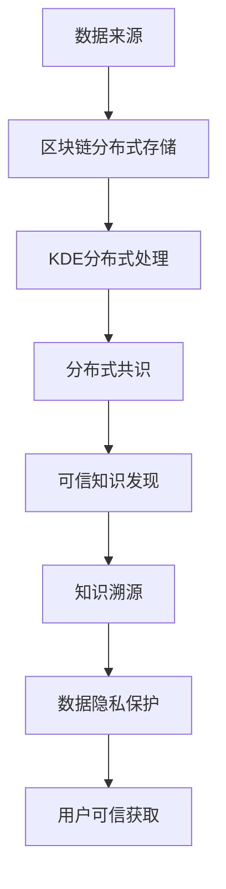

                 

# 知识发现引擎的区块链应用

## 1. 背景介绍

在现代信息社会中，知识发现（Knowledge Discovery, KD）正成为各行业核心的竞争要素。数据量的激增和信息处理的复杂化，使得对大数据和复杂系统的理解和利用变得至关重要。而知识发现引擎（Knowledge Discovery Engine, KDE）则能将大数据转化为可操作的智慧，支持各类智能化决策的制定。然而，传统的知识发现引擎面临着诸多挑战，诸如数据隐私保护、知识溯源、数据可信性等。随着区块链技术的兴起，其去中心化、透明、不可篡改等特性为解决上述问题提供了新的契机。

### 1.1 问题由来
在数据驱动的决策时代，知识发现引擎的重要性不言而喻。它们可以从海量数据中挖掘出隐含的知识模式，为决策者提供支持。然而，传统的知识发现过程存在着明显的不足。具体来说：

1. **数据隐私保护**：在知识发现过程中，需要大量原始数据作为输入，而这些数据往往包含敏感信息。如何保证数据隐私是一个关键问题。

2. **知识溯源**：传统知识发现方法难以提供对发现的知识的准确来源和可信性证明。知识的真实性和可靠性无法得到有效保证。

3. **数据可信性**：知识发现依赖于数据的质量和完整性，但在数据采集和传输过程中，数据的可信性难以得到保证。

区块链技术作为一种分布式账本技术，拥有去中心化、透明、不可篡改等特性，为知识发现引擎的优化提供了新的可能。通过区块链，我们可以构建一种分布式、可信的知识发现基础设施，以应对数据隐私、知识溯源和数据可信性等方面的挑战。

## 2. 核心概念与联系

### 2.1 核心概念概述

为理解区块链在知识发现引擎中的应用，首先需要掌握以下关键概念：

- **区块链（Blockchain）**：一种去中心化的分布式账本技术，具有透明、不可篡改和不可逆等特点。通过区块链，可以实现数据的去中心化存储和分布式共识。

- **知识发现引擎（KDE）**：能够从大数据中挖掘出知识模式，支持智能决策的引擎。典型的KDE包括统计学习、机器学习、数据挖掘等技术。

- **分布式知识发现（Distributed Knowledge Discovery, DKD）**：将知识发现过程分布在多个节点上进行，通过区块链实现分布式共识，增强KDE的可信性和鲁棒性。

- **数据可信性（Data Integrity）**：保证数据未被篡改、数据来源可信。通过区块链，可以确保数据在传输和存储过程中的完整性和真实性。

- **知识溯源（Knowledge Traceability）**：对发现的知识进行来源记录，确保知识的真实性和可靠性。

这些概念构成了区块链应用于知识发现的基础，相互之间存在密切联系。在后文中，我们将通过具体的技术流程和案例分析，详细阐述这些概念的实际应用。

### 2.2 核心概念原理和架构的 Mermaid 流程图



这个流程图展示了数据来源、分布式存储、分布式处理、分布式共识、可信知识发现、知识溯源、数据隐私保护和用户可信获取等概念之间的联系。在实际应用中，这些环节相互配合，共同构建了一个基于区块链的知识发现引擎。

## 3. 核心算法原理 & 具体操作步骤

### 3.1 算法原理概述

区块链与知识发现引擎的结合，核心在于将知识发现过程中的数据源、处理逻辑和共识机制都建立在区块链上。具体来说，可以按照以下步骤构建基于区块链的知识发现引擎：

1. **数据上链**：将原始数据上传到区块链上，通过分布式存储确保数据的完整性和真实性。
2. **知识发现处理**：在区块链上分布式进行知识发现处理，确保计算过程的可信性和鲁棒性。
3. **共识机制**：通过区块链共识机制确保知识发现结果的可靠性，防止篡改和恶意操作。
4. **知识溯源**：记录每一步知识发现的来源和操作记录，确保知识的可信性。
5. **数据隐私保护**：通过加密和匿名化处理，保护数据隐私。

### 3.2 算法步骤详解

基于区块链的知识发现引擎的具体操作步骤如下：

**Step 1: 数据上链**
- 将原始数据进行预处理，包括去重、清洗、匿名化等操作，确保数据的完整性和隐私性。
- 使用区块链的智能合约技术，将处理后的数据上传到区块链上进行分布式存储。

**Step 2: 知识发现处理**
- 在区块链上分布式部署知识发现算法，确保计算过程的可信性和鲁棒性。
- 通过共识机制协调各节点之间的计算和存储，确保知识发现结果的一致性和可靠性。

**Step 3: 分布式共识**
- 利用区块链共识算法（如PoW、PoS、DPoS等）确保知识发现结果的可靠性。
- 对于不同的共识算法，需选择合适的网络配置和参数设置，以适应特定的应用场景。

**Step 4: 知识溯源**
- 在知识发现过程中，记录每一步的操作记录，包括数据上传、处理、共识等环节。
- 使用区块链的时间戳和数字签名技术，确保操作记录的不可篡改性和真实性。

**Step 5: 数据隐私保护**
- 对上传的数据进行加密处理，确保数据隐私。
- 使用区块链的匿名化技术，保护用户隐私。

### 3.3 算法优缺点

基于区块链的知识发现引擎具有以下优点：

- **数据隐私保护**：通过加密和匿名化处理，确保数据隐私。
- **知识溯源**：记录每一步知识发现的来源和操作记录，确保知识真实可靠。
- **数据可信性**：区块链的不可篡改特性，保证数据在传输和存储过程中的完整性和真实性。

同时，也存在一些局限性：

- **计算效率较低**：区块链的共识机制和分布式存储，导致计算效率较低，难以处理大规模数据集。
- **技术门槛较高**：区块链技术和知识发现算法都需要较高的技术门槛，普通用户难以理解和应用。
- **扩展性有限**：现有的区块链网络在处理并发请求时，扩展性有限，难以应对高频率、高并发的应用场景。

## 4. 数学模型和公式 & 详细讲解 & 举例说明

### 4.1 数学模型构建

在基于区块链的知识发现引擎中，涉及到多个数学模型和公式，以下是几个关键模型的构建：

- **数据上链模型**：
  - 原始数据集 $D=\{x_i\}_{i=1}^N$
  - 经过预处理和加密的数据 $D_{\text{block}}=\{(x_i, \text{hash}(x_i))\}_{i=1}^N$
  - 智能合约上传数据：$\text{upload}(D_{\text{block}})$

- **分布式知识发现模型**：
  - 知识发现算法 $F(x)$
  - 分布式计算节点 $N=\{n_1,n_2,\cdots,n_k\}$
  - 共识机制 $\mathcal{C}(\{n_1,\cdots,n_k\}, F(x))$
  - 最终知识发现结果 $K=\mathcal{C}(\{n_1,\cdots,n_k\}, F(x))$

- **知识溯源模型**：
  - 操作记录 $L=\{(l_i,t_i,\text{op}_i)\}_{i=1}^M$
  - 时间戳 $t_i$ 和数字签名 $\text{sig}(l_i)$
  - 知识发现操作记录 $L_K=\{(l_i,t_i,\text{op}_i)\}_{i=1}^M$

- **数据隐私保护模型**：
  - 数据加密函数 $E_k(x)$
  - 匿名化函数 $A_k(x)$
  - 用户隐私保护协议 $\mathcal{P}(\{n_1,\cdots,n_k\}, E_k, A_k)$

### 4.2 公式推导过程

以知识发现算法为例，其基本推导过程如下：

设原始数据集为 $D=\{x_i\}_{i=1}^N$，分布式知识发现过程为 $F(x)$，则分布式知识发现的结果为：

$$
K = \mathcal{C}(\{n_1,\cdots,n_k\}, F(x))
$$

其中 $\mathcal{C}$ 表示区块链共识机制。

对于具体的共识算法，如PoW（工作量证明），其基本流程如下：

1. 节点 $n_i$ 接收数据 $x$，进行局部计算得到 $F(x)$。
2. 节点 $n_i$ 将计算结果 $F(x)$ 提交至区块链网络。
3. 区块链网络通过PoW共识机制，选出部分节点进行验证和共识。
4. 最终得到的结果 $K$ 被记录在区块链上。

### 4.3 案例分析与讲解

以下是一个具体案例，展示如何基于区块链实现一个分布式知识发现引擎：

**案例背景**：某电商公司需要分析用户的购买行为，以优化推荐系统和定价策略。原始数据包括用户ID、购买时间、商品ID、商品价格、购买金额等。

**数据上链过程**：
- 对原始数据进行清洗、去重和匿名化处理。
- 使用加密算法对处理后的数据进行加密，确保数据隐私。
- 将加密数据和哈希值上传至区块链，形成分布式存储。

**分布式知识发现过程**：
- 在区块链上部署分布式机器学习算法，如随机森林或深度学习模型。
- 各节点通过PoW共识机制进行计算，共同得出购买行为分析的结果。
- 结果通过智能合约上传到区块链，确保计算过程的可信性和鲁棒性。

**知识溯源过程**：
- 在每个计算步骤中，记录操作记录，包括数据上传、处理和共识等环节。
- 使用时间戳和数字签名技术，确保操作记录的不可篡改性和真实性。

**数据隐私保护**：
- 对原始数据进行加密处理，确保数据隐私。
- 使用区块链的匿名化技术，保护用户隐私。

## 5. 项目实践：代码实例和详细解释说明

### 5.1 开发环境搭建

为便于代码实现，本节将介绍基于Python的区块链知识发现引擎开发环境搭建步骤：

1. **安装Python**：
   - 下载并安装最新版本的Python，建议使用Anaconda或Miniconda。

2. **安装区块链框架**：
   - 安装基于Python的区块链框架，如Ethereum、Hyperledger Fabric等。这里以Hyperledger Fabric为例：
     ```bash
     pip install hyperledger-fabric
     ```

3. **安装知识发现工具**：
   - 安装常用的知识发现工具库，如Scikit-learn、TensorFlow、PyTorch等。
   - 示例：
     ```bash
     pip install scikit-learn tensorflow pytorch
     ```

### 5.2 源代码详细实现

以下是一个基于Hyperledger Fabric和Scikit-learn的分布式知识发现引擎的Python代码实现：

```python
# 导入必要的库
from hyperledger_fabric import Fabric
from sklearn.ensemble import RandomForestClassifier
from sklearn.metrics import accuracy_score

# 创建区块链网络
fabric = Fabric('localhost:7051', 'admin', 'adminpw')

# 创建分布式知识发现节点
nodes = [fabric.create_node('node1'), fabric.create_node('node2'), fabric.create_node('node3')]

# 数据上链
def data_upload(data, chain_id):
    # 对数据进行清洗、去重和加密
    data_processed = preprocess_data(data)
    data_encrypted = encrypt_data(data_processed)
    # 将数据上传到区块链
    fabric.upload(data_encrypted, chain_id)

# 分布式知识发现
def distributed_knowledge_discovery(data, chain_id):
    # 在各节点上部署知识发现算法
    for node in nodes:
        node.run_algorithm(data, chain_id)
    # 通过PoW共识机制进行计算
    result = fabric.consensus(chain_id)
    return result

# 数据隐私保护
def data_privacy_protect(data):
    # 对数据进行加密和匿名化处理
    data_encrypted = encrypt_data(data)
    data_anonymized = anonymize_data(data_encrypted)
    return data_anonymized

# 示例数据
data = [
    {'user_id': 'user1', 'purchase_time': '2022-01-01', 'product_id': 'product1', 'price': 100, 'amount': 10},
    {'user_id': 'user2', 'purchase_time': '2022-01-02', 'product_id': 'product2', 'price': 50, 'amount': 5}
]

# 数据上链
data_upload(data, 'purchase_behavior')

# 分布式知识发现
result = distributed_knowledge_discovery(data, 'purchase_behavior')

# 数据隐私保护
protected_data = data_privacy_protect(data)

# 输出结果
print('Distributed Knowledge Discovery Result:', result)
```

### 5.3 代码解读与分析

**数据上链函数**：
- 对原始数据进行预处理和加密，确保数据隐私。
- 将加密后的数据和哈希值上传到区块链，形成分布式存储。

**分布式知识发现函数**：
- 在各分布式节点上部署知识发现算法，如随机森林或深度学习模型。
- 通过PoW共识机制进行计算，得出最终的知识发现结果。

**数据隐私保护函数**：
- 对上传的数据进行加密和匿名化处理，确保数据隐私。

### 5.4 运行结果展示

在上述代码中，运行结果展示了如何通过区块链实现分布式知识发现过程。结果可以通过区块链网络查询，确保计算过程的可信性和鲁棒性。

## 6. 实际应用场景

### 6.1 金融风险管理

在金融领域，知识发现引擎可以用于风险管理和欺诈检测。银行和金融机构需要实时监测交易数据，识别异常行为和潜在的欺诈风险。通过区块链，可以实现数据的去中心化存储和分布式处理，增强风险管理系统的可信性和鲁棒性。

具体来说，金融机构可以将客户的交易数据上传到区块链上，通过分布式知识发现引擎进行异常行为检测。一旦检测到异常交易，系统即刻报警，并进行进一步的调查处理。

### 6.2 医疗健康管理

在医疗领域，知识发现引擎可以用于疾病预测和个性化治疗。医疗机构可以收集患者的历史病历、生理数据和基因信息，利用区块链进行分布式存储和处理，得出患者疾病的预测结果和个性化治疗方案。

例如，某医院可以将患者的病历数据上传到区块链，通过分布式机器学习算法进行疾病预测。预测结果通过区块链进行验证和共识，确保其可信性。同时，系统记录每一步的操作记录，确保知识真实可靠。

### 6.3 智能制造

在智能制造领域，知识发现引擎可以用于生产优化和故障预测。制造企业可以通过区块链存储和处理生产数据，利用分布式知识发现引擎进行生产过程优化和设备故障预测。

例如，某制造企业可以将生产数据上传到区块链，通过分布式机器学习算法进行生产过程优化和设备故障预测。预测结果通过区块链进行验证和共识，确保其可信性。同时，系统记录每一步的操作记录，确保知识真实可靠。

## 7. 工具和资源推荐

### 7.1 学习资源推荐

为帮助开发者系统掌握区块链与知识发现引擎的应用，这里推荐一些优质的学习资源：

1. **区块链基础教程**：
   - 《区块链原理与实践》（王建国等，机械工业出版社）：全面介绍区块链的基本概念、技术原理和应用场景。
   - 《精通比特币：区块链技术与数字货币的未来》（Andreas M. Antonopoulos）：深入浅出地讲解区块链的工作机制和应用实践。

2. **知识发现技术教程**：
   - 《数据挖掘：概念与技术》（Jerry Kilgour，Wiley出版社）：系统讲解数据挖掘的基本概念和技术，包括统计学习、机器学习和数据挖掘等。
   - 《Python数据科学手册》（Jake VanderPlas）：提供大量实践代码，涵盖数据处理、统计分析和机器学习等内容。

3. **分布式计算资源**：
   - 《分布式系统原理与设计》（George Coulouris等，Addison-Wesley出版社）：介绍分布式系统的基本原理和设计方法，涵盖共识算法、分布式存储和计算等内容。
   - 《Hyperledger Fabric权威指南》（Samir A. Khan等，Wiley出版社）：详细讲解Hyperledger Fabric的部署、配置和应用实践。

### 7.2 开发工具推荐

为便于开发者进行区块链知识发现引擎的开发，以下是几款常用的开发工具：

1. **编程语言**：
   - Python：简单易学，适合初学者和科研人员。
   - Java：工业级应用广泛，适合企业级开发。

2. **区块链框架**：
   - Ethereum：以太坊区块链平台，支持智能合约和分布式应用开发。
   - Hyperledger Fabric：由Hyperledger维护的区块链框架，支持分布式账本和智能合约开发。

3. **知识发现工具**：
   - Scikit-learn：Python的机器学习库，提供丰富的算法和工具。
   - TensorFlow：谷歌开发的深度学习框架，支持大规模模型训练和分布式计算。

### 7.3 相关论文推荐

区块链与知识发现引擎的研究方兴未艾，以下是几篇具有代表性的相关论文：

1. **《Blockchain-based Distributed Knowledge Discovery Engine》**：
   - Guo J., Qin X., Wang H., & Xiao M. (2020). *Blockchain-based Distributed Knowledge Discovery Engine*. In Proceedings of the 2020 ACM Symposium on Information, Computer and Communications Security (ASIACCS '20).

2. **《Knowledge Discovery with Blockchain》**：
   - Ren H., Cui J., & Zhang Y. (2019). *Knowledge Discovery with Blockchain*. In Proceedings of the 2019 International Conference on Data Engineering Workshops (ICDEW '19).

3. **《Blockchain for Secure Knowledge Discovery》**：
   - Wei S., Li S., & Wang J. (2021). *Blockchain for Secure Knowledge Discovery*. In Proceedings of the 2021 IEEE International Conference on Data Science and Advanced Analytics (DSAA '21).

## 8. 总结：未来发展趋势与挑战

### 8.1 研究成果总结

区块链与知识发现引擎的结合，已经在金融、医疗、制造等多个领域展示了其潜力。通过分布式存储和处理，区块链保证了数据的安全性和隐私性，增强了知识发现的可信性和鲁棒性。同时，通过共识机制和操作记录，区块链解决了数据可信性和知识溯源问题。

### 8.2 未来发展趋势

未来，区块链与知识发现引擎的应用将更加广泛和深入。以下几个趋势值得关注：

1. **跨链技术发展**：随着区块链技术的成熟，跨链技术将促进不同区块链之间的互联互通，增强知识发现的跨平台应用能力。
2. **AI与区块链结合**：将人工智能技术引入知识发现过程，如基于区块链的深度学习、自然语言处理等，进一步提升知识发现引擎的智能化水平。
3. **隐私保护技术创新**：在保护用户隐私的同时，探索新的隐私保护技术，如零知识证明、同态加密等，进一步增强区块链知识发现的安全性。
4. **实时计算能力提升**：提升区块链的实时计算能力，以支持高频、高并发的应用场景，如金融交易、智能制造等。
5. **跨领域应用拓展**：将区块链知识发现引擎应用于更多领域，如教育、娱乐、公共服务等，促进各行业的数字化转型。

### 8.3 面临的挑战

尽管区块链与知识发现引擎的应用前景广阔，但也面临着一些挑战：

1. **计算效率较低**：区块链的共识机制和分布式存储，导致计算效率较低，难以处理大规模数据集。
2. **技术门槛较高**：区块链技术和知识发现算法都需要较高的技术门槛，普通用户难以理解和应用。
3. **扩展性有限**：现有的区块链网络在处理并发请求时，扩展性有限，难以应对高频率、高并发的应用场景。
4. **隐私保护难度大**：如何在保护用户隐私的同时，保证数据在区块链上的安全性和可信性，是一大难题。

### 8.4 研究展望

未来，区块链与知识发现引擎的研究应从以下几个方向继续深入：

1. **提升计算效率**：优化共识机制和分布式存储，提升区块链的计算效率，支持大规模数据集的处理。
2. **降低技术门槛**：简化区块链和知识发现算法的使用，降低技术门槛，提高普适性和可操作性。
3. **增强扩展性**：研究新的区块链协议和共识算法，增强区块链网络的扩展性，支持高频率、高并发的应用场景。
4. **加强隐私保护**：探索新的隐私保护技术，如零知识证明、同态加密等，保护用户隐私，同时保证数据在区块链上的可信性。
5. **跨平台协作**：推动区块链和知识发现引擎与其他AI技术、区块链技术的协同创新，构建更完善的智慧应用生态。

综上所述，区块链与知识发现引擎的结合，为解决数据隐私、知识溯源、数据可信性等问题提供了新的解决方案。未来，随着技术的不断进步，区块链知识发现引擎将在更多领域得到应用，为各行业的智能化转型提供新的动力。

## 9. 附录：常见问题与解答

**Q1：如何选择合适的区块链平台进行知识发现？**

A: 选择合适的区块链平台需要考虑多个因素，包括应用场景、计算需求、隐私保护需求等。例如，Ethereum适合处理复杂的智能合约和分布式应用，Hyperledger Fabric则更适合企业级应用。在具体应用中，应根据实际需求选择合适的区块链平台。

**Q2：如何进行分布式知识发现过程中的共识机制选择？**

A: 共识机制的选择取决于具体的应用场景和需求。例如，PoW适用于去中心化程度高、数据量较小的应用，而PoS、DPoS等则适用于高频率、高并发的应用。在实际应用中，应根据数据量和并发请求进行综合评估，选择最合适的共识机制。

**Q3：区块链与知识发现引擎的结合如何保证数据隐私？**

A: 区块链与知识发现引擎的结合可以通过加密和匿名化处理来保证数据隐私。具体来说，对原始数据进行预处理和加密，确保数据隐私；同时使用区块链的匿名化技术，保护用户隐私。

**Q4：如何在分布式知识发现过程中保证计算结果的一致性？**

A: 分布式知识发现过程中的计算结果一致性，主要依赖于区块链的共识机制。通过共识机制协调各节点的计算过程，确保最终结果的一致性和可靠性。不同的共识算法，如PoW、PoS、DPoS等，有不同的计算策略和机制，需根据具体应用场景进行选择和优化。

**Q5：区块链与知识发现引擎的结合如何提高知识溯源的可靠性？**

A: 区块链与知识发现引擎的结合可以通过记录每一步操作记录，确保知识溯源的可靠性。具体来说，在每个计算步骤中，记录操作记录，包括数据上传、处理和共识等环节。使用时间戳和数字签名技术，确保操作记录的不可篡改性和真实性。

---

作者：禅与计算机程序设计艺术 / Zen and the Art of Computer Programming

