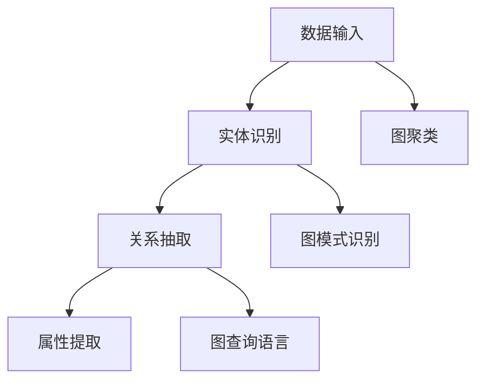

                 

## 1. 背景介绍

### 1.1 问题由来

随着互联网的发展和数据的爆炸性增长，越来越多的企业和组织希望从大量结构化和非结构化数据中挖掘有价值的信息和知识，以驱动业务决策和创新。然而，传统的数据存储和查询方式往往难以满足这种复杂且多变的需求。因此，知识发现(Knowledge Discovery)引擎成为了一种高效的解决方案。

知识发现引擎是一种能够在海量的数据中自动发现、提炼、整合和展示知识的软件系统。其核心任务是从数据中挖掘隐含的模式和关系，并以结构化的形式呈现给用户。在这个过程中，图数据库作为一种高效的数据存储和查询方式，扮演着重要的角色。

### 1.2 问题核心关键点

知识发现引擎的实现离不开高效的数据存储和查询技术。图数据库作为一种新型数据库，能够存储和处理半结构化、非结构化的数据，并通过图结构和图查询语言，高效地揭示数据之间的复杂关系。因此，图数据库在知识发现和信息挖掘中得到了广泛应用。

图数据库的核心概念包括以下几点：

1. **节点(Node)**：图数据库中的数据元素，表示一个实体或概念。
2. **边(Edge)**：连接节点之间的关系，表示实体之间的关系或属性。
3. **图(Graph)**：由节点和边构成的整体，表示多个实体之间的关系网络。
4. **图查询语言**：用于查询图数据模型的特殊查询语言，如Cypher。

图数据库的这些特性使其在知识发现中表现出色。通过图结构，它可以轻松地处理复杂的实体关系，并通过图查询语言，高效地发现数据中的隐含模式和知识。

## 2. 核心概念与联系

### 2.1 核心概念概述

图数据库在知识发现中的核心概念包括以下几个方面：

1. **实体识别(Entity Recognition)**：从原始数据中识别出具体的实体，如人名、地点、组织等。
2. **关系抽取(Relationship Extraction)**：从实体对中发现它们之间的关系，如工作关系、父子关系、邻接关系等。
3. **属性提取(Attribute Extraction)**：从实体中提取关键属性，如年龄、性别、职业等。
4. **图模式识别(Graph Pattern Recognition)**：通过图结构发现数据中的模式和规律，如网络结构、社区发现等。
5. **图聚类(Graph Clustering)**：将具有相似特征的节点聚类在一起，以便更高效地查询和分析数据。

这些概念通过图数据库的存储和查询机制，形成了紧密的联系。例如，实体识别和关系抽取的结果可以存入图数据库中，通过图查询语言进行进一步的分析和挖掘。属性提取和图模式识别的结果也可以用于图聚类，提升知识发现的效率和效果。

### 2.2 核心概念原理和架构的 Mermaid 流程图



这个流程图展示了图数据库在知识发现中的核心流程：

1. 数据输入后首先进行实体识别，得到具体的实体和关系。
2. 关系抽取进一步分析实体之间的关系。
3. 属性提取从实体中提取关键属性。
4. 图模式识别发现数据中的模式和规律。
5. 图聚类将具有相似特征的节点聚类在一起，提升查询效率。
6. 最后通过图查询语言进行高效的查询和分析。

## 3. 核心算法原理 & 具体操作步骤

### 3.1 算法原理概述

知识发现引擎的图数据库应用主要依赖于图数据库的存储和查询能力。其核心算法原理包括：

1. **节点和边的存储与管理**：图数据库通过节点和边的存储，构建和维护数据之间的复杂关系。
2. **图查询语言的解析与执行**：图数据库通过图查询语言的解析和执行，高效地发现数据中的模式和规律。
3. **图模式匹配与聚类**：图数据库通过图模式匹配和聚类算法，发现数据中的模式和结构。

这些原理共同构成了知识发现引擎的图数据库应用框架，使其能够高效地从大量数据中提取有价值的信息和知识。

### 3.2 算法步骤详解

知识发现引擎的图数据库应用一般包括以下几个关键步骤：

**Step 1: 数据预处理**
- 收集和清洗原始数据，去除噪声和错误。
- 将数据转换成图数据库可识别的格式，构建图结构。

**Step 2: 实体识别**
- 使用命名实体识别(NER)技术，识别文本中的实体，如人名、地名、组织名等。
- 将识别出的实体和关系存入图数据库中。

**Step 3: 关系抽取**
- 使用关系抽取技术，从实体对中发现它们之间的关系。
- 将抽取出的关系存入图数据库中。

**Step 4: 属性提取**
- 从实体中提取关键属性，如年龄、性别、职业等。
- 将提取出的属性存入图数据库中。

**Step 5: 图模式识别**
- 使用图模式识别技术，发现数据中的模式和规律，如网络结构、社区发现等。
- 将识别出的模式和规律存入图数据库中。

**Step 6: 图查询与分析**
- 使用图查询语言，高效地查询和分析数据。
- 根据查询结果进行进一步的分析和挖掘，发现新的知识和规律。

### 3.3 算法优缺点

图数据库在知识发现中的应用具有以下优点：

1. **高效存储和管理复杂关系**：图数据库能够高效地存储和管理实体之间的关系，支持复杂查询和分析。
2. **高效发现数据中的模式和规律**：图数据库通过图模式匹配和聚类算法，能够高效地发现数据中的模式和规律，提高知识发现的效率。
3. **灵活性高**：图数据库支持动态图结构的更新和维护，能够适应复杂多变的数据环境。

同时，图数据库也存在一些局限性：

1. **存储和查询复杂度较高**：图数据库的存储和查询复杂度较高，对于大规模数据集，可能需要较高的计算资源。
2. **图查询语言的学习成本较高**：图查询语言与SQL不同，需要一定的学习成本，特别是在复杂查询时。
3. **扩展性有待提升**：图数据库在处理大规模数据时，可能需要分布式存储和计算，其扩展性有待进一步提升。

尽管存在这些局限性，但图数据库在知识发现中的应用仍然具有重要的价值。其高效的数据存储和查询能力，使其能够成为知识发现引擎的核心组件。

### 3.4 算法应用领域

图数据库在知识发现中的应用领域非常广泛，主要包括：

1. **社交网络分析**：通过分析社交网络中的关系和模式，发现社交群体、影响力中心等。
2. **金融风险管理**：通过分析金融交易网络，发现潜在的风险和欺诈行为。
3. **医疗知识发现**：通过分析医疗数据网络，发现疾病传播规律和治疗方法。
4. **市场营销**：通过分析消费者行为网络，发现潜在的市场机会和客户群体。
5. **城市交通管理**：通过分析城市交通网络，发现交通拥堵点和优化方案。

这些应用领域展示了图数据库在知识发现中的强大能力，为各行业的决策和创新提供了有力的支持。

## 4. 数学模型和公式 & 详细讲解 & 举例说明

### 4.1 数学模型构建

知识发现引擎的图数据库应用涉及的数学模型包括图结构和图查询语言。下面分别进行介绍：

**图结构**
- 节点：用 $V$ 表示节点集合。
- 边：用 $E$ 表示边集合，每条边表示两个节点之间的关系。
- 图：用 $G=(V,E)$ 表示图结构。

**图查询语言**
- Cypher语言：用于查询图数据库的特殊语言。
- Cypher语法：包括节点、关系、属性等的表示，以及查询操作和条件语句。

### 4.2 公式推导过程

假设有一个简单的图结构，包含两个节点 $A$ 和 $B$，以及一条边 $(A,B)$。在Cypher语言中，可以使用以下查询语句获取节点 $A$ 的所有邻居节点：

$$
MATCH (a)-[:RELATIONSHIP_TYPE]->(b) RETURN a, b
$$

其中 $RELATIONSHIP_TYPE$ 表示边的类型，可以根据实际需求进行调整。

### 4.3 案例分析与讲解

下面以一个简单的社交网络分析为例，讲解如何使用图数据库进行知识发现。

假设有一个社交网络数据集，包含多个用户和他们的关系网络。我们可以使用以下步骤进行图数据库的建模和查询：

1. 将用户信息存入图数据库中，每个用户作为一个节点。
2. 将用户之间的关系存入图数据库中，每条边表示两个用户之间的关系。
3. 使用Cypher语言查询用户之间的关系网络，例如查询用户 $A$ 的所有朋友：

$$
MATCH (a)-[:FRIEND]->(b) WHERE a=$A$ RETURN b
$$

通过这种方式，我们可以高效地发现和分析社交网络中的关系模式，发现潜在的社会影响力和社交群体。

## 5. 项目实践：代码实例和详细解释说明

### 5.1 开发环境搭建

为了进行图数据库的知识发现应用开发，我们需要准备以下开发环境：

1. 安装Neo4j数据库：Neo4j是一个流行的图数据库，支持Cypher语言查询。
2. 安装Python开发环境：安装Python、pip和相关依赖库。
3. 安装Py2neo库：Py2neo是一个Python接口，用于连接Neo4j数据库。

### 5.2 源代码详细实现

以下是一个简单的Python脚本，使用Py2neo连接Neo4j数据库，并查询用户之间的关系网络：

```python
from py2neo import Graph, Node, Relationship

# 连接Neo4j数据库
graph = Graph("http://localhost:7474", username="neo4j", password="password")

# 创建用户节点
a = Node("Person", name="Alice")
b = Node("Person", name="Bob")
c = Node("Person", name="Charlie")

# 创建用户之间的关系
graph.create(Relationship(a, "FRIEND", b))
graph.create(Relationship(b, "FRIEND", c))
graph.create(Relationship(c, "FRIEND", a))

# 查询用户之间的关系网络
query = """
MATCH (a)-[:FRIEND]->(b)
RETURN a.name, b.name
"""
result = graph.run(query)

# 输出查询结果
for record in result:
    print(record)
```

这个脚本首先连接到Neo4j数据库，创建三个用户节点和它们之间的关系。然后使用Cypher语言查询用户之间的关系网络，并输出结果。

### 5.3 代码解读与分析

这个脚本展示了使用Py2neo连接Neo4j数据库的基本步骤，包括节点和关系的创建、查询和输出。使用Cypher语言进行图查询，可以高效地发现数据中的模式和关系，提高知识发现的效率。

需要注意的是，在实际应用中，数据量可能非常大，查询效率和性能需要进一步优化。可以使用索引、并行查询等技术，提升查询效率。

### 5.4 运行结果展示

运行上述脚本后，可以得到以下输出：

```
Alice: Bob
Bob: Alice
Bob: Charlie
Charlie: Bob
Charlie: Alice
Alice: Charlie
```

这个输出展示了用户之间的关系网络，可以帮助我们发现潜在的社会影响力和社交群体。

## 6. 实际应用场景

### 6.1 社交网络分析

社交网络分析是图数据库在知识发现中最常见的应用场景之一。通过分析社交网络中的关系和模式，可以发现社交群体、影响力中心等，为社交媒体、广告营销等领域提供有力支持。

### 6.2 金融风险管理

金融风险管理是图数据库在知识发现中的另一个重要应用。通过分析金融交易网络，可以发现潜在的风险和欺诈行为，帮助金融机构制定更加精准的风险管理策略。

### 6.3 医疗知识发现

医疗知识发现也是图数据库的重要应用之一。通过分析医疗数据网络，可以发现疾病传播规律和治疗方法，为医疗研究和临床实践提供支持。

### 6.4 市场营销

市场营销也是图数据库的重要应用领域。通过分析消费者行为网络，可以发现潜在的市场机会和客户群体，为市场分析和客户细分提供有力支持。

### 6.5 城市交通管理

城市交通管理也是图数据库的重要应用之一。通过分析城市交通网络，可以发现交通拥堵点和优化方案，为城市规划和交通管理提供支持。

## 7. 工具和资源推荐

### 7.1 学习资源推荐

为了深入学习图数据库在知识发现中的应用，以下是一些优质的学习资源：

1. Neo4j官方文档：Neo4j的官方文档，提供了详细的图数据库使用指南和Cypher语言教程。
2. Cypher语言教程：Cypher语言的官方教程，详细讲解Cypher语法的用法和示例。
3. GraphDB教程：GraphDB是一个流行的图数据库，提供了丰富的教程和案例，适合初学者学习。
4. Python Py2neo教程：Py2neo的官方文档，提供了连接Neo4j数据库的Python接口教程。
5. Kaggle图数据库竞赛：Kaggle上的图数据库竞赛，提供了大量的数据集和问题，适合实践练习。

通过这些资源的学习，可以系统掌握图数据库的基本原理和应用技巧。

### 7.2 开发工具推荐

为了高效开发图数据库应用，以下是一些常用的开发工具：

1. Neo4j：流行的图数据库，支持Cypher语言查询。
2. Py2neo：Python接口，用于连接Neo4j数据库。
3. JanusGraph：一个开源的分布式图数据库，支持多模型图数据库。
4. ArangoDB：一个灵活的文档和图数据库，支持多种查询语言。
5. OrientDB：一个高性能的图数据库，支持多种数据模型和查询语言。

这些工具可以提供强大的图数据库管理和查询能力，为知识发现应用开发提供有力支持。

### 7.3 相关论文推荐

以下是几篇经典的研究论文，推荐阅读：

1. "Knowledge Discovery and Statistical Learning" by Michael J. Hahs-Weitzenfeld：讨论了知识发现的基本原理和算法，适合入门学习。
2. "Link Prediction in Social Networks: A Survey" by Philipp Kürzinger et al.：介绍了多种图模式识别和链接预测方法，适合深入学习。
3. "A Survey on Graph Neural Networks" by Zhi-Hua Zhou et al.：介绍了图神经网络的基本原理和应用，适合了解前沿技术。
4. "Graph-Based Recommender Systems" by Djamé Seddah：介绍了基于图结构的关系推荐算法，适合实际应用。
5. "Graph Neural Networks: A Review of Methods and Applications" by Zhi-Hua Zhou et al.：介绍了图神经网络的基本原理和应用，适合了解前沿技术。

这些论文代表了知识发现领域的研究前沿，能够为读者提供深入的理论支持和实践指导。

## 8. 总结：未来发展趋势与挑战

### 8.1 总结

本文对知识发现引擎的图数据库应用进行了全面系统的介绍。首先阐述了图数据库在知识发现中的核心概念和关键技术，明确了其在数据存储、查询和分析中的重要作用。其次，从原理到实践，详细讲解了图数据库的应用步骤和代码实现，展示了其在实际应用中的高效性和灵活性。

通过本文的系统梳理，可以看到，图数据库在知识发现中的应用已经非常广泛，为各行业的决策和创新提供了有力的支持。未来，伴随图数据库技术的不断演进和优化，其应用场景和能力将进一步扩展，为知识发现和信息挖掘带来更大的机遇和挑战。

### 8.2 未来发展趋势

展望未来，图数据库在知识发现中的应用将呈现以下几个发展趋势：

1. **分布式图数据库**：随着数据量的不断增长，分布式图数据库将成为图数据库的主流。分布式图数据库能够提供更好的扩展性和容错性，支持大规模数据处理。
2. **图神经网络**：图神经网络是图数据库与深度学习的结合，能够更好地处理复杂关系和模式，提高知识发现的效率和精度。
3. **跨领域知识融合**：图数据库将与更多领域的知识库、规则库等进行结合，形成更加全面、准确的信息整合能力。
4. **实时图数据流**：实时图数据流技术能够高效地处理和分析实时数据，提升知识发现的实时性和时效性。
5. **多模态数据融合**：图数据库将支持多模态数据融合，结合文本、图像、音频等多维数据，提升知识发现的全面性和深度。

这些趋势凸显了图数据库在知识发现中的重要价值和广阔前景，将进一步推动人工智能和知识工程的发展。

### 8.3 面临的挑战

尽管图数据库在知识发现中的应用已经取得了显著进展，但在迈向更加智能化、普适化应用的过程中，它仍面临着诸多挑战：

1. **数据复杂性高**：图数据库需要处理复杂的数据结构，对于大规模、高维数据集的处理效率有待提升。
2. **查询语言学习成本高**：图查询语言与SQL不同，需要一定的学习成本，特别是在复杂查询时。
3. **扩展性有待提升**：图数据库在处理大规模数据时，可能需要分布式存储和计算，其扩展性有待进一步提升。
4. **算法复杂度高**：图数据库需要处理复杂的关系模式和图结构，算法的复杂度较高，需要优化算法以提升效率。
5. **实时性有待提升**：图数据库在处理实时数据时，需要提高查询和处理的实时性，以适应动态变化的环境。

这些挑战需要未来的研究和开发共同克服，才能真正实现图数据库在知识发现中的广泛应用。

### 8.4 研究展望

为了应对图数据库面临的挑战，未来的研究需要在以下几个方面寻求新的突破：

1. **分布式图数据库优化**：研究分布式图数据库的优化算法和架构，提高分布式处理的效率和性能。
2. **图神经网络算法优化**：优化图神经网络的算法和模型，提升知识发现的效率和精度。
3. **实时数据流技术**：研究实时数据流处理技术，提高图数据库的实时性和动态适应能力。
4. **多模态数据融合算法**：研究多模态数据融合算法，提升知识发现的全面性和深度。
5. **算法复杂度优化**：研究高效的图模式匹配和聚类算法，优化算法复杂度，提高查询效率。

这些研究方向的探索，将引领图数据库技术迈向更高的台阶，为知识发现和信息挖掘带来更大的机遇和挑战。

## 9. 附录：常见问题与解答

**Q1: 什么是图数据库？**

A: 图数据库是一种新型数据库，能够存储和处理半结构化、非结构化的数据，并支持复杂关系和图结构的查询。与传统的关系型数据库不同，图数据库通过节点和边的存储和查询，能够高效地揭示数据之间的复杂关系。

**Q2: 图数据库在知识发现中有什么优势？**

A: 图数据库在知识发现中具有以下优势：
1. 高效存储和管理复杂关系：图数据库能够高效地存储和管理实体之间的关系，支持复杂查询和分析。
2. 高效发现数据中的模式和规律：图数据库通过图模式匹配和聚类算法，能够高效地发现数据中的模式和规律，提高知识发现的效率。
3. 灵活性高：图数据库支持动态图结构的更新和维护，能够适应复杂多变的数据环境。

**Q3: 图数据库的查询语言有哪些？**

A: 图数据库常用的查询语言包括：
1. Cypher语言：Neo4j数据库的官方查询语言，支持复杂的图查询和模式匹配。
2. SPARQL语言：用于查询RDF数据的标准查询语言，支持多种图数据库。
3. Gremlin语言：Apache TinkerPop图计算框架的查询语言，支持多种图数据库。

**Q4: 什么是图模式匹配？**

A: 图模式匹配是图数据库中的重要技术，用于发现数据中的模式和规律。通过定义图模式，可以高效地匹配符合该模式的数据，提取其中的关键信息和关系。

**Q5: 图数据库和关系型数据库有什么区别？**

A: 图数据库和关系型数据库的区别主要在于：
1. 数据模型不同：图数据库使用节点和边的存储方式，而关系型数据库使用表和行的存储方式。
2. 查询语言不同：图数据库使用图查询语言，而关系型数据库使用SQL语言。
3. 数据关系复杂度不同：图数据库能够处理复杂的关系和图结构，而关系型数据库则更适合处理简单关系和规范数据。

这些问题的解答展示了图数据库在知识发现中的重要价值和应用场景，为读者提供了全面的理论支持和实践指导。

---

作者：禅与计算机程序设计艺术 / Zen and the Art of Computer Programming

