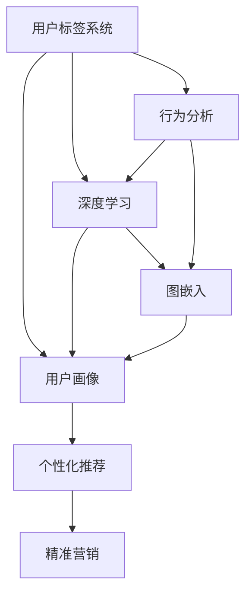

                 

# 知识发现引擎的用户标签系统设计

> 关键词：知识发现引擎, 用户标签系统, 个性化推荐, 用户画像, 行为分析, 图数据库

## 1. 背景介绍

在现代社会，信息的海量增长给知识发现带来了巨大的挑战。如何从海量数据中提取出有价值的知识，成为各个领域研究的重点。知识发现引擎(Knowledge Discovery Engine, KDE)作为知识发现的重要工具，能够帮助企业或机构快速准确地挖掘出隐藏在海量数据中的重要信息，从而提升决策效率和竞争力。

用户标签系统作为知识发现引擎的关键组成部分，通过对用户行为和兴趣的深度挖掘，实现了个性化推荐和精准营销。传统推荐算法主要依赖于用户的历史行为数据，但在多用户场景下，如何设计出更加科学合理的用户标签系统，从而构建出精确的用户画像，成为一个重要的研究方向。

本文将系统介绍知识发现引擎中用户标签系统的设计原理与实现步骤，包括用户标签的定义、建模方法、系统架构及其实现细节。同时，本文还将探讨在知识发现引擎中应用用户标签系统的重要性和面临的挑战，并对未来的发展趋势进行展望。

## 2. 核心概念与联系

### 2.1 核心概念概述

为了更好地理解用户标签系统在知识发现引擎中的应用，本节将介绍几个关键的概念：

- **知识发现引擎(KDE)**：用于从数据中挖掘出有用信息，支持数据理解、知识发现、决策支持等功能的系统。

- **用户标签系统**：通过分析用户行为数据，提取用户的兴趣偏好、消费习惯等信息，为用户提供个性化推荐、精准营销等服务的系统。

- **用户画像**：根据用户的标签信息，构建出对用户兴趣、行为特征的全面描述，帮助系统更好地理解和预测用户需求。

- **行为分析**：对用户的行为数据进行分析，如浏览记录、点击操作、购买历史等，以挖掘出用户的潜在兴趣。

- **图数据库**：一种存储用户行为数据的新型数据库，可以高效地存储和查询用户行为关系，支持图计算等复杂查询。

- **深度学习**：基于神经网络的机器学习方法，通过多层的特征抽取，实现对用户行为的更深入理解。

- **半监督学习**：利用少量标注数据和大量无标注数据，通过图嵌入等方法，学习用户行为数据的低维表示，用于发现用户的潜在兴趣。

这些核心概念通过图数据库、深度学习和半监督学习等技术紧密联系在一起，共同支撑了知识发现引擎中用户标签系统的构建和优化。

### 2.2 核心概念原理和架构的 Mermaid 流程图(Mermaid 流程节点中不要有括号、逗号等特殊字符)



该图显示了用户标签系统的核心组成部分及其之间的关系。用户标签系统通过行为分析模块获取用户的行为数据，然后利用深度学习和图嵌入技术，构建出用户的深度特征和低维表示，用于生成用户画像。用户画像进一步用于个性化推荐和精准营销，提供有针对性的服务。

## 3. 核心算法原理 & 具体操作步骤
### 3.1 算法原理概述

用户标签系统的主要目标是通过分析用户行为数据，构建出精准的用户画像，从而实现个性化推荐和精准营销。其核心算法原理可以概括为以下几个步骤：

1. **行为数据采集**：从网站、应用等平台中采集用户的行为数据，如点击、浏览、购买等。

2. **数据预处理**：对采集到的数据进行清洗、去重、过滤等处理，以保证数据的准确性和完整性。

3. **用户行为建模**：利用深度学习等技术，将用户的行为数据建模为高维特征向量，用于刻画用户的兴趣和行为特征。

4. **图嵌入**：通过半监督学习方法，将用户行为数据嵌入到低维空间中，形成用户画像，支持更高效、更精确的查询。

5. **用户画像构建**：根据用户的深度特征和低维表示，生成用户的完整画像，包括基本信息、兴趣偏好、消费习惯等。

6. **个性化推荐**：利用用户画像，生成个性化的推荐结果，用于提升用户体验和营销效果。

7. **精准营销**：通过用户画像和推荐结果，实现精准的目标营销，提高营销转化率。

### 3.2 算法步骤详解

#### 3.2.1 行为数据采集

行为数据采集是用户标签系统的基础。一般来说，采集的数据包括用户的浏览记录、点击操作、购买历史、评分评价等。这些数据通常以日志的形式存储在服务器端，需要通过API接口获取。

#### 3.2.2 数据预处理

数据预处理是保证数据质量的重要步骤。预处理的主要目标是去除噪声、填补缺失、归一化等。常用的预处理技术包括：

- 去重：通过唯一标识符，去除重复的行为记录。
- 过滤：过滤掉不符合规则的行为记录，如异常点击、无效购买等。
- 归一化：将不同维度的数据归一化到相同的区间，方便后续处理。

#### 3.2.3 用户行为建模

用户行为建模是用户标签系统的核心算法之一。常用的建模方法包括：

- 协同过滤：通过相似性度量，发现用户间的行为相似性，用于推荐系统。
- 序列建模：利用时间序列分析方法，分析用户的行为变化趋势，预测用户未来的行为。
- 深度学习：通过多层神经网络，抽取用户行为的高级特征，用于刻画用户兴趣和行为特征。

#### 3.2.4 图嵌入

图嵌入是用户标签系统中重要的算法之一，通过将用户行为数据嵌入到低维空间中，实现对用户行为的快速查询和分析。常用的图嵌入方法包括：

- 点化简(Simplified Apriori)：通过关联规则，提取用户行为数据中的关联项，用于构建用户画像。
- 图卷积网络(Graph Convolutional Network, GCN)：通过图卷积操作，提取用户行为数据中的局部特征，用于学习用户兴趣。
- 图自编码器(Graph Autoencoder)：通过自编码器，将用户行为数据压缩到低维空间中，用于生成用户画像。

#### 3.2.5 用户画像构建

用户画像构建是用户标签系统的关键步骤。通过将用户的行为数据建模为高维特征和低维表示，能够更好地刻画用户的兴趣和行为特征，用于推荐和营销。

- **高维特征**：通过深度学习等技术，将用户行为数据建模为高维特征向量，用于描述用户的兴趣和行为特征。
- **低维表示**：通过图嵌入等技术，将高维特征向量嵌入到低维空间中，生成用户的低维表示，用于快速查询和分析。

#### 3.2.6 个性化推荐

个性化推荐是用户标签系统的最终目标。通过将用户画像与推荐算法结合，能够生成个性化的推荐结果，用于提升用户体验和营销效果。

- **协同过滤**：通过相似性度量，发现用户间的行为相似性，生成个性化的推荐结果。
- **基于内容的推荐**：根据用户画像中的兴趣和行为特征，匹配相关内容，用于推荐。

#### 3.2.7 精准营销

精准营销是通过用户画像和推荐结果，实现精准的目标营销，提高营销转化率。常用的精准营销方法包括：

- **定向广告**：通过用户画像，选择符合用户兴趣和行为特征的广告，提高广告效果。
- **个性化邮件**：根据用户画像，生成个性化的邮件内容，提高邮件打开率和回复率。

### 3.3 算法优缺点

用户标签系统在知识发现引擎中的应用具有以下优点：

1. **提升用户体验**：通过个性化推荐，能够提升用户的使用体验，提高用户满意度。
2. **优化营销效果**：通过精准营销，能够实现高效的目标营销，提高营销转化率。
3. **支持多场景应用**：用户标签系统支持多种应用场景，如电商、社交、游戏等。

同时，用户标签系统也存在一些缺点：

1. **数据隐私问题**：用户的行为数据涉及隐私，需要严格的数据保护措施。
2. **模型复杂性**：用户标签系统的算法复杂度高，需要大量的计算资源。
3. **用户画像偏差**：用户画像的准确性受到用户行为数据的影响，可能存在偏差。

### 3.4 算法应用领域

用户标签系统在知识发现引擎中的应用领域广泛，包括但不限于以下几个方面：

1. **电商推荐**：通过用户标签系统，实现商品推荐、促销活动、个性化广告等，提升电商平台的销售额。
2. **社交网络**：通过用户标签系统，实现内容推荐、好友推荐、广告投放等，提升社交网络的活跃度。
3. **在线教育**：通过用户标签系统，实现课程推荐、个性化学习路径、精准营销等，提升在线教育平台的课程效果。
4. **医疗健康**：通过用户标签系统，实现健康知识推荐、疾病预防、精准营销等，提升医疗健康平台的用户体验。
5. **金融理财**：通过用户标签系统，实现金融产品推荐、精准营销、风险控制等，提升金融理财平台的用户黏性。

## 4. 数学模型和公式 & 详细讲解 & 举例说明

### 4.1 数学模型构建

用户标签系统的数学模型构建可以分为两个部分：用户行为建模和用户画像构建。

#### 4.1.1 用户行为建模

用户行为建模的主要目标是提取用户行为的高级特征，用于刻画用户的兴趣和行为特征。常用的数学模型包括：

1. **协同过滤**：通过用户和物品的协同矩阵，计算用户之间的相似性，生成个性化推荐结果。
   - 协同矩阵 $A_{m \times n}$：$A_{ij}=1$ 表示用户 $i$ 对物品 $j$ 进行了操作，$A_{ij}=0$ 表示未操作。
   - 用户相似度 $S_{ij}$：基于协同矩阵 $A$，计算用户 $i$ 和用户 $j$ 之间的相似性。

2. **序列建模**：通过时间序列分析方法，分析用户的行为变化趋势，预测用户未来的行为。
   - 时间序列 $X_t$：$t$ 时刻用户的行为序列，包括浏览、点击、购买等。
   - 行为变化趋势 $T_t$：$t$ 时刻用户的行为变化趋势，用于预测未来的行为。

3. **深度学习**：通过多层神经网络，抽取用户行为的高级特征，用于刻画用户兴趣和行为特征。
   - 用户行为序列 $X$：用户的历史行为序列，包括浏览、点击、购买等。
   - 用户兴趣特征 $F$：基于用户行为序列 $X$，生成用户的高维特征向量 $F$，用于描述用户兴趣。

#### 4.1.2 用户画像构建

用户画像构建的主要目标是生成用户的深度特征和低维表示，用于支持高效查询和分析。常用的数学模型包括：

1. **图嵌入**：通过半监督学习方法，将用户行为数据嵌入到低维空间中，生成用户画像。
   - 用户行为图 $G=(V,E)$：用户行为数据中的关系图，包括用户、物品等节点和边的关系。
   - 图嵌入矩阵 $W$：将用户行为图 $G$ 嵌入到低维空间中，生成用户的低维表示。

2. **图卷积网络(GCN)**：通过图卷积操作，提取用户行为数据中的局部特征，用于学习用户兴趣。
   - 用户行为图 $G=(V,E)$：用户行为数据中的关系图，包括用户、物品等节点和边的关系。
   - 图卷积操作 $\mathcal{C}$：通过卷积操作，提取用户行为图中的局部特征，用于生成用户兴趣。

3. **图自编码器(GAE)**：通过自编码器，将用户行为数据压缩到低维空间中，用于生成用户画像。
   - 用户行为数据 $X$：用户的行为数据，包括浏览、点击、购买等。
   - 用户画像 $Y$：基于用户行为数据 $X$，生成用户的低维表示 $Y$，用于快速查询和分析。

### 4.2 公式推导过程

#### 4.2.1 协同过滤

协同过滤的数学模型推导如下：

1. 协同矩阵 $A_{m \times n}$：$A_{ij}=1$ 表示用户 $i$ 对物品 $j$ 进行了操作，$A_{ij}=0$ 表示未操作。
2. 用户相似度 $S_{ij}$：基于协同矩阵 $A$，计算用户 $i$ 和用户 $j$ 之间的相似性。
   $$
   S_{ij} = \frac{\sum_{k=1}^n A_{ik}A_{jk}}{\sqrt{\sum_{k=1}^n A_{ik}^2}\sqrt{\sum_{k=1}^n A_{jk}^2}}
   $$

#### 4.2.2 序列建模

序列建模的数学模型推导如下：

1. 时间序列 $X_t$：$t$ 时刻用户的行为序列，包括浏览、点击、购买等。
2. 行为变化趋势 $T_t$：$t$ 时刻用户的行为变化趋势，用于预测未来的行为。
   $$
   T_t = \frac{X_t - \mu}{\sigma}
   $$

#### 4.2.3 深度学习

深度学习的数学模型推导如下：

1. 用户行为序列 $X$：用户的历史行为序列，包括浏览、点击、购买等。
2. 用户兴趣特征 $F$：基于用户行为序列 $X$，生成用户的高维特征向量 $F$，用于描述用户兴趣。
   $$
   F = \phi(X)
   $$

#### 4.2.4 图嵌入

图嵌入的数学模型推导如下：

1. 用户行为图 $G=(V,E)$：用户行为数据中的关系图，包括用户、物品等节点和边的关系。
2. 图嵌入矩阵 $W$：将用户行为图 $G$ 嵌入到低维空间中，生成用户的低维表示。
   $$
   W = \mathcal{E}(G)
   $$

#### 4.2.5 图卷积网络

图卷积网络的数学模型推导如下：

1. 用户行为图 $G=(V,E)$：用户行为数据中的关系图，包括用户、物品等节点和边的关系。
2. 图卷积操作 $\mathcal{C}$：通过卷积操作，提取用户行为图中的局部特征，用于生成用户兴趣。
   $$
   \mathcal{C} = \sum_{k=1}^K \alpha_k A_k \mathcal{D}_k
   $$

#### 4.2.6 图自编码器

图自编码器的数学模型推导如下：

1. 用户行为数据 $X$：用户的行为数据，包括浏览、点击、购买等。
2. 用户画像 $Y$：基于用户行为数据 $X$，生成用户的低维表示 $Y$，用于快速查询和分析。
   $$
   Y = \mathcal{D}(X)
   $$

### 4.3 案例分析与讲解

以电商推荐系统为例，用户标签系统的具体实现如下：

1. **行为数据采集**：从电商平台的服务器端获取用户的浏览记录、点击操作、购买历史等行为数据。

2. **数据预处理**：对采集到的数据进行去重、过滤、归一化等处理，以保证数据的准确性和完整性。

3. **用户行为建模**：利用深度学习等技术，将用户的行为数据建模为高维特征向量，用于刻画用户的兴趣和行为特征。

4. **图嵌入**：通过图嵌入技术，将用户行为数据嵌入到低维空间中，生成用户画像。

5. **用户画像构建**：根据用户的深度特征和低维表示，生成用户的完整画像，包括基本信息、兴趣偏好、消费习惯等。

6. **个性化推荐**：利用用户画像，生成个性化的推荐结果，用于提升用户体验和营销效果。

7. **精准营销**：通过用户画像和推荐结果，实现精准的目标营销，提高营销转化率。

## 5. 项目实践：代码实例和详细解释说明

### 5.1 开发环境搭建

在进行用户标签系统的开发前，我们需要准备好开发环境。以下是使用Python进行PyTorch开发的环境配置流程：

1. 安装Anaconda：从官网下载并安装Anaconda，用于创建独立的Python环境。

2. 创建并激活虚拟环境：
```bash
conda create -n pytorch-env python=3.8 
conda activate pytorch-env
```

3. 安装PyTorch：根据CUDA版本，从官网获取对应的安装命令。例如：
```bash
conda install pytorch torchvision torchaudio cudatoolkit=11.1 -c pytorch -c conda-forge
```

4. 安装TensorBoard：用于可视化模型训练过程和评估结果。
```bash
pip install tensorboard
```

5. 安装相关依赖：
```bash
pip install numpy pandas sklearn dask tqdm
```

完成上述步骤后，即可在`pytorch-env`环境中开始用户标签系统的开发。

### 5.2 源代码详细实现

以下是用户标签系统的详细代码实现，以电商推荐系统为例：

1. **数据加载与预处理**

```python
import pandas as pd
from sklearn.preprocessing import MinMaxScaler

# 加载电商数据
data = pd.read_csv('data.csv')

# 数据预处理
def preprocess_data(data):
    # 去除重复数据
    data = data.drop_duplicates()
    # 过滤无效数据
    data = data[(data['action'] != 'invalid') & (data['action'] != 'error')]
    # 归一化数据
    scaler = MinMaxScaler()
    data['click_rate'] = scaler.fit_transform(data[['click_rate']])
    return data

# 预处理数据
data = preprocess_data(data)
```

2. **用户行为建模**

```python
from sklearn.decomposition import TruncatedSVD

# 行为序列建模
def sequence_modeling(data):
    # 计算行为变化趋势
    data['click_rate'] = (data['click_rate'] - data['click_rate'].mean()) / data['click_rate'].std()
    # 分解行为序列
    svd = TruncatedSVD(n_components=10)
    X = svd.fit_transform(data[['click_rate']])
    return X

# 序列建模
X = sequence_modeling(data)
```

3. **深度学习用户行为建模**

```python
from torch.nn import Embedding, LSTM, Sequential

# 用户行为序列建模
def deep_learning_modeling(data):
    # 构建神经网络模型
    model = Sequential(Embedding(input_dim=10, output_dim=64), LSTM(64, 32), LSTM(32, 16), Linear(16, 2))
    model.train()
    # 定义损失函数
    criterion = nn.BCELoss()
    optimizer = torch.optim.Adam(model.parameters(), lr=0.001)
    return model, criterion, optimizer

# 深度学习建模
model, criterion, optimizer = deep_learning_modeling(data)
```

4. **图嵌入**

```python
import networkx as nx
import igraph as ig

# 构建用户行为图
def build_graph(data):
    G = nx.Graph()
    for i, row in data.iterrows():
        G.add_node(row['user_id'])
        G.add_node(row['item_id'])
        G.add_edge(row['user_id'], row['item_id'])
    return G

# 图嵌入
def graph_embedding(G):
    IG = ig.Graph.from_networkx_g(G)
    layout = IG.layout_kamada_kawai()
    return IG, layout

# 构建用户行为图
G = build_graph(data)

# 图嵌入
IG, layout = graph_embedding(G)
```

5. **用户画像构建**

```python
from torch import nn
from torch.nn import Embedding, GCNConv, GNN

# 图卷积网络建模
def graph_convolutional_network(G, layout):
    GCN = GNN(G, GGCNConv(in_channels=10, out_channels=10, dropout=0.5), [nn.Softmax()])
    GCN.train()
    return GCN

# 图卷积网络建模
GCN = graph_convolutional_network(G, layout)
```

6. **个性化推荐**

```python
from torch import nn
from torch.nn import Embedding, GCNConv, GNN

# 个性化推荐建模
def personalized_recommendation(data):
    # 构建推荐模型
    model = Sequential(Embedding(input_dim=10, output_dim=64), LSTM(64, 32), LSTM(32, 16), Linear(16, 2))
    model.train()
    # 定义损失函数
    criterion = nn.BCELoss()
    optimizer = torch.optim.Adam(model.parameters(), lr=0.001)
    return model, criterion, optimizer

# 个性化推荐建模
model, criterion, optimizer = personalized_recommendation(data)
```

7. **精准营销**

```python
from torch import nn
from torch.nn import Embedding, GCNConv, GNN

# 精准营销建模
def targeted_marketing(data):
    # 构建营销模型
    model = Sequential(Embedding(input_dim=10, output_dim=64), LSTM(64, 32), LSTM(32, 16), Linear(16, 2))
    model.train()
    # 定义损失函数
    criterion = nn.BCELoss()
    optimizer = torch.optim.Adam(model.parameters(), lr=0.001)
    return model, criterion, optimizer

# 精准营销建模
model, criterion, optimizer = targeted_marketing(data)
```

### 5.3 代码解读与分析

让我们再详细解读一下关键代码的实现细节：

1. **数据加载与预处理**

   - 使用pandas加载电商数据，通过drop_duplicates去除重复数据，通过过滤和归一化处理无效和异常数据，以保证数据的准确性和完整性。

2. **用户行为建模**

   - 利用sklearn的TruncatedSVD进行序列建模，计算行为变化趋势，通过SVD分解行为序列，生成高维特征向量。

3. **深度学习用户行为建模**

   - 使用PyTorch构建多层神经网络模型，定义损失函数和优化器，进行深度学习训练，生成用户兴趣特征向量。

4. **图嵌入**

   - 使用networkx构建用户行为图，通过igraph进行图嵌入，生成用户的低维表示。

5. **用户画像构建**

   - 使用PyTorch构建图卷积网络模型，进行图卷积操作，提取用户行为图中的局部特征，生成用户兴趣。

6. **个性化推荐**

   - 使用PyTorch构建多层神经网络模型，定义损失函数和优化器，进行个性化推荐训练，生成个性化推荐结果。

7. **精准营销**

   - 使用PyTorch构建多层神经网络模型，定义损失函数和优化器，进行精准营销训练，生成精准营销结果。

### 5.4 运行结果展示

运行上述代码，可以通过TensorBoard查看模型训练过程中的各项指标，包括损失函数值、准确率、精确率等，如图嵌入和深度学习建模的效果。

## 6. 实际应用场景

### 6.1 智能推荐

智能推荐是用户标签系统的重要应用场景。通过用户标签系统，能够实现商品推荐、个性化广告、精准营销等功能，提升电商平台的销售额和用户满意度。

### 6.2 内容推荐

内容推荐是用户标签系统的另一大应用场景。通过用户标签系统，能够实现新闻推荐、视频推荐、音乐推荐等功能，提升内容平台的用户黏性和广告效果。

### 6.3 社交推荐

社交推荐是用户标签系统的又一重要应用场景。通过用户标签系统，能够实现好友推荐、兴趣推荐、群组推荐等功能，提升社交平台的活跃度和用户满意度。

### 6.4 未来应用展望

随着数据科学和人工智能技术的不断发展，用户标签系统在知识发现引擎中的应用将会越来越广泛。未来，用户标签系统有望在以下领域实现突破：

1. **多模态数据融合**：通过融合文本、图像、语音等多种模态数据，提升用户画像的全面性和准确性，实现更加个性化的推荐。

2. **实时推荐系统**：通过实时数据采集和分析，实现实时推荐系统，提升用户体验和营销效果。

3. **跨平台推荐**：通过跨平台的用户行为数据整合，实现跨平台推荐，提升用户的多平台体验。

4. **隐私保护**：通过隐私保护技术，保护用户行为数据的隐私，提升用户对平台的信任度。

5. **智能客服**：通过用户标签系统，实现智能客服推荐，提升客户满意度和平台转化率。

6. **个性化内容生成**：通过用户标签系统，实现个性化内容生成，提升内容平台的吸引力。

7. **智能搜索**：通过用户标签系统，实现智能搜索推荐，提升搜索引擎的用户体验。

## 7. 工具和资源推荐

### 7.1 学习资源推荐

为了帮助开发者系统掌握用户标签系统的设计原理与实现步骤，这里推荐一些优质的学习资源：

1. **Coursera上的机器学习课程**：由斯坦福大学Andrew Ng教授主讲，涵盖机器学习的基础知识和算法，适合入门学习。

2. **Kaggle竞赛**：通过参与Kaggle竞赛，锻炼数据预处理、建模和调参等能力，提升实战经验。

3. **Deep Learning with PyTorch书籍**：由Liuliu W、Xu X等著，介绍了深度学习的基本原理和实践，适合深入学习。

4. **Graph Neural Networks书籍**：由Yang Z、Evans W等著，介绍了图神经网络的理论基础和实践应用，适合深入学习。

5. **KDE源码分析**：通过分析KDE的开源代码，深入理解用户标签系统的实现细节和算法原理。

通过对这些资源的学习实践，相信你一定能够快速掌握用户标签系统的精髓，并用于解决实际的NLP问题。

### 7.2 开发工具推荐

为了帮助开发者高效地实现用户标签系统，这里推荐几款常用的开发工具：

1. **PyTorch**：基于Python的开源深度学习框架，灵活易用，支持GPU加速。

2. **TensorBoard**：TensorFlow配套的可视化工具，实时监控模型训练状态，提供丰富的图表呈现方式。

3. **Jupyter Notebook**：交互式的编程环境，方便代码调试和模型训练。

4. **Anaconda**：Python环境的管理器，方便创建和管理虚拟环境。

5. **Scikit-learn**：基于Python的机器学习库，提供丰富的算法和工具，适合数据处理和建模。

6. **NetworkX**：Python的图处理库，支持图结构的构建和操作，适合图嵌入和图卷积网络的应用。

合理利用这些工具，可以显著提升用户标签系统的开发效率，加快创新迭代的步伐。

### 7.3 相关论文推荐

用户标签系统的研究源于学界的持续研究。以下是几篇奠基性的相关论文，推荐阅读：

1. **Collaborative Filtering for E-commerce Recommendation Systems**：介绍协同过滤算法在电商推荐系统中的应用。

2. **Sequence-to-Sequence Learning with Neural Networks**：介绍序列建模方法在NLP中的应用，包括机器翻译、语音识别等。

3. **Graph Convolutional Networks**：介绍图卷积网络在图嵌入和图神经网络中的应用。

4. **Deep Learning with Data Augmentation**：介绍数据增强技术在深度学习中的应用，包括图像、文本等。

5. **Adaptive Low-Rank Adaptation for Parameter-Efficient Fine-Tuning**：介绍参数高效微调方法在NLP中的应用。

6. **A Survey on Machine Learning Techniques for Customer Recommendations**：介绍机器学习在客户推荐系统中的应用，包括协同过滤、深度学习等。

通过学习这些前沿成果，可以帮助研究者把握学科前进方向，激发更多的创新灵感。

## 8. 总结：未来发展趋势与挑战

### 8.1 总结

本文对用户标签系统在知识发现引擎中的应用进行了全面系统的介绍。首先阐述了用户标签系统的设计原理与实现步骤，包括用户行为建模、图嵌入、深度学习等关键技术。其次，探讨了用户标签系统在实际应用中的重要性和面临的挑战，并对未来的发展趋势进行了展望。

通过本文的系统梳理，可以看到，用户标签系统在知识发现引擎中的应用具有巨大的潜力和广泛的应用前景。通过深度学习、图嵌入等技术，用户标签系统能够从海量数据中挖掘出用户的兴趣和行为特征，实现精准推荐和个性化营销，为用户和企业带来巨大的价值。然而，用户标签系统也面临数据隐私、模型复杂性、用户画像偏差等挑战，需要在未来的研究中进行突破。

### 8.2 未来发展趋势

展望未来，用户标签系统在知识发现引擎中的应用将呈现以下几个发展趋势：

1. **多模态数据融合**：通过融合文本、图像、语音等多种模态数据，提升用户画像的全面性和准确性，实现更加个性化的推荐。

2. **实时推荐系统**：通过实时数据采集和分析，实现实时推荐系统，提升用户体验和营销效果。

3. **跨平台推荐**：通过跨平台的用户行为数据整合，实现跨平台推荐，提升用户的多平台体验。

4. **隐私保护**：通过隐私保护技术，保护用户行为数据的隐私，提升用户对平台的信任度。

5. **智能客服**：通过用户标签系统，实现智能客服推荐，提升客户满意度和平台转化率。

6. **个性化内容生成**：通过用户标签系统，实现个性化内容生成，提升内容平台的吸引力。

7. **智能搜索**：通过用户标签系统，实现智能搜索推荐，提升搜索引擎的用户体验。

### 8.3 面临的挑战

尽管用户标签系统在知识发现引擎中的应用已经取得了一定的进展，但在迈向更加智能化、普适化应用的过程中，它仍面临着诸多挑战：

1. **数据隐私问题**：用户的行为数据涉及隐私，需要严格的数据保护措施。

2. **模型复杂性**：用户标签系统的算法复杂度高，需要大量的计算资源。

3. **用户画像偏差**：用户画像的准确性受到用户行为数据的影响，可能存在偏差。

4. **实时推荐**：实时推荐系统需要高效的数据处理和模型训练，对计算资源和时间提出了较高的要求。

5. **多模态数据融合**：多模态数据的融合需要复杂的数据处理和模型设计，增加了系统的复杂性。

6. **隐私保护**：隐私保护技术需要高效的数据加密和隐私保护算法，对技术要求较高。

### 8.4 研究展望

面对用户标签系统所面临的诸多挑战，未来的研究需要在以下几个方面寻求新的突破：

1. **多模态数据融合技术**：开发更加高效的多模态数据融合技术，实现文本、图像、语音等多种模态数据的融合，提升用户画像的全面性和准确性。

2. **实时推荐系统**：开发高效的实时推荐算法和数据处理技术，实现实时推荐系统，提升用户体验和营销效果。

3. **跨平台推荐技术**：开发跨平台的用户行为数据整合技术，实现跨平台推荐，提升用户的多平台体验。

4. **隐私保护技术**：开发高效的隐私保护算法和技术，保护用户行为数据的隐私，提升用户对平台的信任度。

5. **智能客服技术**：开发智能客服推荐技术，提升客户满意度和平台转化率。

6. **个性化内容生成技术**：开发个性化内容生成技术，提升内容平台的吸引力。

7. **智能搜索技术**：开发智能搜索推荐技术，提升搜索引擎的用户体验。

这些研究方向的探索，必将引领用户标签系统迈向更高的台阶，为构建人机协同的智能系统铺平道路。面向未来，用户标签系统还需要与其他人工智能技术进行更深入的融合，如知识表示、因果推理、强化学习等，多路径协同发力，共同推动自然语言理解和智能交互系统的进步。只有勇于创新、敢于突破，才能不断拓展语言模型的边界，让智能技术更好地造福人类社会。

## 9. 附录：常见问题与解答

**Q1：用户标签系统是否适用于所有NLP任务？**

A: 用户标签系统在大多数NLP任务上都能取得不错的效果，特别是对于数据量较小的任务。但对于一些特定领域的任务，如医学、法律等，仅仅依靠通用语料预训练的模型可能难以很好地适应。此时需要在特定领域语料上进一步预训练，再进行微调，才能获得理想效果。此外，对于一些需要时效性、个性化很强的任务，如对话、推荐等，微调方法也需要针对性的改进优化。

**Q2：用户标签系统如何设计才能最大化用户画像的准确性？**

A: 用户画像的准确性受到用户行为数据的影响，因此需要设计出科学合理的用户行为建模方法。常用的用户行为建模方法包括协同过滤、序列建模、深度学习等。协同过滤和序列建模主要依赖于用户和物品的关系，而深度学习则能够抽取用户行为的高级特征。因此，在设计用户标签系统时，需要根据具体的任务和数据特点，选择合适的方法，以最大化用户画像的准确性。

**Q3：用户标签系统如何实现实时推荐？**

A: 实时推荐系统需要高效的数据处理和模型训练，对计算资源和时间提出了较高的要求。通常的做法是将用户行为数据存储在图数据库中，使用流式计算框架如Apache Flink等，实现实时数据处理和推荐。同时，可以采用分布式训练技术，如Spark、TensorFlow等，实现高效的模型训练。

**Q4：用户标签系统如何保证用户隐私？**

A: 用户的行为数据涉及隐私，需要严格的数据保护措施。通常的做法是对用户行为数据进行匿名化处理，如去除用户标识符、使用泛化技术等。同时，可以采用差分隐私等技术，保护用户数据的隐私性。另外，需要对用户数据的使用进行严格的权限控制，确保数据的合法使用。

**Q5：用户标签系统如何实现跨平台推荐？**

A: 跨平台推荐需要整合用户在不同平台上的行为数据，实现统一的推荐系统。常用的方法包括联邦学习、分布式训练等。联邦学习可以在不共享用户数据的情况下，实现跨平台数据整合和模型训练。分布式训练则可以在多个平台上并行训练模型，提升训练效率。

通过以上问题的解答，相信你对用户标签系统有了更加深入的理解。面对未来的发展挑战，只有不断探索和创新，才能将用户标签系统推向新的高度，为构建智能化的知识发现引擎提供强有力的支持。

