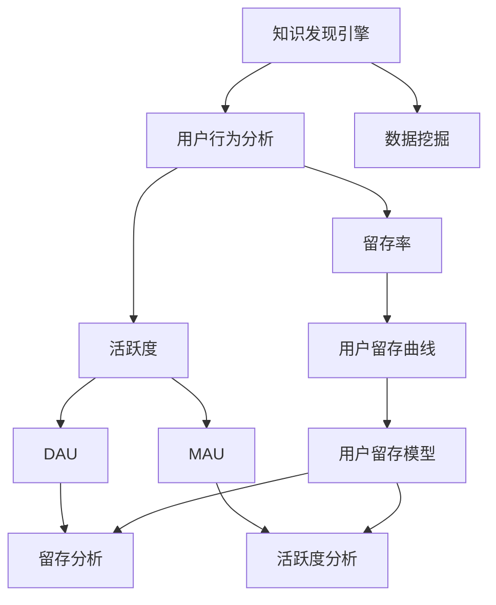

                 

# 知识发现引擎的用户留存与活跃度提升

> 关键词：用户留存, 活跃度, 知识发现引擎, 用户行为分析, 数据挖掘, 机器学习

## 1. 背景介绍

### 1.1 问题由来

在互联网时代，知识发现引擎（Knowledge Discovery Engine, KDE）作为获取信息的重要工具，广泛应用于搜索引擎、推荐系统、个性化新闻、社交网络等领域。然而，随着用户数量和数据规模的急剧增长，如何有效提升用户留存率和活跃度，成为了知识发现引擎面临的重要挑战。

### 1.2 问题核心关键点

用户留存和活跃度是衡量知识发现引擎服务质量的关键指标。留存率（Retention Rate）表示在一段时间内，重复使用服务的用户比例；活跃度（Active Rate）则反映了用户每天或每周的使用频率。提高用户留存率和活跃度，不仅能带来更多收益，还能提升平台的用户粘性和市场竞争力。

### 1.3 问题研究意义

通过对知识发现引擎用户留存和活跃度的深入分析，可以优化产品设计，提供更优质的个性化服务，满足用户需求，从而实现业务增长。这对于知识发现引擎运营商而言，具有重大的经济价值和战略意义。

## 2. 核心概念与联系

### 2.1 核心概念概述

为更好地理解用户留存和活跃度的提升方法，本节将介绍几个关键概念：

- **用户留存**：指用户在使用知识发现引擎服务后，在未来一段时间内继续使用该服务的比例。衡量留存率的高低通常采用**用户留存曲线**（User Retention Curve），反映用户在不同时间节点上的留存比例。

- **活跃度**：指用户对知识发现引擎的频繁使用程度，通常用**日活跃用户数**（DAU）和**月活跃用户数**（MAU）来衡量。

- **知识发现引擎**：集成了信息检索、推荐系统、内容过滤等功能，为用户提供个性化知识获取服务的智能系统。

- **用户行为分析**：通过对用户在使用知识发现引擎过程中的行为数据进行分析，挖掘用户兴趣和需求，从而制定有效的留存和活跃度提升策略。

- **数据挖掘**：从大规模数据中挖掘出有用的知识和信息的过程，包括分类、聚类、关联规则挖掘等。

- **机器学习**：通过数据训练模型，预测用户行为和需求，实现个性化推荐和服务。

这些概念之间的逻辑关系可以通过以下Mermaid流程图来展示：



这个流程图展示了一系列概念及其之间的关系：

1. 知识发现引擎通过数据挖掘获取用户行为数据。
2. 用户行为数据经过分析，得到用户留存率和活跃度。
3. 用户留存率和活跃度通过模型分析，用于优化用户留存和活跃度提升策略。

## 3. 核心算法原理 & 具体操作步骤
### 3.1 算法原理概述

用户留存和活跃度提升的核心在于深入分析用户行为数据，挖掘用户需求，并据此优化服务策略。具体来说，可以从以下几个方面入手：

1. **用户行为数据挖掘**：收集和分析用户在知识发现引擎上的行为数据，如点击、浏览、搜索、收藏、评论等，以了解用户兴趣和偏好。

2. **用户留存率分析**：通过时间序列分析、回归模型等方法，预测用户留存率，找出影响用户流失的关键因素。

3. **活跃度分析**：采用聚类分析、关联规则挖掘等方法，分析不同用户群体的活跃度分布，找出提高活跃度的有效策略。

4. **个性化推荐**：利用机器学习模型，根据用户行为数据，提供个性化内容推荐，提升用户使用体验和粘性。

5. **优化界面和交互**：通过A/B测试、用户反馈等手段，优化知识发现引擎的界面和交互设计，提升用户体验。

6. **激励机制设计**：设计合理的激励机制，如积分、优惠券、排名等，刺激用户增加使用频率。

### 3.2 算法步骤详解

用户留存和活跃度提升的算法步骤通常包括：

1. **数据收集与预处理**：
    - 收集用户在知识发现引擎上的行为数据。
    - 清洗和处理数据，去除噪声和不必要的信息。
    - 进行特征工程，提取用户行为特征。

2. **用户行为建模**：
    - 采用分类、回归等机器学习算法，建立用户行为模型。
    - 通过模型预测用户是否流失，并找出流失原因。

3. **用户分群分析**：
    - 使用聚类算法，将用户分为不同群体。
    - 分析不同群体的活跃度和留存率，找出差异原因。

4. **个性化推荐**：
    - 使用协同过滤、基于内容的推荐、深度学习等技术，提供个性化内容推荐。
    - 不断优化推荐算法，提高推荐效果。

5. **界面和交互优化**：
    - 设计用户友好的界面和交互方式，提升用户体验。
    - 通过A/B测试，找出最佳设计方案。

6. **激励机制设计**：
    - 设计合理的积分、优惠券、排名等激励机制。
    - 通过A/B测试，评估激励效果，不断优化激励策略。

### 3.3 算法优缺点

用户留存和活跃度提升的算法具有以下优点：

1. **提高用户粘性**：通过个性化推荐和服务，满足用户需求，增加用户粘性，提高留存率。
2. **优化用户体验**：通过界面和交互优化，提升用户体验，增加用户活跃度。
3. **多层次策略**：采用多种策略，包括数据挖掘、机器学习、行为分析等，全面提升用户留存和活跃度。
4. **动态调整**：可以动态调整推荐策略和激励机制，适应不同用户群体。

同时，该算法也存在一定的局限性：

1. **依赖数据质量**：算法效果依赖于数据的准确性和完整性。如果数据质量不高，算法效果会大打折扣。
2. **模型复杂度**：需要构建多个模型，模型复杂度较高，需要较多的计算资源和时间。
3. **用户隐私保护**：在收集和分析用户行为数据时，需要保护用户隐私，防止数据滥用。

尽管存在这些局限性，但就目前而言，基于用户行为数据的留存和活跃度提升方法仍是知识发现引擎提高服务质量的重要手段。未来相关研究的重点在于如何进一步降低算法对数据的依赖，提高模型的实时性和鲁棒性，同时兼顾用户隐私保护。

### 3.4 算法应用领域

用户留存和活跃度提升的算法在知识发现引擎中已得到广泛应用，覆盖了搜索引擎、推荐系统、个性化新闻、社交网络等多个领域。例如：

- **搜索引擎**：通过分析用户的搜索行为，提供个性化搜索结果，提升用户留存率和活跃度。
- **推荐系统**：根据用户历史行为和兴趣，推荐个性化内容，增加用户粘性。
- **个性化新闻**：根据用户阅读行为，推送相关新闻，提高用户阅读频率。
- **社交网络**：通过分析用户互动行为，推荐相关用户和内容，增加用户活跃度。

除了上述这些经典应用外，用户留存和活跃度提升的算法也被创新性地应用于更多场景中，如电商推荐、广告投放、内容创作等，为知识发现引擎带来了新的突破。

## 4. 数学模型和公式 & 详细讲解 & 举例说明

### 4.1 数学模型构建

本节将使用数学语言对用户留存和活跃度提升的算法过程进行更加严格的刻画。

记用户留存率为 $R_t$，其中 $t$ 表示时间点。定义用户行为数据为 $D=\{(x_i,y_i)\}_{i=1}^N, x_i \in \mathbb{R}^d, y_i \in \{0,1\}$，其中 $x_i$ 为特征向量，$y_i$ 为是否流失的标签。用户行为数据可以通过时间序列分析得到 $R_t$ 的估计值。

定义用户行为模型为 $f(D)$，则留存率的预测公式为：

$$
\hat{R}_t = f(D)
$$

在实践中，通常采用线性回归模型、决策树、随机森林等算法，建立用户行为模型。

### 4.2 公式推导过程

以线性回归模型为例，推导用户留存率的预测公式。

假设用户行为数据为 $D=\{(x_i,y_i)\}_{i=1}^N$，其中 $x_i$ 为特征向量，$y_i$ 为是否流失的标签。定义用户留存率为 $R_t$，其中 $t$ 表示时间点。则留存率的预测公式为：

$$
\hat{R}_t = w_0 + \sum_{i=1}^d w_i x_{it}
$$

其中 $w_0$ 为截距项，$w_i$ 为第 $i$ 个特征的系数。

通过对用户行为数据的回归分析，可以得到一组最优系数 $(w_0, w_1, ..., w_d)$。根据这组系数，可以对任意时间点 $t$ 的留存率进行预测，即：

$$
\hat{R}_t = w_0 + \sum_{i=1}^d w_i x_{it}
$$

### 4.3 案例分析与讲解

假设某知识发现引擎收集了用户在一段时间内的搜索行为数据，每个用户每天搜索的次数作为特征 $x$，将其作为线性回归模型的输入。通过回归分析，得到模型参数 $(w_0, w_1)$，则每天用户的平均留存率可以预测为：

$$
\hat{R}_t = w_0 + w_1 \cdot x_t
$$

其中 $x_t$ 表示用户 $t$ 的搜索次数。通过对比实际留存率和预测留存率，可以评估模型效果，并根据模型效果进行优化。

## 5. 项目实践：代码实例和详细解释说明
### 5.1 开发环境搭建

在进行用户留存和活跃度提升的实践前，我们需要准备好开发环境。以下是使用Python进行Scikit-learn开发的开发环境配置流程：

1. 安装Anaconda：从官网下载并安装Anaconda，用于创建独立的Python环境。

2. 创建并激活虚拟环境：
```bash
conda create -n pythonsklearn python=3.8 
conda activate pythonsklearn
```

3. 安装Scikit-learn：
```bash
pip install scikit-learn
```

4. 安装各类工具包：
```bash
pip install numpy pandas scipy matplotlib jupyter notebook
```

完成上述步骤后，即可在`pythonsklearn`环境中开始实践。

### 5.2 源代码详细实现

下面我们以用户留存率预测为例，给出使用Scikit-learn进行线性回归模型训练的PyTorch代码实现。

首先，定义用户行为数据：

```python
from sklearn.datasets import make_regression
import pandas as pd
import numpy as np

# 生成模拟数据
X, y = make_regression(n_samples=1000, n_features=5, noise=0.1, random_state=42)

# 将数据转换为DataFrame格式
data = pd.DataFrame(X, columns=['feature1', 'feature2', 'feature3', 'feature4', 'feature5'])
data['y'] = y

# 将数据保存到CSV文件
data.to_csv('user_behavior.csv', index=False)
```

然后，加载数据并建立模型：

```python
from sklearn.linear_model import LinearRegression
from sklearn.model_selection import train_test_split
import pandas as pd

# 加载数据
data = pd.read_csv('user_behavior.csv')

# 分割数据集为训练集和测试集
X_train, X_test, y_train, y_test = train_test_split(data[['feature1', 'feature2', 'feature3', 'feature4', 'feature5']], data['y'], test_size=0.2, random_state=42)

# 建立线性回归模型
model = LinearRegression()

# 训练模型
model.fit(X_train, y_train)

# 预测测试集留存率
y_pred = model.predict(X_test)
```

最后，评估模型性能：

```python
from sklearn.metrics import mean_squared_error

# 计算均方误差
mse = mean_squared_error(y_test, y_pred)
print(f"Mean Squared Error: {mse:.2f}")
```

以上就是使用Scikit-learn进行线性回归模型训练的完整代码实现。可以看到，使用Scikit-learn可以很方便地完成数据处理和模型训练。

### 5.3 代码解读与分析

让我们再详细解读一下关键代码的实现细节：

**make_regression函数**：
- 生成包含噪声的线性回归数据集，可用于模型训练和测试。

**train_test_split函数**：
- 将数据集分为训练集和测试集，用于评估模型性能。

**LinearRegression类**：
- 定义线性回归模型，采用最小二乘法拟合数据。

**模型训练和预测**：
- 通过fit方法训练模型，使用predict方法进行留存率预测。

**均方误差计算**：
- 使用sklearn.metrics中的mean_squared_error函数计算预测值与真实值之间的均方误差。

可以看到，使用Scikit-learn进行机器学习建模非常方便，只需几行代码即可实现数据处理、模型训练和评估。

当然，工业级的系统实现还需考虑更多因素，如模型的保存和部署、超参数的自动搜索、更灵活的任务适配层等。但核心的建模流程基本与此类似。

## 6. 实际应用场景

### 6.1 智能推荐系统

智能推荐系统通过分析用户的历史行为数据，提供个性化推荐，提升用户留存率和活跃度。用户浏览、点击、购买等行为数据都可以用于推荐模型训练，从而提高用户的满意度和使用频率。

在技术实现上，可以使用协同过滤、基于内容的推荐、深度学习等技术，结合用户行为数据分析，生成个性化推荐内容。推荐系统可以根据用户行为数据，动态调整推荐策略，提供更精准、个性化的推荐服务。

### 6.2 个性化广告投放

个性化广告投放通过分析用户行为数据，精准定位目标用户，提高广告的点击率和转化率。通过A/B测试和用户行为分析，不断优化广告投放策略，提高广告效果。

在技术实现上，可以使用CTR预测、转化率预测等模型，分析用户的行为数据和广告特征，预测用户点击和转化概率。广告系统可以根据用户行为数据，动态调整广告投放策略，提高广告效果。

### 6.3 社交网络互动

社交网络互动通过分析用户的互动行为数据，推荐相关用户和内容，增加用户活跃度。社交网络可以根据用户的行为数据，生成个性化推荐内容，增加用户互动频率。

在技术实现上，可以使用基于内容的推荐、协同过滤等技术，结合用户互动行为数据分析，生成个性化推荐内容。社交网络可以根据用户互动数据，动态调整推荐策略，提高用户互动频率。

### 6.4 未来应用展望

随着用户行为数据挖掘技术的不断进步，用户留存和活跃度提升将更加精细化和个性化。未来，用户留存和活跃度提升技术将在更多领域得到应用，为各行各业带来新的突破。

在智慧医疗领域，个性化医疗推荐、智能诊疗系统等应用将提升医疗服务的智能化水平，改善用户体验。

在智能教育领域，个性化学习推荐、智能辅导系统等应用将提升教育服务的个性化和针对性，提高教学效果。

在智慧城市治理中，智能交通推荐、智能安防系统等应用将提升城市管理的自动化和智能化水平，提高城市治理效率。

此外，在企业生产、社会治理、文娱传媒等众多领域，用户留存和活跃度提升技术也将不断涌现，为各行业带来新的价值。

## 7. 工具和资源推荐
### 7.1 学习资源推荐

为了帮助开发者系统掌握用户留存和活跃度提升的理论基础和实践技巧，这里推荐一些优质的学习资源：

1. **《机器学习实战》系列书籍**：介绍机器学习的基本概念和实践方法，适合初学者入门。

2. **《Python数据科学手册》书籍**：涵盖Python在数据科学和机器学习中的应用，适合进阶学习。

3. **Coursera《机器学习》课程**：由斯坦福大学Andrew Ng教授主讲，全面介绍了机器学习的基本概念和方法。

4. **Kaggle竞赛**：参加机器学习竞赛，实践和提升机器学习技能。

5. **GitHub项目**：浏览和参与开源机器学习项目，学习实战经验。

通过对这些资源的学习实践，相信你一定能够快速掌握用户留存和活跃度提升的精髓，并用于解决实际的NLP问题。

### 7.2 开发工具推荐

高效的开发离不开优秀的工具支持。以下是几款用于用户留存和活跃度提升开发的常用工具：

1. **Python**：广泛用于数据科学和机器学习领域，拥有丰富的开源库和工具。

2. **Scikit-learn**：Python中的机器学习库，提供了丰富的机器学习算法和工具，适合快速原型开发和实验。

3. **TensorFlow**：谷歌主导的深度学习框架，生产部署方便，适合大规模工程应用。

4. **PyTorch**：Facebook开发的深度学习框架，灵活动态的计算图，适合快速迭代研究。

5. **Jupyter Notebook**：Python交互式开发工具，方便代码调试和实验。

6. **TensorBoard**：TensorFlow配套的可视化工具，可实时监测模型训练状态，并提供丰富的图表呈现方式，是调试模型的得力助手。

合理利用这些工具，可以显著提升用户留存和活跃度提升任务的开发效率，加快创新迭代的步伐。

### 7.3 相关论文推荐

用户留存和活跃度提升技术的发展源于学界的持续研究。以下是几篇奠基性的相关论文，推荐阅读：

1. **《用户行为分析与建模》论文**：介绍了用户行为数据的收集和分析方法，建立了用户行为模型。

2. **《个性化推荐系统》论文**：介绍了个性化推荐系统的设计原理和实现方法，提高了用户留存率和活跃度。

3. **《多层次用户留存分析》论文**：通过多层级建模，综合考虑用户行为和特征，提升了用户留存率预测的准确性。

4. **《用户行为数据挖掘技术》论文**：介绍了用户行为数据的挖掘方法和工具，为数据分析和建模提供了支撑。

这些论文代表了大规模用户留存和活跃度提升技术的发展脉络。通过学习这些前沿成果，可以帮助研究者把握学科前进方向，激发更多的创新灵感。

## 8. 总结：未来发展趋势与挑战

### 8.1 总结

本文对用户留存和活跃度提升方法进行了全面系统的介绍。首先阐述了用户留存和活跃度的研究背景和意义，明确了提升用户留存和活跃度的重要性。其次，从原理到实践，详细讲解了用户行为数据分析、留存率预测、活跃度分析、个性化推荐等关键技术，给出了用户留存和活跃度提升的完整代码实例。同时，本文还广泛探讨了用户留存和活跃度提升在推荐系统、广告投放、社交网络等领域的实际应用，展示了用户留存和活跃度提升技术的巨大潜力。

通过本文的系统梳理，可以看到，用户留存和活跃度提升技术在大数据、人工智能等技术支持下，正在不断提升用户在知识发现引擎中的留存率和活跃度。未来，伴随技术的发展和应用的深化，用户留存和活跃度提升技术必将在更多领域发挥重要作用，推动知识发现引擎的持续发展。

### 8.2 未来发展趋势

展望未来，用户留存和活跃度提升技术将呈现以下几个发展趋势：

1. **数据质量提升**：随着数据收集和处理技术的不断进步，数据质量将不断提升，为留存和活跃度分析提供更可靠的基础。

2. **算法优化**：通过深度学习、强化学习等技术，不断优化用户留存和活跃度预测算法，提高预测精度和实时性。

3. **个性化推荐**：结合用户行为数据和外部知识库，提供更加个性化、精准的推荐内容，提升用户留存和活跃度。

4. **多模态分析**：结合文本、图像、语音等多种模态数据，全面分析用户行为，提升预测效果。

5. **实时分析**：通过流式处理和大数据技术，实现实时用户留存和活跃度分析，及时调整策略。

6. **多场景应用**：在推荐系统、广告投放、社交网络等多个场景中，不断优化和应用用户留存和活跃度提升技术，推动业务发展。

以上趋势凸显了用户留存和活跃度提升技术的广阔前景。这些方向的探索发展，必将进一步提升用户留存和活跃度，带来更多业务价值。

### 8.3 面临的挑战

尽管用户留存和活跃度提升技术已经取得了瞩目成就，但在迈向更加智能化、普适化应用的过程中，它仍面临诸多挑战：

1. **数据隐私保护**：在收集和分析用户行为数据时，需要保护用户隐私，防止数据滥用。

2. **数据异构性**：不同应用场景中的数据格式和来源可能不同，需要统一数据格式和处理方式。

3. **实时性要求**：实时分析需要快速处理大量数据，对系统性能和资源要求较高。

4. **跨领域融合**：用户留存和活跃度提升技术需要与多种应用场景和技术相结合，实现全面优化。

5. **算法复杂性**：用户留存和活跃度提升算法涉及多个模型和技术，算法复杂度较高。

6. **个性化推荐难题**：个性化推荐需要考虑用户多样化的需求和兴趣，存在推荐偏差和误判风险。

这些挑战需要技术界和产业界的共同努力，才能在未来的应用中得到有效解决。相信通过不断的探索和实践，用户留存和活跃度提升技术必将实现更广泛的应用和更深层次的优化。

### 8.4 研究展望

面对用户留存和活跃度提升所面临的种种挑战，未来的研究需要在以下几个方面寻求新的突破：

1. **数据融合技术**：通过数据融合技术，将不同来源和格式的数据进行统一处理，提升数据质量。

2. **实时处理技术**：采用流式处理和大数据技术，实现实时用户留存和活跃度分析，提高系统响应速度。

3. **多模态分析方法**：结合文本、图像、语音等多种模态数据，全面分析用户行为，提升预测效果。

4. **个性化推荐算法**：开发更加智能和准确的个性化推荐算法，减少推荐偏差和误判风险。

5. **跨领域融合方法**：将用户留存和活跃度提升技术与其他领域相结合，实现全面优化。

6. **算法复杂性管理**：通过模型压缩、特征选择等技术，降低算法复杂度，提升模型实时性和鲁棒性。

这些研究方向的探索，必将引领用户留存和活跃度提升技术迈向更高的台阶，为构建更加智能和高效的用户服务系统提供有力支撑。面向未来，用户留存和活跃度提升技术还需要与其他人工智能技术进行更深入的融合，如知识表示、因果推理、强化学习等，多路径协同发力，共同推动知识发现引擎的进步。只有勇于创新、敢于突破，才能不断拓展用户留存和活跃度提升的边界，让智能技术更好地造福用户和社会。

## 9. 附录：常见问题与解答

**Q1：用户留存和活跃度提升是否适用于所有知识发现引擎？**

A: 用户留存和活跃度提升方法在大多数知识发现引擎中都能取得不错的效果，特别是对于数据量较大的应用场景。但对于一些特定领域的应用，如教育、医疗等，可能需要结合领域特征进行优化。此外，对于一些需要高实时性的应用，如社交网络、广告投放等，需要结合实时数据进行分析和优化。

**Q2：如何选择合适的用户行为特征？**

A: 选择用户行为特征时需要考虑以下几个方面：
1. 相关性：选择与用户留存和活跃度相关的特征，如浏览次数、点击率、收藏数等。
2. 稳定性：选择稳定且可解释的特征，避免选择波动性较大的特征。
3. 可获取性：选择易于获取的特征，如行为数据、评分数据等。
4. 可操作性：选择可以操作和优化的特征，如推荐算法、广告投放策略等。

**Q3：用户留存和活跃度提升的算法依赖于哪些关键技术？**

A: 用户留存和活跃度提升的算法依赖于以下关键技术：
1. 机器学习：通过分类、回归、聚类等算法，预测用户留存和活跃度。
2. 数据挖掘：从大规模数据中挖掘出有用的知识和信息，用于特征工程和模型训练。
3. 流式处理：实时处理用户行为数据，实现实时用户留存和活跃度分析。
4. 多模态分析：结合文本、图像、语音等多种模态数据，全面分析用户行为。
5. 个性化推荐：提供个性化推荐内容，提升用户留存和活跃度。

**Q4：用户留存和活跃度提升的算法效果如何评估？**

A: 用户留存和活跃度提升的算法效果可以通过以下指标进行评估：
1. 留存率提升：通过留存率曲线，比较微调前后的留存率变化。
2. 活跃度提升：通过日活跃用户数（DAU）和月活跃用户数（MAU），比较微调前后的活跃度变化。
3. 转化率提升：通过转化率等指标，评估推荐系统的效果。
4. 用户满意度：通过用户反馈和问卷调查，评估用户满意度变化。
5. 广告点击率：通过广告点击率等指标，评估广告投放的效果。

这些指标可以帮助评估用户留存和活跃度提升算法的效果，找出问题并进行优化。

**Q5：用户留存和活跃度提升的算法如何与其他技术结合？**

A: 用户留存和活跃度提升的算法可以与其他技术进行结合，提升整体效果。例如：
1. 与推荐系统结合：通过个性化推荐，提高用户留存和活跃度。
2. 与流式处理结合：实现实时用户留存和活跃度分析，及时调整策略。
3. 与多模态分析结合：全面分析用户行为，提升预测效果。
4. 与机器学习结合：使用深度学习、强化学习等技术，优化算法效果。
5. 与跨领域融合：与其他领域技术相结合，实现全面优化。

这些技术结合可以提升用户留存和活跃度提升算法的鲁棒性和准确性，实现更广泛的应用和更深层次的优化。

---

作者：禅与计算机程序设计艺术 / Zen and the Art of Computer Programming

