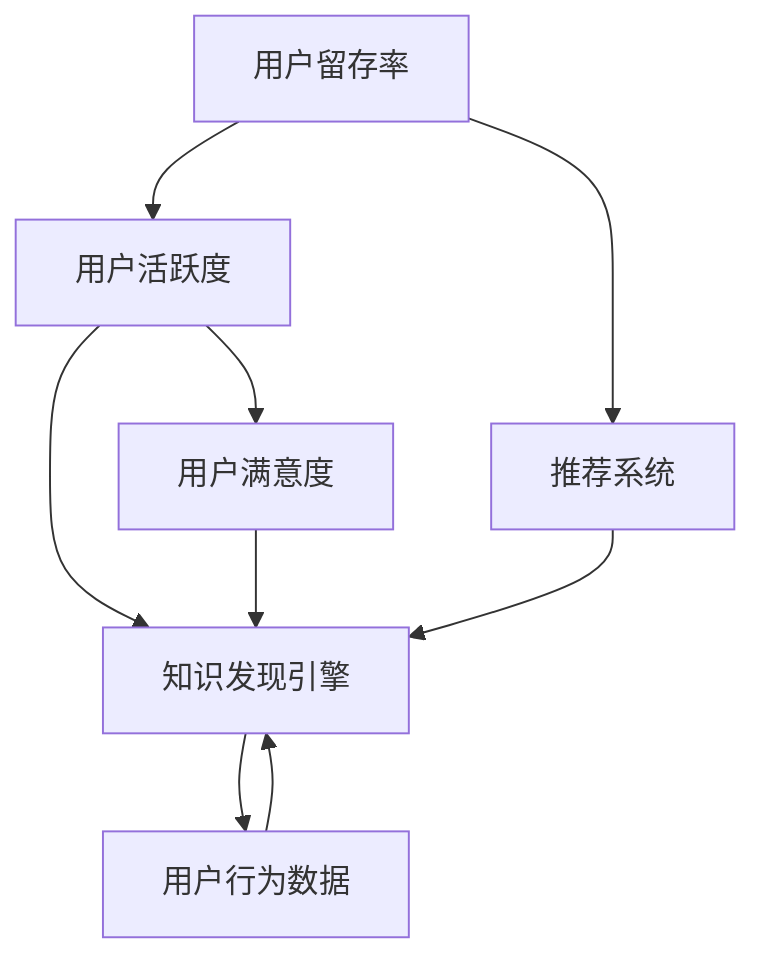

                 

# 知识发现引擎的用户留存与活跃度提升

## 1. 背景介绍

在快速发展的互联网时代，如何提升用户留存和活跃度已成为各大平台面临的共同挑战。知识发现引擎作为一种高效的信息检索与知识挖掘工具，对用户的留存和活跃度有着直接的影响。本文档旨在系统地分析影响用户留存和活跃度的关键因素，并提出针对知识发现引擎的解决方案。

## 2. 核心概念与联系

### 2.1 核心概念概述

- **用户留存率**：指在特定时间段内，再次访问平台的用户比例，通常以百分比表示。高用户留存率表示平台对用户具有较高的吸引力。

- **用户活跃度**：指用户在平台上的互动频率和持续时间，通常包括日活跃用户数、周活跃用户数等指标。高活跃度表示平台内容丰富、互动性强。

- **知识发现引擎**：一种通过算法自动发现知识或信息的技术平台，能够高效地从海量数据中提取有价值的信息，为用户提供个性化的知识服务。

- **推荐系统**：通过用户行为数据和内容特征，预测用户可能感兴趣的物品或内容，并推荐给用户的技术系统。

- **用户满意度**：用户对平台服务质量的总体评价，通常通过满意度调查或评分系统获取。

这些概念通过以下合maid流程图进行联系：



## 3. 核心算法原理 & 具体操作步骤

### 3.1 算法原理概述

提升用户留存和活跃度的关键在于通过个性化推荐和知识服务，不断增强用户的粘性和互动。

知识发现引擎的核心算法包括但不限于：

- **协同过滤算法**：通过分析用户行为，预测用户可能感兴趣的内容。
- **基于内容的推荐**：根据物品或内容的特征，推荐相似的物品或内容。
- **深度学习算法**：通过神经网络模型，直接从数据中挖掘高维特征，实现更加精准的推荐。

### 3.2 算法步骤详解

1. **用户行为数据收集**：
   - 数据来源：用户点击、浏览、收藏、分享、评分等行为数据。
   - 数据存储：使用分布式数据库或数据湖技术，保证数据存储的高效性和可扩展性。

2. **数据预处理**：
   - 数据清洗：去除重复、异常、无关数据，保证数据质量。
   - 特征工程：提取用户特征、内容特征、互动特征等，形成可输入模型的特征向量。

3. **模型训练与优化**：
   - 选择合适的算法，并根据数据特点进行模型训练。
   - 使用交叉验证、调参技术，优化模型性能，提高推荐准确率。

4. **个性化推荐**：
   - 根据用户的历史行为和特征，实时生成个性化推荐列表。
   - 考虑用户的时效性、地理位置、设备类型等因素，提供精准推荐。

5. **知识发现与服务**：
   - 利用知识发现算法，从用户行为数据中提取知识图谱、话题模型等。
   - 将知识服务融入推荐系统，提供更深入的个性化内容服务。

### 3.3 算法优缺点

**优点**：
- **个性化推荐**：能够精准预测用户兴趣，提高用户粘性。
- **知识发现**：通过大数据分析，挖掘更深层次的知识，提升服务深度。
- **高效实时**：通过高效的算法和分布式架构，实现实时推荐。

**缺点**：
- **高成本**：需要大量的计算资源和数据存储，投入成本较高。
- **过拟合风险**：个性化推荐依赖于用户历史数据，对新用户的推荐效果较差。
- **数据隐私**：用户行为数据的收集和使用可能涉及隐私问题，需严格遵守数据保护法规。

### 3.4 算法应用领域

知识发现引擎的用户留存与活跃度提升技术，主要应用于以下领域：

- **电商购物**：推荐用户可能感兴趣的商品，提高购物转化率。
- **在线教育**：推荐符合用户学习需求的课程，提升学习体验和效果。
- **社交网络**：推荐用户可能感兴趣的朋友、内容和活动，增加平台互动性。
- **健康医疗**：推荐符合用户健康需求的知识内容，提升健康管理效果。

## 4. 数学模型和公式 & 详细讲解

### 4.1 数学模型构建

构建知识发现引擎的推荐系统，通常采用如下数学模型：

- **协同过滤模型**：
  $$
  r_{ui} = \frac{1}{1+\sum_{j=1}^{n}\left| K_{u}^{j}-K_{i}^{j} \right|}
  $$
  其中 $r_{ui}$ 表示用户 $u$ 对物品 $i$ 的评分预测值，$K_{u}^{j}$ 和 $K_{i}^{j}$ 分别表示用户和物品的特征向量。

- **基于内容的推荐模型**：
  $$
  r_{ui} = \sum_{d=1}^{D}\theta_{d}x_{ui,d}
  $$
  其中 $r_{ui}$ 表示用户 $u$ 对物品 $i$ 的评分预测值，$x_{ui,d}$ 表示物品的特征向量，$\theta_{d}$ 为特征向量的权重。

- **深度学习模型**：
  $$
  \hat{r}_{ui} = \sum_{l=1}^{L}w_{il}a_{ul,l}
  $$
  其中 $\hat{r}_{ui}$ 表示用户 $u$ 对物品 $i$ 的评分预测值，$w_{il}$ 表示物品 $i$ 在隐含层 $l$ 的权重，$a_{ul,l}$ 表示用户 $u$ 在隐含层 $l$ 的激活值。

### 4.2 公式推导过程

1. **协同过滤公式推导**：
   - 假设用户 $u$ 对物品 $i$ 的实际评分为 $y_{ui}$，预测评分为 $r_{ui}$。
   - 将用户 $u$ 和物品 $i$ 的特征向量代入公式，计算预测评分 $r_{ui}$。
   - 最终预测评分与实际评分的误差可通过均方误差或均方根误差等损失函数进行优化。

2. **基于内容的推荐公式推导**：
   - 假设物品 $i$ 的特征向量为 $x_{i,d}$，用户 $u$ 对物品 $i$ 的评分预测值 $r_{ui}$ 取决于物品特征与用户特征的匹配度。
   - 通过线性回归或逻辑回归等算法，拟合评分预测值与实际评分的对应关系。

3. **深度学习模型公式推导**：
   - 通过多层神经网络模型，从用户行为数据中提取隐含层特征 $a_{ul,l}$。
   - 利用权值 $w_{il}$ 和激活函数，计算物品与用户间的相似度 $r_{ui}$。
   - 最终预测评分通过损失函数最小化，优化模型参数。

### 4.3 案例分析与讲解

以电商购物为例，分析推荐系统如何提升用户留存和活跃度：

1. **数据收集**：
   - 收集用户浏览、点击、收藏、购物车、购买行为等数据。
   - 数据存储于分布式数据库中，保证数据的高效可扩展性。

2. **数据预处理**：
   - 数据清洗：去除重复、无关、异常数据，保证数据质量。
   - 特征工程：提取用户特征（如年龄、性别、地域）、商品特征（如价格、品牌、类别）、互动特征（如点击次数、停留时间）等，形成可输入模型的特征向量。

3. **模型训练与优化**：
   - 使用协同过滤算法，根据用户行为数据，生成个性化推荐列表。
   - 考虑用户的时效性、地理位置、设备类型等因素，优化推荐模型参数，提高推荐准确率。

4. **个性化推荐**：
   - 根据用户的历史行为和特征，实时生成个性化推荐列表。
   - 通过展示精准推荐，提高用户购物转化率和满意度，增加用户留存率。

5. **用户满意度提升**：
   - 通过问卷调查、用户反馈等方式，了解用户对推荐结果的满意度。
   - 根据用户反馈，不断优化推荐算法，提升用户粘性和互动性。

## 5. 项目实践：代码实例和详细解释说明

### 5.1 开发环境搭建

1. **环境准备**：
   - 安装Python 3.8及以上版本。
   - 安装Pandas、Numpy、Scikit-learn、TensorFlow等库。
   - 搭建分布式数据存储和处理环境，如Hadoop、Spark等。

2. **数据收集与存储**：
   - 使用Apache Kafka或Flume等工具，收集用户行为数据。
   - 存储到Hadoop或Hive等分布式数据库中，确保数据的高效可扩展性。

3. **特征工程**：
   - 使用Pandas和Scikit-learn进行数据清洗和特征提取。
   - 根据用户行为数据，提取用户特征、商品特征、互动特征等。

### 5.2 源代码详细实现

以下是一个简单的推荐系统实现示例，以协同过滤算法为基础：

```python
from scipy.sparse import csr_matrix
from sklearn.metrics.pairwise import cosine_similarity
from numpy import mean

def collaborative_filtering(train_data, test_data):
    # 数据预处理
    train_data = csr_matrix(train_data)
    test_data = csr_matrix(test_data)
    
    # 构建相似度矩阵
    similarity_matrix = cosine_similarity(train_data)
    
    # 预测评分
    predicted_scores = []
    for user, item in test_data:
        user_scores = train_data[user]
        user_similarity = similarity_matrix[user]
        predicted_score = sum([user_scores[j] * user_similarity[j] for j in range(len(user_scores))]) / sum(user_similarity)
        predicted_scores.append((user, item, predicted_score))
    
    # 选择阈值k，获取推荐列表
    k = 10
    top_k_scores = sorted(predicted_scores, key=lambda x: x[2], reverse=True)[:k]
    
    return top_k_scores
```

### 5.3 代码解读与分析

上述代码实现了基本的协同过滤推荐算法。具体步骤如下：

1. **数据预处理**：
   - 使用SciPy的csr_matrix将数据转化为稀疏矩阵，以提高计算效率。
   - 使用Scikit-learn的cosine_similarity计算用户和物品间的相似度。

2. **预测评分**：
   - 遍历测试数据，对每个用户和物品组合，根据相似度矩阵计算预测评分。
   - 选择前k个预测评分最高的组合作为推荐列表。

3. **结果展示**：
   - 返回包含用户ID、物品ID和预测评分的推荐列表。

通过上述代码，可以初步实现基于协同过滤的个性化推荐。在实际应用中，需要进一步优化模型，加入数据增强、正则化、交叉验证等技术，提高推荐效果。

## 6. 实际应用场景

### 6.1 电商购物

电商购物是推荐系统的主要应用场景之一。通过推荐系统，电商平台可以精准预测用户可能感兴趣的商品，提升用户购物体验和转化率，增加用户留存和活跃度。

### 6.2 在线教育

在线教育平台通过推荐系统，推荐符合用户学习需求的课程，提升学习效果，增加用户粘性和互动。

### 6.3 社交网络

社交网络平台通过推荐系统，推荐用户可能感兴趣的朋友、内容和活动，增加平台互动性，提升用户活跃度。

### 6.4 健康医疗

健康医疗平台通过推荐系统，推荐符合用户健康需求的知识内容，提升健康管理效果，增加用户粘性。

## 7. 工具和资源推荐

### 7.1 学习资源推荐

- **《推荐系统实战》**：详细介绍推荐系统原理、算法和实现方法。
- **Coursera 推荐系统课程**：由斯坦福大学开设，涵盖推荐系统的理论基础和实际应用。
- **Kaggle 数据集和竞赛**：提供丰富的数据集和竞赛平台，帮助开发者练习和测试推荐系统算法。

### 7.2 开发工具推荐

- **TensorFlow**：Google开发的深度学习框架，支持分布式计算和模型优化。
- **PyTorch**：Facebook开发的深度学习框架，具有灵活的动态图和高效的计算性能。
- **Apache Spark**：支持大规模数据处理和机器学习的分布式计算框架。

### 7.3 相关论文推荐

- **《推荐系统：理论和算法》**：由马歇尔·卢卡斯·埃德尔斯通和张跃平合著，系统介绍推荐系统的理论基础和算法。
- **《深度学习推荐系统》**：由张丹和张育胜合著，详细介绍深度学习在推荐系统中的应用。
- **《推荐系统评估指标》**：综述推荐系统的评估指标和方法，帮助开发者选择适合的量化指标。

## 8. 总结：未来发展趋势与挑战

### 8.1 研究成果总结

本文档从用户留存与活跃度的视角，系统分析了知识发现引擎的推荐系统原理与应用。通过协同过滤、基于内容的推荐和深度学习等算法，实现了个性化推荐，提升用户粘性和互动性。

### 8.2 未来发展趋势

未来知识发现引擎的推荐系统将呈现以下趋势：

1. **多模态数据融合**：融合文本、图片、视频等多模态数据，提升推荐效果。
2. **冷启动问题解决**：解决新用户和冷启动物品的推荐问题，扩展推荐系统的覆盖面。
3. **实时推荐系统**：通过实时数据处理和计算，实现实时推荐，提升用户体验。
4. **个性化推荐模型**：引入更多个性化因素，提高推荐系统的精准度。

### 8.3 面临的挑战

知识发现引擎的推荐系统面临以下挑战：

1. **数据隐私**：用户行为数据的收集和使用涉及隐私问题，需严格遵守数据保护法规。
2. **冷启动问题**：新用户和冷启动物品的推荐效果较差，需进一步优化算法。
3. **高计算成本**：大规模数据处理和模型训练需要高昂的计算资源，需优化算法和架构。

### 8.4 研究展望

未来的研究将在以下几个方面寻求突破：

1. **多模态数据融合**：通过融合多模态数据，提高推荐系统的准确性和深度。
2. **冷启动问题解决**：引入更多个性化因素，提高冷启动物品和用户的推荐效果。
3. **实时推荐系统**：优化实时数据处理和计算，提升推荐系统的实时性和效率。
4. **推荐系统优化**：通过优化算法和架构，提高推荐系统的准确性和性能。

## 9. 附录：常见问题与解答

**Q1: 推荐系统如何提升用户留存率？**

A: 推荐系统通过精准预测用户可能感兴趣的内容，提升用户粘性和互动性，从而增加用户留存率。用户看到更符合自己兴趣和需求的内容，会增加平台的吸引力，延长用户停留时间。

**Q2: 如何优化推荐系统的准确性？**

A: 优化推荐系统的准确性可以从以下几个方面入手：
1. 数据收集：全面收集用户行为数据，包括点击、浏览、收藏、购买等行为。
2. 特征工程：提取更多的用户特征、内容特征、互动特征等，形成更丰富的特征向量。
3. 模型选择：选择合适的推荐算法，如协同过滤、基于内容的推荐、深度学习等，并根据数据特点进行优化。
4. 调参与验证：通过交叉验证、超参数调优等技术，提升推荐模型的性能。

**Q3: 推荐系统如何处理冷启动问题？**

A: 推荐系统处理冷启动问题可以从以下几个方面入手：
1. 用户画像构建：通过用户的基础信息、行为数据等构建用户画像，帮助系统对新用户进行初步推荐。
2. 内容丰富度：保证平台内容丰富，增加用户互动和推荐机会。
3. 推荐算法优化：通过引入更多个性化因素，如兴趣标签、历史行为等，提升推荐效果。

**Q4: 如何确保推荐系统的数据隐私？**

A: 确保推荐系统的数据隐私可以从以下几个方面入手：
1. 数据匿名化：通过数据匿名化技术，去除或模糊用户个人信息。
2. 数据加密：对用户数据进行加密处理，防止数据泄露。
3. 合规监管：遵守数据保护法规，如GDPR、CCPA等，确保数据处理合规。

总之，知识发现引擎的推荐系统在提升用户留存与活跃度方面具有重要意义。通过精准推荐和个性化服务，平台可以更好地满足用户需求，增加用户粘性和互动性，从而实现更高的留存率和活跃度。随着推荐技术的不断进步，未来的知识发现引擎将具备更强的数据处理能力和推荐效果，为平台提供更优质的服务体验。

---

作者：禅与计算机程序设计艺术 / Zen and the Art of Computer Programming

