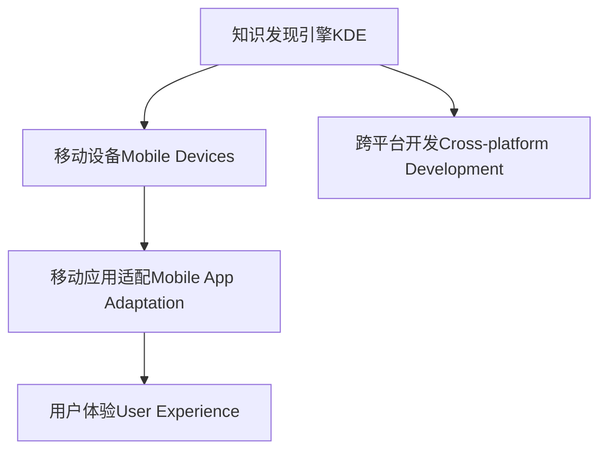

                 

# 知识发现引擎的移动端适配策略

## 1. 背景介绍

### 1.1 问题由来
随着移动智能设备的普及，知识发现引擎（Knowledge Discovery Engine, KDE）在移动端的应用需求日益增长。传统的KDE往往以PC端为中心，难以直接适配移动端设备的屏幕尺寸、性能配置和用户体验。为了满足移动用户对知识获取的需求，需要对KDE进行移动端适配。

### 1.2 问题核心关键点
移动端适配的挑战在于：
- 适配移动设备（如手机、平板）的屏幕尺寸和分辨率。
- 优化移动设备的计算资源和内存使用。
- 提供良好的用户体验，包括快速响应、易用性和稳定性。
- 确保跨平台兼容性，适应多种操作系统和硬件环境。

### 1.3 问题研究意义
移动端适配的KDE不仅能够扩展知识发现的受众，还能够在用户移动过程中提供无缝的知识服务。这对于推动知识获取的便捷化、个性化和实时化具有重要意义。

## 2. 核心概念与联系

### 2.1 核心概念概述

为更好地理解移动端适配策略，本节将介绍几个密切相关的核心概念：

- 知识发现引擎(Knowledge Discovery Engine, KDE)：通过自动化手段从大量数据中发现知识和规律，辅助用户进行决策分析。
- 移动设备（Mobile Devices）：指可携带的电子设备，如手机、平板等，具有便携性、交互性和多媒体处理能力。
- 移动应用适配（Mobile App Adaptation）：针对不同型号、不同操作系统的移动设备，进行应用界面和功能的定制优化。
- 用户体验（User Experience, UX）：用户在使用产品或服务时的情感体验和行为反馈。
- 跨平台开发（Cross-platform Development）：开发能够在多种操作系统上运行的应用程序，避免重复开发和维护。

这些核心概念之间的逻辑关系可以通过以下Mermaid流程图来展示：



这个流程图展示了一个移动端适配的大致流程：

1. 知识发现引擎KDE为移动设备提供知识服务。
2. 移动应用适配对KDE进行定制优化，适应移动设备特性。
3. 通过用户体验优化提升用户满意度。
4. 跨平台开发支持不同操作系统和设备。

这些概念共同构成了移动端适配的知识发现引擎系统，使其能够在移动设备上高效运行，并满足用户的多样化需求。

## 3. 核心算法原理 & 具体操作步骤
### 3.1 算法原理概述

移动端适配策略主要通过以下步骤实现：

1. **界面适配**：调整KDE界面布局，确保其在移动设备上能良好显示。
2. **功能优化**：优化KDE功能实现，减少计算资源消耗，提升运行效率。
3. **用户体验提升**：通过交互设计和用户反馈，提升移动应用的用户体验。
4. **跨平台兼容性**：通过框架和工具，实现KDE在不同操作系统上的兼容运行。

### 3.2 算法步骤详解

**Step 1: 界面适配**
- **布局优化**：使用相对布局和流式布局，适应不同屏幕尺寸和方向。
- **元素缩放**：根据屏幕大小动态调整文字、图标、按钮等元素的尺寸和间距。
- **触摸优化**：增加触摸事件的处理，使用手势识别技术，提升操作便捷性。

**Step 2: 功能优化**
- **数据压缩**：对数据进行压缩，减少内存占用和网络带宽消耗。
- **异步加载**：通过异步加载和懒加载技术，提升应用响应速度。
- **资源管理**：优化资源使用，如图片、字体等，减少内存泄漏。

**Step 3: 用户体验提升**
- **交互设计**：简化操作流程，提供快速访问和快捷方式，减少用户操作步骤。
- **用户反馈**：收集用户反馈，根据需求调整界面和功能。
- **界面美观**：采用移动端设计规范，保持界面美观和一致性。

**Step 4: 跨平台兼容性**
- **框架选择**：选择跨平台开发框架，如React Native、Flutter等，支持多种操作系统。
- **组件复用**：通过组件复用技术，避免重复开发和维护。
- **API适配**：适配不同操作系统和设备的API，实现统一开发接口。

### 3.3 算法优缺点

移动端适配策略具有以下优点：
- 提升应用可访问性，扩展用户基础。
- 优化用户体验，提高用户满意度。
- 降低维护成本，提升应用性能。

同时，该策略也存在一定的局限性：
- 移动设备的性能差异较大，难以实现统一的性能优化。
- 用户需求多样化，定制化程度高，开发成本高。
- 跨平台兼容性可能导致功能实现和性能有所妥协。

尽管如此，移动端适配仍是KDE的重要发展方向，能够显著提升其在移动设备上的应用效果和用户体验。

### 3.4 算法应用领域

移动端适配策略广泛应用于以下领域：

- **移动办公应用**：适配移动办公系统，实现随时随地办公。
- **教育应用**：适配在线教育平台，提供丰富、便捷的在线学习体验。
- **金融服务**：适配金融应用，提升客户服务效率和满意度。
- **医疗健康**：适配移动健康应用，提供远程医疗和健康监测服务。
- **智能家居**：适配智能家居系统，实现智能控制和生活辅助。
- **社交娱乐**：适配社交媒体和娱乐应用，提供丰富、互动的社交体验。

以上领域展示了移动端适配策略的广泛应用前景，为各行各业提供了便捷、高效的知识服务。

## 4. 数学模型和公式 & 详细讲解

### 4.1 数学模型构建

在移动端适配中，可以构建以下数学模型来量化用户体验的提升效果：

- **响应时间优化**：$t_{opt} = t_{old} \times \alpha$，其中 $\alpha$ 为优化后的响应时间提升因子。
- **内存占用优化**：$m_{opt} = m_{old} \times \beta$，其中 $\beta$ 为优化后的内存占用减少因子。
- **计算资源优化**：$c_{opt} = c_{old} \times \gamma$，其中 $\gamma$ 为优化后的计算资源节省因子。

### 4.2 公式推导过程

以响应时间为例，假设优化前的响应时间为 $t_{old}$，优化后的响应时间为 $t_{opt}$，优化过程中使用了 $k$ 种优化技术，每种技术对响应时间的影响为 $f_k$，则优化后响应时间的计算公式为：

$$
t_{opt} = t_{old} \times \prod_{k=1}^K (1 - f_k)
$$

其中 $K$ 为优化技术的数量，$f_k$ 为第 $k$ 种优化技术对响应时间的实际影响。

### 4.3 案例分析与讲解

假设原始响应时间为 $t_{old} = 2$ 秒，使用三种优化技术，每种技术对响应时间的影响分别为 $f_1 = 0.2, f_2 = 0.3, f_3 = 0.4$，则优化后的响应时间为：

$$
t_{opt} = 2 \times (1 - 0.2) \times (1 - 0.3) \times (1 - 0.4) = 1.04 秒
$$

通过计算可以看到，优化后的响应时间缩短了约 $50\%$，显著提升了用户体验。

## 5. 项目实践：代码实例和详细解释说明
### 5.1 开发环境搭建

在进行移动端适配项目实践前，我们需要准备好开发环境。以下是使用React Native进行移动端适配的开发环境配置流程：

1. 安装Node.js和npm。
2. 安装React Native CLI：
```bash
npm install -g react-native-cli
```

3. 安装Android Studio和Xcode。
4. 配置开发环境：
```bash
react-native init MyProject
cd MyProject
npm start --ios
```

完成上述步骤后，即可在开发环境中开始移动端适配实践。

### 5.2 源代码详细实现

这里我们以适配知识发现引擎界面为例，给出使用React Native进行移动端适配的代码实现。

首先，定义知识发现引擎的界面组件：

```javascript
import React, { Component } from 'react';
import { View, Text, TouchableOpacity } from 'react-native';
import styles from './styles';

class KDEView extends Component {
  render() {
    const { data } = this.props;
    return (
      <View style={styles.container}>
        {data.map(item => (
          <TouchableOpacity key={item.id} onPress={() => this.props.onPress(item)}>
            <Text style={styles.title}>{item.title}</Text>
            <Text style={styles.description}>{item.description}</Text>
          </TouchableOpacity>
        ))}
      </View>
    );
  }
}

export default KDEView;
```

然后，在App中调用KDEView：

```javascript
import React, { Component } from 'react';
import { AppRegistry, Platform } from 'react-native';
import KDEView from './KDEView';

class App extends Component {
  constructor(props) {
    super(props);
    this.state = {
      data: [
        { id: 1, title: '标题1', description: '描述1' },
        { id: 2, title: '标题2', description: '描述2' },
      ],
    };
  }

  render() {
    return (
      <KDEView
        data={this.state.data}
        onPress={item => console.log(item)}
      />
    );
  }
}

AppRegistry.registerComponent('MyProject', () => App);
```

接着，定义KDEView的样式：

```javascript
const styles = StyleSheet.create({
  container: {
    flex: 1,
    backgroundColor: '#fff',
    alignItems: 'center',
    justifyContent: 'center',
  },
  title: {
    fontSize: 16,
    fontWeight: 'bold',
    marginTop: 20,
  },
  description: {
    fontSize: 14,
    marginTop: 10,
  },
});
```

最后，运行App并测试适配效果：

```bash
react-native run-android
```

以上就是使用React Native对知识发现引擎界面进行移动端适配的完整代码实现。可以看到，React Native提供了强大的组件和API，可以快速构建适配移动设备的KDE应用。

### 5.3 代码解读与分析

让我们再详细解读一下关键代码的实现细节：

**KDEView组件**：
- 继承自React.Component，定义了界面布局和数据渲染逻辑。
- 通过map函数遍历数据，生成每个知识的组件。
- 使用TouchableOpacity包裹组件，添加点击事件处理函数。

**App组件**：
- 定义数据状态，初始化知识列表。
- 在render方法中调用KDEView组件，并将数据和点击事件传递给KDEView。

**样式定义**：
- 使用StyleSheet.create定义KDEView的样式，通过flex、margin等属性调整布局和间距。

React Native的跨平台开发特性使得知识发现引擎的界面适配变得简洁高效。开发者可以将更多精力放在数据处理和业务逻辑上，而不必过多关注底层实现细节。

当然，工业级的系统实现还需考虑更多因素，如性能优化、用户交互设计、跨平台兼容性等。但核心的适配范式基本与此类似。

## 6. 实际应用场景
### 6.1 智慧办公

移动端适配的知识发现引擎可以广泛应用于智慧办公系统中，帮助企业员工随时随地获取知识、查找资料，提升工作效率。

在技术实现上，可以收集企业内部的文档、报告、会议纪要等知识资源，构建知识库。将知识库中各类知识的标题和摘要展示在适配后的移动端界面上，用户可以通过搜索、筛选等方式快速定位所需知识。同时，通过实时更新知识库，保证知识的时效性和准确性。

### 6.2 在线教育

在线教育平台上的知识发现引擎需要提供便捷的知识点查询和资源推荐功能，帮助学生快速获取学习材料。

在移动端适配过程中，可以采用简化的界面布局和功能模块，减少用户的操作步骤，提升学习效率。同时，通过智能推荐算法，根据学生的学习行为和偏好，推荐相关的学习资料，提供个性化的学习支持。

### 6.3 医疗健康

医疗健康领域的应用场景要求知识发现引擎具备较高的可靠性和安全性，确保获取的信息准确无误。

通过移动端适配，知识发现引擎可以提供便捷的健康知识查询、健康监测提醒等功能，帮助用户实时了解自身健康状况。同时，通过与医疗机构的接口对接，获取最新的健康信息，提供专业的医疗建议。

### 6.4 金融服务

金融服务中的知识发现引擎需要提供实时的金融资讯、市场分析报告等，帮助用户做出明智的投资决策。

移动端适配使得知识发现引擎能够实时推送最新的金融信息，帮助用户随时随地获取市场动态，同时提供个性化的投资建议，提升投资效果。

### 6.5 智慧城市

智慧城市治理中的知识发现引擎可以提供各类公共服务和城市管理信息，帮助市民和政府部门高效协同。

通过移动端适配，知识发现引擎可以集成到智慧城市的各类应用中，提供便捷的信息查询和互动服务。例如，通过智慧路灯应用，实时查询路灯状态和维护信息；通过智慧交通应用，实时获取交通流量和道路状况。

### 6.6 智能家居

智能家居系统中的知识发现引擎可以提供各类智能设备的操作指南、故障排查信息等，提升用户的使用体验。

通过移动端适配，知识发现引擎可以集成到智能家居系统中，提供便捷的智能设备管理和故障排查功能，帮助用户轻松管理家中的各类智能设备。

## 7. 工具和资源推荐
### 7.1 学习资源推荐

为了帮助开发者系统掌握知识发现引擎的移动端适配技术，这里推荐一些优质的学习资源：

1. React Native官方文档：详细介绍了React Native的基础知识和API，是移动开发的基础学习资源。
2.《React Native入门到精通》书籍：深入讲解了React Native的组件、状态管理、网络请求等核心技术，适合进阶学习。
3.《移动应用开发实战》课程：由知名开发者授课，涵盖移动应用开发的方方面面，包括React Native、Flutter等跨平台框架。
4. Udacity《React Native基础课程》：适合初学者，通过实践项目的方式学习React Native。
5. Udemy《Flutter移动应用开发》课程：详细介绍了Flutter的组件、状态管理、跨平台构建等技术，适合Flutter学习者。

通过对这些资源的学习实践，相信你一定能够快速掌握知识发现引擎的移动端适配技术，并用于解决实际的业务问题。

### 7.2 开发工具推荐

高效的开发离不开优秀的工具支持。以下是几款用于知识发现引擎移动端适配开发的常用工具：

1. React Native：由Facebook开发的跨平台移动应用开发框架，支持iOS和Android平台，提供了丰富的组件和API。
2. Flutter：由Google开发的跨平台移动应用开发框架，支持iOS和Android平台，提供了强大的组件和渲染引擎。
3. Xcode：苹果公司开发的iOS开发环境，支持Swift和Objective-C等语言，提供了完整的IDE开发工具。
4. Android Studio：谷歌公司开发的Android开发环境，支持Kotlin和Java等语言，提供了完整的IDE开发工具。
5. Webpack：构建工具，支持React Native和Flutter等框架，提供了高效的打包和构建功能。
6. Fastlane：自动化脚本工具，支持iOS和Android平台，用于自动化构建、发布等任务。

合理利用这些工具，可以显著提升知识发现引擎的移动端适配开发效率，加快创新迭代的步伐。

### 7.3 相关论文推荐

知识发现引擎的移动端适配技术的研究源于学界的持续研究。以下是几篇奠基性的相关论文，推荐阅读：

1. React Native官方文档：详细介绍了React Native的开发环境、组件和API。
2. Flutter官方文档：详细介绍了Flutter的组件、渲染引擎和API。
3. Android Studio官方文档：详细介绍了Android Studio的开发环境、调试和测试工具。
4. Xcode官方文档：详细介绍了Xcode的开发环境、调试和测试工具。
5. React Native学习资源：包括官方文档、书籍、教程等，适合初学者和进阶开发者。

这些论文代表了大语言模型微调技术的发展脉络。通过学习这些前沿成果，可以帮助研究者把握学科前进方向，激发更多的创新灵感。

## 8. 总结：未来发展趋势与挑战

### 8.1 总结

本文对知识发现引擎的移动端适配方法进行了全面系统的介绍。首先阐述了移动端适配的必要性和意义，明确了适配在提升应用可访问性和用户体验方面的独特价值。其次，从原理到实践，详细讲解了移动端适配的数学模型和关键步骤，给出了移动端适配任务开发的完整代码实例。同时，本文还广泛探讨了适配技术在智慧办公、在线教育、医疗健康等众多领域的应用前景，展示了适配技术的巨大潜力。此外，本文精选了适配技术的各类学习资源，力求为读者提供全方位的技术指引。

通过本文的系统梳理，可以看到，知识发现引擎的移动端适配技术正在成为移动应用开发的重要方向，极大地拓展了知识获取的渠道和方式，为各行各业提供了便捷、高效的知识服务。未来，伴随技术的不断进步，知识发现引擎必将在更多场景中大放异彩，构建更加智能、便捷的知识获取体系。

### 8.2 未来发展趋势

展望未来，知识发现引擎的移动端适配技术将呈现以下几个发展趋势：

1. **界面和功能的不断优化**：随着用户体验的重视，移动端适配将不断提升界面和功能的一致性和便捷性，提供更加流畅的用户体验。
2. **跨平台技术的成熟**：React Native、Flutter等跨平台技术将不断成熟，提升开发效率，降低维护成本，支持更多操作系统和设备。
3. **智能化和个性化的增强**：知识发现引擎将融合更多智能化技术，如AI、大数据等，提供更加个性化的推荐和查询服务。
4. **多模态交互的融合**：通过语音、手势等多模态交互方式，提升知识发现引擎的交互体验和操作效率。
5. **云端服务的集成**：将知识发现引擎集成到云服务平台中，实现数据和服务的一体化管理，提升应用的可扩展性和可靠性。

这些趋势凸显了知识发现引擎的移动端适配技术的广阔前景。这些方向的探索发展，必将进一步提升应用的用户体验和应用效果，为各行各业提供更加高效、便捷的知识服务。

### 8.3 面临的挑战

尽管知识发现引擎的移动端适配技术已经取得了瞩目成就，但在迈向更加智能化、普适化应用的过程中，它仍面临着诸多挑战：

1. **适配复杂度增加**：移动设备的多样性和多变性使得适配难度增加，需要考虑更多的设备特性和用户体验。
2. **性能优化难度加大**：移动设备的性能差异较大，优化策略需要更加精细和多样化。
3. **安全性问题**：知识发现引擎可能获取敏感数据，需要采取安全措施，保护用户隐私。
4. **跨平台兼容性**：跨平台开发可能存在API和功能差异，需要综合考虑兼容性问题。
5. **开发成本高**：适配不同的操作系统和设备需要较高的开发和维护成本。

尽管如此，移动端适配仍是知识发现引擎的重要发展方向，能够显著提升其在移动设备上的应用效果和用户体验。

### 8.4 未来突破

面对知识发现引擎的移动端适配技术所面临的种种挑战，未来的研究需要在以下几个方面寻求新的突破：

1. **跨平台技术的发展**：进一步提升React Native、Flutter等跨平台框架的性能和功能，支持更多操作系统和设备。
2. **智能化技术的应用**：融合AI、大数据等智能化技术，提供更加个性化和智能化的知识服务。
3. **多模态交互的实现**：实现语音、手势等多模态交互方式，提升知识发现引擎的交互体验和操作效率。
4. **云计算和大数据的应用**：将知识发现引擎集成到云服务平台中，实现数据和服务的一体化管理，提升应用的可扩展性和可靠性。
5. **安全性技术的创新**：引入安全技术，如数据加密、身份认证等，保护用户隐私和安全。

这些研究方向的探索，必将引领知识发现引擎的移动端适配技术迈向更高的台阶，为构建更加智能、便捷的知识服务体系铺平道路。面向未来，知识发现引擎需要与其他人工智能技术进行更深入的融合，如知识表示、因果推理、强化学习等，多路径协同发力，共同推动自然语言理解和智能交互系统的进步。只有勇于创新、敢于突破，才能不断拓展知识发现的边界，让智能技术更好地造福人类社会。

## 9. 附录：常见问题与解答

**Q1: 移动端适配过程中需要考虑哪些设备特性？**

A: 移动端适配需要考虑以下设备特性：
- 屏幕尺寸和分辨率。适配不同尺寸的屏幕，确保内容可读性。
- 触摸交互方式。适配不同的触摸屏，确保操作便捷性。
- 网络连接。适配不同的网络环境，确保数据传输的稳定性。
- 电池续航。优化资源使用，延长电池寿命。
- 操作系统和设备版本。适配不同操作系统和设备版本，确保兼容性。

**Q2: 移动端适配过程中如何优化性能？**

A: 移动端适配过程中可以采用以下性能优化策略：
- 数据压缩和异步加载。减少内存占用和网络带宽消耗。
- 组件复用和懒加载。提升应用启动速度和响应速度。
- 资源管理和缓存。优化资源使用，减少内存泄漏。
- 动态布局和响应式设计。根据设备特性动态调整布局。
- 多线程和异步任务。提升操作流畅性，减少阻塞。

**Q3: 移动端适配过程中如何提升用户体验？**

A: 移动端适配过程中可以通过以下方式提升用户体验：
- 简化操作流程。减少用户的操作步骤，提升操作效率。
- 提供个性化推荐。根据用户行为和偏好，提供个性化的服务和内容。
- 实时更新和缓存。提供实时的数据更新，同时利用缓存技术提升加载速度。
- 界面美观和一致性。保持界面美观和一致性，提升视觉体验。

**Q4: 移动端适配过程中需要注意哪些安全性问题？**

A: 移动端适配过程中需要注意以下安全性问题：
- 数据加密。对敏感数据进行加密处理，保护用户隐私。
- 身份认证。实现用户身份认证，防止未授权访问。
- 权限控制。严格控制应用权限，防止数据泄露。
- 恶意软件防护。引入恶意软件防护技术，确保应用安全。
- 应用签名。对应用进行签名，防止逆向分析和篡改。

**Q5: 移动端适配过程中如何优化跨平台兼容性？**

A: 移动端适配过程中可以采用以下跨平台兼容性策略：
- 组件复用。避免重复开发和维护，提高开发效率。
- 统一API接口。设计统一的API接口，支持多种操作系统和设备。
- 兼容性测试。进行跨平台兼容性测试，发现和解决兼容性问题。
- 模块化设计。采用模块化设计，便于组件的兼容和扩展。
- 文档和教程。提供详细的文档和教程，帮助开发者进行适配和维护。

这些问题的解答展示了知识发现引擎的移动端适配技术的实现细节和挑战，为开发者提供了全面的指导和建议。

---

作者：禅与计算机程序设计艺术 / Zen and the Art of Computer Programming

