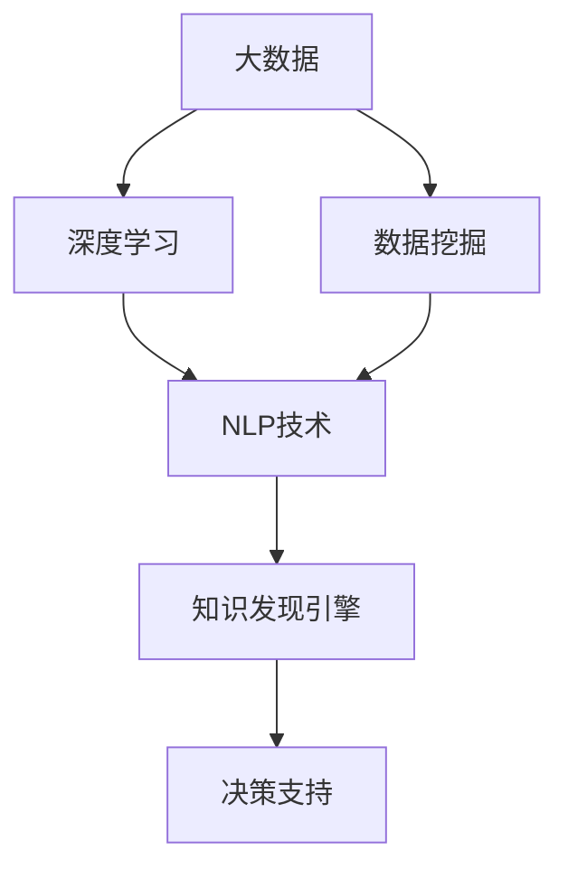
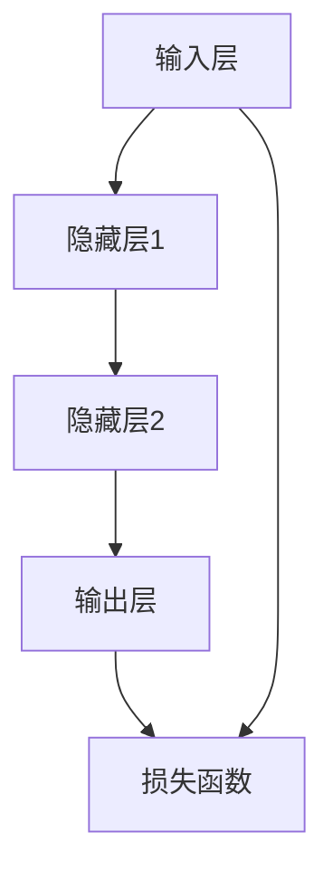
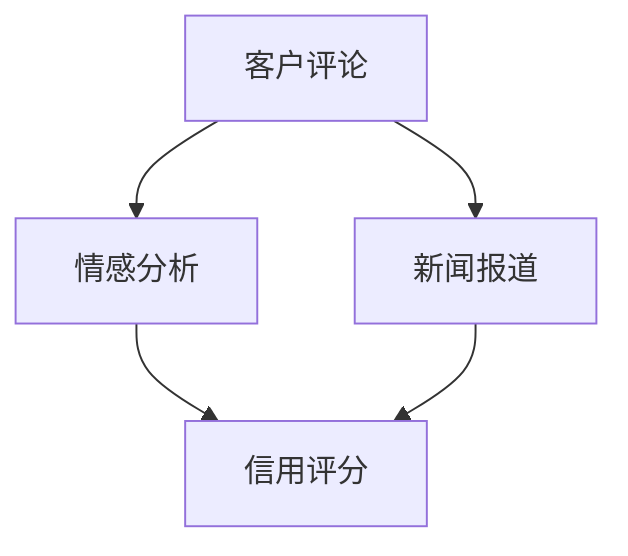
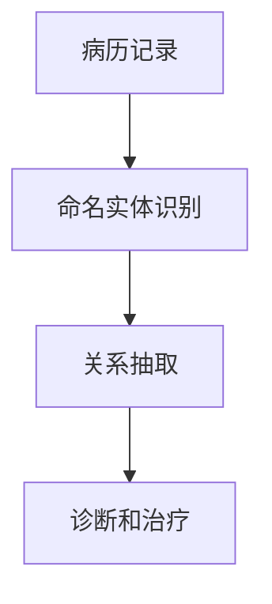
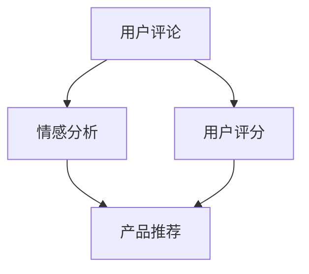

                 

# 知识发现引擎的自然语言处理技术应用

> 关键词：知识发现引擎, 自然语言处理, 大数据, 深度学习, 机器学习, 数据挖掘, 智能决策

## 1. 背景介绍

在信息化社会中，海量数据成为信息资源的核心。如何从大规模数据中提取有价值的知识，一直是学术界和工业界关注的焦点。知识发现引擎(Knowledge Discovery Engine, KDE)便是应运而生的高效智能系统，它通过深度学习、数据挖掘等技术，帮助用户从大数据中发现知识、提炼信息，进而辅助决策。

自然语言处理(Natural Language Processing, NLP)作为知识发现引擎的重要组成部分，不仅能够处理和分析非结构化文本数据，还能通过语义理解、情感分析、主题建模等手段，辅助用户构建知识图谱、识别关键信息、生成决策报告。NLP技术的快速发展和应用，使得知识发现引擎的智能化水平不断提升，覆盖行业从金融、医疗到电商、物流，应用于各种复杂场景的决策支持。

本文将详细介绍知识发现引擎中自然语言处理技术的原理、实现方法及应用场景，并展望其未来的发展趋势和面临的挑战。通过全面分析知识发现引擎的NLP技术应用，希望能为相关研究者和工程开发者提供理论支撑和实践指导。

## 2. 核心概念与联系

### 2.1 核心概念概述

- 知识发现引擎(KDE): 通过深度学习、数据挖掘等技术，从大数据中提取有价值的信息和知识，辅助用户进行决策的智能系统。
- 自然语言处理(NLP): 涉及语音、文本的生成、理解和处理，是知识发现引擎的关键技术之一。
- 大数据: 指规模大、速度快、类型多、价值高的数据集合，为知识发现提供了广阔的数据源。
- 深度学习: 利用多层神经网络结构对大规模数据进行学习，提取出数据中的高层次抽象特征。
- 机器学习: 通过训练模型，使机器具备对新数据的预测和推理能力。
- 数据挖掘: 从数据中自动发现有用信息、知识或模式的过程。
- 语义理解: 理解文本中的隐含意义，识别出关键信息，提取主题和实体。

这些概念相互关联，共同构成了知识发现引擎的NLP技术框架。通过深度学习和数据挖掘等技术，NLP可以对大数据进行处理，从中提取有价值的知识，辅助用户进行高效决策。

### 2.2 核心概念原理和架构的 Mermaid 流程图



这个流程图展示了从大数据到知识发现引擎的过程：首先通过深度学习和数据挖掘技术对大数据进行处理，接着应用NLP技术提取关键信息，最后通过知识发现引擎生成决策支持，帮助用户做出更科学的决策。

## 3. 核心算法原理 & 具体操作步骤

### 3.1 算法原理概述

知识发现引擎中的NLP技术主要基于深度学习和自然语言处理算法，实现对非结构化文本数据的处理和分析。常见的NLP算法包括文本分类、情感分析、命名实体识别、关系抽取、语义相似度计算等，这些算法构成了一个完整的NLP技术链。

### 3.2 算法步骤详解

#### 3.2.1 数据预处理

1. 数据清洗：去除噪声、不一致的数据，如HTML标签、特殊符号、拼写错误等。
2. 分词：将连续的文本分割成单个词语或词语序列。中文分词方法包括基于词典、基于统计和基于规则等方法。
3. 词性标注：标记每个词语在句子中的词性，如名词、动词、形容词等。
4. 命名实体识别：识别出文本中的特定实体，如人名、地名、组织名等。

#### 3.2.2 特征工程

1. 文本向量化：将文本转换为数值向量，常用的方法包括词袋模型、TF-IDF、Word2Vec、BERT等。
2. 特征选择：从众多特征中选出对模型性能有帮助的特征，如TF-IDF权重、词频、词性标注等。
3. 构建特征组合：使用特征组合技术，如n-gram、LSTM、Transformer等，提升模型性能。

#### 3.2.3 模型训练

1. 选择模型：选择合适的NLP模型，如文本分类、情感分析、命名实体识别等。
2. 划分数据集：将数据集划分为训练集、验证集和测试集。
3. 设置超参数：选择优化算法、学习率、批大小等超参数，并进行调参。
4. 训练模型：在训练集上进行模型训练，使用损失函数进行优化。
5. 验证模型：在验证集上评估模型性能，调整超参数，防止过拟合。
6. 测试模型：在测试集上评估模型性能，得到最终评估指标。

#### 3.2.4 模型应用

1. 文本分类：将文本分为多个类别，如新闻分类、客户评价分类等。
2. 情感分析：判断文本的情感倾向，如正面、中性、负面等。
3. 命名实体识别：识别出文本中的实体，并标注其类别。
4. 关系抽取：从文本中抽取出实体之间的关系，如主谓宾关系等。
5. 语义相似度计算：计算文本之间的语义相似度，辅助推荐系统、搜索系统等。

### 3.3 算法优缺点

#### 3.3.1 优点

1. 处理非结构化数据：NLP技术能够处理和分析文本、语音等非结构化数据，提取其中有价值的信息。
2. 自动化程度高：利用深度学习算法，NLP技术可以自动化地从大数据中发现知识和模式，辅助决策。
3. 泛化能力强：通过大量数据训练，NLP模型能够适应不同领域的文本数据，提升模型泛化能力。
4. 应用广泛：NLP技术应用于知识发现引擎中，可以覆盖各种行业和场景，提供智能决策支持。

#### 3.3.2 缺点

1. 数据依赖性强：NLP技术依赖于大量高质量的标注数据，获取数据成本较高。
2. 模型复杂度高：深度学习模型参数量较大，训练和推理耗时长。
3. 可解释性不足：深度学习模型多为"黑盒"，难以解释其内部决策过程。
4. 鲁棒性差：NLP模型对噪声、领域变化敏感，易受影响。

### 3.4 算法应用领域

#### 3.4.1 金融领域

1. 风险评估：通过情感分析、文本分类等技术，评估客户对贷款、投资等的情感倾向，辅助风险控制。
2. 信用评分：利用客户评论、新闻报道等信息，构建信用评分模型，提高信贷决策准确性。
3. 舆情监测：实时监测市场舆情，识别潜在的市场风险，进行预警。

#### 3.4.2 医疗领域

1. 病历分析：利用命名实体识别、关系抽取技术，分析病历数据，辅助诊断和治疗。
2. 药物研发：通过文本挖掘，提取药物相关的知识信息，加速新药研发进程。
3. 健康管理：从健康记录、论坛帖子中提取信息，提供健康管理建议。

#### 3.4.3 电商领域

1. 产品推荐：利用用户评论、评分，构建推荐模型，提高用户满意度。
2. 客户服务：通过问答系统、情感分析技术，提升客户服务质量。
3. 市场分析：从社交媒体、新闻报道中提取信息，进行市场趋势预测。

#### 3.4.4 物流领域

1. 订单分析：通过文本分类、情感分析技术，识别订单状态，优化物流管理。
2. 配送优化：从客户评论、反馈中提取信息，优化配送路线和客户服务。
3. 异常检测：从运输记录、司机评论中提取信息，检测运输异常。

## 4. 数学模型和公式 & 详细讲解 & 举例说明

### 4.1 数学模型构建

在知识发现引擎中，NLP技术通常采用深度学习模型进行建模。以文本分类为例，其数学模型可以表示为：

$$
y = f(x; \theta)
$$

其中 $y$ 表示分类结果，$x$ 表示输入文本，$\theta$ 表示模型参数。

### 4.2 公式推导过程

以文本分类为例，常用的分类算法包括朴素贝叶斯、逻辑回归、SVM、神经网络等。这里以神经网络分类为例，推导其公式推导过程。

神经网络模型通常由多个隐藏层和输出层组成，其结构如图：



其中 $A$ 表示输入层，$B$ 和 $C$ 表示隐藏层，$D$ 表示输出层，$E$ 表示损失函数。假设 $x$ 表示输入，$y$ 表示真实标签，$\hat{y}$ 表示模型预测结果，则损失函数可以表示为：

$$
\mathcal{L} = \frac{1}{N}\sum_{i=1}^N \ell(y_i, \hat{y}_i)
$$

其中 $\ell$ 表示损失函数，如交叉熵损失函数。在反向传播过程中，损失函数对参数 $\theta$ 的梯度为：

$$
\frac{\partial \mathcal{L}}{\partial \theta} = -\frac{1}{N}\sum_{i=1}^N \frac{\partial \ell(y_i, \hat{y}_i)}{\partial \hat{y}_i} \frac{\partial \hat{y}_i}{\partial \theta}
$$

其中 $\frac{\partial \hat{y}_i}{\partial \theta}$ 表示模型输出对参数 $\theta$ 的梯度，可通过反向传播算法计算。

### 4.3 案例分析与讲解

以情感分析为例，我们可以采用以下流程：

1. 数据预处理：清洗数据，进行分词、词性标注、命名实体识别。
2. 特征工程：将文本向量化，选择TF-IDF权重、词频等特征。
3. 模型训练：选择逻辑回归、SVM、神经网络等模型，训练情感分类器。
4. 验证模型：在验证集上评估模型性能，调整超参数。
5. 测试模型：在测试集上评估模型性能，得到最终评估指标。

### 4.4 案例实现与分析

以情感分析为例，使用Python和TensorFlow实现。首先，我们需要准备情感数据集，包含文本和相应的情感标签。然后，进行数据预处理，使用TensorFlow的tf.data.Dataset API进行批处理、随机打乱和归一化。接着，定义模型，使用Embedding层将文本转换为向量表示，通过多个隐藏层进行特征提取，最后输出情感预测结果。最后，使用交叉熵损失函数进行模型训练，并在测试集上评估模型性能。

## 5. 项目实践：代码实例和详细解释说明

### 5.1 开发环境搭建

在项目实践前，我们需要准备好开发环境。以下是使用Python进行TensorFlow开发的环境配置流程：

1. 安装Anaconda：从官网下载并安装Anaconda，用于创建独立的Python环境。

2. 创建并激活虚拟环境：
```bash
conda create -n tf-env python=3.8 
conda activate tf-env
```

3. 安装TensorFlow：根据CUDA版本，从官网获取对应的安装命令。例如：
```bash
conda install tensorflow -c pytorch -c conda-forge
```

4. 安装其他依赖包：
```bash
pip install numpy pandas sklearn scikit-learn matplotlib tqdm jupyter notebook ipython
```

完成上述步骤后，即可在`tf-env`环境中开始项目实践。

### 5.2 源代码详细实现

以情感分析为例，给出使用TensorFlow实现模型的完整代码。

首先，定义情感数据集：

```python
import pandas as pd
from tensorflow.keras.preprocessing.text import Tokenizer
from tensorflow.keras.preprocessing.sequence import pad_sequences

# 加载情感数据集
data = pd.read_csv('sentiment.csv', encoding='utf-8')
texts = data['text'].tolist()
labels = data['label'].tolist()

# 数据预处理
tokenizer = Tokenizer(num_words=10000, oov_token='<OOV>')
tokenizer.fit_on_texts(texts)
sequences = tokenizer.texts_to_sequences(texts)
padded_sequences = pad_sequences(sequences, maxlen=100, padding='post', truncating='post')
```

接着，定义模型：

```python
from tensorflow.keras.layers import Embedding, Dense, Dropout
from tensorflow.keras.models import Sequential

# 定义模型结构
model = Sequential()
model.add(Embedding(input_dim=10000, output_dim=128, input_length=100))
model.add(Dropout(0.2))
model.add(LSTM(64, dropout=0.2, recurrent_dropout=0.2))
model.add(Dense(1, activation='sigmoid'))

# 编译模型
model.compile(loss='binary_crossentropy', optimizer='adam', metrics=['accuracy'])
```

最后，进行模型训练和测试：

```python
# 训练模型
model.fit(padded_sequences, labels, batch_size=32, epochs=10, validation_split=0.2)

# 测试模型
test_sequences = tokenizer.texts_to_sequences(test_texts)
test_padded_sequences = pad_sequences(test_sequences, maxlen=100, padding='post', truncating='post')
test_loss, test_acc = model.evaluate(test_padded_sequences, test_labels)
print(f'Test Loss: {test_loss:.4f}, Test Accuracy: {test_acc:.4f}')
```

这就是一个完整的情感分析模型的实现流程。可以看到，通过TensorFlow库，我们可以很方便地构建和训练NLP模型，实现文本分类、情感分析等功能。

### 5.3 代码解读与分析

让我们再详细解读一下关键代码的实现细节：

1. `load_data`方法：从CSV文件中加载情感数据集，包含文本和情感标签。
2. `preprocess_data`方法：对文本进行分词、向量化和填充，使其符合模型输入要求。
3. `define_model`方法：定义模型结构，包括Embedding层、LSTM层和全连接层。
4. `train_model`方法：在训练集上训练模型，使用交叉熵损失函数和Adam优化器。
5. `evaluate_model`方法：在测试集上评估模型性能，使用准确率作为评估指标。

以上代码展示了使用TensorFlow进行情感分析的完整流程，从数据加载到模型训练，再到模型评估，每一步都有详细说明。

## 6. 实际应用场景

### 6.1 金融领域

在金融领域，NLP技术可以应用于风险评估、信用评分、舆情监测等场景。以风险评估为例，金融机构可以通过分析客户的评论、新闻报道等信息，评估客户的信用风险，辅助风险控制决策。具体流程如图：



客户评论和新闻报道经过情感分析，可以判断客户的情感倾向，结合历史数据和信用评分模型，预测客户的信用风险，帮助银行和保险公司进行风险控制。

### 6.2 医疗领域

在医疗领域，NLP技术可以应用于病历分析、药物研发、健康管理等场景。以病历分析为例，医院可以通过分析病人的病历记录，提取疾病的症状、病因等信息，辅助医生进行诊断和治疗。具体流程如图：



病历记录经过命名实体识别和关系抽取，可以提取出病人的症状、病因等信息，结合医生的经验和知识库，辅助医生进行诊断和治疗，提高医疗效率和质量。

### 6.3 电商领域

在电商领域，NLP技术可以应用于产品推荐、客户服务、市场分析等场景。以产品推荐为例，电商平台可以通过分析用户的评论、评分等信息，推荐用户可能感兴趣的产品。具体流程如图：



用户评论和评分经过情感分析，可以判断用户的情感倾向，结合用户的历史行为和产品数据，推荐用户可能感兴趣的产品，提高用户的满意度和购买率。

### 6.4 未来应用展望

随着NLP技术的发展，知识发现引擎将具备更强大的智能化和泛化能力，未来应用场景更加广泛。

#### 6.4.1 自动化决策

未来的知识发现引擎将具备更强的自动化决策能力，能够自动从数据中提取知识，辅助用户进行决策。这将广泛应用于金融、医疗、电商等高风险领域，帮助用户快速做出准确的决策。

#### 6.4.2 跨领域应用

知识发现引擎将覆盖更多领域，如教育、物流、农业等，提供智能决策支持，帮助企业实现数字化转型，提升效率和竞争力。

#### 6.4.3 数据可视化

未来的知识发现引擎将提供更强大的数据可视化功能，能够自动提取关键信息，生成可视化报表，帮助用户快速理解数据，做出科学决策。

## 7. 工具和资源推荐

### 7.1 学习资源推荐

为了帮助开发者系统掌握知识发现引擎中的NLP技术，这里推荐一些优质的学习资源：

1. 《深度学习》（Ian Goodfellow、Yoshua Bengio、Aaron Courville著）：深度学习领域的经典教材，全面介绍了深度学习的基础理论和应用实践。
2. 《自然语言处理综论》（Daniel Jurafsky、James H. Martin著）：自然语言处理领域的经典教材，涵盖了自然语言处理的各个方面，包括文本分类、情感分析、机器翻译等。
3. 《TensorFlow官方文档》：TensorFlow官方文档，提供了丰富的示例代码和详细说明，适合初学者和进阶开发者。
4. 《Python自然语言处理》（Steven Bird、Ewan Klein、Edward Loper著）：全面介绍了Python在自然语言处理中的应用，包括文本处理、语义分析、情感分析等。
5. 《自然语言处理实战》（Lewis Smith、Chad L. Thomas著）：基于TensorFlow和Python的实战项目，提供了详细的代码实现和案例分析。

通过对这些资源的学习实践，相信你一定能够快速掌握知识发现引擎中的NLP技术，并用于解决实际的NLP问题。

### 7.2 开发工具推荐

高效的开发离不开优秀的工具支持。以下是几款用于知识发现引擎中NLP开发的常用工具：

1. TensorFlow：基于Python的开源深度学习框架，生产部署方便，适合大规模工程应用。
2. PyTorch：基于Python的开源深度学习框架，灵活动态的计算图，适合快速迭代研究。
3. Scikit-learn：基于Python的机器学习库，提供丰富的数据处理和模型训练功能。
4. NLTK：自然语言处理工具包，提供文本处理、语义分析等功能。
5. SpaCy：自然语言处理工具包，提供高效的文本处理和模型训练功能。
6. Weights & Biases：模型训练的实验跟踪工具，可以记录和可视化模型训练过程中的各项指标，方便对比和调优。

合理利用这些工具，可以显著提升知识发现引擎中的NLP任务开发效率，加快创新迭代的步伐。

### 7.3 相关论文推荐

知识发现引擎中的NLP技术研究源于学界的持续探索。以下是几篇奠基性的相关论文，推荐阅读：

1. "A Survey of Recent Advances in Text Categorization"（Wikipedia）：综述了文本分类的最新进展，介绍了经典的分类算法和改进方法。
2. "Sentiment Analysis with Deep Learning: A Systematic Review"（IEEE Access）：综述了情感分析的最新进展，介绍了常用的深度学习模型和改进方法。
3. "Named Entity Recognition with Bidirectional LSTM-CRF"（ACL）：介绍了一种基于双向LSTM-CRF的命名实体识别方法，取得了较好的效果。
4. "Knowledge Graphs for Healthcare: A Survey of Creation and Use"（IEEE Journal of Biomedical and Health Informatics）：综述了知识图谱在医疗领域的应用，介绍了知识图谱的创建和应用方法。
5. "Adversarial Examples for Natural Language Processing"（AAAI）：综述了对抗性样本在NLP中的应用，介绍了常见的攻击和防御方法。

这些论文代表了大规模知识发现引擎中的NLP技术的发展脉络。通过学习这些前沿成果，可以帮助研究者把握学科前进方向，激发更多的创新灵感。

## 8. 总结：未来发展趋势与挑战

### 8.1 总结

本文对知识发现引擎中自然语言处理技术的原理、实现方法及应用场景进行了全面系统的介绍。首先介绍了NLP技术在知识发现引擎中的重要性，然后从核心算法原理、具体操作步骤、模型训练等方面详细讲解了NLP技术的应用流程。最后，通过多个实际应用案例，展示了NLP技术在金融、医疗、电商等领域的广泛应用。

通过本文的系统梳理，可以看到，知识发现引擎中的NLP技术正在成为智能决策支持的重要手段，极大地提升了数据处理的智能化水平。未来，随着NLP技术的不断进步，知识发现引擎的智能化程度将进一步提升，覆盖更多领域，实现更高质量的智能决策支持。

### 8.2 未来发展趋势

展望未来，知识发现引擎中的NLP技术将呈现以下几个发展趋势：

1. 自动化程度更高：未来的知识发现引擎将具备更强的自动化决策能力，能够自动从数据中提取知识，辅助用户进行决策。
2. 跨领域应用更广泛：知识发现引擎将覆盖更多领域，如教育、物流、农业等，提供智能决策支持，帮助企业实现数字化转型，提升效率和竞争力。
3. 数据可视化更强大：未来的知识发现引擎将提供更强大的数据可视化功能，能够自动提取关键信息，生成可视化报表，帮助用户快速理解数据，做出科学决策。

### 8.3 面临的挑战

尽管知识发现引擎中的NLP技术已经取得了瞩目成就，但在迈向更加智能化、普适化应用的过程中，它仍面临着诸多挑战：

1. 数据依赖性强：NLP技术依赖于大量高质量的标注数据，获取数据成本较高。
2. 模型复杂度高：深度学习模型参数量较大，训练和推理耗时长。
3. 可解释性不足：深度学习模型多为"黑盒"，难以解释其内部决策过程。
4. 鲁棒性差：NLP模型对噪声、领域变化敏感，易受影响。

### 8.4 研究展望

面对知识发现引擎中NLP技术所面临的挑战，未来的研究需要在以下几个方面寻求新的突破：

1. 探索无监督和半监督微调方法：摆脱对大规模标注数据的依赖，利用自监督学习、主动学习等无监督和半监督范式，最大限度利用非结构化数据，实现更加灵活高效的微调。
2. 研究参数高效和计算高效的微调范式：开发更加参数高效的微调方法，在固定大部分预训练参数的同时，只更新极少量的任务相关参数。同时优化微调模型的计算图，减少前向传播和反向传播的资源消耗，实现更加轻量级、实时性的部署。
3. 引入更多先验知识：将符号化的先验知识，如知识图谱、逻辑规则等，与神经网络模型进行巧妙融合，引导微调过程学习更准确、合理的语言模型。同时加强不同模态数据的整合，实现视觉、语音等多模态信息与文本信息的协同建模。
4. 结合因果分析和博弈论工具：将因果分析方法引入微调模型，识别出模型决策的关键特征，增强输出解释的因果性和逻辑性。借助博弈论工具刻画人机交互过程，主动探索并规避模型的脆弱点，提高系统稳定性。
5. 纳入伦理道德约束：在模型训练目标中引入伦理导向的评估指标，过滤和惩罚有偏见、有害的输出倾向。同时加强人工干预和审核，建立模型行为的监管机制，确保输出符合人类价值观和伦理道德。

这些研究方向的探索，必将引领知识发现引擎中的NLP技术迈向更高的台阶，为构建安全、可靠、可解释、可控的智能系统铺平道路。面向未来，知识发现引擎中的NLP技术还需要与其他人工智能技术进行更深入的融合，如知识表示、因果推理、强化学习等，多路径协同发力，共同推动自然语言理解和智能交互系统的进步。只有勇于创新、敢于突破，才能不断拓展语言模型的边界，让智能技术更好地造福人类社会。

## 9. 附录：常见问题与解答

**Q1: 知识发现引擎中的NLP技术如何处理噪声数据？**

A: 噪声数据对NLP模型的影响较大，需要采取以下方法进行处理：
1. 数据清洗：去除噪声、不一致的数据，如HTML标签、特殊符号、拼写错误等。
2. 数据增强：通过回译、近义替换等方式扩充训练集，增加样本多样性。
3. 特征选择：选择对模型有帮助的特征，如TF-IDF权重、词频等，减少噪声对模型的影响。
4. 模型训练：使用对抗样本训练，提高模型的鲁棒性，减少噪声的影响。

**Q2: 知识发现引擎中的NLP技术如何处理多领域数据？**

A: 知识发现引擎中的NLP技术可以通过以下方法处理多领域数据：
1. 领域适应：使用领域自适应技术，如迁移学习、微调等，使模型在不同领域数据上具备更好的泛化能力。
2. 多任务学习：将多个任务放在同一个模型中进行训练，提高模型的多任务学习能力和跨领域适应性。
3. 跨领域知识图谱：构建跨领域的知识图谱，帮助模型更好地理解不同领域的知识。
4. 领域标签标注：在训练数据中增加领域标签，指导模型学习领域间的差异和共性，提高跨领域适应性。

**Q3: 知识发现引擎中的NLP技术如何提高模型泛化能力？**

A: 提高模型泛化能力需要从以下几个方面进行优化：
1. 增加数据量：使用更多、更广泛的数据进行训练，提升模型的泛化能力。
2. 数据增强：通过数据增强技术，增加数据的多样性，减少模型对特定数据集的依赖。
3. 正则化：使用L2正则、Dropout等正则化技术，防止模型过拟合。
4. 模型结构优化：选择合适的模型结构，如Transformer、BERT等，提高模型的泛化能力。
5. 迁移学习：将模型在多个任务上进行微调，提高模型的多任务学习能力和泛化能力。

**Q4: 知识发现引擎中的NLP技术如何提高模型的可解释性？**

A: 提高模型可解释性可以采取以下方法：
1. 可视化：使用可视化工具，如TensorBoard、Weights & Biases等，展示模型的训练过程和输出结果，帮助理解模型的行为。
2. 模型简化：使用模型简化技术，如剪枝、量化等，减少模型的复杂度，提高模型的可解释性。
3. 模型融合：将多个模型的输出进行融合，提高模型的可解释性，减少单个模型的复杂度。
4. 特征分析：分析模型的特征权重，了解模型对不同特征的依赖关系，帮助理解模型的决策过程。

通过这些方法，可以提高知识发现引擎中NLP模型的可解释性，增强用户对模型的信任和理解。

**Q5: 知识发现引擎中的NLP技术如何提高模型的鲁棒性？**

A: 提高模型鲁棒性可以采取以下方法：
1. 数据增强：通过数据增强技术，增加数据的多样性，减少模型对特定数据集的依赖。
2. 对抗训练：使用对抗样本训练，提高模型的鲁棒性，减少对抗样本对模型的影响。
3. 正则化：使用L2正则、Dropout等正则化技术，防止模型过拟合。
4. 模型融合：将多个模型的输出进行融合，提高模型的鲁棒性，减少单个模型的脆弱性。
5. 领域适应：使用领域自适应技术，如迁移学习、微调等，使模型在不同领域数据上具备更好的泛化能力，减少领域差异对模型的影响。

这些方法可以帮助提高知识发现引擎中NLP模型的鲁棒性，减少模型对特定数据集和领域的依赖，提高模型的稳定性和可靠性。

---

作者：禅与计算机程序设计艺术 / Zen and the Art of Computer Programming

