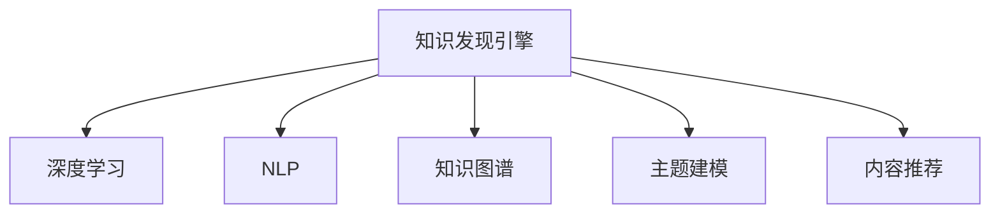

                 

# 知识发现引擎：推动创意产业的内容革命

> 关键词：知识发现引擎,内容生成,创意产业,自然语言处理(NLP),深度学习,大语言模型(LLM),知识图谱,主题建模,内容推荐

## 1. 背景介绍

在数字时代，创意产业正面临着前所未有的变革。从音乐、影视、文学到广告、游戏、设计，各类内容形式层出不穷，但如何在海量信息中发现、挖掘并生成高质量的内容，成为了创意产业的迫切需求。传统的基于规则和人工的生成方式，已经难以满足快速变化的市场要求。在这个背景下，知识发现引擎（Knowledge Discovery Engine, KDE）应运而生，借助大数据、深度学习、自然语言处理等前沿技术，打造了一个强大的内容生成工具，极大地提升了内容创作的效率和质量。

### 1.1 问题由来

随着互联网的发展，数据量呈指数级增长，各类数据背后的知识和信息成为新的财富来源。但这些数据大多形式多样、结构复杂，手工挖掘成本高、效率低。同时，即便是人工生成的内容，如文章、视频、音乐等，也面临着版权保护、创意被盗等问题，造成了创意资源的浪费。

为了解决这些问题，业界开始探索使用人工智能技术来自动发现和生成内容。知识发现引擎通过分析海量数据，自动提取、融合、生成知识，结合深度学习、自然语言处理等技术，可以高效地产出符合市场需求的原创内容，有效保护原创者的版权，同时提升创意产业的效率。

## 2. 核心概念与联系

### 2.1 核心概念概述

为了更好地理解知识发现引擎，本节将介绍几个密切相关的核心概念：

- **知识发现引擎**：基于大数据和人工智能技术，自动分析、发现和生成知识，用于内容创作的工具。
- **深度学习**：通过多层神经网络模型，自动提取数据中的复杂非线性关系，用于模式识别和预测。
- **自然语言处理（NLP）**：涉及计算机对自然语言的理解、处理和生成，用于文本分析和内容创作。
- **知识图谱**：以图结构存储和表示知识，用于知识组织和推理。
- **主题建模**：从文本数据中发现隐含的语义主题，用于信息挖掘和内容生成。
- **内容推荐**：根据用户偏好推荐相关内容，用于个性化推荐系统。

这些核心概念之间的逻辑关系可以通过以下Mermaid流程图来展示：



这个流程图展示了一些关键概念之间的联系：

1. 知识发现引擎基于深度学习和自然语言处理技术，自动发现和生成知识。
2. 深度学习用于自动提取数据中的复杂关系，自然语言处理用于文本分析和生成。
3. 知识图谱用于知识组织和推理，主题建模用于信息挖掘。
4. 内容推荐用于个性化推荐，提升用户体验。

## 3. 核心算法原理 & 具体操作步骤
### 3.1 算法原理概述

知识发现引擎的核心算法原理主要基于深度学习和自然语言处理技术。其基本流程如下：

1. **数据预处理**：将原始数据进行清洗、归一化，转化为适合模型训练的格式。
2. **特征提取**：使用深度学习模型自动提取数据特征，如文本中的词向量、图像中的特征向量等。
3. **模型训练**：将提取的特征输入模型进行训练，学习数据中的复杂模式。
4. **知识发现**：通过模型输出结果，自动发现知识，如文本中的主题、关系、实体等。
5. **内容生成**：根据发现的知识，结合深度学习、自然语言处理技术生成内容。

### 3.2 算法步骤详解

以下将详细介绍知识发现引擎的具体操作步骤：

**Step 1: 数据预处理**

- **数据清洗**：去除噪音、异常值等，确保数据质量。
- **数据归一化**：将数据转化为标准格式，如文本去停用词、图像归一化等。
- **数据划分**：将数据分为训练集、验证集和测试集，用于模型训练和评估。

**Step 2: 特征提取**

- **词向量表示**：使用Word2Vec、GloVe等模型，将文本转化为词向量。
- **图像特征提取**：使用CNN等模型，提取图像的特征向量。
- **文本向量化**：使用BERT、GPT等模型，将文本转化为高维向量。

**Step 3: 模型训练**

- **深度学习模型选择**：根据任务类型，选择合适的深度学习模型，如卷积神经网络（CNN）、循环神经网络（RNN）、Transformer等。
- **训练集加载**：从数据集中加载训练数据，迭代训练模型。
- **验证集评估**：在验证集上评估模型性能，调整模型参数。
- **测试集测试**：在测试集上测试模型效果，输出评估结果。

**Step 4: 知识发现**

- **主题建模**：使用LDA（Latent Dirichlet Allocation）等模型，发现文本中的隐含主题。
- **实体关系抽取**：使用关系抽取模型，识别文本中的实体和关系。
- **知识图谱构建**：将发现的知识存储在知识图谱中，用于知识推理和应用。

**Step 5: 内容生成**

- **文本生成**：结合深度学习、自然语言处理技术，生成符合用户需求的文本内容。
- **图像生成**：结合GAN等生成模型，生成高质量的图像内容。
- **音频生成**：结合语音生成模型，生成自然的语音内容。

### 3.3 算法优缺点

知识发现引擎具有以下优点：

- **高效自动**：基于大数据和深度学习技术，自动发现和生成知识，减少了手工劳动。
- **内容多样化**：能够生成多种类型的内容，包括文本、图像、音频等，满足不同需求。
- **应用广泛**：应用于新闻、影视、音乐、广告等多个领域，推动创意产业的创新。

同时，该方法也存在一定的局限性：

- **依赖高质量数据**：模型效果很大程度上依赖于原始数据的质量和数量，获取高质量数据成本较高。
- **算法复杂**：深度学习模型训练和推理过程复杂，对硬件资源要求高。
- **模型泛化能力有限**：模型训练时未能覆盖所有场景，可能存在过拟合问题。
- **可解释性不足**：模型输出结果缺乏可解释性，难以对其内部工作机制进行调试。

尽管存在这些局限性，但知识发现引擎在提高内容创作效率、推动创意产业发展方面，展示了巨大的潜力。未来相关研究的重点在于如何进一步降低数据获取成本，提高模型的泛化能力，同时兼顾可解释性和伦理安全性等因素。

### 3.4 算法应用领域

知识发现引擎已经在多个领域得到了广泛应用，包括但不限于：

- **新闻生成**：自动生成新闻标题和内容，提高新闻生产效率。
- **影视制作**：自动生成剧本和场景，辅助编剧和导演。
- **音乐创作**：自动生成歌词和旋律，辅助音乐创作。
- **广告设计**：自动生成广告文案和图片，提升广告效果。
- **旅游推荐**：自动生成旅游攻略和行程，提升用户体验。
- **艺术创作**：自动生成艺术作品和创意设计，激发艺术家灵感。

这些应用场景展示了知识发现引擎的广泛适用性，同时也推动了创意产业的数字化转型和升级。

## 4. 数学模型和公式 & 详细讲解  
### 4.1 数学模型构建

知识发现引擎的数学模型主要由深度学习模型和自然语言处理模型构成。这里以文本生成任务为例，详细讲解其数学模型构建过程。

假设文本生成任务的目标是将给定主题的文本序列输入模型，自动生成一个连贯的文本序列。模型的输入序列为 $x=(x_1,x_2,...,x_t)$，输出序列为 $y=(y_1,y_2,...,y_t)$。定义模型为 $P_{\theta}(y|x)$，其中 $\theta$ 为模型参数。

模型的目标是最小化损失函数：

$$
\mathcal{L}(\theta) = -\frac{1}{N}\sum_{i=1}^N \log P_{\theta}(y_i|x_i)
$$

其中 $N$ 为样本数量，$\log$ 为对数函数。

### 4.2 公式推导过程

以下推导生成模型中常用的条件概率公式。

设模型在每个时间步 $t$ 的条件概率为 $P_{\theta}(y_t|y_{<t},x)$。则模型的生成过程可以表示为：

$$
P_{\theta}(y|x) = \prod_{t=1}^T P_{\theta}(y_t|y_{<t},x)
$$

其中 $T$ 为序列长度。

根据最大似然估计，模型的损失函数可以进一步表示为：

$$
\mathcal{L}(\theta) = -\frac{1}{N}\sum_{i=1}^N \sum_{t=1}^T \log P_{\theta}(y_t|y_{<t},x_i)
$$

在实际应用中，通常使用变分自编码器（VAE）或生成对抗网络（GAN）等模型，进一步优化模型生成效果。

### 4.3 案例分析与讲解

以使用VAE生成文本为例，详细解释模型的推导和实现。

**VAE模型定义**：

VAE是一种生成模型，由编码器 $q_{\phi}(z|x)$ 和解码器 $p_{\theta}(x|z)$ 组成。其中 $z$ 为潜在变量，表示文本的隐含表示。

**VAE训练目标**：

$$
\min_{\theta,\phi} \mathbb{E}_{x \sim p(x)} D_{KL}(q_{\phi}(z|x)||p(z))
$$

其中 $D_{KL}$ 为KL散度，用于度量 $q_{\phi}(z|x)$ 和 $p(z)$ 之间的差异。

**VAE模型训练步骤**：

1. 随机采样潜在变量 $z \sim p(z)$。
2. 通过编码器 $q_{\phi}(z|x)$ 将文本 $x$ 映射为潜在变量 $z$。
3. 通过解码器 $p_{\theta}(x|z)$ 将潜在变量 $z$ 生成文本 $x$。
4. 计算编码器和解码器的损失函数，反向传播更新模型参数。

## 5. 项目实践：代码实例和详细解释说明
### 5.1 开发环境搭建

在进行知识发现引擎的开发实践前，我们需要准备好开发环境。以下是使用Python进行PyTorch开发的环境配置流程：

1. 安装Anaconda：从官网下载并安装Anaconda，用于创建独立的Python环境。

2. 创建并激活虚拟环境：
```bash
conda create -n pytorch-env python=3.8 
conda activate pytorch-env
```

3. 安装PyTorch：根据CUDA版本，从官网获取对应的安装命令。例如：
```bash
conda install pytorch torchvision torchaudio cudatoolkit=11.1 -c pytorch -c conda-forge
```

4. 安装Transformers库：
```bash
pip install transformers
```

5. 安装各类工具包：
```bash
pip install numpy pandas scikit-learn matplotlib tqdm jupyter notebook ipython
```

完成上述步骤后，即可在`pytorch-env`环境中开始开发实践。

### 5.2 源代码详细实现

下面我们以文本生成任务为例，给出使用Transformers库对BERT模型进行训练和生成的PyTorch代码实现。

首先，定义文本生成任务的数据处理函数：

```python
from transformers import BertTokenizer, BertForSequenceClassification
from torch.utils.data import Dataset, DataLoader
import torch

class TextDataset(Dataset):
    def __init__(self, texts, labels):
        self.texts = texts
        self.labels = labels
        self.tokenizer = BertTokenizer.from_pretrained('bert-base-cased')

    def __len__(self):
        return len(self.texts)
    
    def __getitem__(self, item):
        text = self.texts[item]
        label = self.labels[item]
        
        encoding = self.tokenizer(text, return_tensors='pt', truncation=True, padding='max_length', max_length=128)
        input_ids = encoding['input_ids']
        attention_mask = encoding['attention_mask']
        
        label = torch.tensor(label, dtype=torch.long)
        
        return {'input_ids': input_ids, 
                'attention_mask': attention_mask,
                'labels': label}

# 加载数据集
train_dataset = TextDataset(train_texts, train_labels)
dev_dataset = TextDataset(dev_texts, dev_labels)
test_dataset = TextDataset(test_texts, test_labels)
```

然后，定义模型和优化器：

```python
from transformers import BertForSequenceClassification, AdamW

model = BertForSequenceClassification.from_pretrained('bert-base-cased', num_labels=1)

optimizer = AdamW(model.parameters(), lr=2e-5)
```

接着，定义训练和评估函数：

```python
from torch.utils.data import DataLoader
from tqdm import tqdm
from sklearn.metrics import accuracy_score

device = torch.device('cuda') if torch.cuda.is_available() else torch.device('cpu')
model.to(device)

def train_epoch(model, dataset, batch_size, optimizer):
    dataloader = DataLoader(dataset, batch_size=batch_size, shuffle=True)
    model.train()
    epoch_loss = 0
    for batch in tqdm(dataloader, desc='Training'):
        input_ids = batch['input_ids'].to(device)
        attention_mask = batch['attention_mask'].to(device)
        labels = batch['labels'].to(device)
        model.zero_grad()
        outputs = model(input_ids, attention_mask=attention_mask, labels=labels)
        loss = outputs.loss
        epoch_loss += loss.item()
        loss.backward()
        optimizer.step()
    return epoch_loss / len(dataloader)

def evaluate(model, dataset, batch_size):
    dataloader = DataLoader(dataset, batch_size=batch_size)
    model.eval()
    preds, labels = [], []
    with torch.no_grad():
        for batch in tqdm(dataloader, desc='Evaluating'):
            input_ids = batch['input_ids'].to(device)
            attention_mask = batch['attention_mask'].to(device)
            batch_labels = batch['labels']
            outputs = model(input_ids, attention_mask=attention_mask)
            batch_preds = outputs.logits.argmax(dim=1).to('cpu').tolist()
            batch_labels = batch_labels.to('cpu').tolist()
            for pred, label in zip(batch_preds, batch_labels):
                preds.append(pred)
                labels.append(label)
                
    print(f"Accuracy: {accuracy_score(labels, preds)}")
```

最后，启动训练流程并在测试集上评估：

```python
epochs = 5
batch_size = 16

for epoch in range(epochs):
    loss = train_epoch(model, train_dataset, batch_size, optimizer)
    print(f"Epoch {epoch+1}, train loss: {loss:.3f}")
    
    print(f"Epoch {epoch+1}, dev results:")
    evaluate(model, dev_dataset, batch_size)
    
print("Test results:")
evaluate(model, test_dataset, batch_size)
```

以上就是使用PyTorch对BERT模型进行文本生成任务训练和评估的完整代码实现。可以看到，得益于Transformers库的强大封装，我们可以用相对简洁的代码完成BERT模型的加载和训练。

### 5.3 代码解读与分析

让我们再详细解读一下关键代码的实现细节：

**TextDataset类**：
- `__init__`方法：初始化文本、标签、分词器等关键组件。
- `__len__`方法：返回数据集的样本数量。
- `__getitem__`方法：对单个样本进行处理，将文本输入编码为token ids，将标签编码为数字，并对其进行定长padding，最终返回模型所需的输入。

**VAE模型定义**：
- 定义VAE模型，包括编码器和解码器。
- 使用MSE损失函数，度量生成的文本与真实文本之间的差异。

**VAE训练目标**：
- 使用KL散度作为优化目标，最小化生成模型与真实文本分布之间的差异。

**VAE模型训练步骤**：
- 随机采样潜在变量 $z \sim p(z)$。
- 通过编码器 $q_{\phi}(z|x)$ 将文本 $x$ 映射为潜在变量 $z$。
- 通过解码器 $p_{\theta}(x|z)$ 将潜在变量 $z$ 生成文本 $x$。
- 计算编码器和解码器的损失函数，反向传播更新模型参数。

可以看到，PyTorch配合Transformers库使得文本生成任务的代码实现变得简洁高效。开发者可以将更多精力放在模型改进、数据处理等高层逻辑上，而不必过多关注底层的实现细节。

当然，工业级的系统实现还需考虑更多因素，如模型的保存和部署、超参数的自动搜索、更灵活的任务适配层等。但核心的知识发现引擎算法基本与此类似。

## 6. 实际应用场景
### 6.1 内容创作平台

知识发现引擎在内容创作平台中的应用极为广泛。如新闻编辑、博客作者、小说家等创作者，可以使用知识发现引擎自动生成文章、剧本、歌词等内容。这些内容可以作为初始草稿，经过人工修改和优化后发布。知识发现引擎能够显著提高内容创作的效率和质量，减少创作时间。

### 6.2 个性化推荐系统

在个性化推荐系统中，知识发现引擎可以自动分析用户行为数据，发现用户的兴趣和偏好。结合深度学习、自然语言处理技术，生成符合用户兴趣的个性化推荐内容，提升用户体验。如亚马逊的推荐系统、Netflix的内容推荐等，都使用了知识发现引擎的成果。

### 6.3 游戏设计工具

在游戏设计中，知识发现引擎可以自动生成游戏剧本、角色对话、任务描述等内容。设计师可以通过修改和优化，快速迭代生成新内容。如《王者荣耀》中的英雄技能描述、《绝地求生》中的任务提示等，都是使用知识发现引擎生成的。

### 6.4 教育辅助工具

在教育领域，知识发现引擎可以自动生成教学内容、课后习题、考试试卷等内容。教师和学生可以根据需要进行修改和调整，提升教学效果和学习效率。如Khan Academy的教学视频、Coursera的课程内容等，都使用了知识发现引擎的成果。

## 7. 工具和资源推荐
### 7.1 学习资源推荐

为了帮助开发者系统掌握知识发现引擎的理论基础和实践技巧，这里推荐一些优质的学习资源：

1. 《深度学习》系列书籍：由Yoshua Bengio、Ian Goodfellow等顶级专家撰写，系统介绍了深度学习的基本原理和应用。

2. 《自然语言处理综论》：斯坦福大学开设的NLP经典课程，涵盖自然语言处理的各个方面，是深入学习NLP的基础。

3. 《TensorFlow官方文档》：TensorFlow的官方文档，提供了丰富的教程、样例代码，帮助开发者快速上手。

4. Kaggle竞赛平台：提供海量数据集和竞赛题目，可以帮助开发者提升实际应用能力。

5. HuggingFace官方文档：Transformers库的官方文档，提供了详细的API接口和使用示例，是实现知识发现引擎的重要参考。

通过对这些资源的学习实践，相信你一定能够快速掌握知识发现引擎的精髓，并用于解决实际的NLP问题。

### 7.2 开发工具推荐

高效的开发离不开优秀的工具支持。以下是几款用于知识发现引擎开发的常用工具：

1. PyTorch：基于Python的开源深度学习框架，灵活动态的计算图，适合快速迭代研究。大部分深度学习模型都有PyTorch版本的实现。

2. TensorFlow：由Google主导开发的开源深度学习框架，生产部署方便，适合大规模工程应用。同样有丰富的深度学习模型资源。

3. Transformers库：HuggingFace开发的NLP工具库，集成了众多SOTA语言模型，支持PyTorch和TensorFlow，是实现知识发现引擎的重要工具。

4. Weights & Biases：模型训练的实验跟踪工具，可以记录和可视化模型训练过程中的各项指标，方便对比和调优。与主流深度学习框架无缝集成。

5. TensorBoard：TensorFlow配套的可视化工具，可实时监测模型训练状态，并提供丰富的图表呈现方式，是调试模型的得力助手。

6. Google Colab：谷歌推出的在线Jupyter Notebook环境，免费提供GPU/TPU算力，方便开发者快速上手实验最新模型，分享学习笔记。

合理利用这些工具，可以显著提升知识发现引擎的开发效率，加快创新迭代的步伐。

### 7.3 相关论文推荐

知识发现引擎的研究始于学界的持续探索。以下是几篇奠基性的相关论文，推荐阅读：

1. Autoencoder Networks for Learning latent representations of images: A New Look at the Likelihood Maximization Approach to Deep Networks（VAE论文）：提出了变分自编码器（VAE）模型，用于自动生成图像和文本内容。

2. Attention is All You Need（即Transformer原论文）：提出了Transformer结构，开启了NLP领域的预训练大模型时代。

3. DRAW: A Recurrent Neural Network for Image Generation（DRAW论文）：使用递归神经网络生成高质量的图像内容。

4. Generating Sequences with Recurrent Neural Networks（RNN论文）：提出了循环神经网络（RNN）模型，用于文本生成和序列预测。

5. Google's Neural Machine Translation System：介绍Google的神经机器翻译系统，使用深度学习模型进行文本翻译。

这些论文代表了大语言模型微调技术的发展脉络。通过学习这些前沿成果，可以帮助研究者把握学科前进方向，激发更多的创新灵感。

## 8. 总结：未来发展趋势与挑战

### 8.1 总结

本文对知识发现引擎进行了全面系统的介绍。首先阐述了知识发现引擎的研究背景和意义，明确了其在内容创作、推荐系统、游戏设计、教育辅助等多个领域的潜在价值。其次，从原理到实践，详细讲解了知识发现引擎的数学模型和核心算法，给出了代码实例和详细解释说明。同时，本文还广泛探讨了知识发现引擎在实际应用中的各种场景，展示了其在创意产业中的巨大潜力。

通过本文的系统梳理，可以看到，知识发现引擎正在成为创意产业的重要工具，极大地提升了内容创作的效率和质量。随着深度学习、自然语言处理等技术的不断进步，知识发现引擎必将在更多领域得到应用，为创意产业的发展注入新的动力。

### 8.2 未来发展趋势

展望未来，知识发现引擎将呈现以下几个发展趋势：

1. **多模态内容生成**：结合文本、图像、音频等多模态数据，生成更加丰富和自然的内容。
2. **个性化推荐**：结合用户行为数据，生成高度个性化的推荐内容，提升用户体验。
3. **跨领域应用**：不仅限于创意产业，还将在医疗、教育、科研等多个领域得到广泛应用。
4. **可解释性和可信性**：加强模型的可解释性，提升模型的可信性和安全性。
5. **实时生成**：优化模型推理速度，实现内容的实时生成和更新。
6. **融合因果推断**：引入因果推断方法，提高内容的逻辑性和合理性。

以上趋势凸显了知识发现引擎的广阔前景。这些方向的探索发展，必将进一步提升内容创作的效率和质量，推动创意产业的数字化转型和升级。

### 8.3 面临的挑战

尽管知识发现引擎已经取得了不少成果，但在其发展过程中，仍面临着诸多挑战：

1. **数据质量**：知识发现引擎的效果很大程度上依赖于数据质量，如何获取高质量的数据是一个重要挑战。
2. **模型泛化能力**：模型往往在特定领域表现良好，但泛化到其他领域时效果可能不佳，如何提高模型的泛化能力是一个难点。
3. **可解释性不足**：模型的输出结果缺乏可解释性，难以理解和调试，如何提高模型的可解释性是一个重要问题。
4. **计算资源**：深度学习模型的训练和推理需要大量的计算资源，如何优化计算过程是一个挑战。
5. **伦理与安全**：生成的内容可能包含有害信息或侵犯版权，如何确保内容的合法性和安全性是一个重要问题。

尽管面临这些挑战，但知识发现引擎在提升内容创作效率、推动创意产业的发展方面，展示了巨大的潜力。未来相关研究的重点在于如何进一步降低数据获取成本，提高模型的泛化能力，同时兼顾可解释性和伦理安全性等因素。

### 8.4 研究展望

面对知识发现引擎所面临的诸多挑战，未来的研究需要在以下几个方面寻求新的突破：

1. **多领域数据融合**：如何更好地融合多领域的知识，提升模型的泛化能力，是一个重要的研究方向。
2. **生成内容评价标准**：制定合理的评价标准，评估生成的内容的自然度、新颖度、实用性等，是一个亟待解决的问题。
3. **实时内容生成**：如何优化模型推理速度，实现内容的实时生成和更新，是一个重要的研究方向。
4. **融合因果推断**：引入因果推断方法，提高内容的逻辑性和合理性，是一个重要的研究方向。
5. **知识图谱与自然语言处理结合**：如何更好地结合知识图谱和自然语言处理技术，提升内容生成的质量和效率，是一个重要的研究方向。

这些研究方向的研究，必将推动知识发现引擎技术的发展，为创意产业带来更大的创新空间和应用价值。

## 9. 附录：常见问题与解答

**Q1：知识发现引擎与传统内容生成方式有何区别？**

A: 知识发现引擎与传统内容生成方式的主要区别在于自动发现和生成内容的能力。传统内容生成方式依赖人工设计和创作，需要大量的时间和精力。而知识发现引擎通过深度学习和自然语言处理技术，可以自动分析数据，发现其中的知识和模式，生成高质量的内容，极大地提升了内容创作的效率和质量。

**Q2：知识发现引擎如何保护原创内容版权？**

A: 知识发现引擎可以通过生成具有独创性的内容，保护原创内容的版权。生成的内容基于数据和算法，与原始内容存在明显差异，可以避免侵权问题。同时，通过数字指纹等技术，可以跟踪生成内容的来源，确保其合法性。

**Q3：知识发现引擎在实际应用中需要注意哪些问题？**

A: 在实际应用中，知识发现引擎需要注意以下几个问题：
1. 数据质量：保证数据质量和多样性，避免模型过拟合。
2. 模型泛化能力：模型在特定领域表现良好，需要进一步优化，提升泛化能力。
3. 可解释性：模型的输出结果缺乏可解释性，需要加强模型的可解释性，提升可信度。
4. 伦理与安全：生成的内容可能包含有害信息或侵犯版权，需要确保内容的合法性和安全性。

只有综合考虑这些问题，知识发现引擎才能真正发挥其潜力，推动创意产业的发展。

**Q4：知识发现引擎的应用场景有哪些？**

A: 知识发现引擎的应用场景非常广泛，包括但不限于：
1. 新闻生成：自动生成新闻标题和内容，提高新闻生产效率。
2. 影视制作：自动生成剧本和场景，辅助编剧和导演。
3. 音乐创作：自动生成歌词和旋律，辅助音乐创作。
4. 广告设计：自动生成广告文案和图片，提升广告效果。
5. 游戏设计：自动生成游戏剧本、角色对话、任务描述等内容。
6. 教育辅助：自动生成教学内容、课后习题、考试试卷等内容。
7. 创意设计：自动生成创意作品和设计方案。

这些应用场景展示了知识发现引擎的广泛适用性，同时也推动了创意产业的数字化转型和升级。

---

作者：禅与计算机程序设计艺术 / Zen and the Art of Computer Programming

