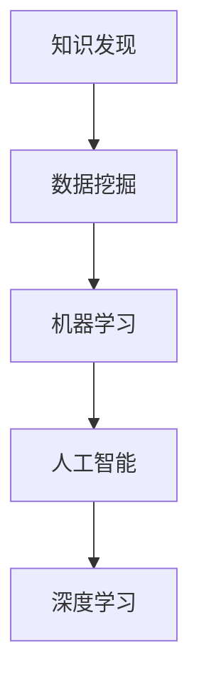

                 

# 知识发现引擎：推动创新引擎的全速运转

> 关键词：知识发现, 数据挖掘, 机器学习, 人工智能, 深度学习, 应用案例, 技术框架, 实际应用

## 1. 背景介绍

### 1.1 问题由来
随着大数据时代的来临，越来越多的数据被生成和存储，而如何从中挖掘出有价值的知识，成为了企业关注的重点。传统的数据分析方法已经难以应对复杂的数据结构和庞大的数据量。因此，基于人工智能（AI）的数据挖掘技术——知识发现引擎（Knowledge Discovery Engine, KDE）应运而生，成为帮助企业从数据中提取知识、驱动决策的关键工具。

### 1.2 问题核心关键点
知识发现引擎是使用机器学习算法从大数据中提取、分析和呈现知识的过程。其主要任务包括数据预处理、特征工程、模型训练、结果可视化等。这一技术在商业智能、金融分析、医疗诊断等领域有着广泛的应用。

### 1.3 问题研究意义
知识发现引擎的研究对于企业决策支持、数据驱动的创新和智慧化转型具有重要意义：

1. **提高决策质量**：通过自动化和智能化的数据挖掘，企业可以从海量数据中快速找到关键洞察，辅助决策。
2. **加速创新进程**：知识发现引擎可以帮助企业在市场变化中找到新的业务机会，推动产品和服务创新。
3. **优化资源配置**：通过深入分析客户需求和市场趋势，企业可以更有效地分配资源，提升竞争力。
4. **实现智慧化转型**：知识发现引擎的广泛应用可以推动企业向智慧化、智能化方向发展。

## 2. 核心概念与联系

### 2.1 核心概念概述

为更好地理解知识发现引擎的工作原理和应用场景，本节将介绍几个关键的概念及其之间的联系：

- **知识发现（Knowledge Discovery）**：从数据中提取和总结出有意义的信息和模式的过程。
- **数据挖掘（Data Mining）**：使用统计学、机器学习等方法从数据中发现有价值的模式和知识。
- **机器学习（Machine Learning）**：利用算法和模型自动分析数据，进行分类、预测、聚类等任务。
- **人工智能（Artificial Intelligence）**：模拟人类智能，实现信息处理、决策支持等功能。
- **深度学习（Deep Learning）**：使用多层神经网络，通过大量数据训练出复杂模型，实现更高级别的知识发现。

这些概念之间的逻辑关系可以通过以下Mermaid流程图来展示：



这个流程图展示出知识发现引擎的核心概念及其之间的关系：

1. 知识发现是数据挖掘的主要目标。
2. 数据挖掘利用机器学习算法对数据进行处理和分析。
3. 机器学习是人工智能实现的基础。
4. 深度学习是机器学习的一种高级形式，适用于处理更加复杂的数据。

这些概念共同构成了知识发现引擎的理论框架，帮助企业在数据中发现、分析和应用知识。

## 3. 核心算法原理 & 具体操作步骤
### 3.1 算法原理概述

知识发现引擎的核心算法包括数据预处理、特征工程、模型训练和结果可视化等步骤。其总体流程可以概括为：

1. **数据预处理**：清洗、转换原始数据，使其符合模型训练和分析的要求。
2. **特征工程**：提取、选择、转换数据特征，以提升模型性能。
3. **模型训练**：选择合适的机器学习算法，利用训练集数据训练模型。
4. **结果可视化**：将模型输出转换为易于理解的图形或报告，展示给决策者。

### 3.2 算法步骤详解

**Step 1: 数据预处理**

1. **数据清洗**：去除数据中的噪声、缺失值、异常值等。
2. **数据转换**：将原始数据转换为模型所需的格式，如数值化、标准化、归一化等。
3. **数据采样**：使用随机采样、分层采样等方法，减少数据量，提高模型训练速度。

**Step 2: 特征工程**

1. **特征提取**：从原始数据中提取有用的特征，如统计特征、文本特征、时间特征等。
2. **特征选择**：选择最相关的特征，减少模型复杂度，提高模型泛化能力。
3. **特征转换**：对特征进行编码、降维等处理，提升模型训练效率。

**Step 3: 模型训练**

1. **算法选择**：根据任务类型选择合适的机器学习算法，如分类、回归、聚类等。
2. **模型搭建**：构建模型架构，设置超参数，如学习率、批大小、迭代次数等。
3. **训练过程**：在训练集上迭代训练模型，调整模型参数，最小化损失函数。

**Step 4: 结果可视化**

1. **数据可视化**：使用可视化工具如Matplotlib、Seaborn、Tableau等，展示数据分布、相关性等。
2. **模型可视化**：使用图形工具如TensorBoard、ONNX-Graph-Summary等，展示模型结构和训练过程。
3. **结果呈现**：生成报告、图表、仪表盘等，呈现模型的关键指标和发现。

### 3.3 算法优缺点

知识发现引擎在数据挖掘和知识发现方面有着显著的优势：

- **高效性**：自动化处理大量数据，提升数据处理效率。
- **精度高**：通过机器学习算法，能够发现复杂的数据模式和关联。
- **可扩展性强**：适用于各种数据类型和规模，能够不断扩展应用场景。

同时，该方法也存在一些局限性：

- **数据质量依赖**：数据清洗和特征工程的效果依赖于数据质量，输入数据噪声和错误会影响结果。
- **模型复杂度**：高复杂度模型需要大量的计算资源，训练时间较长。
- **结果可解释性**：复杂模型往往缺乏可解释性，难以理解其内部工作机制。
- **领域知识需求**：对于特定领域的数据挖掘，需要领域专家的指导和支持。

尽管存在这些局限性，但就目前而言，知识发现引擎仍然是数据挖掘领域的主要技术手段。未来相关研究的目标是如何在保证精度的同时，提升模型的可解释性和计算效率，同时更好地利用领域知识，提高模型的应用效果。

### 3.4 算法应用领域

知识发现引擎在多个领域都有广泛的应用，例如：

- **商业智能**：分析客户行为、市场趋势，优化营销策略。
- **金融分析**：评估信用风险、预测股市趋势、优化投资组合。
- **医疗诊断**：分析病例数据，发现疾病关联，辅助诊断决策。
- **物流管理**：优化运输路线、仓储管理、库存控制。
- **市场营销**：分析消费者行为，设计精准广告策略，提升品牌影响力。

## 4. 数学模型和公式 & 详细讲解 & 举例说明

### 4.1 数学模型构建

知识发现引擎通常使用以下数学模型：

1. **分类模型**：如决策树、支持向量机（SVM）、随机森林等，用于对数据进行分类。
2. **回归模型**：如线性回归、逻辑回归、岭回归等，用于预测连续数值。
3. **聚类模型**：如K-means、层次聚类、DBSCAN等，用于将数据分为不同的群组。
4. **关联规则模型**：如Apriori算法、FP-growth算法等，用于发现数据中的关联规则。

### 4.2 公式推导过程

**线性回归模型**的公式推导如下：

假设输入数据为 $(x_1, x_2, ..., x_n)$，输出变量为 $y$。线性回归模型的目标是最小化预测值 $y'$ 与真实值 $y$ 之间的误差，即：

$$
\min_{\theta} \sum_{i=1}^n (y'_i - y_i)^2
$$

其中 $\theta$ 为模型参数，包含截距和斜率。最小化误差的过程可以通过梯度下降算法实现，具体公式如下：

$$
\theta = \theta - \alpha \frac{\partial \sum_{i=1}^n (y'_i - y_i)^2}{\partial \theta}
$$

其中 $\alpha$ 为学习率，$\frac{\partial \sum_{i=1}^n (y'_i - y_i)^2}{\partial \theta}$ 为损失函数对模型参数 $\theta$ 的梯度。

### 4.3 案例分析与讲解

以医疗诊断为例，假设我们有一组患者的临床数据，包含年龄、血压、血糖等特征，以及疾病诊断结果。使用线性回归模型预测患者是否患有某种疾病，可以按照以下步骤进行：

1. **数据预处理**：清洗数据，处理缺失值，标准化特征。
2. **特征工程**：提取年龄、血压、血糖等特征。
3. **模型训练**：使用线性回归模型，训练得到模型参数 $\theta$。
4. **结果可视化**：绘制特征重要性图、误差分布图，分析模型效果。

## 5. 项目实践：代码实例和详细解释说明

### 5.1 开发环境搭建

在进行知识发现引擎项目实践前，我们需要准备好开发环境。以下是使用Python进行Scikit-learn开发的环境配置流程：

1. 安装Anaconda：从官网下载并安装Anaconda，用于创建独立的Python环境。

2. 创建并激活虚拟环境：
```bash
conda create -n sklearn-env python=3.8 
conda activate sklearn-env
```

3. 安装Scikit-learn：
```bash
conda install scikit-learn
```

4. 安装相关工具包：
```bash
pip install pandas numpy matplotlib seaborn scikit-learn tensorflow
```

完成上述步骤后，即可在`sklearn-env`环境中开始项目开发。

### 5.2 源代码详细实现

这里以一个简单的预测任务为例，展示如何使用Scikit-learn进行线性回归模型的构建和训练：

```python
import pandas as pd
from sklearn.model_selection import train_test_split
from sklearn.linear_model import LinearRegression
from sklearn.metrics import mean_squared_error
from sklearn.preprocessing import StandardScaler

# 读取数据
data = pd.read_csv('data.csv')

# 划分训练集和测试集
X = data.drop(['y'], axis=1)
y = data['y']
X_train, X_test, y_train, y_test = train_test_split(X, y, test_size=0.2, random_state=42)

# 数据标准化
scaler = StandardScaler()
X_train = scaler.fit_transform(X_train)
X_test = scaler.transform(X_test)

# 构建模型
model = LinearRegression()

# 训练模型
model.fit(X_train, y_train)

# 预测并评估模型
y_pred = model.predict(X_test)
mse = mean_squared_error(y_test, y_pred)
print('均方误差:', mse)
```

### 5.3 代码解读与分析

让我们再详细解读一下关键代码的实现细节：

**读取数据**：使用Pandas库读取CSV格式的数据文件。

**数据划分**：使用train_test_split函数，将数据集划分为训练集和测试集。

**数据标准化**：使用StandardScaler对特征进行标准化，减少模型对特征量级差异的敏感性。

**模型构建**：使用LinearRegression类构建线性回归模型。

**模型训练**：使用fit函数，在训练集上训练模型。

**模型评估**：使用mean_squared_error函数计算模型在测试集上的均方误差，评估模型性能。

**代码的优点**：
- 简洁明了：代码逻辑清晰，易于理解。
- 模块化：Scikit-learn提供了丰富的机器学习算法和工具函数，方便开发者快速实现模型。
- 可扩展性：代码可以轻松地与其他机器学习算法和框架进行集成，如TensorFlow、PyTorch等。

**代码的缺点**：
- 数据预处理：代码中没有包含数据清洗和特征工程的部分，实际应用中可能需要手动进行这些步骤。
- 模型选择：代码仅展示了线性回归模型，实际应用中可能需要根据任务类型选择其他模型。

## 6. 实际应用场景

### 6.1 智能客服系统

知识发现引擎可以广泛应用于智能客服系统的构建。传统客服往往需要配备大量人力，高峰期响应缓慢，且一致性和专业性难以保证。使用知识发现引擎构建的智能客服系统，可以7x24小时不间断服务，快速响应客户咨询，用自然流畅的语言解答各类常见问题。

在技术实现上，可以收集企业内部的历史客服对话记录，将问题和最佳答复构建成监督数据，在此基础上使用知识发现引擎对模型进行训练。训练后的模型能够自动理解用户意图，匹配最合适的答案模板进行回复。对于客户提出的新问题，还可以接入检索系统实时搜索相关内容，动态组织生成回答。如此构建的智能客服系统，能大幅提升客户咨询体验和问题解决效率。

### 6.2 金融舆情监测

金融机构需要实时监测市场舆论动向，以便及时应对负面信息传播，规避金融风险。传统的人工监测方式成本高、效率低，难以应对网络时代海量信息爆发的挑战。使用知识发现引擎进行金融舆情监测，可以自动分析大量网络文本，判断文本情感倾向，识别市场趋势，快速预警风险。

具体而言，可以收集金融领域相关的新闻、报道、评论等文本数据，并对其进行主题标注和情感标注。在此基础上使用知识发现引擎对模型进行训练，使其能够自动判断文本属于何种主题，情感倾向是正面、中性还是负面。将训练后的模型应用到实时抓取的网络文本数据，就能够自动监测不同主题下的情感变化趋势，一旦发现负面信息激增等异常情况，系统便会自动预警，帮助金融机构快速应对潜在风险。

### 6.3 个性化推荐系统

当前的推荐系统往往只依赖用户的历史行为数据进行物品推荐，无法深入理解用户的真实兴趣偏好。使用知识发现引擎进行个性化推荐系统，可以更好地挖掘用户行为背后的语义信息，从而提供更精准、多样的推荐内容。

在实践中，可以收集用户浏览、点击、评论、分享等行为数据，提取和用户交互的物品标题、描述、标签等文本内容。将文本内容作为模型输入，用户的后续行为（如是否点击、购买等）作为监督信号，在此基础上使用知识发现引擎对模型进行训练。训练后的模型能够从文本内容中准确把握用户的兴趣点。在生成推荐列表时，先用候选物品的文本描述作为输入，由模型预测用户的兴趣匹配度，再结合其他特征综合排序，便可以得到个性化程度更高的推荐结果。

### 6.4 未来应用展望

随着知识发现引擎技术的不断发展，基于其构建的智能系统将覆盖更多领域，带来更多创新和变革：

- **智慧医疗**：使用知识发现引擎进行病例分析、疾病关联研究，辅助医疗诊断和治疗。
- **智能交通**：分析交通流量数据，预测交通拥堵情况，优化交通管理。
- **智慧能源**：分析能源消耗数据，预测能源需求，优化能源配置。
- **智慧教育**：分析学生学习行为，提供个性化学习建议，优化教学资源分配。
- **智能制造**：分析生产数据，预测设备故障，优化生产流程。

未来，随着知识发现引擎技术的进一步成熟，其应用领域还将不断扩展，为各行各业带来更多创新和效率提升。

## 7. 工具和资源推荐

### 7.1 学习资源推荐

为了帮助开发者系统掌握知识发现引擎的理论基础和实践技巧，这里推荐一些优质的学习资源：

1. 《机器学习实战》系列书籍：由著名的机器学习专家撰写，全面介绍了机器学习的基本概念和实践技巧。
2. Coursera《机器学习》课程：由斯坦福大学教授Andrew Ng主讲，是机器学习领域的经典课程。
3. Kaggle平台：包含大量公开数据集和竞赛项目，提供实战练习和经验分享。
4. Google Cloud AI平台：提供在线机器学习工具和教程，支持丰富的数据处理和模型训练功能。
5. TensorFlow官方文档：包含大量使用示例和最佳实践，是学习TensorFlow的重要资源。

通过对这些资源的学习实践，相信你一定能够快速掌握知识发现引擎的精髓，并用于解决实际的业务问题。

### 7.2 开发工具推荐

高效的开发离不开优秀的工具支持。以下是几款用于知识发现引擎开发的常用工具：

1. Python：最流行的编程语言之一，拥有丰富的机器学习库和数据处理工具。
2. R语言：专门用于统计分析和数据可视化的语言，有丰富的数据挖掘库。
3. Scikit-learn：基于Python的机器学习库，提供了丰富的模型和工具函数。
4. TensorFlow：由Google主导开发的深度学习框架，支持大规模模型训练和部署。
5. Jupyter Notebook：交互式笔记本环境，方便数据探索和模型调试。
6. Tableau：数据可视化工具，支持数据探索和报告生成。

合理利用这些工具，可以显著提升知识发现引擎的开发效率，加快创新迭代的步伐。

### 7.3 相关论文推荐

知识发现引擎的研究源于学界的持续研究。以下是几篇奠基性的相关论文，推荐阅读：

1. "Knowledge Discovery in Databases"（Knowledge Discovery in Databases）：由Jerry K. Smith等人编写，全面介绍了数据挖掘和知识发现的理论基础和方法。
2. "Mining Massive Datasets"（Mining Massive Datasets）：由Joachim M. Buhmann等人编写，介绍了大数据下的数据挖掘方法和技术。
3. "Data Mining: Concepts and Techniques"（Data Mining: Concepts and Techniques）：由Jian Pelleg等人编写，介绍了数据挖掘的各个方面，包括分类、聚类、回归等。
4. "Pattern Recognition and Machine Learning"（Pattern Recognition and Machine Learning）：由Christopher M. Bishop编写，介绍了机器学习的基础知识和应用。
5. "The Elements of Statistical Learning"（The Elements of Statistical Learning）：由Tibshirani等人编写，介绍了统计学习的方法和应用。

这些论文代表了大数据和知识发现引擎的发展脉络。通过学习这些前沿成果，可以帮助研究者把握学科前进方向，激发更多的创新灵感。

## 8. 总结：未来发展趋势与挑战

### 8.1 总结

本文对知识发现引擎的概念、算法和应用进行了全面系统的介绍。首先阐述了知识发现引擎的研究背景和意义，明确了其在商业智能、金融分析、医疗诊断等领域的重要价值。其次，从原理到实践，详细讲解了知识发现引擎的数学模型和操作步骤，给出了知识发现引擎的完整代码实例。同时，本文还广泛探讨了知识发现引擎在多个行业领域的应用前景，展示了其广阔的发展潜力。

通过本文的系统梳理，可以看到，知识发现引擎已经成为数据挖掘领域的主要技术手段，极大地提升了企业的决策支持能力。未来，伴随知识发现引擎技术的不断演进，其在各个领域的应用将更加广泛和深入，推动人工智能技术向更加智能化、普适化方向发展。

### 8.2 未来发展趋势

展望未来，知识发现引擎技术将呈现以下几个发展趋势：

1. **自动化和智能化**：知识发现引擎将更加自动化和智能化，能够自动进行数据清洗、特征工程和模型选择，减少人工干预。
2. **多模态融合**：知识发现引擎将融合多种数据类型和模态，如文本、图像、视频等，提升数据处理能力和应用范围。
3. **深度学习的应用**：深度学习技术将进一步应用于知识发现引擎，提升模型的复杂度和泛化能力。
4. **分布式计算**：知识发现引擎将更加依赖分布式计算和云计算技术，提升数据处理和模型训练效率。
5. **模型解释性**：知识发现引擎将更加注重模型解释性，提供易于理解的输出和结果。

这些趋势凸显了知识发现引擎技术的广阔前景，将进一步提升其在商业智能、金融分析、医疗诊断等领域的实用性和应用效果。

### 8.3 面临的挑战

尽管知识发现引擎在数据挖掘和知识发现方面取得了显著成就，但在迈向更加智能化、普适化应用的过程中，它仍面临着诸多挑战：

1. **数据质量问题**：数据清洗和预处理的效果依赖于数据质量，输入数据噪声和错误会影响结果。
2. **计算资源限制**：高复杂度模型需要大量的计算资源，训练时间较长，推理速度较慢。
3. **模型可解释性**：复杂模型往往缺乏可解释性，难以理解其内部工作机制。
4. **跨领域应用**：知识发现引擎在不同领域的应用需要领域专家的指导和支持。
5. **隐私和安全**：数据隐私和安全问题需要特别关注，确保数据处理和存储的安全性。

尽管存在这些挑战，但随着技术的发展和应用的深入，知识发现引擎将在各个领域得到更加广泛和深入的应用，推动人工智能技术的创新和进步。

### 8.4 研究展望

面向未来，知识发现引擎技术的研究将从以下几个方向展开：

1. **自动化和智能化**：通过自动化和智能化，提升知识发现引擎的效率和效果。
2. **多模态融合**：融合多种数据类型和模态，提升知识发现引擎的数据处理能力和应用范围。
3. **深度学习的应用**：利用深度学习技术，提升模型的复杂度和泛化能力。
4. **分布式计算**：利用分布式计算和云计算技术，提升知识发现引擎的计算效率和应用范围。
5. **模型解释性**：提升模型的可解释性，提供易于理解的输出和结果。

这些研究方向将进一步推动知识发现引擎技术的发展，为人工智能技术的应用带来新的突破。

## 9. 附录：常见问题与解答

**Q1: 知识发现引擎是否适用于所有数据类型？**

A: 知识发现引擎适用于大多数数据类型，包括数值数据、文本数据、图像数据等。但对于某些特殊类型的数据，如时间序列数据、图结构数据等，需要特定的处理方法和算法。

**Q2: 如何选择合适的机器学习算法？**

A: 选择机器学习算法时，需要考虑数据类型、任务类型和模型复杂度等因素。如分类任务可以选择决策树、随机森林、支持向量机等；回归任务可以选择线性回归、岭回归、神经网络等。

**Q3: 数据预处理和特征工程的重要性是什么？**

A: 数据预处理和特征工程是知识发现引擎的重要环节，其效果直接影响模型的性能。数据清洗、特征选择和特征转换等步骤，可以提升数据质量，减少模型复杂度，提高模型泛化能力。

**Q4: 知识发现引擎是否需要领域专家的指导？**

A: 知识发现引擎在特定领域的应用，通常需要领域专家的指导和支持。领域专家可以提供数据标注、特征选择和模型评估等方面的指导，帮助模型更好地理解领域知识。

**Q5: 如何提高知识发现引擎的模型解释性？**

A: 提高模型解释性需要从算法设计和后处理两方面入手。算法设计时，可以采用可解释性强的模型，如线性模型、决策树等；后处理时，可以生成特征重要性图、模型诊断图等，提供易于理解的输出。

---

作者：禅与计算机程序设计艺术 / Zen and the Art of Computer Programming

