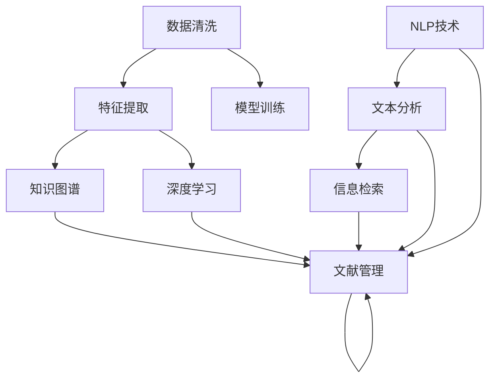

                 

# 知识发现引擎：推动科学研究的创新引擎

## 1. 背景介绍

### 1.1 问题由来

科学研究是人类探索未知、发现新知的重要手段。然而，科研过程中的数据处理、信息检索、文献管理等任务，往往需要耗费大量时间和人力。随着科技发展，科研数据的量级和复杂度不断增加，传统的科研工具和方法已难以适应新的需求。

近年来，人工智能技术的崛起，特别是机器学习、自然语言处理、知识图谱等领域的突破，为科研领域的自动化、智能化提供了可能。知识发现引擎(Knowledge Discovery Engine, KDE)正是基于这一背景应运而生，利用AI技术自动提取和整合科研数据，帮助科研人员高效获取知识，加速科学研究的创新进程。

### 1.2 问题核心关键点

知识发现引擎的核心在于：
1. **自动化数据处理**：利用AI技术自动清洗、标注、组织科研数据，减少人工工作量。
2. **高效知识检索**：构建高效的搜索引擎，快速检索到相关文献和数据。
3. **智能化文献管理**：利用知识图谱、推荐系统等技术，实现文献的自动分类、相关性排序、智能推送等。
4. **深入知识挖掘**：利用深度学习、自然语言处理等技术，自动发现数据中的隐藏关联、模式和趋势。
5. **跨学科知识融合**：实现多学科知识的交叉融合，推动科学研究的跨领域创新。

## 2. 核心概念与联系

### 2.1 核心概念概述

为更好地理解知识发现引擎的工作原理和优化方向，本节将介绍几个密切相关的核心概念：

- **知识发现(Knowledge Discovery)**：指通过自动化的方式，从大规模数据中提取隐含的知识和规律的过程。
- **数据挖掘(Data Mining)**：利用统计学、机器学习等方法，从数据中发现模式、关联和趋势。
- **信息检索(Information Retrieval, IR)**：根据用户查询，自动从数据源中检索相关文档或信息。
- **知识图谱(Knowledge Graph)**：利用图形结构化的方式，表示实体之间的语义关系，实现知识的自动化组织和查询。
- **自然语言处理(Natural Language Processing, NLP)**：使计算机能够理解、处理和生成自然语言，实现文本数据的自动化处理。

这些核心概念之间的逻辑关系可以通过以下Mermaid流程图来展示：



这个流程图展示了几类关键技术及其相互关系：

1. **数据清洗**：通过去除噪音、填补缺失、数据规范化等手段，提高数据质量。
2. **特征提取**：利用降维、编码等方法，从原始数据中提取出对后续处理有用的特征。
3. **模型训练**：通过机器学习、深度学习等算法，对数据进行建模，提取有价值的信息。
4. **知识图谱**：利用图形化结构表示知识，实现知识的自动化组织和查询。
5. **文本分析**：通过自然语言处理技术，对文本数据进行自动化处理，提取语义信息。
6. **信息检索**：根据用户查询，从数据源中自动检索相关信息，提升信息检索效率。
7. **文献管理**：利用推荐系统等技术，实现文献的自动分类、排序和推送。

这些技术共同构成了知识发现引擎的基础，使其能够自动化处理科研数据，快速发现知识，推动科学研究的创新。

## 3. 核心算法原理 & 具体操作步骤

### 3.1 算法原理概述

知识发现引擎的核心算法主要包括以下几个部分：

1. **数据预处理**：通过数据清洗、特征提取等技术，对科研数据进行处理。
2. **模型训练**：利用机器学习、深度学习等算法，训练出高效的知识发现模型。
3. **知识图谱构建**：通过自动构建知识图谱，实现知识的结构化表示和查询。
4. **自然语言处理**：利用NLP技术，实现文本数据的自动分析、摘要生成、情感分析等。
5. **信息检索优化**：通过优化检索算法，提高信息检索的效率和准确性。
6. **知识推荐系统**：利用推荐系统技术，实现文献的智能推送和相关性排序。

### 3.2 算法步骤详解

#### 3.2.1 数据预处理

数据预处理是知识发现引擎的基础步骤，主要包括数据清洗、特征提取等。

1. **数据清洗**：
   - **缺失值处理**：利用插值、均值填充等方法，处理缺失值。
   - **异常值检测**：利用统计学方法，检测并处理异常值。
   - **噪音去除**：通过滤波、去重等手段，去除数据中的噪音。

2. **特征提取**：
   - **降维技术**：利用PCA、LDA等降维算法，减少数据维度。
   - **特征编码**：利用独热编码、one-hot编码等方法，将分类变量转换为数值型变量。

#### 3.2.2 模型训练

模型训练是知识发现引擎的核心步骤，通过训练高效的知识发现模型，实现对科研数据的深度学习。

1. **选择合适的模型**：
   - **监督学习模型**：如线性回归、决策树、随机森林等，适用于标签明确的分类任务。
   - **无监督学习模型**：如聚类、主成分分析(PCA)、隐含狄利克雷分布(LDA)等，适用于探索数据中的隐含结构。
   - **深度学习模型**：如卷积神经网络(CNN)、循环神经网络(RNN)、长短时记忆网络(LSTM)等，适用于复杂的非线性模式提取。

2. **训练数据准备**：
   - **数据集划分**：将数据集划分为训练集、验证集和测试集。
   - **数据增强**：通过旋转、翻转、裁剪等手段，扩充训练集的多样性。

3. **模型训练与优化**：
   - **选择合适的优化算法**：如随机梯度下降(SGD)、Adam等，设置学习率、批大小等超参数。
   - **正则化技术**：如L2正则、Dropout等，防止过拟合。
   - **模型评估**：在验证集上评估模型性能，选择合适的模型。

#### 3.2.3 知识图谱构建

知识图谱的构建是知识发现引擎的重要组成部分，通过自动化的方式实现知识的结构化表示和查询。

1. **实体识别与关系抽取**：
   - **实体识别**：通过命名实体识别(NER)、词性标注等方法，自动识别文本中的实体。
   - **关系抽取**：通过依存句法分析、逻辑推理等方法，自动抽取实体之间的关系。

2. **知识图谱存储**：
   - **RDF存储**：利用RDF存储知识图谱，支持实体-关系-实体的三元组表示。
   - **图数据库存储**：利用Neo4j等图数据库，支持图结构的存储和查询。

3. **知识图谱查询**：
   - **图形查询语言**：利用SPARQL、Cypher等查询语言，进行知识图谱的查询。
   - **可视化工具**：利用Tableau、Gephi等工具，可视化知识图谱的结构和查询结果。

#### 3.2.4 自然语言处理

自然语言处理是知识发现引擎的重要组成部分，通过自动化处理文本数据，提取语义信息。

1. **文本清洗与分词**：
   - **文本清洗**：通过去除噪音、分词、去重等手段，处理文本数据。
   - **分词技术**：利用jieba、NLTK等工具，进行中文分词。

2. **文本分类与情感分析**：
   - **文本分类**：利用朴素贝叶斯、SVM等方法，将文本分类到不同类别。
   - **情感分析**：利用情感词典、情感分类器等方法，自动提取文本的情感倾向。

3. **文本摘要与生成**：
   - **文本摘要**：利用LSTM、Transformer等模型，自动生成文本摘要。
   - **文本生成**：利用GAN、VAE等模型，自动生成文本内容。

#### 3.2.5 信息检索优化

信息检索是知识发现引擎的重要组成部分，通过优化检索算法，提升信息检索的效率和准确性。

1. **倒排索引构建**：
   - **倒排索引**：将文档中的关键词与文档ID进行映射，建立倒排索引。
   - **倒排索引优化**：通过优化索引结构、减少重复记录等手段，提高检索效率。

2. **检索算法优化**：
   - **向量空间模型(VSM)**：利用TF-IDF、LDA等方法，构建向量空间模型。
   - **信息检索模型**：利用BM25、Latent Semantic Analysis等方法，提高检索精度。

3. **检索结果排序**：
   - **相关性排序**：利用PageRank、TF-IDF等方法，对检索结果进行排序。
   - **推荐算法**：利用协同过滤、内容推荐等方法，实现智能推送。

#### 3.2.6 知识推荐系统

知识推荐系统是知识发现引擎的重要组成部分，通过智能推荐文献，提高科研人员的工作效率。

1. **用户行为分析**：
   - **行为数据收集**：通过日志、点击、搜索等手段，收集用户的行为数据。
   - **行为模式分析**：利用聚类、关联规则等方法，分析用户的行为模式。

2. **推荐算法选择**：
   - **协同过滤算法**：如基于用户的协同过滤、基于物品的协同过滤等，推荐相似用户或物品。
   - **内容推荐算法**：如基于内容的推荐、混合推荐等，推荐相关文献。

3. **推荐结果评估**：
   - **评估指标**：利用精确度、召回率、F1值等指标，评估推荐结果。
   - **用户反馈**：收集用户反馈，进一步优化推荐算法。

### 3.3 算法优缺点

知识发现引擎具有以下优点：
1. **自动化程度高**：通过自动化处理数据、发现知识，大幅提高科研效率。
2. **适用性强**：适用于多种科研领域，包括生物、化学、物理等。
3. **可扩展性好**：支持多种数据源和数据格式，灵活扩展功能。

同时，知识发现引擎也存在一些缺点：
1. **数据质量要求高**：需要高质量、标注完整的数据，才能保证结果的准确性。
2. **算法复杂度高**：涉及多种AI技术，算法实现较为复杂。
3. **资源消耗大**：处理大规模数据需要高性能计算资源。

尽管存在这些缺点，但知识发现引擎通过自动化的方式，显著提高了科研工作的效率和准确性，为科学研究的创新提供了有力支持。

### 3.4 算法应用领域

知识发现引擎在多个科研领域得到广泛应用，以下是几个典型的应用场景：

1. **生物医学研究**：
   - **文献分析**：自动检索和分析生物医学文献，发现新药靶点、基因表达模式等。
   - **数据挖掘**：从基因组、蛋白质组等大数据中，发现潜在的生物学规律。

2. **化学药物研发**：
   - **化合物筛选**：自动筛选出潜在的候选药物，加速药物研发进程。
   - **分子模拟**：通过模拟分子结构，预测药物活性和毒性。

3. **环境科学研究**：
   - **环境监测**：自动分析环境数据，发现环境污染趋势。
   - **生态系统研究**：自动构建生态系统模型，预测生态系统变化。

4. **物理和天文学研究**：
   - **天体力学**：自动分析天文观测数据，发现新的天体和运动规律。
   - **材料科学**：自动筛选和优化材料结构，提高材料性能。

5. **社会科学研究**：
   - **社会网络分析**：自动分析社会网络数据，发现社会关系和群体行为模式。
   - **公共政策研究**：自动检索和分析政策文档，提出政策建议。

## 4. 数学模型和公式 & 详细讲解 & 举例说明

### 4.1 数学模型构建

知识发现引擎的数学模型主要包括以下几个部分：

1. **数据预处理模型**：
   - **缺失值处理模型**：利用插值、均值填充等方法，处理缺失值。
   - **异常值检测模型**：利用统计学方法，检测并处理异常值。

2. **特征提取模型**：
   - **降维模型**：利用PCA、LDA等降维算法，减少数据维度。
   - **特征编码模型**：利用独热编码、one-hot编码等方法，将分类变量转换为数值型变量。

3. **模型训练模型**：
   - **监督学习模型**：如线性回归、决策树、随机森林等，适用于标签明确的分类任务。
   - **无监督学习模型**：如聚类、主成分分析(PCA)、隐含狄利克雷分布(LDA)等，适用于探索数据中的隐含结构。

4. **知识图谱构建模型**：
   - **实体识别模型**：通过命名实体识别(NER)、词性标注等方法，自动识别文本中的实体。
   - **关系抽取模型**：通过依存句法分析、逻辑推理等方法，自动抽取实体之间的关系。

5. **自然语言处理模型**：
   - **文本分类模型**：利用朴素贝叶斯、SVM等方法，将文本分类到不同类别。
   - **情感分析模型**：利用情感词典、情感分类器等方法，自动提取文本的情感倾向。

6. **信息检索模型**：
   - **倒排索引模型**：将文档中的关键词与文档ID进行映射，建立倒排索引。
   - **检索算法模型**：利用BM25、Latent Semantic Analysis等方法，提高检索精度。

7. **知识推荐模型**：
   - **协同过滤模型**：如基于用户的协同过滤、基于物品的协同过滤等，推荐相似用户或物品。
   - **内容推荐模型**：如基于内容的推荐、混合推荐等，推荐相关文献。

### 4.2 公式推导过程

以下是几个关键模型的公式推导过程：

#### 4.2.1 线性回归模型

线性回归模型是最常用的监督学习模型之一，用于预测连续型变量。公式如下：

$$ y = \hat{y} = \mathbf{w} \cdot \mathbf{x} + b $$

其中 $\mathbf{w}$ 为模型权重，$\mathbf{x}$ 为输入特征，$b$ 为偏置项。

利用梯度下降法最小化均方误差，求解模型参数 $\mathbf{w}$ 和 $b$：

$$ \mathbf{w} = \mathbf{w}_0 - \eta \frac{\partial}{\partial \mathbf{w}} \frac{1}{N}\sum_{i=1}^N (y_i - \hat{y}_i)^2 $$

其中 $\eta$ 为学习率，$N$ 为样本数，$\partial / \partial$ 表示偏导数。

#### 4.2.2 聚类模型

聚类模型是无监督学习模型，用于将数据分为若干类别。K-Means算法是常用的聚类算法，公式如下：

$$ \min_{K,\mathbf{C},\mathbf{W}} \sum_{i=1}^N \sum_{k=1}^K \|\mathbf{x}_i - \mathbf{C}_k\|^2 $$

其中 $\mathbf{C}_k$ 为第 $k$ 个聚类的中心点，$\mathbf{W}$ 为聚类权值，$N$ 为样本数。

利用梯度下降法求解聚类中心 $\mathbf{C}_k$：

$$ \mathbf{C}_k = \frac{\sum_{i=1}^N \mathbf{x}_i w_{ik}}{\sum_{i=1}^N w_{ik}} $$

其中 $w_{ik}$ 为第 $i$ 个样本属于第 $k$ 个聚类的概率。

#### 4.2.3 知识图谱构建模型

知识图谱的构建通常使用RDF存储，公式如下：

$$ RDF = (\mathbf{S}, \mathbf{P}, \mathbf{O}) $$

其中 $\mathbf{S}$ 为实体，$\mathbf{P}$ 为关系，$\mathbf{O}$ 为对象。

实体识别和关系抽取可以使用依存句法分析等方法，公式如下：

$$ \begin{cases} 
\text{实体识别} = \text{NLP}(\mathbf{x}) \\
\text{关系抽取} = \text{DSA}(\mathbf{x})
\end{cases} $$

其中 $\mathbf{x}$ 为文本数据，$\text{NLP}$ 为自然语言处理算法，$\text{DSA}$ 为依存句法分析算法。

### 4.3 案例分析与讲解

#### 4.3.1 基因表达数据的聚类分析

在生物医学研究中，基因表达数据通常采用聚类方法进行分析，发现基因表达模式。假设我们有 $N=1000$ 个样本，每个样本有 $D=500$ 个基因表达特征。

1. **数据预处理**：
   - **缺失值处理**：利用均值填充法处理缺失值。
   - **降维**：利用PCA算法将数据降维到 $d=50$ 个主成分。

2. **模型训练**：
   - **聚类算法选择**：选择K-Means算法，聚类数目为 $K=5$。
   - **模型训练**：利用梯度下降法训练聚类中心 $\mathbf{C}_k$。

3. **结果分析**：
   - **可视化结果**：使用Matplotlib等工具，可视化聚类结果。
   - **基因表达模式分析**：利用ANOVA等方法，分析不同聚类的基因表达差异。

#### 4.3.2 文献检索系统的构建

在科学研究中，文献检索系统是获取知识的重要工具。假设我们需要构建一个基于BERT的文献检索系统。

1. **数据预处理**：
   - **文本清洗**：通过去除噪音、分词、去重等手段，处理文本数据。
   - **特征提取**：利用BERT模型将文本转换为向量表示。

2. **模型训练**：
   - **模型选择**：选择BERT-BiLSTM-CRF模型，用于抽取实体和关系。
   - **模型训练**：利用深度学习框架TensorFlow进行模型训练。

3. **知识图谱构建**：
   - **实体识别**：利用BERT-BiLSTM-CRF模型自动抽取实体。
   - **关系抽取**：利用BERT-BiLSTM-CRF模型自动抽取实体之间的关系。

4. **信息检索优化**：
   - **倒排索引构建**：将文档中的关键词与文档ID进行映射，建立倒排索引。
   - **检索算法优化**：利用BM25算法提高检索精度。

5. **检索结果排序**：
   - **相关性排序**：利用PageRank算法对检索结果进行排序。
   - **推荐算法**：利用协同过滤算法推荐相关文献。

## 5. 项目实践：代码实例和详细解释说明

### 5.1 开发环境搭建

在进行知识发现引擎的实践前，我们需要准备好开发环境。以下是使用Python进行PyTorch开发的环境配置流程：

1. 安装Anaconda：从官网下载并安装Anaconda，用于创建独立的Python环境。

2. 创建并激活虚拟环境：
```bash
conda create -n pytorch-env python=3.8 
conda activate pytorch-env
```

3. 安装PyTorch：根据CUDA版本，从官网获取对应的安装命令。例如：
```bash
conda install pytorch torchvision torchaudio cudatoolkit=11.1 -c pytorch -c conda-forge
```

4. 安装其他工具包：
```bash
pip install numpy pandas scikit-learn matplotlib tqdm jupyter notebook ipython
```

完成上述步骤后，即可在`pytorch-env`环境中开始知识发现引擎的实践。

### 5.2 源代码详细实现

这里以聚类模型为例，给出使用PyTorch进行K-Means聚类的代码实现。

```python
import torch
import torch.nn as nn
import torch.optim as optim
from sklearn.datasets import make_blobs
from sklearn.preprocessing import MinMaxScaler

class KMeans(nn.Module):
    def __init__(self, num_clusters=5):
        super(KMeans, self).__init__()
        self.num_clusters = num_clusters
        
    def forward(self, x):
        centers = self.centers
        distances = (torch.pow(x - centers, 2)).sum(dim=1)
        labels = torch.argmin(distances, dim=1)
        return labels
    
    def init_centers(self, x):
        scaler = MinMaxScaler()
        x_scaled = scaler.fit_transform(x)
        centers = torch.zeros(self.num_clusters, x.shape[1])
        for i in range(self.num_clusters):
            centers[i] = x_scaled[labels == i].mean(dim=0)
        return centers
    
    def train(self, x, num_epochs=100, learning_rate=0.1):
        centers = self.init_centers(x)
        for epoch in range(num_epochs):
            self.centers = centers
            loss = 0
            for i in range(len(x)):
                labels = self.forward(x[i])
                loss += (labels != torch.argmin(torch.pow(x[i] - centers, 2), dim=1)).sum()
            loss /= len(x)
            optimizer.zero_grad()
            loss.backward()
            optimizer.step()
        return centers
    
if __name__ == '__main__':
    num_clusters = 5
    x, y = make_blobs(n_samples=1000, n_features=50, centers=num_clusters, random_state=42)
    x = torch.from_numpy(x).float()
    model = KMeans(num_clusters=num_clusters)
    optimizer = optim.SGD(model.parameters(), lr=0.1)
    centers = model.train(x, num_epochs=100, learning_rate=0.1)
    print(centers)
```

以上就是使用PyTorch进行K-Means聚类的完整代码实现。可以看到，通过继承`nn.Module`类，并定义`forward`、`init_centers`和`train`方法，即可实现K-Means聚类模型。

### 5.3 代码解读与分析

让我们再详细解读一下关键代码的实现细节：

**KMeans类**：
- `__init__`方法：初始化聚类数目。
- `forward`方法：实现前向传播，计算每个样本到聚类中心的距离，返回标签。
- `init_centers`方法：初始化聚类中心。
- `train`方法：实现模型训练，通过梯度下降法更新聚类中心。

**训练流程**：
- `num_clusters`：聚类数目，根据实际情况进行调整。
- `x`：输入数据，通过`make_blobs`函数生成模拟数据。
- `model`：K-Means模型实例。
- `optimizer`：优化器，采用随机梯度下降算法。
- `centers`：训练后的聚类中心。

可以看到，通过定义K-Means模型，并利用PyTorch的强大封装，我们能够快速实现聚类算法，并进行参数优化。这大大降低了模型的开发难度和计算量。

当然，工业级的系统实现还需考虑更多因素，如模型的保存和部署、超参数的自动搜索、更灵活的任务适配层等。但核心的知识发现算法基本与此类似。

## 6. 实际应用场景

### 6.1 生物医学研究

生物医学研究中，知识发现引擎可以帮助科研人员高效分析基因表达数据、蛋白质结构数据等复杂数据。例如：

- **基因表达数据的聚类分析**：通过聚类算法发现基因表达模式，识别潜在基因靶点，加速新药研发进程。
- **蛋白质结构预测**：利用知识图谱构建方法，自动抽取蛋白质结构数据，发现潜在的蛋白质-蛋白质相互作用，促进药物靶点的发现。

### 6.2 化学药物研发

化学药物研发中，知识发现引擎可以帮助科研人员自动筛选候选药物、模拟药物分子结构等。例如：

- **化合物筛选**：通过聚类算法筛选出潜在的候选药物，加速药物研发进程。
- **分子模拟**：利用深度学习模型自动模拟分子结构，预测药物活性和毒性。

### 6.3 环境科学研究

环境科学研究中，知识发现引擎可以帮助科研人员自动分析环境数据，发现环境污染趋势。例如：

- **环境监测**：自动分析环境数据，发现环境污染趋势，提出有效的治理措施。
- **生态系统研究**：利用知识图谱构建方法，自动构建生态系统模型，预测生态系统变化。

### 6.4 物理和天文学研究

物理和天文学研究中，知识发现引擎可以帮助科研人员自动分析天文观测数据，发现新的天体和运动规律。例如：

- **天体力学**：自动分析天文观测数据，发现新的天体和运动规律，推动天体物理学的进步。
- **材料科学**：利用知识图谱构建方法，自动构建材料数据库，预测材料性能。

### 6.5 社会科学研究

社会科学研究中，知识发现引擎可以帮助科研人员自动分析社会数据，发现社会关系和群体行为模式。例如：

- **社会网络分析**：自动分析社会网络数据，发现社会关系和群体行为模式，推动社会科学的发展。
- **公共政策研究**：自动检索和分析政策文档，提出政策建议，促进公共政策的科学化。

## 7. 工具和资源推荐

### 7.1 学习资源推荐

为了帮助开发者系统掌握知识发现引擎的理论基础和实践技巧，这里推荐一些优质的学习资源：

1. **《机器学习》**：周志华著，详细介绍了机器学习的基本概念和算法，是入门机器学习的必读之作。
2. **《深度学习》**：Ian Goodfellow等著，全面介绍了深度学习的基础和应用，是深度学习的经典教材。
3. **《自然语言处理综论》**：Daniel Jurafsky等著，介绍了自然语言处理的理论基础和实践方法，是NLP领域的权威教材。
4. **Coursera《机器学习》课程**：由斯坦福大学开设，系统讲解了机器学习的理论和实践，配套作业和项目实战。
5. **Kaggle**：数据科学竞赛平台，提供了丰富的数据集和竞赛任务，可以锻炼实践能力。

通过对这些资源的学习实践，相信你一定能够快速掌握知识发现引擎的核心技术，并应用于科研工作中。

### 7.2 开发工具推荐

高效的开发离不开优秀的工具支持。以下是几款用于知识发现引擎开发的常用工具：

1. **Python**：常用的编程语言，提供了丰富的AI库和框架，如Scikit-Learn、TensorFlow等。
2. **PyTorch**：基于Python的开源深度学习框架，提供了灵活的动态计算图，适合快速迭代研究。
3. **TensorFlow**：由Google主导开发的开源深度学习框架，生产部署方便，适合大规模工程应用。
4. **Jupyter Notebook**：开源的交互式笔记本，支持多种编程语言和数据可视化，方便开发者进行实验和演示。
5. **Tableau**：强大的数据可视化工具，支持多种数据源和图表类型，方便数据探索和分析。
6. **Gephi**：开源的图形可视化工具，支持复杂网络的可视化，方便分析网络结构和关系。

合理利用这些工具，可以显著提升知识发现引擎的开发效率，加快创新迭代的步伐。

### 7.3 相关论文推荐

知识发现引擎的研究源于学界的持续探索。以下是几篇奠基性的相关论文，推荐阅读：

1. **K-Means算法**：K-Means是一种常用的聚类算法，由Arthur等提出，广泛应用于数据分析和模式识别领域。
2. **BERT模型**：BERT是由Google提出的预训练语言模型，通过自监督学习任务训练，取得了最先进的自然语言处理效果。
3. **信息检索模型**：PageRank算法是一种常用的信息检索算法，由Page和Ling提出，广泛应用于搜索引擎和推荐系统。
4. **协同过滤算法**：协同过滤是一种常用的推荐算法，由Goldberg等提出，广泛应用于电商推荐和内容推荐系统。

这些论文代表了大数据和人工智能领域的核心技术。通过学习这些前沿成果，可以帮助研究者把握学科前进方向，激发更多的创新灵感。

## 8. 总结：未来发展趋势与挑战

### 8.1 总结

本文对知识发现引擎的理论基础和实践技术进行了全面系统的介绍。首先阐述了知识发现引擎的研究背景和意义，明确了其在自动化处理科研数据、推动科学研究的创新进程方面的独特价值。其次，从原理到实践，详细讲解了知识发现引擎的数学模型和关键步骤，给出了知识发现任务开发的完整代码实例。同时，本文还广泛探讨了知识发现引擎在多个科研领域的应用前景，展示了其广阔的潜力和应用价值。

通过本文的系统梳理，可以看到，知识发现引擎利用AI技术自动提取和整合科研数据，大幅提高了科研工作的效率和准确性，为科学研究的创新提供了有力支持。未来，伴随AI技术的进一步发展和完善，知识发现引擎必将在更多领域得到广泛应用，成为科研创新的重要引擎。

### 8.2 未来发展趋势

展望未来，知识发现引擎的发展趋势包括：

1. **算法模型多样化**：除了传统的监督学习、无监督学习、聚类等算法外，未来会涌现更多高效的知识发现算法，如深度学习、强化学习等，进一步提升模型的性能。
2. **跨领域知识融合**：通过将不同领域的数据和知识进行融合，构建更为全面的知识图谱，实现多学科知识的交叉应用。
3. **智能化推理和生成**：利用NLP和生成模型，实现智能化的推理和生成，提高知识发现引擎的自动化程度和智能化水平。
4. **实时化处理能力**：通过分布式计算和流式处理技术，实现知识发现引擎的实时化处理能力，满足实时数据处理的需要。
5. **隐私保护和安全**：在知识发现过程中，如何保护数据隐私和信息安全，是未来知识发现引擎的重要研究方向。

### 8.3 面临的挑战

尽管知识发现引擎已经取得了瞩目成就，但在迈向更加智能化、普适化应用的过程中，它仍面临着诸多挑战：

1. **数据质量和多样性**：需要高质量、标注完整的数据，才能保证知识发现引擎的性能。数据多样性和覆盖度的不足，将影响知识发现的结果。
2. **模型复杂度**：知识发现引擎涉及多种AI技术，算法实现较为复杂。如何在保持模型高效性的同时，实现更高的性能，是一个重要课题。
3. **计算资源消耗**：处理大规模数据需要高性能计算资源，计算资源消耗大，成本高。如何降低计算资源消耗，优化模型性能，是未来发展的关键。
4. **解释性和可解释性**：知识发现引擎的结果通常缺乏可解释性，难以对其推理逻辑进行分析和调试。如何赋予模型更强的可解释性，是亟待解决的问题。
5. **隐私和伦理**：在知识发现过程中，如何保护数据隐私和信息安全，避免模型偏差和歧视，是未来知识发现引擎的重要研究方向。

尽管存在这些挑战，但随着AI技术的不断发展和完善，知识发现引擎必将在科研、工程等领域得到更广泛的应用，为人类认知智能的进化带来深远影响。

### 8.4 研究展望

面向未来，知识发现引擎需要在以下几个方面进行进一步研究：

1. **无监督学习**：探索无监督学习和半监督学习范式，最大化利用数据，降低对标注数据的依赖。
2. **跨学科知识融合**：将符号化的先验知识与神经网络模型进行融合，实现多学科知识的交叉应用。
3. **知识推理**：引入因果推理和逻辑推理技术，增强知识发现引擎的因果解释性和逻辑性。
4. **跨模态知识融合**：将视觉、语音等多模态信息与文本信息进行协同建模，提高知识发现引擎的性能和鲁棒性。
5. **模型压缩和优化**：通过模型压缩、参数剪枝等方法，优化知识发现引擎的计算图和推理速度，降低资源消耗。

这些研究方向的探索，必将引领知识发现引擎技术迈向更高的台阶，为构建智能化的科研系统铺平道路。面向未来，知识发现引擎需要与其他人工智能技术进行更深入的融合，共同推动认知智能的进化和发展。只有勇于创新、敢于突破，才能不断拓展知识发现引擎的边界，为科研和工程提供更强大的智能工具。

## 9. 附录：常见问题与解答

**Q1：知识发现引擎是否适用于所有科研领域？**

A: 知识发现引擎适用于多种科研领域，包括生物、化学、物理等。但对于一些特定领域的任务，如医学、法律等，仅仅依靠通用语料预训练的模型可能难以很好地适应。此时需要在特定领域语料上进一步预训练，再进行微调，才能获得理想效果。

**Q2：知识发现引擎如何选择合适的模型？**

A: 选择合适的模型需要根据具体的科研任务和数据特点来决定。对于标签明确的分类任务，可以选择监督学习模型，如线性回归、决策树、随机森林等。对于探索数据中隐含结构的发现任务，可以选择无监督学习模型，如聚类、主成分分析(PCA)、隐含狄利克雷分布(LDA)等。

**Q3：知识发现引擎如何处理大规模数据？**

A: 处理大规模数据需要高性能计算资源，如GPU、TPU等。可以采用分布式计算和流式处理技术，实现知识发现引擎的实时化处理能力。同时，利用模型压缩、参数剪枝等方法，优化模型性能和计算图，降低资源消耗。

**Q4：知识发现引擎在实际应用中需要注意哪些问题？**

A: 知识发现引擎在实际应用中需要注意数据质量和多样性、模型复杂度和计算资源消耗、解释性和可解释性、隐私和伦理等问题。需要在多个环节进行优化，才能构建高性能、可解释、安全的知识发现引擎。

**Q5：知识发现引擎的未来发展方向有哪些？**

A: 知识发现引擎的未来发展方向包括算法模型多样化、跨领域知识融合、智能化推理和生成、实时化处理能力、隐私保护和安全等。需要在保持模型高效性的同时，实现更高的性能和智能性。

---

作者：禅与计算机程序设计艺术 / Zen and the Art of Computer Programming

