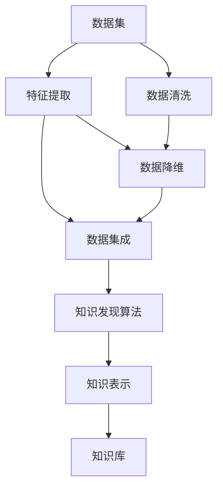

                 

## 1. 背景介绍

随着大数据时代的到来，信息爆炸式增长，如何从海量数据中挖掘出有价值的知识和洞察，成为数据驱动决策的重要一环。传统的知识管理主要依赖人工手动标注和整理，费时费力且容易出错。现代的计算技术和算法方法的进步，特别是自然语言处理、机器学习和数据挖掘技术的发展，为自动化的知识发现提供了可能。

知识发现引擎(Knowledge Discovery Engine, KDE)是一种专门用于从数据中自动抽取知识的工具。与传统的手工知识提取相比，它能够大幅提升知识抽取的效率和准确性，减少人为干预，确保知识抽取过程的可靠性和一致性。

## 2. 核心概念与联系

### 2.1 核心概念概述

为更好地理解知识发现引擎的原理和应用，本节将介绍几个关键概念：

- **知识发现(Knowledge Discovery, KD)**：从数据中自动抽取出有用信息、模式和知识的过程。知识发现不仅包括数据分析，还涉及领域知识的应用和融合。
- **知识发现引擎(Knowledge Discovery Engine, KDE)**：一种软件工具，能够自动从大规模数据集中发现知识，包括数据挖掘、机器学习、自然语言处理等技术。
- **数据挖掘(Data Mining)**：通过算法从数据中挖掘出有价值的模式和知识，是知识发现的重要技术手段。
- **自然语言处理(Natural Language Processing, NLP)**：使计算机能够理解和处理人类语言，抽取、分析、生成文本信息，是知识发现中重要的一环。
- **机器学习(Machine Learning, ML)**：利用算法让计算机从数据中学习规律和知识，是知识发现的核心算法技术。

这些核心概念共同构成了知识发现引擎的理论基础和实践框架，使得知识发现过程自动化、智能化，大幅提升了知识获取的效率和质量。

### 2.2 核心概念原理和架构的 Mermaid 流程图



这个流程图展示了知识发现引擎的核心步骤：
1. **数据清洗**：对原始数据进行预处理，去除噪声、重复、缺失等无效数据。
2. **特征提取**：从数据中提取有用的特征，供后续分析使用。
3. **数据降维**：通过算法减少数据维度，提升分析效率和准确性。
4. **数据集成**：将多个数据源的信息合并，形成统一的数据集。
5. **知识发现算法**：使用机器学习等技术从数据中发现模式、关联和知识。
6. **知识表示**：将知识转换为结构化形式，方便存储、检索和使用。
7. **知识库**：存储和组织知识，提供查询接口，方便用户使用。

这些步骤相互协作，共同构建起知识发现引擎的完整工作流程。

## 3. 核心算法原理 & 具体操作步骤

### 3.1 算法原理概述

知识发现引擎的核心原理基于机器学习、数据挖掘和自然语言处理等技术，通过自动化地分析数据，从其中提取知识、模式和洞察。其基本流程如下：

1. **数据预处理**：清洗、转换、归一化数据，去除噪声和无关信息。
2. **特征提取**：通过算法从数据中提取有用的特征，供后续分析使用。
3. **数据降维**：通过降维算法减少数据的维度，提升分析效率。
4. **知识发现算法**：使用分类、聚类、关联规则等算法，从数据中发现模式、关联和知识。
5. **知识表示**：将知识转换为结构化形式，如表格、图等，方便存储和检索。
6. **知识应用**：将知识应用于实际决策和业务场景，提供支持的策略和建议。

### 3.2 算法步骤详解

#### 3.2.1 数据预处理

数据预处理是知识发现的第一步，包括数据清洗、转换、归一化等。常见的数据清洗方法包括：
- **缺失值处理**：填充或删除缺失值，保证数据完整性。
- **异常值处理**：识别并处理异常数据点，防止其影响分析结果。
- **噪声处理**：去除数据中的噪声和干扰信息。

数据清洗完成后，需要对数据进行转换和归一化，使其适合后续的分析和处理。

#### 3.2.2 特征提取

特征提取是从原始数据中提取有用的特征，供后续分析使用。常见的特征提取方法包括：
- **文本特征提取**：通过自然语言处理技术，将文本数据转换为数字特征。
- **时间序列特征提取**：从时间序列数据中提取有用的时序特征。
- **图像特征提取**：从图像数据中提取颜色、纹理、形状等特征。

特征提取是知识发现的关键步骤，其质量直接影响后续分析的准确性。

#### 3.2.3 数据降维

数据降维是减少数据维度，提升分析效率和准确性的关键步骤。常见的方法包括：
- **主成分分析(PCA)**：通过线性变换将高维数据映射到低维空间。
- **独立成分分析(ICA)**：将数据分解为独立的成分，减少冗余信息。
- **t-SNE**：将高维数据映射到二维或三维空间，便于可视化分析。

数据降维后，数据的维度大幅降低，便于后续分析处理。

#### 3.2.4 知识发现算法

知识发现算法是知识发现引擎的核心算法，常见的算法包括：
- **分类算法**：如决策树、支持向量机(SVM)、神经网络等，用于分类和预测。
- **聚类算法**：如K-means、层次聚类等，用于发现数据中的群体和模式。
- **关联规则算法**：如Apriori算法、FP-growth算法等，用于发现数据中的关联规则和模式。

这些算法通过学习数据中的规律和模式，自动发现知识，供后续分析使用。

#### 3.2.5 知识表示

知识表示是将知识转换为结构化形式，方便存储、检索和使用。常见的知识表示方法包括：
- **表格表示**：将知识存储在二维表格中，便于查询和使用。
- **图表示**：将知识存储在图结构中，方便关系和网络分析。
- **本体表示**：使用本体语言描述知识，便于知识共享和复用。

知识表示是知识发现的重要环节，其形式直接影响知识的应用和利用。

#### 3.2.6 知识应用

知识应用是将知识应用于实际决策和业务场景，提供支持的策略和建议。常见的应用场景包括：
- **商业智能**：分析业务数据，提供市场趋势、客户分析等支持。
- **金融分析**：分析金融数据，提供风险评估、投资建议等支持。
- **医疗健康**：分析医疗数据，提供疾病诊断、治疗方案等支持。

知识应用是知识发现的最终目标，其效果直接影响知识发现的实用性和价值。

### 3.3 算法优缺点

知识发现引擎具有以下优点：
1. **自动化和智能化**：通过自动化算法从数据中提取知识，减少人为干预，提升效率和准确性。
2. **高效性**：在处理大规模数据集时，能够高效地发现模式和知识。
3. **灵活性**：可以应用于多种领域和场景，具有广泛的适用性。

同时，知识发现引擎也存在以下缺点：
1. **数据质量依赖性高**：对数据质量要求高，数据清洗和预处理复杂。
2. **算法复杂度大**：需要复杂的算法和计算资源，对硬件要求较高。
3. **知识可解释性不足**：一些算法的输出结果难以解释，缺乏透明性。
4. **需要领域知识**：知识发现算法需要领域知识，对领域专家的依赖较大。

尽管存在这些缺点，但知识发现引擎在大规模数据分析和知识抽取中的应用仍然非常广泛，通过不断优化算法和技术，这些缺点正在逐渐得到改善。

### 3.4 算法应用领域

知识发现引擎在多个领域得到了广泛应用，以下是几个典型的应用场景：

#### 3.4.1 商业智能

商业智能(Business Intelligence, BI)领域是知识发现引擎的重要应用场景。通过分析企业内部数据和市场数据，知识发现引擎可以帮助企业发现市场趋势、客户需求、竞争对手情况等，从而制定更科学的商业策略。常见的应用包括：
- **客户分析**：分析客户数据，识别高价值客户，制定精准营销策略。
- **市场预测**：分析市场数据，预测市场趋势和需求，指导产品开发和销售。
- **运营优化**：分析运营数据，优化运营流程和资源配置，提升运营效率。

#### 3.4.2 金融分析

金融分析是知识发现引擎在金融领域的重要应用。通过分析金融数据，知识发现引擎可以帮助金融机构识别投资机会、评估风险、监控异常等，从而提供更科学的金融决策支持。常见的应用包括：
- **风险评估**：分析金融数据，识别潜在风险，提供风险预警和控制建议。
- **投资分析**：分析市场数据和公司数据，提供投资机会和风险评估。
- **欺诈检测**：分析交易数据，识别异常行为和欺诈行为，提供预警和处理建议。

#### 3.4.3 医疗健康

医疗健康领域是知识发现引擎的另一个重要应用场景。通过分析医疗数据，知识发现引擎可以帮助医疗机构识别疾病模式、分析治疗效果、优化资源配置等，从而提供更科学的医疗决策支持。常见的应用包括：
- **疾病预测**：分析患者数据和医学数据，预测疾病发生和发展趋势。
- **治疗方案优化**：分析治疗数据和临床数据，提供个性化治疗方案。
- **资源配置优化**：分析医院资源和患者数据，优化资源配置和医疗服务。

## 4. 数学模型和公式 & 详细讲解 & 举例说明

### 4.1 数学模型构建

知识发现引擎的数学模型通常包括以下几个部分：

- **数据表示模型**：将数据表示为数字形式，供算法处理。
- **特征选择模型**：从数据中选择有用的特征，供算法学习。
- **降维模型**：通过算法将高维数据映射到低维空间，提升分析效率。
- **分类模型**：使用分类算法，从数据中学习分类器。
- **聚类模型**：使用聚类算法，发现数据中的群体和模式。
- **关联规则模型**：使用关联规则算法，发现数据中的关联规则和模式。

### 4.2 公式推导过程

以分类算法为例，假设数据集为 $D=\{(x_i, y_i)\}_{i=1}^N$，其中 $x_i$ 为输入，$y_i$ 为输出标签。常见的分类算法包括决策树、SVM、神经网络等，这里以决策树算法为例，推导其分类过程。

决策树分类算法的目标是找到最佳的分类树 $T$，使得分类误差最小。决策树由节点和边组成，每个节点表示一个特征，边表示特征取值。分类过程如下：

1. **计算信息熵**：
   $$
   H(Y) = -\sum_{i=1}^N p_i \log_2 p_i
   $$
   其中 $p_i$ 为样本 $i$ 的类别概率，即 $p_i = \frac{y_i}{N}$。

2. **选择最优特征**：
   对于每个特征 $f_j$，计算信息增益 $Gain(f_j)$：
   $$
   Gain(f_j) = H(Y) - \sum_{i=1}^N p_{ij} H(Y|f_j)
   $$
   其中 $p_{ij}$ 为特征 $f_j$ 取值为 $j$ 的样本在总样本中的比例，$H(Y|f_j)$ 为条件熵。

3. **构建决策树**：
   从根节点开始，每次选择信息增益最大的特征作为节点，根据特征取值递归构建子树，直到所有节点为叶节点，每个叶节点表示一个类别。

4. **分类**：
   对于新样本 $x$，从根节点开始递归遍历决策树，根据特征取值到达叶节点，该叶节点对应的类别即为分类结果。

决策树算法通过递归构建最优决策树，实现对数据的分类和预测。其核心在于计算信息熵和信息增益，选择最优特征，并递归构建子树。

### 4.3 案例分析与讲解

以一个简单的医疗数据集为例，展示知识发现引擎的应用。假设数据集包含患者的年龄、性别、血压、血糖等特征，以及是否患病的标签。

1. **数据预处理**：对数据进行清洗、归一化，去除缺失值和噪声。
2. **特征提取**：将年龄、性别、血压、血糖等特征提取为数字形式。
3. **数据降维**：使用PCA算法将高维数据映射到低维空间，保留主要特征。
4. **知识发现算法**：使用决策树算法，从数据中学习分类器，识别高风险患者。
5. **知识表示**：将分类结果转换为表格形式，方便后续应用。
6. **知识应用**：根据分类结果，提供个性化的健康建议和预防措施。

通过知识发现引擎，医生可以更准确地识别高风险患者，提供个性化的健康建议和预防措施，从而提高医疗服务的质量和效率。

## 5. 项目实践：代码实例和详细解释说明

### 5.1 开发环境搭建

为了进行知识发现引擎的开发，需要准备好开发环境。以下是使用Python进行Scikit-learn开发的环境配置流程：

1. 安装Anaconda：从官网下载并安装Anaconda，用于创建独立的Python环境。

2. 创建并激活虚拟环境：
```bash
conda create -n sk-learn-env python=3.8 
conda activate sk-learn-env
```

3. 安装Scikit-learn：
```bash
pip install -U scikit-learn
```

4. 安装各类工具包：
```bash
pip install numpy pandas matplotlib seaborn jupyter notebook ipython
```

完成上述步骤后，即可在`sk-learn-env`环境中开始知识发现引擎的开发实践。

### 5.2 源代码详细实现

这里以使用Scikit-learn进行决策树分类为例，展示知识发现引擎的实现。

```python
from sklearn.datasets import load_iris
from sklearn.model_selection import train_test_split
from sklearn.tree import DecisionTreeClassifier
from sklearn.metrics import accuracy_score

# 加载数据集
iris = load_iris()
X = iris.data
y = iris.target

# 划分训练集和测试集
X_train, X_test, y_train, y_test = train_test_split(X, y, test_size=0.3, random_state=42)

# 构建决策树模型
clf = DecisionTreeClassifier(max_depth=2)

# 训练模型
clf.fit(X_train, y_train)

# 预测测试集
y_pred = clf.predict(X_test)

# 计算准确率
acc = accuracy_score(y_test, y_pred)
print("Accuracy: {:.2f}%".format(acc * 100))
```

### 5.3 代码解读与分析

以上代码展示了使用Scikit-learn进行决策树分类的实现过程。

- `load_iris`函数：从Scikit-learn库中加载Iris数据集，包含150个样本，每个样本4个特征和1个标签。
- `train_test_split`函数：将数据集划分为训练集和测试集，比例为70:30。
- `DecisionTreeClassifier`类：构建决策树分类模型，设置最大深度为2。
- `fit`方法：使用训练集数据拟合决策树模型。
- `predict`方法：使用测试集数据进行预测。
- `accuracy_score`函数：计算预测准确率。

代码中，使用Scikit-learn库可以方便地构建决策树模型，进行训练和预测。Scikit-learn提供了丰富的机器学习算法和工具，可以大大简化知识发现引擎的实现过程。

## 6. 实际应用场景

### 6.1 智能推荐系统

智能推荐系统是知识发现引擎的重要应用场景。通过分析用户的历史行为数据，知识发现引擎可以发现用户的兴趣和偏好，从而提供个性化的推荐服务。常见的应用包括：
- **商品推荐**：分析用户购买行为，推荐相关商品。
- **内容推荐**：分析用户浏览行为，推荐相关内容。
- **新闻推荐**：分析用户阅读行为，推荐相关新闻。

#### 6.1.1 商品推荐

在电商平台上，智能推荐系统可以大幅提升用户满意度和交易转化率。通过分析用户的历史购买数据、浏览数据、评分数据等，知识发现引擎可以发现用户的兴趣和偏好，从而推荐相关商品。

以下是一个商品推荐系统的代码实现：

```python
from sklearn.cluster import KMeans
from sklearn.metrics.pairwise import cosine_similarity

# 构建用户-商品矩阵
user_item_matrix = ...

# 计算用户-商品矩阵的相似度
similarity_matrix = cosine_similarity(user_item_matrix)

# 构建用户-用户矩阵
user_user_matrix = similarity_matrix * similarity_matrix.T

# 计算用户相似度
user_similarity = ...

# 推荐商品
recommend_items = ...
```

### 6.2 金融欺诈检测

金融欺诈检测是知识发现引擎在金融领域的重要应用。通过分析交易数据，知识发现引擎可以识别异常行为和欺诈行为，从而提供预警和处理建议。常见的应用包括：
- **交易监控**：分析交易数据，识别异常交易行为。
- **风险预警**：分析交易数据和客户数据，提供风险预警和控制建议。
- **异常检测**：分析交易数据，识别异常行为和欺诈行为。

#### 6.2.1 交易监控

在金融领域，交易监控是保障交易安全的重要手段。通过分析交易数据，知识发现引擎可以发现异常交易行为，及时采取措施。

以下是一个交易监控系统的代码实现：

```python
from sklearn.cluster import DBSCAN
from sklearn.preprocessing import StandardScaler

# 加载交易数据
data = ...

# 标准化数据
scaler = StandardScaler()
scaled_data = scaler.fit_transform(data)

# 异常检测
db = DBSCAN(eps=0.5, min_samples=2)
db.fit(scaled_data)
outliers = db.labels_[db.labels_ == -1]
```

### 6.3 客户细分

客户细分是知识发现引擎在市场营销中的重要应用。通过分析客户数据，知识发现引擎可以发现不同客户群体，从而提供更有针对性的营销策略。常见的应用包括：
- **客户分类**：分析客户数据，识别不同客户群体。
- **客户价值评估**：分析客户数据，评估客户价值和购买潜力。
- **客户流失预测**：分析客户数据，预测客户流失风险。

#### 6.3.1 客户分类

在市场营销中，客户分类是制定营销策略的重要依据。通过分析客户数据，知识发现引擎可以发现不同客户群体，从而提供更有针对性的营销策略。

以下是一个客户分类系统的代码实现：

```python
from sklearn.cluster import KMeans
from sklearn.preprocessing import StandardScaler

# 加载客户数据
data = ...

# 标准化数据
scaler = StandardScaler()
scaled_data = scaler.fit_transform(data)

# 聚类分析
kmeans = KMeans(n_clusters=4)
kmeans.fit(scaled_data)
clusters = kmeans.labels_
```

## 7. 工具和资源推荐

### 7.1 学习资源推荐

为了帮助开发者系统掌握知识发现引擎的理论基础和实践技巧，这里推荐一些优质的学习资源：

1. 《数据挖掘与统计学习》（Data Mining and Statistical Learning）：这是一本系统介绍数据挖掘技术的经典教材，详细讲解了数据预处理、特征选择、分类算法等知识点。

2. 《机器学习实战》（Machine Learning in Action）：这本书通过实际案例和代码实现，系统介绍了各种机器学习算法的实现和应用，适合初学者学习。

3. 《Python数据科学手册》（Python Data Science Handbook）：这是一本介绍数据科学技术的实用指南，涵盖数据预处理、特征工程、模型选择等知识点。

4. Kaggle竞赛平台：这是一个全球知名的数据科学竞赛平台，提供了大量的数据集和挑战题目，适合实践知识发现引擎的算法和模型。

5. Coursera和edX等在线课程平台：这些平台提供了许多关于数据挖掘和机器学习的在线课程，系统讲解了各种算法和工具的使用方法。

### 7.2 开发工具推荐

高效的开发离不开优秀的工具支持。以下是几款用于知识发现引擎开发的常用工具：

1. Jupyter Notebook：这是一个交互式的笔记本环境，适合进行数据探索和算法实现。

2. TensorBoard：这是一个可视化工具，可以实时监测模型训练状态，并提供丰富的图表呈现方式。

3. Weights & Biases：这是一个实验跟踪工具，可以记录和可视化模型训练过程中的各项指标，方便对比和调优。

4. Apache Spark：这是一个大数据处理平台，可以处理大规模数据集，支持分布式计算。

5. Pandas：这是一个数据处理和分析工具，适合进行数据清洗和特征提取。

6. Scikit-learn：这是一个机器学习工具库，提供了丰富的算法和工具，适合进行数据挖掘和模型训练。

### 7.3 相关论文推荐

知识发现引擎的研究始于20世纪80年代，经历了多次技术演进和突破。以下是几篇奠基性的相关论文，推荐阅读：

1. J. Han等《数据挖掘：概念与技术》（Data Mining: Concepts and Techniques）：这本书是数据挖掘领域的经典教材，系统介绍了数据挖掘技术的理论基础和应用方法。

2. R. Agrawal等《Apriori算法》（Apriori）：这篇论文提出了Apriori算法，是关联规则挖掘的经典算法之一。

3. D. Yeung等《聚类分析》（Clustering Algorithms）：这篇论文系统介绍了各种聚类算法的理论基础和实现方法。

4. T. Hastie等《机器学习》（The Elements of Statistical Learning）：这本书是机器学习领域的经典教材，系统介绍了各种机器学习算法的理论和应用。

5. B. Kleinberg等《PageRank算法》（PageRank）：这篇论文提出了PageRank算法，是网页排序的经典算法之一。

这些论文代表了大数据时代知识发现引擎的研究脉络，通过学习这些前沿成果，可以帮助研究者把握学科前进方向，激发更多的创新灵感。

## 8. 总结：未来发展趋势与挑战

### 8.1 总结

本文对知识发现引擎的理论基础和实践技术进行了全面系统的介绍。首先阐述了知识发现引擎的研究背景和意义，明确了其在大数据分析和知识抽取中的独特价值。其次，从原理到实践，详细讲解了知识发现引擎的核心算法和操作步骤，给出了具体的代码实例和解释说明。同时，本文还广泛探讨了知识发现引擎在商业智能、金融分析、医疗健康等多个领域的应用前景，展示了其广阔的发展空间。

通过本文的系统梳理，可以看到，知识发现引擎作为知识抽取和数据分析的重要工具，已经在商业智能、金融分析、医疗健康等领域展示了巨大的价值。随着数据量的不断增长和技术手段的不断进步，知识发现引擎必将在更多领域得到应用，为数据驱动决策提供更强大的支持。

### 8.2 未来发展趋势

展望未来，知识发现引擎将呈现以下几个发展趋势：

1. **自动化和智能化**：自动化算法和智能化工具将进一步提升知识发现引擎的效率和准确性。
2. **多模态数据融合**：将文本、图像、声音等多种数据源融合，提升知识发现的能力。
3. **深度学习**：深度学习算法在知识发现中的应用将越来越广泛，提升知识发现引擎的深度和广度。
4. **可解释性**：提升知识发现引擎的透明性和可解释性，增强模型的可信度和可靠性。
5. **联邦学习**：在数据隐私和安全问题日益严峻的背景下，联邦学习将成为知识发现引擎的重要技术手段。
6. **实时化**：知识发现引擎将更加注重实时性和响应速度，满足快速决策的需求。

### 8.3 面临的挑战

尽管知识发现引擎已经取得了显著进展，但在迈向更加智能化和普适化应用的过程中，它仍面临诸多挑战：

1. **数据质量和数量**：高质量、大规模的数据是知识发现引擎的基础，但在实际应用中，获取和处理大规模高质量数据仍然是一个挑战。
2. **算法复杂性**：知识发现引擎涉及多种算法和模型，其复杂性较高，需要丰富的算法知识和计算资源。
3. **可解释性**：知识发现引擎的输出结果往往难以解释，缺乏透明性和可信度。
4. **模型泛化能力**：知识发现引擎需要具备较强的泛化能力，以应对不同领域和场景的数据。
5. **数据隐私和安全**：在数据隐私和安全问题日益严峻的背景下，知识发现引擎需要满足数据隐私保护和安全性要求。

尽管存在这些挑战，但通过不断优化算法和技术，这些挑战正在逐步得到改善。

### 8.4 研究展望

面向未来，知识发现引擎的研究需要在以下几个方面寻求新的突破：

1. **自动化算法优化**：进一步优化自动化算法，提升其效率和准确性。
2. **智能化工具开发**：开发更加智能化和自动化的知识发现工具，降低对领域专家的依赖。
3. **深度学习应用**：进一步探索深度学习在知识发现中的应用，提升模型的深度和广度。
4. **可解释性增强**：增强知识发现引擎的可解释性，提供更透明和可信的输出结果。
5. **联邦学习应用**：探索联邦学习在知识发现中的应用，保护数据隐私和安全。
6. **实时化处理**：研究实时化知识发现方法，提升处理速度和响应速度。

这些研究方向将推动知识发现引擎技术的发展，为知识驱动的决策提供更强大的支持，推动数据科学和人工智能的进步。

## 9. 附录：常见问题与解答

**Q1：什么是知识发现引擎？**

A: 知识发现引擎是一种专门用于从数据中自动抽取知识的软件工具。它通过算法从大规模数据集中发现知识，包括数据挖掘、机器学习、自然语言处理等技术。

**Q2：知识发现引擎的优点和缺点有哪些？**

A: 知识发现引擎的优点包括：
- 自动化和智能化：通过自动化算法从数据中提取知识，减少人为干预，提升效率和准确性。
- 高效性：在处理大规模数据集时，能够高效地发现模式和知识。
- 灵活性：可以应用于多种领域和场景，具有广泛的适用性。

知识发现引擎的缺点包括：
- 数据质量依赖性高：对数据质量要求高，数据清洗和预处理复杂。
- 算法复杂度大：需要复杂的算法和计算资源，对硬件要求较高。
- 知识可解释性不足：一些算法的输出结果难以解释，缺乏透明性。
- 需要领域知识：知识发现算法需要领域知识，对领域专家的依赖较大。

尽管存在这些缺点，但知识发现引擎在大规模数据分析和知识抽取中的应用仍然非常广泛，通过不断优化算法和技术，这些缺点正在逐步得到改善。

**Q3：知识发现引擎可以应用于哪些领域？**

A: 知识发现引擎可以应用于多个领域，包括：
- 商业智能：分析企业内部数据和市场数据，提供商业决策支持。
- 金融分析：分析金融数据，提供金融决策支持。
- 医疗健康：分析医疗数据，提供医疗决策支持。
- 智能推荐系统：分析用户数据，提供个性化推荐服务。
- 客户细分：分析客户数据，提供客户分类和细分服务。

知识发现引擎在多个领域都展示了其强大的价值，通过不断优化算法和技术，其应用范围将进一步拓展。

---

作者：禅与计算机程序设计艺术 / Zen and the Art of Computer Programming

