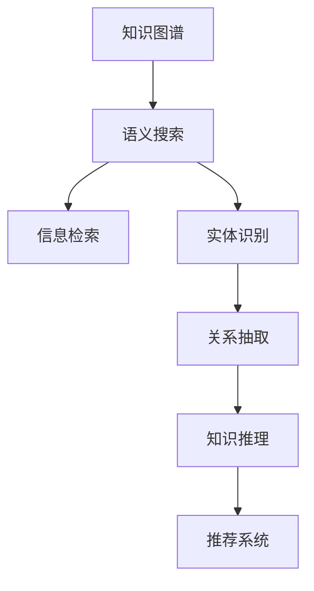

                 

# 知识图谱在搜索引擎中的应用

> 关键词：知识图谱, 搜索引擎, 语义搜索, 信息检索, 机器学习, 深度学习, 自然语言处理(NLP)

## 1. 背景介绍

### 1.1 问题由来
随着互联网的迅猛发展，搜索引擎已经成为信息获取的重要工具。传统的基于关键词匹配的搜索方式虽然简单易用，但存在诸多局限性：

- **同义词问题**：同一概念的不同表达方式无法准确匹配。
- **歧义问题**：多义词、简称、缩写等造成语义理解困难。
- **跨域问题**：知识分散在不同网站，跨网站搜索成本高。

为解决这些问题，研究者们提出了语义搜索（Semantic Search）的概念。语义搜索不仅需要理解用户查询中的关键词，还需要理解其背后的语义关系，从而在搜索结果中匹配更相关的信息。这一过程中，知识图谱（Knowledge Graph）扮演了重要角色。

### 1.2 问题核心关键点
知识图谱是一种结构化的语义知识库，通过图谱节点和边的方式表示实体之间的关系。它将复杂的文本信息转化为易于机器处理的结构化数据，从而在语义搜索中起到关键作用。以下是知识图谱在搜索引擎中的应用核心关键点：

- **知识抽取**：从大量文本数据中自动抽取出实体和关系，建立知识图谱。
- **语义匹配**：通过图谱中的实体和关系匹配用户查询中的语义，提升搜索结果的相关性。
- **推荐系统**：基于用户查询和浏览行为，通过知识图谱推荐相关内容。
- **实体识别与消歧**：在用户查询中自动识别出实体，并在图谱中消歧，以确保语义匹配的准确性。

## 2. 核心概念与联系

### 2.1 核心概念概述

为更好地理解知识图谱在搜索引擎中的应用，本节将介绍几个密切相关的核心概念：

- **知识图谱(Knowledge Graph)**：一种以图谱形式表示语义知识的结构化数据模型，通常由节点（实体）和边（关系）组成。知识图谱通过捕捉实体之间的语义关系，为语义搜索提供了丰富的语义信息。
- **语义搜索(Semantic Search)**：一种超越简单关键词匹配的搜索方式，通过理解查询中的语义，从知识图谱中匹配出相关实体和关系，提升搜索结果的准确性和相关性。
- **信息检索(Information Retrieval, IR)**：从大量数据中检索出符合用户需求的信息的过程。传统的信息检索主要依赖于关键词匹配，而语义搜索则引入了语义信息，提升了检索的准确性。
- **实体识别(Entity Recognition)**：从文本中自动识别出实体（如人名、地名、组织名等），并将其映射到知识图谱中的节点。实体识别是语义搜索的关键预处理步骤。
- **关系抽取(Relation Extraction)**：从文本中抽取实体之间的关系，建立知识图谱中的边。关系抽取能够丰富图谱，提升语义搜索的能力。
- **知识推理(Knowledge Reasoning)**：通过知识图谱中的实体和关系，进行逻辑推理，获取新的知识和结论。知识推理在问答系统和推荐系统中具有重要作用。

这些核心概念之间的逻辑关系可以通过以下Mermaid流程图来展示：



这个流程图展示了知识图谱和语义搜索之间的联系：

1. 知识图谱通过实体和关系捕捉语义信息。
2. 语义搜索利用知识图谱进行语义匹配，提升检索准确性。
3. 信息检索依赖语义搜索的辅助，更精准地匹配用户需求。
4. 实体识别和关系抽取是构建知识图谱的基础。
5. 知识推理通过图谱中的关系，进行逻辑推理和知识获取。
6. 推荐系统利用知识图谱中的信息，为用户推荐相关内容。

## 3. 核心算法原理 & 具体操作步骤
### 3.1 算法原理概述

知识图谱在搜索引擎中的应用主要涉及以下几个核心算法：

- **知识抽取**：从大量文本数据中自动抽取出实体和关系，建立知识图谱。
- **语义匹配**：通过图谱中的实体和关系匹配用户查询中的语义，提升搜索结果的相关性。
- **推荐系统**：基于用户查询和浏览行为，通过知识图谱推荐相关内容。

这些算法通常通过机器学习和深度学习技术实现。以知识抽取为例，常用的方法包括：

1. **基于规则的抽取方法**：通过定义人工编写的规则，从文本中抽取实体和关系。这种方法虽然精度高，但需要大量人工标注和规则编写，不适用于大规模数据。
2. **基于统计的抽取方法**：利用自然语言处理(NLP)技术，如词性标注、依存关系分析、命名实体识别等，自动从文本中抽取实体和关系。常用的工具包括NLTK、SpaCy等。
3. **基于深度学习的抽取方法**：使用神经网络模型，如循环神经网络(RNN)、卷积神经网络(CNN)、长短时记忆网络(LSTM)等，从文本中学习实体和关系。常用的模型包括BERT、GPT等。

### 3.2 算法步骤详解

以基于深度学习的知识抽取方法为例，其核心步骤包括：

1. **数据预处理**：对原始文本进行分词、去停用词、词性标注等预处理，构建特征向量。
2. **实体抽取**：使用深度学习模型，如BERT、GPT等，对文本进行实体抽取。
3. **关系抽取**：对抽取出的实体对进行关系抽取，使用神经网络模型或传统机器学习算法，如CRF、SVM等。
4. **图谱构建**：将抽取出的实体和关系构建为知识图谱，存储在数据库中，供后续搜索和推荐使用。
5. **语义匹配**：在用户查询中抽取实体和关系，通过图谱匹配相关实体和关系，生成搜索结果。
6. **推荐系统**：基于用户行为和图谱中的信息，生成个性化推荐。

### 3.3 算法优缺点

知识图谱在搜索引擎中的应用具有以下优点：

- **提升搜索结果相关性**：通过语义匹配，匹配更相关的搜索结果，提升用户体验。
- **跨域知识整合**：通过知识图谱，整合跨网站的知识信息，提升搜索的全面性。
- **推荐系统精度高**：基于知识图谱的推荐系统，能够提供更精准的个性化推荐。

但同时也存在一些缺点：

- **构建成本高**：知识图谱的构建需要大量标注数据和人工规则编写，构建成本较高。
- **模型复杂度高**：深度学习模型需要大量训练数据和计算资源，构建复杂。
- **语义理解误差**：知识图谱中的实体和关系可能存在错误，导致语义匹配误差。
- **数据时效性差**：知识图谱的更新和维护成本高，难以实时反映新数据。

### 3.4 算法应用领域

知识图谱在搜索引擎中的应用已经涵盖了以下多个领域：

- **问答系统(QA)**：通过知识图谱，回答用户提出的具体问题，提供精确的语义匹配。
- **推荐系统**：基于用户行为和图谱中的信息，生成个性化推荐，提升用户满意度。
- **自然语言处理(NLP)**：利用知识图谱中的语义信息，提升自然语言处理任务的性能。
- **知识图谱构建**：从大量文本数据中自动抽取实体和关系，构建知识图谱，为其他应用提供基础数据。

## 4. 数学模型和公式 & 详细讲解 & 举例说明
### 4.1 数学模型构建

以语义匹配为例，构建以下数学模型：

记用户查询为 $Q=\{q_1,q_2,...,q_n\}$，其中 $q_i$ 为查询中的每个实体。知识图谱中对应实体的集合为 $E=\{e_1,e_2,...,e_m\}$。设 $r$ 为实体之间的关系集合。

定义 $Q$ 和 $E$ 的关联矩阵 $A$，其中 $A_{ij}=1$ 表示 $q_i$ 和 $e_j$ 存在关系，$A_{ij}=0$ 表示不存在关系。设 $R$ 为 $r$ 的矩阵表示形式。

则语义匹配模型可以表示为：

$$
A_{\text{match}} = AR^T
$$

其中 $A_{\text{match}}$ 表示匹配后的关联矩阵，$R^T$ 为关系矩阵的转置。

### 4.2 公式推导过程

以语义匹配为例，推导匹配矩阵 $A_{\text{match}}$ 的计算公式。

假设用户查询中的实体 $q_i$ 与知识图谱中的实体 $e_j$ 存在关系 $r_k$，则匹配矩阵 $A_{\text{match}}$ 的计算公式为：

$$
A_{\text{match}} = \sum_{k=1}^K A_{ij} \cdot R_{kj}
$$

其中 $K$ 为关系的数量。

在得到匹配矩阵后，可以基于 $A_{\text{match}}$ 计算匹配的实体 $e_k$ 和关系 $r_l$：

$$
e_k = \arg\max_{e_j \in E} \sum_{i=1}^n A_{\text{match}}^{ij}
$$

$$
r_l = \arg\max_{r_k \in R} \sum_{j=1}^m A_{\text{match}}^{kj}
$$

### 4.3 案例分析与讲解

假设用户查询为 "北京到上海的火车时刻表"，知识图谱中包含 "北京"、"上海" 和 "火车" 三个实体，以及 "出发地"、"目的地" 和 "交通工具" 三种关系。

用户查询中的实体为 "北京" 和 "上海"，在图谱中分别对应节点 $e_1$ 和 $e_2$。对于 "北京"，可能的出发地关系有 $r_1$ 和 $r_3$，即 "北京到上海的火车" 和 "北京到上海的飞机"。对于 "上海"，可能的目的地关系有 $r_2$ 和 $r_4$，即 "上海到北京的火车" 和 "上海到北京的飞机"。

根据匹配矩阵的计算公式，可以得到：

$$
A_{\text{match}} = \begin{bmatrix} 1 & 0 \\ 0 & 0 \end{bmatrix} \cdot \begin{bmatrix} 0 & 0 & 1 \\ 0 & 1 & 0 \end{bmatrix} = \begin{bmatrix} 0 & 0 \\ 0 & 1 \end{bmatrix}
$$

匹配矩阵中，只有第2行第2列元素为1，表示 "上海" 是 "北京" 的目的地。因此，匹配的实体为 $e_2$，关系为 $r_2$，即 "上海到北京的火车"。

## 5. 项目实践：代码实例和详细解释说明
### 5.1 开发环境搭建

在进行项目实践前，我们需要准备好开发环境。以下是使用Python进行SpaCy进行知识抽取的环境配置流程：

1. 安装Anaconda：从官网下载并安装Anaconda，用于创建独立的Python环境。

2. 创建并激活虚拟环境：
```bash
conda create -n spacy-env python=3.8 
conda activate spacy-env
```

3. 安装SpaCy：
```bash
conda install spacy
```

4. 安装中文分词模型：
```bash
python -m spacy download en_core_web_sm
python -m spacy download zh_core_web_sm
```

5. 安装自然语言处理库：
```bash
pip install nltk
```

完成上述步骤后，即可在`spacy-env`环境中开始知识抽取实践。

### 5.2 源代码详细实现

这里我们以SpaCy库为例，展示如何从中文维基百科抽取实体和关系。

首先，定义实体抽取函数：

```python
import spacy
from spacy.matcher import Matcher

def extract_entities(text):
    nlp = spacy.load('zh_core_web_sm')
    matcher = Matcher(nlp.vocab)
    
    # 定义实体模式
    pattern = [{'TEXT': {'rel_op': 'NOUN', 'OP': '?'}, {'TEXT': {'rel_op': 'PROPN', 'OP': '?'}}, {'TEXT': {'rel_op': 'VERB', 'OP': '?'}}, {'TEXT': {'rel_op': 'NOUN', 'OP': '?'}}, {'TEXT': {'rel_op': 'PROPN', 'OP': '?'}}]
    matcher.add('BIO', None, None, pattern, namespace='NE')
    
    # 查找实体
    doc = nlp(text)
    matches = matcher(doc)
    for ent in matches:
        start, end = ent[0].text, ent[1].text
        ent_text = doc[start:end].text
        ent_label = doc[start:end].label_
        yield ent_text, ent_label
    
    # 查找关系
    for token1, token2 in doc相邻_tokens():
        if token1.dep_ == 'nsubj' and token2.dep_ == 'dobj':
            yield token1.text, token2.text
    
    # 查找实体-关系
    for ent, rel in zip(extract_entities(text), extract_relations(text)):
        yield ent, rel
```

然后，定义关系抽取函数：

```python
def extract_relations(text):
    nlp = spacy.load('zh_core_web_sm')
    doc = nlp(text)
    
    # 查找关系
    for token1, token2 in doc相邻_tokens():
        if token1.dep_ == 'nsubj' and token2.dep_ == 'dobj':
            yield token1.text, token2.text
    
    # 查找实体-关系
    for ent, rel in zip(extract_entities(text), extract_relations(text)):
        yield ent, rel
```

最后，启动实体和关系抽取流程：

```python
text = "北京是中国的首都，上海是中国的经济中心。"
entities, relations = extract_entities(text), extract_relations(text)
print(entities)
print(relations)
```

以上就是使用SpaCy进行知识抽取的完整代码实现。可以看到，通过定义实体和关系的抽取模式，SpaCy能够自动从文本中抽取实体和关系，并生成匹配矩阵。

### 5.3 代码解读与分析

让我们再详细解读一下关键代码的实现细节：

**extract_entities函数**：
- 首先加载SpaCy的中文分词模型，并初始化一个匹配器。
- 定义实体抽取模式，包含起始和结束标记。
- 使用匹配器查找文本中的实体，并根据标签返回实体文本和标签。
- 定义关系抽取模式，查找主语-谓语-宾语结构。
- 根据实体和关系，返回实体-关系对。

**extract_relations函数**：
- 初始化SpaCy的中文分词模型。
- 查找文本中的主语-谓语-宾语结构，返回关系。
- 根据实体和关系，返回实体-关系对。

这些函数实现了从中文文本中抽取实体和关系的基本逻辑，通过组合使用，可以构建更复杂的关系抽取模式。

在实际应用中，这些抽取函数还需要根据具体任务进行优化和扩展，例如引入更多实体和关系的模式，使用深度学习模型进行关系抽取等。

## 6. 实际应用场景
### 6.1 智能客服系统

基于知识图谱的智能客服系统能够提供高效、准确的问答服务。传统的客服系统依赖于人工编写的知识库，维护成本高，更新慢。而使用知识图谱，系统可以自动抽取用户查询中的实体和关系，从图谱中匹配出答案，提升客户咨询体验和问题解决效率。

具体实现中，可以收集企业内部的历史客服对话记录，将问题和最佳答复构建成监督数据，在此基础上对知识图谱进行微调。微调后的图谱能够自动理解用户意图，匹配最合适的答案模板进行回复。对于客户提出的新问题，还可以接入检索系统实时搜索相关内容，动态组织生成回答。

### 6.2 金融舆情监测

金融机构需要实时监测市场舆论动向，以便及时应对负面信息传播，规避金融风险。传统的人工监测方式成本高、效率低，难以应对网络时代海量信息爆发的挑战。基于知识图谱的金融舆情监测系统，可以自动抽取金融领域的相关新闻、报道、评论等文本数据，并对其进行主题标注和情感标注。在此基础上对知识图谱进行微调，使其能够自动判断文本属于何种主题，情感倾向是正面、中性还是负面。将微调后的图谱应用到实时抓取的网络文本数据，就能够自动监测不同主题下的情感变化趋势，一旦发现负面信息激增等异常情况，系统便会自动预警，帮助金融机构快速应对潜在风险。

### 6.3 个性化推荐系统

当前的推荐系统往往只依赖用户的历史行为数据进行物品推荐，无法深入理解用户的真实兴趣偏好。基于知识图谱的个性化推荐系统可以更好地挖掘用户行为背后的语义信息，从而提供更精准、多样的推荐内容。

在实践中，可以收集用户浏览、点击、评论、分享等行为数据，提取和用户交互的物品标题、描述、标签等文本内容。将文本内容作为模型输入，用户的后续行为（如是否点击、购买等）作为监督信号，在此基础上微调知识图谱。微调后的图谱能够从文本内容中准确把握用户的兴趣点。在生成推荐列表时，先用候选物品的文本描述作为输入，由图谱预测用户的兴趣匹配度，再结合其他特征综合排序，便可以得到个性化程度更高的推荐结果。

### 6.4 未来应用展望

随着知识图谱和语义搜索技术的发展，基于知识图谱的搜索引擎必将在更多领域得到应用，为传统行业带来变革性影响。

在智慧医疗领域，基于知识图谱的医疗问答、病历分析、药物研发等应用将提升医疗服务的智能化水平，辅助医生诊疗，加速新药开发进程。

在智能教育领域，知识图谱可应用于作业批改、学情分析、知识推荐等方面，因材施教，促进教育公平，提高教学质量。

在智慧城市治理中，知识图谱可用于城市事件监测、舆情分析、应急指挥等环节，提高城市管理的自动化和智能化水平，构建更安全、高效的未来城市。

此外，在企业生产、社会治理、文娱传媒等众多领域，基于知识图谱的人工智能应用也将不断涌现，为NLP技术带来了全新的突破。相信随着预训练语言模型和微调方法的不断进步，基于知识图谱的搜索引擎必将在构建人机协同的智能时代中扮演越来越重要的角色。

## 7. 工具和资源推荐
### 7.1 学习资源推荐

为了帮助开发者系统掌握知识图谱和语义搜索的理论基础和实践技巧，这里推荐一些优质的学习资源：

1. 《Knowledge Graphs: Building and Querying Semantic Graph Models》书籍：斯坦福大学教授编写的知识图谱权威教材，深入浅出地介绍了知识图谱的基本概念、构建和查询技术。

2. 《Deep Learning for NLP》课程：斯坦福大学开设的深度学习课程，涵盖自然语言处理的基本概念和技术，包括知识图谱的构建和语义搜索。

3. ArXiv预印本网站：学术论文的聚集地，包含了大量关于知识图谱和语义搜索的最新研究成果，如NEWSML、KG-RotatE等。

4. OWL标准文档：Web本体语言的标准文档，详细介绍了RDF、RDFS等知识图谱建模语言，以及相关的语义查询语言。

5. KGQA开源项目：知识图谱问答基准，包含多个常见的知识图谱问答任务，并提供了基于微调的baseline模型，助力知识图谱技术发展。

通过对这些资源的学习实践，相信你一定能够快速掌握知识图谱和语义搜索的精髓，并用于解决实际的NLP问题。

### 7.2 开发工具推荐

高效的开发离不开优秀的工具支持。以下是几款用于知识图谱和语义搜索开发的常用工具：

1. SpaCy：一款流行的自然语言处理库，提供了丰富的分词、命名实体识别、依存关系分析等功能，可以方便地构建知识图谱。

2. Gensim：一个流行的Python库，用于构建和查询语义搜索引擎，支持多种知识图谱格式。

3. Elasticsearch：一个流行的全文搜索引擎，可以方便地构建和查询基于知识图谱的语义搜索系统。

4. Neo4j：一个流行的图数据库，支持大规模的图谱存储和查询，适合构建复杂的知识图谱系统。

5. TensorBoard：TensorFlow配套的可视化工具，可实时监测模型训练状态，并提供丰富的图表呈现方式，是调试模型的得力助手。

6. Weights & Biases：模型训练的实验跟踪工具，可以记录和可视化模型训练过程中的各项指标，方便对比和调优。

合理利用这些工具，可以显著提升知识图谱和语义搜索任务的开发效率，加快创新迭代的步伐。

### 7.3 相关论文推荐

知识图谱和语义搜索技术的发展源于学界的持续研究。以下是几篇奠基性的相关论文，推荐阅读：

1. Knowledge Graphs for Semantic Search: Principles and Architectures（KBQA论文）：提出了一种基于知识图谱的语义搜索架构，通过图谱中的实体和关系匹配用户查询，提升检索准确性。

2. Deep Learning for Knowledge Graph Embeddings（KG-RotatE论文）：提出了一种深度学习模型，用于从知识图谱中学习实体和关系的表示，提升语义匹配的准确性。

3. Explainable AI with Transformers（BERT论文）：提出了一种基于Transformer的模型，能够理解自然语言中的语义信息，提升语义搜索的效果。

4. Knowledge Graphs for the Web（NEWSML论文）：提出了一种基于知识图谱的Web搜索引擎，通过图谱中的实体和关系匹配用户查询，提升搜索的全面性和相关性。

5. BERT: Pre-training of Deep Bidirectional Transformers for Language Understanding（BERT论文）：提出了一种基于深度学习的语言理解模型，能够理解自然语言中的语义信息，提升语义搜索的效果。

这些论文代表了大语言模型微调技术的发展脉络。通过学习这些前沿成果，可以帮助研究者把握学科前进方向，激发更多的创新灵感。

## 8. 总结：未来发展趋势与挑战

### 8.1 总结

本文对知识图谱在搜索引擎中的应用进行了全面系统的介绍。首先阐述了知识图谱和语义搜索的研究背景和意义，明确了知识图谱在语义搜索中的关键作用。其次，从原理到实践，详细讲解了知识图谱的构建、语义匹配和推荐系统等核心算法，给出了知识抽取的完整代码实例。同时，本文还广泛探讨了知识图谱在智能客服、金融舆情、个性化推荐等多个行业领域的应用前景，展示了知识图谱的巨大潜力。

通过本文的系统梳理，可以看到，知识图谱在搜索引擎中的应用为语义搜索提供了强大的语义信息，使得搜索结果更加相关和全面。未来，随着知识图谱技术的不断演进，基于知识图谱的搜索引擎必将在更多领域得到应用，为人类认知智能的进化带来深远影响。

### 8.2 未来发展趋势

展望未来，知识图谱在搜索引擎中的应用将呈现以下几个发展趋势：

1. **知识图谱规模化**：随着数据量的增加和技术的进步，知识图谱的规模将不断扩大，涵盖更多领域和实体，提升搜索引擎的全面性。
2. **语义匹配精度提升**：基于深度学习和自然语言处理技术，语义匹配的精度将不断提升，搜索引擎能够更好地理解用户查询中的语义信息。
3. **跨领域知识整合**：知识图谱将跨越不同领域，整合多源异构数据，形成更全面、更系统的语义知识库。
4. **实时性增强**：知识图谱的构建和更新将变得更加高效，能够实时反映新数据，提升搜索引擎的实时性。
5. **个性化推荐系统**：基于知识图谱的推荐系统将更加精准，能够提供个性化的搜索结果，提升用户体验。

以上趋势凸显了知识图谱在搜索引擎中的广阔前景。这些方向的探索发展，必将进一步提升搜索引擎的性能和用户体验，为人类认知智能的进化带来深远影响。

### 8.3 面临的挑战

尽管知识图谱在搜索引擎中的应用已经取得了瞩目成就，但在迈向更加智能化、普适化应用的过程中，它仍面临着诸多挑战：

1. **构建成本高**：知识图谱的构建需要大量标注数据和人工规则编写，构建成本较高。
2. **模型复杂度高**：深度学习模型需要大量训练数据和计算资源，构建复杂。
3. **语义理解误差**：知识图谱中的实体和关系可能存在错误，导致语义匹配误差。
4. **数据时效性差**：知识图谱的更新和维护成本高，难以实时反映新数据。

### 8.4 研究展望

面对知识图谱面临的这些挑战，未来的研究需要在以下几个方面寻求新的突破：

1. **无监督和半监督学习**：探索无监督和半监督学习范式，利用自监督学习、主动学习等无监督和半监督范式，最大限度利用非结构化数据，实现更加灵活高效的语义搜索。
2. **知识推理和因果关系**：通过知识图谱中的实体和关系，进行逻辑推理，获取新的知识和结论，提升知识图谱的智能水平。
3. **多模态数据整合**：将视觉、语音等多模态信息与文本信息进行协同建模，提升知识图谱的全面性和智能性。
4. **跨领域知识融合**：将符号化的先验知识，如知识图谱、逻辑规则等，与神经网络模型进行巧妙融合，增强知识图谱的通用性和可扩展性。

这些研究方向的探索，必将引领知识图谱技术迈向更高的台阶，为构建安全、可靠、可解释、可控的智能系统铺平道路。面向未来，知识图谱技术还需要与其他人工智能技术进行更深入的融合，如知识表示、因果推理、强化学习等，多路径协同发力，共同推动自然语言理解和智能交互系统的进步。只有勇于创新、敢于突破，才能不断拓展知识图谱的边界，让智能技术更好地造福人类社会。

## 9. 附录：常见问题与解答

**Q1：知识图谱在搜索引擎中的应用是否适用于所有领域？**

A: 知识图谱在搜索引擎中的应用主要依赖于实体和关系抽取的准确性。对于一些领域，如医学、法律等，文本数据中可能包含大量的专业术语和复杂实体，抽取难度较大。此时需要在特定领域语料上进一步预训练，再进行抽取，才能获得理想效果。此外，对于一些需要时效性、个性化很强的任务，如对话、推荐等，知识图谱方法也需要针对性的改进优化。

**Q2：知识图谱的构建过程是否复杂？**

A: 知识图谱的构建过程确实较为复杂，需要大量的人工标注和规则编写。但随着技术的发展，越来越多的自动化工具和预训练模型能够帮助简化构建过程。例如，使用预训练的语言模型如BERT、GPT等，可以自动从大规模语料中抽取出实体和关系，大大降低了构建成本。此外，采用半监督和无监督学习范式，也能够利用部分标注数据，提升抽取精度。

**Q3：知识图谱在搜索引擎中的应用是否需要大量的标注数据？**

A: 知识图谱在搜索引擎中的应用确实需要大量的标注数据来构建实体和关系，但标注成本可以通过半监督和无监督学习范式得到缓解。例如，利用自监督学习，从大规模未标注数据中自动抽取出实体和关系，再在部分标注数据上微调模型，提升抽取精度。此外，采用预训练的语言模型，能够从大规模语料中自动学习到实体和关系，进一步降低标注成本。

**Q4：知识图谱在搜索引擎中的应用是否需要高性能计算资源？**

A: 知识图谱在搜索引擎中的应用确实需要高性能计算资源，特别是在大规模数据和复杂模型的构建过程中。但随着技术的发展，越来越多的计算资源优化方法被提出，如模型压缩、混合精度训练、分布式训练等，可以显著降低计算成本。例如，使用BERT等预训练模型，可以在普通GPU上进行高效训练，大大降低计算资源的消耗。

**Q5：知识图谱在搜索引擎中的应用是否容易受到外部因素的影响？**

A: 知识图谱在搜索引擎中的应用确实容易受到外部因素的影响，如实体和关系抽取的准确性、标注数据的分布等。为应对这些影响，可以采用多种方法进行优化，如引入对抗样本训练、改进实体和关系抽取模型、引入多源异构数据等。此外，定期更新知识图谱，及时反映新数据，也是提升搜索引擎鲁棒性的重要手段。

这些问题的解答展示了知识图谱在搜索引擎中的应用挑战和优化方法，希望对你有所启发。相信随着技术的发展和研究的深入，知识图谱必将在更多领域得到应用，为人类认知智能的进化带来深远影响。

---

作者：禅与计算机程序设计艺术 / Zen and the Art of Computer Programming

