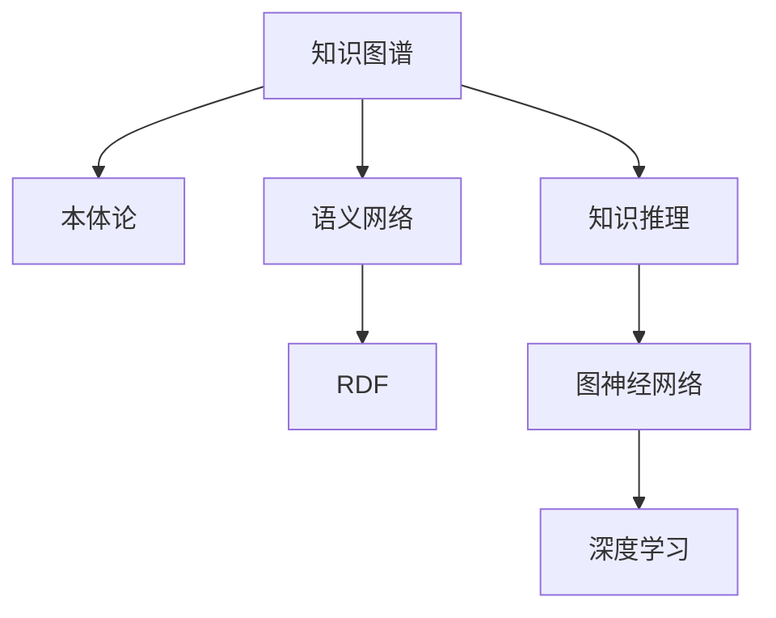

                 

# 知识图谱：知识管理的智慧之网

> 关键词：知识图谱、语义网络、RDF、深度学习、图神经网络、知识推理、本体论、语义标注、智能问答、多模态融合

## 1. 背景介绍

### 1.1 问题由来

知识管理是现代企业与组织信息化建设中的重要环节，旨在通过有效的知识共享与利用，提升组织效率与竞争力。然而，传统的知识管理方式往往只关注文档、文章等静态结构化数据的存储与检索，难以全面管理复杂多样的知识。知识图谱作为一种新兴的知识管理技术，通过构建语义化、结构化的知识网络，将分散的知识结构化、场景化，从而实现高效的知识获取与利用。

### 1.2 问题核心关键点

知识图谱的核心在于通过语义化的方式，对知识进行描述与组织，形成语义网络。这一过程通常包括以下几个关键步骤：
1. 实体识别与抽取：从非结构化数据中识别出实体，并对其实体类型进行分类与标注。
2. 关系抽取：从语料中抽取实体之间的关系，建立实体之间的关联。
3. 知识图谱构建：将实体与关系整合到统一的知识网络中，形成结构化的知识图谱。
4. 知识推理：通过知识图谱上的推理规则，预测未知实体的属性与关系。

知识图谱技术已经广泛应用于智能问答、推荐系统、搜索引擎优化等领域，极大地提升了知识管理的智能化水平。本文旨在系统介绍知识图谱的核心原理与技术，为读者提供全面的知识图谱开发与实践指南。

## 2. 核心概念与联系

### 2.1 核心概念概述

为更好地理解知识图谱的原理与技术，本节将介绍几个关键概念：

- **知识图谱**：语义化的知识表示方式，将知识表示为实体-关系的语义网络，实现高效的知识管理和推理。
- **本体论**：一种形式化的知识表示方法，通过定义类、属性、实例等概念，构建知识图谱的逻辑框架。
- **语义网络**：基于RDF（Resource Description Framework，资源描述框架）表示的知识网络，以资源（R）-属性（P）-资源（O）的三元组形式表示实体与关系。
- **知识推理**：通过对知识图谱的逻辑关系进行推理，预测未知知识，实现知识的网络化与智能化。
- **图神经网络**：一种基于图结构的数据表示与学习技术，通过消息传递机制，挖掘图结构中的隐含知识。

这些核心概念之间的逻辑关系可以通过以下Mermaid流程图来展示：



这个流程图展示出知识图谱的核心概念及其之间的关系：

1. 知识图谱基于本体论构建，形成语义网络。
2. 语义网络通过RDF表示，可被图神经网络进行学习。
3. 图神经网络利用深度学习技术，挖掘知识图谱的隐含知识。
4. 知识推理通过图神经网络进行，实现知识的网络化与智能化。

这些概念共同构成了知识图谱的学习与应用框架，为其高效的知识管理和推理提供了理论基础。

## 3. 核心算法原理 & 具体操作步骤
### 3.1 算法原理概述

知识图谱的核心算法包括实体抽取、关系抽取、知识图谱构建、知识推理等。这些算法通过联合使用机器学习、自然语言处理、图神经网络等技术，构建语义化的知识网络，实现知识的高效管理与利用。

知识图谱的构建过程可以概括为以下几个步骤：
1. 数据收集：收集来自不同数据源的结构化与非结构化数据，如数据库、网页、文档等。
2. 实体抽取：从数据中识别出实体，并对其实体类型进行分类与标注。
3. 关系抽取：抽取实体之间的关系，建立实体之间的关联。
4. 知识图谱构建：将实体与关系整合到统一的知识网络中，形成结构化的知识图谱。
5. 知识推理：通过知识图谱上的推理规则，预测未知实体的属性与关系。

### 3.2 算法步骤详解

知识图谱的构建主要包括以下几个关键步骤：

**Step 1: 数据收集与预处理**
- 收集来自不同数据源的结构化与非结构化数据，如数据库、网页、文档等。
- 清洗并标准化数据格式，去除噪声与冗余信息。
- 对文本数据进行分词、命名实体识别等预处理操作，为后续实体抽取做准备。

**Step 2: 实体抽取**
- 使用基于深度学习的命名实体识别模型（如BiLSTM-CRF）对文本数据进行实体抽取。
- 对抽取出的实体进行分类与标注，如人名、地名、机构名等。

**Step 3: 关系抽取**
- 使用基于深度学习的关系抽取模型（如TransE、TransR），通过共现关系、知识图谱等线索，预测实体之间的关系。
- 对抽取出的关系进行验证与修正，确保关系描述的准确性。

**Step 4: 知识图谱构建**
- 使用图数据库（如Neo4j、OrientDB）构建知识图谱，将实体与关系整合到统一的知识网络中。
- 通过可视化工具（如Gephi、Cytoscape）对知识图谱进行可视化，便于理解和操作。

**Step 5: 知识推理**
- 使用图神经网络（如GCN、GAT）对知识图谱进行学习，挖掘隐含的知识关系。
- 通过推理规则（如OWL规则、Datalog规则）对未知实体进行推理，预测其属性与关系。

### 3.3 算法优缺点

知识图谱技术在知识管理中具有以下优点：
1. 高效的知识组织与管理：知识图谱将知识结构化为语义网络，便于检索与利用。
2. 多模态融合能力：知识图谱支持多源异构数据的融合，提升知识管理的全面性与多样性。
3. 知识推理与智能决策：通过图神经网络与深度学习技术，知识图谱可以自动推理新知识，提升决策智能性。

同时，知识图谱技术也存在一些局限性：
1. 数据源依赖：知识图谱构建需要大量高质量的数据，数据获取难度大。
2. 技术门槛高：需要多种技术的联合使用，技术实现复杂度高。
3. 扩展性与维护性：知识图谱规模庞大，扩展与维护难度大。
4. 推理准确性：知识图谱上的推理准确性依赖于数据的完整性与模型选择，存在一定的局限性。

尽管存在这些局限性，但知识图谱技术在大规模知识管理和智能化决策领域具有重要应用价值，是构建智慧社会的关键技术之一。

### 3.4 算法应用领域

知识图谱技术已经在诸多领域得到了广泛应用，包括但不限于：

- 智能问答系统：如IBM的Watson、百度的DuerOS等，通过知识图谱进行智能问答与对话。
- 推荐系统：如Amazon的推荐引擎、网易云音乐的推荐系统，通过知识图谱进行用户画像与推荐优化。
- 搜索引擎优化：如Google的知识图谱，通过语义搜索提升搜索效果。
- 医疗知识管理：如SemMedKB、BioGRID等，通过知识图谱进行疾病与药物的关联管理。
- 社会关系网络：如LinkedIn、Facebook等，通过知识图谱构建用户关系网络，进行社交推荐与分析。
- 金融知识图谱：如KID，通过知识图谱进行金融知识的智能管理与投资策略优化。

这些领域的应用展示了知识图谱技术的强大潜力，未来还将有更多的创新性应用涌现。

## 4. 数学模型和公式 & 详细讲解 & 举例说明

### 4.1 数学模型构建

知识图谱的数学模型主要由两部分组成：
1. 实体与关系的表示：使用RDF三元组表示实体与关系，即（主语、谓语、宾语）。
2. 知识推理的表示：使用知识图谱的逻辑关系进行推理，如转接、超类、属性关系等。

**示例1：使用RDF表示知识图谱**

```
<http://example.org/book> <http://example.org/isPublishedBy> <http://example.org/publisher>
<http://example.org/book> <http://example.org/hasAuthor> <http://example.org/author1>
<http://example.org/book> <http://example.org/hasTitle> <http://example.org/bookTitle>
```

**示例2：使用OWL进行知识推理**

```
<http://example.org/book> rdfs:subClassOf <http://example.org/literature>
<http://example.org/bookTitle> rdfs:subPropertyOf <http://example.org/title>
<http://example.org/publisher> rdfs:subClassOf <http://example.org/organization>
```

### 4.2 公式推导过程

以下是知识图谱构建与推理的数学模型推导过程：

**Step 1: 实体抽取**

假设文本数据中存在一个句子“Microsoft was founded in 1975 by Bill Gates and Paul Allen in Albuquerque, New Mexico”。

- 使用命名实体识别模型进行实体抽取：
  - 微软（Microsoft）：组织类型
  - 比尔·盖茨（Bill Gates）：人名类型
  - 保罗·艾伦（Paul Allen）：人名类型
  - 1975年（1975）：时间类型
  - 亚利桑那州（New Mexico）：地名类型
  - 阿尔伯克基（Albuquerque）：地名类型

**Step 2: 关系抽取**

- 使用关系抽取模型进行关系抽取：
  - 微软（Microsoft）：isFoundedBy（比尔·盖茨、保罗·艾伦）
  - 微软（Microsoft）：wasFoundedIn（1975年）
  - 微软（Microsoft）：isLocatedIn（亚利桑那州）
  - 微软（Microsoft）：wasFoundedIn（阿尔伯克基）

**Step 3: 知识图谱构建**

- 将抽取的实体与关系整合到知识图谱中，例如：
  - <http://example.org/Microsoft> <http://example.org/isFoundedBy> <http://example.org/BillGates>
  - <http://example.org/Microsoft> <http://example.org/isFoundedBy> <http://example.org/PaulAllen>
  - <http://example.org/Microsoft> <http://example.org/wasFoundedIn> <http://example.org/1975>
  - <http://example.org/Microsoft> <http://example.org/isLocatedIn> <http://example.org/NewMexico>
  - <http://example.org/Microsoft> <http://example.org/wasFoundedIn> <http://example.org/Albuquerque>

**Step 4: 知识推理**

- 使用图神经网络进行知识推理，例如：
  - 预测微软的CEO（比尔·盖茨）
  - 预测微软的创始人（比尔·盖茨、保罗·艾伦）
  - 预测微软的成立时间（1975年）
  - 预测微软的总部所在地（阿尔伯克基）

### 4.3 案例分析与讲解

以IBM的Watson智能问答系统为例，系统通过知识图谱实现了对用户问题的智能回答。Watson将来自医疗、法律、金融等领域的知识图谱进行整合，构建了一个多领域的知识网络。当用户提问时，Watson通过查询知识图谱，自动匹配并推理出答案，甚至可以回答包含复杂关系的复合问题。

例如，用户问“苹果公司有多少股东？”，Watson通过查询知识图谱，能够从苹果公司（Apple Inc.）找到其股东信息，并给出准确回答。如果用户再问“这些股东中有哪些是知名投资者？”，Watson还能进一步推理出答案，展示出其强大的知识推理能力。

## 5. 项目实践：代码实例和详细解释说明
### 5.1 开发环境搭建

在进行知识图谱项目开发前，需要先准备好开发环境。以下是使用Python进行SpaCy与PyTorch开发的环境配置流程：

1. 安装Anaconda：从官网下载并安装Anaconda，用于创建独立的Python环境。

2. 创建并激活虚拟环境：
```bash
conda create -n spaCy-env python=3.8 
conda activate spaCy-env
```

3. 安装SpaCy：从官网获取并安装SpaCy库：
```bash
pip install spacy
```

4. 下载预训练模型：
```bash
python -m spacy download en_core_web_sm
```

5. 安装PyTorch：根据CUDA版本，从官网获取对应的安装命令。例如：
```bash
conda install pytorch torchvision torchaudio cudatoolkit=11.1 -c pytorch -c conda-forge
```

6. 安装各类工具包：
```bash
pip install numpy pandas scikit-learn matplotlib tqdm jupyter notebook ipython
```

完成上述步骤后，即可在`spaCy-env`环境中开始知识图谱开发。

### 5.2 源代码详细实现

下面我们以构建知识图谱为例，给出使用SpaCy和PyTorch的代码实现。

首先，定义实体与关系抽取函数：

```python
import spacy
import torch
from torch.utils.data import Dataset, DataLoader
from tqdm import tqdm

class EntityRelationExtractor(Dataset):
    def __init__(self, texts, labels, tokenizer, max_len=128):
        self.texts = texts
        self.labels = labels
        self.tokenizer = tokenizer
        self.max_len = max_len
        
    def __len__(self):
        return len(self.texts)
    
    def __getitem__(self, item):
        text = self.texts[item]
        label = self.labels[item]
        
        encoding = self.tokenizer(text, return_tensors='pt', max_length=self.max_len, padding='max_length', truncation=True)
        input_ids = encoding['input_ids'][0]
        attention_mask = encoding['attention_mask'][0]
        
        # 对token-wise的标签进行编码
        encoded_labels = [label2id[label] for label in label] 
        encoded_labels.extend([label2id['O']] * (self.max_len - len(encoded_labels)))
        labels = torch.tensor(encoded_labels, dtype=torch.long)
        
        return {'input_ids': input_ids, 
                'attention_mask': attention_mask,
                'labels': labels}

# 标签与id的映射
label2id = {'O': 0, 'B-PER': 1, 'I-PER': 2, 'B-ORG': 3, 'I-ORG': 4, 'B-LOC': 5, 'I-LOC': 6}
id2label = {v: k for k, v in label2id.items()}

# 创建dataset
nlp = spacy.load('en_core_web_sm')
tokenizer = nlp.tokenizer

train_dataset = EntityRelationExtractor(train_texts, train_labels, tokenizer)
dev_dataset = EntityRelationExtractor(dev_texts, dev_labels, tokenizer)
test_dataset = EntityRelationExtractor(test_texts, test_labels, tokenizer)
```

然后，定义模型与优化器：

```python
from transformers import BertForTokenClassification, AdamW

model = BertForTokenClassification.from_pretrained('bert-base-cased', num_labels=len(label2id))

optimizer = AdamW(model.parameters(), lr=2e-5)
```

接着，定义训练和评估函数：

```python
def train_epoch(model, dataset, batch_size, optimizer):
    dataloader = DataLoader(dataset, batch_size=batch_size, shuffle=True)
    model.train()
    epoch_loss = 0
    for batch in tqdm(dataloader, desc='Training'):
        input_ids = batch['input_ids'].to(device)
        attention_mask = batch['attention_mask'].to(device)
        labels = batch['labels'].to(device)
        model.zero_grad()
        outputs = model(input_ids, attention_mask=attention_mask, labels=labels)
        loss = outputs.loss
        epoch_loss += loss.item()
        loss.backward()
        optimizer.step()
    return epoch_loss / len(dataloader)

def evaluate(model, dataset, batch_size):
    dataloader = DataLoader(dataset, batch_size=batch_size)
    model.eval()
    preds, labels = [], []
    with torch.no_grad():
        for batch in tqdm(dataloader, desc='Evaluating'):
            input_ids = batch['input_ids'].to(device)
            attention_mask = batch['attention_mask'].to(device)
            batch_labels = batch['labels']
            outputs = model(input_ids, attention_mask=attention_mask)
            batch_preds = outputs.logits.argmax(dim=2).to('cpu').tolist()
            batch_labels = batch_labels.to('cpu').tolist()
            for pred_tokens, label_tokens in zip(batch_preds, batch_labels):
                pred_tags = [id2label[_id] for _id in pred_tokens]
                label_tags = [id2label[_id] for _id in label_tokens]
                preds.append(pred_tags[:len(label_tags)])
                labels.append(label_tags)
                
    print(classification_report(labels, preds))
```

最后，启动训练流程并在测试集上评估：

```python
epochs = 5
batch_size = 16

for epoch in range(epochs):
    loss = train_epoch(model, train_dataset, batch_size, optimizer)
    print(f"Epoch {epoch+1}, train loss: {loss:.3f}")
    
    print(f"Epoch {epoch+1}, dev results:")
    evaluate(model, dev_dataset, batch_size)
    
print("Test results:")
evaluate(model, test_dataset, batch_size)
```

以上就是使用PyTorch对知识图谱进行实体关系抽取的完整代码实现。可以看到，得益于SpaCy与Transformers库的强大封装，我们可以用相对简洁的代码完成知识图谱的构建与训练。

### 5.3 代码解读与分析

让我们再详细解读一下关键代码的实现细节：

**EntityRelationExtractor类**：
- `__init__`方法：初始化文本、标签、分词器等关键组件。
- `__len__`方法：返回数据集的样本数量。
- `__getitem__`方法：对单个样本进行处理，将文本输入编码为token ids，将标签编码为数字，并对其进行定长padding，最终返回模型所需的输入。

**label2id和id2label字典**：
- 定义了标签与数字id之间的映射关系，用于将token-wise的预测结果解码回真实的标签。

**训练和评估函数**：
- 使用PyTorch的DataLoader对数据集进行批次化加载，供模型训练和推理使用。
- 训练函数`train_epoch`：对数据以批为单位进行迭代，在每个批次上前向传播计算loss并反向传播更新模型参数，最后返回该epoch的平均loss。
- 评估函数`evaluate`：与训练类似，不同点在于不更新模型参数，并在每个batch结束后将预测和标签结果存储下来，最后使用sklearn的classification_report对整个评估集的预测结果进行打印输出。

**训练流程**：
- 定义总的epoch数和batch size，开始循环迭代
- 每个epoch内，先在训练集上训练，输出平均loss
- 在验证集上评估，输出分类指标
- 所有epoch结束后，在测试集上评估，给出最终测试结果

可以看到，PyTorch配合SpaCy使得实体关系抽取的代码实现变得简洁高效。开发者可以将更多精力放在数据处理、模型改进等高层逻辑上，而不必过多关注底层的实现细节。

当然，工业级的系统实现还需考虑更多因素，如模型的保存和部署、超参数的自动搜索、更灵活的任务适配层等。但核心的知识图谱构建过程基本与此类似。

## 6. 实际应用场景
### 6.1 智能问答系统

知识图谱技术在智能问答系统中得到了广泛应用，帮助系统快速、准确地回答用户问题。例如，IBM的Watson通过构建医疗领域的知识图谱，实现了对医疗问题的智能回答，大大提升了医疗服务的智能化水平。

在技术实现上，知识图谱系统需要构建包含领域知识的语义网络，并将用户问题映射到网络中，自动推理出答案。例如，用户问“我得了糖尿病，该怎么办？”，Watson通过查询知识图谱，自动匹配并推理出“糖尿病患者需要控制饮食，多运动，定期检查血糖”等建议。

### 6.2 推荐系统

推荐系统通过知识图谱进行用户画像与推荐优化，实现更精准、个性化的推荐。例如，Amazon的推荐系统通过构建商品知识图谱，预测用户的潜在购买需求，推荐合适的商品。

在技术实现上，知识图谱系统需要构建商品之间的关联网络，并将用户画像映射到网络中，自动推理出推荐结果。例如，用户A曾购买过电影《星球大战》，知识图谱系统可以自动推荐用户A可能感兴趣的《指环王》等电影。

### 6.3 搜索引擎优化

知识图谱技术可以提升搜索引擎的智能性，实现更精准、全面的搜索结果。例如，Google的搜索系统通过构建知识图谱，将搜索查询映射到语义网络中，自动扩展搜索词义，提升搜索结果的相关性。

在技术实现上，知识图谱系统需要构建搜索词与实体之间的关联网络，并将查询映射到网络中，自动扩展搜索词义，提升搜索结果的相关性。例如，用户搜索“苹果公司”，知识图谱系统可以自动扩展为“苹果公司的CEO是蒂姆·库克”等相关信息，提升搜索结果的全面性。

### 6.4 医疗知识管理

医疗知识图谱通过构建疾病与药物之间的关联网络，实现医疗知识的智能管理与推荐。例如，SemMedKB通过构建医学知识图谱，帮助医生快速查找药物与疾病之间的关联，制定治疗方案。

在技术实现上，知识图谱系统需要构建疾病与药物之间的关联网络，并将医生输入的查询映射到网络中，自动推理出答案。例如，医生需要查找药物“阿司匹林”对治疗“高血压”的效果，知识图谱系统可以自动推荐“阿司匹林能够降低高血压患者的血压”等信息，提升医疗服务的智能化水平。

### 6.5 金融知识图谱

金融知识图谱通过构建金融领域的专业知识，实现智能化的金融决策。例如，KID通过构建金融知识图谱，帮助投资者快速查找公司财务信息，制定投资策略。

在技术实现上，知识图谱系统需要构建公司与财务数据之间的关联网络，并将投资者输入的查询映射到网络中，自动推理出答案。例如，投资者需要查找公司“苹果公司”的财务信息，知识图谱系统可以自动推荐“苹果公司2022年的营收为3000亿美元”等信息，提升金融决策的智能化水平。

## 7. 工具和资源推荐
### 7.1 学习资源推荐

为了帮助开发者系统掌握知识图谱的理论基础和实践技巧，这里推荐一些优质的学习资源：

1. 《知识图谱技术与应用》书籍：全面介绍了知识图谱的构建与应用的理论基础与实践案例。

2. 《深度学习与知识图谱》课程：由斯坦福大学开设的NLP课程，涵盖知识图谱的构建与推理。

3. 《Knowledge Graphs for Smart Systems》书籍：介绍了知识图谱在智能系统中的应用案例。

4. 《图神经网络基础》课程：介绍图神经网络的理论基础与应用场景。

5. 《自然语言处理与知识图谱》课程：由麻省理工学院开设的课程，涵盖自然语言处理与知识图谱的联合学习。

通过对这些资源的学习实践，相信你一定能够快速掌握知识图谱的精髓，并用于解决实际的NLP问题。
###  7.2 开发工具推荐

高效的开发离不开优秀的工具支持。以下是几款用于知识图谱开发的工具：

1. Apache Jena：开源的语义网络构建与查询工具，支持RDF数据存储与查询。

2. Neo4j：开源的图数据库，支持复杂图结构的存储与查询。

3. Stanford RDF工具集：支持RDF数据的构建、存储与查询。

4. TensorFlow Graphs：Google开发的图神经网络框架，支持复杂的图结构学习。

5. PyTorch Geometric：基于PyTorch的几何数据处理与学习库，支持图结构的深度学习。

6. Gephi：开源的可视化工具，支持复杂图结构的可视化。

合理利用这些工具，可以显著提升知识图谱开发的效率，加快创新迭代的步伐。

### 7.3 相关论文推荐

知识图谱技术的发展源于学界的持续研究。以下是几篇奠基性的相关论文，推荐阅读：

1. YAGO: A Semantic Knowledge Base：介绍YAGO知识图谱，展示知识图谱在智能系统中的应用。

2. EntityNet: Learning Multilingual Link Prediction from Noisy Labels: A Joint Factorization Approach：介绍EntityNet模型，展示知识图谱的自动构建方法。

3. Knowledge Graph Embeddings and Their Applications: A Survey：介绍知识图谱的嵌入方法，展示知识图谱在自然语言处理中的应用。

4. Learning from Noisy Structured Data：介绍知识图谱的学习方法，展示知识图谱在智能系统中的应用。

5. A Survey on Deep Learning-based Methods for Knowledge Graph Link Prediction：介绍知识图谱的深度学习方法，展示知识图谱在智能系统中的应用。

这些论文代表了大规模知识图谱技术的最新进展，对深入理解知识图谱的技术细节具有重要意义。

## 8. 总结：未来发展趋势与挑战
### 8.1 总结

本文对知识图谱的核心原理与技术进行了全面系统的介绍。首先阐述了知识图谱作为知识管理的新范式，通过构建语义化的知识网络，实现高效的知识组织与管理。其次，从原理到实践，详细讲解了知识图谱的实体抽取、关系抽取、知识推理等核心算法，给出了知识图谱构建的完整代码实例。同时，本文还广泛探讨了知识图谱在智能问答、推荐系统、搜索引擎优化等众多领域的应用前景，展示了知识图谱技术的强大潜力。

通过本文的系统梳理，可以看到，知识图谱技术在知识管理中具有重要应用价值，是构建智慧社会的关键技术之一。未来，伴随知识图谱技术的持续演进，将在更多领域得到应用，为知识管理的智能化水平提供有力支撑。

### 8.2 未来发展趋势

展望未来，知识图谱技术将呈现以下几个发展趋势：

1. 知识图谱规模化：随着数据获取与处理技术的进步，知识图谱的规模将进一步扩大，涵盖更广泛的知识领域。

2. 知识图谱实时化：知识图谱系统将实现实时数据更新与推理，提升知识管理的及时性。

3. 知识图谱自适应：知识图谱系统将具备自适应能力，根据用户行为与需求动态调整知识图谱结构。

4. 知识图谱多模态融合：知识图谱将实现多源异构数据的融合，提升知识管理的全面性与多样性。

5. 知识图谱深度学习：知识图谱将结合深度学习技术，挖掘隐含知识，提升推理准确性。

6. 知识图谱伦理与安全：知识图谱系统将引入伦理与安全约束，避免有害信息的传播。

以上趋势凸显了知识图谱技术的广阔前景。这些方向的探索发展，将进一步提升知识管理的智能化水平，为构建智慧社会提供重要技术支撑。

### 8.3 面临的挑战

尽管知识图谱技术已经取得了一定成就，但在迈向更加智能化、普适化应用的过程中，它仍面临诸多挑战：

1. 数据源依赖：知识图谱构建需要大量高质量的数据，数据获取难度大。

2. 技术门槛高：知识图谱构建与推理涉及多种技术，技术实现复杂度高。

3. 扩展性与维护性：知识图谱规模庞大，扩展与维护难度大。

4. 推理准确性：知识图谱上的推理准确性依赖于数据的完整性与模型选择，存在一定的局限性。

5. 推理速度：知识图谱推理计算复杂，推理速度较慢。

6. 数据隐私与安全：知识图谱系统涉及大量敏感数据，数据隐私与安全问题亟需解决。

尽管存在这些挑战，但知识图谱技术在知识管理中的重要应用价值不可忽视。未来需要进一步解决这些挑战，推动知识图谱技术的持续创新与发展。

### 8.4 研究展望

知识图谱技术需要从以下几个方面进行进一步研究与突破：

1. 数据获取与预处理：开发高效的数据收集与预处理技术，降低知识图谱构建的数据获取难度。

2. 高效推理算法：开发高效的知识图谱推理算法，提升推理速度与准确性。

3. 知识图谱扩展：开发知识图谱的扩展与维护技术，提升知识图谱的灵活性与可维护性。

4. 多模态融合：开发多源异构数据的融合技术，提升知识图谱的多样性与全面性。

5. 知识图谱伦理与安全：引入伦理与安全约束，避免有害信息的传播，保障知识图谱系统的安全性。

这些研究方向将为知识图谱技术的未来发展提供新的突破点，推动知识图谱技术在更多领域得到应用。

## 9. 附录：常见问题与解答

**Q1：什么是知识图谱？**

A: 知识图谱是一种语义化的知识表示方式，通过将知识表示为实体与关系的语义网络，实现高效的知识管理和推理。

**Q2：知识图谱与数据库有何不同？**

A: 知识图谱通过构建语义化的知识网络，实现高效的知识管理和推理。数据库则通过结构化的表格存储数据，支持数据查询与操作。

**Q3：如何构建知识图谱？**

A: 知识图谱的构建主要包括以下几个步骤：实体抽取、关系抽取、知识图谱构建、知识推理。具体方法可以参考上述代码实现。

**Q4：知识图谱的应用场景有哪些？**

A: 知识图谱技术已经在智能问答、推荐系统、搜索引擎优化等领域得到了广泛应用。未来还将有更多的创新性应用涌现。

**Q5：知识图谱的挑战有哪些？**

A: 知识图谱构建需要大量高质量的数据，技术实现复杂度高，推理速度较慢，存在一定的局限性。

通过上述问题的解答，可以看到知识图谱技术在知识管理中的重要应用价值与未来发展方向。未来，伴随知识图谱技术的持续演进，将进一步提升知识管理的智能化水平，为构建智慧社会提供重要技术支撑。

