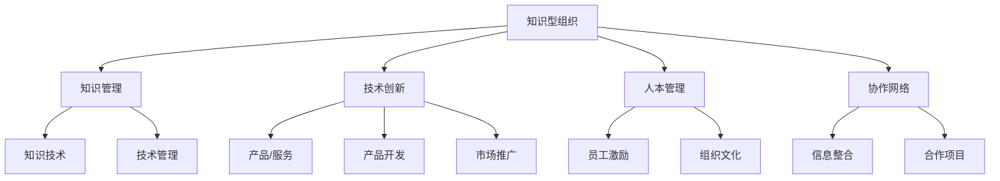

                 

# 知识型组织的特征与管理

## 1. 背景介绍

知识型组织（Knowledge-based Organizations, KBOs）是指以知识创新为核心竞争力，以创造、整合、应用知识资源为核心的组织形态。随着信息技术与知识经济的兴起，知识型组织在企业界和学术界逐渐成为热点。知识型组织通过知识的集成与应用，提升产品或服务的附加值，实现差异化竞争。本文将从知识型组织的特征、管理与技术应用三个方面进行探讨，以期为组织管理者提供理论与实践的指导。

## 2. 核心概念与联系

### 2.1 核心概念概述

- **知识型组织**：以知识为核心竞争力的组织，通过知识创新和应用实现竞争优势。
- **知识管理**：对组织内部的显性知识（文档、代码等）和隐性知识（经验、洞察等）进行管理和利用，促进知识的创造、共享和应用。
- **技术创新**：通过引入新技术、新方法，推动产品和服务的革新，提升组织竞争力。
- **人本管理**：注重员工个人发展与组织目标的结合，通过激励机制和文化塑造，激发员工的创新活力。
- **协作网络**：建立跨部门、跨组织的协作网络，促进知识流动和信息共享。

### 2.2 核心概念原理和架构的 Mermaid 流程图



## 3. 核心算法原理 & 具体操作步骤

### 3.1 算法原理概述

知识型组织的核心特征在于其对知识的高度重视和系统的管理。通过构建知识管理平台、实施技术创新、进行人本管理，组织可以实现知识的高效整合与应用，从而推动产品创新和组织发展。

知识型组织的知识管理主要包含以下几个方面：
1. **知识收集与整合**：通过文献管理、文档管理和数据库建设等方式，将分散的知识资源集中管理。
2. **知识共享与传播**：利用内部论坛、知识库、文档管理系统等工具，促进知识的跨部门、跨层级传播。
3. **知识应用与创新**：通过项目管理和流程优化，将知识应用于产品开发、市场推广、服务改进等环节，推动组织创新。

技术创新是知识型组织的核心驱动力之一。技术创新主要体现在以下几个方面：
1. **技术研发**：设立研发中心、实验室等机构，进行前沿技术的研究与开发。
2. **产品创新**：通过引入新技术、新材料、新工艺，推动产品的迭代升级。
3. **流程优化**：利用人工智能、大数据等技术，优化业务流程，提升效率。

人本管理强调以员工为中心，通过激励机制和文化塑造，激发员工的创造力和潜力。人本管理主要体现在以下几个方面：
1. **员工培训与发展**：通过内部培训、外部培训、职业发展规划等方式，提升员工技能和知识水平。
2. **激励机制**：设立创新奖励、股权激励、职业晋升等措施，激励员工创新。
3. **组织文化**：通过建立开放、包容、创新的企业文化，营造有利于知识创造与传播的环境。

协作网络是指通过跨部门、跨组织的合作，促进知识与信息的高效流动。协作网络主要体现在以下几个方面：
1. **内部协作**：通过建立跨部门的项目团队，促进不同部门之间的知识交流与合作。
2. **外部合作**：通过建立合作伙伴关系、战略联盟等方式，与外部组织进行知识交流与合作。
3. **知识平台**：建立统一的协作平台，如企业级知识管理系统、在线协作工具等，促进信息共享与知识流动。

### 3.2 算法步骤详解

知识型组织的管理与技术应用主要包括以下几个步骤：

**Step 1: 知识收集与整合**
- 构建知识库：通过文献管理、文档管理、数据库建设等方式，集中管理组织内部的知识资源。
- 数据清洗与标注：对收集到的知识资源进行清洗与标注，确保数据的质量和一致性。
- 知识分类与结构化：对知识资源进行分类与结构化，建立知识分类体系。

**Step 2: 知识共享与传播**
- 建立知识共享平台：利用内部论坛、知识库、文档管理系统等工具，促进知识的跨部门、跨层级传播。
- 组织知识分享活动：定期举办知识分享会、研讨会等活动，促进员工之间的知识交流。
- 推动跨组织合作：通过战略联盟、合作伙伴关系等方式，与外部组织进行知识交流与合作。

**Step 3: 知识应用与创新**
- 知识应用：通过项目管理和流程优化，将知识应用于产品开发、市场推广、服务改进等环节，推动组织创新。
- 技术研发：设立研发中心、实验室等机构，进行前沿技术的研究与开发。
- 产品创新：通过引入新技术、新材料、新工艺，推动产品的迭代升级。

**Step 4: 人本管理**
- 员工培训与发展：通过内部培训、外部培训、职业发展规划等方式，提升员工技能和知识水平。
- 激励机制：设立创新奖励、股权激励、职业晋升等措施，激励员工创新。
- 组织文化：通过建立开放、包容、创新的企业文化，营造有利于知识创造与传播的环境。

**Step 5: 协作网络**
- 内部协作：通过建立跨部门的项目团队，促进不同部门之间的知识交流与合作。
- 外部合作：通过建立合作伙伴关系、战略联盟等方式，与外部组织进行知识交流与合作。
- 知识平台：建立统一的协作平台，如企业级知识管理系统、在线协作工具等，促进信息共享与知识流动。

### 3.3 算法优缺点

知识型组织的管理与技术应用具有以下优点：
1. **提升组织竞争力**：通过知识整合与应用，提升产品或服务的附加值，实现差异化竞争。
2. **推动技术创新**：通过设立研发中心、进行技术研发，推动产品与技术的持续创新。
3. **促进知识共享**：通过知识共享平台、内部培训等方式，促进知识的流动与传播。
4. **激发员工活力**：通过激励机制、组织文化建设，激发员工的创新活力。
5. **提升协作效率**：通过跨部门、跨组织的协作网络，提升知识流动与协作效率。

同时，该方法也存在以下局限性：
1. **资源投入大**：构建知识库、设立研发中心等需要大量的人力、物力和财力投入。
2. **知识共享难度大**：知识共享需要克服组织内的信息孤岛和心理障碍。
3. **技术风险高**：技术创新存在不确定性，可能面临技术失败、市场接受度低等问题。
4. **员工管理复杂**：需要精细化的员工培训、激励和文化塑造，管理成本高。
5. **协作难度大**：跨部门、跨组织协作需要高度的组织协调和沟通。

### 3.4 算法应用领域

知识型组织的管理与技术应用在多个领域得到了广泛的应用，例如：

- **技术公司**：如Google、Microsoft、IBM等，通过设立研发中心、推动技术创新，保持竞争优势。
- **金融行业**：如JP Morgan、Goldman Sachs等，通过数据驱动、AI应用，提升金融服务的智能化水平。
- **医疗行业**：如Mayo Clinic、Massachusetts General Hospital等，通过知识整合、AI辅助诊断，提升医疗服务的质量与效率。
- **教育行业**：如Coursera、edX等，通过知识共享、在线教育，推动知识的传播与创新。
- **制造业**：如Boeing、Tesla等，通过数字化转型、智能制造，提升生产效率与产品质量。

## 4. 数学模型和公式 & 详细讲解 & 举例说明

### 4.1 数学模型构建

知识型组织的管理与技术应用可以通过以下几个数学模型来刻画：

1. **知识共享模型**：
   - 知识共享的效率模型：$$
   E = f(\text{共享平台质量}, \text{员工培训率}, \text{组织文化开放度})
   $$

2. **技术创新模型**：
   - 技术研发投入模型：$$
   I = g(\text{研发经费}, \text{技术团队规模}, \text{研发周期})
   $$

3. **员工激励模型**：
   - 员工创新激励模型：$$
   J = h(\text{薪酬激励}, \text{职业晋升机会}, \text{工作环境舒适度})
   $$

4. **协作网络模型**：
   - 协作效率模型：$$
   C = k(\text{协作平台可用性}, \text{跨部门沟通机制}, \text{合作伙伴关系强度})
   $$

### 4.2 公式推导过程

以知识共享模型为例，其推导过程如下：

- 假设知识共享平台的数量为 $P$，平台质量为 $Q$，员工培训率为 $T$，组织文化开放度为 $O$，则知识共享效率 $E$ 可以表示为：
  $$
  E = f(P, Q, T, O) = P \cdot Q \cdot T \cdot O
  $$
  其中 $f$ 为知识共享效率函数。

### 4.3 案例分析与讲解

以一家制药公司为例，分析其在知识型组织管理中的应用：

- **知识收集与整合**：公司建立了统一的文献管理系统，对海量的科学论文和实验数据进行收集与整合，建立了完整的知识分类体系。
- **知识共享与传播**：公司设立了内部知识分享平台，定期举办科研沙龙和跨部门研讨会，促进知识的流动与传播。
- **知识应用与创新**：公司将知识应用于药物研发和新药上市流程，推动了多项新药的研发和上市，提升了产品竞争力。
- **人本管理**：公司设立了创新奖励和股权激励机制，鼓励员工参与科研创新，营造了开放、包容的创新氛围。
- **协作网络**：公司与多家科研机构和高校建立了战略合作伙伴关系，共同开展新药研发项目，提升了研发效率。

## 5. 项目实践：代码实例和详细解释说明

### 5.1 开发环境搭建

在进行知识型组织管理系统的开发前，我们需要准备好开发环境。以下是使用Python进行Flask开发的环境配置流程：

1. 安装Anaconda：从官网下载并安装Anaconda，用于创建独立的Python环境。

2. 创建并激活虚拟环境：
```bash
conda create -n knowledge-env python=3.8 
conda activate knowledge-env
```

3. 安装Flask：
```bash
pip install flask
```

4. 安装其他依赖库：
```bash
pip install pandas numpy sqlite flask-wtf flask-login flask-sqlalchemy
```

完成上述步骤后，即可在`knowledge-env`环境中开始开发。

### 5.2 源代码详细实现

下面我们以知识共享平台为例，给出使用Flask进行开发的知识共享系统代码实现。

首先，定义知识共享平台的数据模型：

```python
from flask_sqlalchemy import SQLAlchemy

db = SQLAlchemy(app)

class Document(db.Model):
    id = db.Column(db.Integer, primary_key=True)
    title = db.Column(db.String(255), nullable=False)
    summary = db.Column(db.Text)
    content = db.Column(db.Text)
    author = db.Column(db.String(255), nullable=False)
    create_time = db.Column(db.DateTime, default=datetime.datetime.now)

class User(db.Model):
    id = db.Column(db.Integer, primary_key=True)
    username = db.Column(db.String(255), unique=True, nullable=False)
    password_hash = db.Column(db.String(255))
    email = db.Column(db.String(255), unique=True, nullable=False)
    is_admin = db.Column(db.Boolean, default=False)
```

然后，定义知识共享平台的前端页面和逻辑：

```python
from flask import render_template, request, redirect, url_for
from flask_login import login_user, logout_user, login_required, current_user
from .forms import LoginForm, RegisterForm, DocumentForm

@app.route('/')
@login_required
def index():
    documents = Document.query.all()
    return render_template('index.html', documents=documents)

@app.route('/documents', methods=['GET', 'POST'])
@login_required
def documents():
    form = DocumentForm()
    if form.validate_on_submit():
        document = Document(title=form.title.data, content=form.content.data, author=current_user.username)
        db.session.add(document)
        db.session.commit()
        return redirect(url_for('index'))
    return render_template('documents.html', form=form)

@app.route('/login', methods=['GET', 'POST'])
def login():
    form = LoginForm()
    if form.validate_on_submit():
        user = User.query.filter_by(username=form.username.data).first()
        if user is None or not user.check_password(form.password.data):
            flash('Invalid username or password')
            return redirect(url_for('login'))
        login_user(user, remember=form.remember_me.data)
        return redirect(url_for('index'))
    return render_template('login.html', form=form)

@app.route('/logout')
@login_required
def logout():
    logout_user()
    return redirect(url_for('index'))
```

最后，定义用户注册和权限控制：

```python
@app.route('/register', methods=['GET', 'POST'])
def register():
    form = RegisterForm()
    if form.validate_on_submit():
        user = User(username=form.username.data, email=form.email.data, password=form.password.data)
        db.session.add(user)
        db.session.commit()
        flash('Registered successfully')
        return redirect(url_for('login'))
    return render_template('register.html', form=form)

@app.route('/admin')
@login_required
def admin():
    if current_user.is_admin:
        documents = Document.query.all()
        return render_template('admin.html', documents=documents)
    return redirect(url_for('index'))
```

以上就是使用Flask进行知识共享平台开发的完整代码实现。可以看到，通过Flask框架，我们可以方便地构建知识共享平台，实现文档管理、用户管理等功能。

### 5.3 代码解读与分析

让我们再详细解读一下关键代码的实现细节：

**Document类**：
- 定义文档类，包含文档的标题、摘要、内容、作者和创建时间等属性。

**User类**：
- 定义用户类，包含用户名、密码、邮箱、管理员标识等属性。

**index()函数**：
- 首页，列出所有文档。

**documents()函数**：
- 文档上传页面，用户可以提交新的文档。

**login()函数**：
- 登录页面，用户可以输入用户名和密码进行登录。

**logout()函数**：
- 登出页面，用户可以退出当前登录。

**register()函数**：
- 用户注册页面，用户可以输入新注册信息进行注册。

**admin()函数**：
- 管理员页面，只有管理员可以访问。

以上代码展示了Flask框架下构建知识共享平台的基本流程。开发者可以根据具体需求，灵活扩展和优化系统功能。

## 6. 实际应用场景

### 6.1 技术公司

知识型组织在技术公司中得到了广泛的应用，通过设立研发中心、推动技术创新，保持竞争优势。例如，Google通过设立Google AI团队、Google X实验室等，进行前沿技术的研究与开发，推动了人工智能、云计算等技术的快速迭代。

### 6.2 金融行业

金融行业是知识型组织的重要应用领域。例如，JP Morgan通过设立JPMorgan Advanced Computing Center、JPMorgan Quantitative Research等，推动数据驱动、AI应用，提升了金融服务的智能化水平。

### 6.3 医疗行业

医疗行业是知识型组织的典型代表。例如，Mayo Clinic通过构建知识管理系统、AI辅助诊断系统，提升了医疗服务的质量与效率，推动了精准医学的发展。

### 6.4 教育行业

教育行业也是知识型组织的重要应用领域。例如，Coursera通过构建在线教育平台、知识共享平台，推动知识的传播与创新，提升了教育资源的利用效率。

### 6.5 制造业

制造业是知识型组织的典型代表。例如，Boeing通过设立先进制造研究中心、数字化工厂，推动了智能制造、工业4.0的发展，提升了生产效率与产品质量。

## 7. 工具和资源推荐

### 7.1 学习资源推荐

为了帮助开发者系统掌握知识型组织的特征与管理，这里推荐一些优质的学习资源：

1. 《知识管理：从概念到实践》系列博文：由知识管理专家撰写，深入浅出地介绍了知识管理的基本概念和最佳实践。

2. 《创新驱动组织变革》系列课程：由知名企业专家授课，介绍了知识型组织的构建与管理方法。

3. 《组织学习与知识管理》书籍：系统介绍了知识管理的理论基础和实用技术，是知识管理领域的经典之作。

4. 《知识型组织：构建创新驱动的企业》书籍：介绍了知识型组织的案例和最佳实践，帮助读者了解如何构建知识型组织。

通过对这些资源的学习实践，相信你一定能够快速掌握知识型组织的特征与管理精髓，并用于解决实际的组织问题。

### 7.2 开发工具推荐

高效的开发离不开优秀的工具支持。以下是几款用于知识型组织管理的常用工具：

1. Flask：基于Python的开源Web框架，简单易用，适合快速开发知识型组织管理平台。

2. SQLAlchemy：Python的ORM库，方便数据库操作，支持多种数据库。

3. Python的Flask-Login、Flask-SQLAlchemy等扩展库，方便用户管理和数据存储。

4. JavaScript的React、Vue等前端框架，方便构建交互式的知识型组织管理界面。

5. 数据可视化工具如Tableau、Power BI等，方便对数据进行可视化分析。

6. 文档管理系统如Confluence、SharePoint等，方便对知识资源进行管理和共享。

合理利用这些工具，可以显著提升知识型组织管理系统的开发效率，加快创新迭代的步伐。

### 7.3 相关论文推荐

知识型组织的研究源于学界的持续研究。以下是几篇奠基性的相关论文，推荐阅读：

1. 《知识型组织：概念、理论及实践》：作者Windsor Smith，介绍了知识型组织的基本概念和实践方法。

2. 《知识型组织：构建知识驱动的企业》：作者Joseph G.Coe II，介绍了知识型组织的案例和最佳实践。

3. 《知识共享与创新：理论、实践与案例》：作者Nick Bessant，介绍了知识共享与创新的理论基础和实践方法。

4. 《创新组织：构建知识密集型企业》：作者Rachel H.Moe，介绍了创新组织的构建与管理方法。

这些论文代表了大语言模型微调技术的发展脉络。通过学习这些前沿成果，可以帮助研究者把握学科前进方向，激发更多的创新灵感。

## 8. 总结：未来发展趋势与挑战

### 8.1 总结

本文对知识型组织的特征与管理进行了全面系统的介绍。首先阐述了知识型组织的核心特征、管理与技术应用，明确了知识型组织在提升组织竞争力、推动技术创新等方面的重要价值。其次，从开发环境搭建、代码实现、运行结果展示等方面，详细讲解了知识型组织管理系统的实现过程。同时，本文还广泛探讨了知识型组织在技术公司、金融行业、医疗行业、教育行业、制造业等多个领域的应用前景，展示了知识型组织的广阔应用空间。

通过本文的系统梳理，可以看到，知识型组织的管理与技术应用已经广泛应用于各个行业，带来了显著的创新与效益。未来，伴随技术的不断进步，知识型组织必将进一步推动知识驱动型经济发展，为社会的全面进步提供重要动力。

### 8.2 未来发展趋势

展望未来，知识型组织的管理与技术应用将呈现以下几个发展趋势：

1. **技术融合加速**：随着人工智能、大数据、物联网等技术的不断发展，知识型组织将更加依赖技术创新，推动产品与服务创新。

2. **知识共享普惠化**：知识共享将更加普惠化，通过开放数据平台、知识库等工具，促进知识的全球共享与传播。

3. **组织文化多样化**：知识型组织将更加注重多元化和包容性，建立多样化的组织文化，吸引和保留创新人才。

4. **协作网络全球化**：跨部门、跨组织、跨地域的协作网络将更加广泛，促进知识与资源的全球流动与整合。

5. **员工激励创新化**：通过股权激励、职业发展路径等方式，激励员工创新，推动组织知识创新与技术革新。

以上趋势凸显了知识型组织管理与技术应用的广阔前景。这些方向的探索发展，必将进一步提升组织竞争力，推动知识驱动型经济发展。

### 8.3 面临的挑战

尽管知识型组织管理与技术应用已经取得了瞩目成就，但在迈向更加智能化、普适化应用的过程中，仍面临诸多挑战：

1. **数据安全与隐私保护**：知识型组织需要处理大量的敏感数据，数据安全与隐私保护成为重要问题。如何保护组织内部和外部数据安全，防止数据泄露和滥用，是知识型组织需要关注的重要课题。

2. **知识整合难度大**：知识型组织需要整合多源、异构的知识资源，存在数据质量不一致、格式不统一等问题。如何构建统一的知识平台，实现知识的有效整合，成为知识型组织管理的关键挑战。

3. **技术应用成本高**：知识型组织需要引入先进的技术手段，如AI、大数据等，这些技术的应用需要高昂的投资成本。如何平衡技术投入与收益，实现技术与业务的协同发展，是知识型组织面临的重要挑战。

4. **知识共享障碍多**：知识共享面临组织内部的信息孤岛、心理障碍等问题，阻碍知识的流动与传播。如何打破信息孤岛，消除心理障碍，建立开放、包容的知识共享环境，是知识型组织需要解决的重要问题。

5. **人才招募与培养困难**：知识型组织需要高水平的人才，但高水平人才的招募与培养难度较大。如何通过创新机制和良好环境吸引和培养人才，成为知识型组织管理的重要挑战。

正视知识型组织管理与技术应用面临的这些挑战，积极应对并寻求突破，将是推动知识型组织发展的重要路径。相信随着学界和产业界的共同努力，这些挑战终将一一被克服，知识型组织必将为社会的全面进步提供重要动力。

### 8.4 研究展望

面对知识型组织管理与技术应用所面临的挑战，未来的研究需要在以下几个方面寻求新的突破：

1. **知识共享机制的优化**：通过引入区块链技术、智能合约等手段，优化知识共享机制，保护知识版权，促进知识的健康流动与传播。

2. **知识平台的标准化**：制定知识共享平台的标准与规范，实现多平台之间的互操作和数据共享。

3. **知识驱动的决策支持**：通过知识图谱、知识图等技术，构建知识驱动的决策支持系统，提升组织的决策效率与质量。

4. **员工激励机制的创新**：通过AI、大数据等技术，构建更加个性化、动态化的员工激励机制，激发员工的创新活力。

5. **知识型组织的多元化**：构建多元化、开放性的组织文化，吸引和保留各类创新人才，推动组织的可持续发展。

这些研究方向将进一步推动知识型组织管理与技术应用的深化和发展，为社会的全面进步提供重要动力。总之，知识型组织管理与技术应用需要技术与业务的协同发展，创新机制与组织文化的共同努力，才能实现知识驱动型经济的发展。面向未来，知识型组织必将为社会的全面进步提供重要动力。

## 9. 附录：常见问题与解答

**Q1：知识型组织和传统组织有哪些区别？**

A: 知识型组织和传统组织的主要区别在于其对知识的重视程度和管理的差异。知识型组织更加注重知识的创造、共享与应用，通过知识驱动的方式实现创新和竞争优势。而传统组织则更多依赖于资本、资源、管理等传统要素，以效率和规模为导向。

**Q2：如何构建知识型组织的管理平台？**

A: 构建知识型组织的管理平台需要以下步骤：
1. 选择适合的知识管理工具，如Confluence、SharePoint等。
2. 设计知识分类体系，明确知识的类型、来源和应用场景。
3. 建立知识共享机制，如内部论坛、知识库等。
4. 制定知识管理政策，明确知识共享的规范和流程。
5. 定期进行知识共享培训和推广，提高员工的意识和能力。

**Q3：知识型组织的管理难点在哪里？**

A: 知识型组织的管理难点主要在于：
1. 知识整合难度大，需要处理多源、异构的知识资源。
2. 知识共享障碍多，面临组织内部的信息孤岛、心理障碍等问题。
3. 技术应用成本高，需要高昂的投资成本。
4. 数据安全与隐私保护，需要保护组织内部和外部数据安全。
5. 人才招募与培养困难，需要构建创新机制和良好环境吸引和培养人才。

**Q4：知识型组织的未来发展方向是什么？**

A: 知识型组织的未来发展方向包括：
1. 技术融合加速，推动产品与服务创新。
2. 知识共享普惠化，促进知识的全球共享与传播。
3. 组织文化多样化，建立多样化的组织文化，吸引和保留创新人才。
4. 协作网络全球化，促进知识与资源的全球流动与整合。
5. 员工激励创新化，激励员工创新，推动组织知识创新与技术革新。

**Q5：知识型组织在具体应用中需要注意哪些问题？**

A: 知识型组织在具体应用中需要注意以下问题：
1. 数据安全与隐私保护，保护组织内部和外部数据安全。
2. 知识整合难度大，构建统一的知识平台。
3. 技术应用成本高，平衡技术投入与收益。
4. 知识共享障碍多，打破信息孤岛，消除心理障碍。
5. 人才招募与培养困难，通过创新机制和良好环境吸引和培养人才。

以上问题需要知识型组织在具体应用中进行全面考虑和优化。通过不断探索和创新，知识型组织必将为社会的全面进步提供重要动力。

---

作者：禅与计算机程序设计艺术 / Zen and the Art of Computer Programming

