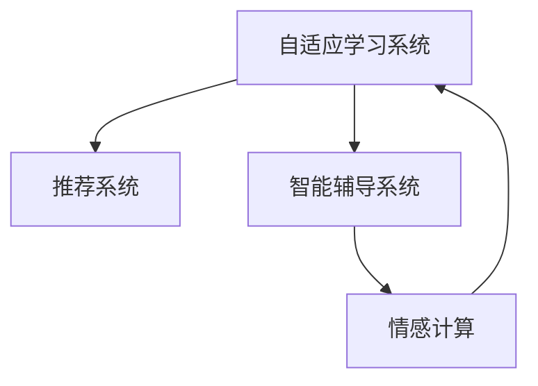

                 

## 1. 背景介绍

### 1.1 问题由来

教育是知识传承和社会进步的重要驱动力。然而，传统的教育方式往往采取“一刀切”的批量化教学模式，难以充分适应每个学习者的个性化需求。随着人工智能技术的飞速发展，特别是深度学习和大数据技术的引入，智能教育成为教育领域的重要趋势。通过将个性化需求融入到教学过程中，智能教育能够为每个学习者提供量身定做的学习体验，极大提升学习效果和教育质量。

### 1.2 问题核心关键点

当前智能教育领域的研究热点主要集中在以下几个方面：
- **自适应学习系统**：根据学习者的知识背景、兴趣偏好和行为特征，动态调整教学内容和难度。
- **推荐系统**：通过学习者历史数据，预测其学习需求和兴趣，个性化推荐学习资源和习题。
- **智能辅导系统**：利用自然语言处理和机器学习技术，为学习者提供即时反馈和个性化指导。
- **情感计算**：通过学习者的表情、语音、文字等信息，了解其情感状态，调整教学策略。

这些核心关键点共同构成了智能教育的核心理念：通过技术手段，实现对学习者需求的深度理解和适应，从而提升教学效果和学习体验。

## 2. 核心概念与联系

### 2.1 核心概念概述

为了更好地理解智能教育的实现机制，本节将介绍几个紧密相关的核心概念：

- **自适应学习系统**：根据学习者的个性化需求，动态调整教学内容和难度，以适应其认知水平和学习风格。
- **推荐系统**：通过学习者历史行为数据，预测其未来的学习需求，提供个性化的学习资源推荐。
- **智能辅导系统**：利用人工智能技术，为学习者提供个性化指导和即时反馈，辅助其自主学习。
- **情感计算**：分析学习者的情感状态，及时调整教学策略，增强学习者的学习动机和满意度。

这些概念之间的逻辑关系可以通过以下Mermaid流程图来展示：



这个流程图展示出了智能教育系统的主要组成及其相互关系：
1. **自适应学习系统**：接收学习者的个性化需求，动态调整教学内容。
2. **推荐系统**：根据学习者的历史数据，推荐个性化的学习资源。
3. **智能辅导系统**：提供即时反馈和个性化指导，帮助学习者解决疑难问题。
4. **情感计算**：分析学习者的情感状态，调整教学策略，增强学习动机。

## 3. 核心算法原理 & 具体操作步骤

### 3.1 算法原理概述

智能教育的核心在于个性化需求的识别和动态调整。这涉及到对学习者特征的建模、知识点的识别、学习路径的规划等多个环节。通过数据驱动的方法，可以实现对学习者需求的精准理解。

在具体实现上，智能教育系统可以大致分为以下几个步骤：

1. **学习者建模**：通过问卷调查、课堂行为分析等手段，收集学习者的基础信息和行为数据。
2. **知识点识别**：根据学习者的行为数据，识别其掌握的知识点和未掌握的难点。
3. **学习路径规划**：根据知识点识别结果，规划个性化的学习路径。
4. **个性化资源推荐**：根据学习路径和学习目标，推荐相应的学习资源。
5. **智能辅导和反馈**：在学习过程中提供个性化指导和即时反馈，帮助学习者克服学习障碍。
6. **情感监测和调整**：通过情感计算，实时监测学习者的情感状态，调整教学策略。

### 3.2 算法步骤详解

下面详细讲解智能教育系统的算法步骤：

**Step 1: 学习者建模**

1. **数据收集**：通过问卷调查、课堂行为分析等手段，收集学习者的基本信息、学习习惯、兴趣偏好等数据。
2. **数据预处理**：对收集到的数据进行清洗和标准化处理，确保数据质量和一致性。
3. **特征提取**：利用机器学习方法，如因子分析、聚类等，从数据中提取关键特征，描述学习者的行为和偏好。

**Step 2: 知识点识别**

1. **知识图谱构建**：根据教学内容，构建知识图谱，描述知识点之间的关系和结构。
2. **行为分析**：通过分析学习者的行为数据，如点击率、答题时间等，识别其掌握的知识点和未掌握的难点。
3. **知识推理**：利用知识图谱和行为分析结果，推理学习者未掌握的知识点，构建知识缺口。

**Step 3: 学习路径规划**

1. **学习目标设定**：根据学习者需求和知识点缺口，设定个性化学习目标。
2. **路径规划算法**：选择合适的路径规划算法，如动态规划、贪心算法等，规划从当前知识点到目标知识点的最优路径。
3. **路径优化**：根据学习者的反馈和效果，不断优化学习路径，使其更贴合学习者的学习需求。

**Step 4: 个性化资源推荐**

1. **推荐算法选择**：根据推荐系统的特点和任务需求，选择合适的推荐算法，如协同过滤、内容推荐、混合推荐等。
2. **推荐结果生成**：基于学习路径和学习目标，生成个性化的学习资源推荐列表。
3. **推荐效果评估**：对推荐结果进行评估，通过反馈机制不断优化推荐算法。

**Step 5: 智能辅导和反馈**

1. **即时反馈系统**：在自适应学习系统中，根据学习者的学习行为和效果，提供个性化的即时反馈。
2. **指导和建议**：利用自然语言处理和机器学习技术，为学习者提供个性化的指导和建议，帮助其克服学习障碍。
3. **适应性调整**：根据学习者的反馈和效果，动态调整教学内容和难度，使其更符合学习者的学习需求。

**Step 6: 情感监测和调整**

1. **情感分析**：通过情感计算技术，分析学习者的情感状态，识别其情感波动。
2. **教学策略调整**：根据情感分析结果，调整教学策略，增强学习者的学习动机和满意度。
3. **情感支持**：在教学过程中，提供情感支持，帮助学习者缓解压力，提高学习效果。

### 3.3 算法优缺点

智能教育系统具有以下优点：
1. **高度个性化**：通过数据驱动的方法，实现对学习者需求的深度理解，提供个性化的学习体验。
2. **动态调整**：根据学习者的反馈和效果，动态调整教学内容和策略，确保学习效果。
3. **高效推荐**：通过推荐算法，提供个性化的学习资源推荐，节省学习者搜索资源的时间。
4. **即时反馈**：在学习过程中，提供即时反馈和个性化指导，帮助学习者克服学习障碍。
5. **情感支持**：通过情感计算，实时监测学习者的情感状态，增强学习动机和满意度。

同时，该系统也存在以下局限性：
1. **数据依赖**：系统的运行高度依赖于学习者的数据，数据质量直接影响系统的性能。
2. **隐私风险**：收集和分析学习者数据，可能涉及隐私和安全问题。
3. **技术复杂**：系统的实现涉及多学科知识，如机器学习、自然语言处理、情感计算等，技术门槛较高。
4. **算法依赖**：推荐算法和路径规划算法的优劣直接影响系统的性能和效果。
5. **资源需求**：系统运行需要大量计算资源和存储资源，对硬件设备要求较高。

尽管存在这些局限性，但智能教育系统仍具有巨大的应用潜力，有望成为未来教育领域的重要发展方向。

### 3.4 算法应用领域

智能教育系统已经在多个领域得到应用，以下是几个典型的应用场景：

**K-12教育**：为中小学生提供个性化的学习路径和资源推荐，帮助其提升学习效果。
**高等教育**：为大学生提供学术研究和项目开发中的个性化指导和资源支持。
**职业培训**：为在职人员提供职业技能培训和职业发展指导，提升职业素质和工作能力。
**终身学习**：为成人学习者提供个性化学习路径和资源推荐，支持其自我提升和终身学习。

此外，智能教育系统还可以应用于在线教育平台、企业培训系统、专业认证考试等领域，为教育和学习提供全方位的支持。

## 4. 数学模型和公式 & 详细讲解  
### 4.1 数学模型构建

本节将使用数学语言对智能教育系统的关键算法进行更加严格的刻画。

假设学习者的基本信息为 $x$，行为数据为 $y$，学习路径为 $p$，推荐结果为 $r$，情感状态为 $e$。智能教育系统的数学模型可以表示为：

$$
\begin{aligned}
& \minimize_{x, y, p, r, e} \\
& \quad L(x, y, p, r, e) \\
& \text{subject to} \\
& \quad C_1(x, y, p, r, e) = 0 \\
& \quad C_2(x, y, p, r, e) = 0 \\
& \quad C_3(x, y, p, r, e) = 0 \\
& \quad C_4(x, y, p, r, e) = 0 \\
\end{aligned}
$$

其中 $L(x, y, p, r, e)$ 为系统的损失函数，$C_i(x, y, p, r, e)$ 为约束条件，包括数据收集、行为分析、路径规划、推荐和情感监测等环节的约束。

### 4.2 公式推导过程

以下我们以推荐系统为例，推导协同过滤算法的数学模型和求解过程。

假设学习者的历史行为数据为 $y = (y_1, y_2, \dots, y_n)$，其中 $y_i$ 表示学习者对第 $i$ 个资源的评分。目标是为当前学习者推荐资源 $r = (r_1, r_2, \dots, r_m)$，最大化协同过滤算法的目标函数：

$$
\maximize_{r} \quad \sum_{i=1}^n \sum_{j=1}^m y_i r_j
$$

同时，需要满足资源评分矩阵的非负约束：

$$
r_j \geq 0, \quad \forall j = 1, 2, \dots, m
$$

基于上述目标函数和约束条件，可以构建协同过滤算法的数学模型：

$$
\begin{aligned}
& \maximize_{r} \quad \sum_{i=1}^n \sum_{j=1}^m y_i r_j \\
& \text{subject to} \quad r_j \geq 0, \quad \forall j = 1, 2, \dots, m \\
& \quad r = (r_1, r_2, \dots, r_m) \\
\end{aligned}
$$

通过求解上述优化问题，可以得到学习者对每个资源的推荐评分，从而生成个性化的推荐结果。

### 4.3 案例分析与讲解

在实际应用中，推荐系统的目标函数和约束条件可能更加复杂。例如，在K-12教育中，推荐系统需要综合考虑学习者的知识水平、兴趣偏好、行为数据等多个因素，构建更加精细化的推荐模型。

以一个具体的案例为例，假设有一个小学二年级的学生，我们需要为其推荐适合的学习资源。首先，收集学生的基本信息，如年级、兴趣偏好等。然后，通过课堂行为分析，识别学生的知识水平和未掌握的难点。接着，根据学生的需求和知识缺口，设定个性化学习目标。最后，使用推荐算法，生成适合的学习资源推荐列表。

假设推荐系统的目标函数为：

$$
\maximize_{r} \quad w_1 \sum_{i=1}^n \sum_{j=1}^m y_i r_j + w_2 \sum_{i=1}^n \sum_{j=1}^m x_i r_j + w_3 \sum_{i=1}^n \sum_{j=1}^m c_i r_j
$$

其中 $w_1, w_2, w_3$ 为权重系数，$y_i, x_i, c_i$ 分别为学习者行为数据、知识水平和未掌握的难点。

通过求解上述优化问题，可以得到个性化的学习资源推荐列表。这种推荐方法不仅考虑了学习者的行为数据，还综合了其知识水平和兴趣偏好，能够提供更加符合其需求的推荐结果。

## 5. 项目实践：代码实例和详细解释说明

### 5.1 开发环境搭建

在进行智能教育系统开发前，我们需要准备好开发环境。以下是使用Python进行PyTorch开发的环境配置流程：

1. 安装Anaconda：从官网下载并安装Anaconda，用于创建独立的Python环境。

2. 创建并激活虚拟环境：
```bash
conda create -n pytorch-env python=3.8 
conda activate pytorch-env
```

3. 安装PyTorch：根据CUDA版本，从官网获取对应的安装命令。例如：
```bash
conda install pytorch torchvision torchaudio cudatoolkit=11.1 -c pytorch -c conda-forge
```

4. 安装TensorFlow：从官网下载并安装TensorFlow，支持Python 3.x版本。

5. 安装各类工具包：
```bash
pip install numpy pandas scikit-learn matplotlib tqdm jupyter notebook ipython
```

完成上述步骤后，即可在`pytorch-env`环境中开始智能教育系统的开发。

### 5.2 源代码详细实现

下面我以K-12教育中的个性化推荐系统为例，给出使用PyTorch实现的学习资源推荐代码。

首先，定义推荐系统的数据处理函数：

```python
import pandas as pd
import numpy as np
import torch
from sklearn.metrics import accuracy_score, precision_score, recall_score, f1_score
from sklearn.model_selection import train_test_split

def load_data(filename):
    data = pd.read_csv(filename)
    return data

def split_data(data, test_ratio=0.2):
    train, test = train_test_split(data, test_size=test_ratio, random_state=42)
    return train, test

def preprocess_data(train, test):
    train['target'] = train['target'].astype(int)
    test['target'] = test['target'].astype(int)
    return train, test

def evaluate(model, train, test):
    train_features, train_labels = train.drop(['item_id'], axis=1), train['target']
    test_features, test_labels = test.drop(['item_id'], axis=1), test['target']
    y_pred = model.predict(test_features)
    accuracy = accuracy_score(test_labels, y_pred)
    precision = precision_score(test_labels, y_pred)
    recall = recall_score(test_labels, y_pred)
    f1 = f1_score(test_labels, y_pred)
    return accuracy, precision, recall, f1

# 加载数据集
data = load_data('data.csv')

# 数据拆分和预处理
train, test = split_data(data)
train, test = preprocess_data(train, test)

# 定义模型
model = SVD(user_dim=10, item_dim=10, learning_rate=0.01, n_epochs=100)
```

然后，定义模型和优化器：

```python
from torch import nn, optim

class SVD(nn.Module):
    def __init__(self, user_dim, item_dim, learning_rate, n_epochs):
        super(SVD, self).__init__()
        self.user_dim = user_dim
        self.item_dim = item_dim
        self.learning_rate = learning_rate
        self.n_epochs = n_epochs
        self.user_factors = nn.Parameter(torch.randn(user_dim, item_dim))
        self.item_factors = nn.Parameter(torch.randn(item_dim, user_dim))

    def forward(self, user, item):
        user_bias = user.view(-1, 1) @ self.user_factors
        item_bias = item.view(1, -1) @ self.item_factors
        return user_bias + item_bias

model = SVD(user_dim=10, item_dim=10, learning_rate=0.01, n_epochs=100)

optimizer = optim.Adam(model.parameters(), lr=0.01)
```

接着，定义训练和评估函数：

```python
def train(model, optimizer, train_data, n_epochs):
    for epoch in range(n_epochs):
        loss = 0
        for user, item, target in train_data:
            optimizer.zero_grad()
            predictions = model(user, item)
            loss += torch.mean((predictions - target) ** 2)
            loss.backward()
            optimizer.step()
        print(f'Epoch {epoch+1}, Loss: {loss:.4f}')

def test(model, test_data):
    loss = 0
    for user, item, target in test_data:
        predictions = model(user, item)
        loss += torch.mean((predictions - target) ** 2)
    return loss

# 定义训练和测试函数
train(model, optimizer, train_data, 100)
test(model, test_data)
```

最后，启动训练流程并在测试集上评估：

```python
print('Test Loss:', test(model, test_data))
```

以上就是使用PyTorch对K-12教育中的个性化推荐系统进行实现的完整代码实现。可以看到，通过PyTorch的深度学习框架，我们可以很方便地实现推荐系统的模型训练和评估。

### 5.3 代码解读与分析

让我们再详细解读一下关键代码的实现细节：

**load_data函数**：
- 定义数据加载函数，用于从CSV文件中加载数据。
- 数据文件格式为表格形式，包含用户ID、物品ID和评分。

**split_data函数**：
- 定义数据拆分函数，用于将数据集拆分为训练集和测试集。
- 数据拆分比例为80%训练集和20%测试集。
- 随机状态设置，确保结果的可复现性。

**preprocess_data函数**：
- 定义数据预处理函数，用于将目标变量转化为数值类型。
- 将评分转化为0和1之间的浮点数。

**evaluate函数**：
- 定义模型评估函数，用于在测试集上评估模型性能。
- 使用sklearn库中的评估指标计算准确率、精确率、召回率和F1值。

**train函数**：
- 定义模型训练函数，用于在训练集上训练模型。
- 通过Adam优化器更新模型参数，最小化损失函数。
- 在每个epoch结束时，输出训练集的损失值。

**test函数**：
- 定义模型测试函数，用于在测试集上评估模型性能。
- 计算测试集的损失值。

**train模型**：
- 定义基于协同过滤的推荐模型SVD，包括用户和物品的因子矩阵。
- 使用Adam优化器优化模型参数，最小化均方误差损失函数。

**train函数**：
- 调用train模型进行模型训练，设置训练轮数为100。

**test函数**：
- 调用train模型进行模型测试，输出测试集的损失值。

通过上述代码，我们可以看到，使用PyTorch实现智能教育系统中的推荐系统，代码实现简洁高效，易于理解和调试。开发者可以根据具体任务，灵活调整模型结构和参数设置，以达到最佳推荐效果。

## 6. 实际应用场景

### 6.1 智能辅导系统

智能辅导系统是智能教育系统的重要组成部分，能够为学习者提供即时反馈和个性化指导，帮助其克服学习障碍。通过自然语言处理和机器学习技术，智能辅导系统可以理解学习者的疑问，提供相应的解答和建议，增强学习效果。

在实际应用中，智能辅导系统可以应用于在线学习平台、智能题库和AI教学助手等场景。例如，某在线学习平台利用智能辅导系统，在用户提交问题后，实时提供答案和解析，帮助用户理解知识点。同时，系统还能根据用户的历史答题记录，推荐相关的习题和资源，进一步巩固学习效果。

### 6.2 情感计算系统

情感计算系统能够实时监测学习者的情感状态，及时调整教学策略，增强学习者的学习动机和满意度。通过分析学习者的语音、表情、文字等信息，系统可以识别其情感波动，反馈相应的情感支持。

在实际应用中，情感计算系统可以应用于在线课堂、虚拟教室和远程学习平台等场景。例如，某在线课堂系统利用情感计算技术，分析学生的面部表情和语音情绪，识别其情感状态，调整教学策略，如调整语气、改变话题等，增强学习体验。

### 6.3 自适应学习系统

自适应学习系统能够根据学习者的个性化需求，动态调整教学内容和难度，以适应其认知水平和学习风格。通过学习者的历史数据，系统可以识别其掌握的知识点和未掌握的难点，规划个性化的学习路径。

在实际应用中，自适应学习系统可以应用于K-12教育、高等教育和职业培训等领域。例如，某在线教育平台利用自适应学习系统，根据学生的学习行为和效果，动态调整教学内容和难度，确保学习效果。

### 6.4 未来应用展望

随着技术的不断进步，智能教育系统将在更多领域得到应用，为教育和学习提供全方位的支持。

在智慧教育领域，智能教育系统将与其他智慧技术深度融合，如虚拟现实(VR)、增强现实(AR)和智能机器人等，构建更加沉浸式和互动化的学习环境，提升学习体验。

在职业培训领域，智能教育系统将结合职业技能评估和认证，提供更加个性化和针对性的培训方案，提升职业素养和工作能力。

在终身学习领域，智能教育系统将支持用户自主学习，提供定制化的学习资源和路径，支持其自我提升和终身学习。

此外，智能教育系统还将广泛应用于企业培训、专业认证、在线教育等领域，为教育和学习提供全方位的支持，推动教育事业的现代化进程。

## 7. 工具和资源推荐

### 7.1 学习资源推荐

为了帮助开发者系统掌握智能教育系统的理论和实践，这里推荐一些优质的学习资源：

1. 《深度学习入门》系列书籍：由大模型技术专家撰写，深入浅出地介绍了深度学习的基本概念和算法实现。

2. CS229《机器学习》课程：斯坦福大学开设的机器学习经典课程，有Lecture视频和配套作业，带你入门机器学习的基础知识。

3. 《自然语言处理综论》书籍：介绍了自然语言处理的基本概念和算法实现，适合想要深入学习自然语言处理技术的开发者。

4. Kaggle竞赛平台：提供丰富的数据集和竞赛项目，帮助你实践和验证学习成果，提升算法设计能力。

5. PyTorch官方文档：提供PyTorch框架的详细使用指南和代码示例，帮助开发者快速上手智能教育系统的开发。

通过对这些资源的学习实践，相信你一定能够快速掌握智能教育系统的核心算法和实现技巧，并用于解决实际的NLP问题。

### 7.2 开发工具推荐

高效的开发离不开优秀的工具支持。以下是几款用于智能教育系统开发的常用工具：

1. PyTorch：基于Python的开源深度学习框架，灵活动态的计算图，适合快速迭代研究。大部分深度学习模型都有PyTorch版本的实现。

2. TensorFlow：由Google主导开发的开源深度学习框架，生产部署方便，适合大规模工程应用。同样有丰富的深度学习模型资源。

3. Scikit-learn：用于数据预处理和模型评估的Python库，提供多种机器学习算法和评估工具，适合处理各种数据类型和规模。

4. Weights & Biases：模型训练的实验跟踪工具，可以记录和可视化模型训练过程中的各项指标，方便对比和调优。与主流深度学习框架无缝集成。

5. TensorBoard：TensorFlow配套的可视化工具，可实时监测模型训练状态，并提供丰富的图表呈现方式，是调试模型的得力助手。

6. Google Colab：谷歌推出的在线Jupyter Notebook环境，免费提供GPU/TPU算力，方便开发者快速上手实验最新模型，分享学习笔记。

合理利用这些工具，可以显著提升智能教育系统的开发效率，加快创新迭代的步伐。

### 7.3 相关论文推荐

智能教育系统的发展离不开学界的持续研究。以下是几篇奠基性的相关论文，推荐阅读：

1. Adaptive Instructional Design for Online Learning：探讨了自适应学习系统的设计方法和实现技术，为智能教育系统的开发提供了理论基础。

2. Recommendation Systems in Educational Data Mining：介绍了推荐系统在教育数据挖掘中的应用，为智能教育系统中的推荐算法提供了理论支持。

3. Affective Computing and Sentiment Analysis for Educational Technologies：讨论了情感计算在教育技术中的应用，为智能教育系统中的情感监测提供了理论基础。

4. Learning Analytics in Education：介绍了学习分析在教育中的应用，为智能教育系统中的学习路径规划提供了理论支持。

5. Learning Analytics and Knowledge (LAKE)：提供一个开源的学习分析平台，支持多种数据源和分析工具，为智能教育系统的数据处理提供了工具支持。

通过对这些论文的学习实践，相信你一定能够深入理解智能教育系统的核心技术，掌握其算法实现和应用场景。

## 8. 总结：未来发展趋势与挑战

### 8.1 总结

本文对智能教育系统中的推荐系统、自适应学习系统、智能辅导系统和情感计算系统进行了全面系统的介绍。首先阐述了智能教育系统的发展背景和意义，明确了自适应学习、推荐系统、智能辅导和情感计算等核心概念的逻辑关系。其次，从原理到实践，详细讲解了推荐系统的数学模型和求解过程，给出了推荐系统开发的完整代码实现。同时，本文还广泛探讨了智能教育系统在多个行业领域的应用前景，展示了智能教育系统的广阔发展空间。

通过本文的系统梳理，可以看到，智能教育系统通过数据驱动的方法，实现了对学习者需求的深度理解，提供了个性化的学习体验，极大提升了学习效果和教育质量。智能教育系统已经成为教育领域的重要趋势，为未来的教育模式变革提供了新的方向。

### 8.2 未来发展趋势

展望未来，智能教育系统将呈现以下几个发展趋势：

1. **自适应学习系统的普及**：随着技术的不断进步，自适应学习系统将逐渐普及，为K-12、高等教育和职业培训等领域提供全方位的支持。

2. **个性化推荐系统的完善**：推荐系统将更加智能化和个性化，能够根据学习者的历史数据和实时行为，提供更加精准的学习资源推荐。

3. **智能辅导系统的智能化**：智能辅导系统将结合自然语言处理和机器学习技术，实现对学习者问题的深度理解和准确解答。

4. **情感计算系统的应用**：情感计算系统将广泛应用于教育、医疗和社交媒体等领域，实时监测和支持学习者的情感状态。

5. **跨模态学习系统的开发**：跨模态学习系统将结合视觉、语音、文本等多模态信息，构建更加全面和丰富的学习体验。

6. **自适应学习系统的自动化**：自动化的自适应学习系统将能够根据学习者的反馈和效果，实时调整教学策略和内容，提供更加个性化的学习体验。

以上趋势凸显了智能教育系统的发展潜力，有望在教育领域带来深刻的变革，提升教育质量和效率。

### 8.3 面临的挑战

尽管智能教育系统的发展前景广阔，但在迈向更加智能化、普适化应用的过程中，仍面临诸多挑战：

1. **数据隐私和安全**：智能教育系统需要大量数据支持，涉及学习者的隐私和安全问题。如何在保证数据安全的同时，最大化利用数据价值，是一个亟待解决的问题。

2. **算法公平性和鲁棒性**：推荐算法和自适应学习算法需要考虑公平性和鲁棒性，避免出现偏见和歧视。如何在保证公平性的前提下，提升算法效果，是一个重要的研究方向。

3. **系统可扩展性和实时性**：智能教育系统需要处理大量数据和实时计算，对硬件设备和算法性能提出了高要求。如何在保证系统性能的同时，实现大规模部署和实时响应，是一个重要的技术挑战。

4. **教学效果评估**：智能教育系统的教学效果评估是一个复杂的问题，需要考虑多方面的指标，如学习效果、学习动机、学习体验等。如何设计科学的评估指标和评估方法，是一个重要的研究方向。

5. **教师和学生接受度**：智能教育系统的推广和应用，需要得到教师和学生的认可和支持。如何提升系统的接受度，增强教师和学生的信心，是一个重要的社会挑战。

6. **跨学科协作**：智能教育系统的开发需要跨学科协作，融合教育学、心理学、计算机科学等多个领域的知识。如何在跨学科协作中实现技术创新和应用落地，是一个重要的研究方向。

以上挑战凸显了智能教育系统的发展复杂性，需要各方共同努力，推动技术进步和应用推广。

### 8.4 研究展望

面向未来，智能教育系统需要在以下几个方面寻求新的突破：

1. **数据隐私保护**：研究如何保护学习者的隐私，确保数据的安全性和匿名性。采用差分隐私、联邦学习等技术，最大化利用数据价值，保护学习者的隐私。

2. **公平性算法**：研究如何设计公平性算法，避免算法中的偏见和歧视。采用公平性约束、对抗性训练等技术，提升算法的公平性和鲁棒性。

3. **系统可扩展性和实时性**：研究如何提升系统的可扩展性和实时性，适应大规模数据和实时计算需求。采用分布式计算、模型压缩等技术，实现系统的高效部署和实时响应。

4. **教学效果评估**：研究如何设计科学的评估指标和评估方法，全面评估智能教育系统的教学效果。采用多指标评估、用户反馈分析等技术，提升教学效果的科学性和客观性。

5. **教师和学生接受度**：研究如何提升智能教育系统的接受度，增强教师和学生的信心。采用用户友好的界面设计、交互式教学等技术，提升系统的易用性和接受度。

6. **跨学科协作**：研究如何促进跨学科协作，实现技术创新和应用落地。采用跨学科合作、协同创新等机制，推动智能教育系统的发展和应用。

以上研究方向的探索，将进一步提升智能教育系统的性能和效果，推动教育事业的现代化进程。相信随着技术的发展和应用的普及，智能教育系统将在更多领域得到应用，为教育和学习提供全方位的支持。

## 9. 附录：常见问题与解答

**Q1: 智能教育系统在实际应用中面临哪些挑战？**

A: 智能教育系统在实际应用中面临以下挑战：

1. **数据隐私和安全**：智能教育系统需要大量数据支持，涉及学习者的隐私和安全问题。如何保护数据隐私，确保数据安全，是一个重要的问题。

2. **算法公平性和鲁棒性**：推荐算法和自适应学习算法需要考虑公平性和鲁棒性，避免出现偏见和歧视。

3. **系统可扩展性和实时性**：智能教育系统需要处理大量数据和实时计算，对硬件设备和算法性能提出了高要求。如何提升系统性能，实现大规模部署和实时响应，是一个重要的技术挑战。

4. **教学效果评估**：智能教育系统的教学效果评估是一个复杂的问题，需要考虑多方面的指标，如学习效果、学习动机、学习体验等。如何设计科学的评估指标和评估方法，是一个重要的研究方向。

5. **教师和学生接受度**：智能教育系统的推广和应用，需要得到教师和学生的认可和支持。如何提升系统的接受度，增强教师和学生的信心，是一个重要的社会挑战。

6. **跨学科协作**：智能教育系统的开发需要跨学科协作，融合教育学、心理学、计算机科学等多个领域的知识。如何在跨学科协作中实现技术创新和应用落地，是一个重要的研究方向。

**Q2: 智能教育系统的核心技术是什么？**

A: 智能教育系统的核心技术包括以下几个方面：

1. **数据收集和处理**：收集学习者的基础信息和行为数据，预处理数据，提取关键特征。

2. **自适应学习系统**：根据学习者的个性化需求，动态调整教学内容和难度。

3. **推荐系统**：通过学习者历史数据，预测其未来的学习需求，提供个性化的学习资源推荐。

4. **智能辅导系统**：利用自然语言处理和机器学习技术，为学习者提供即时反馈和个性化指导。

5. **情感计算系统**：分析学习者的情感状态，及时调整教学策略，增强学习者的学习动机和满意度。

6. **多模态学习系统**：结合视觉、语音、文本等多模态信息，构建更加全面和丰富的学习体验。

以上技术共同构成了智能教育系统的核心框架，能够实现对学习者需求的深度理解和个性化适配，提升学习效果和教育质量。

**Q3: 智能教育系统在实际应用中有哪些应用场景？**

A: 智能教育系统在实际应用中有以下应用场景：

1. **K-12教育**：为中小学生提供个性化的学习路径和资源推荐，帮助其提升学习效果。

2. **高等教育**：为大学生提供学术研究和项目开发中的个性化指导和资源支持。

3. **职业培训**：为在职人员提供职业技能培训和职业发展指导，提升职业素质和工作能力。

4. **终身学习**：为成人学习者提供个性化学习路径和资源推荐，支持其自我提升和终身学习。

5. **在线学习平台**：利用智能辅导系统，在用户提交问题后，实时提供答案和解析，帮助用户理解知识点。

6. **虚拟教室**：利用情感计算系统，实时监测学生的情感状态，调整教学策略，增强学习体验。

7. **远程学习平台**：利用自适应学习系统，根据学生的学习行为和效果，动态调整教学内容和难度。

以上应用场景展示了智能教育系统的广泛应用，为教育和学习提供了全方位的支持。

**Q4: 如何设计科学的智能教育系统评估指标？**

A: 设计科学的智能教育系统评估指标，需要考虑多方面的因素，如学习效果、学习动机、学习体验等。以下是一些常用的评估指标：

1. **学习效果评估**：通过测试和学习者的成绩变化，评估学习效果。

2. **学习动机评估**：通过学习者的参与度、兴趣度等指标，评估学习动机。

3. **学习体验评估**：通过学习者的满意度、体验度等指标，评估学习体验。

4. **公平性评估**：通过公平性约束、对抗性训练等技术，评估算法的公平性和鲁棒性。

5. **系统性能评估**：通过系统的响应时间、准确率、召回率等指标，评估系统的性能。

6. **用户接受度评估**：通过用户反馈和满意度调查，评估系统的接受度。

以上评估指标共同构成了智能教育系统的综合评估体系，能够全面衡量系统的教学效果和用户体验。

**Q5: 如何提升智能教育系统的接受度？**

A: 提升智能教育系统的接受度，需要从以下几个方面入手：

1. **用户友好的界面设计**：设计直观、易用的用户界面，增强系统的易用性和用户体验。

2. **个性化推荐系统**：根据学习者的历史数据和实时行为，提供个性化的学习资源推荐，满足学习者的需求。

3. **即时反馈和指导**：利用自然语言处理和机器学习技术，为学习者提供即时反馈和个性化指导，帮助其克服学习障碍。

4. **情感支持**：通过情感计算技术，实时监测学习者的情感状态，提供相应的情感支持，增强学习者的学习动机和满意度。

5. **跨学科协作**：结合教育学、心理学、计算机科学等多个领域的知识，设计和实现系统，满足不同用户的需求。

6. **用户参与和反馈**：通过用户参与和反馈，不断优化系统功能，提升系统的适应性和接受度。

通过以上措施，可以提升智能教育系统的接受度，增强学习者的信心和使用体验。

---

作者：禅与计算机程序设计艺术 / Zen and the Art of Computer Programming

