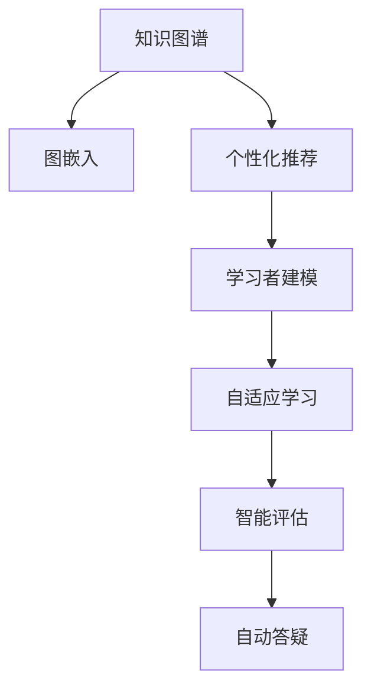

                 

# 知识的个性化：适应学习者需求的智能教育

## 1. 背景介绍

随着人工智能技术的迅猛发展，智能教育已成为教育领域的一大热点。智能教育通过人工智能技术对教学过程进行优化，实现个性化学习、智能评估和自动答疑，为学习者提供更加高效、科学的学习体验。本文将聚焦于基于知识图谱的智能教育系统，探讨其核心原理、具体操作步骤和实际应用场景，为教育领域的技术创新提供新思路。

## 2. 核心概念与联系

### 2.1 核心概念概述

为更好地理解基于知识图谱的智能教育系统，本节将介绍几个密切相关的核心概念：

- 知识图谱(Knowledge Graph)：将知识表示为图形结构的数据库，用于存储和管理结构化知识。由节点(Node)和边(Edge)组成，节点表示实体(Entity)，边表示实体之间的关系(Relationship)。

- 图嵌入(Graph Embedding)：将图结构中的节点表示为向量，用于机器学习算法的计算。常见的图嵌入方法包括节点的经典方法（如TransE、GNN等）和图的经典方法（如GraphSAGE、GAT等）。

- 个性化推荐系统(Recommendation System)：根据用户的历史行为和偏好，推荐个性化的物品或信息。常见的推荐算法包括基于内容的推荐、协同过滤推荐、基于矩阵分解的推荐等。

- 学习者建模(Learner Modeling)：构建学习者的知识结构、能力模型和兴趣偏好模型，为其提供个性化推荐和教学建议。常见的学习者建模方法包括专家系统、贝叶斯网络、深度学习等。

- 自适应学习系统(Adaptive Learning System)：根据学习者的学习状态和反馈信息，动态调整教学内容和策略，实现因材施教。常见的自适应学习框架包括规则引擎、机器学习等。

这些核心概念之间的逻辑关系可以通过以下Mermaid流程图来展示：



这个流程图展示了一个基于知识图谱的智能教育系统的核心组件及其关系：

1. 知识图谱提供结构化的知识库。
2. 图嵌入将知识节点转化为向量表示，用于机器学习。
3. 个性化推荐系统为学习者提供个性化内容。
4. 学习者建模构建学习者模型，支持个性化推荐和自适应学习。
5. 自适应学习根据学习状态动态调整策略。
6. 智能评估根据学习结果进行效果评估。
7. 自动答疑提供智能化的问题解答。

这些组件共同构成了智能教育系统的知识表示、推荐、评估和答疑过程，从而实现个性化学习。

## 3. 核心算法原理 & 具体操作步骤

### 3.1 算法原理概述

基于知识图谱的智能教育系统，通过将学习者的知识结构与知识图谱中的实体和关系进行匹配，为学习者推荐个性化的学习内容，并动态调整学习策略。其核心思想是：

1. 构建知识图谱：将各学科的知识体系化，形成结构化的知识图谱。
2. 嵌入知识节点：使用图嵌入方法将知识节点表示为向量，方便机器学习模型的处理。
3. 推荐学习内容：根据学习者的知识水平和兴趣偏好，推荐个性化的学习内容。
4. 调整学习策略：根据学习者的反馈信息，动态调整学习路径和难度。

### 3.2 算法步骤详解

基于知识图谱的智能教育系统的具体操作步骤如下：

**Step 1: 构建知识图谱**
- 收集各学科的知识体系，包括课程、章节、知识点等，形成知识图谱。
- 定义知识图谱中的实体和关系，如课程(Course)、章节(Chapter)、知识点(Knowledge Point)等。

**Step 2: 图嵌入**
- 对知识图谱进行图嵌入，将每个节点表示为一个向量。
- 常用的图嵌入方法包括TransE、GNN等，这些方法将节点和关系嵌入到低维向量空间中。

**Step 3: 学习者建模**
- 收集学习者的学习数据，如学习历史、测试成绩、问题反馈等，构建学习者模型。
- 常用的方法包括贝叶斯网络、深度学习等，使用这些方法可以构建学习者的兴趣偏好模型和知识结构模型。

**Step 4: 个性化推荐**
- 根据学习者的知识结构、兴趣偏好和当前学习状态，推荐个性化的学习内容。
- 推荐算法可以使用基于协同过滤的推荐、基于内容的推荐、矩阵分解等方法。

**Step 5: 自适应学习**
- 动态调整学习路径和难度，根据学习者的反馈信息不断优化学习策略。
- 可以使用规则引擎、机器学习等方法进行自适应学习，实时调整学习内容和难度。

**Step 6: 智能评估**
- 对学习者的学习效果进行评估，使用基于知识图谱的评估方法，如知识匹配度、问题回答正确率等。
- 可以使用自适应评估方法，根据学习者的学习进度和能力自动调整评估难度。

**Step 7: 自动答疑**
- 使用自然语言处理技术，将学习者的问题转化为知识图谱中的实体和关系，进行自动解答。
- 可以使用语义理解、知识推理等技术实现自动答疑。

### 3.3 算法优缺点

基于知识图谱的智能教育系统具有以下优点：

1. 知识表示结构化：通过知识图谱将知识体系化，方便机器学习处理。
2. 推荐更加精准：结合学习者的知识水平和兴趣偏好，推荐个性化的学习内容。
3. 学习策略自适应：动态调整学习路径和难度，提高学习效果。
4. 评估更加全面：使用知识图谱进行评估，衡量学习者的知识掌握程度。
5. 答疑实时高效：自动答疑系统提供及时、准确的答案，提高学习效率。

同时，该方法也存在以下缺点：

1. 知识图谱构建复杂：需要人工整理各学科的知识体系，工作量较大。
2. 知识更新困难：知识图谱需要定期更新，更新过程较为繁琐。
3. 推荐算法复杂：需要处理多维度的特征，算法实现较为复杂。
4. 学习策略调整难度大：需要根据学习者的反馈实时调整策略，调整过程复杂。
5. 技术实现门槛高：涉及多个领域的技术，实现难度较大。

尽管存在这些局限性，但就目前而言，基于知识图谱的智能教育方法仍具有很高的应用价值。未来相关研究的重点在于如何更好地构建和维护知识图谱，简化推荐和策略调整算法，降低技术实现门槛，以实现更加智能和高效的教育系统。

### 3.4 算法应用领域

基于知识图谱的智能教育系统已经在诸多教育场景中得到了应用，以下是几个典型应用案例：

- 智能学习平台：如Khan Academy、Coursera等，使用知识图谱提供个性化推荐和自适应学习。
- 自适应学习系统：如ALEKS、DreamBox等，根据学习者的学习状态动态调整学习路径。
- 智能评估系统：如Vision AI Education，使用知识图谱进行自适应评估。
- 自动答疑系统：如AltaVista Ed，使用知识图谱提供实时自动答疑。
- 个性化课程推荐系统：如Coursera、Udacity等，使用知识图谱推荐个性化课程。

除了上述这些经典应用外，基于知识图谱的教育技术还在不断扩展，如虚拟教师、虚拟实验室等，为教育带来新的可能性。

## 4. 数学模型和公式 & 详细讲解

### 4.1 数学模型构建

基于知识图谱的智能教育系统，涉及多个领域的技术，包括知识表示、图嵌入、推荐算法等。以下是几个核心模型的数学构建过程。

- 知识图谱：由节点(Node)和边(Edge)组成，节点表示实体(Entity)，边表示实体之间的关系(Relationship)。

- 图嵌入：使用图嵌入方法将知识节点表示为向量，方便机器学习模型的处理。常用的图嵌入方法包括TransE、GNN等，这些方法将节点和关系嵌入到低维向量空间中。

- 个性化推荐：基于协同过滤、矩阵分解等方法，使用学习者模型进行个性化推荐。假设知识图谱中有$N$个节点，$m$个边，表示为$G(V,E)$，其中$V=\{v_1,v_2,...,v_N\}$表示节点集合，$E=\{e_1,e_2,...,e_m\}$表示边集合。设$X$为节点的嵌入向量，$Y$为边的嵌入向量，$Z$为学习者的嵌入向量。则推荐算法可以表示为：

$$
\hat{v} = \arg\min_{v \in V} \lVert Xv - Yv - Z \rVert^2
$$

其中，$\lVert \cdot \rVert$表示向量的欧几里得范数，$\hat{v}$为推荐节点的嵌入向量。

### 4.2 公式推导过程

以知识匹配度为例，计算学习者知识水平与知识图谱的匹配度。设$V=\{v_1,v_2,...,v_N\}$表示知识图谱中的节点集合，$x_1,x_2,...,x_N$为节点$v_1,v_2,...,v_N$的嵌入向量，$z$为学习者的知识嵌入向量，则知识匹配度可以表示为：

$$
D(z) = \frac{\sum_{i=1}^N \lVert x_i \cdot z \rVert^2}{\sqrt{\sum_{i=1}^N \lVert x_i \rVert^2} \cdot \lVert z \rVert}
$$

其中，$\cdot$表示向量点乘，$\lVert \cdot \rVert$表示向量的欧几里得范数。知识匹配度$D(z)$越大，表示学习者的知识水平与知识图谱越匹配。

### 4.3 案例分析与讲解

以Coursera为例，Coursera使用了基于知识图谱的智能教育系统。该系统通过知识图谱将课程体系化，使用图嵌入方法将课程节点表示为向量，结合学习者的历史学习数据构建学习者模型，使用协同过滤算法推荐个性化的课程，根据学习者的反馈动态调整课程推荐策略。Coursera的成功经验表明，基于知识图谱的智能教育系统可以显著提高学习效果和用户满意度。

## 5. 项目实践：代码实例和详细解释说明

### 5.1 开发环境搭建

在进行知识图谱驱动的智能教育系统开发前，我们需要准备好开发环境。以下是使用Python进行PyTorch开发的环境配置流程：

1. 安装Anaconda：从官网下载并安装Anaconda，用于创建独立的Python环境。

2. 创建并激活虚拟环境：
```bash
conda create -n pytorch-env python=3.8 
conda activate pytorch-env
```

3. 安装PyTorch：根据CUDA版本，从官网获取对应的安装命令。例如：
```bash
conda install pytorch torchvision torchaudio cudatoolkit=11.1 -c pytorch -c conda-forge
```

4. 安装Graph Neural Network库：
```bash
pip install pyg nnpy torch-graph-network
```

5. 安装各类工具包：
```bash
pip install numpy pandas scikit-learn matplotlib tqdm jupyter notebook ipython
```

完成上述步骤后，即可在`pytorch-env`环境中开始开发实践。

### 5.2 源代码详细实现

这里我们以知识匹配度计算为例，给出使用PyTorch进行知识图谱中的节点匹配度计算的PyTorch代码实现。

首先，定义知识图谱中的节点和边的嵌入向量：

```python
import torch
import torch.nn as nn
import torch.nn.functional as F

# 定义节点和边的嵌入向量
x = torch.randn(100, 64)  # 假设知识图谱中有100个节点，每个节点的嵌入向量维度为64
y = torch.randn(100, 64)  # 假设知识图谱中有100个节点，每个节点的嵌入向量维度为64
z = torch.randn(64)       # 假设学习者的知识嵌入向量维度为64
```

然后，计算学习者知识水平与知识图谱的匹配度：

```python
# 计算知识匹配度
dot_product = x @ z
norm_product = F.normalize(x, dim=1) @ F.normalize(x, dim=1)
dot_product = dot_product * norm_product
matching度的 = torch.sum(dot_product) / torch.sqrt(torch.sum(norm_product) * torch.norm(z) ** 2)
```

最后，输出学习者的知识匹配度：

```python
print("知识匹配度：", matching度的.item())
```

以上就是使用PyTorch进行知识图谱中的节点匹配度计算的完整代码实现。可以看到，PyTorch配合图形网络库，使得知识图谱的计算变得简洁高效。

### 5.3 代码解读与分析

让我们再详细解读一下关键代码的实现细节：

**节点和边的嵌入向量**：
- `torch.randn`：生成随机向量，用于表示节点和边的嵌入。

**知识匹配度计算**：
- `@`：矩阵乘法，计算节点和嵌入向量点乘。
- `torch.sum`：计算向量点乘的平方和。
- `torch.sqrt`：计算向量的平方根。
- `torch.norm`：计算向量的范数。
- `torch.tensor`：将标量转换为张量。

**输出学习者的知识匹配度**：
- `item()`：将张量转换为标量，方便输出。

可以看到，PyTorch配合图形网络库，使得知识图谱的计算变得简洁高效。

## 6. 实际应用场景

### 6.1 智能学习平台

基于知识图谱的智能学习平台，可以为学习者提供个性化的学习推荐和自适应学习策略。例如，Khan Academy使用知识图谱构建课程体系，使用图嵌入方法将课程节点表示为向量，结合学习者的历史学习数据构建学习者模型，使用协同过滤算法推荐个性化的课程，根据学习者的反馈动态调整课程推荐策略。智能学习平台可以显著提高学习效果和用户满意度。

### 6.2 自适应学习系统

自适应学习系统可以根据学习者的学习状态和反馈信息，动态调整教学内容和策略，实现因材施教。例如，ALEKS使用知识图谱构建课程体系，使用图嵌入方法将课程节点表示为向量，结合学习者的历史学习数据构建学习者模型，使用基于内容的推荐算法推荐个性化的学习内容，根据学习者的反馈动态调整学习路径和难度。自适应学习系统可以显著提高学习效果和教学质量。

### 6.3 智能评估系统

智能评估系统可以根据学习者的学习结果进行效果评估，使用知识图谱进行自适应评估。例如，Vision AI Education使用知识图谱构建评估体系，使用图嵌入方法将评估节点表示为向量，结合学习者的学习数据构建学习者模型，使用基于知识匹配度的评估方法，评估学习者的知识掌握程度。智能评估系统可以显著提高评估的准确性和公平性。

### 6.4 未来应用展望

随着知识图谱技术和机器学习算法的不断发展，基于知识图谱的智能教育系统将有更广阔的应用前景。未来，该系统有望在以下几个方面进一步扩展：

- 知识图谱自动化构建：使用自动化工具和数据挖掘技术，自动构建知识图谱，减少人工干预。
- 多模态知识融合：结合视觉、语音、文本等多种信息，构建更加全面的知识图谱。
- 深度个性化推荐：使用深度学习算法，结合学习者的行为数据，进行深度个性化推荐。
- 自适应学习策略：结合机器学习和规则引擎，构建更加智能的自适应学习策略。
- 实时智能答疑：结合自然语言处理和知识推理技术，实现实时智能答疑。

这些方向的探索，将进一步推动基于知识图谱的智能教育系统的发展，为学习者提供更加智能、高效、个性化的学习体验。

## 7. 工具和资源推荐

### 7.1 学习资源推荐

为了帮助开发者系统掌握基于知识图谱的智能教育系统的理论基础和实践技巧，这里推荐一些优质的学习资源：

1. 《深度学习》系列博文：由大模型技术专家撰写，深入浅出地介绍了深度学习原理和算法，适合初学者和进阶者。

2. CS229《机器学习》课程：斯坦福大学开设的机器学习明星课程，有Lecture视频和配套作业，带你系统学习机器学习的基础知识和经典算法。

3. 《Graph Neural Networks》书籍：该书系统介绍了图神经网络的原理、算法和应用，适合研究者和工程师阅读。

4. Google Scholar：学术搜索引擎，搜索并阅读最新的研究论文，获取前沿知识和技术。

5. GitHub：开源代码平台，搜索和下载基于知识图谱的智能教育系统的代码和项目，进行学习和实践。

通过对这些资源的学习实践，相信你一定能够快速掌握基于知识图谱的智能教育系统的精髓，并用于解决实际的NLP问题。

### 7.2 开发工具推荐

高效的开发离不开优秀的工具支持。以下是几款用于基于知识图谱的智能教育系统开发的常用工具：

1. PyTorch：基于Python的开源深度学习框架，灵活动态的计算图，适合快速迭代研究。大部分预训练语言模型都有PyTorch版本的实现。

2. TensorFlow：由Google主导开发的开源深度学习框架，生产部署方便，适合大规模工程应用。同样有丰富的预训练语言模型资源。

3. PyG：PyTorch的图形网络扩展，用于构建图形模型，方便图结构的计算和处理。

4. Weights & Biases：模型训练的实验跟踪工具，可以记录和可视化模型训练过程中的各项指标，方便对比和调优。与主流深度学习框架无缝集成。

5. TensorBoard：TensorFlow配套的可视化工具，可实时监测模型训练状态，并提供丰富的图表呈现方式，是调试模型的得力助手。

6. Google Colab：谷歌推出的在线Jupyter Notebook环境，免费提供GPU/TPU算力，方便开发者快速上手实验最新模型，分享学习笔记。

合理利用这些工具，可以显著提升基于知识图谱的智能教育系统的开发效率，加快创新迭代的步伐。

### 7.3 相关论文推荐

基于知识图谱的智能教育系统的发展源于学界的持续研究。以下是几篇奠基性的相关论文，推荐阅读：

1. Knowledge Graphs: Creating, Populating, Querying and Using Knowledge Graphs in a Web Context：该论文介绍了知识图谱的构建和应用，为后续研究提供了重要基础。

2. A Survey of Graph Neural Networks：该论文全面介绍了图神经网络的发展历程和应用领域，为研究者和工程师提供了参考。

3. Deep Learning with Graph Neural Networks：该论文介绍了深度学习与图神经网络结合的技术和应用，适合研究者和工程师阅读。

4. Semi-Supervised Sequence Labeling with Graph Neural Networks：该论文介绍了基于图神经网络的知识图谱应用，适合研究者和工程师阅读。

这些论文代表了大模型微调技术的发展脉络。通过学习这些前沿成果，可以帮助研究者把握学科前进方向，激发更多的创新灵感。

## 8. 总结：未来发展趋势与挑战

### 8.1 总结

本文对基于知识图谱的智能教育系统进行了全面系统的介绍。首先阐述了基于知识图谱的智能教育系统的研究背景和意义，明确了知识图谱在构建个性化推荐、自适应学习、智能评估和自动答疑过程中的重要作用。其次，从原理到实践，详细讲解了知识图谱的构建、图嵌入、个性化推荐、学习者建模、自适应学习、智能评估和自动答疑等核心步骤，给出了知识匹配度的计算公式。同时，本文还广泛探讨了基于知识图谱的教育技术在智能学习平台、自适应学习系统、智能评估系统和自动答疑系统等教育场景中的应用前景，展示了基于知识图谱的智能教育系统的巨大潜力。

通过本文的系统梳理，可以看到，基于知识图谱的智能教育系统正在成为教育领域的重要范式，极大地提升了教学过程的智能化水平，为学习者提供更加高效、个性化的学习体验。未来，伴随知识图谱技术和机器学习算法的不断发展，基于知识图谱的智能教育系统必将为教育领域带来更深刻的变革。

### 8.2 未来发展趋势

展望未来，基于知识图谱的智能教育系统将呈现以下几个发展趋势：

1. 知识图谱自动化构建：使用自动化工具和数据挖掘技术，自动构建知识图谱，减少人工干预。
2. 多模态知识融合：结合视觉、语音、文本等多种信息，构建更加全面的知识图谱。
3. 深度个性化推荐：使用深度学习算法，结合学习者的行为数据，进行深度个性化推荐。
4. 自适应学习策略：结合机器学习和规则引擎，构建更加智能的自适应学习策略。
5. 实时智能答疑：结合自然语言处理和知识推理技术，实现实时智能答疑。

这些趋势凸显了基于知识图谱的智能教育系统的广阔前景。这些方向的探索发展，将进一步提升基于知识图谱的智能教育系统的性能和应用范围，为教育领域带来更深刻的变革。

### 8.3 面临的挑战

尽管基于知识图谱的智能教育系统已经取得了瞩目成就，但在迈向更加智能化、普适化应用的过程中，它仍面临着诸多挑战：

1. 知识图谱构建复杂：需要人工整理各学科的知识体系，工作量较大。
2. 知识更新困难：知识图谱需要定期更新，更新过程较为繁琐。
3. 推荐算法复杂：需要处理多维度的特征，算法实现较为复杂。
4. 学习策略调整难度大：需要根据学习者的反馈实时调整策略，调整过程复杂。
5. 技术实现门槛高：涉及多个领域的技术，实现难度较大。

尽管存在这些挑战，但就目前而言，基于知识图谱的智能教育方法仍具有很高的应用价值。未来相关研究的重点在于如何更好地构建和维护知识图谱，简化推荐和策略调整算法，降低技术实现门槛，以实现更加智能和高效的教育系统。

### 8.4 研究展望

面对基于知识图谱的智能教育系统所面临的种种挑战，未来的研究需要在以下几个方面寻求新的突破：

1. 探索知识图谱自动化构建方法：使用自动化工具和数据挖掘技术，自动构建知识图谱，减少人工干预。

2. 研究多模态知识融合方法：结合视觉、语音、文本等多种信息，构建更加全面的知识图谱。

3. 开发深度个性化推荐算法：使用深度学习算法，结合学习者的行为数据，进行深度个性化推荐。

4. 构建自适应学习策略：结合机器学习和规则引擎，构建更加智能的自适应学习策略。

5. 结合自然语言处理和知识推理技术：实现实时智能答疑，提高学习效率和效果。

这些研究方向的探索，必将引领基于知识图谱的智能教育系统迈向更高的台阶，为教育领域带来更深刻的变革。面向未来，基于知识图谱的智能教育技术还需要与其他人工智能技术进行更深入的融合，如知识表示、因果推理、强化学习等，多路径协同发力，共同推动自然语言理解和智能交互系统的进步。只有勇于创新、敢于突破，才能不断拓展语言模型的边界，让智能技术更好地造福人类社会。

## 9. 附录：常见问题与解答

**Q1：知识图谱如何构建？**

A: 知识图谱的构建需要人工整理各学科的知识体系，将课程、章节、知识点等抽象成节点和边，存储在数据库中。常用的构建工具包括Protege、Neo4j等，可以自动生成可视化界面，方便用户进行知识图谱的构建和维护。

**Q2：知识图谱如何更新？**

A: 知识图谱需要定期更新，以反映最新的知识体系。更新过程可以分为离线更新和在线更新两种方式。离线更新方式需要将新的知识信息手动添加到知识图谱中；在线更新方式可以通过数据挖掘、爬虫等自动化工具，实时更新知识图谱中的知识节点和边。

**Q3：个性化推荐算法有哪些？**

A: 个性化推荐算法有多种，包括基于协同过滤的推荐、基于内容的推荐、基于矩阵分解的推荐等。在实际应用中，可以结合多种推荐算法，提高推荐效果。常用的推荐算法包括ALS、BPR、FM等。

**Q4：如何优化学习策略？**

A: 学习策略的优化需要结合机器学习和规则引擎，构建更加智能的自适应学习策略。常用的优化方法包括基于规则的策略、基于模型的策略等。

**Q5：知识图谱如何与自然语言处理结合？**

A: 知识图谱与自然语言处理可以结合使用，实现智能问答、自动答疑等功能。可以通过语义理解、知识推理等技术，将学习者的问题转化为知识图谱中的实体和关系，进行自动解答。常用的技术包括RNN、LSTM、BERT等。

这些常见问题的解答，希望能帮助你更好地理解基于知识图谱的智能教育系统，为后续的研究和实践提供参考。

---

作者：禅与计算机程序设计艺术 / Zen and the Art of Computer Programming

