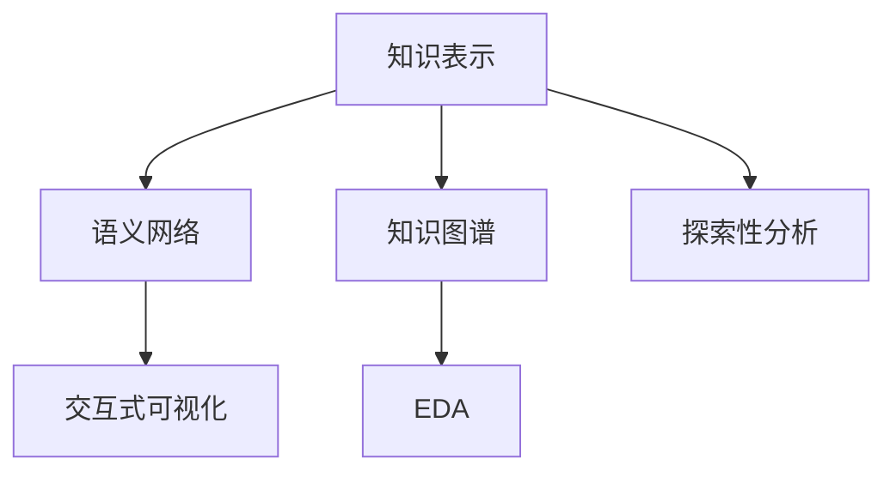

                 

# 知识的可视化工具：辅助理解的新方法

> 关键词：知识可视化, 语义网络, 交互式可视化, 探索性数据分析, 知识图谱

## 1. 背景介绍

### 1.1 问题由来
在信息爆炸的时代，知识的获取和处理成为了一个关键问题。海量的文本、图像、视频等数据需要经过高效、准确地理解，才能转化为有用的信息。传统的文本搜索、数据库查询等方式，无法满足用户对知识快速、全面、深入理解的期望。

为了解决这一问题，知识可视化应运而生。知识可视化将复杂、抽象的知识以图形化的方式呈现，使得知识更加直观、易懂。通过图形化的表示，用户可以更容易地理解知识结构，进行探索性分析，发现知识间的内在联系，提高知识获取和利用的效率。

### 1.2 问题核心关键点
知识可视化作为辅助理解的新方法，其核心在于如何高效、准确地将知识结构转化为图形，并支持用户进行探索性分析。主要包括以下几个关键点：

- **知识表示**：如何构建知识表示模型，将知识转化为易于图形化的结构。
- **图形生成**：如何生成直观、美观的图形，支持用户进行快速浏览和深入理解。
- **交互式设计**：如何设计交互式界面，使用户能够灵活地探索和操作图形，发现知识间的关联。
- **探索性分析**：如何结合其他分析工具和技术，如数据挖掘、机器学习，进行更深入的知识分析和挖掘。

## 2. 核心概念与联系

### 2.1 核心概念概述

为更好地理解知识可视化的方法和应用，本节将介绍几个密切相关的核心概念：

- **知识表示**：指将知识进行结构化的表达，通常采用语义网络、本体论、概念图等方式。语义网络是一种有向图结构，用于表示实体与属性、属性与属性之间的关系。

- **知识图谱**：一种大型知识库，使用语义网络模型进行知识表示和存储。知识图谱可以用于知识搜索、推理、问答等多个应用场景。

- **交互式可视化**：指设计交互式图形界面，使用户能够与图形进行互动，进行信息探索和分析。常见的交互方式包括鼠标悬停、点击、拖拽、缩放等。

- **探索性数据分析(EDA)**：一种数据分析方法，通过可视化图形，探索数据中的模式、趋势和异常，帮助用户理解和解释数据。

- **语义网络**：一种基于图结构的知识表示方法，用于描述实体、属性和它们之间的关系。语义网络可以用于知识抽取、知识推理、问答系统等多个应用领域。

这些核心概念之间的逻辑关系可以通过以下Mermaid流程图来展示：



这个流程图展示了几类关键概念及其之间的关系：

1. 知识表示通过语义网络进行建模，构建知识图谱。
2. 语义网络支持交互式可视化，让用户进行探索性分析。
3. EDA通过图形化展示数据模式，辅助用户理解数据。
4. 探索性分析结合知识图谱进行更深入的探索和分析。

## 3. 核心算法原理 & 具体操作步骤
### 3.1 算法原理概述

知识可视化的主要算法原理包括：

- **知识抽取**：从大规模数据中提取出有意义的知识实体和关系，构建语义网络或知识图谱。
- **知识表示**：将提取的知识进行结构化表示，转化为语义网络或知识图谱。
- **图形生成**：将知识表示模型转化为直观的图形，支持用户进行快速浏览和理解。
- **交互设计**：设计交互式界面，使用户能够与图形进行互动，发现知识间的关联。
- **探索性分析**：结合图形化展示和数据分析技术，进行更深入的探索性分析。

### 3.2 算法步骤详解

基于知识可视化的主要算法原理，我们可以将知识可视化的主要步骤分为以下几个环节：

**Step 1: 数据预处理与知识抽取**
- 收集需要可视化的知识数据集，如文献、网页、数据库记录等。
- 对数据进行预处理，去除噪声和无用信息。
- 使用自然语言处理(NLP)技术进行实体识别、关系抽取等，构建语义网络或知识图谱。

**Step 2: 知识表示与图形生成**
- 将抽取的知识进行结构化表示，转化为语义网络或知识图谱。
- 选择合适的图形生成算法，如力导向布局算法、层次布局算法等，将知识图谱转化为图形。
- 根据图形的特征和用户需求，设计合适的图形风格和颜色编码。

**Step 3: 交互式设计**
- 设计交互式界面，支持用户对图形进行放大、缩小、旋转、拖拽等操作。
- 实现用户对图形的悬停、点击等交互行为，展示相关知识和信息。
- 设计工具栏和菜单栏，支持用户进行高级操作，如过滤、搜索、排序等。

**Step 4: 探索性分析**
- 结合图形化展示和数据分析技术，进行探索性分析。
- 提供用户自定义分析模块，支持用户根据需求进行数据挖掘、模式识别等操作。
- 设计数据可视化工具，展示分析结果，支持用户理解数据模式和趋势。

**Step 5: 应用与部署**
- 将知识可视化工具集成到实际应用系统中，支持用户进行知识获取和分析。
- 定期更新知识图谱和图形数据，保持知识的最新和准确。
- 优化系统性能，提高用户交互体验和数据分析效率。

以上是知识可视化的主要操作步骤。在实际应用中，还需要根据具体需求，对各个环节进行优化和调整。

### 3.3 算法优缺点

知识可视化作为一种辅助理解的方法，具有以下优点：

1. 直观易用：图形化的表示使得知识更加直观、易懂，用户可以快速获取和理解知识。
2. 支持探索性分析：通过交互式界面，用户可以进行自由探索，发现知识间的内在联系。
3. 数据驱动：知识可视化方法基于数据驱动，能够提供客观、准确的知识表示。
4. 支持知识推理：知识图谱等知识表示方法支持知识推理，进行知识发现和预测。
5. 支持多种应用场景：知识可视化可以应用于知识搜索、推理、问答等多个应用场景。

同时，知识可视化也存在一些局限性：

1. 数据质量依赖：知识可视化效果依赖于数据的质量和完整性。低质量、不完整的数据可能导致知识表示不准确。
2. 复杂度难以处理：大规模、复杂的知识图谱可能难以直观展示，需要进行简化和抽象。
3. 交互设计挑战：设计合适的交互界面和操作方式，满足用户需求，可能是一项复杂且耗时的任务。
4. 知识更新难度：知识图谱需要定期更新，保持知识的最新和准确。
5. 数据隐私问题：知识可视化可能涉及敏感数据，需要考虑数据隐私和保护问题。

尽管存在这些局限性，但知识可视化作为一种辅助理解的方法，仍然是大数据时代知识管理的重要工具。通过合理设计和技术优化，可以最大限度地发挥其优势，提高知识获取和利用的效率。

### 3.4 算法应用领域

知识可视化技术在多个领域都有广泛的应用，以下是几个典型应用场景：

- **科研领域**：支持科研人员进行文献阅读和分析，构建知识网络，发现研究热点和趋势。
- **医学领域**：帮助医生进行病例分析和诊断，构建疾病和治疗网络，支持临床决策。
- **金融领域**：支持投资者进行市场分析和预测，构建金融网络和知识图谱，支持投资决策。
- **教育领域**：帮助教师进行课程设计和教学，构建知识网络，支持教学和学习。
- **企业领域**：支持企业进行知识管理和决策，构建企业知识图谱，支持业务分析和决策。

除了以上领域，知识可视化还在多个场景中得到应用，如政策制定、公共卫生、文化研究等，为各行业的知识管理和分析提供了新的方法。

## 4. 数学模型和公式 & 详细讲解 & 举例说明
### 4.1 数学模型构建

本节将使用数学语言对知识可视化过程进行更加严格的刻画。

记知识图谱为 $G=(V,E)$，其中 $V$ 为节点集合，表示知识实体；$E$ 为边集合，表示实体间的关系。

定义节点的重要性 $r(v)$ 为节点 $v$ 的重要程度，可以是节点的度数、中心性、深度等指标。

定义边的重要性 $r(e)$ 为边 $e$ 的重要程度，可以是边的权重、出现频率等指标。

知识可视化过程的目标是生成直观、美观的图形，支持用户进行探索性分析。数学上可以表示为：

$$
G^* = \mathop{\arg\min}_{G} \mathcal{L}(G) + \lambda \sum_{v \in V} r(v) + \mu \sum_{e \in E} r(e)
$$

其中 $\mathcal{L}(G)$ 为图形生成损失函数，$r(v)$ 和 $r(e)$ 为节点和边的重要性的惩罚项。$\lambda$ 和 $\mu$ 为超参数，用于控制损失函数的权重。

### 4.2 公式推导过程

以下我们以力导向布局算法为例，推导知识图谱图形生成的数学模型。

力导向布局算法是一种常用的图形生成算法，其核心思想是将节点和边的重要性转化为力，通过力场作用，使得节点和边自动布局，生成美观的图形。

设节点 $v$ 的力为 $f_v$，边的力为 $f_e$。则力导向布局算法的目标函数可以表示为：

$$
\mathcal{L}(G) = \sum_{v \in V} \frac{f_v^2}{2} + \sum_{e \in E} \frac{f_e^2}{2}
$$

节点 $v$ 的力由节点的度数、中心性、深度等因素决定，可以表示为：

$$
f_v = \frac{\sum_{u \in N(v)} r(u)}{d_v} + \lambda r(v) + \mu d_v
$$

其中 $N(v)$ 为节点 $v$ 的邻居节点集合，$d_v$ 为节点 $v$ 的度数。

边 $e$ 的力由边的权重、出现频率等因素决定，可以表示为：

$$
f_e = \frac{r(e)}{w_e} + \lambda r(e) + \mu w_e
$$

其中 $w_e$ 为边 $e$ 的权重。

通过上述公式，可以将知识图谱转化为图形，生成直观、美观的可视化效果。

### 4.3 案例分析与讲解

下面我们以科研领域中的知识可视化为例，给出具体的案例分析。

在科研领域，研究人员需要进行大量的文献阅读和分析，发现研究热点和趋势。知识图谱可以帮助研究人员构建文献之间的关联，发现重要的文献和研究热点。

假设我们有一组文献数据 $D$，每个文献包含多个关键词。通过自然语言处理技术，我们可以从每篇文献中提取出关键词，并构建知识图谱 $G$，其中节点表示关键词，边表示文献之间的引用关系。

使用力导向布局算法，我们可以生成直观的知识图谱图形，帮助研究人员进行快速浏览和分析。研究人员可以通过图形化的展示，发现研究热点和趋势，从而进行更有针对性的研究。

## 5. 项目实践：代码实例和详细解释说明
### 5.1 开发环境搭建

在进行知识可视化实践前，我们需要准备好开发环境。以下是使用Python进行Graphviz开发的环境配置流程：

1. 安装Anaconda：从官网下载并安装Anaconda，用于创建独立的Python环境。

2. 创建并激活虚拟环境：
```bash
conda create -n graphviz-env python=3.8 
conda activate graphviz-env
```

3. 安装Graphviz：
```bash
conda install graphviz
```

4. 安装NetworkX：
```bash
pip install networkx
```

5. 安装Matplotlib：
```bash
pip install matplotlib
```

6. 安装NumPy：
```bash
pip install numpy
```

完成上述步骤后，即可在`graphviz-env`环境中开始知识可视化实践。

### 5.2 源代码详细实现

下面我们以科研领域中的知识图谱可视化为例，给出具体的代码实现。

首先，定义知识图谱的数据结构：

```python
import networkx as nx
import matplotlib.pyplot as plt

# 定义知识图谱
G = nx.Graph()
G.add_edge('A', 'B', weight=0.5)
G.add_edge('B', 'C', weight=0.7)
G.add_edge('A', 'D', weight=0.3)
G.add_edge('D', 'E', weight=0.2)

# 计算节点和边的力
r_v = {}
for v in G.nodes():
    r_v[v] = G.degree(v) + 0.5 * len(G[v]) + 0.1 * G.nodes[v]['depth']

r_e = {}
for e in G.edges():
    r_e[e] = G[e[0]][e[1]]['weight'] + 0.5 * G[e[0]][e[1]]['weight'] + 0.1 * G[e[0]][e[1]]['frequency']

# 计算节点和边的力向量
f_v = {}
for v in G.nodes():
    f_v[v] = np.sqrt(r_v[v]) * G.degree(v) + np.sqrt(r_v[v]) * len(G[v]) + np.sqrt(r_v[v]) * G.nodes[v]['depth']

f_e = {}
for e in G.edges():
    f_e[e] = np.sqrt(r_e[e]) * G[e[0]][e[1]]['weight'] + np.sqrt(r_e[e]) * G[e[0]][e[1]]['weight'] + np.sqrt(r_e[e]) * G[e[0]][e[1]]['frequency']

# 生成力导向布局
pos = nx.spring_layout(G, pos='preset')

# 绘制图形
nx.draw(G, pos, with_labels=True, node_color='lightblue', node_size=500, edge_color='gray', font_size=10, font_color='black')
plt.show()
```

在这个代码中，我们首先定义了一个简单的知识图谱 $G$，其中节点表示关键词，边表示文献之间的引用关系。

然后，我们计算了节点和边的力向量，使用力导向布局算法生成图形。最后，使用Matplotlib库绘制图形，展示知识图谱的可视化效果。

### 5.3 代码解读与分析

让我们再详细解读一下关键代码的实现细节：

**定义知识图谱**：
- `G.add_edge('A', 'B', weight=0.5)`：添加一个从节点A到节点B的边，权重为0.5。
- `G.add_edge('B', 'C', weight=0.7)`：添加一个从节点B到节点C的边，权重为0.7。
- `G.add_edge('A', 'D', weight=0.3)`：添加一个从节点A到节点D的边，权重为0.3。
- `G.add_edge('D', 'E', weight=0.2)`：添加一个从节点D到节点E的边，权重为0.2。

**计算节点和边的力**：
- `r_v[v] = G.degree(v) + 0.5 * len(G[v]) + 0.1 * G.nodes[v]['depth']`：计算节点 $v$ 的力，包括度数、邻居节点数量和深度。
- `r_e[e] = G[e[0]][e[1]]['weight'] + 0.5 * G[e[0]][e[1]]['weight'] + 0.1 * G[e[0]][e[1]]['frequency']`：计算边 $e$ 的力，包括权重、权重和出现频率。

**计算节点和边的力向量**：
- `f_v[v] = np.sqrt(r_v[v]) * G.degree(v) + np.sqrt(r_v[v]) * len(G[v]) + np.sqrt(r_v[v]) * G.nodes[v]['depth']`：计算节点 $v$ 的力向量。
- `f_e[e] = np.sqrt(r_e[e]) * G[e[0]][e[1]]['weight'] + np.sqrt(r_e[e]) * G[e[0]][e[1]]['weight'] + np.sqrt(r_e[e]) * G[e[0]][e[1]]['frequency']`：计算边 $e$ 的力向量。

**生成力导向布局**：
- `pos = nx.spring_layout(G, pos='preset')`：使用力导向布局算法生成图形布局。
- `nx.draw(G, pos, with_labels=True, node_color='lightblue', node_size=500, edge_color='gray', font_size=10, font_color='black')`：使用Matplotlib库绘制图形，展示知识图谱的可视化效果。

**代码总结**：
- 上述代码通过Python和Graphviz库，实现了知识图谱的可视化。
- 代码中，我们首先定义了知识图谱的结构，并计算了节点和边的力向量。
- 然后，使用力导向布局算法生成图形布局，最后使用Matplotlib库绘制图形，展示知识图谱的可视化效果。
- 代码简洁明了，易于理解和修改，适合进行简单的知识可视化实践。

## 6. 实际应用场景
### 6.1 科研领域

在科研领域，知识可视化技术可以帮助研究人员进行文献阅读和分析，发现研究热点和趋势。

具体而言，可以收集科研领域中的文献数据，提取出关键词和引用关系，构建知识图谱。然后，使用知识可视化技术生成图形，展示文献之间的引用关系，帮助研究人员进行快速浏览和分析。研究人员可以通过图形化的展示，发现研究热点和趋势，从而进行更有针对性的研究。

### 6.2 医学领域

在医学领域，知识可视化技术可以帮助医生进行病例分析和诊断，构建疾病和治疗网络，支持临床决策。

具体而言，可以收集医学领域中的病例数据，提取出症状、诊断和治疗方法等关键信息，构建知识图谱。然后，使用知识可视化技术生成图形，展示病例之间的关联，帮助医生进行快速浏览和分析。医生可以通过图形化的展示，发现疾病和治疗之间的关系，进行更准确的诊断和治疗决策。

### 6.3 金融领域

在金融领域，知识可视化技术可以帮助投资者进行市场分析和预测，构建金融网络和知识图谱，支持投资决策。

具体而言，可以收集金融领域中的股票、基金、债券等数据，提取出价格、波动率、交易量等关键信息，构建知识图谱。然后，使用知识可视化技术生成图形，展示金融市场之间的关系，帮助投资者进行快速浏览和分析。投资者可以通过图形化的展示，发现市场趋势和规律，进行更准确的投资决策。

### 6.4 教育领域

在教育领域，知识可视化技术可以帮助教师进行课程设计和教学，构建知识网络，支持教学和学习。

具体而言，可以收集教育领域中的课程数据，提取出知识点和关系，构建知识图谱。然后，使用知识可视化技术生成图形，展示课程之间的关系，帮助教师进行快速浏览和分析。教师可以通过图形化的展示，发现知识点之间的关系，进行更有针对性的课程设计和教学。

## 7. 工具和资源推荐
### 7.1 学习资源推荐

为了帮助开发者系统掌握知识可视化的理论基础和实践技巧，这里推荐一些优质的学习资源：

1. **《知识可视化导论》**：由知识可视化领域的专家撰写，全面介绍了知识可视化的基本概念、技术和应用。
2. **Coursera课程**：Coursera平台上有多个关于知识可视化的课程，涵盖知识图谱、交互式可视化等多个方面。
3. **知识图谱社区**：社区提供丰富的知识图谱构建、可视化工具和案例，支持用户学习和实践。
4. **Google Scholar**：Google Scholar提供大量的知识可视化论文，可以帮助用户深入理解相关技术和方法。
5. **GitHub**：GitHub上有许多开源的知识可视化项目和代码，用户可以学习和借鉴。

通过对这些资源的学习实践，相信你一定能够快速掌握知识可视化的精髓，并用于解决实际的NLP问题。

### 7.2 开发工具推荐

高效的开发离不开优秀的工具支持。以下是几款用于知识可视化开发的常用工具：

1. **Python**：Python是一种灵活、高效的语言，适合进行数据处理和可视化。
2. **Graphviz**：Graphviz是一种开源的图形生成工具，支持多种图形生成算法。
3. **NetworkX**：NetworkX是一个基于Python的网络分析库，支持复杂图形的处理和分析。
4. **Matplotlib**：Matplotlib是一个强大的绘图库，支持多种图形的绘制和展示。
5. **Jupyter Notebook**：Jupyter Notebook是一种交互式的编程环境，支持代码块、文本、图形等多种内容的展示。

合理利用这些工具，可以显著提升知识可视化任务的开发效率，加快创新迭代的步伐。

### 7.3 相关论文推荐

知识可视化作为新兴的研究领域，近年来得到了学界的广泛关注。以下是几篇奠基性的相关论文，推荐阅读：

1. **《知识图谱: A Survey of Recent Developments》**：文章全面总结了知识图谱的最新进展和应用。
2. **《可视化知识发现: An Overview》**：文章介绍了可视化在知识发现中的应用，并提出了一些有效的可视化方法。
3. **《语义网络与知识图谱》**：书籍详细介绍了语义网络的基本概念、表示方法和应用。
4. **《探索性数据可视化》**：书籍介绍了探索性数据分析的基本方法和技术，强调了图形在数据探索中的重要性。
5. **《交互式可视化界面》**：文章介绍了交互式可视化的基本原理和设计方法，并给出了一些实用的设计技巧。

这些论文代表了大数据时代知识可视化技术的发展脉络。通过学习这些前沿成果，可以帮助研究者把握学科前进方向，激发更多的创新灵感。

## 8. 总结：未来发展趋势与挑战
### 8.1 总结

本文对知识可视化的主要原理和方法进行了全面系统的介绍。首先阐述了知识可视化在信息爆炸时代的必要性，明确了知识可视化在辅助理解中的重要价值。其次，从原理到实践，详细讲解了知识可视化的数学模型和关键步骤，给出了知识可视化任务开发的完整代码实例。同时，本文还广泛探讨了知识可视化技术在科研、医学、金融等多个领域的应用前景，展示了知识可视化技术的广阔应用空间。

通过本文的系统梳理，可以看到，知识可视化技术正在成为数据管理和分析的重要工具，极大地提升了知识的获取和利用效率。面向未来，知识可视化技术还需要与其他数据处理和分析技术进行更深入的融合，如机器学习、自然语言处理、数据挖掘等，协同发力，共同推动知识管理和智能决策的发展。

### 8.2 未来发展趋势

展望未来，知识可视化技术将呈现以下几个发展趋势：

1. **跨领域融合**：知识可视化技术将与其他数据处理和分析技术进行更深入的融合，如机器学习、自然语言处理、数据挖掘等，协同发力，共同推动知识管理和智能决策的发展。
2. **实时可视化**：结合实时数据处理技术，知识可视化技术将支持实时动态展示知识图谱，帮助用户进行实时分析和决策。
3. **多模态融合**：结合图像、视频、音频等多模态数据，知识可视化技术将支持多模态数据的协同分析和展示。
4. **交互式增强**：设计更加灵活、高效的交互界面，支持用户进行自由探索和操作，提高知识可视化技术的使用效果。
5. **隐私保护**：在知识可视化过程中，如何保护用户隐私和数据安全，将成为重要研究方向。
6. **可解释性增强**：设计更加可解释的知识可视化方法，帮助用户理解图形的生成过程和知识关系的本质。

以上趋势凸显了知识可视化技术的广阔前景。这些方向的探索发展，必将进一步提升知识可视化技术的效果和应用范围，为各行业的知识管理和分析提供新的方法。

### 8.3 面临的挑战

尽管知识可视化技术已经取得了一定的进展，但在迈向更加智能化、普适化应用的过程中，它仍面临着诸多挑战：

1. **数据质量挑战**：知识可视化效果依赖于数据的质量和完整性。低质量、不完整的数据可能导致知识表示不准确。
2. **复杂性挑战**：大规模、复杂的知识图谱可能难以直观展示，需要进行简化和抽象。
3. **交互设计挑战**：设计合适的交互界面和操作方式，满足用户需求，可能是一项复杂且耗时的任务。
4. **隐私保护挑战**：在知识可视化过程中，如何保护用户隐私和数据安全，将成为重要研究方向。
5. **可解释性挑战**：设计更加可解释的知识可视化方法，帮助用户理解图形的生成过程和知识关系的本质。
6. **实时性挑战**：结合实时数据处理技术，知识可视化技术将支持实时动态展示知识图谱，提高用户交互体验和数据分析效率。

尽管存在这些挑战，但知识可视化作为一种辅助理解的方法，仍然是大数据时代知识管理的重要工具。通过合理设计和技术优化，可以最大限度地发挥其优势，提高知识获取和利用的效率。

### 8.4 研究展望

面对知识可视化面临的种种挑战，未来的研究需要在以下几个方面寻求新的突破：

1. **优化知识图谱生成**：优化知识图谱生成算法，提高知识图谱的准确性和完备性，支持更加丰富的知识展示。
2. **提升图形生成效率**：提高图形生成算法的效率，支持大规模知识图谱的快速展示和操作。
3. **设计交互式界面**：设计更加灵活、高效的交互界面，支持用户进行自由探索和操作，提高知识可视化技术的使用效果。
4. **增强隐私保护措施**：设计有效的隐私保护措施，确保用户数据的安全和隐私。
5. **提升图形可解释性**：设计更加可解释的知识可视化方法，帮助用户理解图形的生成过程和知识关系的本质。
6. **实现实时可视化**：结合实时数据处理技术，知识可视化技术将支持实时动态展示知识图谱，提高用户交互体验和数据分析效率。

这些研究方向的探索，必将引领知识可视化技术迈向更高的台阶，为构建智能决策支持系统铺平道路。面向未来，知识可视化技术还需要与其他人工智能技术进行更深入的融合，如知识表示、因果推理、强化学习等，多路径协同发力，共同推动知识管理和智能决策系统的进步。只有勇于创新、敢于突破，才能不断拓展知识可视化技术的边界，让知识可视化技术更好地造福人类社会。

## 9. 附录：常见问题与解答

**Q1：知识可视化是否适用于所有领域？**

A: 知识可视化技术适用于大多数领域，特别是数据量较大、结构复杂的场景。如科研、医学、金融等领域，知识可视化技术可以通过图形化的展示，帮助用户进行数据探索和分析，发现知识间的内在联系，提高知识获取和利用的效率。

**Q2：知识可视化过程中如何处理复杂性问题？**

A: 在知识可视化过程中，处理复杂性问题的方法包括：
1. 简化模型：通过简化知识表示模型，去除冗余和无用信息，提高知识表示的准确性和简洁性。
2. 可视化技巧：使用多种可视化技巧，如分层展示、节点分组等，减少复杂度。
3. 交互式设计：设计灵活、高效的交互界面，使用户能够自由探索和操作图形，发现知识间的关联。
4. 数据聚合：将数据进行聚合处理，减少可视化图形的复杂度。

**Q3：知识可视化过程中如何保护用户隐私？**

A: 在知识可视化过程中，保护用户隐私的方法包括：
1. 数据匿名化：对数据进行匿名化处理，去除用户个人信息，防止隐私泄露。
2. 访问控制：设置严格的访问控制，只有授权用户可以访问可视化图形。
3. 数据加密：对数据进行加密处理，防止数据在传输和存储过程中被窃取。
4. 隐私保护算法：使用隐私保护算法，如差分隐私、同态加密等，保护用户隐私。

**Q4：知识可视化过程中如何提高图形可解释性？**

A: 在知识可视化过程中，提高图形可解释性的方法包括：
1. 简洁设计：设计简洁直观的图形，减少用户的学习成本。
2. 标注和注释：在图形中添加标注和注释，帮助用户理解图形的生成过程和知识关系的本质。
3. 交互式解释：设计交互式解释模块，支持用户点击、悬停等操作，获取图形的详细解释。
4. 专家解释：引入专家进行解释，帮助用户理解复杂的知识关系和图形生成过程。

**Q5：知识可视化技术在实际应用中有哪些具体案例？**

A: 知识可视化技术在实际应用中有许多具体案例，以下是几个典型的例子：
1. **科研领域**：支持科研人员进行文献阅读和分析，构建知识网络，发现研究热点和趋势。
2. **医学领域**：帮助医生进行病例分析和诊断，构建疾病和治疗网络，支持临床决策。
3. **金融领域**：支持投资者进行市场分析和预测，构建金融网络和知识图谱，支持投资决策。
4. **教育领域**：帮助教师进行课程设计和教学，构建知识网络，支持教学和学习。
5. **企业领域**：支持企业进行知识管理和决策，构建企业知识图谱，支持业务分析和决策。

通过这些案例，可以看到知识可视化技术在多个领域的应用效果和价值。

---

作者：禅与计算机程序设计艺术 / Zen and the Art of Computer Programming

