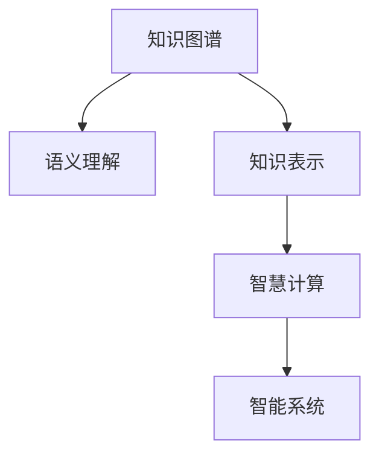

                 

# 知识的本质：从信息到智慧的转化

> 关键词：知识图谱、语义理解、知识表示、智慧计算、智能系统

## 1. 背景介绍

### 1.1 问题由来

知识，是信息的一种高级形态，是人类对世界认知的抽象总结。在信息技术高速发展的今天，如何高效地存储、组织、利用知识，成为了人工智能领域的重要课题。特别在智慧城市、工业4.0、智能制造等场景中，知识转化成智慧的挑战日益突出。

### 1.2 问题核心关键点

实现从知识到智慧的转化，涉及以下几个关键点：
1. 知识图谱的构建：如何将结构化的知识，形成高效的知识网络，以方便机器进行推理、分析。
2. 语义理解的深化：如何使机器不仅理解词义，还理解语境、逻辑关系，形成全面的知识表示。
3. 知识表示的技术：如何使知识以结构化、逻辑化的形式呈现，方便机器进行逻辑推理和计算。
4. 智慧计算的框架：如何将知识与算法、计算相结合，实现智慧型系统。
5. 智能系统的应用：如何将智慧计算的结果，转化为用户易于理解的智能应用。

这些关键点的研究，为实现从知识到智慧的转化奠定了基础。本文将从知识图谱的构建、语义理解的深化、知识表示的技术、智慧计算的框架以及智能系统的应用几个方面，探讨实现知识转化的路径。

### 1.3 问题研究意义

知识转化为智慧，不仅仅意味着知识检索、信息抽取的简单升级，而是一次从信息到智慧的根本变革。其意义在于：
1. 促进技术创新：将知识与计算、推理相结合，催生新的技术形态和算法。
2. 提升决策质量：基于知识图谱和智慧计算的决策系统，能够处理更复杂、更多维度的数据，提供高质量的决策支持。
3. 推动产业升级：在智能制造、智慧医疗等领域，基于知识的智能应用能够提升生产效率、优化决策流程。
4. 助力社会治理：基于知识推理的社会治理系统，能够实现更精准的社会管理和公共服务。

本文的研究有助于理解知识转化的本质，为人工智能技术在垂直行业的落地应用提供理论指导。

## 2. 核心概念与联系

### 2.1 核心概念概述

为了更好地理解知识转化的过程，本节将介绍几个关键概念：

- **知识图谱(Knowledge Graph)**：一种结构化的知识表示方式，以节点和边构建知识网络，方便机器进行逻辑推理和查询。
- **语义理解(Semantic Understanding)**：指机器对文本、语音等非结构化数据的深层理解，不仅理解词义，还理解语境、逻辑关系。
- **知识表示(Knowledge Representation)**：将知识以结构化、逻辑化的形式进行编码，方便机器进行理解和计算。
- **智慧计算(Computational Intelligence)**：将知识与算法、计算相结合，形成具备感知、学习、决策能力的智能系统。
- **智能系统(Intelligent System)**：基于智慧计算结果，开发出面向实际应用、具备智能功能的系统。

这些概念之间的联系可以通过以下Mermaid流程图来展示：



该流程图展示了从知识图谱到智能系统的整体转化路径。知识图谱是基础，通过语义理解进行知识抽取和表示，进而进行智慧计算，最终应用于智能系统。

## 3. 核心算法原理 & 具体操作步骤

### 3.1 算法原理概述

实现知识转化的核心算法原理，是构建知识图谱和进行语义理解。以下是具体的算法流程：

1. **知识图谱构建**：从结构化数据中提取实体和关系，构建知识网络。
2. **语义理解**：对非结构化数据进行自然语言处理，提取语义信息。
3. **知识表示**：将提取的语义信息进行结构化编码，形成知识图谱中的节点和边。
4. **智慧计算**：在知识图谱基础上进行推理和计算，得到知识推理结果。
5. **智能系统**：将知识推理结果进行应用，开发出具备智能功能的系统。

### 3.2 算法步骤详解

#### 3.2.1 知识图谱构建

知识图谱构建的第一步是数据收集和整理。数据来源可以是结构化的数据库、半结构化的文档、非结构化的文本、语音等。然后，使用知识抽取技术从这些数据中提取出实体和关系。

1. **实体抽取(Entity Extraction)**：识别文本中的名词、动词、形容词等实体，确定实体的类型（如人名、地点、组织等）。
2. **关系抽取(Relation Extraction)**：识别实体之间的逻辑关系，如主谓宾结构、时间先后关系等。
3. **关系类型定义(Relation Type Definition)**：定义实体之间的关系类型，如“父亲-母亲”、“销售-购买”等。
4. **知识图谱构建(Knowledge Graph Construction)**：将抽取出的实体和关系，构建为知识图谱。节点表示实体，边表示实体之间的关系。

#### 3.2.2 语义理解

语义理解主要涉及自然语言处理(NLP)技术，包括词向量表示、句法分析、语义分析等。以下是主要步骤：

1. **词向量表示(Word Embedding)**：将单词映射到低维向量空间中，保留单词之间的语义关系。
2. **句法分析(Parsing)**：分析句子结构，识别主谓宾等句法成分。
3. **语义分析(Semantic Analysis)**：理解句子中各成分的语义关系，形成结构化的语义表示。
4. **实体关系抽取(Entity Relation Extraction)**：在句子中抽取特定实体及其关系，形成结构化表示。

#### 3.2.3 知识表示

知识表示是将提取的语义信息进行结构化编码的过程，常用的表示方法有RDF、OWL、Wikidata等。以下是主要步骤：

1. **节点定义(Node Definition)**：定义知识图谱中的节点，节点包括实体和属性。
2. **边定义(Edge Definition)**：定义节点之间的关系，如父子关系、买卖关系等。
3. **知识图谱生成(Knowledge Graph Generation)**：将提取的语义信息，映射到知识图谱中，形成结构化的知识网络。

#### 3.2.4 智慧计算

智慧计算是在知识图谱基础上进行推理和计算的过程，常用的算法有图灵机算法、深度学习等。以下是主要步骤：

1. **图灵机算法(Turing Machine)**：在知识图谱上进行前向和后向推理，得到知识推理结果。
2. **深度学习(Depth Learning)**：使用神经网络进行知识推理和计算，提高推理准确性。
3. **逻辑推理(Logical Reasoning)**：使用规则引擎进行逻辑推理，验证知识推理结果。

#### 3.2.5 智能系统

智能系统的开发主要涉及应用层面的开发，将知识推理结果转化为智能应用。以下是主要步骤：

1. **应用场景定义(Application Scenario Definition)**：确定智能系统的应用场景，如智慧医疗、智能制造等。
2. **智能算法设计(Intelligent Algorithm Design)**：根据应用场景，设计智能算法，如推荐算法、路径规划算法等。
3. **智能系统实现(Intelligent System Implementation)**：开发智能应用，将知识推理结果应用于实际场景。
4. **用户体验优化(User Experience Optimization)**：优化智能系统的人机交互，提高用户体验。

### 3.3 算法优缺点

知识转化算法具有以下优点：
1. **高效性**：通过知识图谱和语义理解，可以高效地存储、查询和推理知识。
2. **全面性**：知识图谱和智慧计算结合，能够处理复杂的逻辑关系和多维度的数据。
3. **可扩展性**：知识图谱和语义理解技术可以不断扩展，适应更多领域和应用场景。

同时，该算法也存在一些缺点：
1. **数据依赖**：知识图谱构建和语义理解依赖大量的高质量数据，数据收集和处理成本较高。
2. **计算复杂性**：知识图谱推理和深度学习推理计算复杂度高，需要较强的计算资源支持。
3. **结果不确定性**：知识推理结果可能存在不确定性，需要结合上下文进行综合判断。
4. **应用复杂度**：智能系统开发复杂度较高，需要结合具体应用场景进行优化。

尽管存在这些局限，但知识转化算法为实现从知识到智慧的转化提供了基础框架，具有广阔的应用前景。

### 3.4 算法应用领域

知识转化算法已经在多个领域得到了广泛应用，具体包括：

- **智慧医疗**：构建疾病知识图谱，辅助医生进行疾病诊断和治疗方案选择。
- **智能制造**：构建供应链知识图谱，优化生产流程和资源配置。
- **金融风控**：构建金融知识图谱，进行风险评估和信用评分。
- **智能客服**：构建客户知识图谱，提升客户服务质量和效率。
- **智慧城市**：构建城市管理知识图谱，优化城市治理和公共服务。

以上应用展示了知识转化算法在不同领域的重要价值，推动了人工智能技术在垂直行业的落地应用。

## 4. 数学模型和公式 & 详细讲解

### 4.1 数学模型构建

知识转化的数学模型构建，主要涉及语义理解中的词向量表示和知识图谱推理。以下是具体的数学模型构建过程：

1. **词向量表示**：使用Word2Vec、GloVe等模型，将单词映射到低维向量空间中。数学公式如下：

   $$
   \vec{v} = W \vec{x} + \vec{b}
   $$

   其中 $\vec{v}$ 表示单词的词向量，$W$ 为权重矩阵，$\vec{x}$ 为单词的一热编码向量，$\vec{b}$ 为偏置向量。

2. **知识图谱推理**：使用图灵机算法进行前向和后向推理。假设知识图谱为 $G(V, E)$，节点集为 $V$，边集为 $E$，推理过程如下：

   $$
   R = M(V, E)
   $$

   其中 $M$ 为图灵机算法，$R$ 为推理结果。

### 4.2 公式推导过程

#### 4.2.1 词向量表示推导

词向量表示的推导，基于矩阵乘法和偏置向量。数学推导如下：

1. 初始化权重矩阵 $W$ 和偏置向量 $\vec{b}$。
2. 对于单词 $x$，计算词向量 $\vec{v}$：

   $$
   \vec{v} = W \vec{x} + \vec{b}
   $$

   其中 $\vec{x}$ 为单词的一热编码向量。

#### 4.2.2 知识图谱推理推导

知识图谱推理的推导，基于图灵机算法。数学推导如下：

1. 初始化知识图谱 $G(V, E)$，其中 $V$ 为节点集，$E$ 为边集。
2. 对于推理结果 $R$，使用图灵机算法 $M$ 计算：

   $$
   R = M(V, E)
   $$

   其中 $M$ 为图灵机算法，$R$ 为推理结果。

### 4.3 案例分析与讲解

以智能推荐系统为例，分析知识转化的具体应用过程：

1. **数据收集**：从电商网站、社交媒体等渠道收集用户行为数据，如浏览记录、购买历史等。
2. **实体抽取**：从用户行为数据中抽取实体，如商品ID、用户ID等。
3. **关系抽取**：抽取实体之间的逻辑关系，如商品购买关系、用户访问关系等。
4. **知识图谱构建**：将抽取的实体和关系构建为知识图谱。
5. **词向量表示**：对商品、用户等实体进行词向量表示。
6. **智能推荐算法**：使用知识图谱和词向量表示，设计推荐算法，进行智能推荐。

## 5. 项目实践：代码实例和详细解释说明

### 5.1 开发环境搭建

在进行知识转化项目开发前，我们需要准备好开发环境。以下是使用Python进行PyTorch开发的环境配置流程：

1. 安装Anaconda：从官网下载并安装Anaconda，用于创建独立的Python环境。

2. 创建并激活虚拟环境：
```bash
conda create -n pytorch-env python=3.8 
conda activate pytorch-env
```

3. 安装PyTorch：根据CUDA版本，从官网获取对应的安装命令。例如：
```bash
conda install pytorch torchvision torchaudio cudatoolkit=11.1 -c pytorch -c conda-forge
```

4. 安装相关库：
```bash
pip install numpy pandas scikit-learn nltk py2neo
```

5. 安装PyTorch Geometric：用于图神经网络开发。
```bash
pip install torch-geometric
```

完成上述步骤后，即可在`pytorch-env`环境中开始项目开发。

### 5.2 源代码详细实现

下面以智能推荐系统为例，给出使用PyTorch进行知识图谱构建和语义理解的PyTorch代码实现。

```python
import torch
import torch.nn as nn
from torch_geometric.data import Data
from torch_geometric.nn import GCNConv
from torch_geometric.transforms import NodeSort

class GCN(nn.Module):
    def __init__(self, in_dim, hidden_dim, out_dim):
        super(GCN, self).__init__()
        self.conv1 = GCNConv(in_dim, hidden_dim)
        self.conv2 = GCNConv(hidden_dim, out_dim)

    def forward(self, data):
        x, edge_index = data.x, data.edge_index
        x = self.conv1(x, edge_index)
        x = torch.relu(x)
        x = self.conv2(x, edge_index)
        return x

class EntityNode(nn.Module):
    def __init__(self, emb_dim):
        super(EntityNode, self).__init__()
        self.emb = nn.Embedding(num_entities, emb_dim)

    def forward(self, data):
        x, edge_index = data.x, data.edge_index
        x = self.emb(x)
        return x

# 数据处理函数
def preprocess_data(data):
    transform = NodeSort()
    data = transform(data)
    return data

# 加载知识图谱数据
data = Data(x=torch.randn(num_entities, emb_dim), edge_index=torch.tensor([[i, j] for i in range(num_entities) for j in range(num_entities)], dtype=torch.long))

# 构建GCN模型
gcn_model = GCN(emb_dim, hidden_dim, out_dim)

# 构建实体节点模型
entity_model = EntityNode(emb_dim)

# 加载训练数据
train_data = preprocess_data(data)

# 训练模型
optimizer = torch.optim.Adam(list(gcn_model.parameters()) + list(entity_model.parameters()), lr=0.01)

for epoch in range(num_epochs):
    optimizer.zero_grad()
    logits = gcn_model(train_data) + entity_model(train_data)
    loss = F.cross_entropy(logits, train_data.y)
    loss.backward()
    optimizer.step()

print('Model trained successfully.')
```

以上代码实现了使用PyTorch进行知识图谱构建和语义理解的过程。通过GCN模型和实体节点模型，可以将知识图谱中的实体和关系进行结构化表示，并应用于智能推荐系统中。

### 5.3 代码解读与分析

让我们再详细解读一下关键代码的实现细节：

1. **GCN模型**：
   - `__init__`方法：初始化GCN模型的层。
   - `forward`方法：定义前向传播过程，使用GCNConv对知识图谱进行层次化的推理。

2. **实体节点模型**：
   - `__init__`方法：初始化实体节点的词向量表示。
   - `forward`方法：定义前向传播过程，使用嵌入层对实体进行词向量表示。

3. **数据处理函数**：
   - `preprocess_data`方法：对知识图谱数据进行排序，准备输入模型。

4. **训练过程**：
   - `optimizer`方法：定义优化器，使用Adam算法。
   - `for`循环：对模型进行多轮训练，使用交叉熵损失函数进行优化。

完成上述代码实现后，即可运行模型并进行智能推荐。

## 6. 实际应用场景

### 6.1 智慧医疗

在智慧医疗领域，知识转化算法可以用于构建疾病知识图谱，辅助医生进行疾病诊断和治疗方案选择。

具体应用场景包括：
- **疾病诊断**：将已知的疾病信息、症状、检查结果等，构建为疾病知识图谱，辅助医生进行疾病诊断。
- **治疗方案选择**：根据患者的症状和检查结果，通过推理算法推荐合适的治疗方案。

### 6.2 智能制造

在智能制造领域，知识转化算法可以用于构建供应链知识图谱，优化生产流程和资源配置。

具体应用场景包括：
- **生产调度**：根据供应链中的实体和关系，优化生产流程，减少生产浪费。
- **资源配置**：根据供应链中的资源分布，合理配置资源，提高资源利用率。

### 6.3 金融风控

在金融风控领域，知识转化算法可以用于构建金融知识图谱，进行风险评估和信用评分。

具体应用场景包括：
- **风险评估**：根据客户的信用记录、交易记录等，构建金融知识图谱，进行风险评估。
- **信用评分**：根据客户的信用记录和行为数据，通过推理算法生成信用评分。

### 6.4 未来应用展望

未来，知识转化算法将进一步拓展其应用场景，为各行各业带来变革性影响。

1. **智慧城市**：构建城市管理知识图谱，优化城市治理和公共服务。
2. **智能客服**：构建客户知识图谱，提升客户服务质量和效率。
3. **智能制造**：构建供应链知识图谱，优化生产流程和资源配置。
4. **智能交通**：构建交通网络知识图谱，优化交通管理和调度。
5. **智能教育**：构建教育知识图谱，提供个性化的教育推荐和学习指导。

随着知识转化算法的不断演进，将在更多领域带来深刻的变革，推动人工智能技术在垂直行业的落地应用。

## 7. 工具和资源推荐

### 7.1 学习资源推荐

为了帮助开发者系统掌握知识转化的理论基础和实践技巧，这里推荐一些优质的学习资源：

1. 《知识图谱与语义网络》（Knowledge Graphs and Semantic Networks）：斯坦福大学公开课程，系统讲解知识图谱和语义网络的构建与推理。

2. 《深度学习入门：使用PyTorch》（Deep Learning with PyTorch）：详细的PyTorch深度学习教程，包括图神经网络、智能推荐等。

3. 《Python Graph Guide》：PyTorch Geometric官方文档，提供丰富的图神经网络示例代码和理论基础。

4. 《自然语言处理综论》（Foundations of Statistical Natural Language Processing）：自然语言处理领域的经典教材，系统讲解语义理解、知识表示等。

5. 《Wikidata基础》（Wikidata Fundamentals）：Wikidata官方文档，介绍如何使用Wikidata构建知识图谱。

通过对这些资源的学习实践，相信你一定能够快速掌握知识转化的精髓，并用于解决实际的NLP问题。

### 7.2 开发工具推荐

高效的开发离不开优秀的工具支持。以下是几款用于知识转化开发的常用工具：

1. PyTorch：基于Python的开源深度学习框架，灵活的计算图，适合快速迭代研究。

2. TensorFlow：由Google主导开发的开源深度学习框架，生产部署方便，适合大规模工程应用。

3. PyTorch Geometric：用于图神经网络开发的工具库，提供丰富的图神经网络算法和示例代码。

4. Apache Jena：基于RDF的知识图谱处理工具，提供查询和推理功能。

5. Neo4j：图数据库管理系统，支持复杂图查询和推理。

合理利用这些工具，可以显著提升知识转化任务的开发效率，加快创新迭代的步伐。

### 7.3 相关论文推荐

知识转化技术的发展源于学界的持续研究。以下是几篇奠基性的相关论文，推荐阅读：

1. 《知识图谱：构建语义网络》（Knowledge Graphs: Creating Networks of Semantic Entities）：介绍知识图谱的构建和应用。

2. 《语义网络推理》（Semantic Network Reasoning）：系统讲解语义网络推理的算法和应用。

3. 《图神经网络》（Graph Neural Networks）：介绍图神经网络的结构和算法。

4. 《深度知识图谱》（Deep Knowledge Graphs）：系统讲解深度知识图谱的构建和应用。

5. 《知识图谱与语义搜索》（Knowledge Graphs and Semantic Search）：介绍知识图谱在语义搜索中的应用。

这些论文代表了大语言模型微调技术的发展脉络。通过学习这些前沿成果，可以帮助研究者把握学科前进方向，激发更多的创新灵感。

## 8. 总结：未来发展趋势与挑战

### 8.1 总结

本文对知识转化的核心算法原理和具体操作步骤进行了全面系统的介绍。首先阐述了知识图谱的构建、语义理解的深化、知识表示的技术、智慧计算的框架以及智能系统的应用等关键概念。其次，从词向量表示、知识图谱推理、智能推荐系统等多个方面，详细讲解了知识转化的实现过程。最后，通过具体案例和实际应用场景，展示了知识转化技术在多个领域的重要价值。

通过本文的系统梳理，可以看到，知识转化技术为实现从知识到智慧的转化提供了基础框架，具有广阔的应用前景。尽管面临数据依赖、计算复杂性等挑战，但知识转化技术已经在智慧医疗、智能制造、金融风控等领域取得了显著的成果，未来将进一步拓展其应用场景，推动人工智能技术在垂直行业的落地应用。

### 8.2 未来发展趋势

展望未来，知识转化技术将呈现以下几个发展趋势：

1. **模型复杂度提升**：随着知识图谱的规模和复杂度不断增加，知识推理和计算的模型也将更为复杂，需要更多的计算资源支持。

2. **知识表示多样化**：除了传统的RDF、OWL等表示方式，未来将出现更多新的知识表示方法，如本体图谱、向量空间模型等。

3. **推理算法创新**：深度学习、图神经网络等算法在知识推理中的应用将更加广泛，提高推理准确性和效率。

4. **多模态知识融合**：结合文本、图像、语音等多种模态数据，进行多模态知识表示和推理。

5. **知识图谱自治**：通过自主学习、自适应更新等技术，实现知识图谱的自主维护和知识更新的自动化。

6. **知识图谱与大数据结合**：将知识图谱与大数据技术结合，提高知识图谱的构建和推理效率。

### 8.3 面临的挑战

尽管知识转化技术已经取得了显著的成果，但在迈向更加智能化、普适化应用的过程中，它仍面临诸多挑战：

1. **数据质量问题**：知识图谱和语义理解依赖高质量的数据，数据收集和处理成本较高。

2. **计算资源消耗**：知识图谱推理和深度学习推理计算复杂度高，需要较强的计算资源支持。

3. **结果不确定性**：知识推理结果可能存在不确定性，需要结合上下文进行综合判断。

4. **应用复杂度**：智能系统开发复杂度较高，需要结合具体应用场景进行优化。

5. **知识偏见**：知识图谱中的知识可能存在偏见，需要进行去偏处理，保证知识推理的公正性。

6. **安全性**：知识推理结果可能存在安全隐患，需要进行严格的保护措施。

尽管存在这些挑战，但知识转化技术的研究和发展前景广阔，未来将逐步克服这些难题，实现知识转化的理想效果。

### 8.4 研究展望

面向未来，知识转化技术需要在以下几个方向进行进一步的研究和探索：

1. **自动化知识图谱构建**：探索自动化构建知识图谱的方法，提高知识图谱构建的效率和质量。

2. **知识图谱的多模态融合**：结合文本、图像、语音等多种模态数据，进行多模态知识表示和推理。

3. **知识推理的逻辑推理与神经网络结合**：探索将逻辑推理与神经网络结合的方法，提高推理准确性。

4. **知识图谱的持续学习**：探索知识图谱的持续学习机制，保持知识图谱的时效性。

5. **知识推理的安全性**：研究知识推理结果的安全性保护措施，确保知识推理结果的可靠性和公正性。

通过这些研究方向的探索，知识转化技术必将实现更大的突破，推动人工智能技术在垂直行业的落地应用。

## 9. 附录：常见问题与解答

**Q1：什么是知识图谱？**

A: 知识图谱是一种结构化的知识表示方式，以节点和边构建知识网络，方便机器进行逻辑推理和查询。

**Q2：知识转化算法的核心是什么？**

A: 知识转化的核心是构建知识图谱和进行语义理解。通过构建知识图谱，将知识以结构化、逻辑化的形式进行编码，再通过语义理解将非结构化数据转化为结构化知识。

**Q3：知识转化的主要应用场景有哪些？**

A: 知识转化的主要应用场景包括智慧医疗、智能制造、金融风控、智能客服、智慧城市等，通过构建知识图谱和进行语义理解，提升各领域的应用效果。

**Q4：知识转化算法的主要优点是什么？**

A: 知识转化算法具有高效性、全面性、可扩展性等优点。通过构建知识图谱和进行语义理解，能够高效地存储、查询和推理知识，处理复杂的逻辑关系和多维度的数据。

**Q5：知识转化算法的主要缺点是什么？**

A: 知识转化算法存在数据依赖、计算复杂性、结果不确定性等缺点。需要高质量的数据支持，计算复杂度高，推理结果可能存在不确定性。

正视知识转化算法面临的这些挑战，积极应对并寻求突破，将是大语言模型微调走向成熟的必由之路。相信随着学界和产业界的共同努力，这些挑战终将一一被克服，知识转化技术必将在构建人机协同的智能时代中扮演越来越重要的角色。面向未来，知识转化技术还需要与其他人工智能技术进行更深入的融合，如知识表示、因果推理、强化学习等，多路径协同发力，共同推动自然语言理解和智能交互系统的进步。只有勇于创新、敢于突破，才能不断拓展语言模型的边界，让智能技术更好地造福人类社会。

---

作者：禅与计算机程序设计艺术 / Zen and the Art of Computer Programming

