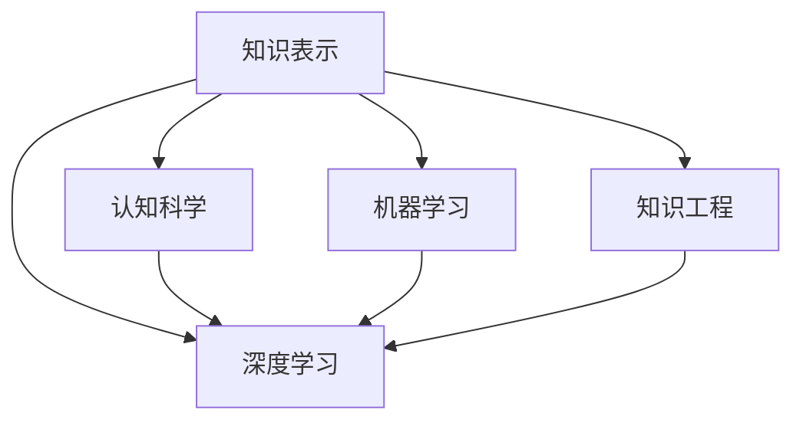

                 

# 知识的深度：从表象到本质的探索

> 关键词：知识表示,深度学习,认知科学,机器学习,知识工程

## 1. 背景介绍

### 1.1 问题由来

随着信息技术的发展，人类对知识的获取、存储和应用方式产生了革命性的变化。从早期的基于纸张的资料库，到基于索引的图书检索系统，再到现代互联网上的海量信息，知识的形式和结构发生了显著的演变。然而，尽管信息获取和存储变得前所未有的便捷，知识的深度和本质理解仍是一个巨大的挑战。如何从繁杂的表象中提炼出真正的知识，将数据转化为智慧，是当前信息时代的重要课题。

### 1.2 问题核心关键点

本节将重点探讨知识表示与深度学习的关系，分析认知科学和机器学习在知识提取和深度理解中的作用，并阐述知识工程在实现这一目标中的重要性。

- **知识表示**：将知识形式化、结构化的过程，是知识提取和应用的基础。
- **深度学习**：通过多层神经网络模拟人脑神经元的工作方式，实现对复杂模式和抽象概念的学习。
- **认知科学**：研究人类认知过程及其心理机制，为知识表示和深度学习提供了理论基础。
- **机器学习**：利用数据驱动的方式，从数据中学习模型，以自动化的方式进行知识发现和推理。
- **知识工程**：将领域专家知识与计算机技术结合，构建智能知识系统，实现知识的高效获取和应用。

## 2. 核心概念与联系

### 2.1 核心概念概述

为了更好地理解知识表示与深度学习之间的联系，本节将介绍几个关键概念及其相互关系。

- **知识表示**：指将知识形式化，使其能够在计算机中存储、检索、推理和应用。常见的知识表示方法包括逻辑推理、规则集、框架等。
- **深度学习**：通过多层非线性变换，能够自动发现数据中的复杂关系和抽象特征。常用的深度学习模型包括卷积神经网络(CNN)、循环神经网络(RNN)、变分自编码器(VAE)等。
- **认知科学**：研究人类认知过程，包括感知、记忆、推理等，为深度学习提供了心理学的理论基础。
- **机器学习**：利用数据和算法，自动发现数据中的模式和规律，实现知识的学习和推理。
- **知识工程**：将领域专家的知识和机器学习算法结合起来，构建智能知识系统，实现知识的高效管理和应用。

### 2.2 核心概念原理和架构的 Mermaid 流程图(Mermaid 流程节点中不要有括号、逗号等特殊字符)



## 3. 核心算法原理 & 具体操作步骤

### 3.1 算法原理概述

知识表示与深度学习的结合，其核心原理在于利用深度学习模型对知识进行自动化的抽象和提炼。深度学习模型通过多层神经网络，能够自动学习数据中的复杂特征，捕捉模式和关系。而知识表示则为这些特征和关系提供了形式化的结构，使它们可以被推理和应用。

### 3.2 算法步骤详解

- **数据预处理**：将原始数据进行清洗和转换，使其适合深度学习模型的输入格式。
- **模型选择与训练**：选择合适的深度学习模型，并使用大量标注数据对其进行训练。
- **知识抽取与表示**：在训练过程中，通过模型的隐藏层特征，自动抽取和表示知识。
- **知识推理与应用**：使用知识表示方法，将抽取的知识组织成结构化的知识库，并通过推理和应用，实现知识的实际应用。

### 3.3 算法优缺点

深度学习与知识表示结合的优势在于，能够自动发现和提炼知识，减少人工干预，提高知识抽取的效率和准确性。然而，这种方法也存在一些缺点：

- **数据依赖性强**：深度学习模型的性能高度依赖于训练数据的质量和数量。
- **模型复杂度高**：深度学习模型的结构复杂，训练和推理成本较高。
- **知识可解释性差**：深度学习模型通常是"黑盒"，其内部机制难以解释和理解。
- **鲁棒性不足**：深度学习模型可能对输入数据的微小扰动非常敏感，鲁棒性不足。

### 3.4 算法应用领域

深度学习与知识表示的结合，已在多个领域得到了广泛应用，包括：

- **自然语言处理**：通过深度学习模型，自动提取和表示自然语言中的知识，用于问答系统、情感分析、机器翻译等任务。
- **计算机视觉**：通过卷积神经网络(CNN)等深度学习模型，自动学习图像中的特征和模式，用于图像分类、目标检测、图像生成等任务。
- **医疗领域**：利用深度学习模型和知识表示方法，提取和表示医疗数据中的知识，用于疾病诊断、治疗方案推荐等任务。
- **金融领域**：通过深度学习模型和知识表示方法，自动学习金融数据中的知识，用于风险评估、投资策略制定等任务。

## 4. 数学模型和公式 & 详细讲解 & 举例说明

### 4.1 数学模型构建

在深度学习与知识表示的结合中，数学模型构建是一个关键步骤。以下以自然语言处理为例，构建一个简单的知识抽取模型。

- **输入层**：将文本数据转换为向量形式，输入到模型中。
- **嵌入层**：使用词嵌入技术，将每个词转换为低维向量。
- **编码器层**：通过多层神经网络，对输入的向量进行编码，提取知识特征。
- **解码器层**：将编码器的输出解码为知识表示，如逻辑公式、规则集等。
- **知识库**：将解码器输出的知识表示存储在知识库中，供推理和应用使用。

### 4.2 公式推导过程

以自然语言处理为例，以下是一个简单的知识抽取模型的公式推导：

设输入为文本向量 $x$，编码器的隐藏状态为 $h_1$， $h_2$， ...， $h_n$，则知识表示 $k$ 可以表示为：

$$
k = f(h_n)
$$

其中 $f$ 为解码器层中的非线性变换函数，$h_n$ 为编码器的最后一层隐藏状态。

在知识表示的构建过程中，可以使用逻辑规则、规则集、框架等方法，将知识表示转化为形式化的结构。例如，对于一个简单的问答系统，可以构建如下知识表示：

- 问题 $q$ 与答案 $a$ 之间的逻辑关系： $q \rightarrow a$
- 问题的相关事实 $f_1$， $f_2$， ...， $f_m$

这些知识表示可以用于推理和问答系统中，以自动回答用户的问题。

### 4.3 案例分析与讲解

以下以医疗领域为例，分析深度学习与知识表示的结合。

- **数据预处理**：将电子病历数据清洗和转换，使其适合深度学习模型的输入格式。
- **模型选择与训练**：选择适当的深度学习模型，并使用标注数据进行训练。
- **知识抽取与表示**：在训练过程中，模型学习提取和表示医疗知识，如疾病类型、症状、治疗方案等。
- **知识推理与应用**：将抽取的知识表示存入知识库，用于自动推理和推荐治疗方案。

## 5. 项目实践：代码实例和详细解释说明

### 5.1 开发环境搭建

在进行知识表示与深度学习的项目实践前，需要准备好开发环境。以下是使用Python进行TensorFlow开发的环境配置流程：

1. 安装Anaconda：从官网下载并安装Anaconda，用于创建独立的Python环境。
2. 创建并激活虚拟环境：
```bash
conda create -n tf-env python=3.8 
conda activate tf-env
```
3. 安装TensorFlow：根据CUDA版本，从官网获取对应的安装命令。例如：
```bash
conda install tensorflow tensorflow-gpu=2.8 -c conda-forge
```
4. 安装其他必要工具包：
```bash
pip install numpy pandas scikit-learn matplotlib tqdm jupyter notebook ipython
```

完成上述步骤后，即可在`tf-env`环境中开始项目实践。

### 5.2 源代码详细实现

下面以自然语言处理中的命名实体识别(NER)任务为例，给出使用TensorFlow进行知识抽取的代码实现。

```python
import tensorflow as tf
import tensorflow.keras.layers as layers
from tensorflow.keras.preprocessing.text import Tokenizer
from tensorflow.keras.preprocessing.sequence import pad_sequences

class NERModel(tf.keras.Model):
    def __init__(self, embedding_dim, num_class, max_len):
        super(NERModel, self).__init__()
        self.embedding = layers.Embedding(input_dim=vocab_size, output_dim=embedding_dim)
        self.encoder = layers.LSTM(units=128)
        self.decoder = layers.Dense(units=num_class, activation='softmax')
        
    def call(self, inputs):
        x = self.embedding(inputs)
        x = self.encoder(x)
        x = self.decoder(x)
        return x

# 定义模型和优化器
model = NERModel(embedding_dim=100, num_class=len(tag2id), max_len=max_len)
optimizer = tf.keras.optimizers.Adam(learning_rate=2e-5)

# 训练函数
def train_epoch(model, dataset, batch_size, optimizer):
    dataset = pad_sequences(dataset)
    model.compile(optimizer=optimizer, loss='categorical_crossentropy')
    model.fit(dataset, labels, batch_size=batch_size, epochs=10)

# 评估函数
def evaluate(model, dataset, batch_size):
    dataset = pad_sequences(dataset)
    model.evaluate(dataset, labels, batch_size=batch_size)
```

以上代码定义了一个简单的NER模型，并展示了模型训练和评估的过程。

### 5.3 代码解读与分析

让我们再详细解读一下关键代码的实现细节：

- **NERModel类**：定义了一个简单的LSTM模型，包括嵌入层、LSTM编码层和全连接解码层。
- **训练函数**：使用TensorFlow的`fit`方法进行模型训练，使用`categorical_crossentropy`作为损失函数，自动进行标签处理。
- **评估函数**：使用TensorFlow的`evaluate`方法进行模型评估，自动输出模型在测试集上的性能指标。

### 5.4 运行结果展示

在训练完成后，可以使用评估函数输出模型的精度和召回率等指标，以评估模型的性能。

## 6. 实际应用场景

### 6.1 智能客服系统

基于深度学习与知识表示的智能客服系统，能够自动理解客户问题，并给出相应的回答。在技术实现上，可以收集企业内部的历史客服对话记录，将问题和最佳答复构建成监督数据，在此基础上对预训练模型进行微调。微调后的模型能够自动理解用户意图，匹配最合适的答案模板进行回复。对于客户提出的新问题，还可以接入检索系统实时搜索相关内容，动态组织生成回答。

### 6.2 金融舆情监测

金融机构需要实时监测市场舆论动向，以便及时应对负面信息传播，规避金融风险。通过深度学习与知识表示的结合，可以实现自动的情感分析、主题分类等任务，快速识别出市场舆情。

### 6.3 个性化推荐系统

当前的推荐系统往往只依赖用户的历史行为数据进行物品推荐，无法深入理解用户的真实兴趣偏好。通过深度学习与知识表示的结合，可以构建更加个性化的推荐系统，实现基于用户兴趣和行为数据的智能推荐。

## 7. 工具和资源推荐

### 7.1 学习资源推荐

为了帮助开发者系统掌握深度学习与知识表示的理论基础和实践技巧，以下是一些优质的学习资源：

1. **《深度学习》系列书籍**：由多位领域专家合著，系统介绍了深度学习的基本概念和常用模型。
2. **Coursera《机器学习》课程**：由斯坦福大学Andrew Ng教授主讲，深入浅出地介绍了机器学习的基础知识和常用算法。
3. **《认知科学与深度学习》系列论文**：介绍了认知科学在深度学习中的应用，为知识表示提供了理论基础。
4. **OpenAI的GPT系列论文**：展示了深度学习在自然语言处理中的最新进展和应用。
5. **Kaggle机器学习竞赛平台**：提供了丰富的数据集和实践机会，帮助开发者锻炼实践能力。

通过对这些资源的学习实践，相信你一定能够快速掌握深度学习与知识表示的精髓，并用于解决实际的NLP问题。

### 7.2 开发工具推荐

高效的开发离不开优秀的工具支持。以下是几款用于深度学习与知识表示开发的常用工具：

1. **TensorFlow**：由Google主导开发的深度学习框架，适合大规模工程应用。
2. **PyTorch**：灵活的动态计算图，适合快速迭代研究。
3. **Transformers库**：由HuggingFace开发的NLP工具库，集成了众多SOTA语言模型，支持TensorFlow和PyTorch。
4. **Weights & Biases**：模型训练的实验跟踪工具，可以记录和可视化模型训练过程中的各项指标，方便对比和调优。
5. **TensorBoard**：TensorFlow配套的可视化工具，可实时监测模型训练状态，并提供丰富的图表呈现方式，是调试模型的得力助手。

合理利用这些工具，可以显著提升深度学习与知识表示任务的开发效率，加快创新迭代的步伐。

### 7.3 相关论文推荐

深度学习与知识表示的发展源于学界的持续研究。以下是几篇奠基性的相关论文，推荐阅读：

1. **Attention is All You Need**：提出了Transformer结构，开启了NLP领域的预训练大模型时代。
2. **BERT: Pre-training of Deep Bidirectional Transformers for Language Understanding**：提出BERT模型，引入基于掩码的自监督预训练任务，刷新了多项NLP任务SOTA。
3. **Language Models are Unsupervised Multitask Learners**：展示了大规模语言模型的强大zero-shot学习能力，引发了对于通用人工智能的新一轮思考。
4. **Knowledge-aware Transformer**：提出了一种结合知识表示的Transformer模型，实现了更强的知识抽取和推理能力。
5. **Memory-augmented Neural Networks**：介绍了利用外部知识库增强神经网络的方法，实现了更好的知识推理和应用。

这些论文代表了大深度学习与知识表示的发展脉络。通过学习这些前沿成果，可以帮助研究者把握学科前进方向，激发更多的创新灵感。

## 8. 总结：未来发展趋势与挑战

### 8.1 总结

本文对深度学习与知识表示的结合进行了全面系统的介绍。首先阐述了深度学习与知识表示的研究背景和意义，明确了这一方法在知识提取和深度理解方面的独特价值。其次，从原理到实践，详细讲解了深度学习与知识表示的数学模型和具体操作步骤，给出了完整的代码实例。同时，本文还广泛探讨了深度学习与知识表示在多个行业领域的应用前景，展示了这一范式的巨大潜力。最后，本文精选了深度学习与知识表示的学习资源和开发工具，力求为读者提供全方位的技术指引。

通过本文的系统梳理，可以看到，深度学习与知识表示的结合正在成为NLP领域的重要范式，极大地拓展了深度学习模型的应用边界，催生了更多的落地场景。受益于大规模语料的预训练和知识表示的协同作用，深度学习模型能够从繁杂的表象中提炼出真正的知识，显著提升NLP系统的性能和应用范围，为构建更加智能的知识系统铺平道路。

### 8.2 未来发展趋势

展望未来，深度学习与知识表示的结合将呈现以下几个发展趋势：

1. **模型规模持续增大**：随着算力成本的下降和数据规模的扩张，深度学习模型的参数量还将持续增长。超大规模模型蕴含的丰富知识，有望支撑更加复杂多变的任务。
2. **知识融合能力增强**：深度学习与知识表示的结合将进一步增强模型的知识融合能力，实现视觉、语音、文本等多模态信息的协同建模。
3. **跨领域应用拓展**：深度学习与知识表示将从NLP领域拓展到其他领域，如医疗、金融、交通等，实现跨领域的知识表示和应用。
4. **自监督与少样本学习**：深度学习与知识表示将结合自监督学习和少样本学习技术，提高模型的泛化能力和适应性。
5. **可解释性和鲁棒性提升**：深度学习模型将更加注重可解释性和鲁棒性，通过引入更多先验知识，减少模型的"黑盒"特性，提高模型的可靠性和稳定性。

以上趋势凸显了深度学习与知识表示的广阔前景。这些方向的探索发展，必将进一步提升深度学习模型的性能和应用范围，为构建更加智能的知识系统提供坚实的技术基础。

### 8.3 面临的挑战

尽管深度学习与知识表示结合取得了显著进展，但在迈向更加智能化、普适化应用的过程中，仍面临诸多挑战：

1. **数据依赖性强**：深度学习模型的性能高度依赖于训练数据的质量和数量，获取高质量数据成本较高。
2. **模型复杂度高**：深度学习模型结构复杂，训练和推理成本较高。
3. **知识可解释性差**：深度学习模型通常是"黑盒"，其内部机制难以解释和理解。
4. **鲁棒性不足**：深度学习模型可能对输入数据的微小扰动非常敏感，鲁棒性不足。
5. **计算资源需求高**：深度学习模型需要大量的计算资源进行训练和推理，对硬件设施要求较高。

面对这些挑战，未来的研究需要在以下几个方面寻求新的突破：

1. **数据增强与自监督学习**：通过数据增强和自监督学习，利用无标注数据提升模型的泛化能力和适应性。
2. **知识压缩与优化**：研究知识压缩与优化方法，减少模型规模，提高计算效率。
3. **可解释性与透明性**：研究模型可解释性与透明性技术，提高模型的可理解性和可解释性。
4. **跨领域知识融合**：研究跨领域知识融合技术，实现多模态信息的协同建模。
5. **对抗样本与鲁棒性**：研究对抗样本和鲁棒性技术，提高模型的鲁棒性和抗干扰能力。

## 9. 附录：常见问题与解答

**Q1：深度学习与知识表示结合是否适用于所有NLP任务？**

A: 深度学习与知识表示结合在大多数NLP任务上都能取得不错的效果，特别是对于数据量较小的任务。但对于一些特定领域的任务，如医学、法律等，仅仅依靠通用语料预训练的模型可能难以很好地适应。此时需要在特定领域语料上进一步预训练，再进行微调，才能获得理想效果。此外，对于一些需要时效性、个性化很强的任务，如对话、推荐等，深度学习与知识表示方法也需要针对性的改进优化。

**Q2：深度学习模型在落地部署时需要注意哪些问题？**

A: 将深度学习模型转化为实际应用，还需要考虑以下因素：

1. **模型裁剪**：去除不必要的层和参数，减小模型尺寸，加快推理速度。
2. **量化加速**：将浮点模型转为定点模型，压缩存储空间，提高计算效率。
3. **服务化封装**：将模型封装为标准化服务接口，便于集成调用。
4. **弹性伸缩**：根据请求流量动态调整资源配置，平衡服务质量和成本。
5. **监控告警**：实时采集系统指标，设置异常告警阈值，确保服务稳定性。
6. **安全防护**：采用访问鉴权、数据脱敏等措施，保障数据和模型安全。

深度学习模型在实际应用中需要注意这些细节，才能确保其在实际场景中的高效性和稳定性。

**Q3：如何提高深度学习模型的鲁棒性？**

A: 提高深度学习模型的鲁棒性需要从多个方面进行优化：

1. **数据增强**：通过数据增强技术，扩充训练数据的多样性，减少模型对输入的敏感度。
2. **正则化技术**：使用L2正则、Dropout等技术，抑制模型的过拟合，提高模型的鲁棒性。
3. **对抗训练**：通过对抗样本训练，提高模型对输入的鲁棒性，减少对抗攻击的影响。
4. **自适应优化**：使用自适应优化算法，动态调整学习率，减少模型对超参数的依赖。
5. **知识融合**：通过知识表示方法，将先验知识引入模型，增强模型的鲁棒性。

这些技术可以结合使用，根据具体任务和数据特点进行优化，提高深度学习模型的鲁棒性。

**Q4：如何提高深度学习模型的可解释性？**

A: 提高深度学习模型的可解释性需要从多个方面进行优化：

1. **模型结构简化**：研究模型压缩和优化方法，减少模型的复杂度，提高模型的可解释性。
2. **特征可视化**：使用特征可视化技术，展示模型在每个输入样本上的特征提取过程，帮助理解模型的决策机制。
3. **规则集生成**：将模型输出转换为规则集形式，通过规则集的形式，提高模型的可解释性。
4. **知识表示**：通过知识表示方法，将模型输出的特征转化为符号化的知识表示，增强模型的可解释性。
5. **人工干预**：在模型输出中加入人工干预，通过人工调整模型输出，提高模型的可解释性。

这些技术可以结合使用，根据具体任务和应用场景进行优化，提高深度学习模型的可解释性。

**Q5：如何提高深度学习模型的泛化能力？**

A: 提高深度学习模型的泛化能力需要从多个方面进行优化：

1. **数据增强**：通过数据增强技术，扩充训练数据的多样性，提高模型的泛化能力。
2. **自监督学习**：通过自监督学习技术，利用无标注数据提升模型的泛化能力和适应性。
3. **对抗训练**：通过对抗样本训练，提高模型对输入的鲁棒性，减少对抗攻击的影响。
4. **模型压缩**：研究模型压缩和优化方法，减少模型的复杂度，提高模型的泛化能力。
5. **知识融合**：通过知识表示方法，将先验知识引入模型，增强模型的泛化能力。

这些技术可以结合使用，根据具体任务和数据特点进行优化，提高深度学习模型的泛化能力。

---

作者：禅与计算机程序设计艺术 / Zen and the Art of Computer Programming

