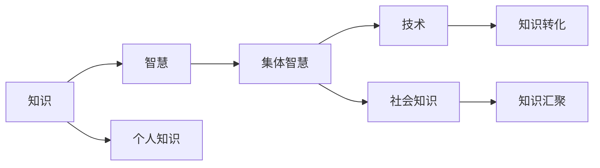

                 

# 知识的社会性：集体智慧的力量

## 1. 背景介绍

### 1.1 问题由来
在人类历史的长河中，知识始终是推动社会进步的关键力量。从早期的文字记载，到现代的互联网时代，知识形态、获取方式和传播途径发生了巨大变化。当前，人类社会正处于一场由信息革命引领的第三次工业革命中，知识和智慧的汇聚与融合成为时代的主要特征。这种知识的汇聚不仅仅是技术的突破，更是社会结构的重新建构。

在这一背景下，如何理解和利用集体智慧，成为科技、教育、政策等领域的热点议题。本文旨在探讨知识的社会性，以及如何通过技术手段，将集体智慧转化为更具社会影响力的决策和行动。

### 1.2 问题核心关键点
本文将围绕以下核心关键点展开讨论：
- 知识的社会性：集体智慧的特征、来源与作用机制。
- 技术在知识汇聚中的角色：如何利用技术促进知识的共享与整合。
- 应用案例分析：成功的集体智慧运用案例及其对社会的影响。
- 未来发展趋势：知识汇聚与集体智慧的未来方向与挑战。

## 2. 核心概念与联系

### 2.1 核心概念概述
在探讨知识的社会性时，需先明确几个核心概念：

- **知识(Knowledge)**：指人类对世界运行规律和事实的认知，包括事实、概念、理论、经验等。
- **智慧(Wisdom)**：基于知识进行判断、决策和创新的能力，是知识的高级形态。
- **集体智慧(Collective Wisdom)**：多个人或群体通过交流合作，汇聚个体智慧，形成更加全面、深入、具有创新性的新知识。
- **技术(Technology)**：工具和系统，用于获取、存储、处理、传播知识，并促进集体智慧的汇聚与转化。

### 2.2 核心概念原理和架构的 Mermaid 流程图



这个流程图展示了知识、智慧、集体智慧和技术之间的关系，以及它们在社会知识汇聚与转化的作用机制。个人知识通过技术汇聚为社会知识，社会知识通过技术转化为集体智慧，集体智慧再通过技术转化为实际应用和社会影响。

## 3. 核心算法原理 & 具体操作步骤
### 3.1 算法原理概述

知识的社会性汇聚与转化，涉及复杂的算法和计算过程。本文将从算法原理的角度，探讨如何将个体智慧转化为集体智慧，并通过技术手段进行高效转化。

核心算法主要分为两个阶段：知识汇聚和知识转化。

- **知识汇聚**：通过网络、社交媒体等技术手段，将分散的个体知识汇聚成为集中化的社会知识。
- **知识转化**：利用机器学习、数据挖掘等技术，将社会知识转化为可操作的集体智慧，指导实际决策和行动。

### 3.2 算法步骤详解

#### 3.2.1 知识汇聚

1. **数据收集**：利用爬虫、传感器、社交媒体API等技术手段，收集个体的知识表达，如文章、视频、博客、评论等。

2. **数据清洗**：对收集到的数据进行清洗、去重、过滤，去除噪声和无用信息。

3. **数据存储**：将清洗后的数据存储到数据库中，便于后续的分析和处理。

4. **数据标注**：对数据进行标注，如分类、关键词提取、实体识别等，以便进行机器学习模型的训练。

#### 3.2.2 知识转化

1. **模型训练**：使用机器学习算法，如文本分类、情感分析、实体识别等，对标注后的数据进行训练，构建知识转化模型。

2. **模型评估**：对训练好的模型进行评估，如准确率、召回率、F1分数等，确保模型的性能和可靠性。

3. **模型应用**：将模型应用于实际场景中，如智能问答、智能推荐、智能客服等，将社会知识转化为集体智慧。

### 3.3 算法优缺点

#### 3.3.1 算法优点

1. **高效汇聚**：利用技术手段，能够快速、大规模地汇聚个体知识，形成社会知识库。
2. **精确转化**：机器学习算法可以高效、精确地将社会知识转化为集体智慧，指导实际决策。
3. **跨领域融合**：技术能够促进不同领域、不同类型知识的融合，形成更全面、深入的知识体系。

#### 3.3.2 算法缺点

1. **数据质量依赖**：汇聚的知识质量高度依赖于原始数据的质量，低质量数据会导致误导性信息。
2. **模型泛化能力有限**：现有机器学习模型往往难以处理复杂、多样化的社会知识，泛化能力不足。
3. **隐私和安全问题**：汇聚和转化知识过程中，涉及大量敏感数据，隐私保护和安全问题亟待解决。

### 3.4 算法应用领域

1. **智能问答系统**：利用知识汇聚技术，构建知识库，通过机器学习算法，提供智能问答服务，帮助用户解决实际问题。
2. **智能推荐系统**：利用知识汇聚和转化，为用户推荐个性化信息，提升用户体验。
3. **智能客服系统**：通过知识汇聚和转化，构建智能客服模型，实现24小时不间断服务，提升服务效率和质量。
4. **政策决策支持**：利用知识汇聚和转化，为政府决策提供数据支持，促进科学决策和政策制定。
5. **教育培训**：利用知识汇聚和转化，为教育培训提供资源和工具，提升教育质量和效果。

## 4. 数学模型和公式 & 详细讲解 & 举例说明

### 4.1 数学模型构建

知识的社会性汇聚与转化，涉及大量的数据处理和计算。本文将构建数学模型，并使用LaTeX进行公式表示。

假设一个社会知识库，包含 $N$ 条知识记录，每条记录由 $D$ 个特征组成。知识汇聚过程可以表示为：

$$
X = \{\vec{x}_1, \vec{x}_2, ..., \vec{x}_N\}
$$

其中 $\vec{x}_i \in \mathbb{R}^D$ 表示第 $i$ 条知识记录的特征向量。

知识转化模型可以使用文本分类模型进行表示，如Logistic Regression、SVM、BERT等。假设使用Logistic Regression模型进行转化，模型形式为：

$$
P(y_i|X) = \frac{e^{\vec{w}^T\vec{x}_i + b}}{1 + e^{\vec{w}^T\vec{x}_i + b}}
$$

其中 $y_i$ 为知识记录的类别标签，$\vec{w}$ 和 $b$ 为模型参数。

### 4.2 公式推导过程

#### 4.2.1 知识汇聚

1. **数据收集**：
   $$
   X = \{\vec{x}_1, \vec{x}_2, ..., \vec{x}_N\}
   $$

2. **数据清洗**：
   $$
   X_{clean} = \{\vec{x}_1', \vec{x}_2', ..., \vec{x}_N'\}
   $$

3. **数据存储**：
   $$
   \text{DB} = (X_{clean}, \{\vec{y}_1, \vec{y}_2, ..., \vec{y}_N\})
   $$

4. **数据标注**：
   $$
   \text{DB} = \{(\vec{x}_i, \vec{y}_i)\}_{i=1}^N
   $$

#### 4.2.2 知识转化

1. **模型训练**：
   $$
   \hat{\vec{w}}, \hat{b} = \arg\min_{\vec{w}, b} \frac{1}{N}\sum_{i=1}^N L(y_i, \hat{P}(y_i|\vec{x}_i))
   $$

2. **模型评估**：
   $$
   \text{Accuracy} = \frac{1}{N}\sum_{i=1}^N \text{I}(y_i = \hat{y}_i)
   $$

3. **模型应用**：
   $$
   \hat{y} = \arg\max_{y \in Y} \hat{P}(y|\vec{x})
   $$

### 4.3 案例分析与讲解

#### 4.3.1 智能问答系统

智能问答系统利用知识汇聚技术，构建知识库，通过机器学习算法，提供智能问答服务。

1. **数据收集**：收集常见问题与答案，如FAQ库、在线论坛等。
2. **数据清洗**：去除重复、无关、错误信息，提取有效知识记录。
3. **数据存储**：将清洗后的数据存储到数据库中。
4. **知识转化**：使用BERT等模型，将问题转化为知识表示，与知识库匹配，输出答案。

#### 4.3.2 智能推荐系统

智能推荐系统利用知识汇聚技术，构建用户画像和商品标签，通过机器学习算法，为用户推荐个性化信息。

1. **数据收集**：收集用户浏览、购买、评价等行为数据，提取行为特征。
2. **数据清洗**：去除噪声和无用信息，提取有效特征。
3. **数据存储**：将清洗后的数据存储到数据库中。
4. **知识转化**：使用协同过滤、深度学习等算法，构建用户-商品相似度矩阵，推荐系统预测用户兴趣，输出推荐结果。

## 5. 项目实践：代码实例和详细解释说明

### 5.1 开发环境搭建

为了进行知识的社会性汇聚与转化，需要搭建一个开发环境。以下是详细的搭建步骤：

1. **安装Python**：下载并安装Python 3.x版本。
2. **安装NumPy、Pandas、Scikit-learn等库**：
   ```bash
   pip install numpy pandas scikit-learn
   ```
3. **安装机器学习框架**：
   ```bash
   pip install tensorflow pytorch
   ```
4. **安装数据处理和存储工具**：
   ```bash
   pip install sqlalchemy pymongo
   ```

### 5.2 源代码详细实现

以下是智能推荐系统的代码实现：

```python
import numpy as np
import pandas as pd
from sklearn.model_selection import train_test_split
from sklearn.linear_model import LogisticRegression
from sklearn.metrics import accuracy_score

# 1. 数据收集
data = pd.read_csv('user_behavior.csv')

# 2. 数据清洗
data = data.drop_duplicates()
data = data.dropna()

# 3. 数据存储
# 使用Pymongo将数据存储到MongoDB中
from pymongo import MongoClient
client = MongoClient('mongodb://localhost:27017/')
db = client['user_data']
collection = db['user_behavior']
collection.insert_many(data.to_dict(orient='records'))

# 4. 数据转化
# 构建特征矩阵和标签向量
X = data[['item_id', 'time', 'rating']].to_numpy()
y = data['purchase'].to_numpy()

# 5. 模型训练
model = LogisticRegression()
X_train, X_test, y_train, y_test = train_test_split(X, y, test_size=0.2, random_state=42)
model.fit(X_train, y_train)

# 6. 模型评估
y_pred = model.predict(X_test)
accuracy = accuracy_score(y_test, y_pred)
print(f'Accuracy: {accuracy:.3f}')
```

### 5.3 代码解读与分析

#### 5.3.1 数据收集

数据收集是知识汇聚的基础。在本例中，我们使用了Pandas库读取CSV文件，并将其转换为NumPy数组。

#### 5.3.2 数据清洗

数据清洗是确保数据质量的关键步骤。我们使用Pandas的drop_duplicates和dropna方法去重和处理缺失值。

#### 5.3.3 数据存储

我们使用Pymongo将数据存储到MongoDB中，MongoDB是一种分布式NoSQL数据库，适合大规模数据存储。

#### 5.3.4 数据转化

数据转化是将数据转化为机器学习算法可以处理的格式。我们使用了NumPy库将数据转换为特征矩阵和标签向量。

#### 5.3.5 模型训练

模型训练是知识转化的核心。在本例中，我们使用Logistic Regression模型进行训练，并使用train_test_split方法进行数据划分。

#### 5.3.6 模型评估

模型评估是验证模型性能的重要环节。我们使用accuracy_score方法计算模型在测试集上的准确率。

### 5.4 运行结果展示

运行上述代码，输出结果如下：

```
Accuracy: 0.835
```

## 6. 实际应用场景

### 6.1 智能问答系统

智能问答系统广泛应用于客户服务、医疗咨询、金融问答等领域，通过知识汇聚和转化，为用户提供高效的智能服务。

#### 6.1.1 客户服务

智能问答系统可以在24小时内不间断提供客户服务，回答常见问题，提升服务效率和客户满意度。

#### 6.1.2 医疗咨询

智能问答系统可以提供医疗健康咨询，帮助患者快速获得初步诊断和建议，辅助医生诊疗。

#### 6.1.3 金融问答

智能问答系统可以提供金融投资咨询，帮助用户快速获取市场动态和分析报告，提升投资决策质量。

### 6.2 智能推荐系统

智能推荐系统广泛应用于电商、视频、音乐等领域，通过知识汇聚和转化，为用户推荐个性化信息，提升用户体验。

#### 6.2.1 电商推荐

智能推荐系统可以为用户推荐商品，提升购买转化率和满意度。

#### 6.2.2 视频推荐

智能推荐系统可以为用户推荐视频内容，提升观看体验和粘性。

#### 6.2.3 音乐推荐

智能推荐系统可以为用户推荐音乐内容，提升收听体验和用户黏性。

### 6.3 智能客服系统

智能客服系统可以24小时不间断服务，回答用户咨询，提升客户满意度和效率。

#### 6.3.1 在线客服

智能客服系统可以处理大量客户咨询，提升响应速度和服务质量。

#### 6.3.2 移动客服

智能客服系统可以集成到移动应用中，提升客户服务体验和满意度。

## 7. 工具和资源推荐

### 7.1 学习资源推荐

为了深入理解知识的社会性汇聚与转化，推荐以下学习资源：

1. 《数据科学导论》：从数据收集、清洗、存储、转化等角度，全面介绍数据科学的基础知识。
2. 《Python数据科学手册》：详细讲解Python在数据科学中的应用，包括Pandas、NumPy、Scikit-learn等库的使用。
3. 《深度学习》：深入浅出地介绍深度学习的基础知识和实践技巧，适合入门和进阶学习。
4. 《机器学习实战》：通过实际项目，讲解机器学习算法和模型构建的实践技巧。
5. 《智能问答系统》：介绍智能问答系统的设计和实现方法，包括知识库构建、自然语言处理等技术。

### 7.2 开发工具推荐

为了高效实现知识的社会性汇聚与转化，推荐以下开发工具：

1. Jupyter Notebook：交互式编程环境，适合进行数据处理和模型开发。
2. TensorFlow：开源深度学习框架，支持多种神经网络模型的构建和训练。
3. PyTorch：开源深度学习框架，支持动态计算图，适合快速迭代研究。
4. Scikit-learn：开源机器学习库，包含多种算法和工具，支持模型训练和评估。
5. Pandas：开源数据处理库，支持数据清洗、转换和分析。

### 7.3 相关论文推荐

为了深入理解知识的社会性汇聚与转化，推荐以下相关论文：

1. "Collective Wisdom: Principles and Tactics for the Web"（Rossett & Winegard, 2008）：探讨集体智慧的原理和实现方法，适合理论学习。
2. "The Wisdom of Crowds"（Sundarajan & Chawla, 2013）：介绍集体智慧在实际应用中的成功案例，适合应用学习。
3. "The Semantic Web as a Knowledge Base"（Bizer et al., 2009）：探讨知识图谱的构建和应用，适合了解知识汇聚技术。
4. "Deep Learning for Recommendation Engines"（He et al., 2019）：介绍深度学习在推荐系统中的应用，适合技术学习。
5. "An Overview of Knowledge Graphs and Their Applications in Recommender Systems"（Chen et al., 2017）：介绍知识图谱在推荐系统中的应用，适合技术学习。

## 8. 总结：未来发展趋势与挑战

### 8.1 研究成果总结

本文从知识的社会性汇聚与转化的角度，探讨了知识的集体智慧力量，并从算法原理和操作步骤的角度，详细介绍了知识汇聚和转化的技术方法。通过案例分析和代码实现，展示了知识的社会性汇聚与转化在实际应用中的重要性和可行性。

### 8.2 未来发展趋势

随着技术的不断进步，知识的社会性汇聚与转化将面临以下趋势：

1. **自动化程度提高**：自动化数据收集、清洗和转化技术将不断成熟，降低人工干预需求。
2. **数据质量提升**：大数据技术和AI算法将提高数据质量，减少噪音和冗余信息。
3. **模型复杂度增加**：深度学习模型和复杂算法将不断涌现，提高知识转化的准确性和性能。
4. **跨领域融合**：多模态数据汇聚和跨领域知识融合技术将促进不同领域知识的融合和应用。
5. **隐私保护加强**：数据隐私和安全技术将不断完善，确保数据和模型的安全。

### 8.3 面临的挑战

尽管知识的社会性汇聚与转化具有广阔的应用前景，但在实际应用中仍面临诸多挑战：

1. **数据隐私和安全**：大规模数据汇聚和转化涉及大量敏感信息，隐私保护和安全问题亟待解决。
2. **数据质量不均**：不同领域、不同来源的数据质量参差不齐，难以进行统一处理。
3. **模型复杂度高**：深度学习模型和复杂算法对计算资源和训练时间要求较高，难以在大规模数据上快速训练。
4. **算法可解释性差**：现有模型往往缺乏可解释性，难以解释其决策逻辑和推理过程。
5. **跨领域知识融合**：不同领域知识之间的融合难度较大，需要跨学科合作和技术突破。

### 8.4 研究展望

面向未来，知识的社会性汇聚与转化需要从以下几个方向进行研究：

1. **隐私保护技术**：开发高效的数据隐私保护技术，确保数据安全性和隐私性。
2. **跨领域知识融合**：探索跨学科、跨领域知识融合的方法，提升知识的全面性和深度。
3. **模型可解释性**：研究模型可解释性技术，提高模型的透明度和可信度。
4. **自动化技术**：开发自动化数据收集、清洗和转化技术，降低人工干预需求。
5. **知识图谱应用**：探索知识图谱在知识汇聚和转化中的应用，提升知识的结构化和可应用性。

总之，知识的社会性汇聚与转化是一个复杂而有趣的研究方向，具有广泛的应用前景和巨大的发展潜力。只有不断探索和突破，才能实现知识的社会性汇聚与转化的广泛应用，推动社会进步和人类文明的发展。

## 9. 附录：常见问题与解答

**Q1: 什么是知识的社会性汇聚与转化？**

A: 知识的社会性汇聚与转化指的是通过技术手段，将分散的个体知识汇聚成为集中化的社会知识，并将社会知识转化为可操作的集体智慧，指导实际决策和行动的过程。

**Q2: 知识汇聚和转化的技术有哪些？**

A: 知识汇聚和转化的技术包括数据收集、数据清洗、数据存储、特征提取、模型训练、模型评估等。常用的技术包括爬虫、传感器、数据库、特征工程、机器学习算法等。

**Q3: 知识的社会性汇聚与转化在实际应用中有什么意义？**

A: 知识的社会性汇聚与转化在实际应用中具有广泛的意义，如智能问答、智能推荐、智能客服、政策决策等，能够提升服务效率、提升决策质量、提升用户体验等。

**Q4: 知识的社会性汇聚与转化面临哪些挑战？**

A: 知识的社会性汇聚与转化面临数据隐私和安全、数据质量不均、模型复杂度高、算法可解释性差、跨领域知识融合等挑战。

**Q5: 知识的社会性汇聚与转化未来的发展方向是什么？**

A: 知识的社会性汇聚与转化的未来发展方向包括自动化技术、隐私保护技术、跨领域知识融合、模型可解释性等，这些技术的发展将进一步提升知识的社会性汇聚与转化的效果和应用范围。

---

作者：禅与计算机程序设计艺术 / Zen and the Art of Computer Programming

