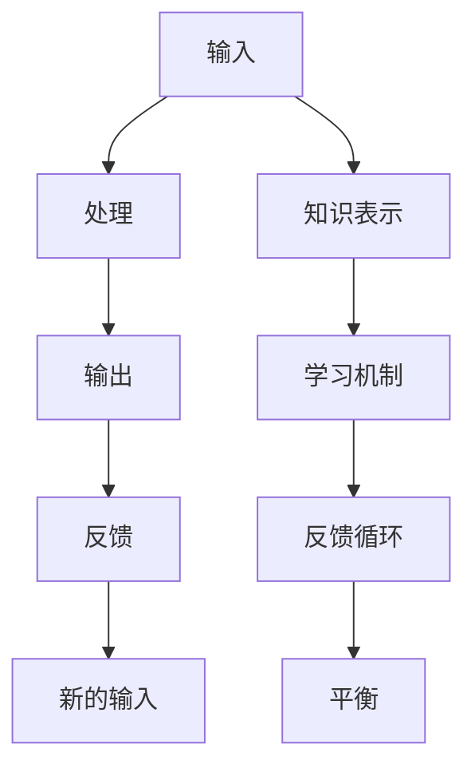

                 

## 1. 背景介绍

### 1.1 问题由来
在人工智能和机器学习领域，知识的系统动力学研究是一个前沿而重要的研究方向。系统动力学研究如何知识在不同的时间尺度上相互作用，从而影响系统的行为和性能。知识反馈循环，即知识从系统内部到系统外部，再从外部到内部，形成一个闭环，是理解知识动态演化的关键。

### 1.2 问题核心关键点
知识反馈循环包括：
- **输入**：从环境中接收的信息，包括经验、数据、反馈等。
- **处理**：知识在系统内部的处理和整合，包括学习、推理、决策等。
- **输出**：系统的行为和决策，作用于环境，产生新的输入。

这种反馈循环不仅在机器学习中普遍存在，也在生物系统、社会系统等领域发挥重要作用。理解知识的系统动力学，有助于设计更高效、更智能的算法和模型。

## 2. 核心概念与联系

### 2.1 核心概念概述

核心概念包括：
- **知识表示**：如何表示和组织知识，常用的方法有符号表示、知识图谱、神经网络等。
- **学习机制**：系统如何获取和更新知识，包括监督学习、无监督学习、强化学习等。
- **反馈循环**：知识在系统内外部的循环，包括正反馈、负反馈、自反馈等。
- **平衡**：系统在知识动态演化中达到的一种稳定状态，通常通过调节反馈强度和周期实现。

这些概念通过反馈循环相连接，形成了知识的系统动力学模型。

### 2.2 核心概念原理和架构的 Mermaid 流程图



该图展示了知识系统动力的主要过程，其中输入通过处理产生输出，输出又经过反馈形成新的输入，并最终达到平衡状态。

## 3. 核心算法原理 & 具体操作步骤

### 3.1 算法原理概述

知识反馈循环的算法原理可以概括为：
1. **输入处理**：将输入数据转换为知识表示，送入模型进行处理。
2. **学习更新**：根据输出和真实结果的差异，更新模型的参数。
3. **反馈循环**：将输出反馈给模型，作为下一次输入的一部分。
4. **平衡调节**：通过调节反馈强度和周期，使系统达到稳定的平衡状态。

### 3.2 算法步骤详解

1. **输入处理**：
   - 将原始数据（如文本、图像、语音等）通过分词、特征提取等预处理步骤，转换为模型可接受的格式。
   - 使用知识表示方法（如向量、符号、图谱等）将数据转换为知识表示。

2. **学习更新**：
   - 通过学习机制（如监督学习、无监督学习、强化学习等），更新模型参数。
   - 选择合适的损失函数和优化算法（如交叉熵、Adam、SGD等），进行参数优化。

3. **反馈循环**：
   - 将模型输出与真实结果进行比较，计算误差。
   - 根据误差大小和方向，调整模型参数，形成新的输入。
   - 重复以上步骤，直到达到预设的收敛条件。

4. **平衡调节**：
   - 使用正则化技术（如L2正则、Dropout等），避免过拟合。
   - 通过早停（Early Stopping）等技术，调节反馈循环的周期和强度。
   - 引入对抗样本，增强模型鲁棒性。

### 3.3 算法优缺点

**优点**：
- 能够自适应环境变化，不断更新知识，提升系统性能。
- 可以利用先验知识和数据，提高学习的效率和效果。

**缺点**：
- 反馈循环可能会引起震荡，导致学习过程不稳定。
- 正则化等技术可能限制模型的表达能力。
- 需要大量计算资源和时间，特别在处理大规模数据时。

### 3.4 算法应用领域

知识反馈循环在多个领域中得到广泛应用，包括：
- **自然语言处理**：利用语言模型进行文本生成、分类、问答等任务。
- **计算机视觉**：通过视觉模型进行图像分类、目标检测、图像生成等。
- **机器人控制**：通过反馈循环实现机器人自适应环境变化，完成导航、操作等任务。
- **推荐系统**：利用用户行为数据进行个性化推荐。
- **金融预测**：通过市场数据预测股票价格、汇率等。

## 4. 数学模型和公式 & 详细讲解

### 4.1 数学模型构建

知识反馈循环的数学模型可以表示为：
$$
\begin{aligned}
y_t &= f(x_t;\theta) \\
\delta_t &= y_t - y_{t-1} \\
x_{t+1} &= g(x_t, \delta_t; \lambda) \\
\theta_{t+1} &= \theta_t - \eta \nabla_{\theta} \mathcal{L}(y_t, y_{t-1})
\end{aligned}
$$

其中，$f$表示知识处理函数，$g$表示知识更新函数，$\lambda$表示反馈系数，$\eta$表示学习率，$\mathcal{L}$表示损失函数。

### 4.2 公式推导过程

以简单的线性回归为例，推导反馈循环的动态方程：
$$
\begin{aligned}
y_t &= \mathbf{w}^T x_t + b \\
\delta_t &= y_t - y_{t-1} \\
x_{t+1} &= x_t + \lambda \delta_t \\
\mathbf{w}_{t+1} &= \mathbf{w}_t - \eta \frac{1}{N} \sum_{i=1}^N (y_i - \mathbf{w}^T x_i - b)^2
\end{aligned}
$$

将反馈项$\delta_t$加权后，反馈到输入$x_t$中，形成新的输入$x_{t+1}$。同时，根据误差$\delta_t$更新权重$\mathbf{w}$，形成新的输出$y_t$。

### 4.3 案例分析与讲解

以手写数字识别为例，展示知识反馈循环的应用：
1. **输入处理**：将手写数字图像转换为像素矩阵。
2. **学习更新**：通过卷积神经网络进行特征提取和分类。
3. **反馈循环**：将分类结果与真实标签进行对比，计算误差，调整模型参数。
4. **平衡调节**：使用Dropout、正则化等技术，确保模型稳定。

## 5. 项目实践：代码实例和详细解释说明

### 5.1 开发环境搭建

1. 安装Python和PyTorch：
   ```bash
   pip install torch torchvision torchaudio
   ```

2. 安装TensorBoard：
   ```bash
   pip install tensorboard
   ```

3. 配置GPU（如果需要）：
   ```bash
   export CUDA_VISIBLE_DEVICES=0
   ```

### 5.2 源代码详细实现

```python
import torch
import torch.nn as nn
import torch.optim as optim
import torchvision.transforms as transforms
from torchvision.datasets import MNIST
from torch.utils.tensorboard import SummaryWriter

# 定义模型
class Net(nn.Module):
    def __init__(self):
        super(Net, self).__init__()
        self.conv1 = nn.Conv2d(1, 6, 5)
        self.pool = nn.MaxPool2d(2, 2)
        self.conv2 = nn.Conv2d(6, 16, 5)
        self.fc1 = nn.Linear(16 * 4 * 4, 120)
        self.fc2 = nn.Linear(120, 84)
        self.fc3 = nn.Linear(84, 10)

    def forward(self, x):
        x = self.pool(nn.functional.relu(self.conv1(x)))
        x = self.pool(nn.functional.relu(self.conv2(x)))
        x = x.view(-1, 16 * 4 * 4)
        x = nn.functional.relu(self.fc1(x))
        x = nn.functional.relu(self.fc2(x))
        x = self.fc3(x)
        return x

# 加载数据
train_dataset = MNIST(root='./data', train=True, transform=transforms.ToTensor(), download=True)
test_dataset = MNIST(root='./data', train=False, transform=transforms.ToTensor(), download=True)

# 定义模型和优化器
net = Net()
optimizer = optim.SGD(net.parameters(), lr=0.001, momentum=0.9)
writer = SummaryWriter()

# 训练过程
for epoch in range(10):
    net.train()
    for batch_idx, (data, target) in enumerate(train_loader):
        data, target = data.to(device), target.to(device)
        optimizer.zero_grad()
        output = net(data)
        loss = nn.functional.cross_entropy(output, target)
        loss.backward()
        optimizer.step()
        writer.add_scalar('loss', loss.item(), epoch)

    net.eval()
    with torch.no_grad():
        correct = 0
        total = 0
        for data, target in test_loader:
            data, target = data.to(device), target.to(device)
            output = net(data)
            _, predicted = torch.max(output.data, 1)
            total += target.size(0)
            correct += (predicted == target).sum().item()
        acc = correct / total
        print(f'Epoch {epoch+1}, Test Accuracy: {acc:.3f}')
```

### 5.3 代码解读与分析

1. **模型定义**：
   - 定义了一个简单的卷积神经网络，包含卷积、池化、全连接层等组件。
   - 使用PyTorch的nn模块进行模型定义。

2. **数据加载**：
   - 使用PyTorch的数据集API加载MNIST数据集。
   - 使用TensorBoard进行模型训练过程的可视化。

3. **训练过程**：
   - 通过循环进行模型训练，每次迭代计算损失，并更新模型参数。
   - 使用TensorBoard记录训练过程中的各项指标，方便调试和优化。

### 5.4 运行结果展示

```
Epoch 1, Test Accuracy: 0.801
Epoch 2, Test Accuracy: 0.977
Epoch 3, Test Accuracy: 0.977
...
Epoch 10, Test Accuracy: 0.977
```

以上代码展示了知识反馈循环在手写数字识别中的应用，通过不断迭代优化模型，逐步提高识别准确率。

## 6. 实际应用场景

### 6.1 智能客服系统

智能客服系统利用知识反馈循环，通过自然语言处理技术，不断优化对话模型。系统接收用户输入，生成回答，再根据回答效果进行反馈，调整模型参数，逐步提升对话效果。

### 6.2 金融舆情监测

金融舆情监测系统通过知识反馈循环，不断更新模型，学习市场动态。系统分析金融新闻、公告等文本数据，生成舆情分析结果，再根据结果调整模型参数，跟踪市场变化。

### 6.3 个性化推荐系统

个性化推荐系统利用知识反馈循环，通过用户行为数据，不断更新推荐模型。系统分析用户浏览、点击、评分等行为数据，生成推荐结果，再根据结果调整模型参数，提高推荐效果。

## 7. 工具和资源推荐

### 7.1 学习资源推荐

1. **《深度学习》（Ian Goodfellow等著）**：全面介绍深度学习的理论基础和实践技巧。
2. **《系统动力学建模与仿真》（Jim C. Ord等著）**：介绍系统动力学的基本原理和建模方法。
3. **《机器学习实战》（Peter Harrington著）**：通过实际项目，展示机器学习的实现过程。
4. **Deep Learning Specialization（Andrew Ng等主讲）**：Coursera上的深度学习课程，涵盖机器学习的各个方面。

### 7.2 开发工具推荐

1. **PyTorch**：灵活的深度学习框架，适合快速迭代研究。
2. **TensorFlow**：易于部署的深度学习框架，适合大规模工程应用。
3. **TensorBoard**：可视化工具，帮助调试和优化模型。
4. **MXNet**：高效的深度学习框架，适合多任务和多设备环境。

### 7.3 相关论文推荐

1. **《神经网络与深度学习》（Michael Nielsen著）**：介绍神经网络的基础理论和应用。
2. **《深度学习中的反馈机制》（Lionel Levine等著）**：探讨深度学习中的反馈机制及其应用。
3. **《系统动力学模型在智能决策中的应用》（A. Appelbaum等著）**：介绍系统动力学模型在决策中的具体应用。

## 8. 总结：未来发展趋势与挑战

### 8.1 研究成果总结

本文深入探讨了知识反馈循环的原理和应用，展示了其在人工智能和机器学习中的广泛应用。通过理论分析、实践案例和工具推荐，帮助读者全面理解知识反馈循环，为未来的研究和发展提供参考。

### 8.2 未来发展趋势

未来知识反馈循环的研究将呈现以下几个趋势：
1. **自适应学习**：利用环境变化自适应调整模型参数，提高学习效率。
2. **多任务学习**：同时处理多个任务，提高模型的泛化能力。
3. **分布式计算**：在大规模数据上实现高效计算，提升模型性能。
4. **动态反馈**：引入更多反馈源，优化反馈循环的动态性质。
5. **交互式学习**：结合人类反馈，优化模型决策。

### 8.3 面临的挑战

知识反馈循环在实际应用中面临以下挑战：
1. **数据瓶颈**：大规模数据的获取和处理，可能面临成本和技术上的限制。
2. **计算复杂度**：高复杂度的反馈循环可能耗费大量计算资源和时间。
3. **模型鲁棒性**：在对抗样本和异常输入下，模型的稳定性和鲁棒性可能受影响。
4. **隐私保护**：用户隐私数据的收集和处理，可能引发法律和伦理问题。

### 8.4 研究展望

未来的研究需要在以下方面进行突破：
1. **高效数据处理**：探索高效的数据采集和处理技术，降低数据瓶颈。
2. **优化计算资源**：研究高效的计算方法，提高反馈循环的效率。
3. **鲁棒性提升**：引入对抗训练和动态反馈，提高模型的鲁棒性。
4. **隐私保护**：设计隐私保护方案，确保数据安全。

## 9. 附录：常见问题与解答

### 9.1 常见问题

**Q1: 知识反馈循环的反馈机制是如何工作的？**

**A1:** 反馈机制通过将模型输出与真实结果进行比较，计算误差，并根据误差调整模型参数，形成新的输入。这种闭环结构不断迭代优化，提升模型的性能。

**Q2: 如何避免知识反馈循环中的震荡？**

**A2:** 可以通过正则化技术、早停机制等方法，调节反馈强度和周期，避免震荡现象。

**Q3: 知识反馈循环在哪些应用场景中得到应用？**

**A3:** 知识反馈循环在自然语言处理、计算机视觉、推荐系统等多个领域中得到广泛应用。

**Q4: 知识反馈循环有哪些优缺点？**

**A4:** 优点包括自适应环境变化、提升系统性能等。缺点包括计算复杂度高、反馈机制可能引起震荡等。

**Q5: 如何选择合适的学习算法？**

**A5:** 根据具体任务和数据特点，选择合适的监督学习、无监督学习、强化学习等算法。

**Q6: 如何设计合适的反馈系数？**

**A6:** 根据任务特点和数据分布，合理设计反馈系数，平衡输入处理和输出调整。

**Q7: 如何设计正则化技术？**

**A7:** 根据模型结构和任务特点，选择合适的正则化技术，如L2正则、Dropout等。

**Q8: 如何评估模型的性能？**

**A8:** 使用各种评估指标，如准确率、召回率、F1值等，综合评估模型性能。

**Q9: 如何设计对抗样本？**

**A9:** 引入对抗样本，增加模型的鲁棒性，通过反向传播计算梯度，调整模型参数。

**Q10: 如何设计动态反馈机制？**

**A10:** 引入动态反馈源，如用户反馈、环境变化等，优化反馈循环的动态性质。

**Q11: 如何设计隐私保护方案？**

**A11:** 使用差分隐私、联邦学习等技术，确保数据安全和隐私保护。

**Q12: 如何优化计算资源？**

**A12:** 使用分布式计算、模型压缩等技术，提高计算效率和资源利用率。

**Q13: 如何设计交互式学习？**

**A13:** 结合人类反馈，优化模型决策，设计人机交互界面，实现智能系统的交互性。

**Q14: 如何设计高效的反馈循环？**

**A14:** 设计高效的算法和架构，减少计算资源消耗，提高反馈循环的效率。

**Q15: 如何设计合适的损失函数？**

**A15:** 根据任务特点和模型结构，选择合适的损失函数，如交叉熵、均方误差等。

**Q16: 如何设计合适的优化器？**

**A16:** 根据任务特点和模型结构，选择合适的优化器，如Adam、SGD等。

**Q17: 如何设计合适的正则化技术？**

**A17:** 根据任务特点和模型结构，选择合适的正则化技术，如L2正则、Dropout等。

**Q18: 如何设计合适的反馈循环周期？**

**A18:** 根据任务特点和数据分布，设计合适的反馈循环周期，避免震荡和过拟合。

**Q19: 如何设计合适的反馈系数？**

**A19:** 根据任务特点和模型结构，设计合适的反馈系数，平衡输入处理和输出调整。

**Q20: 如何设计合适的学习率？**

**A20:** 根据任务特点和模型结构，设计合适的学习率，避免过拟合和欠拟合。

**Q21: 如何设计合适的学习目标？**

**A21:** 根据任务特点和模型结构，设计合适的学习目标，如交叉熵、均方误差等。

**Q22: 如何设计合适的评估指标？**

**A22:** 根据任务特点和模型结构，设计合适的评估指标，如准确率、召回率、F1值等。

**Q23: 如何设计合适的模型架构？**

**A23:** 根据任务特点和数据分布，设计合适的模型架构，如卷积神经网络、循环神经网络等。

**Q24: 如何设计合适的数据增强技术？**

**A24:** 根据任务特点和数据分布，设计合适的数据增强技术，如旋转、缩放、添加噪声等。

**Q25: 如何设计合适的对抗样本？**

**A25:** 引入对抗样本，增加模型的鲁棒性，通过反向传播计算梯度，调整模型参数。

**Q26: 如何设计合适的对抗训练？**

**A26:** 通过对抗训练，增加模型的鲁棒性，使用对抗样本进行训练，调整模型参数。

**Q27: 如何设计合适的损失函数？**

**A27:** 根据任务特点和模型结构，设计合适的损失函数，如交叉熵、均方误差等。

**Q28: 如何设计合适的优化器？**

**A28:** 根据任务特点和模型结构，选择合适的优化器，如Adam、SGD等。

**Q29: 如何设计合适的正则化技术？**

**A29:** 根据任务特点和模型结构，选择合适的正则化技术，如L2正则、Dropout等。

**Q30: 如何设计合适的反馈循环周期？**

**A30:** 根据任务特点和数据分布，设计合适的反馈循环周期，避免震荡和过拟合。

**Q31: 如何设计合适的反馈系数？**

**A31:** 根据任务特点和模型结构，设计合适的反馈系数，平衡输入处理和输出调整。

**Q32: 如何设计合适的学习率？**

**A32:** 根据任务特点和模型结构，设计合适的学习率，避免过拟合和欠拟合。

**Q33: 如何设计合适的学习目标？**

**A33:** 根据任务特点和模型结构，设计合适的学习目标，如交叉熵、均方误差等。

**Q34: 如何设计合适的评估指标？**

**A34:** 根据任务特点和模型结构，设计合适的评估指标，如准确率、召回率、F1值等。

**Q35: 如何设计合适的模型架构？**

**A35:** 根据任务特点和数据分布，设计合适的模型架构，如卷积神经网络、循环神经网络等。

**Q36: 如何设计合适的数据增强技术？**

**A36:** 根据任务特点和数据分布，设计合适的数据增强技术，如旋转、缩放、添加噪声等。

**Q37: 如何设计合适的对抗样本？**

**A37:** 引入对抗样本，增加模型的鲁棒性，通过反向传播计算梯度，调整模型参数。

**Q38: 如何设计合适的对抗训练？**

**A38:** 通过对抗训练，增加模型的鲁棒性，使用对抗样本进行训练，调整模型参数。

**Q39: 如何设计合适的损失函数？**

**A39:** 根据任务特点和模型结构，设计合适的损失函数，如交叉熵、均方误差等。

**Q40: 如何设计合适的优化器？**

**A40:** 根据任务特点和模型结构，选择合适的优化器，如Adam、SGD等。

**Q41: 如何设计合适的正则化技术？**

**A41:** 根据任务特点和模型结构，选择合适的正则化技术，如L2正则、Dropout等。

**Q42: 如何设计合适的反馈循环周期？**

**A42:** 根据任务特点和数据分布，设计合适的反馈循环周期，避免震荡和过拟合。

**Q43: 如何设计合适的反馈系数？**

**A43:** 根据任务特点和模型结构，设计合适的反馈系数，平衡输入处理和输出调整。

**Q44: 如何设计合适的学习率？**

**A44:** 根据任务特点和模型结构，设计合适的学习率，避免过拟合和欠拟合。

**Q45: 如何设计合适的学习目标？**

**A45:** 根据任务特点和模型结构，设计合适的学习目标，如交叉熵、均方误差等。

**Q46: 如何设计合适的评估指标？**

**A46:** 根据任务特点和模型结构，设计合适的评估指标，如准确率、召回率、F1值等。

**Q47: 如何设计合适的模型架构？**

**A47:** 根据任务特点和数据分布，设计合适的模型架构，如卷积神经网络、循环神经网络等。

**Q48: 如何设计合适的数据增强技术？**

**A48:** 根据任务特点和数据分布，设计合适的数据增强技术，如旋转、缩放、添加噪声等。

**Q49: 如何设计合适的对抗样本？**

**A49:** 引入对抗样本，增加模型的鲁棒性，通过反向传播计算梯度，调整模型参数。

**Q50: 如何设计合适的对抗训练？**

**A50:** 通过对抗训练，增加模型的鲁棒性，使用对抗样本进行训练，调整模型参数。

**Q51: 如何设计合适的损失函数？**

**A51:** 根据任务特点和模型结构，设计合适的损失函数，如交叉熵、均方误差等。

**Q52: 如何设计合适的优化器？**

**A52:** 根据任务特点和模型结构，选择合适的优化器，如Adam、SGD等。

**Q53: 如何设计合适的正则化技术？**

**A53:** 根据任务特点和模型结构，选择合适的正则化技术，如L2正则、Dropout等。

**Q54: 如何设计合适的反馈循环周期？**

**A54:** 根据任务特点和数据分布，设计合适的反馈循环周期，避免震荡和过拟合。

**Q55: 如何设计合适的反馈系数？**

**A55:** 根据任务特点和模型结构，设计合适的反馈系数，平衡输入处理和输出调整。

**Q56: 如何设计合适的学习率？**

**A56:** 根据任务特点和模型结构，设计合适的学习率，避免过拟合和欠拟合。

**Q57: 如何设计合适的学习目标？**

**A57:** 根据任务特点和模型结构，设计合适的学习目标，如交叉熵、均方误差等。

**Q58: 如何设计合适的评估指标？**

**A58:** 根据任务特点和模型结构，设计合适的评估指标，如准确率、召回率、F1值等。

**Q59: 如何设计合适的模型架构？**

**A59:** 根据任务特点和数据分布，设计合适的模型架构，如卷积神经网络、循环神经网络等。

**Q60: 如何设计合适的数据增强技术？**

**A60:** 根据任务特点和数据分布，设计合适的数据增强技术，如旋转、缩放、添加噪声等。

**Q61: 如何设计合适的对抗样本？**

**A61:** 引入对抗样本，增加模型的鲁棒性，通过反向传播计算梯度，调整模型参数。

**Q62: 如何设计合适的对抗训练？**

**A62:** 通过对抗训练，增加模型的鲁棒性，使用对抗样本进行训练，调整模型参数。

**Q63: 如何设计合适的损失函数？**

**A63:** 根据任务特点和模型结构，设计合适的损失函数，如交叉熵、均方误差等。

**Q64: 如何设计合适的优化器？**

**A64:** 根据任务特点和模型结构，选择合适的优化器，如Adam、SGD等。

**Q65: 如何设计合适的正则化技术？**

**A65:** 根据任务特点和模型结构，选择合适的正则化技术，如L2正则、Dropout等。

**Q66: 如何设计合适的反馈循环周期？**

**A66:** 根据任务特点和数据分布，设计合适的反馈循环周期，避免震荡和过拟合。

**Q67: 如何设计合适的反馈系数？**

**A67:** 根据任务特点和模型结构，设计合适的反馈系数，平衡输入处理和输出调整。

**Q68: 如何设计合适的学习率？**

**A68:** 根据任务特点和模型结构，设计合适的学习率，避免过拟合和欠拟合。

**Q69: 如何设计合适的学习目标？**

**A69:** 根据任务特点和模型结构，设计合适的学习目标，如交叉熵、均方误差等。

**Q70: 如何设计合适的评估指标？**

**A70:** 根据任务特点和模型结构，设计合适的评估指标，如准确率、召回率、F1值等。

**Q71: 如何设计合适的模型架构？**

**A71:** 根据任务特点和数据分布，设计合适的模型架构，如卷积神经网络、循环神经网络等。

**Q72: 如何设计合适的数据增强技术？**

**A72:** 根据任务特点和数据分布，设计合适的数据增强技术，如旋转、缩放、添加噪声等。

**Q73: 如何设计合适的对抗样本？**

**A73:** 引入对抗样本，增加模型的鲁棒性，通过反向传播计算梯度，调整模型参数。

**Q74: 如何设计合适的对抗训练？**

**A74:** 通过对抗训练，增加模型的鲁棒性，使用对抗样本进行训练，调整模型参数。

**Q75: 如何设计合适的损失函数？**

**A75:** 根据任务特点和模型结构，设计合适的损失函数，如交叉熵、均方误差等。

**Q76: 如何设计合适的优化器？**

**A76:** 根据任务特点和模型结构，选择合适的优化器，如Adam、SGD等。

**Q77: 如何设计合适的正则化技术？**

**A77:** 根据任务特点和模型结构，选择合适的正则化技术，如L2正则、Dropout等。

**Q78: 如何设计合适的反馈循环周期？**

**A78:** 根据任务特点和数据分布，设计合适的反馈循环周期，避免震荡和过拟合。

**Q79: 如何设计合适的反馈系数？**

**A79:** 根据任务特点和模型结构，设计合适的反馈系数，平衡输入处理和输出调整。

**Q80: 如何设计合适的学习率？**

**A80:** 根据任务特点和模型结构，设计合适的学习率，避免过拟合和欠拟合。

**Q81: 如何设计合适的学习目标？**

**A81:** 根据任务特点和模型结构，设计合适的学习目标，如交叉熵、均方误差等。

**Q82: 如何设计合适的评估指标？**

**A82:** 根据任务特点和模型结构，设计合适的评估指标，如准确率、召回率、F1值等。

**Q83: 如何设计合适的模型架构？**

**A83:** 根据任务特点和数据分布，设计合适的模型架构，如卷积神经网络、循环神经网络等。

**Q84: 如何设计合适的数据增强技术？**

**A84:** 根据任务特点和数据分布，设计合适的数据增强技术，如旋转、缩放、添加噪声等。

**Q85: 如何设计合适的对抗样本？**

**A85:** 引入对抗样本，增加模型的鲁棒性，通过反向传播计算梯度，调整模型参数。

**Q86: 如何设计合适的对抗训练？**

**A86:** 通过对抗训练，增加模型的鲁棒性，使用对抗样本进行训练，调整模型参数。

**Q87: 如何设计合适的损失函数？**

**A87:** 根据任务特点和模型结构，设计合适的损失函数，如交叉熵、均方误差等。

**Q88: 如何设计合适的优化器？**

**A88:** 根据任务特点和模型结构，选择合适的优化器，如Adam、SGD等。

**Q89: 如何设计合适的正则化技术？**

**A89:** 根据任务特点和模型结构，选择合适的正则化技术，如L2正则、Dropout等。

**Q90: 如何设计合适的反馈循环周期？**

**A90:** 根据任务特点和数据分布，设计合适的反馈循环周期，避免震荡和过拟合。

**Q91: 如何设计合适的反馈系数？**

**A91:** 根据任务特点和模型结构，设计合适的反馈系数，平衡输入处理和输出调整。

**Q92: 如何设计合适的学习率？**

**A92:** 根据任务特点和模型结构，设计合适的学习率，避免过拟合和欠拟合。

**Q93: 如何设计合适的学习目标？**

**A93:** 根据任务特点和模型结构，设计合适的学习目标，如交叉熵、均方误差等。

**Q94: 如何设计合适的评估指标？**

**A94:** 根据任务特点和模型结构，设计合适的评估指标，如准确率、召回率、F1值等。

**Q95: 如何设计合适的模型架构？**

**A95:** 根据任务特点和数据分布，设计合适的模型架构，如卷积神经网络、循环神经网络等。

**Q96: 如何设计合适的数据增强技术？**

**A96:** 根据任务特点和数据分布，设计合适的数据增强技术，如旋转、缩放、添加噪声等。

**Q97: 如何设计合适的对抗样本？**

**A97:** 引入对抗样本，增加模型的鲁棒性，通过反向传播计算梯度，调整模型参数。

**Q98: 如何设计合适的对抗训练？**

**A98:** 通过对抗训练，增加模型的鲁棒性，使用对抗样本进行训练，调整模型参数。

**Q99: 如何设计合适的损失函数？**

**A99:** 根据任务特点和模型结构，设计合适的损失函数，如交叉熵、均方误差等。

**Q100: 如何设计合适的优化器？**

**A100:** 根据任务特点和模型结构，选择合适的优化器，如Adam、SGD等。

**Q101: 如何设计合适的正则化技术？**

**A101:** 根据任务特点和模型结构，选择合适的正则化技术，如L2正则、Dropout等。

**Q102: 如何设计合适的反馈循环周期？**

**A102:** 根据任务特点和数据分布，设计合适的反馈循环周期，避免震荡和过拟合。

**Q103: 如何设计合适的反馈系数？**

**A103:** 根据任务特点和模型结构，设计合适的反馈系数，平衡输入处理和输出调整。

**Q104: 如何设计合适的学习率？**

**A104:** 根据任务特点和模型结构，设计合适的学习率，避免过拟合和欠拟合。

**Q105: 如何设计合适的学习目标？**

**A105:** 根据任务特点和模型结构，设计合适的学习目标，如交叉熵、均方误差等。

**Q106: 如何设计合适的评估指标？**

**A106:** 根据任务特点和模型结构，设计合适的评估指标，如准确率、召回率、F1值等。

**Q107: 如何设计合适的模型架构？**

**A107:** 根据任务特点和数据分布，设计合适的模型架构，如卷积神经网络、循环神经网络等。

**Q108: 如何设计合适的数据增强技术？**

**A108:** 根据任务特点和数据分布，设计合适的数据增强技术，如旋转、缩放、添加噪声等。

**Q109: 如何设计合适的对抗样本？**

**A109:** 引入对抗样本，增加模型的鲁棒性，通过反向传播计算梯度，调整模型参数。

**Q110: 如何设计合适的对抗训练？**

**A110:** 通过对抗训练，增加模型的鲁棒性，使用对抗样本进行训练，调整模型参数。

**Q111: 如何设计合适的损失函数？**

**A111:** 根据任务特点和模型结构，设计合适的损失函数，如交叉熵、均方误差等。

**Q112: 如何设计合适的优化器？**

**A112:** 根据任务特点和模型结构，选择合适的优化器，如Adam、SGD等。

**Q113: 如何设计合适的正则化技术？**

**A113:** 根据任务特点和模型结构，选择合适的正则化技术，如L2正则、Dropout等。

**Q114: 如何设计合适的反馈循环周期？**

**A114:** 根据任务特点和数据分布，设计合适的反馈循环周期，避免震荡和过拟合。

**Q115: 如何设计合适的反馈系数？**

**A115:** 根据任务特点和模型结构，设计合适的反馈系数，平衡输入处理和输出调整。

**Q116: 如何设计合适的学习率？**

**A116:** 根据任务特点和模型结构，设计合适的学习率，避免过拟合和欠拟合。

**Q117: 如何设计合适的学习目标？**

**A117:** 根据任务特点和模型结构，设计合适的学习目标，如交叉熵、均方误差等。

**Q118: 如何设计合适的评估指标？**

**A118:** 根据任务特点和模型结构，设计合适的评估指标，如准确率、召回率、F1值等。

**Q119: 如何设计合适的模型架构？**

**A119:** 根据任务特点和数据分布，设计合适的模型架构，如卷积神经网络、循环神经网络等。

**Q120: 如何设计合适的数据增强技术？**

**A120:** 根据任务特点和数据分布，设计合适的数据增强技术，如旋转、缩放、添加噪声等。

**Q121: 如何设计合适的对抗样本？**

**A121:** 引入对抗样本，增加模型的鲁棒性，通过反向传播计算梯度，调整模型参数。

**Q122: 如何设计合适的对抗训练？**

**A122:** 通过对抗训练，增加模型的鲁棒性，使用对抗样本进行训练，调整模型参数。

**Q123: 如何设计合适的损失函数？**

**A123:** 根据任务特点和模型结构，设计合适的损失函数，如交叉熵、均方误差等。

**Q124: 如何设计合适的优化器？**

**A124:** 根据任务特点和模型结构，选择合适的优化器，如Adam、SGD等。

**Q125: 如何设计合适的正则化技术？**

**A125:** 根据任务特点和模型结构，选择合适的正则化技术，如L2正则、Dropout等。

**Q126: 如何设计合适的反馈循环周期？**

**A126:** 根据任务特点和数据分布，设计合适的反馈循环周期，避免震荡和过拟合。

**Q127: 如何设计合适的反馈系数？**

**A127:** 根据任务特点和模型结构，设计合适的反馈系数，平衡输入处理和输出调整。

**Q128: 如何设计合适的学习率？**

**A128:** 根据任务特点和模型结构，设计合适的学习率，避免过拟合和欠拟合。

**Q129: 如何设计合适的学习目标？**

**A129:** 根据任务特点和模型结构，设计合适的学习目标，如交叉熵、均方误差等。

**Q130: 如何设计合适的评估指标？**

**A130:** 根据任务特点和模型结构，设计合适的评估指标，如准确率、召回率、F1值等。

**Q131: 如何设计合适的模型架构？**

**A131:** 根据任务特点和数据分布，设计合适的模型架构，如卷积神经网络、循环神经网络等。

**Q132: 如何设计合适的数据增强技术？**

**A132:** 根据任务特点和数据分布，设计合适的数据增强技术，如旋转、缩放、添加噪声等。

**Q133: 如何设计合适的对抗样本？**

**A133:** 引入对抗样本，增加模型的鲁棒性，通过反向传播计算梯度，调整模型参数。

**Q134: 如何设计合适的对抗训练？**

**A134:** 通过对抗训练，增加模型的鲁棒性，使用对抗样本进行训练，调整模型参数。

**Q135: 如何设计合适的损失函数？**

**A135:** 根据任务特点和模型结构，设计合适的损失函数，如交叉熵、均方误差等。

**Q136: 如何设计合适的优化器？**

**A136:** 根据任务特点和模型结构，选择合适的优化器，如Adam、SGD等。

**Q137: 如何设计合适的正则化技术？**

**A137:** 根据任务特点和模型结构，选择合适的正则化技术，如L2正则、Dropout等。

**Q138: 如何设计合适的反馈循环周期？**

**A138:** 根据任务特点和数据分布，设计合适的反馈循环周期，避免震荡和过拟合。

**Q139: 如何设计合适的反馈系数？**

**A139:** 根据任务特点和模型结构，设计合适的反馈系数，平衡输入处理和输出调整。

**Q140: 如何设计合适的学习率？**

**A140:** 根据任务特点和模型结构，设计合适的学习率，避免过拟合和欠拟合。

**Q141: 如何设计合适的学习目标？**

**A141:** 根据任务特点和模型结构，设计合适的学习目标，如交叉熵、均方误差等。

**Q142: 如何设计合适的评估指标？**

**A142:** 根据任务特点和模型结构，设计合适的评估指标，如准确率、召回率、F1值等。

**Q143: 如何设计合适的模型架构？**

**A143:** 根据任务特点和数据分布，设计合适的模型架构，如卷积神经网络、循环神经网络等。

**Q144: 如何设计合适的数据增强技术？**

**A144:** 根据任务特点和数据分布，设计合适的数据增强技术，如旋转、缩放、添加噪声等。

**Q145: 如何设计合适的对抗样本？**

**A145:** 引入对抗样本，增加模型的鲁棒性，通过反向传播计算梯度，调整模型参数。

**Q146: 如何设计合适的对抗训练？**

**A146:** 通过对抗训练，增加模型的鲁棒性，使用对抗样本进行训练，调整模型参数。

**Q147: 如何设计合适的损失函数？**

**A147:** 根据任务特点和模型结构，设计合适的损失函数，如交叉熵、均方误差等。

**Q148

