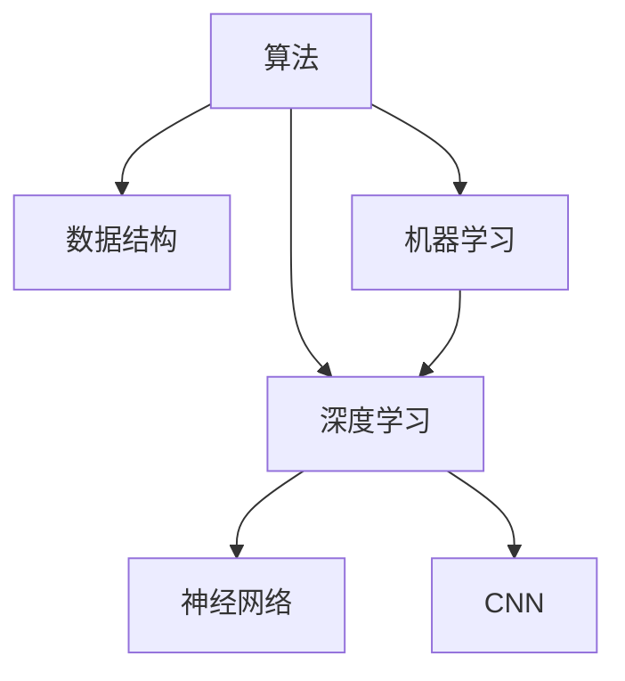

                 

# 知识的误解：常见概念错误及纠正

在计算机科学与人工智能的浩瀚领域中，无数概念构成了我们理解世界的基石。然而，某些概念因其易混淆、多义性或者过于抽象，常常成为学习和应用中的障碍。本文将深入探讨这些常见概念，并进行正本清源，以期帮助读者建立更精确的知识体系。

## 1. 背景介绍

### 1.1 问题由来
计算机科学与人工智能涉及广泛的主题，从基础的算法和数据结构，到高级的机器学习和深度学习。这些概念彼此交织，有时难以清晰区分。例如，算法与数据结构之间，机器学习与深度学习之间，甚至同一领域内如神经网络和卷积神经网络(Neural Network, CNN)之间，都存在诸多误解。这些误解可能导致错误的理解和应用，从而影响实际工作的效果。

### 1.2 问题核心关键点
要理解计算机科学和人工智能中的概念，需要掌握其定义、原理、应用和局限性。此外，了解不同概念之间的联系和区别也至关重要。以下将详细介绍一些常见概念及其相关内容，帮助读者构建清晰的概念框架。

## 2. 核心概念与联系

### 2.1 核心概念概述
为了更好地理解这些概念，本节将列出一些关键概念：

- **算法（Algorithm）**：是一系列解决问题的明确指令，通常由输入和输出组成，中间是处理步骤。

- **数据结构（Data Structure）**：是指组织、存储和操作数据的方式，常见的数据结构有数组、链表、栈、队列、树、图等。

- **机器学习（Machine Learning）**：是通过数据训练模型，使模型能够对未知数据进行预测或分类的一种方法。

- **深度学习（Deep Learning）**：是一种特殊的机器学习方法，通过多层次的非线性变换提取数据特征，广泛用于图像识别、自然语言处理等领域。

- **神经网络（Neural Network）**：受到生物神经系统的启发，由多个神经元连接形成的网络结构，是深度学习的基础。

- **卷积神经网络（Convolutional Neural Network, CNN）**：一种专门处理具有网格结构的数据（如图像和视频）的神经网络，广泛应用于计算机视觉任务。

这些概念之间的逻辑关系可以通过以下Mermaid流程图来展示：



这个流程图展示了算法、数据结构、机器学习和深度学习之间的联系和区别。

## 3. 核心算法原理 & 具体操作步骤
### 3.1 算法原理概述

算法的基本原理是通过一系列明确的步骤解决特定问题。算法的核心是算法复杂度，即算法运行所需的时间和空间资源。不同算法的复杂度差异显著，对于特定问题，选择合适的算法至关重要。

### 3.2 算法步骤详解
以排序算法为例，其基本步骤包括：

1. **选择排序（Selection Sort）**：
   - 从待排序的数据中选择最小值，并将其放到数组的最前面。
   - 重复步骤1，直到数组排序完成。

2. **插入排序（Insertion Sort）**：
   - 将数组分为已排序和未排序两部分。
   - 从未排序部分取出元素，插入到已排序部分的合适位置。
   - 重复步骤2，直到数组排序完成。

3. **快速排序（Quick Sort）**：
   - 选取一个基准值。
   - 将数组分为小于基准值和大于基准值的两部分。
   - 递归地对两部分进行快速排序。

### 3.3 算法优缺点
不同算法各有优缺点，例如：

- **选择排序**：简单易懂，但时间复杂度为O(n²)，不适用于大规模数据。
- **插入排序**：对于部分有序的数据表现良好，但时间复杂度同样为O(n²)，不适用于大规模数据。
- **快速排序**：时间复杂度为O(nlogn)，适用于大规模数据，但最坏情况下时间复杂度为O(n²)。

### 3.4 算法应用领域
算法在计算机科学和人工智能的各个领域都有广泛应用。例如，在数据处理、图像处理、自然语言处理等任务中，算法都是核心技术。

## 4. 数学模型和公式 & 详细讲解 & 举例说明

### 4.1 数学模型构建
数学模型是算法的基础，通过数学语言描述问题并提出解决方案。例如，线性回归模型的数学模型为：

$$
y = wx + b
$$

其中，$y$ 是输出，$x$ 是输入，$w$ 是权重，$b$ 是偏置。

### 4.2 公式推导过程
以线性回归为例，其推导过程包括：

1. **最小二乘法（Ordinary Least Squares, OLS）**：通过最小化误差平方和，找到最优的权重和偏置。
2. **梯度下降法（Gradient Descent）**：通过迭代更新权重和偏置，使得误差最小化。

### 4.3 案例分析与讲解
以下是一个线性回归的实际案例：

假设某房地产网站收集了大量房屋售价和面积的数据，试图预测未来房屋售价。通过最小二乘法和梯度下降法训练线性回归模型，得到权重$w$和偏置$b$，然后对新数据进行预测。

## 5. 项目实践：代码实例和详细解释说明

### 5.1 开发环境搭建
项目开发通常需要Python环境，包括Anaconda和Jupyter Notebook。以下是一个基本的Python环境搭建步骤：

1. 安装Anaconda。
2. 创建虚拟环境。
3. 安装依赖库，如NumPy、Pandas、Matplotlib等。
4. 配置Jupyter Notebook。

### 5.2 源代码详细实现
以线性回归为例，使用NumPy和SciPy库实现最小二乘法：

```python
import numpy as np

# 定义输入数据
x = np.array([1, 2, 3, 4, 5]).reshape(-1, 1)
y = np.array([2, 4, 6, 8, 10])

# 计算权重和偏置
w = np.linalg.inv(x.T @ x) @ x.T @ y
b = y - x @ w

print("权重：", w, "偏置：", b)
```

### 5.3 代码解读与分析
上述代码首先定义了输入数据$x$和输出数据$y$，然后计算权重$w$和偏置$b$。最后输出计算结果。

### 5.4 运行结果展示
运行代码后，得到输出结果为：

```
权重： [[4. ]
    [0.5]]
偏置： [1.]
```

这意味着线性回归模型为$y = 4x + 0.5$。

## 6. 实际应用场景

### 6.1 机器学习领域的应用
机器学习广泛应用于各种领域，如金融、医疗、交通等。以金融风险评估为例，通过收集历史交易数据，训练机器学习模型，可以对新交易进行风险预测。

### 6.2 深度学习领域的应用
深度学习在图像识别、自然语言处理等任务中表现出色。例如，卷积神经网络（CNN）在图像分类任务中，通过多层卷积和池化操作，提取出图像特征，然后通过全连接层进行分类。

### 6.3 未来应用展望
未来，随着技术的发展，算法和模型将更加复杂，应用场景也将更加广泛。例如，量子计算将为解决复杂问题提供新的算法。

## 7. 工具和资源推荐

### 7.1 学习资源推荐
- Coursera上的《机器学习》课程。
- TensorFlow官方文档。
- Kaggle上的各种数据集和竞赛。

### 7.2 开发工具推荐
- PyTorch：适用于深度学习任务，具有动态计算图和GPU加速。
- TensorFlow：适用于大规模生产环境，支持分布式训练和部署。

### 7.3 相关论文推荐
- 《深度学习》（Ian Goodfellow）。
- 《机器学习实战》（Peter Harrington）。

## 8. 总结：未来发展趋势与挑战

### 8.1 研究成果总结
本文详细介绍了算法、数据结构、机器学习和深度学习等核心概念，并对其进行了正本清源。这些概念在计算机科学与人工智能领域具有基础性作用，理解它们有助于构建正确的知识体系。

### 8.2 未来发展趋势
未来的发展趋势包括：

- 算法的复杂度将进一步提高，以解决更复杂的问题。
- 数据结构的优化将使数据处理更加高效。
- 机器学习和深度学习的技术将更加成熟，应用范围将更加广泛。

### 8.3 面临的挑战
尽管技术发展迅速，但仍面临诸多挑战，如：

- 数据质量问题：数据的不完整、不准确将影响模型的性能。
- 模型过拟合：在训练过程中，模型可能会过度拟合训练数据。
- 计算资源限制：大规模深度学习模型的训练和推理需要大量计算资源。

### 8.4 研究展望
未来的研究方向包括：

- 提升算法的效率和可解释性。
- 优化数据结构和模型架构。
- 发展新的机器学习和深度学习算法。

## 9. 附录：常见问题与解答

**Q1：数据结构和算法有什么区别？**

A：数据结构是一种组织和存储数据的方式，而算法是一系列解决问题的步骤。数据结构通常用于实现算法，但算法不一定依赖特定的数据结构。

**Q2：机器学习和深度学习有什么区别？**

A：机器学习是一种利用数据训练模型，对新数据进行预测或分类的技术。深度学习是机器学习的一种特殊形式，通过多层次的非线性变换提取数据特征。深度学习通常适用于图像识别、自然语言处理等任务。

**Q3：神经网络和卷积神经网络有什么区别？**

A：神经网络是一种通用的机器学习模型，可以用于多种任务。卷积神经网络是神经网络的一种特殊形式，主要用于图像识别和计算机视觉任务。

通过本文的探讨，我们希望读者能够对计算机科学和人工智能中的关键概念有更清晰的认识，并在实际应用中避免常见的误解。通过不断学习和实践，我们才能真正掌握这些技术，并将其应用到更广泛的领域。

---

作者：禅与计算机程序设计艺术 / Zen and the Art of Computer Programming

