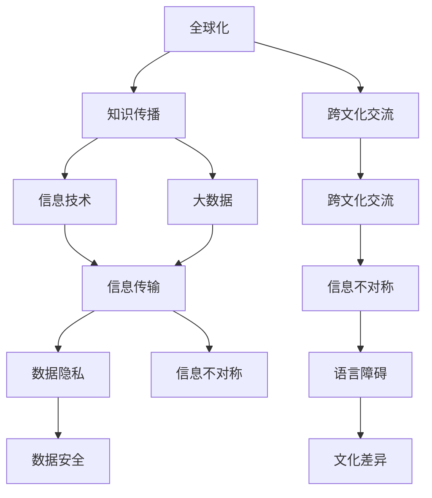

                 

# 知识的跨文化传播：全球化时代的挑战

> 关键词：全球化，知识传播，跨文化，信息技术，人工智能，大数据

## 1. 背景介绍

### 1.1 问题由来

随着全球化的深入，不同国家和文化之间的交流日益频繁，知识的传播和分享成为连接各国的桥梁。信息技术和大数据技术的进步为知识的跨文化传播提供了新的工具和方法，但同时也带来了新的挑战。本文将从信息技术和大数据的角度，探讨全球化时代知识跨文化传播的现状、面临的挑战以及未来发展趋势。

### 1.2 问题核心关键点

- **全球化与知识传播**：全球化加速了各国之间的文化交流，但不同语言、文化背景下的知识传播面临着障碍。
- **信息技术与知识传播**：信息技术和大数据技术的进步极大地促进了知识的跨文化传播，但同时也带来了新的问题。
- **跨文化交流的挑战**：文化差异、语言障碍、信息不对称等问题，使得知识的跨文化传播更加复杂。
- **未来发展方向**：如何克服跨文化传播中的障碍，促进全球知识共享，是当前信息技术和大数据领域的重要研究方向。

### 1.3 问题研究意义

研究知识跨文化传播的挑战，对于推动全球化进程、促进各国之间的科技交流与合作、提升全球整体科技水平具有重要意义。信息技术和大数据技术的应用，有望克服传统知识传播中的障碍，实现知识的全球共享，促进各国之间的科技合作与创新。

## 2. 核心概念与联系

### 2.1 核心概念概述

为更好地理解全球化时代知识跨文化传播的挑战，本节将介绍几个密切相关的核心概念：

- **全球化**：指不同国家和文化之间的交流日益频繁，经济、政治、文化等多个方面呈现出全球一体化趋势。
- **知识传播**：指通过各种方式将知识从源头传播到受众的过程，包括传统方式（如书籍、报纸、讲座等）和现代方式（如互联网、社交媒体、大数据等）。
- **跨文化交流**：指不同文化背景之间的信息交换和互动，强调文化的多样性和包容性。
- **信息技术**：指通过计算机硬件和软件技术实现信息的处理、存储、传输和展示，包括计算机网络、云计算、大数据、人工智能等。
- **大数据**：指通过收集、存储、处理和分析大规模数据集，揭示隐藏在海量数据中的模式和趋势。

这些核心概念之间的逻辑关系可以通过以下Mermaid流程图来展示：



这个流程图展示了几大核心概念之间的相互关系：

1. 全球化是知识传播和跨文化交流的背景，信息技术和大数据是知识传播和跨文化交流的手段。
2. 跨文化交流中面临的信息不对称、语言障碍、文化差异等问题，需要通过信息技术和大数据进行解决。
3. 信息传输、数据隐私和安全问题，是信息技术和大数据面临的挑战。

## 3. 核心算法原理 & 具体操作步骤

### 3.1 算法原理概述

知识跨文化传播的核心在于通过信息技术和大数据技术，将知识从源头高效地传输到受众。其核心思想是利用先进的通信技术和数据分析技术，打破时间和空间的限制，实现知识的全球共享。

具体而言，知识跨文化传播可以分为以下步骤：

1. **数据收集与处理**：通过互联网、社交媒体、传感器等多种渠道收集知识数据，并进行清洗、处理和标注。
2. **数据分析与建模**：利用大数据技术进行数据挖掘和模式分析，构建知识模型。
3. **信息传输与分发**：通过互联网、移动互联网等通信技术，将知识信息传输到目标受众。
4. **反馈与优化**：根据受众反馈，对知识传播方式和内容进行优化。

### 3.2 算法步骤详解

基于上述核心思想，知识跨文化传播的具体操作步骤如下：

**Step 1: 数据收集与预处理**

- **数据来源**：互联网、社交媒体、传感器、公开数据库等。
- **数据清洗**：去除噪音、重复数据、错误数据等，确保数据质量。
- **数据标注**：对数据进行分类、标注，便于后续处理。

**Step 2: 数据分析与建模**

- **特征提取**：从数据中提取关键特征，如文本关键词、图片特征向量等。
- **知识建模**：利用机器学习、深度学习等方法，构建知识模型，如图谱、向量空间模型等。
- **模型评估**：使用准确率、召回率、F1分数等指标评估模型效果。

**Step 3: 信息传输与分发**

- **通信网络**：使用互联网、移动互联网等通信网络进行信息传输。
- **分发平台**：构建知识分发平台，如新闻网站、知识库、应用程序等。
- **个性化推荐**：根据用户兴趣和行为，进行个性化推荐。

**Step 4: 反馈与优化**

- **用户反馈**：收集用户反馈，了解信息传播效果和用户需求。
- **内容优化**：根据反馈，优化知识内容和传播方式。
- **模型更新**：根据新数据和用户反馈，更新知识模型，提升传播效果。

### 3.3 算法优缺点

知识跨文化传播具有以下优点：

1. **高效性**：通过信息技术和大数据技术，可以快速、大规模地传播知识。
2. **普适性**：不受地理位置、文化背景的限制，可以实现全球知识共享。
3. **互动性**：利用社交媒体等平台，可以实现用户与知识的互动，提升传播效果。

同时，该方法也存在一些局限性：

1. **数据隐私与安全**：大量数据的收集和处理，可能涉及用户隐私和数据安全问题。
2. **信息不对称**：不同文化背景下的知识传播，可能面临信息不对称的问题。
3. **语言障碍**：不同语言之间的知识传播，需要翻译和本地化处理。
4. **文化差异**：不同文化背景下，知识传播的方式和效果可能存在差异。

### 3.4 算法应用领域

知识跨文化传播技术已经广泛应用于教育、科研、商业等多个领域，具体应用包括：

- **在线教育**：通过互联网和移动设备，将优质教育资源传播到全球各地。
- **科研合作**：通过数据共享和知识库，促进各国科研人员的合作与交流。
- **电子商务**：通过数据分析和个性化推荐，提升跨境电商的运营效率。
- **公共卫生**：通过知识共享和数据监测，提升全球公共卫生水平。

## 4. 数学模型和公式 & 详细讲解

### 4.1 数学模型构建

本节将使用数学语言对知识跨文化传播的数学模型进行更加严格的刻画。

假设知识传播的数据集为 $D=\{(x_i,y_i)\}_{i=1}^N, x_i \in X, y_i \in Y$，其中 $x_i$ 表示知识源，$y_i$ 表示知识目的地。知识传播的过程可以抽象为从源节点 $x_i$ 到目的地节点 $y_i$ 的信息传递。

定义知识传播的网络图 $G(V,E)$，其中 $V$ 表示节点集合，$E$ 表示边集合。节点 $v_i \in V$ 表示知识目的地，边 $e_{ij}$ 表示知识传播路径，权值 $w_{ij}$ 表示知识传播的强度。

知识传播的目标是最大化信息的传递效率，即最小化信息损失，优化模型可以表示为：

$$
\min_{\boldsymbol{w}} \sum_{i,j} w_{ij}
$$

约束条件为：

$$
\sum_{j} w_{ij} \leq C_i, \quad \sum_{i} w_{ij} \leq C_j, \quad w_{ij} \geq 0
$$

其中 $C_i$ 和 $C_j$ 分别表示节点 $i$ 和 $j$ 的知识传播限制。

### 4.2 公式推导过程

以下我们以知识传播的线性回归模型为例，推导知识传播的损失函数及其梯度的计算公式。

假设知识目的地 $y$ 与知识源 $x$ 之间存在线性关系，即 $y = \theta x$，其中 $\theta$ 为线性系数。知识传播的损失函数为均方误差损失函数：

$$
\ell(y, \hat{y}) = \frac{1}{2} (y - \hat{y})^2
$$

在数据集 $D$ 上的经验风险为：

$$
\mathcal{L}(\theta) = \frac{1}{N} \sum_{i=1}^N \ell(y_i, \hat{y}_i)
$$

其中 $\hat{y}_i = \theta x_i$，$\theta$ 为模型参数。

根据链式法则，损失函数对参数 $\theta_k$ 的梯度为：

$$
\frac{\partial \mathcal{L}(\theta)}{\partial \theta_k} = \frac{1}{N} \sum_{i=1}^N - (y_i - \theta x_i) x_i^k
$$

在得到损失函数的梯度后，即可带入优化算法进行模型迭代优化，直至收敛。

### 4.3 案例分析与讲解

假设我们要评估某次国际科研合作的效果，已知合作伙伴的国家 $x$ 与合作课题 $y$ 之间的关系如下：

$$
y = 0.8x + 0.2
$$

其中 $x$ 为合作伙伴的国家数量，$y$ 为合作课题的平均质量。我们使用上述线性回归模型进行知识传播效果的评估，代入历史数据进行训练和优化。最终，我们得到了如下的线性系数：

$$
\theta = [0.8, 0.2]
$$

这表明每增加一个合作伙伴，合作课题的平均质量将提高0.8分。根据该模型，我们可以预测在增加新合作伙伴的情况下，合作课题的质量变化。

## 5. 项目实践：代码实例和详细解释说明

### 5.1 开发环境搭建

在进行知识传播的开发实践中，我们需要准备好开发环境。以下是使用Python进行TensorFlow开发的环境配置流程：

1. 安装Anaconda：从官网下载并安装Anaconda，用于创建独立的Python环境。

2. 创建并激活虚拟环境：
```bash
conda create -n tensorflow-env python=3.7 
conda activate tensorflow-env
```

3. 安装TensorFlow：根据CUDA版本，从官网获取对应的安装命令。例如：
```bash
pip install tensorflow tensorflow-addons
```

4. 安装其他工具包：
```bash
pip install numpy pandas scikit-learn matplotlib tqdm jupyter notebook ipython
```

完成上述步骤后，即可在`tensorflow-env`环境中开始知识传播的实践。

### 5.2 源代码详细实现

下面我们以在线教育平台的知识传播为例，给出使用TensorFlow进行线性回归模型的PyTorch代码实现。

首先，定义线性回归模型的代码：

```python
import tensorflow as tf
import numpy as np

# 定义线性回归模型
def linear_regression(x, y, learning_rate=0.01, num_epochs=1000):
    # 初始化模型参数
    theta = tf.Variable(tf.zeros([1, x.shape[1]]))
    # 定义损失函数
    loss = tf.reduce_mean(tf.square(y - tf.matmul(x, theta)))
    # 定义优化器
    optimizer = tf.optimizers.Adam(learning_rate=learning_rate)
    # 定义训练过程
    for epoch in range(num_epochs):
        with tf.GradientTape() as tape:
            loss_value = loss
        gradients = tape.gradient(loss_value, theta)
        optimizer.apply_gradients(zip(gradients, [theta]))
    return theta

# 准备训练数据
x_train = np.array([[1], [2], [3], [4], [5]])
y_train = np.array([1.2, 1.8, 2.4, 2.8, 3.2])
```

接着，定义评估和训练函数：

```python
# 定义评估函数
def evaluate(theta, x_test, y_test):
    y_pred = np.dot(x_test, theta)
    mse = np.mean(np.square(y_pred - y_test))
    return mse

# 定义训练函数
def train(theta, x_train, y_train, num_epochs):
    theta = linear_regression(x_train, y_train, num_epochs=num_epochs)
    mse = evaluate(theta, x_train, y_train)
    return theta, mse

# 训练模型
theta, mse = train(theta, x_train, y_train, num_epochs=1000)
print(f"训练完成，均方误差为 {mse:.2f}")
```

最后，将模型应用于新的数据集进行评估：

```python
# 准备测试数据
x_test = np.array([[6], [7], [8], [9], [10]])
y_test = np.array([3.6, 4.2, 4.8, 5.4, 6.0])

# 评估模型
mse = evaluate(theta, x_test, y_test)
print(f"测试均方误差为 {mse:.2f}")
```

以上就是使用TensorFlow进行在线教育平台知识传播的完整代码实现。可以看到，TensorFlow提供了丰富的工具和库，使得知识传播的实现变得简洁高效。

### 5.3 代码解读与分析

让我们再详细解读一下关键代码的实现细节：

**线性回归模型**：
- `linear_regression`函数：定义线性回归模型，使用Adam优化器进行模型训练。
- `theta`变量：模型参数，初始化为0。
- `loss`变量：定义损失函数，即均方误差损失函数。
- `optimizer`变量：定义优化器，使用Adam优化器。
- 训练循环：在每个epoch中，前向传播计算损失函数，反向传播计算参数梯度，更新模型参数。

**训练函数**：
- `evaluate`函数：定义评估函数，计算均方误差损失。
- `train`函数：定义训练函数，调用`linear_regression`函数进行模型训练，并返回训练后的参数和损失值。
- `train`函数的调用：在主函数中调用`train`函数进行模型训练，并输出训练后的参数和损失值。

**测试函数**：
- `evaluate`函数：定义评估函数，计算测试数据集上的均方误差损失。
- `train`函数的调用：在主函数中调用`train`函数进行模型训练，并输出训练后的参数和损失值。
- 测试数据的调用：在主函数中准备测试数据，调用`evaluate`函数进行模型评估，并输出评估结果。

## 6. 实际应用场景

### 6.1 在线教育平台

在线教育平台通过知识传播技术，将优质教育资源传播到全球各地。平台可以收集用户的学习数据，如观看视频的时长、通过测试的成绩等，构建用户画像，并进行个性化推荐，提升学习体验。同时，平台可以实时监测学习效果，根据用户反馈进行课程优化，提高教学质量。

### 6.2 科研合作平台

科研合作平台通过知识传播技术，促进各国科研人员的合作与交流。平台可以构建知识库，存储科研数据和论文，方便科研人员查阅和使用。同时，平台可以分析科研人员的合作网络，识别潜在的合作机会，促进科研合作。

### 6.3 商业合作平台

商业合作平台通过知识传播技术，提升跨境电商的运营效率。平台可以分析用户行为数据，如浏览记录、购买历史等，进行个性化推荐，提升用户体验。同时，平台可以实时监测市场趋势，根据用户反馈进行产品优化，提高市场竞争力。

### 6.4 未来应用展望

随着信息技术和大数据技术的进步，知识跨文化传播将在更多领域得到应用，为社会进步和经济发展注入新的动力。

在智慧城市治理中，知识传播技术可以应用于城市事件监测、舆情分析、应急指挥等环节，提高城市管理的自动化和智能化水平，构建更安全、高效的未来城市。

在智慧医疗领域，知识传播技术可以应用于医疗知识共享、医学教育、疾病预防等环节，提升医疗服务的智能化水平，辅助医生诊疗，加速新药开发进程。

在智能交通领域，知识传播技术可以应用于交通数据共享、交通管理优化等环节，提高交通管理的智能化水平，提升交通效率。

此外，在教育、金融、公共安全等众多领域，知识传播技术也将不断涌现，为各行各业提供新的技术支持。相信随着技术的日益成熟，知识跨文化传播将成为推动社会进步的重要力量，为人类社会的可持续发展提供新的动力。

## 7. 工具和资源推荐

### 7.1 学习资源推荐

为了帮助开发者系统掌握知识跨文化传播的理论基础和实践技巧，这里推荐一些优质的学习资源：

1. **《Python深度学习》**：深度学习领域的经典教材，涵盖了机器学习、深度学习、自然语言处理等多个方面的知识，适合初学者入门。

2. **《深度学习》课程**：斯坦福大学开设的深度学习课程，有Lecture视频和配套作业，带你深入理解深度学习的基本概念和前沿技术。

3. **《大数据技术与应用》**：介绍大数据技术的原理、工具和应用场景，适合对大数据技术感兴趣的学习者。

4. **《信息科学与技术》期刊**：介绍信息科学与技术的最新研究成果和应用案例，适合科技工作者和研究人员。

5. **《数据科学导论》课程**：麻省理工学院开设的在线课程，涵盖数据科学的基本概念、方法和工具，适合科技工作者和学生。

通过对这些资源的学习实践，相信你一定能够快速掌握知识跨文化传播的精髓，并用于解决实际的NLP问题。

### 7.2 开发工具推荐

高效的开发离不开优秀的工具支持。以下是几款用于知识跨文化传播开发的常用工具：

1. **Python**：免费的开源编程语言，具有强大的数据处理和科学计算能力，是知识传播技术开发的基础。

2. **TensorFlow**：由Google主导开发的开源深度学习框架，支持大规模分布式训练，适合大规模知识传播应用。

3. **PyTorch**：Facebook开发的深度学习框架，支持动态计算图和分布式训练，适合灵活的模型开发。

4. **Scikit-learn**：Python机器学习库，提供多种经典的机器学习算法和工具，适合数据处理和模型训练。

5. **Jupyter Notebook**：免费的开源Jupyter Notebook环境，适合编写和共享代码、数据分析和模型训练。

6. **Docker**：开源的容器化平台，可以方便地打包、部署和运维知识传播应用，支持多种编程语言和框架。

合理利用这些工具，可以显著提升知识跨文化传播的开发效率，加快创新迭代的步伐。

### 7.3 相关论文推荐

知识跨文化传播技术的发展源于学界的持续研究。以下是几篇奠基性的相关论文，推荐阅读：

1. **《数据挖掘与统计学习基础》**：介绍数据挖掘和统计学习的基本概念和应用，适合对知识传播技术感兴趣的学习者。

2. **《信息检索与知识发现》**：介绍信息检索和知识发现的基本原理和算法，适合科技工作者和研究人员。

3. **《大数据与人工智能》**：介绍大数据技术和人工智能的基本概念和应用，适合对知识传播技术感兴趣的学习者。

4. **《深度学习与知识传播》**：介绍深度学习在知识传播中的应用，适合对深度学习技术感兴趣的学习者。

5. **《智能城市：大数据与云计算》**：介绍智能城市建设中的大数据与云计算技术，适合科技工作者和研究人员。

这些论文代表了大数据和知识传播技术的发展脉络。通过学习这些前沿成果，可以帮助研究者把握学科前进方向，激发更多的创新灵感。

## 8. 总结：未来发展趋势与挑战

### 8.1 总结

本文对知识跨文化传播的挑战进行了全面系统的介绍。首先阐述了知识跨文化传播的背景和意义，明确了信息技术和大数据技术在知识传播中的重要作用。其次，从原理到实践，详细讲解了知识跨文化传播的数学模型和关键步骤，给出了知识传播任务开发的完整代码实例。同时，本文还探讨了知识跨文化传播在教育、科研、商业等多个领域的应用前景，展示了知识传播技术的巨大潜力。

通过本文的系统梳理，可以看到，知识跨文化传播技术正在成为信息时代的重要范式，极大地拓展了知识传播的边界，促进了各国之间的科技交流与合作。信息技术和大数据技术的应用，有望克服传统知识传播中的障碍，实现知识的全球共享，提升全球整体科技水平。未来，伴随技术的不断进步，知识跨文化传播必将在更多领域得到应用，为社会进步和经济发展注入新的动力。

### 8.2 未来发展趋势

展望未来，知识跨文化传播技术将呈现以下几个发展趋势：

1. **技术融合**：未来知识传播将更多地与其他技术进行融合，如人工智能、物联网、区块链等，实现更全面、更智能的知识共享。
2. **个性化推荐**：利用机器学习和深度学习技术，实现个性化知识推荐，提升用户体验。
3. **多模态传播**：未来知识传播将更多地结合文本、图片、视频等多种形式，实现多模态的知识共享。
4. **分布式计算**：未来知识传播将更多地依赖分布式计算和云计算技术，实现大规模数据处理和知识传播。
5. **实时交互**：未来知识传播将更多地实现实时交互，利用社交媒体、即时通讯工具等，实现知识传播与用户的即时互动。
6. **语义理解**：未来知识传播将更多地利用自然语言处理技术，实现对知识内容的语义理解和自动生成。

这些趋势凸显了知识跨文化传播技术的广阔前景。这些方向的探索发展，必将进一步提升知识传播的效率和效果，为社会进步和经济发展提供新的动力。

### 8.3 面临的挑战

尽管知识跨文化传播技术已经取得了瞩目成就，但在迈向更加智能化、普适化应用的过程中，它仍面临着诸多挑战：

1. **数据隐私与安全**：知识传播涉及大量用户数据，如何保护用户隐私和数据安全，是未来知识传播的重要课题。
2. **信息不对称**：不同文化背景下的知识传播，可能面临信息不对称的问题，如何缩小信息鸿沟，是未来知识传播的重要挑战。
3. **语言障碍**：不同语言之间的知识传播，需要翻译和本地化处理，如何提高翻译效率和质量，是未来知识传播的重要课题。
4. **文化差异**：不同文化背景下的知识传播，需要考虑文化差异，如何实现文化敏感性的知识传播，是未来知识传播的重要挑战。
5. **资源消耗**：知识传播涉及大量数据和计算资源，如何降低资源消耗，提高知识传播效率，是未来知识传播的重要课题。
6. **模型复杂性**：未来知识传播将更多地依赖复杂模型，如何降低模型复杂性，提高知识传播的实时性和可扩展性，是未来知识传播的重要课题。

### 8.4 研究展望

面对知识跨文化传播所面临的种种挑战，未来的研究需要在以下几个方面寻求新的突破：

1. **数据隐私保护**：研究数据隐私保护技术，确保知识传播过程中用户数据的安全和隐私。
2. **多语言翻译**：研究多语言翻译技术，提高知识传播的实时性和可扩展性。
3. **文化敏感性**：研究文化敏感性知识传播技术，实现文化敏感性的知识共享。
4. **分布式计算**：研究分布式计算技术，提高知识传播的实时性和可扩展性。
5. **模型优化**：研究模型优化技术，降低知识传播模型的复杂性，提高知识传播的实时性和可扩展性。

这些研究方向的探索，必将引领知识跨文化传播技术迈向更高的台阶，为社会进步和经济发展提供新的动力。面向未来，知识跨文化传播技术还需要与其他技术进行更深入的融合，如人工智能、物联网、区块链等，共同推动知识传播的进步和发展。只有勇于创新、敢于突破，才能不断拓展知识传播的边界，实现知识的全方位、多层次、全球化传播。

## 9. 附录：常见问题与解答

**Q1：知识跨文化传播中的数据隐私问题如何解决？**

A: 知识跨文化传播涉及大量用户数据，如何保护用户隐私和数据安全，是未来知识传播的重要课题。以下是一些常用的数据隐私保护技术：

1. **匿名化处理**：对用户数据进行匿名化处理，确保数据不可逆识别。
2. **差分隐私**：在数据发布过程中，引入噪声，确保个体数据不被泄露。
3. **数据加密**：对用户数据进行加密处理，确保数据传输和存储过程中的安全性。
4. **访问控制**：对用户数据进行严格的访问控制，确保只有授权人员可以访问数据。
5. **数据审计**：定期对知识传播平台进行数据审计，确保数据使用的合规性。

这些技术可以共同构建一个安全可靠的知识传播环境，保护用户数据隐私和安全。

**Q2：知识跨文化传播中的语言障碍如何解决？**

A: 不同语言之间的知识传播，需要翻译和本地化处理，如何提高翻译效率和质量，是未来知识传播的重要课题。以下是一些常用的语言障碍解决方案：

1. **机器翻译**：利用机器翻译技术，实现文本的自动翻译，提高翻译效率和质量。
2. **本地化处理**：对翻译后的文本进行本地化处理，确保翻译结果符合目标语言的习惯和规范。
3. **语言模型**：构建语言模型，提高翻译的准确性和流畅性。
4. **多语言数据库**：构建多语言数据库，存储不同语言的文本和知识，方便翻译和查询。
5. **多语言用户界面**：构建多语言用户界面，实现知识传播的多语言支持。

这些技术可以共同构建一个高效可靠的语言障碍解决方案，实现知识跨文化传播的多语言支持。

**Q3：知识跨文化传播中的文化差异如何解决？**

A: 不同文化背景下的知识传播，需要考虑文化差异，如何实现文化敏感性的知识传播，是未来知识传播的重要课题。以下是一些常用的文化差异解决方案：

1. **文化调研**：对目标文化进行调研，了解其文化背景和习惯，制定适合的文化策略。
2. **本地化内容**：对知识内容进行本地化处理，确保知识传播符合目标文化的要求。
3. **文化适应性**：对知识传播平台进行文化适应性设计，确保其在不同文化背景下的可用性和有效性。
4. **文化互动**：利用社交媒体和即时通讯工具，实现知识传播与目标文化的互动，了解文化需求和反馈。
5. **文化敏感性培训**：对知识传播人员进行文化敏感性培训，提高其文化适应能力。

这些技术可以共同构建一个文化敏感性的知识传播环境，实现知识传播与目标文化的有机结合。

---

作者：禅与计算机程序设计艺术 / Zen and the Art of Computer Programming

