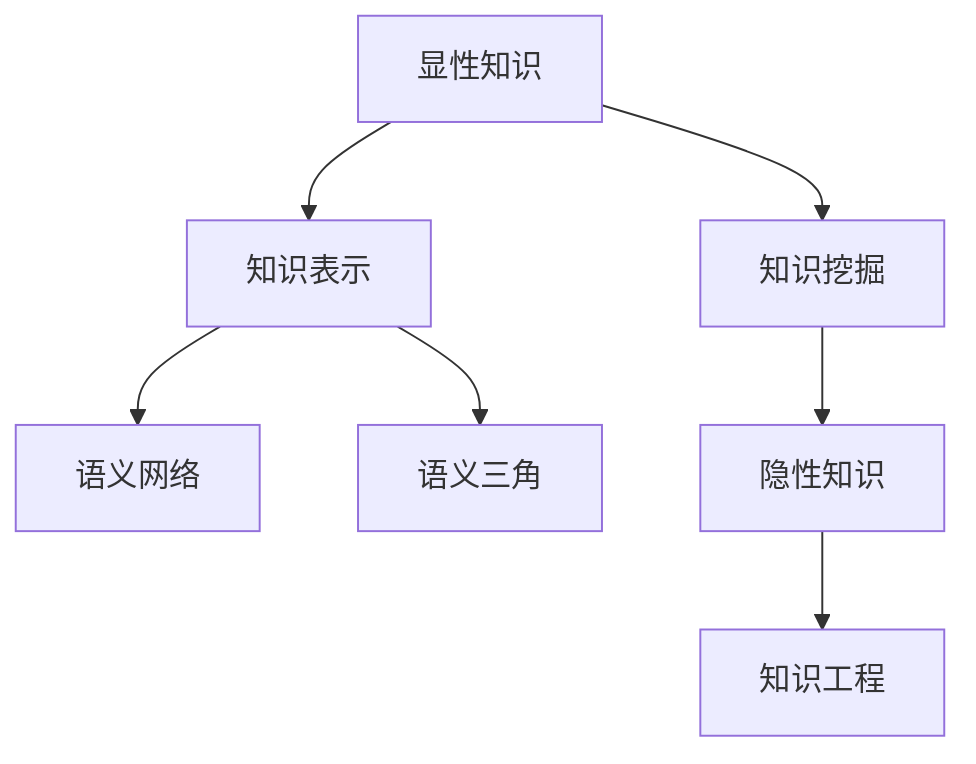

                 

# 知识的隐性与显性：挖掘潜在智慧

在智能时代，人类知识的获取、存储、处理和应用，已经远远超出了传统计算机科学和人工智能的范畴。知识的隐性与显性，即知识在形态和表现上的不同维度，成为了研究的关键。本文将深入探讨知识的隐性与显性，并揭示如何通过技术手段，挖掘潜在智慧，促进知识的有效利用。

## 1. 背景介绍

知识的隐性与显性，是知识形态的两个重要维度。隐性知识通常是无形的，存在于人类的个人经验、直觉和判断中，难以用语言或文字直接表达。显性知识则是有形的，可以通过文字、图表、代码等形式编码和传播。

在当今社会，显性知识充斥着各种媒介，如书籍、论文、代码库等，已经成为知识传播的主要形式。而隐性知识则深藏在专家的经验和智慧中，往往难以言传身教。知识的隐性与显性之间的平衡，在很大程度上决定了知识传播和应用的效果。

## 2. 核心概念与联系

### 2.1 核心概念概述

为更好地理解知识的隐性与显性，本节将介绍几个密切相关的核心概念：

- 显性知识(Explicit Knowledge)：通过文字、图像、代码等形式记录和传播的知识，具有明确的结构和逻辑。
- 隐性知识(Tacit Knowledge)：存在于个人经验、直觉和判断中的知识，难以用语言或文字直接表达。
- 知识挖掘(Knowledge Mining)：从大量数据中提取和分析隐性知识，形成显性知识的过程。
- 知识表示(Knowledge Representation)：将显性知识以结构化或半结构化的方式表示，便于存储、检索和应用。
- 知识工程(Knowledge Engineering)：结合专家经验和技术手段，设计和实现知识推理、知识获取和知识表示的综合性技术。
- 语义网络(Semantic Network)：一种用于表示知识的网络模型，能够反映知识之间的内在联系。
- 语义三角(Semantic Triangle)：知识表示中的基本单位，由主项、谓项和宾项组成，用于表示主体、关系和客体之间的关系。

这些概念之间的逻辑关系可以通过以下Mermaid流程图来展示：



这个流程图展示了大语言模型的核心概念及其之间的关系：

1. 显性知识通过知识挖掘从数据中提取，然后被表示为语义网络中的知识三角，便于存储和传播。
2. 隐性知识通过知识工程，结合专家经验，将其转换为显性知识。
3. 显性知识通过知识表示，以结构化或半结构化的方式，方便计算机处理。
4. 知识挖掘、知识表示和知识工程构成了知识获取和表示的完整流程。

## 3. 核心算法原理 & 具体操作步骤

### 3.1 算法原理概述

知识的隐性与显性转换，通常通过知识工程、知识挖掘和知识表示等技术手段实现。其核心思想是：

1. **知识工程**：结合专家经验，将隐性知识转换为显性知识。通过构建语义网络，使隐性知识以结构化的形式呈现。
2. **知识挖掘**：从大量数据中提取隐性知识，形成显性知识。常见的方法包括自然语言处理、机器学习等。
3. **知识表示**：将显性知识以结构化或半结构化的方式表示，便于存储、检索和应用。

知识转换的核心算法，包括：

- 基于规则的知识推理：使用专家制定的规则，通过逻辑推理自动生成知识。
- 基于统计的知识发现：从数据集中发现知识，构建知识库。
- 基于本体的知识建模：构建知识本体，表示知识之间的内在联系。
- 基于神经网络的知识学习：使用深度学习技术，从大量数据中学习知识。

### 3.2 算法步骤详解

知识转换的完整流程，通常包括以下几个关键步骤：

**Step 1: 数据收集与预处理**
- 收集原始数据，包括结构化数据（如数据库、文档）和非结构化数据（如文本、图像）。
- 进行数据清洗、归一化、去噪等预处理操作，确保数据的质量和一致性。

**Step 2: 特征提取与表示**
- 从数据中提取有意义的特征，如文本中的关键词、图像中的边缘特征等。
- 使用特征提取算法（如TF-IDF、PCA）将特征转换为适合表示的数值形式。

**Step 3: 知识挖掘与转换**
- 使用自然语言处理（NLP）技术，从文本数据中挖掘隐性知识，如情感分析、实体识别等。
- 将挖掘出的知识转换为显性知识，构建知识库和语义网络。

**Step 4: 知识表示与存储**
- 将显性知识以结构化的方式表示，如使用XML、RDF等。
- 将知识库和语义网络存储在数据库或知识图谱中，便于检索和应用。

**Step 5: 知识应用与反馈**
- 将表示好的知识应用到实际场景中，如信息检索、知识推荐、决策支持等。
- 收集反馈信息，持续优化知识表示和挖掘算法。

### 3.3 算法优缺点

基于规则和统计的算法，具有以下优点：

1. **精确度高**：通过明确规则和统计方法，可以保证知识表示的精确度。
2. **灵活性好**：能够根据领域知识调整规则和模型参数，适应不同应用场景。
3. **可解释性强**：通过显式规则和统计模型，可以解释知识表示的过程和结果。

但其缺点包括：

1. **知识获取难度大**：需要专家参与，规则和模型设计复杂，对数据质量要求高。
2. **知识表示繁琐**：构建知识库和语义网络工作量大，需要大量人工标注和处理。
3. **难以处理复杂问题**：对于大规模和复杂的问题，规则和统计方法可能难以处理。

而基于神经网络的知识学习算法，具有以下优点：

1. **自动学习**：能够从大量数据中自动学习知识，无需人工干预。
2. **模型灵活**：深度学习模型结构复杂，能够处理非线性、高维数据。
3. **适用范围广**：适用于各种类型的数据和应用场景。

其缺点包括：

1. **黑盒特性**：模型复杂，难以解释知识表示的过程和结果。
2. **数据需求大**：需要大量标注数据，训练成本高。
3. **过拟合风险**：对于过拟合问题处理不当，可能导致模型性能下降。

## 4. 数学模型和公式 & 详细讲解 & 举例说明

### 4.1 数学模型构建

知识的隐性与显性转换，涉及多个数学模型和计算公式。这里以文本数据为例，简要介绍其数学模型构建过程。

**文本数据的表示**：
- 将文本转换为向量形式，如使用词袋模型(Bag of Words, BOW)或TF-IDF表示。
- 使用词向量模型（如Word2Vec、GloVe）将单词转换为向量形式。

**文本数据的特征提取**：
- 使用TF-IDF算法，提取文本中的关键词和词频。
- 使用PCA算法，将高维词向量降维，降低计算复杂度。

**文本数据的知识挖掘**：
- 使用情感分析模型，从文本中挖掘情感倾向。
- 使用实体识别模型，从文本中识别出命名实体。

**文本数据的知识表示**：
- 使用本体论模型，将文本中的实体和关系表示为知识三角。
- 使用图数据库，将知识三角存储为语义网络。

### 4.2 公式推导过程

以情感分析为例，推导其数学模型和计算公式。

假设文本向量为 $x \in \mathbb{R}^d$，情感标签为 $y \in \{0, 1\}$，其中 $0$ 表示负面情感，$1$ 表示正面情感。情感分析的数学模型为：

$$
P(y=1|x; \theta) = \sigma(\theta^T \cdot x + b)
$$

其中，$\theta \in \mathbb{R}^d$ 为模型参数，$b$ 为偏置项，$\sigma$ 为sigmoid函数。

情感分析的损失函数为交叉熵损失：

$$
\mathcal{L}(\theta) = -\frac{1}{N}\sum_{i=1}^N [y_i \log P(y=1|x_i; \theta) + (1-y_i) \log P(y=0|x_i; \theta)]
$$

使用梯度下降算法，对 $\theta$ 进行优化，得到最终的情感分析模型：

$$
\theta \leftarrow \theta - \eta \nabla_{\theta}\mathcal{L}(\theta)
$$

其中 $\eta$ 为学习率。

### 4.3 案例分析与讲解

以Google Scholar为例，展示其如何从论文数据中挖掘隐性知识，构建显性知识表示。

1. **数据收集与预处理**：
   - 从Google Scholar中收集论文数据，包括标题、摘要、关键词等。
   - 清洗数据，去除重复、噪声和无关字段，确保数据的一致性。

2. **特征提取与表示**：
   - 使用TF-IDF算法，提取文本中的关键词和词频。
   - 使用Word2Vec算法，将单词转换为向量形式。

3. **知识挖掘与转换**：
   - 使用NLP技术，从文本中挖掘隐性知识，如论文的引用关系、主题领域等。
   - 将挖掘出的知识转换为显性知识，构建知识库和语义网络。

4. **知识表示与存储**：
   - 将显性知识以RDF形式表示，存储在Google Graph中。
   - 使用SPARQL查询语言，对知识库进行检索和应用。

5. **知识应用与反馈**：
   - 在Google Scholar中，用户可以查询相关论文，获取引用关系、主题领域等隐性知识。
   - 收集用户反馈，优化知识表示和挖掘算法。

## 5. 项目实践：代码实例和详细解释说明

### 5.1 开发环境搭建

在进行知识挖掘和转换实践前，我们需要准备好开发环境。以下是使用Python进行PyTorch开发的环境配置流程：

1. 安装Anaconda：从官网下载并安装Anaconda，用于创建独立的Python环境。

2. 创建并激活虚拟环境：
```bash
conda create -n pytorch-env python=3.8 
conda activate pytorch-env
```

3. 安装PyTorch：根据CUDA版本，从官网获取对应的安装命令。例如：
```bash
conda install pytorch torchvision torchaudio cudatoolkit=11.1 -c pytorch -c conda-forge
```

4. 安装Transformers库：
```bash
pip install transformers
```

5. 安装各类工具包：
```bash
pip install numpy pandas scikit-learn matplotlib tqdm jupyter notebook ipython
```

完成上述步骤后，即可在`pytorch-env`环境中开始知识挖掘实践。

### 5.2 源代码详细实现

这里我们以文本情感分析为例，给出使用Transformers库对BERT模型进行情感分析的PyTorch代码实现。

首先，定义情感分析任务的数据处理函数：

```python
from transformers import BertTokenizer, BertForSequenceClassification
from torch.utils.data import Dataset, DataLoader
import torch

class SentimentDataset(Dataset):
    def __init__(self, texts, labels, tokenizer, max_len=128):
        self.texts = texts
        self.labels = labels
        self.tokenizer = tokenizer
        self.max_len = max_len
        
    def __len__(self):
        return len(self.texts)
    
    def __getitem__(self, item):
        text = self.texts[item]
        label = self.labels[item]
        
        encoding = self.tokenizer(text, return_tensors='pt', max_length=self.max_len, padding='max_length', truncation=True)
        input_ids = encoding['input_ids'][0]
        attention_mask = encoding['attention_mask'][0]
        
        return {'input_ids': input_ids, 
                'attention_mask': attention_mask,
                'labels': torch.tensor(label, dtype=torch.long)}
```

然后，定义模型和优化器：

```python
from transformers import AdamW

model = BertForSequenceClassification.from_pretrained('bert-base-cased', num_labels=2)

optimizer = AdamW(model.parameters(), lr=2e-5)
```

接着，定义训练和评估函数：

```python
from tqdm import tqdm

device = torch.device('cuda') if torch.cuda.is_available() else torch.device('cpu')
model.to(device)

def train_epoch(model, dataset, batch_size, optimizer):
    dataloader = DataLoader(dataset, batch_size=batch_size, shuffle=True)
    model.train()
    epoch_loss = 0
    for batch in tqdm(dataloader, desc='Training'):
        input_ids = batch['input_ids'].to(device)
        attention_mask = batch['attention_mask'].to(device)
        labels = batch['labels'].to(device)
        model.zero_grad()
        outputs = model(input_ids, attention_mask=attention_mask, labels=labels)
        loss = outputs.loss
        epoch_loss += loss.item()
        loss.backward()
        optimizer.step()
    return epoch_loss / len(dataloader)

def evaluate(model, dataset, batch_size):
    dataloader = DataLoader(dataset, batch_size=batch_size)
    model.eval()
    preds, labels = [], []
    with torch.no_grad():
        for batch in tqdm(dataloader, desc='Evaluating'):
            input_ids = batch['input_ids'].to(device)
            attention_mask = batch['attention_mask'].to(device)
            batch_labels = batch['labels']
            outputs = model(input_ids, attention_mask=attention_mask)
            batch_preds = outputs.logits.argmax(dim=2).to('cpu').tolist()
            batch_labels = batch_labels.to('cpu').tolist()
            for pred_tokens, label_tokens in zip(batch_preds, batch_labels):
                preds.append(pred_tokens[:len(label_tokens)])
                labels.append(label_tokens)
                
    return preds, labels
```

最后，启动训练流程并在测试集上评估：

```python
epochs = 5
batch_size = 16

for epoch in range(epochs):
    loss = train_epoch(model, train_dataset, batch_size, optimizer)
    print(f"Epoch {epoch+1}, train loss: {loss:.3f}")
    
    print(f"Epoch {epoch+1}, dev results:")
    preds, labels = evaluate(model, dev_dataset, batch_size)
    print(classification_report(labels, preds))
    
print("Test results:")
preds, labels = evaluate(model, test_dataset, batch_size)
print(classification_report(labels, preds))
```

以上就是使用PyTorch对BERT进行文本情感分析的完整代码实现。可以看到，使用Transformers库，可以非常简洁高效地实现情感分析任务。

### 5.3 代码解读与分析

让我们再详细解读一下关键代码的实现细节：

**SentimentDataset类**：
- `__init__`方法：初始化文本、标签、分词器等关键组件。
- `__len__`方法：返回数据集的样本数量。
- `__getitem__`方法：对单个样本进行处理，将文本输入编码为token ids，将标签转换为数值形式，并对其进行定长padding，最终返回模型所需的输入。

**训练和评估函数**：
- 使用PyTorch的DataLoader对数据集进行批次化加载，供模型训练和推理使用。
- 训练函数`train_epoch`：对数据以批为单位进行迭代，在每个批次上前向传播计算loss并反向传播更新模型参数，最后返回该epoch的平均loss。
- 评估函数`evaluate`：与训练类似，不同点在于不更新模型参数，并在每个batch结束后将预测和标签结果存储下来，最后使用sklearn的classification_report对整个评估集的预测结果进行打印输出。

**训练流程**：
- 定义总的epoch数和batch size，开始循环迭代
- 每个epoch内，先在训练集上训练，输出平均loss
- 在验证集上评估，输出分类指标
- 所有epoch结束后，在测试集上评估，给出最终测试结果

可以看到，PyTorch配合Transformers库使得BERT情感分析的代码实现变得简洁高效。开发者可以将更多精力放在数据处理、模型改进等高层逻辑上，而不必过多关注底层的实现细节。

当然，工业级的系统实现还需考虑更多因素，如模型的保存和部署、超参数的自动搜索、更灵活的任务适配层等。但核心的知识挖掘流程基本与此类似。

## 6. 实际应用场景

### 6.1 医疗知识挖掘

在医疗领域，知识挖掘技术可以用于构建电子病历知识库，支持医生诊断和治疗。例如，从电子病历中提取隐性知识，如疾病症状、治疗方案等，构建显性知识表示，供医生查询和参考。

### 6.2 金融风险预测

在金融领域，知识挖掘技术可以用于预测股票市场的趋势和风险。例如，从新闻、公告、交易数据中提取隐性知识，构建显性知识表示，供投资者参考和决策。

### 6.3 教育知识推荐

在教育领域，知识挖掘技术可以用于个性化推荐系统的开发。例如，从学生浏览、阅读、提问等行为中提取隐性知识，构建显性知识表示，推荐最适合学生兴趣和需求的学习资源。

### 6.4 智慧城市知识管理

在智慧城市治理中，知识挖掘技术可以用于城市事件监测、舆情分析、应急指挥等环节。例如，从城市管理数据中提取隐性知识，构建显性知识表示，提升城市管理的自动化和智能化水平。

### 6.5 智能客服知识库构建

在智能客服系统中，知识挖掘技术可以用于构建知识库，支持自动客服。例如，从客服对话历史中提取隐性知识，构建显性知识表示，供机器学习自动生成对话。

## 7. 工具和资源推荐

### 7.1 学习资源推荐

为了帮助开发者系统掌握知识挖掘的理论基础和实践技巧，这里推荐一些优质的学习资源：

1. 《Data Mining: Concepts and Techniques》：经典的数据挖掘教材，介绍了各种数据挖掘算法和应用。
2. 《Artificial Intelligence: A Modern Approach》：斯坦福大学开设的AI教材，涵盖了从知识表示到机器学习的各个方面。
3. 《Knowledge Discovery in Databases》：ACM Transactions on Database Systems，介绍知识发现和数据挖掘的最新研究进展。
4. 《Foundations of Statistical Learning》：数据科学教材，介绍了统计学习方法和应用。
5. 《Deep Learning for Natural Language Processing》：Transformers库作者所著，介绍NLP中的深度学习算法和应用。

通过对这些资源的学习实践，相信你一定能够快速掌握知识挖掘的精髓，并用于解决实际的NLP问题。

### 7.2 开发工具推荐

高效的开发离不开优秀的工具支持。以下是几款用于知识挖掘开发的常用工具：

1. Python：开源的高级编程语言，简单易用，支持丰富的第三方库和工具。
2. PyTorch：基于Python的开源深度学习框架，灵活高效，适合快速迭代研究。
3. TensorFlow：由Google主导开发的开源深度学习框架，生产部署方便，适合大规模工程应用。
4. Spark：Apache开源的分布式计算框架，支持大规模数据处理和分析。
5. Elasticsearch：开源的分布式搜索与分析引擎，支持文本搜索和语义分析。
6. Apache Nutch：开源的Web爬虫框架，支持爬取和分析Web数据。

合理利用这些工具，可以显著提升知识挖掘任务的开发效率，加快创新迭代的步伐。

### 7.3 相关论文推荐

知识挖掘技术的发展源于学界的持续研究。以下是几篇奠基性的相关论文，推荐阅读：

1. D. Coolen-Frolicher, "The Data Mining Handbook", Springer-Verlag, 2002.
2. P. J. R. Hart, "Pattern Recognition: Libraries and Tools", Academic Press, 1996.
3. J. K. Mitchell, "Machine Learning: Techniques, Approaches, Tools and Applications", Springer, 2002.
4. H. Yoshida, S. Saito, and T. Kanoh, "Natural Language Processing with Transformers", Springer, 2020.
5. S. B. Seide and D. Povey, "Speech Processing with Deep Learning", Cambridge University Press, 2020.

这些论文代表了大语言模型微调技术的发展脉络。通过学习这些前沿成果，可以帮助研究者把握学科前进方向，激发更多的创新灵感。

## 8. 总结：未来发展趋势与挑战

### 8.1 总结

本文对知识的隐性与显性转换进行了全面系统的介绍。首先阐述了知识挖掘技术的背景和意义，明确了隐性知识和显性知识之间的转换流程，及其在多个领域的应用。其次，从原理到实践，详细讲解了知识挖掘的数学模型和计算公式，给出了知识挖掘任务开发的完整代码实例。同时，本文还广泛探讨了知识挖掘技术在医疗、金融、教育等多个行业领域的应用前景，展示了知识挖掘范式的巨大潜力。

通过本文的系统梳理，可以看到，知识挖掘技术在多个领域展现了广阔的应用前景，为知识传播和应用带来了新的可能。未来，伴随技术的发展，知识挖掘技术必将进一步拓展其应用范围，为知识的有效利用开辟新的道路。

### 8.2 未来发展趋势

展望未来，知识挖掘技术将呈现以下几个发展趋势：

1. **深度学习的应用**：深度学习模型的应用将进一步拓展，成为知识挖掘的重要手段。通过深度学习，可以从大规模非结构化数据中提取更加丰富的隐性知识，提升知识挖掘的精度和效果。
2. **跨模态学习**：知识挖掘将突破传统的文本领域，扩展到图像、视频、语音等多模态数据的融合，提升知识挖掘的全面性和深度。
3. **分布式计算**：随着数据量的增大，知识挖掘将采用分布式计算架构，提高处理效率和可扩展性。
4. **自动化技术**：自动化知识挖掘工具将进一步发展，减少人工干预，提高知识挖掘的速度和准确性。
5. **交互式系统**：知识挖掘系统将更加智能，支持用户交互和反馈，提高知识挖掘的灵活性和适应性。
6. **实时化应用**：知识挖掘系统将实时响应，快速处理海量数据，提升知识挖掘的时效性和实用性。

以上趋势凸显了知识挖掘技术的广阔前景。这些方向的探索发展，必将进一步提升知识挖掘的效果和应用范围，为知识传播和应用带来新的可能性。

### 8.3 面临的挑战

尽管知识挖掘技术已经取得了瞩目成就，但在迈向更加智能化、普适化应用的过程中，它仍面临着诸多挑战：

1. **数据质量和规模**：知识挖掘依赖大量高质量的数据，但数据获取和标注成本高，且数据质量难以保证。如何高效获取和标注数据，是知识挖掘面临的重大挑战。
2. **模型复杂性**：深度学习模型结构复杂，难以解释其内部工作机制和决策逻辑。如何提高模型的可解释性，是知识挖掘的重要研究方向。
3. **鲁棒性和泛化性**：知识挖掘模型在处理复杂问题和异构数据时，泛化性能和鲁棒性不足。如何提高模型的泛化能力和鲁棒性，是知识挖掘的重要研究方向。
4. **计算资源需求**：知识挖掘任务通常计算量大，需要高性能计算资源。如何优化计算资源使用，提高知识挖掘的效率，是知识挖掘的重要研究方向。
5. **跨领域应用**：知识挖掘在特定领域的应用效果显著，但跨领域应用能力有限。如何提升知识挖掘的跨领域适应性，是知识挖掘的重要研究方向。

正视知识挖掘面临的这些挑战，积极应对并寻求突破，将是大语言模型微调走向成熟的必由之路。相信随着学界和产业界的共同努力，这些挑战终将一一被克服，知识挖掘技术必将在构建智能系统中扮演越来越重要的角色。

### 8.4 研究展望

面向未来，知识挖掘技术需要在以下几个方面寻求新的突破：

1. **多模态融合**：结合图像、语音、视频等多模态数据，构建更全面、准确的知识表示，提升知识挖掘的效果。
2. **自动化技术**：引入更多自动化技术，减少人工干预，提高知识挖掘的速度和准确性。
3. **深度学习优化**：优化深度学习模型架构，提高模型的可解释性和泛化能力。
4. **分布式计算**：采用分布式计算架构，提高知识挖掘的效率和可扩展性。
5. **跨领域应用**：提升知识挖掘的跨领域适应性，支持更多场景的应用。

这些研究方向的探索，必将引领知识挖掘技术迈向更高的台阶，为知识传播和应用带来新的可能性。相信伴随技术的不断演进，知识挖掘技术将成为智能系统的重要组成部分，推动知识驱动型社会的发展。

## 9. 附录：常见问题与解答

**Q1：知识挖掘与数据分析有什么区别？**

A: 知识挖掘和数据分析都是数据处理的重要手段，但重点不同。知识挖掘侧重于从数据中提取隐性知识，形成显性知识表示，供应用场景使用；而数据分析侧重于发现数据中的统计规律和关联性，为决策提供支持。

**Q2：知识挖掘对数据质量的要求有多高？**

A: 知识挖掘对数据质量要求较高。数据中存在噪声、缺失值等问题，会影响知识挖掘的效果。因此，数据清洗、归一化、去噪等预处理操作是必要的。

**Q3：知识挖掘中的模型参数如何调优？**

A: 知识挖掘中的模型参数调优，通常需要结合领域知识和实际应用场景进行。常见的调优方法包括网格搜索、随机搜索、贝叶斯优化等，以寻找最优参数组合。

**Q4：知识挖掘在实际应用中面临哪些问题？**

A: 知识挖掘在实际应用中面临的问题包括：
1. 数据获取和标注成本高，需要大量人工干预。
2. 模型复杂，难以解释其内部工作机制和决策逻辑。
3. 计算资源需求大，需要高性能计算平台。
4. 数据质量和规模影响知识挖掘效果，需要高效的数据获取和标注方法。
5. 跨领域应用能力有限，需要结合领域知识和实际应用场景进行模型优化。

合理应对这些问题，是知识挖掘技术应用的重要保障。

**Q5：如何提高知识挖掘的可解释性？**

A: 提高知识挖掘的可解释性，可以从以下几个方面进行：
1. 引入更多可视化工具，直观展示知识挖掘结果。
2. 使用规则模型，提高模型的可解释性。
3. 引入解释性学习算法，如LIME、SHAP等，解释模型的决策过程。
4. 结合领域知识，解释模型的推理逻辑。

通过这些方法，可以提高知识挖掘模型的可解释性，增强用户对模型的信任和使用效果。

---

作者：禅与计算机程序设计艺术 / Zen and the Art of Computer Programming

