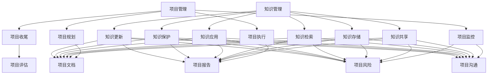

                 

# 知识管理在项目管理中的价值

> 关键词：知识管理,项目管理,项目协作,知识共享,决策支持,风险管理,绩效提升

## 1. 背景介绍

### 1.1 问题由来

随着信息技术的发展，项目管理（Project Management）在各行各业中变得越来越重要。项目管理不仅仅是一个技术问题，更是一个涉及到企业战略、组织结构、人员沟通等多方面的复杂系统工程。在项目的执行过程中，高效的信息管理和知识共享机制可以大大提升项目的成功率和效率。

知识管理（Knowledge Management）是指组织中对知识的识别、收集、整理、传播和应用的一系列活动，旨在提升组织的核心竞争力和创新能力。项目管理中，知识管理的成功应用可以显著提高项目的执行效率、降低成本、提升团队协作和决策质量。

本文将重点探讨知识管理在项目管理中的价值，并分析其在项目中的具体应用。首先，我们将介绍项目管理中的常见挑战和问题，然后阐述知识管理如何帮助克服这些问题，最后通过实际案例分析，展示知识管理在项目管理中的具体价值。

## 2. 核心概念与联系

### 2.1 核心概念概述

在项目管理中，知识管理扮演着至关重要的角色。具体来说，以下核心概念将帮助我们理解知识管理在项目管理中的作用：

- **项目管理的定义**：项目管理是指将知识、技能、工具和方法应用于项目活动之中，以实现项目目标的过程。它包含了项目规划、执行、监控和收尾等阶段，涉及范围管理、时间管理、成本管理、质量管理、人力资源管理、沟通管理和风险管理等多个方面。

- **知识管理的定义**：知识管理是指通过计划、捕捉、组织、存储、分享、检索、应用、保护和更新知识的过程。知识管理的目标是将显性和隐性知识转化为易于使用的知识资产，以支持组织的决策制定和创新。

- **项目管理与知识管理的联系**：项目管理中的知识管理可以视为一种结构化的知识共享和应用活动，它通过系统化的方法帮助团队共享项目相关的信息，提升团队成员的知识水平，提高项目的执行效率。

### 2.2 核心概念原理和架构的 Mermaid 流程图



这个图表展示了项目管理中的各个阶段如何与知识管理相关联。每个阶段都需要知识管理的支持，从而提高项目的效率和质量。

## 3. 核心算法原理 & 具体操作步骤

### 3.1 算法原理概述

知识管理在项目管理中的应用，主要基于以下算法原理：

- **知识识别与分类**：对项目相关的文档、邮件、会议记录等进行识别和分类，将其转化为易于理解和应用的知识。

- **知识共享平台构建**：利用知识管理平台，如企业内部网（Intranet）、知识管理系统（Knowledge Management System, KMS）等，帮助团队成员共享知识和经验。

- **知识检索与推荐**：使用信息检索技术，帮助团队成员快速查找所需的知识，并提供相关的推荐。

- **知识应用与更新**：将知识应用于项目决策和执行中，同时根据项目反馈及时更新知识库。

### 3.2 算法步骤详解

以下将详细介绍知识管理在项目管理中的具体步骤：

#### 3.2.1 知识识别与分类

- **收集知识源**：识别项目相关的所有知识源，包括文档、邮件、会议记录、报告等。
- **知识提取与清洗**：使用自然语言处理技术，从知识源中提取有用的信息，并进行清洗，去除无关的信息。
- **知识分类与标注**：根据项目的分类体系，对提取的信息进行分类和标注，确保信息的准确性和一致性。

#### 3.2.2 知识共享平台构建

- **选择合适的KMS平台**：根据企业的规模和需求，选择合适的知识管理平台，如SharePoint、Confluence、Atlassian等。
- **搭建知识库结构**：设计知识库的层次结构，包括知识分类、子分类、子主题等，确保知识的组织和检索效率。
- **知识发布与更新**：将识别和分类好的知识发布到知识库中，并定期更新，确保知识的时效性和准确性。

#### 3.2.3 知识检索与推荐

- **知识检索**：使用信息检索技术，如全文检索、关键字检索、分类检索等，帮助团队成员快速查找所需的知识。
- **知识推荐**：基于知识使用情况和用户偏好，使用推荐算法（如协同过滤、基于内容的推荐等）提供相关的知识推荐。

#### 3.2.4 知识应用与更新

- **知识应用**：在项目决策、执行、监控和收尾等阶段，将知识库中的知识应用于实际项目中，支持项目团队的工作。
- **知识更新**：根据项目反馈和实际应用情况，对知识库中的知识进行更新和修正，确保知识的准确性和完整性。

### 3.3 算法优缺点

知识管理在项目管理中具有以下优点：

- **提高效率**：通过知识共享和复用，减少重复劳动，提高项目的执行效率。
- **提升质量**：通过应用最佳实践和标准流程，提升项目的质量和管理水平。
- **增强协作**：促进团队成员之间的知识共享和协作，提升团队的整体绩效。
- **支持决策**：通过系统的知识库，支持项目团队的决策制定和问题解决。

同时，知识管理也存在一些缺点：

- **成本高**：构建和维护知识库需要较高的成本，包括技术投入和人员培训等。
- **知识冗余**：过度依赖知识库可能导致信息过载，团队成员容易迷失在大量的信息中。
- **技术依赖**：知识管理平台和工具的选择和维护需要技术支持，可能存在技术障碍。

### 3.4 算法应用领域

知识管理在项目管理中具有广泛的应用领域，包括以下几个方面：

- **项目规划与设计**：在项目规划阶段，利用知识管理平台收集和共享项目相关的文档、资料和经验，确保项目目标的明确和可行。
- **项目执行与监控**：在项目执行过程中，利用知识库中的最佳实践和标准流程，指导项目的日常工作，监控项目的进度和质量。
- **项目风险管理**：通过知识库中的历史数据和案例，分析项目的风险，制定相应的风险应对措施。
- **项目评估与总结**：在项目结束后，利用知识管理平台对项目进行评估和总结，记录项目的成功经验和教训，为未来的项目提供参考。

## 4. 数学模型和公式 & 详细讲解 & 举例说明

### 4.1 数学模型构建

知识管理在项目管理中的应用，可以从数学模型的角度进行分析。以下是一个简单的数学模型，用于描述知识管理在项目管理中的应用：

$$
\text{项目成功概率} = f(\text{知识共享率}, \text{知识应用率}, \text{知识更新率})
$$

其中，知识共享率表示团队成员在项目中分享和交流知识的比例，知识应用率表示团队成员在项目中应用知识库中的知识的比例，知识更新率表示团队在项目结束后对知识库进行更新的比例。

### 4.2 公式推导过程

#### 公式推导

- **知识共享率**：$K_S = \frac{\text{共享知识数量}}{\text{项目总知识数量}}$
- **知识应用率**：$K_U = \frac{\text{应用知识数量}}{\text{项目总知识数量}}$
- **知识更新率**：$K_U = \frac{\text{更新知识数量}}{\text{项目总知识数量}}$

将这些变量代入公式：

$$
\text{项目成功概率} = f(K_S, K_U, K_U)
$$

### 4.3 案例分析与讲解

#### 案例分析

假设某公司正在进行一个新产品的研发项目，利用知识管理平台来支持项目的各个阶段：

- **项目规划阶段**：通过知识共享平台，收集和分享历史项目的文档和经验，确保项目目标的明确和可行。
- **项目执行阶段**：利用知识库中的最佳实践和标准流程，指导项目的日常工作，监控项目的进度和质量。
- **项目风险管理阶段**：通过知识库中的历史数据和案例，分析项目的风险，制定相应的风险应对措施。
- **项目评估与总结阶段**：在项目结束后，利用知识管理平台对项目进行评估和总结，记录项目的成功经验和教训，为未来的项目提供参考。

### 4.4 结果展示

通过知识管理平台的支持，项目团队能够快速查找和应用相关的知识，提升了项目效率和质量。项目成功概率显著提升，减少了重复劳动，提高了团队协作和决策质量。

## 5. 项目实践：代码实例和详细解释说明

### 5.1 开发环境搭建

为了实现知识管理在项目管理中的应用，我们需要搭建一个知识管理平台。以下是一个简单的开发环境搭建步骤：

- **选择合适的知识管理平台**：如SharePoint、Confluence、Atlassian等。
- **搭建知识库结构**：设计知识库的层次结构，包括知识分类、子分类、子主题等。
- **开发API接口**：为了方便知识共享和检索，开发API接口，支持数据的读取和写入。

### 5.2 源代码详细实现

以下是使用Python开发的简单代码实现，用于构建知识库：

```python
from flask import Flask, jsonify, request
from flask_sqlalchemy import SQLAlchemy

app = Flask(__name__)
app.config['SQLALCHEMY_DATABASE_URI'] = 'sqlite:////tmp/test.db'
db = SQLAlchemy(app)

class KnowledgeRecord(db.Model):
    id = db.Column(db.Integer, primary_key=True)
    title = db.Column(db.String(255))
    content = db.Column(db.Text)
    category = db.Column(db.String(255))

@app.route('/knowledge', methods=['POST'])
def add_knowledge():
    data = request.get_json()
    new_record = KnowledgeRecord(title=data['title'], content=data['content'], category=data['category'])
    db.session.add(new_record)
    db.session.commit()
    return jsonify({'success': True})

@app.route('/knowledge/<int:id>')
def get_knowledge(id):
    record = KnowledgeRecord.query.get(id)
    if record:
        return jsonify({'title': record.title, 'content': record.content, 'category': record.category})
    else:
        return jsonify({'success': False})

if __name__ == '__main__':
    app.run(debug=True)
```

### 5.3 代码解读与分析

#### 代码解读

- **Flask框架**：用于搭建Web应用，实现API接口。
- **SQLAlchemy库**：用于数据库的CRUD操作。
- **知识库模型**：定义了知识库的基本结构，包括标题、内容和分类。
- **API接口**：实现了添加和获取知识库记录的API接口。

#### 分析

以上代码实现了一个简单的知识库管理系统，支持添加和获取知识库记录。通过API接口，团队成员可以方便地共享和检索知识，提升项目的执行效率。

### 5.4 运行结果展示

运行以上代码，可以在本地启动一个简单的知识库管理系统。团队成员可以通过Web界面，方便地添加和获取知识库记录，提升项目的执行效率。

## 6. 实际应用场景

### 6.1 智能制造

在智能制造领域，知识管理可以显著提升生产效率和产品质量。通过知识管理平台，生产团队可以共享设备维护经验、故障排除方法、生产流程优化等知识，提高设备的可靠性和生产的稳定性。

### 6.2 金融服务

在金融服务领域，知识管理可以帮助提高客户服务质量和风险管理能力。通过知识库，客户服务团队可以共享历史案例和最佳实践，提升客户体验。同时，风险管理团队可以分析历史数据，制定相应的风险应对措施，降低风险损失。

### 6.3 医疗健康

在医疗健康领域，知识管理可以提升医疗质量和患者满意度。通过知识库，医护人员可以共享医学知识、临床经验、诊断案例等，提高诊断和治疗的准确性和效率。同时，患者可以通过知识库查询相关知识，提升对疾病的理解和自我管理能力。

### 6.4 未来应用展望

未来，随着人工智能和物联网技术的发展，知识管理在项目管理中的应用将更加广泛和深入。以下是对知识管理未来应用展望的几点思考：

- **智能知识推荐**：利用人工智能技术，自动推荐相关的知识，提高知识共享的效率。
- **跨领域知识共享**：将不同领域的专业知识进行整合，形成更加全面的知识库，支持跨领域的协作和创新。
- **知识库的自动化更新**：利用自然语言处理和机器学习技术，自动更新知识库，确保知识的实时性和准确性。
- **知识驱动的决策支持**：将知识管理与业务决策系统进行深度整合，支持业务决策的智能化和自动化。

## 7. 工具和资源推荐

### 7.1 学习资源推荐

为了帮助项目管理者和知识管理专家系统掌握知识管理在项目中的应用，以下推荐一些优质的学习资源：

- **《知识管理的艺术》（The Art of Knowledge Management）**：这本书介绍了知识管理的理论和实践，涵盖了知识管理的各个方面。
- **《项目管理》（Project Management）**：由PMI（Project Management Institute）出版，是项目管理领域的经典教材。
- **《知识管理与协作》（Knowledge Management and Collaboration）**：课程由Coursera提供，介绍了知识管理的概念、方法和工具。
- **《项目管理实践》（Project Management in Practice）**：由Gary Hamel和C.K. Prahalad撰写，介绍了项目管理中的知识管理实践。

### 7.2 开发工具推荐

为了实现知识管理在项目管理中的应用，我们需要使用一些工具来支持知识共享和检索。以下是几个推荐的工具：

- **SharePoint**：由微软开发的知识管理平台，支持企业内部的知识库管理和共享。
- **Confluence**：由Atlassian开发的知识管理工具，支持Wiki文档的创建和共享。
- **Atlassian JIRA**：项目管理工具，可以与Confluence进行集成，支持项目的任务管理和知识共享。

### 7.3 相关论文推荐

为了深入了解知识管理在项目管理中的应用，以下是几篇相关论文的推荐：

- **Knowledge Management and Project Management**：探讨了知识管理在项目管理中的应用，分析了其对项目成功的影响。
- **Project Knowledge Management**：介绍了项目管理中的知识管理方法，提供了具体的案例分析。
- **The Role of Knowledge Management in Project Success**：研究了知识管理在项目中的作用，分析了不同项目阶段的知识管理策略。

## 8. 总结：未来发展趋势与挑战

### 8.1 研究成果总结

知识管理在项目管理中的应用，已经取得了一些研究成果，但仍有许多挑战需要解决。以下是几点总结：

- **知识共享效率**：通过知识共享平台的建设，提升知识共享的效率和质量，是知识管理的关键。
- **知识应用效果**：在项目执行过程中，利用知识库中的知识，提升项目的执行效率和质量。
- **知识更新机制**：建立有效的知识更新机制，确保知识库的时效性和准确性。

### 8.2 未来发展趋势

未来，知识管理在项目管理中的应用将呈现出以下几个趋势：

- **智能化知识推荐**：利用人工智能技术，自动推荐相关的知识，提高知识共享的效率。
- **跨领域知识共享**：将不同领域的专业知识进行整合，形成更加全面的知识库，支持跨领域的协作和创新。
- **知识驱动的决策支持**：将知识管理与业务决策系统进行深度整合，支持业务决策的智能化和自动化。

### 8.3 面临的挑战

尽管知识管理在项目管理中取得了一定的进展，但仍面临以下挑战：

- **技术壁垒**：知识管理平台和工具的选择和维护需要技术支持，可能存在技术障碍。
- **数据质量**：知识库中的数据质量和准确性直接影响知识共享和应用的效果。
- **知识标准化**：不同团队和组织可能存在知识标准的差异，需要建立统一的知识管理标准。

### 8.4 研究展望

未来，知识管理在项目管理中的应用将不断拓展，需要从以下几个方面进行深入研究：

- **知识共享机制**：研究如何建立有效的知识共享机制，提升团队成员的知识水平。
- **知识驱动的决策**：研究如何将知识管理与业务决策进行深度整合，提升决策的智能化和自动化。
- **知识管理平台**：研究开发高效的知识管理平台，支持知识共享、检索和应用。

## 9. 附录：常见问题与解答

### Q1：知识管理在项目管理中是否必要？

A：知识管理在项目管理中非常必要。通过知识共享和复用，可以减少重复劳动，提高项目执行效率和质量。同时，知识管理还可以帮助团队成员学习新的知识和技能，提升团队的整体绩效。

### Q2：知识管理平台如何选择？

A：选择知识管理平台需要考虑企业的规模、需求和预算。对于大型企业，可以选择功能强大的平台，如SharePoint、Confluence等。对于小型企业，可以选择轻量级的平台，如Atlassian JIRA等。

### Q3：如何提高知识共享的效率？

A：提高知识共享效率可以从以下几个方面入手：
- 建立知识共享文化，鼓励团队成员主动分享知识。
- 利用知识管理平台，方便团队成员检索和应用知识。
- 定期组织知识分享会，促进团队成员之间的交流和学习。

### Q4：知识管理对项目成本有何影响？

A：知识管理在初期可能会增加一些成本，包括知识管理平台的搭建和维护。但从长期来看，知识管理可以显著提升项目的执行效率和质量，降低项目成本。通过知识共享和复用，可以减少重复劳动和错误，提升项目管理的整体效率。

### Q5：如何确保知识库中的数据质量？

A：确保知识库中的数据质量需要建立严格的知识审核机制，包括数据的来源、格式、准确性等方面的审核。同时，需要定期对知识库进行维护和更新，确保知识的时效性和准确性。

---

作者：禅与计算机程序设计艺术 / Zen and the Art of Computer Programming

