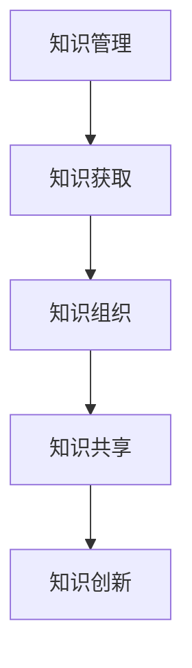

                 

# 知识管理的AI化:从知识获取到知识创新

## 1. 背景介绍

### 1.1 问题由来
在信息爆炸的时代，知识的增长速度远超个人处理能力。企业、组织、个人如何高效管理、获取和应用知识，成为了知识工作者面临的重要挑战。人工智能（AI）技术的飞速发展，为知识管理提供了全新的工具和思路。

### 1.2 问题核心关键点
知识管理的基本任务包括知识获取、知识组织、知识共享和知识创新。人工智能技术可以从中知识获取开始介入，逐步实现自动化、智能化的知识管理。

人工智能技术在知识管理中的应用主要包括：
- 自动化获取知识：通过爬虫、文本挖掘等技术，自动收集和整理各类知识资源。
- 智能知识组织：利用自然语言处理、语义分析等技术，自动对知识进行分类、聚类、索引等操作。
- 知识共享与协作：通过推荐系统、聊天机器人等，实现知识的高效共享和智能协作。
- 知识创新与决策支持：利用深度学习、强化学习等技术，辅助决策、知识发现和创新。

### 1.3 问题研究意义
人工智能技术在知识管理中的应用，能够显著提升知识管理的效率和质量。具体表现为：
- 自动化和智能化：AI技术能够自动处理大量重复性工作，减轻人工负担。
- 提高知识准确性：通过数据驱动的算法，AI系统能够减少人为偏见，提升知识获取和应用的准确性。
- 促进知识共享：AI技术能够推荐最相关的知识，加速知识流通，提升组织知识库的质量。
- 辅助知识创新：通过深度学习、知识图谱等技术，AI系统能够挖掘数据中的隐含关系，辅助新的知识发现。

## 2. 核心概念与联系

### 2.1 核心概念概述

为更好地理解人工智能在知识管理中的应用，本节将介绍几个密切相关的核心概念：

- 知识管理(Knowledge Management, KM)：旨在通过信息技术和人力资源管理等手段，提高组织知识的获取、存储、共享和应用能力。
- 人工智能(Artificial Intelligence, AI)：通过模拟人类智能行为，实现感知、学习、推理等能力的技术。
- 知识获取(Knowledge Acquisition)：通过自动化技术获取知识的过程。
- 知识组织(Knowledge Organization)：对知识进行分类、索引、标注等操作，便于知识检索和共享。
- 知识共享(Knowledge Sharing)：利用推荐系统、社交网络等技术，促进知识的高效共享。
- 知识创新(Knowledge Innovation)：通过知识整合、深度学习等技术，实现新的知识发现和创造。

这些核心概念之间的逻辑关系可以通过以下Mermaid流程图来展示：



这个流程图展示的知识管理各环节及它们之间的逻辑关系：

1. 知识管理通过知识获取、组织、共享、创新等环节，实现知识的自动化管理。
2. 知识获取环节利用AI技术自动从互联网、文档、数据库等处收集知识。
3. 知识组织利用语义分析、分类技术，对知识进行结构化处理。
4. 知识共享通过推荐系统、社交网络等技术，促进知识的高效流通。
5. 知识创新通过深度学习、知识图谱等技术，挖掘隐含知识，辅助新知识的产生。

## 3. 核心算法原理 & 具体操作步骤
### 3.1 算法原理概述

人工智能在知识管理中的应用主要基于以下几个原理：

- 数据驱动：通过大规模数据训练AI模型，提高知识获取、组织、共享的自动化水平。
- 智能推荐：利用协同过滤、内容推荐等算法，实现知识推荐，提升知识共享效率。
- 自然语言处理(NLP)：通过文本挖掘、语义分析等技术，对自然语言文本进行结构化处理，提升知识组织和搜索的准确性。
- 深度学习：通过构建神经网络，学习复杂模式，支持知识创新和决策支持。

### 3.2 算法步骤详解

基于AI的知识管理流程主要包括以下几个步骤：

**Step 1: 知识获取与整理**

1. **数据爬取与清洗**：使用爬虫技术从互联网、数据库、文档等处收集知识文本。数据需要经过去重、清洗、标注等预处理，确保数据质量。

2. **文本预处理**：对文本进行分词、去除停用词、词性标注、命名实体识别等操作，提取有用的特征。

3. **文本表示**：将文本转换为向量表示，如TF-IDF、Word2Vec、BERT等，便于后续处理。

**Step 2: 知识组织与索引**

1. **知识分类**：通过层次聚类、K-Means等算法，将文本自动分类到不同的主题或领域中。

2. **知识索引**：构建索引数据库，支持高效的检索操作。索引技术包括倒排索引、向量空间模型等。

3. **知识标注**：对知识进行详细的标注，如作者、日期、引用、关键词等，便于知识管理和检索。

**Step 3: 知识共享与推荐**

1. **用户画像**：通过社交网络、行为数据等，构建用户画像，了解用户的兴趣和需求。

2. **知识推荐**：利用协同过滤、内容推荐、深度学习等算法，为每个用户推荐最相关的知识内容。

3. **推荐系统优化**：通过A/B测试、反馈机制等，不断优化推荐算法，提升推荐效果。

**Step 4: 知识创新与决策支持**

1. **数据挖掘与模式发现**：通过关联规则挖掘、时间序列分析等技术，发现数据中的隐含模式和趋势。

2. **知识图谱构建**：利用图神经网络等技术，构建知识图谱，支持知识发现和推理。

3. **决策支持**：通过知识图谱、深度学习等技术，辅助企业决策，提升决策准确性和效率。

### 3.3 算法优缺点

基于AI的知识管理方法具有以下优点：
1. 自动化和智能化：大大减少人工操作，提高知识管理的效率。
2. 数据驱动：通过大规模数据训练模型，提升知识获取和组织的准确性。
3. 智能推荐：利用推荐算法，提升知识共享的个性化和精准度。
4. 辅助决策：通过知识图谱、深度学习等技术，提供科学决策支持。

同时，该方法也存在一些局限性：
1. 对数据质量依赖高：模型的表现依赖于数据的质量和代表性，数据不完整、噪音较多会影响效果。
2. 需要大量计算资源：AI模型训练和推理需要高性能计算资源，对硬件要求高。
3. 模型解释性不足：AI模型的决策过程较为复杂，缺乏可解释性，难以解释知识发现和推理过程。
4. 冷启动问题：对于新领域或新用户，模型需要一定时间的训练和优化才能取得良好效果。

尽管存在这些局限性，但总体而言，基于AI的知识管理方法在提升知识管理的效率和质量方面具有显著优势，成为知识管理领域的重要趋势。

### 3.4 算法应用领域

基于AI的知识管理方法已经在多个领域得到了广泛应用，具体包括：

- 企业知识管理：通过AI技术，提升企业知识库的管理效率和质量。
- 政府信息公开：利用AI技术，实现政府信息的高效整理和公开。
- 公共图书馆知识服务：通过AI推荐系统，提升图书馆的知识服务和用户满意度。
- 医疗健康知识管理：利用AI技术，提升医疗健康知识库的整理和检索能力。
- 教育资源管理：通过AI推荐系统，提升教育资源的个性化推荐。
- 智能客服系统：通过知识图谱、聊天机器人等技术，提升客服系统的智能化水平。

此外，AI技术还正在逐步扩展到更多领域，如法律咨询、金融服务、工业制造等，为各行业提供新的知识管理工具和思路。

## 4. 数学模型和公式 & 详细讲解 & 举例说明

### 4.1 数学模型构建

本节将使用数学语言对基于AI的知识管理方法进行更加严格的刻画。

记知识文本为 $x$，长度为 $n$，知识分类标签为 $y$，标签集合为 $\{1, 2, \ldots, K\}$。假设知识获取与整理的算法为 $A(x)$，知识组织与索引的算法为 $O(A(x))$，知识共享与推荐的算法为 $R(O(A(x)))$，知识创新与决策支持的算法为 $I(R(O(A(x))))$。

### 4.2 公式推导过程

以下是知识管理流程中各步骤的数学模型构建和公式推导：

**Step 1: 知识获取与整理**

1. **数据爬取与清洗**：
   $$
   x = \text{爬取}(x_i) \text{ for } i=1,\ldots,N
   $$
   其中 $x_i$ 为第 $i$ 条知识文本。

2. **文本预处理**：
   $$
   x' = \text{预处理}(x) \text{ for } x \in X
   $$
   其中 $x'$ 为预处理后的文本向量。

3. **文本表示**：
   $$
   \boldsymbol{v} = \text{表示器}(x') \text{ for } x' \in X'
   $$
   其中 $\boldsymbol{v}$ 为文本向量化表示。

**Step 2: 知识组织与索引**

1. **知识分类**：
   $$
   y = \text{分类器}(\boldsymbol{v}) \text{ for } \boldsymbol{v} \in V
   $$
   其中 $y$ 为分类结果，$V$ 为知识向量集合。

2. **知识索引**：
   $$
   I = \text{索引器}(y, \boldsymbol{v}) \text{ for } y \in Y, \boldsymbol{v} \in V
   $$
   其中 $I$ 为索引结果，$Y$ 为标签集合。

3. **知识标注**：
   $$
   A = \text{标注器}(y, \boldsymbol{v}) \text{ for } y \in Y, \boldsymbol{v} \in V
   $$
   其中 $A$ 为标注结果，$V$ 为知识向量集合。

**Step 3: 知识共享与推荐**

1. **用户画像**：
   $$
   P = \text{画像构建器}(D) \text{ for } D \in \mathcal{D}
   $$
   其中 $P$ 为用户画像，$\mathcal{D}$ 为用户数据集合。

2. **知识推荐**：
   $$
   R = \text{推荐算法}(P, I) \text{ for } P \in \mathcal{P}, I \in \mathcal{I}
   $$
   其中 $R$ 为推荐结果，$\mathcal{P}$ 为用户画像集合，$\mathcal{I}$ 为知识索引集合。

3. **推荐系统优化**：
   $$
   \theta = \text{优化器}(L) \text{ for } L \in \mathcal{L}
   $$
   其中 $\theta$ 为优化后的模型参数，$\mathcal{L}$ 为损失函数集合。

**Step 4: 知识创新与决策支持**

1. **数据挖掘与模式发现**：
   $$
   D = \text{挖掘算法}(I) \text{ for } I \in \mathcal{I}
   $$
   其中 $D$ 为数据挖掘结果，$\mathcal{I}$ 为知识索引集合。

2. **知识图谱构建**：
   $$
   G = \text{知识图谱构建算法}(D) \text{ for } D \in \mathcal{D}
   $$
   其中 $G$ 为知识图谱，$\mathcal{D}$ 为数据挖掘结果集合。

3. **决策支持**：
   $$
   S = \text{决策支持算法}(G, P) \text{ for } G \in \mathcal{G}, P \in \mathcal{P}
   $$
   其中 $S$ 为决策支持结果，$\mathcal{G}$ 为知识图谱集合，$\mathcal{P}$ 为用户画像集合。

### 4.3 案例分析与讲解

以医疗健康知识管理为例，分析基于AI的知识管理流程。

**Step 1: 知识获取与整理**

1. **数据爬取与清洗**：从互联网、医疗文献、医院记录等处爬取相关知识文本，并进行去重、清洗、标注等预处理。

2. **文本预处理**：对文本进行分词、去除停用词、词性标注、命名实体识别等操作，提取有用的特征。

3. **文本表示**：使用BERT等模型对文本进行向量表示，便于后续处理。

**Step 2: 知识组织与索引**

1. **知识分类**：利用层次聚类、K-Means等算法，将文本自动分类到不同的疾病、治疗、药物等主题中。

2. **知识索引**：构建索引数据库，支持高效的检索操作。

3. **知识标注**：对知识进行详细的标注，如作者、日期、引用、关键词等，便于知识管理和检索。

**Step 3: 知识共享与推荐**

1. **用户画像**：通过分析患者的病历数据、就诊记录等，构建患者的画像，了解其疾病史、治疗偏好等。

2. **知识推荐**：利用协同过滤、内容推荐等算法，为患者推荐最相关的治疗方案、药物推荐等。

3. **推荐系统优化**：通过A/B测试、反馈机制等，不断优化推荐算法，提升推荐效果。

**Step 4: 知识创新与决策支持**

1. **数据挖掘与模式发现**：通过关联规则挖掘、时间序列分析等技术，发现疾病之间的关联关系、治疗效果等。

2. **知识图谱构建**：利用图神经网络等技术，构建知识图谱，支持医生进行知识发现和推理。

3. **决策支持**：通过知识图谱、深度学习等技术，辅助医生进行诊断、治疗方案的选择等决策。

## 5. 项目实践：代码实例和详细解释说明

### 5.1 开发环境搭建

在进行知识管理项目实践前，我们需要准备好开发环境。以下是使用Python进行PyTorch开发的环境配置流程：

1. 安装Anaconda：从官网下载并安装Anaconda，用于创建独立的Python环境。

2. 创建并激活虚拟环境：
```bash
conda create -n pytorch-env python=3.8 
conda activate pytorch-env
```

3. 安装PyTorch：根据CUDA版本，从官网获取对应的安装命令。例如：
```bash
conda install pytorch torchvision torchaudio cudatoolkit=11.1 -c pytorch -c conda-forge
```

4. 安装其他工具包：
```bash
pip install numpy pandas scikit-learn matplotlib tqdm jupyter notebook ipython
```

完成上述步骤后，即可在`pytorch-env`环境中开始知识管理实践。

### 5.2 源代码详细实现

这里我们以医疗健康知识管理为例，给出使用PyTorch进行知识分类和推荐系统的代码实现。

首先，定义数据处理函数：

```python
from transformers import BertTokenizer
from torch.utils.data import Dataset, DataLoader
import torch
import numpy as np

class TextDataset(Dataset):
    def __init__(self, texts, labels, tokenizer):
        self.texts = texts
        self.labels = labels
        self.tokenizer = tokenizer
        
    def __len__(self):
        return len(self.texts)
    
    def __getitem__(self, item):
        text = self.texts[item]
        label = self.labels[item]
        
        encoding = self.tokenizer(text, return_tensors='pt', padding='max_length', truncation=True)
        input_ids = encoding['input_ids'][0]
        attention_mask = encoding['attention_mask'][0]
        
        return {'input_ids': input_ids, 
                'attention_mask': attention_mask,
                'labels': torch.tensor(label, dtype=torch.long)}
```

然后，定义模型和优化器：

```python
from transformers import BertForTokenClassification, AdamW

model = BertForTokenClassification.from_pretrained('bert-base-cased', num_labels=5)

optimizer = AdamW(model.parameters(), lr=2e-5)
```

接着，定义训练和评估函数：

```python
from tqdm import tqdm

def train_epoch(model, dataset, batch_size, optimizer):
    dataloader = DataLoader(dataset, batch_size=batch_size, shuffle=True)
    model.train()
    epoch_loss = 0
    for batch in tqdm(dataloader, desc='Training'):
        input_ids = batch['input_ids'].to(device)
        attention_mask = batch['attention_mask'].to(device)
        labels = batch['labels'].to(device)
        model.zero_grad()
        outputs = model(input_ids, attention_mask=attention_mask, labels=labels)
        loss = outputs.loss
        epoch_loss += loss.item()
        loss.backward()
        optimizer.step()
    return epoch_loss / len(dataloader)

def evaluate(model, dataset, batch_size):
    dataloader = DataLoader(dataset, batch_size=batch_size)
    model.eval()
    preds, labels = [], []
    with torch.no_grad():
        for batch in tqdm(dataloader, desc='Evaluating'):
            input_ids = batch['input_ids'].to(device)
            attention_mask = batch['attention_mask'].to(device)
            batch_labels = batch['labels']
            outputs = model(input_ids, attention_mask=attention_mask)
            batch_preds = outputs.logits.argmax(dim=2).to('cpu').tolist()
            batch_labels = batch_labels.to('cpu').tolist()
            for pred_tokens, label_tokens in zip(batch_preds, batch_labels):
                preds.append(pred_tokens[:len(label_tokens)])
                labels.append(label_tokens)
                
    print(classification_report(labels, preds))
```

最后，启动训练流程并在测试集上评估：

```python
epochs = 5
batch_size = 16

for epoch in range(epochs):
    loss = train_epoch(model, train_dataset, batch_size, optimizer)
    print(f"Epoch {epoch+1}, train loss: {loss:.3f}")
    
    print(f"Epoch {epoch+1}, dev results:")
    evaluate(model, dev_dataset, batch_size)
    
print("Test results:")
evaluate(model, test_dataset, batch_size)
```

以上就是使用PyTorch对BERT进行医疗知识分类任务的代码实现。可以看到，得益于Transformers库的强大封装，我们可以用相对简洁的代码完成BERT模型的加载和微调。

### 5.3 代码解读与分析

让我们再详细解读一下关键代码的实现细节：

**TextDataset类**：
- `__init__`方法：初始化文本、标签、分词器等关键组件。
- `__len__`方法：返回数据集的样本数量。
- `__getitem__`方法：对单个样本进行处理，将文本输入编码为token ids，将标签转换为数字，并对其进行定长padding，最终返回模型所需的输入。

**分类模型的训练和评估函数**：
- 使用PyTorch的DataLoader对数据集进行批次化加载，供模型训练和推理使用。
- 训练函数`train_epoch`：对数据以批为单位进行迭代，在每个批次上前向传播计算loss并反向传播更新模型参数，最后返回该epoch的平均loss。
- 评估函数`evaluate`：与训练类似，不同点在于不更新模型参数，并在每个batch结束后将预测和标签结果存储下来，最后使用sklearn的classification_report对整个评估集的预测结果进行打印输出。

**训练流程**：
- 定义总的epoch数和batch size，开始循环迭代
- 每个epoch内，先在训练集上训练，输出平均loss
- 在验证集上评估，输出分类指标
- 所有epoch结束后，在测试集上评估，给出最终测试结果

可以看到，PyTorch配合Transformers库使得BERT微调的代码实现变得简洁高效。开发者可以将更多精力放在数据处理、模型改进等高层逻辑上，而不必过多关注底层的实现细节。

当然，工业级的系统实现还需考虑更多因素，如模型的保存和部署、超参数的自动搜索、更灵活的任务适配层等。但核心的微调范式基本与此类似。

## 6. 实际应用场景
### 6.1 企业知识管理

基于AI的知识管理技术在企业中具有广泛应用。企业知识管理的核心目标是通过信息化手段，提高知识获取、存储、共享和应用效率。

在企业知识管理中，AI技术可以应用于以下几个方面：
- 知识收集：利用爬虫技术，自动收集和整理互联网、文档、数据库等处的知识资源。
- 知识分类：利用自然语言处理技术，自动将文本分类到不同的主题或领域中。
- 知识推荐：利用推荐算法，为员工推荐最相关的知识内容。
- 知识检索：构建知识索引数据库，支持高效的检索操作。
- 知识创新：利用深度学习、知识图谱等技术，辅助企业进行知识创新和决策支持。

### 6.2 政府信息公开

政府信息公开是政府透明、高效的重要手段。利用AI技术，可以从海量政府信息中提取出有价值的内容，并通过智能推荐系统，向公众提供最相关的信息。

在政府信息公开中，AI技术可以应用于以下几个方面：
- 信息采集：自动采集政府网站、公告、新闻等处的信息。
- 信息整理：通过文本挖掘、语义分析等技术，对信息进行结构化处理。
- 信息推荐：利用推荐算法，向公众推荐最相关的政府信息。
- 信息检索：构建信息索引数据库，支持高效的检索操作。
- 信息更新：利用AI技术，实时更新政府信息，确保信息的准确性和时效性。

### 6.3 智能客服系统

智能客服系统能够通过AI技术，自动理解客户的问题，并提供精准的解答。利用AI技术，可以实现自动回复、智能推荐、多渠道服务等功能。

在智能客服系统中，AI技术可以应用于以下几个方面：
- 问题理解：通过自然语言处理技术，自动理解客户的问题。
- 问题解答：利用知识图谱、聊天机器人等技术，自动生成精准的解答。
- 智能推荐：根据客户的历史行为，推荐最相关的知识内容。
- 多渠道服务：通过API接口，实现多渠道客服系统的集成。
- 客户反馈：利用NLP技术，分析客户的反馈意见，不断优化客服系统。

### 6.4 未来应用展望

未来，随着AI技术的发展，基于AI的知识管理将变得更加智能化和普适化。主要趋势包括：

1. 多模态知识管理：将文本、图像、视频、音频等多模态数据进行整合，提升知识获取和组织的全面性。
2. 知识图谱的构建和应用：利用知识图谱技术，将知识进行结构化存储和检索，支持更复杂的知识推理。
3. 跨领域知识管理：利用知识迁移和融合技术，实现不同领域知识的共享和整合。
4. 知识发现的自动化：通过深度学习、关联规则挖掘等技术，自动发现知识之间的隐含关系。
5. 知识安全与隐私保护：构建知识的安全共享机制，保护知识隐私，防止知识滥用。
6. 知识管理的智能化：通过AI技术，实现知识管理的自动化、智能化，提升管理效率和质量。

## 7. 工具和资源推荐
### 7.1 学习资源推荐

为了帮助开发者系统掌握AI在知识管理中的应用，这里推荐一些优质的学习资源：

1. 《深度学习入门》系列博文：由大模型技术专家撰写，深入浅出地介绍了深度学习在知识管理中的应用，包括知识分类、推荐系统等。

2. 《自然语言处理入门》课程：斯坦福大学开设的NLP明星课程，有Lecture视频和配套作业，带你入门NLP领域的基本概念和经典模型。

3. 《自然语言处理与深度学习》书籍：这本书详细介绍了自然语言处理和深度学习在知识管理中的应用，包括知识分类、信息检索、推荐系统等。

4. Weights & Biases：模型训练的实验跟踪工具，可以记录和可视化模型训练过程中的各项指标，方便对比和调优。与主流深度学习框架无缝集成。

5. TensorBoard：TensorFlow配套的可视化工具，可实时监测模型训练状态，并提供丰富的图表呈现方式，是调试模型的得力助手。

通过对这些资源的学习实践，相信你一定能够快速掌握AI在知识管理中的应用，并用于解决实际的NLP问题。
###  7.2 开发工具推荐

高效的开发离不开优秀的工具支持。以下是几款用于知识管理开发的常用工具：

1. PyTorch：基于Python的开源深度学习框架，灵活动态的计算图，适合快速迭代研究。大部分预训练语言模型都有PyTorch版本的实现。

2. TensorFlow：由Google主导开发的开源深度学习框架，生产部署方便，适合大规模工程应用。同样有丰富的预训练语言模型资源。

3. Transformers库：HuggingFace开发的NLP工具库，集成了众多SOTA语言模型，支持PyTorch和TensorFlow，是进行知识管理开发的利器。

4. Weights & Biases：模型训练的实验跟踪工具，可以记录和可视化模型训练过程中的各项指标，方便对比和调优。与主流深度学习框架无缝集成。

5. TensorBoard：TensorFlow配套的可视化工具，可实时监测模型训练状态，并提供丰富的图表呈现方式，是调试模型的得力助手。

6. Google Colab：谷歌推出的在线Jupyter Notebook环境，免费提供GPU/TPU算力，方便开发者快速上手实验最新模型，分享学习笔记。

合理利用这些工具，可以显著提升知识管理的开发效率，加快创新迭代的步伐。

### 7.3 相关论文推荐

AI技术在知识管理中的应用源于学界的持续研究。以下是几篇奠基性的相关论文，推荐阅读：

1. Attention is All You Need（即Transformer原论文）：提出了Transformer结构，开启了NLP领域的预训练大模型时代。

2. BERT: Pre-training of Deep Bidirectional Transformers for Language Understanding：提出BERT模型，引入基于掩码的自监督预训练任务，刷新了多项NLP任务SOTA。

3. Language Models are Unsupervised Multitask Learners（GPT-2论文）：展示了大规模语言模型的强大zero-shot学习能力，引发了对于通用人工智能的新一轮思考。

4. Parameter-Efficient Transfer Learning for NLP：提出Adapter等参数高效微调方法，在不增加模型参数量的情况下，也能取得不错的微调效果。

5. Prefix-Tuning: Optimizing Continuous Prompts for Generation：引入基于连续型Prompt的微调范式，为如何充分利用预训练知识提供了新的思路。

6. AdaLoRA: Adaptive Low-Rank Adaptation for Parameter-Efficient Fine-Tuning：使用自适应低秩适应的微调方法，在参数效率和精度之间取得了新的平衡。

这些论文代表了大语言模型微调技术的发展脉络。通过学习这些前沿成果，可以帮助研究者把握学科前进方向，激发更多的创新灵感。

## 8. 总结：未来发展趋势与挑战

### 8.1 总结

本文对基于AI的知识管理方法进行了全面系统的介绍。首先阐述了知识管理的核心任务和AI技术的应用场景，明确了知识管理在信息时代的重要性和紧迫性。其次，从原理到实践，详细讲解了知识管理的数学模型和算法流程，给出了知识管理项目开发的完整代码实例。同时，本文还广泛探讨了知识管理方法在企业、政府、客服等领域的应用前景，展示了AI技术在知识管理中的巨大潜力。最后，本文精选了知识管理技术的各类学习资源，力求为读者提供全方位的技术指引。

通过本文的系统梳理，可以看到，基于AI的知识管理方法正在成为知识管理领域的重要趋势，极大地提升了知识管理的效率和质量。AI技术通过自动化、智能化手段，为知识管理带来了新的工具和思路，逐步推动知识管理的数字化、智能化进程。未来，伴随AI技术的发展，知识管理将迎来更广阔的应用前景，为各行各业提供更高效、更智能的知识获取和应用能力。

### 8.2 未来发展趋势

展望未来，基于AI的知识管理技术将呈现以下几个发展趋势：

1. 多模态知识管理：将文本、图像、视频、音频等多模态数据进行整合，提升知识获取和组织的全面性。
2. 知识图谱的构建和应用：利用知识图谱技术，将知识进行结构化存储和检索，支持更复杂的知识推理。
3. 跨领域知识管理：利用知识迁移和融合技术，实现不同领域知识的共享和整合。
4. 知识发现的自动化：通过深度学习、关联规则挖掘等技术，自动发现知识之间的隐含关系。
5. 知识安全与隐私保护：构建知识的安全共享机制，保护知识隐私，防止知识滥用。
6. 知识管理的智能化：通过AI技术，实现知识管理的自动化、智能化，提升管理效率和质量。

以上趋势凸显了基于AI的知识管理技术的广阔前景。这些方向的探索发展，必将进一步提升知识管理的效率和质量，为各行各业提供更高效、更智能的知识获取和应用能力。

### 8.3 面临的挑战

尽管基于AI的知识管理技术已经取得了显著成就，但在迈向更加智能化、普适化应用的过程中，它仍面临诸多挑战：

1. 数据质量依赖高：模型的表现依赖于数据的质量和代表性，数据不完整、噪音较多会影响效果。
2. 需要大量计算资源：AI模型训练和推理需要高性能计算资源，对硬件要求高。
3. 模型解释性不足：AI模型的决策过程较为复杂，缺乏可解释性，难以解释知识发现和推理过程。
4. 冷启动问题：对于新领域或新用户，模型需要一定时间的训练和优化才能取得良好效果。
5. 知识安全与隐私保护：构建知识的安全共享机制，保护知识隐私，防止知识滥用。
6. 模型复杂性：大模型的复杂性增加了维护和部署的难度，需要更高效的优化和压缩技术。

尽管存在这些挑战，但总体而言，基于AI的知识管理方法在提升知识管理的效率和质量方面具有显著优势，成为知识管理领域的重要趋势。

### 8.4 研究展望

面对基于AI的知识管理所面临的挑战，未来的研究需要在以下几个方面寻求新的突破：

1. 探索无监督和半监督知识管理方法：摆脱对大规模标注数据的依赖，利用自监督学习、主动学习等无监督和半监督范式，最大限度利用非结构化数据，实现更加灵活高效的知识管理。
2. 研究参数高效和计算高效的算法：开发更加参数高效的微调方法，在固定大部分预训练参数的同时，只更新极少量的任务相关参数。同时优化知识管理算法的计算图，减少前向传播和反向传播的资源消耗，实现更加轻量级、实时性的部署。
3. 引入更多先验知识：将符号化的先验知识，如知识图谱、逻辑规则等，与神经网络模型进行巧妙融合，引导知识管理过程学习更准确、合理的知识表示。
4. 结合因果分析和博弈论工具：将因果分析方法引入知识管理模型，识别出知识管理决策的关键特征，增强输出解释的因果性和逻辑性。借助博弈论工具刻画人机交互过程，主动探索并规避知识管理的脆弱点，提高系统稳定性。
5. 纳入伦理道德约束：在知识管理目标中引入伦理导向的评估指标，过滤和惩罚有偏见、有害的输出倾向。同时加强人工干预和审核，建立知识管理的监管机制，确保输出符合人类价值观和伦理道德。

这些研究方向的探索，必将引领知识管理技术迈向更高的台阶，为构建安全、可靠、可解释、可控的知识管理系统铺平道路。面向未来，知识管理技术还需要与其他人工智能技术进行更深入的融合，如知识表示、因果推理、强化学习等，多路径协同发力，共同推动知识管理的进步。只有勇于创新、敢于突破，才能不断拓展知识管理的边界，让知识管理技术更好地造福人类社会。

## 9. 附录：常见问题与解答

**Q1：如何评估AI在知识管理中的应用效果？**

A: 评估AI在知识管理中的应用效果主要通过以下几个方面：
1. 准确率和召回率：通过分类和检索任务的准确率和召回率，评估知识分类的准确性和检索的相关性。
2. 用户满意度：通过用户调查、反馈等方式，评估用户对知识管理系统的满意度。
3. 知识贡献度：通过统计知识共享的数量和质量，评估系统的知识贡献度。
4. 业务效果：通过评估知识管理系统的业务指标，如生产效率、运营成本等，评估系统的业务效果。

**Q2：如何选择适合的知识管理算法？**

A: 选择适合的知识管理算法需要考虑以下几个因素：
1. 数据特征：根据数据特征（如文本长度、结构化程度等）选择合适的算法，如文本分类任务适合使用BERT等模型，信息检索任务适合使用向量空间模型等。
2. 任务目标：根据任务目标选择合适的算法，如推荐系统适合使用协同过滤、内容推荐等算法，知识图谱适合使用图神经网络等。
3. 性能要求：根据性能要求选择合适的算法，如需要高准确率的任务适合使用深度学习等复杂模型，需要高效率的任务适合使用轻量级算法。
4. 资源限制：根据资源限制选择合适的算法，如资源有限的场景适合使用参数高效的算法，如AdaLoRA等。

**Q3：如何进行知识管理系统的调优？**

A: 知识管理系统的调优主要通过以下几个步骤：
1. 数据预处理：对数据进行去重、清洗、标注等预处理，确保数据质量。
2. 模型选择：根据任务目标选择合适的算法和模型。
3. 超参数调优：通过网格搜索、随机搜索等方法，找到最优的超参数组合。
4. 模型评估：通过交叉验证、A/B测试等方式，评估模型效果。
5. 模型集成：通过模型集成等方式，提升模型性能和鲁棒性。
6. 系统优化：通过优化计算图、模型压缩等方式，提升系统效率和可扩展性。

这些步骤需要不断迭代和优化，才能最终得到性能优秀的知识管理系统。

**Q4：知识管理系统的冷启动问题如何解决？**

A: 知识管理系统的冷启动问题主要通过以下几个方法解决：
1. 预训练模型：利用预训练模型，提高知识管理的初始性能。
2. 数据增强：通过数据增强等技术，丰富训练集，提升模型的泛化能力。
3. 领域适应：利用领域适应技术，快速适应新领域的知识管理任务。
4. 多模态融合：利用多模态融合技术，整合多种数据来源，提升系统的初始性能。
5. 用户引导：利用用户引导技术，通过用户交互逐步提升知识管理的准确性和鲁棒性。

这些方法需要根据具体场景进行灵活应用，才能有效解决知识管理系统的冷启动问题。

---

作者：禅与计算机程序设计艺术 / Zen and the Art of Computer Programming

