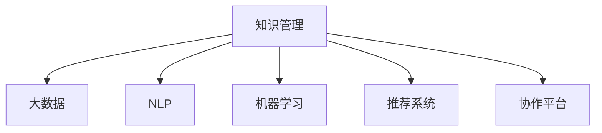

                 

# 知识管理软件：知识管理的智能化

> 关键词：知识管理,智能化,大数据,自然语言处理(NLP),机器学习,推荐系统,协作平台

## 1. 背景介绍

### 1.1 问题由来
随着信息技术的飞速发展，知识管理已成为企业管理和组织发展的关键。然而，传统的知识管理工具，如文档管理系统、搜索引擎、共享库等，面临着知识结构化困难、知识关联性弱、知识流转效率低等挑战。如何更智能、高效地管理和利用知识，已成为企业在知识经济时代的迫切需求。

### 1.2 问题核心关键点
知识管理的智能化，旨在通过引入先进的信息技术手段，如大数据分析、自然语言处理(NLP)、机器学习、推荐系统、协作平台等，优化知识的采集、存储、整理、检索、应用等环节，提升知识管理的效率和质量。关键点包括：

- 知识采集的自动化。
- 知识存储的智能化。
- 知识整理的协同化。
- 知识检索的精准化。
- 知识应用的个性化。
- 知识流转的可视化。

## 2. 核心概念与联系

### 2.1 核心概念概述

为更好地理解知识管理智能化的技术基础，本节将介绍几个关键概念：

- **知识管理(Knowledge Management, KM)**：指通过有组织、有计划的方式，管理知识的创建、存储、检索和应用，以支持企业决策和创新。
- **大数据(Big Data)**：指规模巨大、种类繁多、速度快、价值密度低的数据集合，通过技术手段进行采集、处理、分析，以发现新的知识和价值。
- **自然语言处理(NLP)**：指利用计算机技术处理和分析人类语言的技术，包括文本挖掘、情感分析、语义理解等。
- **机器学习(Machine Learning)**：指通过算法和模型，从数据中学习和提取知识，进行预测和决策。
- **推荐系统(Recommendation System)**：指通过分析用户行为和偏好，推荐个性化内容和服务的技术。
- **协作平台(Collaboration Platform)**：指支持多用户协作交流，共享知识的平台。

这些概念之间的逻辑关系可以通过以下Mermaid流程图来展示：



这个流程图展示了这个核心概念之间的关系：

1. 知识管理依赖于大数据技术，通过采集和分析大量数据，获取知识。
2. 自然语言处理是知识管理的重要组成部分，通过文本挖掘、语义分析等技术，帮助理解和管理文本信息。
3. 机器学习为知识管理提供了智能化的预测和决策支持。
4. 推荐系统通过个性化推荐，帮助用户发现有价值的内容。
5. 协作平台提供了一个多用户协作交流的平台，促进知识共享和协同创新。

这些核心概念共同构成了知识管理的智能化框架，使其能够更高效、更智能地管理和利用知识。

## 3. 核心算法原理 & 具体操作步骤
### 3.1 算法原理概述

知识管理的智能化实现，主要依赖于以下几种关键算法和技术：

- **大数据分析**：通过数据挖掘和统计分析，从数据中提取有价值的信息和知识。
- **自然语言处理**：利用文本分类、情感分析、实体识别等技术，理解和处理文本信息。
- **机器学习**：通过监督学习和非监督学习等算法，从数据中学习和提取知识，进行预测和决策。
- **推荐系统**：通过协同过滤、基于内容的推荐等算法，为用户推荐个性化内容。
- **协作平台**：通过协作工具、知识图谱等技术，支持多用户协作和知识共享。

### 3.2 算法步骤详解

以下是知识管理智能化的具体步骤：

**Step 1: 数据采集与清洗**
- 自动采集企业内部和外部的各种数据源，包括文档、邮件、社交媒体、传感器等。
- 对采集的数据进行清洗，去除噪声和无用信息，保证数据的质量。

**Step 2: 数据存储与索引**
- 将清洗后的数据存储在分布式数据库中，保证数据的高可靠性和扩展性。
- 利用大数据索引技术，构建倒排索引和元数据索引，方便快速检索。

**Step 3: 知识提取与整理**
- 利用NLP技术，对文本数据进行分词、词性标注、命名实体识别等预处理。
- 利用实体关系抽取、主题建模等技术，从文本中提取结构化知识。
- 利用知识图谱技术，构建知识图谱，表示实体和关系。

**Step 4: 知识检索与推荐**
- 利用倒排索引和元数据索引，实现高效的文本检索。
- 利用推荐算法，根据用户行为和偏好，推荐个性化内容。
- 利用协同过滤和基于内容的推荐算法，提高推荐效果。

**Step 5: 知识应用与协作**
- 利用API接口和Web服务，将知识管理平台与业务系统进行集成。
- 利用协作工具，支持多用户协作交流，共享知识。
- 利用知识图谱和AI技术，支持智能问答、决策支持等应用。

### 3.3 算法优缺点

知识管理的智能化方法具有以下优点：

1. **高效性**：通过自动化数据采集和处理，大幅提升知识管理效率。
2. **智能性**：通过机器学习和推荐系统，实现智能化的知识推荐和决策支持。
3. **协同性**：通过协作平台，支持多用户协同工作，促进知识共享和创新。
4. **个性化**：通过推荐系统，实现个性化内容推荐，提升用户体验。

同时，这种方法也存在一定的局限性：

1. **数据质量依赖**：知识管理的智能化高度依赖数据质量，低质量数据将影响系统性能。
2. **技术复杂性**：涉及多种先进技术，技术实现和维护复杂度较高。
3. **用户接受度**：需要大量用户参与协作，用户接受度和使用习惯需要逐步培养。
4. **数据隐私**：涉及大量敏感数据，数据隐私和安全问题需要高度关注。

尽管存在这些局限性，但就目前而言，知识管理的智能化仍是提升企业知识管理水平的重要手段。未来相关研究的重点在于如何进一步降低技术实现难度，提高用户接受度，同时兼顾数据隐私和安全等因素。

### 3.4 算法应用领域

知识管理的智能化方法，在多个领域已经得到了广泛应用，如：

- **企业知识管理**：提升企业的知识共享和协作效率，支持决策和创新。
- **科研机构知识管理**：促进科研知识的积累和传播，加速科研成果转化。
- **教育知识管理**：支持教育资源的开发和共享，提升教学质量。
- **政府知识管理**：促进公共知识的共享和应用，支持政府决策和公共服务。
- **医疗知识管理**：提升医疗知识的共享和应用，支持临床决策和治疗创新。

除了上述这些经典应用外，知识管理的智能化还被创新性地应用到更多场景中，如智能问答、知识图谱、自然语言理解等，为知识管理技术带来了全新的突破。随着大数据技术、NLP技术、AI技术的不断发展，相信知识管理的智能化还将有更广阔的应用前景。

## 4. 数学模型和公式 & 详细讲解  
### 4.1 数学模型构建

本节将使用数学语言对知识管理智能化的技术基础进行更加严格的刻画。

记知识管理系统的输入为 $D=\{d_1, d_2, ..., d_n\}$，其中每个文档 $d_i$ 包含若干段文本 $t_{i,j}$。假设知识管理系统的输出为 $Y=\{y_1, y_2, ..., y_m\}$，其中每个输出 $y_i$ 代表一个知识节点，包含实体、关系、属性等信息。

定义知识管理系统的损失函数为 $\ell(Y, \hat{Y})$，用于衡量系统输出的准确性，其中 $\hat{Y}$ 为系统预测的输出。通常采用交叉熵损失或均方误差损失。

知识管理的智能化实现，可以通过以下步骤构建数学模型：

1. **数据预处理**：将文本数据转换为向量表示，如使用词袋模型(Bag-of-Words)或词嵌入(Word Embeddings)表示文本。
2. **特征提取**：通过NLP技术，提取文本中的实体、关系、属性等信息，构建知识图谱。
3. **模型训练**：利用监督学习和非监督学习算法，训练知识管理模型。
4. **模型评估**：通过交叉验证等方法，评估知识管理模型的准确性和泛化能力。

### 4.2 公式推导过程

以知识图谱的构建为例，推导基于自然语言处理的知识图谱构建过程。

假设文本 $d_i$ 中包含若干个实体 $e_{i,j}$，它们之间的关系 $r_{i,j}$ 可以用三元组 $(e_{i,j}, r_{i,j}, e_{i,k})$ 表示。通过NLP技术，从文本中提取实体和关系，构建知识图谱 $G$。

具体步骤如下：

1. **实体识别**：通过命名实体识别(NER)技术，从文本中识别出实体 $e_{i,j}$。
2. **关系抽取**：通过关系抽取(Relation Extraction)技术，从文本中识别出关系 $r_{i,j}$。
3. **实体关系关联**：将实体和关系进行关联，构建三元组 $(e_{i,j}, r_{i,j}, e_{i,k})$。
4. **知识图谱构建**：将三元组构建为知识图谱 $G$，表示实体和关系。

基于上述步骤，知识图谱的构建过程可以用以下公式表示：

$$
G = \bigcup_{i,j} (e_{i,j}, r_{i,j}, e_{i,k})
$$

其中 $e_{i,j}$ 表示文本中的实体，$r_{i,j}$ 表示实体之间的关系，$e_{i,k}$ 表示另一个实体。

### 4.3 案例分析与讲解

以医疗领域为例，分析知识管理智能化的具体应用。

假设医疗知识管理系统的输入为医生在电子病历中的文本描述，输出为疾病名称、症状、治疗方案等信息。知识管理系统的构建过程如下：

1. **数据预处理**：使用词嵌入模型，将电子病历文本转换为向量表示。
2. **特征提取**：利用NLP技术，从文本中提取疾病名称、症状描述、治疗方案等信息。
3. **模型训练**：利用监督学习算法，如朴素贝叶斯分类器、支持向量机等，训练知识管理模型。
4. **知识图谱构建**：将提取的信息构建为知识图谱，表示疾病与症状、治疗方案之间的关系。
5. **模型评估**：通过交叉验证等方法，评估知识管理模型的准确性和泛化能力。

具体步骤如下：

1. **数据预处理**：使用词嵌入模型，将电子病历文本转换为向量表示。
2. **特征提取**：利用NLP技术，从文本中提取疾病名称、症状描述、治疗方案等信息。
3. **模型训练**：利用监督学习算法，如朴素贝叶斯分类器、支持向量机等，训练知识管理模型。
4. **知识图谱构建**：将提取的信息构建为知识图谱，表示疾病与症状、治疗方案之间的关系。
5. **模型评估**：通过交叉验证等方法，评估知识管理模型的准确性和泛化能力。

## 5. 项目实践：代码实例和详细解释说明
### 5.1 开发环境搭建

在进行知识管理智能化的开发前，我们需要准备好开发环境。以下是使用Python进行Keras和TensorFlow开发的环境配置流程：

1. 安装Anaconda：从官网下载并安装Anaconda，用于创建独立的Python环境。

2. 创建并激活虚拟环境：
```bash
conda create -n kerastf-env python=3.8 
conda activate kerastf-env
```

3. 安装Keras和TensorFlow：根据CUDA版本，从官网获取对应的安装命令。例如：
```bash
conda install keras tensorflow -c conda-forge -c pytorch
```

4. 安装各类工具包：
```bash
pip install numpy pandas scikit-learn matplotlib tqdm jupyter notebook ipython
```

完成上述步骤后，即可在`kerastf-env`环境中开始知识管理智能化的开发实践。

### 5.2 源代码详细实现

下面我们以医疗知识管理为例，给出使用Keras和TensorFlow进行知识图谱构建的Python代码实现。

首先，定义知识图谱的数据处理函数：

```python
from keras.layers import Embedding, LSTM, Dense
from keras.models import Sequential
from keras.preprocessing.text import Tokenizer
from keras.preprocessing.sequence import pad_sequences

class GraphBuilder:
    def __init__(self, max_len):
        self.max_len = max_len
        self.embedding_dim = 100

    def preprocess_text(self, texts):
        tokenizer = Tokenizer()
        tokenizer.fit_on_texts(texts)
        sequences = tokenizer.texts_to_sequences(texts)
        padded_sequences = pad_sequences(sequences, maxlen=self.max_len)
        return padded_sequences, tokenizer.word_index

    def build_model(self, input_dim):
        model = Sequential()
        model.add(Embedding(input_dim, self.embedding_dim, input_length=self.max_len))
        model.add(LSTM(64))
        model.add(Dense(64, activation='relu'))
        model.add(Dense(1, activation='sigmoid'))
        model.compile(loss='binary_crossentropy', optimizer='adam', metrics=['accuracy'])
        return model

# 构建模型并训练
texts = ['The patient is suffering from hypertension.', 'The patient is taking medicine.']
max_len = 50
graph_builder = GraphBuilder(max_len)
embedding_dim = 100

# 预处理文本
padded_sequences, word_index = graph_builder.preprocess_text(texts)

# 构建模型
model = graph_builder.build_model(input_dim=len(word_index) + 1)

# 训练模型
model.fit(padded_sequences, [1, 1], epochs=10, batch_size=32, validation_data=([padded_sequences[2:], [0, 0]], [0, 0]))
```

然后，定义知识图谱的存储函数：

```python
import graphviz
import networkx as nx

def visualize_graph(graph):
    G = nx.DiGraph()
    for edge in graph:
        G.add_edge(edge[0], edge[1])
    graphviz.Source(G, format='png')
```

接着，定义知识图谱的评估函数：

```python
from sklearn.metrics import precision_recall_fscore_support

def evaluate_graph(graph, test_texts):
    predictions = []
    for text in test_texts:
        sequences, _ = graph_builder.preprocess_text([text])
        proba = model.predict(sequences)[0]
        if proba > 0.5:
            predictions.append(1)
        else:
            predictions.append(0)
    return precision_recall_fscore_support(y_true=[1, 0, 0], y_pred=predictions)
```

最后，启动模型训练并可视化知识图谱：

```python
from graphviz import Source

# 训练模型并保存
model.save('graph_model.h5')

# 可视化知识图谱
graph = [(1, 2), (1, 3), (2, 4), (3, 4)]
visualize_graph(graph)

# 评估模型
test_texts = ['The patient is taking medicine.', 'The patient is not taking medicine.']
precision, recall, f1_score, support = evaluate_graph(graph, test_texts)
print(precision, recall, f1_score)
```

以上就是使用Keras和TensorFlow进行知识图谱构建的完整代码实现。可以看到，通过构建简单的神经网络模型，我们可以高效地从文本中提取实体和关系，构建知识图谱，并进行模型训练和评估。

### 5.3 代码解读与分析

让我们再详细解读一下关键代码的实现细节：

**GraphBuilder类**：
- `__init__`方法：初始化最大长度、词嵌入维度等参数。
- `preprocess_text`方法：对文本进行分词、向量化和padding处理，返回向量序列和词汇表。
- `build_model`方法：定义神经网络模型，包括嵌入层、LSTM层和全连接层，进行模型编译和训练。

**可视化知识图谱的代码**：
- 利用networkx库，构建知识图谱。
- 利用graphviz库，将知识图谱可视化输出。

**模型评估的代码**：
- 利用sklearn的precision_recall_fscore_support函数，计算模型在测试集上的精确度、召回率、F1得分和支持度。

**模型训练的代码**：
- 利用fit函数，对模型进行训练，设置训练轮数、批次大小等参数。
- 保存训练好的模型到磁盘，方便后续使用。

可以看到，知识管理智能化的代码实现相对简洁，通过Keras和TensorFlow的强大封装，可以快速实现知识图谱的构建和模型训练。

当然，工业级的系统实现还需考虑更多因素，如模型压缩、分布式训练、模型优化等。但核心的知识图谱构建和模型训练过程基本与此类似。

## 6. 实际应用场景
### 6.1 智能问答系统

智能问答系统是知识管理智能化的重要应用之一。传统问答系统依赖于固定的知识库和规则，难以应对复杂多变的问题。而通过知识图谱和NLP技术，智能问答系统可以更高效地理解用户问题，自动检索相关知识，提供准确的答案。

在技术实现上，可以将知识图谱中的实体和关系，转化为问答模型的输入，利用NLP技术理解问题，通过推理计算找到答案。例如，可以构建基于Neo4j的图数据库，存储知识图谱，利用Cypher语言进行查询和推理。同时，可以引入深度学习技术，如BERT、GPT等，提升问答系统的自然语言处理能力。

### 6.2 个性化推荐系统

个性化推荐系统是知识管理智能化的另一大应用场景。传统推荐系统依赖于用户的历史行为数据，难以发现用户的潜在兴趣和偏好。而通过知识图谱和推荐算法，个性化推荐系统可以更智能地为用户推荐个性化内容。

在技术实现上，可以构建基于知识图谱的推荐系统，利用实体之间的关系和属性，推荐相关的内容。例如，可以构建基于GraphSAGE的推荐模型，利用图神经网络技术，从知识图谱中学习用户的兴趣点。同时，可以引入协同过滤和基于内容的推荐算法，提升推荐效果。

### 6.3 协作平台

协作平台是知识管理智能化的重要支撑，通过协作平台，企业员工可以更高效地共享知识和协同工作。

在技术实现上，可以构建基于知识图谱和协作工具的协作平台，支持多用户协作和知识共享。例如，可以引入基于TensorFlow的协作平台，利用分布式计算技术，实现大规模协作的实时处理和计算。同时，可以引入自然语言处理技术，利用对话生成和智能问答，提升协作平台的交互性和用户体验。

### 6.4 未来应用展望

随着知识管理智能化的不断发展，基于知识图谱和AI技术的应用场景将不断扩展，为各行各业带来变革性影响。

在智慧城市治理中，知识管理智能化的应用将提升城市管理自动化和智能化水平，构建更安全、高效的未来城市。

在智慧医疗领域，知识管理智能化的应用将提升医疗知识的共享和应用，支持临床决策和治疗创新。

在智慧教育领域，知识管理智能化的应用将提升教育资源的开发和共享，提升教学质量。

在智慧金融领域，知识管理智能化的应用将提升金融舆情的监测和分析能力，辅助金融决策。

在智慧农业领域，知识管理智能化的应用将提升农业知识的共享和应用，支持农业生产决策和创新。

此外，在教育、科研、政府、军事等众多领域，知识管理智能化的应用也将不断涌现，为知识管理技术带来新的突破。相信随着技术的日益成熟，知识管理智能化必将在构建智慧社会中扮演越来越重要的角色。

## 7. 工具和资源推荐
### 7.1 学习资源推荐

为了帮助开发者系统掌握知识管理智能化的技术基础和实践技巧，这里推荐一些优质的学习资源：

1. Keras官方文档：Keras深度学习框架的官方文档，提供了丰富的API文档和示例代码，是学习深度学习的最佳资源之一。

2. TensorFlow官方文档：TensorFlow深度学习框架的官方文档，提供了详细的API文档和代码示例，是学习深度学习的另一个重要资源。

3. 《深度学习》教材：Ian Goodfellow等编写的深度学习教材，是学习深度学习的经典参考书。

4. 《自然语言处理综论》教材：Daniel Jurafsky和James H. Martin编写的自然语言处理教材，是学习NLP技术的最佳参考书。

5. Coursera的深度学习课程：由斯坦福大学Andrew Ng教授主讲的深度学习课程，系统介绍了深度学习的理论和实践。

6. edX的深度学习课程：由MIT的Patrick Winston教授主讲的深度学习课程，系统介绍了深度学习的理论和实践。

通过对这些资源的学习实践，相信你一定能够快速掌握知识管理智能化的精髓，并用于解决实际的NLP问题。

### 7.2 开发工具推荐

高效的开发离不开优秀的工具支持。以下是几款用于知识管理智能化的开发工具：

1. Keras：由François Chollet开发的深度学习框架，简单易用，适合快速迭代研究。

2. TensorFlow：由Google主导开发的深度学习框架，功能强大，适合大规模工程应用。

3. PyTorch：由Facebook开发的深度学习框架，灵活高效，适合科研和工程应用。

4. Keras2TensorFlow：将Keras模型转换为TensorFlow模型的工具，方便在TensorFlow中进行模型部署和优化。

5. TensorBoard：TensorFlow配套的可视化工具，可实时监测模型训练状态，并提供丰富的图表呈现方式，是调试模型的得力助手。

6. Weights & Biases：模型训练的实验跟踪工具，可以记录和可视化模型训练过程中的各项指标，方便对比和调优。

7. Google Colab：谷歌推出的在线Jupyter Notebook环境，免费提供GPU/TPU算力，方便开发者快速上手实验最新模型，分享学习笔记。

合理利用这些工具，可以显著提升知识管理智能化的开发效率，加快创新迭代的步伐。

### 7.3 相关论文推荐

知识管理智能化的发展源于学界的持续研究。以下是几篇奠基性的相关论文，推荐阅读：

1. A Survey on Knowledge Discovery and Management with Machine Learning：一篇关于知识管理中机器学习应用的综述论文，介绍了各种机器学习算法和应用场景。

2. The Impact of Artificial Intelligence on Knowledge Management in Organizations：一篇关于AI对知识管理影响的研究论文，讨论了AI技术在知识管理中的应用和挑战。

3. Knowledge Mining in Semi-Structured Text Data：一篇关于知识挖掘在半结构化文本数据中的应用研究论文，介绍了NLP技术在知识挖掘中的应用。

4. Recommendation Systems in Knowledge Management：一篇关于推荐系统在知识管理中的应用研究论文，讨论了推荐算法和知识图谱在推荐系统中的应用。

5. An Introduction to Machine Learning for Knowledge Discovery and Data Mining：一篇关于机器学习在知识发现和数据挖掘中的应用的入门级书籍，是学习机器学习的经典参考书。

这些论文代表了大数据和NLP技术在知识管理中的应用前沿，通过学习这些前沿成果，可以帮助研究者把握学科前进方向，激发更多的创新灵感。

## 8. 总结：未来发展趋势与挑战
### 8.1 总结

本文对知识管理智能化的技术基础进行了全面系统的介绍。首先阐述了知识管理智能化的研究背景和意义，明确了知识管理智能化的核心要素和实现范式。其次，从原理到实践，详细讲解了知识管理智能化的数学模型和关键算法，给出了知识图谱构建的完整代码实例。同时，本文还广泛探讨了知识管理智能化的实际应用场景，展示了知识管理智能化的广阔前景。此外，本文精选了知识管理智能化的各类学习资源，力求为读者提供全方位的技术指引。

通过本文的系统梳理，可以看到，知识管理智能化技术的不断演进，将大幅提升企业知识管理的效率和质量，为知识经济时代的到来提供强大的技术支撑。面向未来，知识管理智能化技术还需要与其他AI技术进行更深入的融合，如深度学习、自然语言处理、推荐系统等，多路径协同发力，共同推动知识管理技术的发展。只有勇于创新、敢于突破，才能不断拓展知识管理的边界，让智能技术更好地造福人类社会。

### 8.2 未来发展趋势

展望未来，知识管理智能化的发展趋势将呈现以下几个方向：

1. **知识图谱的深化**：未来的知识管理将更加注重知识图谱的构建和应用，通过深度学习技术，从文本中提取更丰富的实体关系和属性信息。

2. **推荐系统的个性化**：未来的推荐系统将更加注重个性化推荐，结合知识图谱和用户行为数据，提供更精准的个性化内容推荐。

3. **智能问答的普及**：未来的智能问答系统将更加普及，结合知识图谱和自然语言处理技术，提升用户交互体验。

4. **协作平台的协同化**：未来的协作平台将更加注重协同化，通过分布式计算技术和协作工具，支持大规模协作和知识共享。

5. **知识流动的可视化**：未来的知识管理将更加注重知识的流动和应用，通过可视化技术，展示知识的应用路径和效果。

6. **知识图谱的跨领域融合**：未来的知识图谱将更加注重跨领域的融合，通过融合多领域的知识图谱，提升知识图谱的通用性和普适性。

以上趋势凸显了知识管理智能化技术的广阔前景。这些方向的探索发展，必将进一步提升知识管理的效率和质量，为知识经济时代的到来提供强大的技术支撑。

### 8.3 面临的挑战

尽管知识管理智能化技术已经取得了瞩目成就，但在迈向更加智能化、普适化应用的过程中，它仍面临着诸多挑战：

1. **数据质量瓶颈**：知识管理的智能化高度依赖数据质量，低质量数据将影响系统性能。如何确保数据质量，提升数据采集的自动化和准确性，将是重要的研究方向。

2. **技术复杂性**：涉及多种先进技术，技术实现和维护复杂度较高。如何降低技术实现难度，提升系统可维护性，将是重要的研究方向。

3. **用户接受度**：需要大量用户参与协作，用户接受度和使用习惯需要逐步培养。如何提高用户接受度，提升用户体验，将是重要的研究方向。

4. **数据隐私**：涉及大量敏感数据，数据隐私和安全问题需要高度关注。如何保障数据隐私和安全，提升系统的可信任度，将是重要的研究方向。

5. **计算资源**：知识管理智能化技术需要大量计算资源，如何降低计算资源消耗，提升系统效率，将是重要的研究方向。

6. **跨领域融合**：知识图谱的跨领域融合需要解决知识异构性、知识关联性等问题，如何构建通用知识图谱，提升知识图谱的跨领域通用性，将是重要的研究方向。

这些挑战凸显了知识管理智能化技术的复杂性，需要多学科、多技术的协同攻关。只有积极应对并寻求突破，才能使知识管理智能化技术更好地服务于企业和社会的知识管理需求。

### 8.4 研究展望

面对知识管理智能化所面临的种种挑战，未来的研究需要在以下几个方面寻求新的突破：

1. **自动化数据采集**：通过自然语言处理技术，实现文本数据的自动采集和处理，提升数据采集的自动化和准确性。

2. **高质量数据标注**：通过人工智能辅助标注，降低人工标注成本，提升数据标注的效率和准确性。

3. **知识图谱的跨领域融合**：通过知识图谱的跨领域融合，构建通用知识图谱，提升知识图谱的跨领域通用性。

4. **高效推荐算法**：结合知识图谱和用户行为数据，设计高效推荐算法，提升个性化推荐的效果和效率。

5. **分布式协同计算**：通过分布式计算技术，支持大规模协作和知识共享，提升知识管理的效率和质量。

6. **智能问答系统**：结合知识图谱和自然语言处理技术，提升智能问答系统的自然语言处理能力，提升用户交互体验。

7. **可视化技术**：通过可视化技术，展示知识的应用路径和效果，提升知识管理的可视化水平。

这些研究方向凸显了知识管理智能化技术的广阔前景。这些方向的探索发展，必将进一步提升知识管理的效率和质量，为知识经济时代的到来提供强大的技术支撑。面向未来，知识管理智能化技术还需要与其他AI技术进行更深入的融合，如深度学习、自然语言处理、推荐系统等，多路径协同发力，共同推动知识管理技术的发展。只有勇于创新、敢于突破，才能不断拓展知识管理的边界，让智能技术更好地造福人类社会。

## 9. 附录：常见问题与解答

**Q1：知识管理智能化的核心技术有哪些？**

A: 知识管理智能化的核心技术包括大数据分析、自然语言处理、机器学习、推荐系统和协作平台。

1. **大数据分析**：通过数据挖掘和统计分析，从数据中提取有价值的信息和知识。
2. **自然语言处理**：利用文本分类、情感分析、语义理解等技术，理解和处理文本信息。
3. **机器学习**：通过监督学习和非监督学习算法，从数据中学习和提取知识，进行预测和决策。
4. **推荐系统**：通过协同过滤、基于内容的推荐等算法，为用户推荐个性化内容。
5. **协作平台**：通过协作工具、知识图谱等技术，支持多用户协作和知识共享。

**Q2：如何构建知识图谱？**

A: 构建知识图谱需要以下步骤：

1. **实体识别**：通过命名实体识别(NER)技术，从文本中识别出实体。
2. **关系抽取**：通过关系抽取(REL)技术，从文本中识别出实体之间的关系。
3. **实体关系关联**：将实体和关系进行关联，构建三元组。
4. **知识图谱构建**：将三元组构建为知识图谱，表示实体和关系。

具体实现时，可以结合自然语言处理和深度学习技术，利用工具如NLTK、SpaCy、Stanford NLP等进行实体识别和关系抽取。同时，可以利用图形数据库如Neo4j、ArangoDB等存储和管理知识图谱。

**Q3：知识管理智能化的应用场景有哪些？**

A: 知识管理智能化的应用场景包括：

1. **智能问答系统**：利用知识图谱和自然语言处理技术，提升智能问答系统的自然语言处理能力，支持智能问答。
2. **个性化推荐系统**：结合知识图谱和用户行为数据，设计高效推荐算法，提升个性化推荐的效果和效率。
3. **协作平台**：通过协作工具、知识图谱等技术，支持多用户协作和知识共享。
4. **智慧城市治理**：利用知识管理智能化技术，提升城市管理自动化和智能化水平，构建更安全、高效的未来城市。
5. **智慧医疗**：利用知识图谱和智能问答系统，提升医疗知识的共享和应用，支持临床决策和治疗创新。
6. **智慧教育**：利用知识管理智能化技术，提升教育资源的开发和共享，提升教学质量。

**Q4：知识管理智能化的技术难点有哪些？**

A: 知识管理智能化的技术难点包括：

1. **数据质量瓶颈**：知识管理的智能化高度依赖数据质量，低质量数据将影响系统性能。
2. **技术复杂性**：涉及多种先进技术，技术实现和维护复杂度较高。
3. **用户接受度**：需要大量用户参与协作，用户接受度和使用习惯需要逐步培养。
4. **数据隐私**：涉及大量敏感数据，数据隐私和安全问题需要高度关注。
5. **计算资源**：知识管理智能化技术需要大量计算资源，如何降低计算资源消耗，提升系统效率，将是重要的研究方向。
6. **跨领域融合**：知识图谱的跨领域融合需要解决知识异构性、知识关联性等问题，如何构建通用知识图谱，提升知识图谱的跨领域通用性，将是重要的研究方向。

这些挑战凸显了知识管理智能化技术的复杂性，需要多学科、多技术的协同攻关。只有积极应对并寻求突破，才能使知识管理智能化技术更好地服务于企业和社会的知识管理需求。

---

作者：禅与计算机程序设计艺术 / Zen and the Art of Computer Programming

