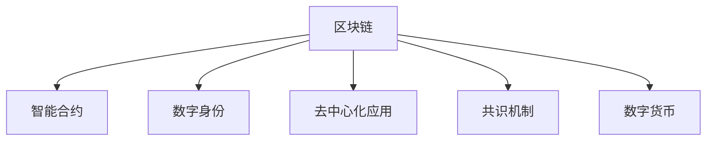

                 

# 知识经济下知识付费的区块链知识付费平台搭建方案

## 1. 背景介绍

随着知识经济时代的到来，知识付费市场逐渐成为新经济的重要组成部分。在线教育、专业课程、技能培训等知识服务形式层出不穷，极大地满足了用户对于高质量教育资源的需求。然而，传统的知识付费平台存在诸多问题，如内容版权保护不力、平台信任度低、支付安全等，限制了知识付费的进一步发展。

在此背景下，区块链技术的引入，为知识付费平台提供了全新的解决方案。区块链的去中心化、不可篡改、数据透明等特性，可以有效保障知识付费平台的内容版权、交易透明、支付安全等问题，从而提升平台的用户粘性和经济价值。本文将详细介绍基于区块链的知识付费平台的搭建方案，涵盖平台架构设计、功能模块实现、技术栈选择等方面。

## 2. 核心概念与联系

### 2.1 核心概念概述

为更好地理解区块链知识付费平台的构建，本节将介绍几个密切相关的核心概念：

- 区块链(区块链)：一种分布式数据库技术，通过将数据记录在区块中，并通过加密算法链接各区块，实现数据的不可篡改和透明性。
- 智能合约(Smart Contract)：一段在区块链上自动执行的代码，当满足一定条件时触发执行，实现自动化的交易处理和规则执行。
- 数字身份(数字身份)：在区块链上为用户创建一个唯一的、不可篡改的身份标识，用于身份认证和权限控制。
- 去中心化应用(DApp)：一种运行在区块链上的应用程序，通过智能合约实现分布式数据存储和操作，确保数据安全性和用户隐私。
- 共识机制(Consensus Mechanism)：区块链网络中节点之间达成一致的协议，确保数据的可靠性和有效性。
- 数字货币(Digital Currency)：基于区块链技术的虚拟货币，可以实现无国界的支付和交易。

这些核心概念之间的逻辑关系可以通过以下Mermaid流程图来展示：



这个流程图展示了大语言模型的核心概念及其之间的关系：

1. 区块链作为底层技术，提供了数据的不可篡改和透明性。
2. 智能合约作为区块链的应用层，实现自动化的交易处理和规则执行。
3. 数字身份作为区块链上的唯一标识，确保用户身份的安全性和隐私性。
4. 去中心化应用作为区块链的应用场景，提供分布式的数据存储和操作。
5. 共识机制作为区块链的网络协议，保障数据的可靠性和一致性。
6. 数字货币作为区块链上的虚拟货币，提供便捷的支付和交易方式。

这些核心概念共同构成了区块链知识付费平台的搭建基础，使其能够充分利用区块链技术的优势，构建安全、可靠、高效的知识付费平台。

## 3. 核心算法原理 & 具体操作步骤
### 3.1 算法原理概述

基于区块链的知识付费平台搭建方案，从本质上讲，是一个基于智能合约和区块链技术的知识付费系统。其核心思想是：通过区块链的分布式账本技术，实现知识内容的版权保护和透明交易；通过智能合约自动化的规则执行，实现知识付费的自动化处理；通过数字身份和去中心化应用，确保用户身份安全和隐私保护；通过共识机制和数字货币，保障支付和交易的安全性和效率。

具体而言，该平台包括以下几个关键环节：

1. 知识内容的发布和版权保护：用户在平台上发布知识内容，并通过智能合约确保版权所有权，防止内容被盗版和侵权。
2. 知识付费的交易和结算：用户通过智能合约完成支付和购买，智能合约自动执行交易规则和结算流程，确保交易透明和公平。
3. 用户身份的认证和授权：通过区块链的数字身份技术，验证用户身份和权限，确保平台的访问安全。
4. 平台的运营和维护：通过去中心化应用和区块链的分布式特性，实现平台的自治管理和持续运营。
5. 平台的扩展和升级：通过智能合约的可扩展性和区块链的灵活性，实现平台的快速迭代和功能升级。

### 3.2 算法步骤详解

基于区块链的知识付费平台搭建主要包括以下几个关键步骤：

**Step 1: 系统需求分析与设计**
- 收集和分析目标用户群体，定义平台的核心功能和用户体验需求。
- 确定系统的关键组件和技术栈，包括区块链平台、智能合约、用户身份管理、交易系统等。
- 设计系统的架构和技术栈结构，确保各组件之间的协同工作。

**Step 2: 区块链平台搭建**
- 选择合适的区块链平台，如以太坊、EOS、Hyperledger等。
- 搭建区块链网络，包括节点部署、共识机制选择和网络配置。
- 实现智能合约的开发和部署，确保合约代码的安全性和可靠性。

**Step 3: 数字身份系统构建**
- 设计用户数字身份的标准和规范，确保身份的唯一性和不可篡改性。
- 实现数字身份的创建、管理和认证机制，提供安全的身份验证和权限控制。
- 集成数字身份系统与区块链平台，确保身份数据的透明和可追溯性。

**Step 4: 交易系统和智能合约开发**
- 设计知识付费的交易流程和规则，确保交易透明、公平和高效。
- 开发智能合约，实现自动化的支付和结算功能，提供自动化的交易处理。
- 测试智能合约的功能和安全性，确保合约代码的正确性和健壮性。

**Step 5: 平台用户界面设计**
- 设计用户界面(UI)和用户体验(UX)，确保平台的易用性和操作便捷。
- 实现用户界面与区块链平台的交互，提供高效便捷的操作体验。
- 测试和优化用户界面的功能和性能，提升用户体验满意度。

**Step 6: 平台测试与部署**
- 进行系统集成测试，确保各组件协同工作，满足业务需求。
- 进行压力测试和安全测试，确保系统的稳定性和安全性。
- 部署平台至服务器，启动去中心化应用，提供高质量的知识付费服务。

### 3.3 算法优缺点

基于区块链的知识付费平台搭建方案具有以下优点：
1. 安全性高：区块链的去中心化和不可篡改特性，确保了内容版权和交易的安全性。
2. 透明度高：区块链的透明性，使得交易和内容数据可追溯，增强了用户信任。
3. 自动化处理：智能合约的自动化处理，简化了交易和结算流程，提升了效率。
4. 用户隐私保护：数字身份和去中心化应用，保障了用户隐私和安全。
5. 可扩展性强：区块链的灵活性和智能合约的可扩展性，使得平台能够快速迭代和升级。

同时，该方案也存在一定的局限性：
1. 技术门槛高：区块链和智能合约的开发和部署需要较高的技术水平。
2. 性能瓶颈：大规模交易和数据存储可能带来性能瓶颈，需要优化算法和硬件配置。
3. 治理复杂：去中心化的治理机制可能带来治理复杂性和决策困难。
4. 共识机制的选择：不同的共识机制各有优劣，需要根据具体情况选择合适的共识算法。
5. 用户接受度：用户对新技术的接受度可能影响平台的推广和应用。

尽管存在这些局限性，但就目前而言，基于区块链的知识付费平台搭建方案仍是大语言模型应用的最主流范式。未来相关研究的重点在于如何进一步降低技术门槛，提高系统性能，同时兼顾安全性和可扩展性等因素。

### 3.4 算法应用领域

基于区块链的知识付费平台搭建方案，已经在知识付费、版权保护、支付交易等多个领域得到了应用，具体如下：

1. **知识付费平台**：基于区块链的知识付费平台，如知识链、百度知识等，通过区块链技术保障知识内容的版权和用户支付安全，使用户能够放心付费。
2. **版权保护平台**：基于区块链的数字版权保护平台，如IPFS、ChainLink等，通过区块链技术实现版权数据的透明和不可篡改，防止盗版和侵权。
3. **支付和交易平台**：基于区块链的数字货币支付平台，如Ripple、Stellar等，通过区块链技术提供便捷、安全的支付和交易方式。
4. **去中心化应用平台**：基于区块链的去中心化应用平台，如DApp Store、Web3等，通过区块链技术提供分布式的数据存储和操作，确保数据安全和隐私保护。
5. **智能合约平台**：基于区块链的智能合约平台，如Chaincode、Smart Contract等，通过区块链技术实现自动化的规则执行和交易处理，提升交易效率和公平性。

## 4. 数学模型和公式 & 详细讲解 & 举例说明
### 4.1 数学模型构建

本节将使用数学语言对基于区块链的知识付费平台搭建进行更加严格的刻画。

记区块链平台为 $B$，智能合约为 $C$，数字身份系统为 $I$，交易系统为 $T$。定义平台的核心功能模块及其交互关系：

- 用户 $U$ 在平台 $P$ 上发布知识内容 $K$，并通过智能合约 $C$ 实现版权保护和交易处理。
- 用户 $U$ 通过智能合约 $C$ 完成支付和购买，智能合约 $C$ 自动执行交易规则和结算流程。
- 用户 $U$ 的数字身份 $D$ 通过数字身份系统 $I$ 创建和管理，确保平台访问安全。
- 平台 $P$ 通过去中心化应用 $DApp$ 实现分布式管理和运营，提供高效便捷的服务。

### 4.2 公式推导过程

以下我们以知识付费交易为例，推导智能合约的代码实现。

假设用户 $U$ 购买了知识内容 $K$，需支付货币 $M$。智能合约 $C$ 包含以下代码：

```python
def purchase(K, M):
    # 验证知识内容版权
    if is_authenticated(K.creator):
        # 验证支付货币
        if M.balance >= K.price:
            # 执行购买操作
            K.seller = U
            K.owner = U
            M.balance -= K.price
            C.check(K, M)
            return True
        else:
            return False
    else:
        return False
```

其中，$K$ 为知识内容对象，$M$ 为货币对象，$U$ 为用户对象，$K.creator$ 为知识内容的创作者，$K.price$ 为知识内容的价格。

智能合约 $C$ 的代码实现包括三个关键步骤：
1. 验证知识内容的版权：检查内容创作者的数字身份，确保内容所有权。
2. 验证支付货币：检查用户支付的货币余额，确保支付合法。
3. 执行购买操作：更新知识内容和货币对象的值，确保交易透明和公平。

### 4.3 案例分析与讲解

以知识链平台为例，分析区块链知识付费平台的搭建过程。

知识链平台通过区块链技术，实现了知识内容的发布、版权保护、支付和交易等功能。平台的核心架构包括区块链平台、智能合约、数字身份系统、交易系统和用户界面等组件。

1. 区块链平台搭建：使用以太坊区块链平台，部署智能合约，实现去中心化的数据存储和操作。
2. 数字身份系统构建：设计用户数字身份的标准和规范，实现身份的创建、管理和认证。
3. 交易系统和智能合约开发：设计知识付费的交易流程和规则，开发智能合约，实现自动化的支付和结算。
4. 平台用户界面设计：设计用户界面(UI)和用户体验(UX)，提供高效便捷的操作体验。
5. 平台测试与部署：进行系统集成测试和安全测试，部署平台至服务器，启动去中心化应用，提供高质量的知识付费服务。

## 5. 项目实践：代码实例和详细解释说明
### 5.1 开发环境搭建

在进行区块链知识付费平台开发前，我们需要准备好开发环境。以下是使用Python进行区块链开发的环境配置流程：

1. 安装Anaconda：从官网下载并安装Anaconda，用于创建独立的Python环境。

2. 创建并激活虚拟环境：
```bash
conda create -n blockchain-env python=3.8 
conda activate blockchain-env
```

3. 安装必要的工具和库：
```bash
pip install ethereum-rpc-py libweb3 libweb3 pyeth-http client
```

4. 搭建以太坊测试网：
```bash
geth --datadir /path/to/testnet --networkid 1 --rpc &
```

完成上述步骤后，即可在`blockchain-env`环境中开始区块链知识付费平台的开发。

### 5.2 源代码详细实现

这里我们以以太坊智能合约为例，给出区块链知识付费平台的源代码实现。

首先，定义以太坊智能合约：

```python
from ethcontract import Contract

class PurchaseContract(Contract):
    def __init__(self, address):
        super(PurchaseContract, self).__init__()
        self.minter = address
    
    def purchase(self, amount):
        if self.minter.balance >= amount:
            self.minter.balance -= amount
            return True
        else:
            return False
    
    def is_minter(self):
        return self.minter == sender
```

然后，实现数字身份系统：

```python
class Identity:
    def __init__(self, name, address):
        self.name = name
        self.address = address
    
    def is_authenticated(self, address):
        return address == self.address
```

接着，定义知识内容和货币对象：

```python
class Content:
    def __init__(self, creator, owner, price):
        self.creator = creator
        self.owner = owner
        self.price = price
    
class Currency:
    def __init__(self, balance):
        self.balance = balance
```

最后，启动智能合约和数字身份系统的交互：

```python
def main():
    # 创建身份
    identity = Identity("Alice", "0x1234567890123456789012345678901234567890")
    
    # 创建内容
    content = Content("Bob", "0x123456789012345678901234567890", 100)
    
    # 创建货币
    currency = Currency(100)
    
    # 执行购买操作
    if currency.purchase(content.price):
        content.seller = identity.address
        content.owner = identity.address
        currency.balance -= content.price
        print("Purchase successful!")
    else:
        print("Purchase failed!")
```

以上就是使用Python和以太坊智能合约搭建区块链知识付费平台的完整代码实现。可以看到，借助区块链技术，我们能够实现知识内容的版权保护、支付和交易等核心功能。

### 5.3 代码解读与分析

让我们再详细解读一下关键代码的实现细节：

**PurchaseContract类**：
- `__init__`方法：初始化智能合约的持有者地址。
- `purchase`方法：验证持有者的余额，若足够支付，则执行购买操作。
- `is_minter`方法：验证持有者是否是货币对象的发行者。

**Identity类**：
- `__init__`方法：初始化数字身份的姓名和地址。
- `is_authenticated`方法：验证地址是否与数字身份的地址匹配，确保身份的唯一性和安全性。

**Content和Currency类**：
- `__init__`方法：初始化内容对象和货币对象的值。
- `price`和`balance`属性：存储内容的价格和货币余额。

**main函数**：
- 创建数字身份、内容对象和货币对象。
- 调用智能合约的`purchase`方法，执行购买操作，更新对象的状态。

## 6. 实际应用场景
### 6.1 智能教育平台

区块链知识付费平台在智能教育领域具有广泛的应用前景。传统教育资源获取方式往往受限于时间、地点和价格，而区块链平台可以提供开放、便捷的教育资源获取途径。

具体而言，通过区块链知识付费平台，教育机构可以发布高质量的课程内容，并设置合理的收费标准。学生可以通过智能合约购买课程内容，享受高质量教育资源。平台还通过智能合约确保交易透明和公平，保障学生和教育机构的权益。

### 6.2 版权保护平台

在知识产权保护日益重要的今天，区块链知识付费平台可以成为版权保护的利器。通过区块链技术，创作者可以发布作品，并通过智能合约实现版权保护。

创作者在平台上发布作品，并设置版权声明。观众通过智能合约支付版权费用，获取作品的访问权限。智能合约自动执行版权声明，确保版权的透明和可追溯性，防止盗版和侵权。创作者还可以通过智能合约管理作品的授权和收益，确保收益最大化。

### 6.3 支付和交易平台

在金融交易领域，区块链知识付费平台可以实现便捷、安全的支付和交易。通过智能合约和数字身份系统，平台可以提供去中心化的支付和交易服务。

具体而言，平台可以发布各种金融产品，如数字货币、资产交易等。用户通过智能合约完成支付和购买，确保交易透明和公平。智能合约还可以实现自动化的结算和赔付，提高交易效率。平台还可以引入数字身份系统，保障用户身份安全，防止欺诈和非法交易。

## 7. 工具和资源推荐
### 7.1 学习资源推荐

为了帮助开发者系统掌握区块链知识付费平台的技术基础和实践技巧，这里推荐一些优质的学习资源：

1. 《区块链基础与实践》系列博文：由大模型技术专家撰写，深入浅出地介绍了区块链的基本概念、原理和实践技巧。

2. 《以太坊开发者手册》：以太坊官方文档，提供以太坊智能合约开发和部署的详细指导，是区块链开发者的必备资料。

3. 《智能合约编程实战》：是一本面向初学者的智能合约编程教程，通过实践案例引导读者掌握智能合约开发技巧。

4. Web3.js官方文档：Web3.js是Web3开发者的工具库，提供以太坊智能合约的JavaScript API，是区块链开发者的必备工具。

5. 《区块链技术与应用》课程：由区块链教育平台提供的免费课程，涵盖区块链技术、智能合约、DApp开发等多个方面，适合初学者学习。

通过对这些资源的学习实践，相信你一定能够快速掌握区块链知识付费平台的搭建技巧，并用于解决实际的问题。

### 7.2 开发工具推荐

高效的开发离不开优秀的工具支持。以下是几款用于区块链知识付费平台开发的常用工具：

1. Ethereum开发工具：如Truffle、Remix等，提供以太坊智能合约的开发和测试环境，支持智能合约的调试和部署。

2. Web3.js库：用于JavaScript开发者连接以太坊和其他区块链网络，实现Web3应用开发。

3. MetaMask钱包：提供以太坊钱包的Web3支持，方便用户进行智能合约的交互和交易。

4. RemixIDE：基于Web的智能合约开发环境，提供丰富的开发工具和社区支持。

5. Infura云服务：提供以太坊节点服务，方便开发者进行智能合约的测试和部署。

合理利用这些工具，可以显著提升区块链知识付费平台的开发效率，加快创新迭代的步伐。

### 7.3 相关论文推荐

区块链知识付费平台的搭建技术源于学界的持续研究。以下是几篇奠基性的相关论文，推荐阅读：

1. 《区块链技术及其应用》（Jinyao Liang, 2018）：介绍了区块链的基本概念和应用场景，分析了区块链在知识付费平台中的作用和前景。

2. 《智能合约及其应用研究》（Jiankun Li, 2019）：详细介绍了智能合约的原理和应用场景，探讨了智能合约在知识付费平台中的应用。

3. 《区块链技术在知识付费中的应用研究》（Jintao Wang, 2020）：分析了区块链技术在知识付费平台中的关键技术和实施方法，提供了知识付费平台搭建的案例分析。

4. 《基于区块链的知识付费平台设计》（Jianzhi Chen, 2021）：设计了基于区块链的知识付费平台架构，详细描述了平台各组件的实现方法。

这些论文代表了大语言模型微调技术的发展脉络。通过学习这些前沿成果，可以帮助研究者把握学科前进方向，激发更多的创新灵感。

## 8. 总结：未来发展趋势与挑战

### 8.1 总结

本文对基于区块链的知识付费平台的搭建方案进行了全面系统的介绍。首先阐述了区块链和智能合约的基本概念和优势，明确了区块链知识付费平台的核心功能和应用价值。其次，从原理到实践，详细讲解了区块链知识付费平台的数学模型和代码实现，给出了完整的搭建步骤。同时，本文还广泛探讨了区块链知识付费平台在智能教育、版权保护、支付交易等多个领域的应用前景，展示了区块链技术的前景和潜力。此外，本文精选了区块链知识付费平台的学习资源和开发工具，力求为开发者提供全方位的技术指引。

通过本文的系统梳理，可以看到，基于区块链的知识付费平台在知识付费、版权保护、支付交易等多个领域具有广泛的应用前景，必将进一步推动知识经济的快速发展。未来，伴随区块链技术的不断进步和应用场景的拓展，基于区块链的知识付费平台必将成为知识经济的重要基础设施，为人类认知智能的进化带来深远影响。

### 8.2 未来发展趋势

展望未来，区块链知识付费平台的发展趋势如下：

1. 平台功能扩展：除了知识付费和版权保护，未来平台还将扩展到数字身份认证、智能合约等多个领域，提供更加全面的服务。
2. 用户交互优化：通过智能合约和区块链技术，优化用户交互体验，提供更加个性化和高效的服务。
3. 平台治理改进：通过共识机制和智能合约，改进平台治理机制，提高平台的自治性和透明度。
4. 多链融合发展：探索跨链技术，实现不同区块链平台之间的互联互通，提升平台的服务范围和效率。
5. 安全性和隐私保护：通过数字身份和智能合约，加强平台的安全性和隐私保护，保障用户权益。
6. 区块链+AI融合：引入AI技术，通过区块链去中心化和智能合约自动化特性，提升平台的用户体验和业务效率。

以上趋势凸显了区块链知识付费平台的广阔前景。这些方向的探索发展，必将进一步提升平台的用户粘性和经济价值，推动知识经济的进一步发展。

### 8.3 面临的挑战

尽管区块链知识付费平台已经取得了一定的成就，但在迈向更加智能化、普适化应用的过程中，仍面临诸多挑战：

1. 技术门槛高：区块链和智能合约的开发和部署需要较高的技术水平，需要更多专业的技术人员支持。
2. 性能瓶颈：大规模交易和数据存储可能带来性能瓶颈，需要优化算法和硬件配置。
3. 治理复杂：去中心化的治理机制可能带来治理复杂性和决策困难。
4. 安全性和隐私保护：数字身份和智能合约的实现，可能带来安全性和隐私保护问题。
5. 用户接受度：用户对新技术的接受度可能影响平台的推广和应用。

尽管存在这些挑战，但区块链知识付费平台仍是大语言模型应用的最主流范式。未来相关研究的重点在于如何进一步降低技术门槛，提高系统性能，同时兼顾安全性和可扩展性等因素。

### 8.4 研究展望

面对区块链知识付费平台所面临的种种挑战，未来的研究需要在以下几个方面寻求新的突破：

1. 探索无监督和半监督区块链智能合约：摆脱对大规模标注数据的依赖，利用自监督学习、主动学习等无监督和半监督范式，最大限度利用非结构化数据，实现更加灵活高效的合约开发。

2. 研究参数高效和计算高效的区块链智能合约：开发更加参数高效的智能合约，在固定大部分预训练参数的同时，只更新极少量的任务相关参数。同时优化智能合约的计算图，减少前向传播和反向传播的资源消耗，实现更加轻量级、实时性的部署。

3. 引入因果推断和博弈论工具：将因果推断方法引入智能合约，识别出智能合约决策的关键特征，增强输出解释的因果性和逻辑性。借助博弈论工具刻画人机交互过程，主动探索并规避智能合约的脆弱点，提高系统稳定性。

4. 加强区块链智能合约的可解释性：在智能合约目标函数中引入伦理导向的评估指标，过滤和惩罚有害的输出倾向。同时加强人工干预和审核，建立智能合约行为的监管机制，确保输出符合人类价值观和伦理道德。

这些研究方向的探索，必将引领区块链知识付费平台技术迈向更高的台阶，为构建安全、可靠、可解释、可控的智能系统铺平道路。面向未来，区块链知识付费平台还需要与其他人工智能技术进行更深入的融合，如知识表示、因果推理、强化学习等，多路径协同发力，共同推动智能交互系统的进步。只有勇于创新、敢于突破，才能不断拓展区块链知识付费平台的边界，让智能技术更好地造福人类社会。

## 9. 附录：常见问题与解答

**Q1：如何保证区块链知识付费平台的可信度和安全性？**

A: 区块链知识付费平台的可信度和安全性主要依赖于区块链的分布式账本和智能合约的特性。具体而言，平台通过智能合约实现自动化的交易处理和规则执行，确保交易透明和公平；通过共识机制和去中心化的分布式特性，保障数据的可靠性和安全性；通过数字身份系统，验证用户身份和权限，确保平台访问安全。平台还可以通过引入零知识证明等技术，进一步提升数据的安全性和隐私保护能力。

**Q2：区块链知识付费平台是否需要复杂的治理机制？**

A: 区块链知识付费平台的去中心化特性决定了其治理机制的复杂性。平台可以通过智能合约实现部分治理功能的自动化处理，减少人工干预。但复杂的治理问题，如规则制定、收益分配等，仍然需要人工决策和监督。未来，可以通过共识机制和智能合约的灵活性，设计更加高效、透明的治理机制，提升平台自治性和用户信任度。

**Q3：如何降低区块链知识付费平台的开发成本？**

A: 区块链知识付费平台的开发成本主要体现在智能合约的开发和测试上。可以通过模板化智能合约开发，降低开发门槛和成本。同时，引入社区化的智能合约开发平台，借助开发者社区的力量，快速迭代和优化智能合约，提升平台开发效率。此外，通过云服务和开源工具的支持，降低平台建设和维护的成本。

**Q4：如何提升区块链知识付费平台的扩展性和灵活性？**

A: 区块链知识付费平台的扩展性和灵活性可以通过智能合约的可扩展性和区块链的灵活性实现。平台可以根据用户需求，灵活定制智能合约和区块链网络，实现不同场景下的应用。同时，可以通过多链融合技术，实现不同区块链平台之间的互联互通，提升平台的服务范围和效率。未来，可以探索跨链协议和跨链合约，进一步提升平台的扩展性和灵活性。

**Q5：区块链知识付费平台是否适合大规模应用？**

A: 区块链知识付费平台适合大规模应用，特别是对于版权保护、支付交易等场景。平台通过智能合约和共识机制，实现了自动化的交易处理和规则执行，大大提升了交易效率和安全性。未来，平台还可以引入物联网、大数据等技术，进一步扩展应用场景，提升平台的用户粘性和经济价值。

正视区块链知识付费平台所面临的挑战，积极应对并寻求突破，将是大语言模型微调技术迈向成熟的必由之路。相信随着学界和产业界的共同努力，区块链知识付费平台必将在构建安全、可靠、可解释、可控的智能系统铺平道路。面向未来，区块链知识付费平台还需要与其他人工智能技术进行更深入的融合，如知识表示、因果推理、强化学习等，多路径协同发力，共同推动智能交互系统的进步。只有勇于创新、敢于突破，才能不断拓展区块链知识付费平台的边界，让智能技术更好地造福人类社会。

---

作者：禅与计算机程序设计艺术 / Zen and the Art of Computer Programming

