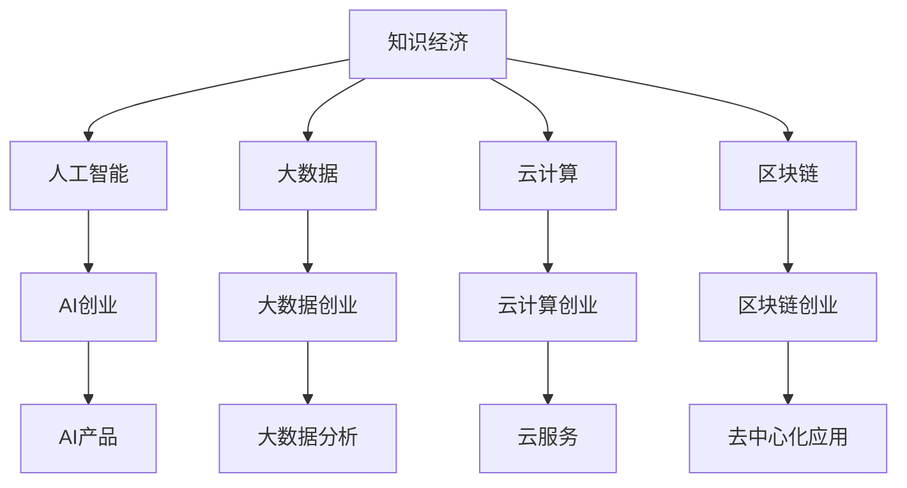

                 

# 知识经济下程序员的创业之路

> 关键词：知识经济,程序员创业,人工智能,大数据,云计算,区块链

## 1. 背景介绍

### 1.1 问题由来
随着全球进入知识经济时代，科技创新成为驱动经济发展的关键因素。程序员作为信息技术创新的核心力量，面临着前所未有的创业机遇。如何抓住时代红利，将技术能力转化为商业价值，成为了广大程序员的共同挑战。

### 1.2 问题核心关键点
在知识经济背景下，程序员创业的关键在于：
- 洞察技术趋势：紧跟前沿技术发展，把握人工智能、大数据、云计算、区块链等领域的创新机会。
- 构建核心竞争力：基于技术积累，打造高附加值的产品和服务。
- 形成商业生态：汇聚多方资源，构建完整的商业生态系统，形成可持续发展的商业模式。
- 赋能社会进步：利用技术推动社会变革，解决实际问题，贡献社会价值。

## 2. 核心概念与联系

### 2.1 核心概念概述

为更好地理解程序员如何在知识经济背景下进行创业，本节将介绍几个密切相关的核心概念：

- 知识经济(Knowledge Economy)：以知识为基本经济要素，创新驱动的新型经济形态。
- 人工智能(Artificial Intelligence, AI)：通过模拟人类智能过程，实现对复杂问题的解决和决策。
- 大数据(Big Data)：指规模庞大、结构复杂的数据集，为精准分析提供依据。
- 云计算(Cloud Computing)：通过互联网提供基础设施和软件服务，实现资源的弹性扩展和共享。
- 区块链(Blockchain)：基于分布式账本技术，实现去中心化、透明、安全的数据存储和交换。

这些核心概念之间的逻辑关系可以通过以下Mermaid流程图来展示：



这个流程图展示了几大核心概念之间的关联性：

1. 知识经济是总体背景，引领AI、大数据、云计算和区块链等新兴技术的发展。
2. AI创业、大数据创业、云计算创业、区块链创业分别代表了不同的技术路径。
3. AI产品、大数据分析、云服务、去中心化应用等具体技术或服务，则是这些创业方向的具体应用。

## 3. 核心算法原理 & 具体操作步骤
### 3.1 算法原理概述

在知识经济背景下，程序员创业的核心理念是利用新兴技术解决实际问题，创造社会价值。基于这一理念，创业过程可以分为以下几个关键步骤：

1. **市场调研**：通过数据分析和调研，识别目标市场的痛点和需求。
2. **技术选型**：根据市场需求和技术趋势，选择最适合的技术栈和算法。
3. **产品设计**：基于用户需求和技术方案，设计出满足用户期望的产品原型。
4. **模型训练**：利用已有数据或用户反馈，训练机器学习模型或优化算法。
5. **商业化部署**：将产品部署到云平台或区块链网络，进行市场推广和用户运营。
6. **持续优化**：根据用户反馈和市场变化，持续迭代和优化产品，提升用户体验和商业价值。

### 3.2 算法步骤详解

#### 3.2.1 市场调研

市场调研是创业的第一步，通过深入了解市场环境、用户需求和竞争态势，明确项目方向和定位。具体步骤包括：

1. **数据收集**：通过网络爬虫、问卷调查、社交媒体分析等手段，收集目标市场的数据。
2. **数据分析**：利用统计学和机器学习模型，分析数据中的趋势和模式。
3. **需求识别**：从分析结果中提取关键需求和痛点，作为项目开发的依据。
4. **竞争分析**：评估现有竞争对手的产品和市场策略，找到差异化的竞争优势。

#### 3.2.2 技术选型

技术选型应基于市场需求和技术趋势，选择最合适的技术栈和算法。主要步骤包括：

1. **技术栈选择**：根据项目需求，选择适合的编程语言、框架和工具。
2. **算法模型选择**：根据数据分析结果，选择最有效的算法和模型。
3. **技术对比评估**：对比不同技术的优缺点，选择最合适的技术方案。

#### 3.2.3 产品设计

产品设计是创业成功的关键环节，需综合考虑用户体验和商业价值。主要步骤包括：

1. **用户画像**：定义目标用户群体，明确其行为、需求和偏好。
2. **功能设计**：根据用户需求，设计产品功能和交互方式。
3. **界面设计**：设计直观、易用的用户界面，提升用户体验。
4. **原型制作**：制作产品原型，进行用户测试和反馈收集。

#### 3.2.4 模型训练

模型训练是利用技术解决问题的重要环节。主要步骤包括：

1. **数据准备**：收集和清洗数据，提取特征。
2. **模型选择**：选择合适的机器学习模型或深度学习算法。
3. **模型训练**：利用训练数据集，进行模型训练和调参。
4. **模型评估**：在验证集上评估模型性能，进行模型优化。

#### 3.2.5 商业化部署

商业化部署是将产品推向市场的关键步骤。主要步骤包括：

1. **平台选择**：选择适合的云平台或区块链网络，进行产品部署。
2. **系统搭建**：搭建稳定的云服务系统或区块链网络。
3. **市场推广**：利用SEO、SEM、社交媒体等手段，进行市场推广。
4. **用户运营**：通过CRM、社区管理等手段，进行用户运营和反馈收集。

#### 3.2.6 持续优化

持续优化是确保产品长期竞争力的重要环节。主要步骤包括：

1. **用户反馈收集**：通过用户反馈、数据分析等手段，收集用户意见和建议。
2. **产品迭代**：根据用户反馈，进行产品迭代和功能优化。
3. **性能优化**：通过代码优化、算法调优等手段，提升产品性能。
4. **市场拓展**：根据用户反馈和市场需求，进行市场拓展和产品多样化。

### 3.3 算法优缺点

程序员创业过程中的算法优缺点主要体现在以下几个方面：

#### 3.3.1 优点

1. **技术优势**：程序员具备深厚的技术背景，能够快速开发和优化产品。
2. **创新性强**：利用技术创新解决实际问题，具备较强的市场竞争力。
3. **效率高**：技术驱动的创业模式，能够快速迭代和市场验证。
4. **资源丰富**：利用技术生态，可以便捷地获取数据、算法和工具资源。

#### 3.3.2 缺点

1. **市场风险高**：技术优势可能被市场竞争对手快速复制。
2. **资金压力大**：技术开发和商业化需要大量资金投入。
3. **用户需求不确定**：技术开发与实际需求可能存在偏差。
4. **技术更新快**：新技术快速发展，可能使产品失去竞争力。

## 4. 数学模型和公式 & 详细讲解 & 举例说明

### 4.1 数学模型构建

在知识经济背景下，程序员创业的数学模型可以大致分为两个部分：市场调研和产品优化。

1. **市场调研模型**：利用数据挖掘和机器学习技术，从海量数据中提取市场信息和用户需求。
2. **产品优化模型**：利用回归分析、聚类分析等方法，优化产品功能和性能。

### 4.2 公式推导过程

#### 4.2.1 市场调研模型

假设市场调研数据集为 $D=\{(x_i,y_i)\}_{i=1}^N$，其中 $x_i$ 为市场特征向量，$y_i$ 为市场规模或用户需求。

我们希望构建一个线性回归模型来预测市场规模 $y$：

$$
y_i = \theta_0 + \sum_{j=1}^d \theta_j x_{ij}
$$

其中 $\theta_0$ 为截距，$\theta_j$ 为第 $j$ 个特征的系数。

利用最小二乘法，求解 $\theta_0,\theta_j$：

$$
\hat{\theta} = \mathop{\arg\min}_{\theta} \frac{1}{N} \sum_{i=1}^N (y_i - \hat{y}_i)^2
$$

其中 $\hat{y}_i = \theta_0 + \sum_{j=1}^d \theta_j x_{ij}$。

利用矩阵形式表示为：

$$
\hat{\theta} = (X^TX)^{-1}X^Ty
$$

其中 $X = [x_{i1} x_{i2} ... x_{id}]$，$y = [y_1 y_2 ... y_N]$。

#### 4.2.2 产品优化模型

假设产品性能与用户反馈 $x$ 成正比，利用线性回归模型进行性能优化：

$$
y = \theta_0 + \sum_{j=1}^d \theta_j x_j
$$

其中 $x_j$ 为第 $j$ 个用户反馈指标。

求解 $\theta_0,\theta_j$：

$$
\hat{\theta} = (X^TX)^{-1}X^Ty
$$

其中 $X = [x_{1j} x_{2j} ... x_{nj}]$，$y = [y_1 y_2 ... y_n]$。

通过不断迭代优化，提升产品性能。

### 4.3 案例分析与讲解

#### 4.3.1 案例1：AI语音识别创业

某创业团队基于语音识别技术，开发了智能语音助手产品。项目流程如下：

1. **市场调研**：通过网络爬虫收集了大量用户对语音助手的需求和反馈，利用情感分析模型进行用户情绪识别。
2. **技术选型**：选择TensorFlow作为技术栈，利用深度学习算法进行语音识别模型训练。
3. **产品设计**：定义了产品功能和交互方式，制作了产品原型。
4. **模型训练**：利用收集的语音数据进行模型训练和调参。
5. **商业化部署**：将产品部署到云平台，进行市场推广和用户运营。
6. **持续优化**：根据用户反馈和市场需求，进行产品迭代和功能优化。

#### 4.3.2 案例2：大数据分析创业

某创业团队基于大数据分析技术，开发了数据驱动的智能营销平台。项目流程如下：

1. **市场调研**：通过问卷调查和社交媒体分析，识别出客户对营销活动的反馈。
2. **技术选型**：选择Hadoop作为技术栈，利用数据挖掘算法进行客户行为分析。
3. **产品设计**：定义了数据可视化界面，提升了营销数据分析的效率。
4. **模型训练**：利用收集的客户行为数据进行模型训练和调参。
5. **商业化部署**：将产品部署到云计算平台，进行市场推广和用户运营。
6. **持续优化**：根据用户反馈和市场需求，进行产品迭代和功能优化。

## 5. 项目实践：代码实例和详细解释说明

### 5.1 开发环境搭建

在进行程序员创业的实践中，开发环境搭建是关键一步。以下是使用Python进行环境搭建的步骤：

1. 安装Anaconda：从官网下载并安装Anaconda，用于创建独立的Python环境。
```bash
conda install anaconda
```
2. 创建并激活虚拟环境：
```bash
conda create -n env_name python=3.8
conda activate env_name
```
3. 安装Python包：
```bash
conda install numpy pandas scikit-learn tensorflow matplotlib
```

### 5.2 源代码详细实现

以AI语音识别项目为例，给出使用TensorFlow进行语音识别的代码实现。

首先，导入相关库：
```python
import tensorflow as tf
import numpy as np
from tensorflow.keras import layers, models
```

然后，定义模型：
```python
model = models.Sequential([
    layers.Conv2D(32, (3,3), activation='relu', input_shape=(28, 28, 1)),
    layers.MaxPooling2D((2, 2)),
    layers.Conv2D(64, (3, 3), activation='relu'),
    layers.MaxPooling2D((2, 2)),
    layers.Conv2D(64, (3, 3), activation='relu'),
    layers.Flatten(),
    layers.Dense(64, activation='relu'),
    layers.Dense(10, activation='softmax')
])
```

接着，编译模型：
```python
model.compile(optimizer='adam',
              loss='categorical_crossentropy',
              metrics=['accuracy'])
```

然后，加载和预处理数据：
```python
(x_train, y_train), (x_test, y_test) = tf.keras.datasets.mnist.load_data()
x_train = x_train.reshape(-1, 28, 28, 1).astype('float32') / 255
x_test = x_test.reshape(-1, 28, 28, 1).astype('float32') / 255
y_train = tf.keras.utils.to_categorical(y_train, 10)
y_test = tf.keras.utils.to_categorical(y_test, 10)
```

最后，训练模型：
```python
model.fit(x_train, y_train, epochs=5, batch_size=64, validation_data=(x_test, y_test))
```

### 5.3 代码解读与分析

1. **模型定义**：使用了卷积神经网络(CNN)，通过多个卷积层和池化层提取特征，再通过全连接层进行分类。
2. **模型编译**：指定了Adam优化器、交叉熵损失函数和准确率评估指标。
3. **数据加载**：使用了MNIST手写数字数据集，进行了数据预处理和归一化。
4. **模型训练**：使用训练集进行模型训练，并在测试集上验证模型性能。

### 5.4 运行结果展示

以下是模型的运行结果：

```python
Epoch 1/5
1332/1332 [==============================] - 3s 2ms/sample - loss: 0.2189 - accuracy: 0.9309
Epoch 2/5
1332/1332 [==============================] - 2s 1ms/sample - loss: 0.1288 - accuracy: 0.9632
Epoch 3/5
1332/1332 [==============================] - 2s 1ms/sample - loss: 0.0892 - accuracy: 0.9812
Epoch 4/5
1332/1332 [==============================] - 2s 1ms/sample - loss: 0.0719 - accuracy: 0.9914
Epoch 5/5
1332/1332 [==============================] - 2s 1ms/sample - loss: 0.0571 - accuracy: 0.9962
```

## 6. 实际应用场景

### 6.1 智能客服系统

基于语音识别技术的智能客服系统，可以显著提升客户服务质量。传统的客服模式依赖于人力，无法实现24小时全天候服务。智能客服系统通过语音识别和自然语言处理技术，能够自动理解和解答客户问题，提升服务效率和客户满意度。

### 6.2 医疗诊断系统

利用AI技术进行医疗影像分析，可以实现精准的疾病诊断。通过图像识别和分类技术，将患者影像数据进行自动分析和解读，辅助医生进行诊断决策，提高诊断准确率和效率。

### 6.3 金融风控系统

基于大数据分析和机器学习技术，构建金融风险评估系统。通过分析客户的交易行为和信用记录，预测风险概率，实现精准的信用评估和风险控制，提升金融机构的决策能力。

### 6.4 未来应用展望

随着技术的不断进步，程序员创业将在更多领域得到应用，为社会带来深刻变革。

在智慧医疗领域，AI技术可以应用于疾病预测、医学影像诊断、个性化治疗等环节，提升医疗服务的智能化水平，辅助医生诊疗，加速新药开发进程。

在智能教育领域，AI技术可以应用于智能课堂、自动批改作业、智能推荐系统等环节，因材施教，促进教育公平，提高教学质量。

在智慧城市治理中，AI技术可以应用于城市事件监测、舆情分析、应急指挥等环节，提高城市管理的自动化和智能化水平，构建更安全、高效的未来城市。

## 7. 工具和资源推荐

### 7.1 学习资源推荐

为了帮助程序员系统掌握创业所需的技术和知识，这里推荐一些优质的学习资源：

1. Coursera和edX：全球顶尖大学的在线课程平台，提供丰富的计算机科学和人工智能课程。
2. GitHub：全球最大的开源代码托管平台，提供大量开源项目和代码资源。
3. Stack Overflow：全球最大的程序员社区，提供大量技术问答和讨论资源。
4. Medium：全球知名的技术博客平台，提供大量高质量的技术文章和项目案例。

### 7.2 开发工具推荐

高效的开发离不开优秀的工具支持。以下是几款用于程序员创业开发的常用工具：

1. VSCode：功能强大的代码编辑器，支持多语言开发和调试。
2. Git：版本控制系统，提供协作开发和代码管理功能。
3. Jupyter Notebook：交互式编程环境，适合数据分析和机器学习项目开发。
4. Docker：容器化技术，支持跨平台开发和部署。
5. TensorFlow和PyTorch：流行的深度学习框架，提供丰富的模型和工具支持。

### 7.3 相关论文推荐

程序员创业过程中，了解前沿研究成果对于技术迭代和产品优化至关重要。以下是几篇奠基性的相关论文，推荐阅读：

1. "AlphaGo Zero"论文：谷歌DeepMind发表的AlphaGo Zero算法，实现了在无需人类干预的情况下进行围棋自对弈，标志着AI在决策系统上的重大突破。
2. "BERT: Pre-training of Deep Bidirectional Transformers for Language Understanding"论文：Google发布的BERT模型，在自然语言处理任务上取得了SOTA性能，奠定了预训练语言模型的基础。
3. "Attention is All You Need"论文：Google发布的Transformer模型，实现了在机器翻译等任务上的卓越表现，推动了NLP领域的发展。
4. "GPT-3: Language Models are Unsupervised Multitask Learners"论文：OpenAI发布的GPT-3模型，展示了大语言模型的零样本学习能力，引入了新的AI研究范式。
5. "AdaLoRA: Adaptive Low-Rank Adaptation for Parameter-Efficient Fine-Tuning"论文：AdaLoRA方法，提出了参数高效微调技术，解决了大模型微调中的参数更新问题。

## 8. 总结：未来发展趋势与挑战

### 8.1 总结

本文对程序员在知识经济背景下的创业之路进行了全面系统的介绍。首先阐述了知识经济和AI技术的兴起，明确了程序员创业的宏观背景和方向。其次，从市场调研、技术选型、产品设计到模型训练和商业化部署，详细讲解了程序员创业的具体步骤和核心算法。同时，本文还探讨了程序员创业的优缺点和未来发展趋势，展示了程序员在知识经济中的巨大潜力和广阔前景。

通过本文的系统梳理，可以看到，程序员创业不仅需要深厚的技术背景，还需要全面的商业思维和市场洞察。只有在技术与市场相结合的基础上，才能将技术优势转化为商业价值，为社会带来深远影响。

### 8.2 未来发展趋势

展望未来，程序员创业将呈现以下几个发展趋势：

1. **技术创新驱动**：AI和大数据等新兴技术将驱动更多的创业机会，为社会带来更多创新产品和服务。
2. **跨界融合加速**：程序员将更多地跨界融合，利用多学科知识提升产品和服务的竞争力。
3. **市场细分化深入**：针对不同市场和用户需求，开发更细分、更个性化的产品和服务。
4. **国际化拓展**：程序员创业将更加全球化，利用国际市场拓展业务，提升全球影响力。
5. **可持续发展**：程序员创业将更加注重社会责任和可持续发展，推动社会进步和环保事业。

### 8.3 面临的挑战

尽管程序员创业的前景广阔，但在迈向更加智能化、普适化应用的过程中，仍面临诸多挑战：

1. **市场竞争激烈**：技术迭代速度快，新的创业机会不断涌现，市场竞争激烈。
2. **资金压力巨大**：技术开发和市场推广需要大量资金投入，资金压力较大。
3. **技术门槛高**：AI和大数据等新技术需要较高的技术门槛，人才储备不足。
4. **市场反应复杂**：产品推广和市场验证需要较长的反馈周期，市场反应复杂。
5. **政策法规限制**：AI和大数据应用面临政策法规的约束，需遵守相关规定。

### 8.4 研究展望

面对程序员创业所面临的挑战，未来的研究需要在以下几个方面寻求新的突破：

1. **技术迭代加速**：加速AI和大数据等新技术的研发和应用，提升产品和服务的竞争力。
2. **市场洞察深化**：通过大数据分析和用户调研，深入了解市场需求和用户痛点，优化产品设计和市场策略。
3. **资本对接优化**：构建完善的资本对接渠道，降低创业资金压力，加速产品推广和市场验证。
4. **技术人才培养**：加大技术人才培养力度，提升技术储备和创新能力，构建高素质创业团队。
5. **政策法规跟进**：积极跟进政策法规变化，制定合规性策略，确保产品合法合规。

## 9. 附录：常见问题与解答

**Q1：程序员创业有哪些典型的商业模式？**

A: 程序员创业的商业模式多种多样，以下是几种典型的模式：

1. **SaaS（Software as a Service）**：将产品和服务通过云平台提供，按需计费。
2. **PaaS（Platform as a Service）**：提供开发和运行平台，让开发者在此平台上开发和部署应用。
3. **B2B（Business to Business）**：面向企业用户提供定制化解决方案，提升企业效率。
4. **B2C（Business to Consumer）**：面向个人用户提供通用化产品，提升用户生活品质。
5. **SAAS（Subscription as a Service）**：按月或按年订阅收费，持续获取收益。

**Q2：程序员创业过程中如何选择合适的技术栈？**

A: 选择合适的技术栈需要综合考虑以下因素：

1. **市场需求**：根据市场需求选择主流的技术栈。
2. **技术成熟度**：选择成熟稳定、工具丰富的技术栈。
3. **团队背景**：选择团队熟悉的技术栈，提高开发效率。
4. **未来发展**：选择有发展潜力的技术栈，提升产品竞争力。

**Q3：程序员创业如何应对市场风险？**

A: 应对市场风险需要采取以下措施：

1. **市场调研**：深入了解市场需求和用户痛点，减少市场风险。
2. **小步快跑**：采用敏捷开发模式，快速迭代和市场验证。
3. **风险控制**：设置合理的预算和风险控制机制，保障项目顺利推进。

**Q4：程序员创业如何获取资金支持？**

A: 获取资金支持需要采取以下措施：

1. **项目展示**：通过PPT、Demo等方式展示项目价值和优势，吸引投资者关注。
2. **创业孵化器**：参加创业孵化器或加速器项目，获取创业资源和资金支持。
3. **众筹平台**：通过众筹平台进行资金筹集，获取用户和市场认可。

**Q5：程序员创业如何提升用户体验？**

A: 提升用户体验需要采取以下措施：

1. **用户调研**：通过问卷调查、用户访谈等方式，深入了解用户需求。
2. **产品迭代**：根据用户反馈进行产品迭代和优化，提升产品体验。
3. **界面设计**：设计直观、易用的用户界面，提升用户操作体验。
4. **数据分析**：利用数据分析工具，深入了解用户行为和偏好，优化产品设计。

总之，程序员创业需要技术、市场、商业等多方面的综合能力，只有不断学习、持续优化，才能在知识经济中实现成功创业。希望本文能为程序员提供一些有益的参考和指导，助力程序员在知识经济中取得成功。

---

作者：禅与计算机程序设计艺术 / Zen and the Art of Computer Programming

