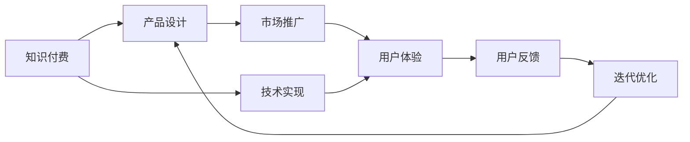

                 

# 知识经济时代下的知识付费创新产品上新策略

在知识经济时代，信息爆炸与知识付费成为推动社会进步的双引擎。然而，面对海量信息与不断增长的知识付费需求，如何设计出更加高效、便捷、有价值的知识付费产品，成为了各大平台和企业必须面对的挑战。本文将从创新产品设计、用户需求洞察、技术实现与优化等方面，系统探讨知识付费创新的产品上新策略。

## 1. 背景介绍

随着互联网的普及和移动互联网的飞速发展，知识付费逐渐成为人们获取知识、提升自我、满足职业发展需求的重要方式。根据《2021中国知识付费行业发展报告》，中国知识付费市场规模从2015年的15.2亿元增长到2020年的30.1亿元，年均复合增长率达到30.6%。同时，知识付费应用场景也逐渐多元化，从个人成长、技能培训、职场发展，到兴趣爱好、信息获取等领域，知识付费已经深入各行各业，成为信息时代的重要趋势。

## 2. 核心概念与联系

### 2.1 核心概念概述

要设计出高质量的知识付费产品，首先需要理解其核心概念与要素：

- **知识付费**：用户为获取知识、技能或信息而支付费用的行为。包括在线课程、电子书、专题讲座等多种形式。
- **产品设计**：从用户需求出发，将知识内容转化为易于获取、高效使用、有价值的知识产品。
- **技术实现**：采用先进的互联网技术，如大数据、云计算、AI等，提升产品性能和用户体验。
- **市场推广**：通过市场分析、用户调研、产品优化等手段，增加产品的知名度和市场占有率。
- **用户体验**：从用户的角度出发，提供易于使用、功能完善、界面美观的产品体验。

这些核心概念通过以下Mermaid流程图展现了它们之间的联系：



## 3. 核心算法原理 & 具体操作步骤

### 3.1 算法原理概述

知识付费产品的上新策略，可以从内容推荐、个性化学习路径设计、在线互动与反馈机制等多个维度进行优化。本文将重点探讨基于推荐系统的知识推荐算法和个性化学习路径的构建。

推荐系统是一种利用用户历史行为数据，预测用户偏好，并推荐相应内容的技术。常见的推荐算法包括基于协同过滤、基于内容的推荐、基于矩阵分解的推荐等。

### 3.2 算法步骤详解

以协同过滤推荐算法为例，其基本步骤包括：

1. **数据收集**：收集用户的历史行为数据，如浏览记录、购买记录、评分数据等。
2. **用户画像**：对用户进行特征提取和画像构建，以描述其兴趣偏好。
3. **相似度计算**：计算用户之间的相似度，通常采用余弦相似度、皮尔逊相关系数等方法。
4. **推荐生成**：根据相似度计算结果，生成推荐内容列表。

个性化学习路径的设计，则涉及用户行为数据的分析、学习目标的设定、学习进度跟踪等多个环节。以下是一个简化的步骤：

1. **用户需求分析**：通过问卷调查、行为数据分析等方式，了解用户的学习目标和兴趣偏好。
2. **学习路径规划**：根据用户需求，设计从基础知识到进阶技能的学习路径，包括内容难度、学习时长、推荐顺序等。
3. **学习进度跟踪**：利用学习管理系统，记录用户的学习进度，并根据其表现动态调整推荐内容。

### 3.3 算法优缺点

协同过滤推荐算法的优点在于能够捕捉用户间的隐式关联，且不需要显式的用户特征。缺点在于对新用户的推荐效果不佳，且容易产生数据稀疏性问题。

个性化学习路径的优点在于能够提供量身定制的学习体验，提升用户的学习效果。缺点在于需要大量数据进行训练，且难以处理复杂的学习需求。

### 3.4 算法应用领域

推荐系统和个性化学习路径设计的应用领域十分广泛，包括在线教育、电商推荐、内容聚合平台等。通过这些技术，平台可以大幅提升用户粘性，增加用户留存率，推动产品创新和收入增长。

## 4. 数学模型和公式 & 详细讲解 & 举例说明

### 4.1 数学模型构建

协同过滤推荐算法基于用户历史行为数据构建用户画像，并通过用户画像计算相似度。假设用户集为$U$，物品集为$I$，用户$u$与物品$i$的交互行为为$R_{ui}$。协同过滤推荐系统可以分为基于用户的协同过滤和基于物品的协同过滤。

基于用户的协同过滤模型可以表示为：
$$\hat{R}_{ui} = \sum_{v \in N(u)} \alpha_v R_{vi}$$
其中$N(u)$为用户$u$的邻居集，$\alpha_v$为权重系数。

基于物品的协同过滤模型可以表示为：
$$\hat{R}_{ui} = \sum_{j \in I} \alpha_j R_{uj}$$
其中$j$为物品$i$的邻居物品集，$\alpha_j$为权重系数。

### 4.2 公式推导过程

以基于用户的协同过滤算法为例，用户$u$和物品$i$之间的预测评分$\hat{R}_{ui}$可以通过以下公式计算：
$$\hat{R}_{ui} = \alpha_u \sum_{v \in N(u)} \frac{R_{vi}}{\sqrt{\sum_{j \in I} R_{vj}^2}} \cdot \frac{R_{uj}}{\sqrt{\sum_{j \in I} R_{uj}^2}}$$
其中$\alpha_u$为用户$u$的权重系数，$N(u)$为用户$u$的邻居集，$\sqrt{}$为归一化因子。

### 4.3 案例分析与讲解

以某在线教育平台为例，用户在观看某门课程后，系统会记录其行为数据。通过协同过滤算法，系统可以根据用户A的观看记录和邻居用户的观看记录，推荐用户A可能感兴趣的课程。例如，如果用户A喜欢观看数学类课程，而邻居用户B和C都偏爱物理类课程，系统可能会推荐用户A尝试物理类课程。

## 5. 项目实践：代码实例和详细解释说明

### 5.1 开发环境搭建

为了实现协同过滤推荐系统，需要以下开发环境：

1. Python 3.x
2. Pandas 用于数据处理
3. NumPy 用于数值计算
4. Scikit-learn 用于模型训练和评估
5. Elasticsearch 用于存储和检索用户行为数据

在Jupyter Notebook中，可以使用以下命令搭建环境：
```bash
conda create --name recsys python=3.8
conda activate recsys
pip install pandas numpy scikit-learn
```

### 5.2 源代码详细实现

以下是一个简单的协同过滤推荐系统的代码实现：

```python
import pandas as pd
import numpy as np
from scipy.sparse import csr_matrix

# 构建用户-物品交互矩阵
data = pd.read_csv('ratings.csv')
user_id = data['user_id']
item_id = data['item_id']
rating = data['rating']
user_id = np.array(user_id)
item_id = np.array(item_id)
rating = np.array(rating)
U = np.unique(user_id)
I = np.unique(item_id)
matrix = csr_matrix((rating, (user_id, item_id)), shape=(len(U), len(I)))

# 计算用户画像
user_means = np.mean(matrix, axis=1)
user_means = pd.Series(user_means, index=U)
user_means = user_means.to_dict()

# 计算相似度
user_similarity = np.dot(user_means.values, user_means.values)
np.fill_diagonal(user_similarity, 0)
user_similarity = pd.DataFrame(user_similarity, index=U, columns=U)

# 推荐生成
def recommend(user_id, top_n=10):
    user_index = U.index(user_id)
    neighbors = U[(user_similarity[user_index] > 0).nonzero()[0]]
    scores = user_means[neighbors]
    scores = scores - user_means[user_id]
    scores = np.dot(matrix.T.dot(scores), user_similarity[neighbors])
    recommendations = np.argsort(scores)[-top_n:]
    return list(I[recommendations])

# 测试推荐系统
recommendations = recommend('user_1', top_n=10)
print(recommendations)
```

### 5.3 代码解读与分析

**用户行为数据处理**：
- 通过pandas读取CSV文件，构建用户-物品交互矩阵。
- 使用NumPy计算每个用户的平均评分，构建用户画像。

**相似度计算**：
- 计算用户画像之间的相似度，构建用户相似度矩阵。

**推荐生成**：
- 对于指定用户，根据相似度矩阵计算邻居用户，并根据评分生成推荐列表。

**测试与输出**：
- 测试推荐系统，输出推荐的物品ID。

## 6. 实际应用场景

### 6.1 在线教育平台

在在线教育平台中，协同过滤推荐系统可以用于课程推荐、习题推荐、学习路径设计等。例如，某用户完成了数学基础课程，系统可以根据其学习行为推荐进阶的数学应用题和相关书籍，为其提供个性化的学习资源。

### 6.2 电子商务平台

电子商务平台可以利用协同过滤推荐系统，为用户推荐商品、服务、内容等。例如，某用户在浏览某本书籍后，系统可以根据其浏览记录和相似用户的行为数据，推荐类似书籍、作者的其他作品等。

### 6.3 内容聚合平台

内容聚合平台可以为用户提供个性化新闻、视频、文章等内容的推荐。例如，某用户喜欢阅读科技类文章，系统可以根据其历史阅读记录和相似用户的行为数据，推荐相关科技类文章、视频等。

### 6.4 未来应用展望

随着数据量的增加和算法的进步，推荐系统将更加智能和精准。未来的推荐系统可能会引入更多先验知识，如知识图谱、逻辑规则等，增强推荐内容的相关性和丰富性。同时，跨领域推荐和协同学习也会成为新的研究方向。

## 7. 工具和资源推荐

### 7.1 学习资源推荐

为了深入理解推荐系统，可以参考以下学习资源：

1. 《推荐系统实战》一书，全面介绍了推荐系统的设计与实现，涵盖协同过滤、基于内容的推荐、深度学习推荐等方法。
2. 《Python推荐系统》一书，详细讲解了使用Python实现推荐系统的步骤和方法。
3. 《推荐系统基础》课程，系统介绍了推荐系统的基本原理和应用场景。

### 7.2 开发工具推荐

为了开发和优化推荐系统，可以采用以下工具：

1. Elasticsearch，用于存储和检索用户行为数据。
2. Scikit-learn，用于构建和训练推荐模型。
3. TensorFlow，用于实现深度学习推荐系统。

### 7.3 相关论文推荐

推荐系统领域的研究论文众多，以下是几篇经典论文：

1. 《Netflix Prize: A Dataset with Recommendations and Performance》：Netflix公司发布的推荐系统竞赛，详细介绍了推荐系统的设计和方法。
2. 《Adaptive Collaborative Filtering using Matrix Factorization Techniques》：介绍了基于矩阵分解的推荐算法。
3. 《Deep Personalized Recommendation Using Transfer Learning》：探讨了深度学习在推荐系统中的应用。

## 8. 总结：未来发展趋势与挑战

### 8.1 研究成果总结

本文介绍了基于协同过滤的推荐系统和个性化学习路径设计的基本原理和实现方法，并通过代码实例进行了详细讲解。推荐系统的成功应用，不仅提升了用户粘性和留存率，还推动了知识付费产品的创新与发展。

### 8.2 未来发展趋势

未来的推荐系统将更加智能化、精准化和多样化。伴随大数据、深度学习、自然语言处理等技术的发展，推荐系统将能够更好地捕捉用户行为和需求，提供更加个性化和多样化的内容推荐。

### 8.3 面临的挑战

尽管推荐系统在知识付费产品上新中发挥了重要作用，但仍面临诸多挑战：

1. 数据隐私和安全问题。用户行为数据的隐私保护和系统安全性是推荐系统面临的重要挑战。
2. 冷启动问题。对于新用户，推荐系统难以提供有价值的推荐内容。
3. 多模态数据融合。将文本、图片、视频等多模态数据进行融合，提升推荐内容的丰富性。
4. 推荐系统的可解释性。如何提供推荐内容的解释和理由，增强用户的信任和满意度。

### 8.4 研究展望

未来的推荐系统研究需要从以下几个方向进行探索：

1. 多模态数据融合：将文本、图片、视频等多模态数据进行融合，提升推荐内容的丰富性和多样性。
2. 模型可解释性：研究如何提高推荐系统的可解释性，增强用户的信任和满意度。
3. 跨领域推荐：研究不同领域数据的推荐方法，推动推荐系统在更多场景中的应用。
4. 隐私保护和安全：加强用户数据的隐私保护和安全防护，提升系统的可信度和可靠性。

通过不断探索和优化，推荐系统将在知识付费领域发挥更大的作用，推动信息时代的进一步发展。

## 9. 附录：常见问题与解答

**Q1：推荐系统如何处理数据稀疏性问题？**

A: 推荐系统可以通过以下方法处理数据稀疏性问题：
1. 矩阵分解：将稀疏矩阵分解为低秩矩阵，减少计算复杂度。
2. 协同过滤：利用用户之间的隐式关联，推荐相似用户可能喜欢的物品。
3. 混合推荐：结合协同过滤和基于内容的推荐，提升推荐效果。

**Q2：推荐系统如何处理冷启动问题？**

A: 推荐系统可以通过以下方法处理冷启动问题：
1. 利用先验知识：引入领域知识或先验规则，增加推荐内容的相关性。
2. 利用用户行为：根据用户输入的兴趣点或搜索关键词，生成个性化推荐。
3. 利用用户反馈：收集用户的评分和反馈数据，动态调整推荐内容。

**Q3：推荐系统如何提高推荐效果？**

A: 推荐系统可以通过以下方法提高推荐效果：
1. 数据采集：收集更多用户行为数据，增加推荐系统的覆盖面。
2. 特征工程：进行有效的特征提取和构建，提升推荐内容的精准性。
3. 模型优化：选择合适的推荐算法和优化策略，增强推荐效果。

**Q4：推荐系统的可解释性如何提升？**

A: 推荐系统的可解释性可以通过以下方法提升：
1. 特征解释：提供推荐内容的特征和标签，增强用户对推荐内容的理解。
2. 结果解释：解释推荐算法的推理过程和决策依据，增强用户的信任感。
3. 交互界面：设计友好的交互界面，让用户能够容易地理解推荐结果。

通过不断优化和创新，推荐系统将为知识付费产品带来更加智能化和个性化的体验，推动信息时代的进一步发展。

---

作者：禅与计算机程序设计艺术 / Zen and the Art of Computer Programming

