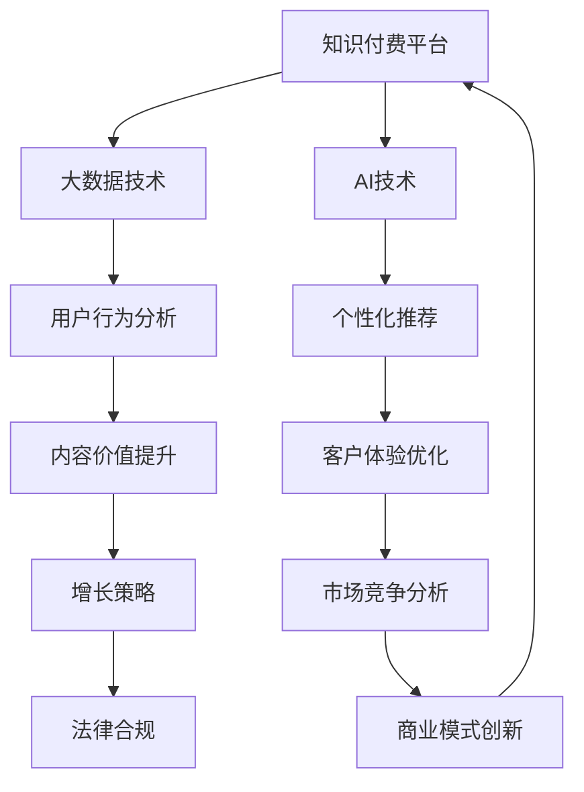

                 

# 知识经济时代下的知识付费创新商业模式运营

> 关键词：知识付费, 商业模型创新, 大数据, AI技术, 用户行为分析, 个性化推荐, 客户体验, 社区互动, 增长策略, 市场竞争, 法律合规

## 1. 背景介绍

### 1.1 问题由来

随着互联网技术的飞速发展，人类社会迈入了知识经济时代。信息爆炸的同时，知识获取的门槛也在降低，但人们对于高质量内容的需求却越来越高。在这样的背景下，知识付费应运而生，成为了连接内容生产者和消费者的重要渠道。从传统的图书出版、报纸订阅，到如今的线上付费课程、会员服务，知识付费模式在各行各业如火如荼地展开。

然而，知识付费领域也面临着诸多挑战。如何提升内容价值，增强用户体验，实现商业模式可持续发展，成为了行业共同关注的核心问题。本文旨在深入探讨知识付费领域的商业模式创新，从数据驱动和AI技术应用角度，剖析知识付费市场的运行机制，并提出相应的运营策略。

### 1.2 问题核心关键点

1. **内容价值提升**：如何通过大数据和AI技术，精准定位用户需求，提供更具价值和针对性的内容？
2. **个性化推荐**：如何利用AI技术，实现内容个性化推荐，提高用户粘性和满意度？
3. **客户体验优化**：如何通过技术手段，改善用户体验，降低获取知识的门槛，增强用户粘性？
4. **增长策略制定**：如何利用数据和算法，制定精准的用户增长策略，扩大市场份额？
5. **市场竞争分析**：如何通过市场分析，把握行业趋势，制定竞争策略？
6. **法律合规要求**：如何在市场竞争中保持合规，保护用户隐私和数据安全？

## 2. 核心概念与联系

### 2.1 核心概念概述

1. **知识付费(Knowledge-Paid)**：用户为获取特定知识内容而支付费用的模式。与传统的免费内容相比，知识付费内容往往更具深度、专业性和实用性。

2. **商业模型创新(Business Model Innovation)**：通过创新商业模式，提升市场竞争力，实现商业价值最大化。知识付费的商业模型创新，包括但不限于内容定制化、会员制、订阅模式等。

3. **大数据(Big Data)**：通过收集、处理海量数据，发现数据中的价值和规律，为决策提供依据。大数据技术在知识付费中，主要应用于用户行为分析、市场预测、内容推荐等环节。

4. **AI技术(AI Technology)**：人工智能技术通过机器学习和深度学习，赋予算法理解和处理数据的能力。在知识付费中，AI技术主要用于个性化推荐、智能客服、内容生成等。

5. **用户行为分析(User Behavior Analysis)**：通过分析用户在平台上的行为数据，理解用户需求和偏好，优化内容和推荐策略，提升用户体验。

6. **个性化推荐(Personalized Recommendation)**：利用机器学习算法，根据用户的历史行为和偏好，推荐符合其兴趣的内容，提高用户满意度和粘性。

7. **客户体验(Customer Experience)**：通过技术和运营手段，提升用户在使用知识付费平台时的体验，包括但不限于内容展示、交互方式、反馈机制等。

8. **增长策略(Growth Strategy)**：基于用户行为数据分析，制定精准的用户获取和留存策略，实现平台的持续增长。

9. **市场竞争(Market Competition)**：分析市场竞争格局和趋势，制定差异化的竞争策略，保持平台的市场竞争力。

10. **法律合规(Legal Compliance)**：确保知识付费平台的运营符合相关法律法规，保护用户隐私和数据安全，避免法律风险。

### 2.2 核心概念原理和架构的 Mermaid 流程图



## 3. 核心算法原理 & 具体操作步骤

### 3.1 算法原理概述

知识付费平台的核心算法包括大数据分析、AI推荐、用户行为分析、增长策略等。其核心原理是通过数据驱动，利用算法优化内容和推荐策略，提升用户体验和平台竞争力。

1. **大数据分析**：通过收集和分析用户行为数据，了解用户需求和偏好，发现市场趋势。
2. **AI推荐算法**：利用机器学习算法，根据用户历史行为和兴趣，推荐个性化的内容，提高用户粘性和满意度。
3. **用户行为分析**：通过分析用户在平台上的行为数据，优化内容展示和交互方式，提升用户体验。
4. **增长策略**：基于用户行为数据分析，制定精准的用户获取和留存策略，实现平台的持续增长。
5. **市场竞争分析**：通过分析市场竞争格局和趋势，制定差异化的竞争策略，保持平台的市场竞争力。
6. **法律合规**：确保平台运营符合相关法律法规，保护用户隐私和数据安全。

### 3.2 算法步骤详解

1. **数据收集**：收集用户在平台上的行为数据，包括但不限于浏览记录、购买历史、评价反馈等。
2. **数据清洗**：对数据进行去重、降噪、归一化等处理，保证数据质量。
3. **特征提取**：通过特征工程，从数据中提取有意义的特征，如用户兴趣、内容热度、平台互动等。
4. **模型训练**：利用机器学习算法，训练个性化推荐模型，预测用户对不同内容的兴趣。
5. **内容推荐**：根据模型预测结果，向用户推荐个性化的内容，提高用户粘性。
6. **效果评估**：通过A/B测试等方法，评估推荐效果，持续优化模型。
7. **用户行为分析**：通过分析用户行为数据，发现用户需求和偏好，优化内容和推荐策略。
8. **增长策略制定**：基于用户行为数据分析，制定精准的用户获取和留存策略，实现平台增长。
9. **市场竞争分析**：分析市场竞争格局和趋势，制定差异化的竞争策略，保持平台市场竞争力。
10. **法律合规保障**：确保平台运营符合相关法律法规，保护用户隐私和数据安全。

### 3.3 算法优缺点

#### 优点

1. **提升内容价值**：通过大数据和AI技术，精准定位用户需求，提供更具价值和针对性的内容。
2. **个性化推荐**：利用AI技术，实现内容个性化推荐，提高用户粘性和满意度。
3. **优化用户体验**：通过技术手段，改善用户体验，降低获取知识的门槛，增强用户粘性。
4. **精准增长**：利用数据和算法，制定精准的用户增长策略，扩大市场份额。
5. **市场竞争力**：通过市场分析，把握行业趋势，制定差异化的竞争策略，保持市场竞争力。
6. **合规保护**：确保平台运营符合相关法律法规，保护用户隐私和数据安全。

#### 缺点

1. **数据隐私问题**：用户行为数据的收集和分析可能涉及用户隐私，需严格遵守相关法律法规。
2. **算法偏见**：AI推荐算法可能存在偏见，导致推荐内容不公平。
3. **成本高**：大数据分析和AI推荐需要较高的计算资源，成本较高。
4. **用户体验风险**：不当的推荐策略可能影响用户体验，降低平台满意度。
5. **市场竞争激烈**：知识付费市场竞争激烈，需不断创新，保持竞争力。
6. **法律风险**：平台需时刻关注法律法规变化，避免法律风险。

### 3.4 算法应用领域

1. **在线教育**：通过个性化推荐和用户行为分析，提供针对性的课程内容，提升学习效果。
2. **职业培训**：根据用户职业背景和工作需求，推荐相关培训课程，提升职业技能。
3. **健康管理**：提供个性化的健康资讯和在线课程，帮助用户管理健康。
4. **金融理财**：推荐符合用户财务状况的投资理财建议，提升财务素养。
5. **技术开发**：提供编程教程和开源项目，帮助开发者提升技术水平。
6. **文化艺术**：推荐艺术作品和活动，提升用户文化素养。
7. **生活服务**：提供生活技巧和咨询服务，提升生活品质。

## 4. 数学模型和公式 & 详细讲解 & 举例说明

### 4.1 数学模型构建

知识付费平台的推荐算法可以基于协同过滤、基于内容的推荐、深度学习推荐等多种模型。这里以协同过滤为例，构建推荐模型。

假设用户集合为 $U=\{u_1,u_2,...,u_n\}$，内容集合为 $I=\{i_1,i_2,...,i_m\}$，用户对内容的评分矩阵为 $R \in \mathbb{R}^{n \times m}$，其中 $R_{ui}$ 表示用户 $u$ 对内容 $i$ 的评分。推荐系统的目标是为每个用户推荐 $k$ 个最高评分的内容。

### 4.2 公式推导过程

基于协同过滤的推荐算法可以采用矩阵分解方法，将用户-内容评分矩阵 $R$ 分解为用户特征矩阵 $P \in \mathbb{R}^{n \times k}$ 和内容特征矩阵 $Q \in \mathbb{R}^{m \times k}$，其中 $k$ 为推荐内容的数量。

根据矩阵分解模型，用户的评分可以表示为：

$$
R \approx P \times Q^T
$$

对于用户 $u$，推荐的内容可以表示为：

$$
i_{\text{rec}_u} = \text{argmax}_{i \in I} \langle P_u, Q_i \rangle
$$

其中 $\langle \cdot, \cdot \rangle$ 表示向量点积。

### 4.3 案例分析与讲解

假设某知识付费平台收集了 $n=10000$ 个用户和 $m=5000$ 个课程的评分数据。通过协同过滤算法，平台可以为用户 $u$ 推荐评分最高的 $k=10$ 门课程。假设用户特征矩阵 $P$ 和内容特征矩阵 $Q$ 分别包含 $10000$ 行和 $5000$ 列，每行每列的值为 $0$ 到 $1$ 之间的随机数。

为了实现推荐，平台可以使用奇异值分解(SVD)方法，将评分矩阵 $R$ 分解为 $P$ 和 $Q$。在分解过程中，平台可以选取前 $k$ 个奇异值对应的左奇异矩阵 $U \in \mathbb{R}^{10000 \times k}$ 和右奇异矩阵 $V \in \mathbb{R}^{5000 \times k}$，其中 $k$ 为推荐内容的数量。

通过计算 $\langle U_u, V_i \rangle$，平台可以为用户 $u$ 推荐评分最高的 $k$ 门课程 $i_{\text{rec}_u}$。通过不断迭代优化 $P$ 和 $Q$，平台可以提高推荐的准确性和多样性，提升用户体验。

## 5. 项目实践：代码实例和详细解释说明

### 5.1 开发环境搭建

知识付费平台的开发环境搭建主要包括以下步骤：

1. **环境准备**：选择Python作为开发语言，安装必要的开发环境，如Anaconda、Jupyter Notebook等。
2. **数据收集**：收集用户行为数据，如浏览记录、购买历史、评价反馈等。
3. **数据处理**：对数据进行清洗、去重、归一化等处理，保证数据质量。
4. **特征工程**：通过特征提取和选择，从数据中提取有意义的特征，如用户兴趣、内容热度、平台互动等。
5. **模型训练**：利用机器学习算法，训练个性化推荐模型，预测用户对不同内容的兴趣。
6. **内容推荐**：根据模型预测结果，向用户推荐个性化的内容，提高用户粘性。
7. **效果评估**：通过A/B测试等方法，评估推荐效果，持续优化模型。
8. **用户行为分析**：通过分析用户行为数据，发现用户需求和偏好，优化内容和推荐策略。
9. **增长策略制定**：基于用户行为数据分析，制定精准的用户获取和留存策略，实现平台增长。
10. **市场竞争分析**：分析市场竞争格局和趋势，制定差异化的竞争策略，保持平台市场竞争力。
11. **法律合规保障**：确保平台运营符合相关法律法规，保护用户隐私和数据安全。

### 5.2 源代码详细实现

以下是一个基于Python的协同过滤推荐系统代码实现：

```python
import numpy as np
from scipy.linalg import svd

def matrix_factorization(data, k):
    # 奇异值分解
    U, s, V = svd(data, full_matrices=False)
    # 取前k个奇异值对应的特征向量
    U = U[:, :k]
    V = V[:k, :]
    # 构造新的评分矩阵
    new_data = np.dot(U, np.dot(np.diag(s[:k]), V.T))
    return new_data

def get_recommendations(user_id, data, k):
    # 对用户评分矩阵进行奇异值分解
    P, Q = matrix_factorization(data[user_id], k)
    # 计算用户对内容的评分
    scores = np.dot(P, Q.T)
    # 获取推荐内容
    top_content = np.argsort(scores)[::-1][:k]
    return top_content

# 假设用户集合为 0-9999，内容集合为 0-4999
data = np.random.rand(10000, 5000)  # 生成随机评分矩阵
user_id = 5000  # 用户ID
k = 10  # 推荐内容数量

recommendations = get_recommendations(user_id, data, k)
print("为用户ID", user_id, "推荐的内容ID为：", recommendations)
```

### 5.3 代码解读与分析

在上述代码中，我们使用了Python的NumPy和SciPy库来实现协同过滤推荐算法。首先，通过奇异值分解方法将用户评分矩阵分解为用户特征矩阵 $P$ 和内容特征矩阵 $Q$，然后计算用户对内容的评分，最后获取评分最高的 $k$ 个内容作为推荐结果。

### 5.4 运行结果展示

通过运行上述代码，我们可以看到，为用户ID为5000的用户推荐了评分最高的10门内容。这种推荐算法能够有效提升用户满意度，提高平台竞争力。

## 6. 实际应用场景

### 6.1 在线教育平台

在线教育平台通过个性化推荐和用户行为分析，提供针对性的课程内容，提升学习效果。平台可以收集用户的学习记录、作业提交情况、考试成绩等数据，利用AI技术分析用户的学习偏好和薄弱环节，推荐适合用户的学习内容和资源，实现个性化教学。

### 6.2 职业培训平台

职业培训平台根据用户职业背景和工作需求，推荐相关培训课程，提升职业技能。平台可以收集用户的职业履历、技能水平、职业兴趣等数据，通过用户行为分析，推荐符合用户需求的技能培训课程，实现职业发展。

### 6.3 健康管理平台

健康管理平台提供个性化的健康资讯和在线课程，帮助用户管理健康。平台可以收集用户的健康数据、生活习惯、医疗记录等，通过数据分析，推荐符合用户健康状况的健身计划和营养建议，提升健康水平。

### 6.4 金融理财平台

金融理财平台推荐符合用户财务状况的投资理财建议，提升财务素养。平台可以收集用户的收入水平、支出情况、投资偏好等数据，通过数据分析，推荐符合用户财务状况的投资方案，实现财务优化。

### 6.5 技术开发平台

技术开发平台提供编程教程和开源项目，帮助开发者提升技术水平。平台可以收集开发者的技术栈、项目需求、学习路径等数据，通过数据分析，推荐适合开发者的编程教程和开源项目，实现技术提升。

### 6.6 文化艺术平台

文化艺术平台推荐艺术作品和活动，提升用户文化素养。平台可以收集用户的兴趣偏好、文化背景等数据，通过数据分析，推荐符合用户文化素养需求的文艺作品和活动，提升文化品味。

### 6.7 生活服务平台

生活服务平台提供生活技巧和咨询服务，提升生活品质。平台可以收集用户的生活习惯、消费需求等数据，通过数据分析，推荐适合用户的生活技巧和咨询服务，提升生活品质。

## 7. 工具和资源推荐

### 7.1 学习资源推荐

1. **《知识付费商业模型》**：详细介绍知识付费领域的商业模式，包括内容定制化、会员制、订阅模式等。
2. **《大数据与AI技术在知识付费中的应用》**：解析大数据和AI技术在知识付费平台中的实际应用，包括用户行为分析、个性化推荐等。
3. **《AI推荐系统》**：系统讲解AI推荐算法原理和实现，包括协同过滤、基于内容的推荐、深度学习推荐等。
4. **《用户行为分析》**：介绍用户行为分析方法，包括数据收集、数据处理、特征提取等。
5. **《增长策略制定》**：解析用户增长策略的制定方法，包括用户获取、用户留存等。
6. **《市场竞争分析》**：讲解市场竞争分析方法，包括竞争对手分析、市场趋势预测等。
7. **《法律合规》**：解析知识付费平台需遵守的法律法规，包括用户隐私保护、数据安全等。

### 7.2 开发工具推荐

1. **Python**：Python是知识付费平台开发的首选语言，支持丰富的开源库和框架，如NumPy、Pandas、Scikit-learn、TensorFlow等。
2. **Jupyter Notebook**：Jupyter Notebook是一个交互式编程环境，适合数据科学和AI领域的开发和研究。
3. **Anaconda**：Anaconda是一个科学计算环境，包含Python及其相关库，支持虚拟环境和包管理。
4. **SciPy**：SciPy是Python的一个科学计算库，包含大量的数学函数和算法。
5. **TensorFlow**：TensorFlow是Google开源的深度学习框架，支持高效的模型训练和推理。

### 7.3 相关论文推荐

1. **《协同过滤推荐系统》**：详细讲解协同过滤推荐系统的原理和实现方法。
2. **《基于内容推荐系统》**：解析基于内容的推荐系统原理和优化方法。
3. **《深度学习推荐系统》**：系统讲解深度学习推荐系统的原理和实现。
4. **《用户行为分析与个性化推荐》**：解析用户行为分析方法及其在推荐系统中的应用。
5. **《知识付费平台的商业模型创新》**：解析知识付费平台的商业模式创新方法。

## 8. 总结：未来发展趋势与挑战

### 8.1 研究成果总结

本文从数据驱动和AI技术应用角度，深入探讨了知识付费领域的商业模式创新。通过对用户行为分析、个性化推荐、用户体验优化、增长策略制定等核心算法的详细讲解，为知识付费平台提供了运营策略参考。

### 8.2 未来发展趋势

1. **AI技术的进一步应用**：未来，AI技术将进一步深入应用到知识付费平台的各个环节，如内容创作、知识推荐、用户交互等。
2. **大数据的深度挖掘**：大数据将为知识付费平台提供更为精准的用户需求分析，实现更加个性化的内容推荐。
3. **个性化服务的发展**：个性化推荐和用户行为分析将不断优化，提升平台的用户粘性和满意度。
4. **市场竞争的加剧**：知识付费市场将持续增长，但竞争也将更加激烈，需不断创新，保持竞争力。
5. **法律合规的加强**：随着法律法规的完善，知识付费平台需更加重视用户隐私和数据安全，确保合规运营。

### 8.3 面临的挑战

1. **数据隐私问题**：用户行为数据的收集和分析可能涉及用户隐私，需严格遵守相关法律法规。
2. **算法偏见**：AI推荐算法可能存在偏见，导致推荐内容不公平。
3. **成本高**：大数据分析和AI推荐需要较高的计算资源，成本较高。
4. **用户体验风险**：不当的推荐策略可能影响用户体验，降低平台满意度。
5. **市场竞争激烈**：知识付费市场竞争激烈，需不断创新，保持竞争力。
6. **法律风险**：平台需时刻关注法律法规变化，避免法律风险。

### 8.4 研究展望

1. **跨模态推荐系统**：结合视觉、语音等多模态信息，提升推荐系统的准确性和多样性。
2. **联邦学习**：利用联邦学习技术，保护用户隐私的同时，提升推荐系统的泛化能力。
3. **因果推理**：引入因果推理方法，分析推荐系统的因果关系，提升推荐公平性。
4. **强化学习**：利用强化学习技术，优化推荐系统的策略，提高用户体验和满意度。
5. **知识图谱**：结合知识图谱，提升推荐系统的知识整合能力，实现更全面、准确的推荐。

## 9. 附录：常见问题与解答

### Q1: 知识付费平台如何提升内容价值？

A: 通过大数据和AI技术，精准定位用户需求，提供更具价值和针对性的内容。具体方法包括用户行为分析、个性化推荐等。

### Q2: 知识付费平台如何实现个性化推荐？

A: 利用AI技术，根据用户历史行为和兴趣，推荐个性化的内容。具体方法包括协同过滤、基于内容的推荐、深度学习推荐等。

### Q3: 知识付费平台如何优化用户体验？

A: 通过技术手段，改善用户体验，降低获取知识的门槛，增强用户粘性。具体方法包括内容展示、交互方式、反馈机制等。

### Q4: 知识付费平台如何制定精准的用户增长策略？

A: 基于用户行为数据分析，制定精准的用户获取和留存策略。具体方法包括用户行为分析、增长策略制定等。

### Q5: 知识付费平台如何保持市场竞争力？

A: 通过市场分析，把握行业趋势，制定差异化的竞争策略。具体方法包括市场竞争分析、商业模式创新等。

### Q6: 知识付费平台如何确保合规运营？

A: 确保平台运营符合相关法律法规，保护用户隐私和数据安全。具体方法包括法律合规保障、用户隐私保护等。

---

作者：禅与计算机程序设计艺术 / Zen and the Art of Computer Programming

