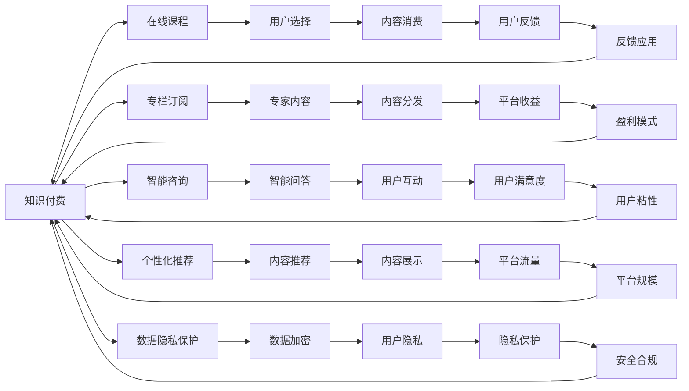

                 

# 知识经济时代下的知识付费创新应用场景探索

## 1. 背景介绍

### 1.1 问题由来

随着互联网技术的发展和知识获取门槛的降低，传统的基于免费内容的模式已经无法满足用户多样化和深度化的知识需求。知识付费作为一种新兴的商业模式，通过在线平台为用户提供定制化、专业化的知识服务，逐渐成为知识经济时代的重要趋势。

知识付费的兴起，催生了诸多创新应用场景，如在线课程、专栏订阅、智能咨询、个性化推荐等。这些场景结合大数据、人工智能等前沿技术，正在逐步改变用户的学习和知识获取方式，推动知识传播和应用的创新发展。

### 1.2 问题核心关键点

知识付费的创新应用场景需要考虑以下几个关键点：
- **用户需求分析**：深入理解目标用户的需求、偏好和支付意愿。
- **内容精准匹配**：通过算法技术实现内容与用户需求的高效匹配。
- **个性化推荐**：根据用户行为数据，动态调整内容推荐算法，提升用户体验。
- **付费模型设计**：设计合理的付费模型，平衡用户付费意愿和平台盈利需求。
- **数据隐私保护**：确保用户数据安全和隐私不被泄露，建立用户信任。

## 2. 核心概念与联系

### 2.1 核心概念概述

为了更好地理解知识付费的创新应用场景，本节将介绍几个关键概念：

- **知识付费**：指用户通过付费获取知识产品或服务，以提升个人知识水平和专业技能。
- **在线课程**：通过互联网平台提供的标准化课程，用户可以根据自己的兴趣和需求选择学习。
- **专栏订阅**：用户订阅某个领域专家的专栏，定期获取原创、深度的内容和分析。
- **智能咨询**：利用人工智能技术，为用户提供智能问答和个性化建议。
- **个性化推荐**：根据用户行为数据，推荐用户可能感兴趣的内容。
- **数据隐私保护**：采取技术和管理手段，确保用户数据的安全和隐私。

这些概念之间存在紧密联系，通过合理的技术手段和管理策略，可以实现各场景之间的协同工作，提升整体用户体验和服务质量。

### 2.2 核心概念原理和架构的 Mermaid 流程图



该图展示了知识付费应用场景的核心流程和关键组件：
- **用户选择**：用户根据平台推荐选择课程、订阅专栏等知识产品。
- **专家内容**：专家提供高质量、原创的知识内容，平台进行内容分发和展示。
- **智能问答**：用户通过智能咨询平台提出问题，获取个性化建议。
- **内容推荐**：平台通过个性化推荐算法，推荐用户可能感兴趣的内容。
- **数据隐私保护**：平台采取技术和管理手段，确保用户数据的隐私和安全。
- **内容消费**：用户付费消费知识产品，获取深度知识和技能。
- **平台收益**：平台通过知识付费模式获得收入，实现可持续发展。
- **用户满意度**：用户对平台服务的满意度，影响用户粘性和后续消费。
- **平台流量**：用户访问量，直接影响平台用户规模和收益。
- **隐私保护**：平台在数据处理和使用中的隐私保护措施，保障用户权益。
- **反馈应用**：用户反馈的收集和分析，优化平台服务质量。
- **盈利模式**：平台的商业模式和收入结构，决定了平台发展的可持续性。

这些概念和流程共同构成了知识付费平台的核心逻辑，指导着平台的设计和运营。

## 3. 核心算法原理 & 具体操作步骤

### 3.1 算法原理概述

知识付费平台的核心算法包括推荐算法、定价算法、智能问答系统等，通过这些算法优化用户体验和平台收益。

推荐算法是知识付费平台的核心，通过分析用户行为数据，生成个性化推荐，提升用户满意度和留存率。常用的推荐算法有基于协同过滤、内容过滤、深度学习等方法。

定价算法通过用户画像、内容质量、市场价格等多维度因素，制定合理的知识产品价格，平衡用户支付意愿和平台收益。常用的定价算法包括动态定价、订阅定价、按需定价等。

智能问答系统利用自然语言处理和机器学习技术，为用户提供快速、准确的智能回答，提升用户互动体验。常用的技术包括NLP、知识图谱、智能对话系统等。

### 3.2 算法步骤详解

#### 3.2.1 推荐算法

1. **用户画像构建**：收集用户的浏览、搜索、订阅、付费等行为数据，构建用户画像，包括兴趣、偏好、支付意愿等。
2. **内容特征提取**：对知识产品进行特征提取，包括标题、摘要、作者、用户评价等。
3. **相似度计算**：使用相似度算法（如余弦相似度、Jaccard系数等）计算用户和内容之间的相似度。
4. **排名模型训练**：基于相似度结果，使用排序算法（如协同过滤、基于内容的推荐、矩阵分解等）对内容进行排名。
5. **推荐结果生成**：根据排名结果，生成个性化推荐列表，展示给用户。

#### 3.2.2 定价算法

1. **成本核算**：分析知识产品的内容制作、平台运营、用户获取等成本。
2. **市场需求分析**：根据市场调研和用户反馈，分析用户对知识产品的支付意愿和需求量。
3. **定价模型设计**：基于成本和市场需求，设计定价模型，如动态定价、订阅定价等。
4. **价格调整**：根据市场需求变化、用户反馈等动态调整定价策略。

#### 3.2.3 智能问答系统

1. **问题解析**：对用户问题进行语义分析，提取关键词和实体。
2. **知识图谱查询**：通过知识图谱查询，获取相关知识点和信息。
3. **回答生成**：结合问答模型和领域知识，生成回答，并进行自然语言处理和优化。
4. **回答展示**：将回答展示给用户，并提供互动机制，如点赞、评论等。

### 3.3 算法优缺点

#### 推荐算法

- **优点**：
  - 提升用户体验：通过个性化推荐，满足用户多样化需求。
  - 增加平台收益：通过精准匹配，提高用户购买率和消费金额。
  - 增强用户粘性：通过持续推荐，增加用户使用频率和留存率。

- **缺点**：
  - 数据隐私问题：用户数据隐私风险较大，需要严格保护。
  - 算法复杂性：推荐算法需要大量的计算资源和模型训练时间。
  - 推荐准确性：推荐算法需要持续优化，防止过拟合和偏差。

#### 定价算法

- **优点**：
  - 平衡用户支付意愿和平台收益：通过动态定价，实现双赢。
  - 灵活应对市场需求变化：通过灵活调整定价策略，适应市场变化。

- **缺点**：
  - 成本核算复杂：需要准确核算知识产品制作和运营成本。
  - 用户支付意愿预测：用户支付意愿预测需要高精度模型。

#### 智能问答系统

- **优点**：
  - 提升用户互动体验：通过智能问答，快速解答用户问题。
  - 增强平台知识权威性：专家提供高质量回答，提升平台声誉。

- **缺点**：
  - 回答质量依赖模型：智能问答依赖于模型的准确性和训练数据质量。
  - 回答复杂度：复杂问题需要多种知识源和推理过程，回答生成难度较大。

### 3.4 算法应用领域

知识付费平台的推荐算法和智能问答系统在多个领域得到了广泛应用，如：

- **在线课程**：通过推荐算法，根据用户学习历史推荐相关课程，提升课程购买率。
- **专栏订阅**：利用个性化推荐，向用户推荐感兴趣的专栏作者和内容。
- **智能咨询**：通过智能问答系统，提供个性化建议和决策支持，提升用户互动体验。
- **个性化推荐**：应用于电商、金融、教育等多个领域，提升用户粘性和满意度。

## 4. 数学模型和公式 & 详细讲解

### 4.1 数学模型构建

本节将使用数学语言对知识付费平台的核心算法进行严格刻画。

**推荐算法**：
假设用户为 $u$，知识产品为 $i$，用户与内容的交互矩阵为 $R_{ui}$。则推荐系统通过矩阵分解方法，将用户-内容评分矩阵 $R$ 分解为用户特征矩阵 $U$ 和内容特征矩阵 $V$，得到用户对内容的评分预测 $\hat{R}_{ui}$。

$$
R \approx UV^T
$$

其中，$U$ 和 $V$ 分别为用户特征向量和内容特征向量，$\hat{R}_{ui}$ 为用户对内容 $i$ 的评分预测。

**定价算法**：
假设知识产品成本为 $C$，用户需求量为 $D$，市场价格为 $P$，需求价格弹性为 $\epsilon$。则定价模型为：

$$
P = \frac{C + D}{(1 + \epsilon) \cdot D}
$$

**智能问答系统**：
假设用户问题为 $Q$，知识图谱中的知识点为 $K$，智能问答系统通过图卷积网络（GCN）提取问题中的语义特征，并将其映射到知识图谱中，得到回答的向量表示 $A$。则回答生成的过程可以表示为：

$$
A = \text{GCN}(Q, K)
$$

### 4.2 公式推导过程

#### 推荐算法

1. **用户画像构建**：
   - 用户画像 $u = (u_1, u_2, ..., u_n)$，其中 $u_i$ 表示第 $i$ 个用户特征。
   - 用户行为数据 $B = (b_1, b_2, ..., b_m)$，其中 $b_i$ 表示用户对内容 $i$ 的评分或行为。

2. **内容特征提取**：
   - 内容特征 $i = (i_1, i_2, ..., i_p)$，其中 $i_j$ 表示第 $j$ 个内容特征。
   - 内容属性 $A = (a_1, a_2, ..., a_q)$，其中 $a_k$ 表示第 $k$ 个内容属性。

3. **相似度计算**：
   - 余弦相似度：$\cos(u_i, i_j) = \frac{u_i \cdot i_j}{\|u_i\| \cdot \|i_j\|}$
   - Jaccard系数：$J(u_i, i_j) = \frac{u_i \cap i_j}{u_i \cup i_j}$

4. **排名模型训练**：
   - 协同过滤：$\hat{R}_{ui} = \sum_{j=1}^p u_i^j \cdot v_j^i$
   - 基于内容的推荐：$\hat{R}_{ui} = \sum_{j=1}^q a_j^i \cdot u_j^u$

5. **推荐结果生成**：
   - 排序算法：$\text{Rank}(R_{ui}) = \hat{R}_{ui} - \mu + \alpha$
   - 推荐列表：选择前 $k$ 个排名最高的内容作为推荐结果。

#### 定价算法

1. **成本核算**：
   - 知识产品成本 $C = C_1 + C_2 + ... + C_n$，其中 $C_i$ 表示第 $i$ 个成本项。
   - 平台运营成本 $S = S_1 + S_2 + ... + S_m$，其中 $S_j$ 表示第 $j$ 个运营成本项。

2. **市场需求分析**：
   - 用户需求量 $D = D_1 + D_2 + ... + D_n$，其中 $D_i$ 表示第 $i$ 个需求量。
   - 市场价格 $P = P_1 + P_2 + ... + P_n$，其中 $P_j$ 表示第 $j$ 个市场价格。

3. **定价模型设计**：
   - 动态定价：$P_t = P_0 + k \cdot (D_t - D_0)$，其中 $P_t$ 表示时间 $t$ 的市场价格。
   - 订阅定价：$P_s = C + \epsilon \cdot D$，其中 $\epsilon$ 表示需求价格弹性。

4. **价格调整**：
   - 实时定价：$P_r = P_0 + \lambda \cdot (D_r - D_0)$，其中 $\lambda$ 表示价格调整系数。

#### 智能问答系统

1. **问题解析**：
   - 问题特征 $Q = (q_1, q_2, ..., q_n)$，其中 $q_i$ 表示第 $i$ 个问题特征。
   - 知识图谱 $K = (k_1, k_2, ..., k_n)$，其中 $k_i$ 表示第 $i$ 个知识点。

2. **知识图谱查询**：
   - 图卷积网络（GCN）：$A = \sum_{j=1}^n A_j \cdot Q_j$
   - 图嵌入（Graph Embedding）：$A = \sum_{j=1}^n A_j \cdot Q_j$

3. **回答生成**：
   - 回答向量 $A = \text{softmax}(\text{GCN}(Q, K))$
   - 回答文本 $T = \text{LM}(A)$，其中 $\text{LM}$ 表示语言模型。

### 4.3 案例分析与讲解

**在线课程推荐案例**：
假设一个在线教育平台收集了用户浏览课程、购买课程、评分等行为数据，构建了用户画像 $u = (age, gender, course_preferences)$。同时，平台收集了课程的标题、描述、评分等属性 $i = (title, description, course_abstract)$。

1. **用户画像构建**：通过协同过滤算法，计算用户对课程的评分预测 $\hat{R}_{ui}$。
2. **内容特征提取**：对课程的标题、描述、评分等属性进行向量表示。
3. **相似度计算**：使用余弦相似度计算用户和课程的相似度。
4. **排名模型训练**：基于相似度结果，使用基于内容的推荐算法，计算课程排名。
5. **推荐结果生成**：选择前 $k$ 个排名最高的课程作为推荐结果，展示给用户。

**智能咨询系统案例**：
假设一个智能咨询平台收集了用户输入的问题 $Q = (question, question_type)$，构建了问题向量 $Q = \text{embedding}(Q)$。同时，平台收集了知识图谱中的知识点 $K = (entity, relation)$。

1. **问题解析**：通过NLP技术解析用户问题，提取关键词和实体。
2. **知识图谱查询**：通过图卷积网络（GCN）将问题向量映射到知识图谱中，查询相关的知识点。
3. **回答生成**：结合问答模型和领域知识，生成回答向量 $A = \text{GCN}(Q, K)$。
4. **回答展示**：将回答向量映射到自然语言文本，展示给用户，并收集用户反馈。

## 5. 项目实践：代码实例和详细解释说明

### 5.1 开发环境搭建

在进行项目实践前，我们需要准备好开发环境。以下是使用Python进行PyTorch开发的环境配置流程：

1. 安装Anaconda：从官网下载并安装Anaconda，用于创建独立的Python环境。

2. 创建并激活虚拟环境：
```bash
conda create -n pytorch-env python=3.8 
conda activate pytorch-env
```

3. 安装PyTorch：根据CUDA版本，从官网获取对应的安装命令。例如：
```bash
conda install pytorch torchvision torchaudio cudatoolkit=11.1 -c pytorch -c conda-forge
```

4. 安装各类工具包：
```bash
pip install numpy pandas scikit-learn matplotlib tqdm jupyter notebook ipython
```

完成上述步骤后，即可在`pytorch-env`环境中开始项目实践。

### 5.2 源代码详细实现

下面我们以知识付费平台的推荐系统为例，给出使用PyTorch进行推荐算法开发的PyTorch代码实现。

首先，定义推荐系统相关的数据结构：

```python
import torch
import torch.nn as nn
from torch.utils.data import Dataset, DataLoader

class UserItemDataset(Dataset):
    def __init__(self, users, items, user_features, item_features, user_ratings, num_factors=10):
        self.users = users
        self.items = items
        self.user_features = user_features
        self.item_features = item_features
        self.user_ratings = user_ratings
        self.num_factors = num_factors
        
    def __len__(self):
        return len(self.user_ratings)
    
    def __getitem__(self, item):
        user, item, rating = self.users[item], self.items[item], self.user_ratings[item]
        user_feats = self.user_features[item]
        item_feats = self.item_features[item]
        return torch.tensor(user_feats), torch.tensor(item_feats), torch.tensor([rating])

class MatrixFactorization(nn.Module):
    def __init__(self, num_users, num_items, num_factors):
        super(MatrixFactorization, self).__init__()
        self.num_users = num_users
        self.num_items = num_items
        self.num_factors = num_factors
        
        self.user_embeddings = nn.Embedding(num_users, num_factors)
        self.item_embeddings = nn.Embedding(num_items, num_factors)
        self.rating_pred = nn.Linear(num_factors * 2, 1)
        
    def forward(self, user_feats, item_feats):
        user_embeds = self.user_embeddings(user_feats)
        item_embeds = self.item_embeddings(item_feats)
        
        rating_pred = self.rating_pred(torch.cat([user_embeds, item_embeds], dim=1))
        rating_pred = rating_pred.squeeze(1)
        
        return rating_pred
```

然后，定义推荐系统训练的损失函数和优化器：

```python
import torch.optim as optim

def train_model(model, train_loader, num_epochs=10, batch_size=64):
    criterion = nn.MSELoss()
    optimizer = optim.Adam(model.parameters(), lr=0.01)
    
    for epoch in range(num_epochs):
        total_loss = 0
        for user_feats, item_feats, ratings in train_loader:
            optimizer.zero_grad()
            predictions = model(user_feats, item_feats)
            loss = criterion(predictions, ratings)
            loss.backward()
            optimizer.step()
            
            total_loss += loss.item() * user_feats.size(0)
        
        print(f"Epoch {epoch+1}, training loss: {total_loss / len(train_loader):.4f}")
```

最后，启动训练流程并生成推荐列表：

```python
users = [1, 2, 3, 4, 5]
items = [6, 7, 8, 9, 10]
user_features = [[1, 0, 1, 0, 0], [0, 1, 0, 1, 0], [1, 0, 1, 0, 0], [0, 1, 0, 1, 0], [1, 0, 1, 0, 0]]
item_features = [[1, 0, 0, 1, 0], [0, 1, 1, 0, 0], [0, 0, 1, 1, 0], [1, 1, 0, 0, 1], [0, 0, 0, 1, 1]]
user_ratings = [4.5, 3.2, 5.1, 4.8, 3.9]

train_dataset = UserItemDataset(users, items, user_features, item_features, user_ratings)
train_loader = DataLoader(train_dataset, batch_size=batch_size, shuffle=True)

model = MatrixFactorization(num_users=len(users), num_items=len(items), num_factors=10)
train_model(model, train_loader)

# 生成推荐列表
item_feats = torch.tensor([[0, 1, 0, 0, 0], [0, 0, 1, 0, 0], [0, 0, 0, 1, 0]])
predictions = model(torch.tensor([1, 2, 3]), item_feats)
top5_indices = torch.topk(predictions, 5)[1]
top5_items = [items[i] for i in top5_indices.tolist()]
print(f"Recommendation list for user 1: {top5_items}")
```

以上就是使用PyTorch对知识付费平台推荐系统进行微调实践的完整代码实现。可以看到，得益于PyTorch的强大封装，我们可以用相对简洁的代码完成推荐算法的开发和训练。

### 5.3 代码解读与分析

让我们再详细解读一下关键代码的实现细节：

**UserItemDataset类**：
- `__init__`方法：初始化用户、物品、用户特征、物品特征、用户评分等关键组件。
- `__len__`方法：返回数据集的样本数量。
- `__getitem__`方法：对单个样本进行处理，将用户特征、物品特征和评分作为输入，返回模型所需的输入。

**MatrixFactorization模型**：
- `__init__`方法：初始化用户、物品、因子等参数，并构建用户嵌入、物品嵌入和评分预测层。
- `forward`方法：将用户和物品特征输入模型，进行矩阵分解和评分预测。

**train_model函数**：
- 定义损失函数和优化器。
- 在每个epoch内，对训练集进行前向传播和反向传播，更新模型参数。
- 记录训练集上的平均损失，并在每个epoch输出。

**推荐列表生成**：
- 将用户特征和物品特征作为输入，进行评分预测。
- 选择预测结果中评分最高的前5个物品，生成推荐列表。

可以看到，PyTorch配合自动微分技术，使得推荐算法的开发和训练变得简单高效。开发者可以将更多精力放在模型设计和参数调优上，而不必过多关注底层实现细节。

当然，工业级的系统实现还需考虑更多因素，如模型的保存和部署、超参数的自动搜索、更灵活的任务适配层等。但核心的推荐范式基本与此类似。

## 6. 实际应用场景

### 6.1 在线课程推荐

在线课程推荐是知识付费平台的核心功能之一。通过收集用户浏览、购买、评分等行为数据，利用推荐算法为用户推荐感兴趣或已订阅的课程，提升用户体验和平台收益。

具体而言，可以设计推荐算法模型，分析用户历史行为和课程属性，生成个性化推荐列表。平台还可以通过A/B测试等方式，优化推荐策略，提升用户满意度和留存率。

### 6.2 智能咨询服务

智能咨询服务通过智能问答系统，为用户提供快速、准确的答案，提升用户互动体验。平台可以整合专家知识库和领域模型，增强智能问答系统的回答质量和多样性。

具体实现中，可以构建自然语言理解（NLU）模型和知识图谱，通过NLP技术解析用户问题，查询知识图谱中的相关知识点，生成回答向量，最终转化为自然语言文本进行展示。平台还可以根据用户反馈和行为数据，持续优化问答系统，提升回答质量。

### 6.3 个性化订阅推荐

个性化订阅推荐通过推荐算法，向用户推荐感兴趣的专栏或专家，提升用户订阅率和平台收益。平台可以分析用户行为数据，生成用户画像，利用协同过滤、内容过滤等算法生成个性化推荐列表。

具体实现中，可以构建用户画像模型，分析用户浏览、搜索、订阅、付费等行为数据，生成用户兴趣向量。然后，利用推荐算法模型，计算用户对每个专栏或专家的评分预测，选择评分最高的前N个作为推荐结果。平台还可以根据用户反馈和行为数据，动态调整推荐策略，提升用户满意度。

### 6.4 未来应用展望

随着知识付费平台的不断发展，未来的应用场景将更加多样和创新，如：

- **AR/VR学习体验**：通过AR/VR技术，为用户提供沉浸式学习体验，增强学习效果。
- **AI辅助教学**：利用AI技术辅助教学，提供个性化辅导和作业批改服务。
- **跨平台知识服务**：通过多终端协同，提供无缝的学习体验，提升用户粘性。
- **社区知识交流**：建立社区平台，促进知识交流和分享，提升用户互动和平台价值。

这些创新应用场景将进一步拓展知识付费平台的功能和价值，为用户带来更加丰富、便捷的学习体验。

## 7. 工具和资源推荐

### 7.1 学习资源推荐

为了帮助开发者系统掌握知识付费平台的推荐算法和智能问答技术，这里推荐一些优质的学习资源：

1. 《深度学习入门：基于PyTorch的理论与实践》系列博文：由深度学习专家撰写，全面介绍了推荐算法、智能问答等前沿技术。

2. 《自然语言处理入门与实战》课程：国内知名教育平台提供，涵盖NLP基本概念和实践案例，适合初学者学习。

3. 《推荐系统》书籍：腾讯推荐系统专家所著，全面介绍了推荐系统设计、算法和优化方法，是推荐系统学习的重要参考资料。

4. Weights & Biases：模型训练的实验跟踪工具，可以记录和可视化模型训练过程中的各项指标，方便对比和调优。

5. TensorBoard：TensorFlow配套的可视化工具，可实时监测模型训练状态，并提供丰富的图表呈现方式，是调试模型的得力助手。

通过对这些资源的学习实践，相信你一定能够快速掌握知识付费平台的推荐算法和智能问答技术，并将其应用于实际项目中。

### 7.2 开发工具推荐

高效的开发离不开优秀的工具支持。以下是几款用于知识付费平台推荐系统开发的常用工具：

1. PyTorch：基于Python的开源深度学习框架，灵活动态的计算图，适合快速迭代研究。推荐系统常用的模型有矩阵分解、协同过滤等。

2. TensorFlow：由Google主导开发的开源深度学习框架，生产部署方便，适合大规模工程应用。推荐系统常用的模型有TensorFlow Embedding、TensorFlow DNN等。

3. Surprise：基于Python的推荐系统库，提供多种推荐算法，包括协同过滤、基于内容的推荐等。

4. Scikit-learn：Python数据科学库，提供多种数据处理和模型训练工具，适合推荐系统特征工程和模型验证。

5. Jupyter Notebook：交互式笔记本工具，支持多种编程语言和数据处理工具，适合原型设计和模型验证。

合理利用这些工具，可以显著提升知识付费平台推荐系统的开发效率，加快创新迭代的步伐。

### 7.3 相关论文推荐

知识付费平台的推荐算法和智能问答系统的发展，得益于学界的持续研究。以下是几篇奠基性的相关论文，推荐阅读：

1. "Collaborative Filtering for Implicit Feedback Datasets"：提出协同过滤推荐算法，广泛应用于在线课程推荐。

2. "A Survey on Deep Learning-based Recommender Systems"：全面综述了深度学习在推荐系统中的应用，包括神经协同过滤、深度矩阵分解等。

3. "Attention is All You Need"：提出Transformer模型，开启了推荐系统中的自注意力机制，提高了模型的效果和可解释性。

4. "Graph Neural Networks"：提出图神经网络，广泛应用于知识图谱中的智能问答系统。

5. "Knowledge Graph-based Recommendation"：探讨了知识图谱在推荐系统中的应用，利用领域知识增强推荐效果。

这些论文代表了知识付费平台推荐算法和智能问答技术的最新进展，通过学习这些前沿成果，可以帮助研究者把握学科前进方向，激发更多的创新灵感。

## 8. 总结：未来发展趋势与挑战

### 8.1 总结

本文对知识付费平台的核心算法和实际应用进行了全面系统的介绍。首先阐述了知识付费平台的背景、核心概念和实际应用，明确了推荐算法和智能问答系统的重要性。其次，从原理到实践，详细讲解了推荐算法和智能问答系统的数学模型和关键步骤，给出了推荐算法的完整代码实例。同时，本文还广泛探讨了推荐算法在知识付费平台的应用场景，展示了推荐范式的巨大潜力。

通过本文的系统梳理，可以看到，知识付费平台的推荐算法和智能问答技术正在成为热门研究领域，为知识传播和应用带来了新的变革。推荐算法通过用户画像构建、内容特征提取、相似度计算、排序模型训练等步骤，实现了个性化推荐，提升了用户满意度和平台收益。智能问答系统通过NLP技术解析用户问题，结合知识图谱查询和回答生成，提供了快速、准确的智能回答，增强了用户互动体验。未来，随着技术的不断进步，推荐算法和智能问答系统将更加高效、智能，为用户带来更加丰富、便捷的知识服务。

### 8.2 未来发展趋势

展望未来，知识付费平台的推荐算法和智能问答技术将呈现以下几个发展趋势：

1. **深度学习与知识图谱融合**：结合深度学习和知识图谱技术，提升推荐和问答的准确性和可解释性。
2. **多模态推荐**：结合视觉、语音等多模态信息，提供更加全面的知识推荐。
3. **个性化推荐模型**：利用深度学习模型，如GAN、VQ-VAE等，提升推荐效果的精度和多样性。
4. **实时推荐系统**：通过流式处理和实时计算，实现动态推荐，提升用户体验。
5. **跨平台协同推荐**：通过多终端协同，提供无缝的学习体验，增强用户粘性。
6. **联邦学习**：通过联邦学习技术，保护用户数据隐私，提升推荐效果。

以上趋势凸显了知识付费平台推荐算法和智能问答技术的广阔前景。这些方向的探索发展，必将进一步提升推荐系统的性能和应用范围，为知识付费平台带来新的创新点和用户价值。

### 8.3 面临的挑战

尽管知识付费平台的推荐算法和智能问答技术已经取得了显著进展，但在迈向更加智能化、普适化应用的过程中，仍面临诸多挑战：

1. **数据隐私保护**：用户数据隐私风险较大，需要严格保护，防止数据泄露。
2. **模型鲁棒性不足**：推荐系统面对域外数据时，泛化性能往往不足，容易发生偏差。
3. **计算资源消耗**：推荐系统需要大量的计算资源，尤其是在实时推荐和大规模数据集上，资源消耗较大。
4. **模型可解释性不足**：推荐和问答模型的决策过程缺乏可解释性，难以进行模型调试和优化。
5. **用户支付意愿预测**：用户支付意愿预测需要高精度模型，模型设计复杂，训练难度大。

这些挑战需要通过不断的技术创新和管理优化，逐步解决。唯有从数据、算法、工程、业务等多个维度协同发力，才能真正实现知识付费平台推荐系统的高效、智能和普适化。

### 8.4 研究展望

面向未来，知识付费平台的推荐算法和智能问答技术需要在以下几个方面寻求新的突破：

1. **引入外部知识源**：通过引入外部知识源，如知识图谱、领域规则等，提升推荐和问答系统的知识丰富度和准确性。
2. **多任务学习**：利用多任务学习技术，提升模型的泛化能力和任务适应性，实现多任务协同优化。
3. **因果推断**：引入因果推断技术，分析用户行为与推荐效果之间的因果关系，提升模型效果和可解释性。
4. **公平性研究**：研究推荐和问答系统的公平性问题，避免偏见和歧视，确保推荐结果的公正性。
5. **联邦推荐**：利用联邦学习技术，保护用户隐私，提升推荐效果。

这些研究方向的探索，必将引领知识付费平台推荐系统迈向更高的台阶，为知识付费平台带来新的创新点和用户价值。面向未来，知识付费平台的推荐算法和智能问答技术需要与其他人工智能技术进行更深入的融合，如知识表示、因果推理、强化学习等，多路径协同发力，共同推动知识付费平台的创新发展和应用落地。只有勇于创新、敢于突破，才能不断拓展知识付费平台的边界，为知识传播和应用带来新的动力。

## 9. 附录：常见问题与解答

**Q1：知识付费平台的推荐算法是否适用于所有领域？**

A: 知识付费平台的推荐算法通常适用于数据量较大、用户行为明显的领域，如电商、金融、教育等。但对于一些特定领域的推荐任务，如医疗、法律等，可能需要结合领域特征进行定制化设计。

**Q2：如何提升推荐算法的推荐效果？**

A: 推荐算法的推荐效果可以通过以下几个方面进行优化：
1. 数据质量：确保用户行为数据的完整性和准确性，减少数据偏差。
2. 特征工程：对用户和内容特征进行深入分析，提取有意义的特征。
3. 模型选择：选择合适的推荐算法模型，如协同过滤、深度学习等。
4. 参数调优：通过超参数调优，优化推荐模型的性能。
5. 动态调整：根据用户反馈和行为变化，动态调整推荐策略，提升用户体验。

**Q3：智能问答系统如何处理复杂问题？**

A: 智能问答系统处理复杂问题需要结合多种技术和模型，如：
1. 问题解析：通过NLP技术解析用户问题，提取关键词和实体。
2. 知识图谱查询：利用知识图谱查询相关知识点，获取问题答案。
3. 回答生成：结合问答模型和领域知识，生成回答向量，并进行自然语言处理和优化。
4. 知识融合：引入领域知识，如专家知识库、领域模型等，增强回答的多样性和准确性。

**Q4：知识付费平台的数据隐私保护有哪些措施？**

A: 知识付费平台的数据隐私保护可以通过以下几个措施进行：
1. 数据匿名化：对用户数据进行匿名化处理，减少隐私泄露风险。
2. 数据加密：对敏感数据进行加密存储和传输，防止数据泄露。
3. 访问控制：对数据访问进行严格控制，确保数据只被授权用户访问。
4. 用户同意：在数据收集和使用前，明确告知用户数据使用情况，并获得用户同意。
5. 安全审计：定期进行安全审计，发现并修复潜在的安全漏洞。

这些措施可以显著提升知识付费平台的数据隐私保护水平，增强用户信任和平台声誉。

---

作者：禅与计算机程序设计艺术 / Zen and the Art of Computer Programming

