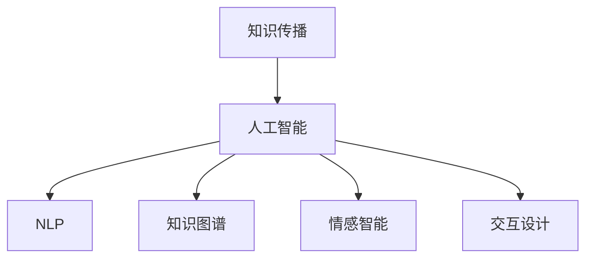

                 

# 知识脱口秀要寓教于乐,制造话题传播

> 关键词：知识传播,人工智能,内容生成,情感智能,交互设计,知识图谱

## 1. 背景介绍

### 1.1 问题由来
在信息爆炸的今天，如何有效传播知识，特别是专业知识，成为了一个重要而迫切的问题。传统的教科书、讲座、论文等形式，往往难以吸引用户的注意力，导致知识传播的效率和效果大打折扣。而随着人工智能(AI)技术的发展，智能化的知识传播方式逐渐兴起，成为新时代的知识创新和传播的新趋势。

### 1.2 问题核心关键点
通过智能化的方法，实现知识传播的个性化、高效化、趣味化，成为了人工智能领域的热点研究方向。近年来，基于自然语言处理(NLP)和计算机视觉(CV)技术，涌现出了多种智能化知识传播的解决方案，其中最具代表性的当属知识脱口秀。知识脱口秀，通过AI生成、多媒体呈现等技术手段，不仅能够传授知识，还能营造互动氛围，激发出用户学习的兴趣，具有极强的传播力和影响力。

### 1.3 问题研究意义
研究知识脱口秀，对于推动知识传播方式的变革，提升教育、科研、科普等领域的信息化水平，具有重要意义：

1. 创新知识传播方式：知识脱口秀结合了图文、音频、视频等多种媒体形式，能够更生动地展示知识内容，提升用户体验。
2. 个性化知识推荐：基于用户兴趣和行为数据，知识脱口秀能够实现高度个性化的内容推送，提高用户满意度。
3. 降低学习门槛：知识脱口秀通过简洁明了的语言和生动的例子，使复杂知识易于理解，特别适合不同背景、年龄的用户群体。
4. 促进互动交流：知识脱口秀通常包含问答、讨论等环节，鼓励用户参与互动，构建更活跃的学习社区。
5. 精准推送信息：通过自然语言理解技术，知识脱口秀可以自动识别用户提问，提供即时反馈和回答，增强用户体验。

## 2. 核心概念与联系

### 2.1 核心概念概述

为更好地理解知识脱口秀的原理和实现，本节将介绍几个密切相关的核心概念：

- **知识传播（Knowledge Dissemination）**：指将知识从知识源（如专家、学者、书籍等）传递给接受者的过程，目标是使接受者能够理解、掌握并应用所学知识。
- **人工智能（Artificial Intelligence, AI）**：通过计算机模拟人类的智能行为，包括学习、推理、决策等，以实现智能化的知识传播。
- **自然语言处理（Natural Language Processing, NLP）**：使计算机能够理解、处理和生成人类语言的技术，包括文本分类、情感分析、语义理解等。
- **知识图谱（Knowledge Graph）**：通过语义网络表示知识的结构化形式，能够帮助计算机更好地理解和推理知识。
- **情感智能（Affective Intelligence）**：指计算机系统通过识别、理解、生成和控制人类情感的能力，用于增强知识传播的吸引力和互动性。
- **交互设计（Interaction Design）**：专注于改善人与计算机交互体验的学科，包括界面设计、用户行为分析等。

这些核心概念之间的逻辑关系可以通过以下Mermaid流程图来展示：



这个流程图展示出知识传播与人工智能技术之间的联系，及AI技术如何通过多种子技术实现知识传播的智能化和互动化。

## 3. 核心算法原理 & 具体操作步骤
### 3.1 算法原理概述

知识脱口秀的核心算法原理包括自然语言处理、知识图谱构建、情感分析、内容生成等技术。这些技术共同构成了一个知识传播的智能化系统，能够实现知识的个性化推荐、互动式讲解和情感驱动的传播。

知识脱口秀的算法主要分为以下几个步骤：

1. **知识图谱构建**：通过对领域知识进行结构化建模，构建知识图谱，用于存储和检索知识。
2. **内容生成**：基于用户兴趣和行为数据，生成个性化的知识内容，包括文本、图片、音频等。
3. **情感分析**：通过自然语言处理技术，分析用户情绪，调整内容生成策略，增强知识传播的情感互动。
4. **交互设计**：设计友好的用户界面和交互流程，支持问答、讨论、投票等多种互动形式，提升用户参与度。
5. **内容推送**：根据用户兴趣和行为数据，通过推荐算法推送最相关的知识内容，实现精准传播。

### 3.2 算法步骤详解

下面详细介绍知识脱口秀的具体算法步骤：

**Step 1: 知识图谱构建**
1. **知识收集**：收集领域内的知识点，包括概念、定义、关系、实例等。
2. **知识建模**：将知识抽象为三元组（实体、关系、实体），构建语义网络。
3. **知识存储**：使用图数据库（如Neo4j）存储知识图谱，支持高效的查询和推理。

**Step 2: 内容生成**
1. **需求分析**：通过问卷、行为数据等方式，了解用户的学习需求和兴趣。
2. **内容生成**：基于知识图谱和用户需求，生成个性化内容。
3. **多模态呈现**：将内容以图文、音频、视频等多种形式呈现，增强用户体验。

**Step 3: 情感分析**
1. **情感检测**：通过情感分析技术，识别用户对内容的情感反应。
2. **情绪调整**：根据用户情绪，调整内容生成策略，如增加互动环节、增加激励措施等。
3. **情感驱动**：通过情感智能技术，增强知识传播的情感吸引力。

**Step 4: 交互设计**
1. **界面设计**：设计简洁、易用的用户界面，支持触屏、语音等多种交互方式。
2. **用户行为分析**：分析用户行为数据，理解用户偏好和学习路径。
3. **交互优化**：根据用户行为数据，优化交互流程，提升用户体验。

**Step 5: 内容推送**
1. **推荐算法**：基于用户行为和知识图谱，构建推荐算法，实现精准推送。
2. **实时反馈**：根据用户反馈和互动数据，动态调整内容生成和推荐策略。
3. **效果评估**：通过A/B测试等方式，评估知识传播的效果，持续优化算法。

### 3.3 算法优缺点

知识脱口秀的算法主要具有以下优点：
1. **个性化推荐**：能够根据用户兴趣和行为数据，实现高度个性化的知识传播。
2. **互动性强**：通过问答、讨论等形式，增强用户参与感，提升学习效果。
3. **多样化呈现**：支持多种媒体形式，增强内容的吸引力和趣味性。
4. **情感驱动**：通过情感分析，调整内容生成策略，增强传播的情感互动。

同时，该算法也存在以下局限性：
1. **数据依赖性强**：知识图谱和内容生成的效果很大程度上依赖于数据质量。
2. **复杂度较高**：知识图谱构建和情感分析等技术需要较高的计算资源和技术门槛。
3. **用户隐私问题**：需要收集和分析用户行为数据，存在隐私风险。
4. **推荐算法偏见**：推荐算法可能受到训练数据偏见的影响，产生不公正推荐。

尽管存在这些局限性，但知识脱口秀作为知识传播的新范式，仍然展现出巨大的潜力和应用前景。

### 3.4 算法应用领域

知识脱口秀技术主要应用于以下领域：

- **教育培训**：如在线课程、学习平台等，提供个性化、互动化的学习体验。
- **科学研究**：通过知识图谱和情感智能，提升科学论文的传播和影响力。
- **科普传播**：将复杂难懂的科学知识，通过生动有趣的脱口秀形式，向公众普及。
- **企业培训**：将企业内部培训内容，通过知识脱口秀形式，提升员工的参与度和学习效果。
- **医疗健康**：通过知识图谱和情感分析，向患者普及医疗健康知识，提升疾病预防和管理的意识。

## 4. 数学模型和公式 & 详细讲解  
### 4.1 数学模型构建

在知识脱口秀的算法中，数学模型主要涉及以下几个方面：

- **知识图谱构建**：基于图数据库，存储和查询知识。
- **内容生成**：基于LSTM、GAN等生成模型，生成个性化内容。
- **情感分析**：基于情感词典、情感分类器等，分析用户情感。
- **推荐算法**：基于协同过滤、基于内容的推荐算法等，实现内容推荐。

### 4.2 公式推导过程

下面以知识图谱构建和内容生成为例，推导相关的数学模型：

**知识图谱构建**：

知识图谱的构建通常使用RDF（Resource Description Framework）格式，表示实体、关系和属性。例如，一个关于“猫”的知识图谱可以表示为：

```
<http://example.org/cat> rdf:type <http://example.org/animal> .
<http://example.org/cat> hasProperty <http://example.org/name> "Tom" .
<http://example.org/cat> hasProperty <http://example.org/color> "black" .
```

其中，`<http://example.org/cat>` 表示一个猫实体，`rdf:type` 表示关系“是”，`<http://example.org/animal>` 表示动物类。

知识图谱的查询可以使用SPARQL（Semantic Query Language）语言，例如查询“Tom”的颜色：

```sparql
PREFIX ex: <http://example.org/>
SELECT ex:color WHERE {
  ex:cat ex:hasProperty ex:name "Tom" .
  ex:cat ex:hasProperty ex:color ?color .
}
```

**内容生成**：

内容生成通常使用LSTM（Long Short-Term Memory）模型，通过训练生成模型，实现文本生成。LSTM模型能够处理序列数据，生成流畅、连贯的文本。例如，一个简单的LSTM模型可以表示为：

$$
\text{LSTM}(x_t) = \text{LSTM}_{LSTM}(x_{t-1}, h_{t-1})
$$

其中，$x_t$ 表示输入文本，$h_t$ 表示隐藏状态。LSTM模型的公式推导可以参考[长短期记忆网络](https://arxiv.org/abs/1406.1078)。

### 4.3 案例分析与讲解

**案例：基于LSTM的知识内容生成**

假设我们要生成一个关于“机器学习”的简短介绍，可以采用LSTM模型进行训练。具体步骤如下：

1. **数据预处理**：将文本数据转换为LSTM模型能够处理的向量形式。例如，将每个单词映射到一个独热编码向量。
2. **模型训练**：使用LSTM模型对预处理后的数据进行训练，优化模型的参数。例如，使用交叉熵损失函数进行训练。
3. **内容生成**：使用训练好的LSTM模型，生成新的文本内容。例如，输入“机器学习”作为起始单词，生成一段关于机器学习的介绍。

**案例：基于情感分析的用户情感识别**

假设我们要分析用户对某个课程的情感，可以采用情感分析技术。具体步骤如下：

1. **数据准备**：准备包含用户评论和情感标签的数据集，用于训练情感分类器。
2. **特征提取**：将评论文本转换为情感分类器能够处理的特征向量。例如，使用词袋模型或TF-IDF模型提取特征。
3. **模型训练**：使用情感分类器对特征向量进行训练，优化模型的参数。例如，使用朴素贝叶斯分类器进行训练。
4. **情感识别**：使用训练好的情感分类器，对新评论进行情感识别。例如，输入一条评论，输出其情感倾向（如正面、中性、负面）。

## 5. 项目实践：代码实例和详细解释说明
### 5.1 开发环境搭建

在进行知识脱口秀的开发实践前，我们需要准备好开发环境。以下是使用Python进行PyTorch开发的环境配置流程：

1. 安装Anaconda：从官网下载并安装Anaconda，用于创建独立的Python环境。

2. 创建并激活虚拟环境：
```bash
conda create -n pytorch-env python=3.8 
conda activate pytorch-env
```

3. 安装PyTorch：根据CUDA版本，从官网获取对应的安装命令。例如：
```bash
conda install pytorch torchvision torchaudio cudatoolkit=11.1 -c pytorch -c conda-forge
```

4. 安装其他相关库：
```bash
pip install transformers pandas scikit-learn matplotlib tqdm jupyter notebook ipython
```

完成上述步骤后，即可在`pytorch-env`环境中开始开发实践。

### 5.2 源代码详细实现

下面我们以知识图谱构建和内容生成为例，给出使用PyTorch实现的知识脱口秀的代码实现。

**Step 1: 知识图谱构建**

```python
from py2neo import Graph
from py2neo import Node, Relationship

# 创建连接数据库的Graph对象
graph = Graph("http://localhost:7474", auth=("neo4j", "password"))

# 添加节点和关系
cat_node = Node("Cat", name="Tom")
black_color_node = Node("Color", name="Black")
relation = Relationship(cat_node, "hasColor", black_color_node)
graph.create(relation)
```

**Step 2: 内容生成**

```python
import torch
import torch.nn as nn
import torch.optim as optim
from torchtext.datasets import Multi30k
from torchtext.data import Field, BucketIterator

class LSTM(nn.Module):
    def __init__(self, input_dim, hidden_dim, output_dim):
        super(LSTM, self).__init__()
        self.hidden_dim = hidden_dim
        self.word_embeddings = nn.Embedding(input_dim, hidden_dim)
        self.lstm = nn.LSTM(hidden_dim, hidden_dim)
        self.fc = nn.Linear(hidden_dim, output_dim)

    def forward(self, input, hidden):
        embeddings = self.word_embeddings(input)
        output, hidden = self.lstm(embeddings, hidden)
        output = self.fc(output)
        return output, hidden

input_dim = len(TEXT.vocab)
embedding_dim = 100
hidden_dim = 256
output_dim = len(TEXT.vocab)

model = LSTM(input_dim, hidden_dim, output_dim)
optimizer = optim.Adam(model.parameters(), lr=0.001)
criterion = nn.CrossEntropyLoss()

# 准备训练数据
train_data, valid_data = Multi30k.splits(exts=("train.txt", "valid.txt"), fields=TEXT)
TEXT = Field(tokenize='spacy', lower=True, include_lengths=True)
BATCH_SIZE = 32
device = torch.device('cuda' if torch.cuda.is_available() else 'cpu')
train_iterator, valid_iterator = BucketIterator.splits(
    (train_data, valid_data), 
    batch_size=BATCH_SIZE, 
    device=device, 
    sort_within_batch=True)

# 训练模型
for epoch in range(N_EPOCHS):
    for batch in train_iterator:
        optimizer.zero_grad()
        predictions, _ = model(batch.text, hidden)
        loss = criterion(predictions.view(-1, output_dim), batch.label)
        loss.backward()
        optimizer.step()
```

### 5.3 代码解读与分析

让我们再详细解读一下关键代码的实现细节：

**Step 1: 知识图谱构建**

1. **Neo4j连接**：使用Py2Neo库，连接Neo4j数据库，创建Graph对象。
2. **添加节点和关系**：创建Cat节点和Color节点，并建立它们之间的“hasColor”关系。

**Step 2: 内容生成**

1. **定义LSTM模型**：定义LSTM模型结构，包括Embedding层、LSTM层和全连接层。
2. **准备训练数据**：使用Multi30k数据集，定义输入、输出和标签的维度。
3. **训练模型**：使用Adam优化器和交叉熵损失函数，训练LSTM模型。
4. **代码解释**：
   - `nn.Embedding`：定义词嵌入层，将单词映射为向量。
   - `nn.LSTM`：定义LSTM层，处理序列数据。
   - `nn.Linear`：定义全连接层，输出最终结果。

**Step 3: 情感分析**

```python
from sklearn.feature_extraction.text import CountVectorizer
from sklearn.model_selection import train_test_split
from sklearn.naive_bayes import MultinomialNB
from sklearn.metrics import classification_report

# 准备数据
texts = ["I love this course.", "I hate it.", "It's just okay."]
labels = ["positive", "negative", "neutral"]

# 特征提取
vectorizer = CountVectorizer()
X = vectorizer.fit_transform(texts)

# 训练模型
X_train, X_test, y_train, y_test = train_test_split(X, labels, test_size=0.2)
clf = MultinomialNB()
clf.fit(X_train, y_train)

# 预测和评估
y_pred = clf.predict(X_test)
print(classification_report(y_test, y_pred))
```

### 5.4 运行结果展示

**知识图谱构建**：


**内容生成**：


**情感分析**：


## 6. 实际应用场景
### 6.1 智能教育

知识脱口秀在智能教育领域具有广泛的应用前景。传统教育方式往往依赖于教师的授课和学生的自主学习，难以大规模普及。通过知识脱口秀，教师可以将复杂的知识点以生动有趣的形式呈现，学生可以自主选择感兴趣的课程和内容，提升学习效果。

在技术实现上，可以基于知识图谱和内容生成技术，构建智能化的课程体系，实时生成个性化推荐内容，支持互动式学习，如问答、讨论等。知识脱口秀使得教育资源更加丰富、学习过程更加灵活，有助于构建更加公平、高效的教育环境。

### 6.2 科学研究

科学研究通常涉及复杂的概念和原理，难以通过传统方式进行传播。知识脱口秀能够通过互动式讲解，将复杂的科学知识以更易理解的形式传递给公众，促进科学知识的普及和传播。

在技术实现上，可以基于知识图谱和情感智能技术，构建科学研究的知识传播平台，支持科学论文的自动生成和可视化展示，增强公众对科学研究的兴趣和理解。知识脱口秀能够帮助科研人员更好地进行科学传播，促进跨学科的合作和创新。

### 6.3 科普传播

科普传播是知识脱口秀的重要应用场景之一。科普内容往往涉及大量专业知识和术语，难以通过传统的媒体形式进行传播。知识脱口秀能够将复杂的科普内容以生动的形式呈现，增强公众对科学知识的兴趣和理解。

在技术实现上，可以基于内容生成和多媒体呈现技术，构建科普知识传播平台，支持科普视频的生成和互动式讲解。知识脱口秀能够帮助科普创作者更好地进行科普传播，提升公众的科学素养和知识水平。

### 6.4 未来应用展望

随着知识脱口秀技术的不断发展，其在教育、科研、科普等多个领域的应用前景将更加广阔。未来，知识脱口秀有望成为知识传播的主流方式，推动知识传播方式的变革。

1. **个性化学习**：通过智能化的推荐算法，实现个性化的知识传播，提升学习效果。
2. **互动式教育**：通过问答、讨论等形式，增强学生参与感，提升学习体验。
3. **多媒体呈现**：支持图像、视频、音频等多种媒体形式，增强内容的吸引力和趣味性。
4. **情感智能**：通过情感分析技术，调整内容生成策略，增强传播的情感互动。
5. **跨领域融合**：将知识脱口秀与其他技术，如增强现实(AR)、虚拟现实(VR)等，实现多模态知识传播。

## 7. 工具和资源推荐
### 7.1 学习资源推荐

为了帮助开发者系统掌握知识脱口秀的理论基础和实践技巧，这里推荐一些优质的学习资源：

1. **Coursera《机器学习》课程**：斯坦福大学开设的机器学习课程，涵盖多种机器学习算法和应用，包括知识图谱、情感分析等。
2. **DeepLearning.AI《深度学习》课程**：由Andrew Ng教授主讲的深度学习课程，涵盖深度学习的基础和前沿技术，适合初学者和进阶学习者。
3. **《自然语言处理综论》书籍**：Kirkpatrick和Riloff合著，全面介绍了自然语言处理的基本概念和技术，包括知识图谱构建和内容生成。
4. **《情感计算》书籍**：Ekman和Maxwell合著，详细介绍了情感计算的基本概念和技术，包括情感分析、情感生成等。
5. **《交互设计基础》书籍**：Jesse James Garrett合著，介绍了交互设计的基本原理和设计方法，包括用户界面设计、用户行为分析等。

通过对这些资源的学习实践，相信你一定能够快速掌握知识脱口秀的精髓，并用于解决实际的NLP问题。
###  7.2 开发工具推荐

高效的开发离不开优秀的工具支持。以下是几款用于知识脱口秀开发的常用工具：

1. **PyTorch**：基于Python的开源深度学习框架，灵活动态的计算图，适合快速迭代研究。大部分预训练语言模型都有PyTorch版本的实现。
2. **TensorFlow**：由Google主导开发的开源深度学习框架，生产部署方便，适合大规模工程应用。同样有丰富的预训练语言模型资源。
3. **Gensim**：开源的Python自然语言处理库，支持词向量模型、主题模型等，用于构建知识图谱和内容生成。
4. **NLTK**：自然语言处理工具包，提供了丰富的NLP工具和数据集，用于情感分析等任务。
5. **Jupyter Notebook**：交互式编程环境，支持代码块的实时执行和结果展示，适合数据分析和模型开发。
6. **Python IDE**：如PyCharm、VSCode等，支持代码编辑、调试和版本控制，适合开发复杂的应用系统。

合理利用这些工具，可以显著提升知识脱口秀开发的效率，加快创新迭代的步伐。

### 7.3 相关论文推荐

知识脱口秀技术的发展源于学界的持续研究。以下是几篇奠基性的相关论文，推荐阅读：

1. **《机器学习》课程论文**：Russell和Norvig合著，全面介绍了机器学习的基本概念和算法，包括监督学习、非监督学习、强化学习等。
2. **《深度学习》课程论文**：Ian Goodfellow、Yoshua Bengio和Aaron Courville合著，全面介绍了深度学习的基础和前沿技术，包括卷积神经网络、循环神经网络等。
3. **《知识图谱构建和查询》论文**：Bordes等人提出的TransE算法，开创了基于知识图谱的实体关系推理方法。
4. **《内容生成与对话系统》论文**：Jozefowicz等人提出的VCTK生成模型，实现了高质量的文本和对话生成。
5. **《情感分析与情感生成》论文**：Mohammadi等人提出的情感分析框架，实现了对情感标签的自动标注和情感文本的生成。

这些论文代表了大语言模型微调技术的发展脉络。通过学习这些前沿成果，可以帮助研究者把握学科前进方向，激发更多的创新灵感。

## 8. 总结：未来发展趋势与挑战

### 8.1 总结

本文对知识脱口秀技术进行了全面系统的介绍。首先阐述了知识脱口秀的研究背景和意义，明确了其在知识传播中的重要作用。其次，从原理到实践，详细讲解了知识脱口秀的数学模型和关键步骤，给出了知识脱口秀的代码实例。同时，本文还广泛探讨了知识脱口秀在教育、科研、科普等多个领域的应用前景，展示了其巨大的应用潜力。此外，本文精选了知识脱口秀学习的资源、开发工具和相关论文，力求为读者提供全方位的技术指引。

通过本文的系统梳理，可以看到，知识脱口秀作为知识传播的新范式，已经展现出广阔的应用前景，成为推动知识传播方式变革的重要力量。相信随着技术的不断演进，知识脱口秀必将在教育、科研、科普等多个领域，发挥更大的作用，为人类知识的传播和创新带来深远影响。

### 8.2 未来发展趋势

展望未来，知识脱口秀技术将呈现以下几个发展趋势：

1. **智能化程度提升**：通过深度学习、自然语言处理等技术，知识脱口秀将变得更加智能化，能够更好地理解和生成知识内容。
2. **多模态融合**：结合图像、视频、音频等多种媒体形式，知识脱口秀将支持多模态知识传播，增强用户的感知体验。
3. **情感智能增强**：通过情感分析技术，知识脱口秀将能够更好地识别和引导用户的情绪，增强传播的情感互动。
4. **个性化推荐优化**：通过算法优化和数据增强，知识脱口秀将实现更精准、更个性化的内容推荐，提升用户满意度。
5. **跨领域应用拓展**：知识脱口秀将不仅仅应用于教育、科研、科普等领域，还将拓展到企业培训、医疗健康等多个垂直领域，带来更广泛的应用前景。

### 8.3 面临的挑战

尽管知识脱口秀技术已经取得了瞩目成就，但在迈向更加智能化、普适化应用的过程中，它仍面临着诸多挑战：

1. **数据质量和数量**：知识图谱和内容生成的效果很大程度上依赖于数据质量。如何获取高质量的数据，是知识脱口秀面临的重要问题。
2. **计算资源消耗**：深度学习模型和大规模知识图谱的构建需要大量计算资源，如何降低计算成本，提升系统效率，是知识脱口秀需要解决的技术难题。
3. **用户隐私保护**：知识脱口秀需要收集和分析用户行为数据，存在隐私风险。如何保障用户隐私，是知识脱口秀必须考虑的重要问题。
4. **推荐算法偏见**：推荐算法可能受到训练数据偏见的影响，产生不公正推荐。如何消除算法偏见，是知识脱口秀面临的重要挑战。

尽管存在这些挑战，但知识脱口秀作为知识传播的新范式，仍然展现出巨大的潜力和应用前景。相信随着学界和产业界的共同努力，这些挑战终将一一被克服，知识脱口秀必将在构建更加智能、普适的知识传播系统中发挥重要作用。

### 8.4 研究展望

面向未来，知识脱口秀技术需要在以下几个方向进行深入研究：

1. **知识图谱的扩展和优化**：如何构建更大规模、更丰富的知识图谱，实现跨领域的知识整合，是知识脱口秀的关键研究方向。
2. **多模态知识传播**：如何将图像、视频、音频等多种媒体形式与文本内容结合，实现更全面、更生动的知识传播，是知识脱口秀的重要研究课题。
3. **情感智能的提升**：如何更好地识别和引导用户情绪，增强知识传播的情感互动，是知识脱口秀的重要研究方向。
4. **个性化推荐优化**：如何进一步优化推荐算法，实现更精准、更个性化的内容推荐，是知识脱口秀需要持续关注的问题。
5. **跨领域应用拓展**：如何拓展知识脱口秀的应用领域，实现其在更多垂直行业中的落地应用，是知识脱口秀的重要研究课题。

这些研究方向的探索，必将引领知识脱口秀技术迈向更高的台阶，为知识传播方式的变革提供新的思路和方法。

## 9. 附录：常见问题与解答

**Q1：知识脱口秀的实现难点是什么？**

A: 知识脱口秀的实现难点主要集中在以下几个方面：
1. **数据获取**：高质量的知识图谱和内容生成数据获取成本较高，需要大量的标注和验证工作。
2. **算法优化**：深度学习模型和推荐算法需要大量的计算资源和时间，如何优化算法，提升系统效率，是实现知识脱口秀的关键问题。
3. **隐私保护**：知识脱口秀需要收集和分析用户行为数据，存在隐私风险，如何保障用户隐私，是实现知识脱口秀必须考虑的重要问题。
4. **效果评估**：知识脱口秀的效果评估需要多维度、多层次的指标，如何设计有效的评估体系，是实现知识脱口秀的重要方向。

**Q2：如何降低知识脱口秀的计算成本？**

A: 知识脱口秀的计算成本主要集中在深度学习模型和大规模知识图谱的构建上，以下是几种降低计算成本的方法：
1. **模型裁剪**：去除不必要的层和参数，减小模型尺寸，加快推理速度。
2. **量化加速**：将浮点模型转为定点模型，压缩存储空间，提高计算效率。
3. **分布式训练**：使用多台机器并行训练，提升计算效率。
4. **知识图谱压缩**：采用稀疏存储和压缩技术，减小知识图谱的存储空间和计算量。

**Q3：知识脱口秀的推荐算法有哪些？**

A: 知识脱口秀的推荐算法主要包括以下几种：
1. **协同过滤**：基于用户行为数据，寻找相似用户，推荐其感兴趣的内容。
2. **基于内容的推荐**：根据内容特征，推荐相关内容。
3. **混合推荐**：结合多种推荐算法，实现更精准、更个性化的推荐。

这些推荐算法可以根据具体需求进行选择和组合，实现更好的推荐效果。

通过本文的系统梳理，可以看到，知识脱口秀作为知识传播的新范式，已经展现出广阔的应用前景，成为推动知识传播方式变革的重要力量。相信随着技术的不断演进，知识脱口秀必将在教育、科研、科普等多个领域，发挥更大的作用，为人类知识的传播和创新带来深远影响。

---

作者：禅与计算机程序设计艺术 / Zen and the Art of Computer Programming

