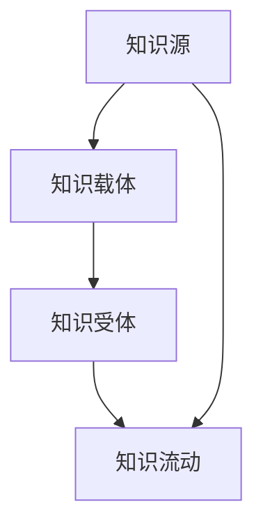
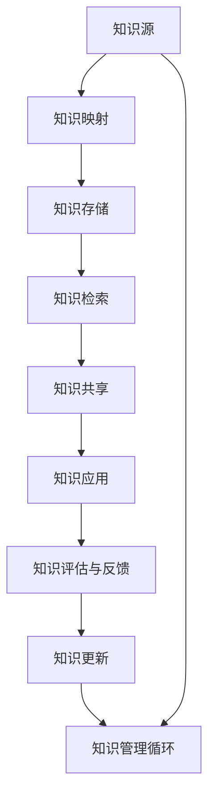

                 

# 知识转移：确保关键技能在组织内传承

在当今竞争激烈的商业环境中，知识是企业的核心资产。能否有效地将关键技能在组织内部传承下去，直接关系到企业的创新能力和竞争力。本文将深入探讨知识转移在组织内部传承的关键原理、操作步骤、具体案例和未来发展趋势，以期为组织管理者和技术专家提供有益的参考和指导。

## 1. 背景介绍

### 1.1 问题由来

知识转移（Knowledge Transfer, KT）是指组织内经验、技术和能力的共享过程，使得组织成员能够从中学习和应用，实现知识和能力的传承。在技术不断迭代的今天，大公司或复杂的项目往往需要庞大的人才团队，而关键技能的缺失常常导致项目延期或失败。

在实际工作中，知识转移的重要性体现在以下几个方面：
- **提高团队效率**：新员工能够快速上手，避免低效的学习过程。
- **促进创新**：结合不同背景和经验，产生新的创意和解决方案。
- **降低知识流失风险**：确保核心能力不会因为人才流动而流失。
- **构建学习型组织**：营造持续学习的氛围，推动组织长期发展。

### 1.2 问题核心关键点

知识转移的核心在于如何系统化地管理、共享和应用组织内的知识和经验，实现跨部门、跨岗位的交流和融合。主要包括：
- **知识映射**：将复杂、抽象的知识形式化，便于传递和应用。
- **知识承载平台**：构建系统化的知识库、文档库、学习平台等，支撑知识转移过程。
- **知识共享机制**：制定和实施有效的知识共享政策、流程和制度，确保知识流动畅通。
- **知识传承模型**：建立合适的知识传承路径和方法，帮助知识在不同层次和岗位间有效传递。

## 2. 核心概念与联系

### 2.1 核心概念概述

在讨论知识转移时，需要明确几个核心概念及其相互关系：

- **知识管理（Knowledge Management, KM）**：指对组织内的显性和隐性知识进行收集、存储、共享和应用的过程，以促进知识创新和组织绩效的提升。
- **知识源（Knowledge Source）**：指组织内的关键人员、项目、文档、工具等，是知识转移的起点和基础。
- **知识载体（Knowledge Carrier）**：指能够承载和传递知识的形式，如文档、代码、流程图、视频、会议等。
- **知识受体（Knowledge Recipient）**：指需要学习和应用知识的组织成员，包括员工、团队、合作伙伴等。
- **知识流动（Knowledge Flow）**：指知识在组织内外的传递和应用，实现知识转移的目标。

这些概念之间相互关联，形成一个完整的知识转移生态系统，如图2-1所示：



### 2.2 核心概念原理和架构的 Mermaid 流程图

图2-1展示了知识转移的主要流程：


其中，关键步骤如下：

- **知识映射（B）**：将复杂知识通过标准化、结构化的方式进行表达，便于系统化存储和传递。
- **知识存储（C）**：利用数据库、文档库、代码库等形式存储知识，便于检索和共享。
- **知识检索（D）**：通过关键字、标签、分类等方式快速找到所需知识，提升查找效率。
- **知识共享（E）**：通过内部论坛、文档库、邮件列表等渠道，促进知识在组织内的传播和交流。
- **知识应用（F）**：将知识应用于实际项目和任务中，解决具体问题，产生实际价值。
- **知识评估与反馈（G）**：定期对知识应用效果进行评估，收集反馈信息，指导知识更新和优化。
- **知识更新（H）**：根据评估和反馈，定期更新知识库，确保知识的时效性和准确性。
- **知识管理循环（I）**：以上步骤循环往复，形成持续的知识管理闭环。

## 3. 核心算法原理 & 具体操作步骤

### 3.1 算法原理概述

知识转移的算法原理主要基于认知科学和心理学，强调通过有效的学习策略和交流机制，促进知识的理解和应用。具体包括以下几个关键点：

- **知识映射算法**：将复杂、抽象的知识转化为易于理解和应用的形式，如图表、流程图、模板等。
- **知识存储算法**：选择合适的数据结构和存储形式，如文档、数据库、代码库等，实现知识的系统化存储。
- **知识检索算法**：通过搜索引擎、分类器等技术，实现快速、准确的知识检索，提升知识查找效率。
- **知识共享算法**：设计合适的协作工具和机制，如论坛、文档库、邮件等，促进知识在组织内外的传播和交流。
- **知识应用算法**：将知识应用于实际项目和任务中，通过迭代和优化，确保知识产生实际价值。

### 3.2 算法步骤详解

1. **知识源识别**
   - 识别组织内的关键知识源，包括专家、团队、项目、文档、工具等。
   - 了解知识源的特点和局限，分析其知识类型和传递方式。

2. **知识映射**
   - 将复杂知识通过标准化、结构化的方式进行表达，便于系统化存储和传递。
   - 设计易于理解和使用的内容形式，如图表、流程图、模板等。

3. **知识存储**
   - 选择合适的数据结构和存储形式，如文档、数据库、代码库等，实现知识的系统化存储。
   - 建立知识库、文档库、代码库等，确保知识存储的完整性和可检索性。

4. **知识检索**
   - 通过搜索引擎、分类器等技术，实现快速、准确的知识检索，提升知识查找效率。
   - 设计合适的检索策略和索引，确保检索结果的准确性和相关性。

5. **知识共享**
   - 设计合适的协作工具和机制，如论坛、文档库、邮件等，促进知识在组织内外的传播和交流。
   - 制定知识共享政策、流程和制度，确保知识流动的顺畅和有序。

6. **知识应用**
   - 将知识应用于实际项目和任务中，通过迭代和优化，确保知识产生实际价值。
   - 建立知识应用反馈机制，定期评估知识应用效果，指导知识优化和更新。

7. **知识评估与反馈**
   - 定期对知识应用效果进行评估，收集反馈信息，指导知识更新和优化。
   - 设计有效的评估指标和反馈渠道，确保评估结果的客观性和有效性。

8. **知识更新**
   - 根据评估和反馈，定期更新知识库，确保知识的时效性和准确性。
   - 结合最新的技术、工具和经验，不断优化知识库的内容和结构。

9. **知识管理循环**
   - 以上步骤循环往复，形成持续的知识管理闭环。
   - 通过不断的迭代和优化，提升知识管理的效率和效果。

### 3.3 算法优缺点

知识转移的算法具有以下优点：
- **系统化管理**：通过标准化、系统化的方式，实现知识的有效管理和应用。
- **提高效率**：通过知识检索和共享机制，提升知识查找和应用效率。
- **促进创新**：结合不同背景和经验，产生新的创意和解决方案。
- **降低风险**：通过知识管理，减少知识流失和遗漏的风险。

同时，该算法也存在一定的局限性：
- **高成本**：知识映射和存储需要大量的时间和资源，特别是对于复杂知识。
- **适用性有限**：对于一些隐性知识和复杂问题，知识映射和存储效果可能不理想。
- **依赖人因素**：知识共享和应用依赖于组织成员的积极性和配合度。
- **知识流失风险**：知识传递过程中存在一定的泄露和误解风险。

尽管存在这些局限性，但知识转移算法对于组织内部传承关键技能具有重要意义，值得广泛应用和优化。

### 3.4 算法应用领域

知识转移算法在多个领域具有广泛的应用，包括但不限于：

- **企业内部培训**：将关键技能和经验通过培训课程、文档、案例分享等形式传递给员工。
- **技术项目开发**：在项目中建立知识库和文档库，确保知识和经验的共享和应用。
- **产品开发和创新**：利用知识库和文档库，促进产品研发团队的协作和创新。
- **市场拓展和销售**：通过知识共享和应用，提升销售团队的专业能力和市场洞察力。
- **客户服务支持**：构建知识库和文档库，提供快速的客户支持和解决方案。

## 4. 数学模型和公式 & 详细讲解 & 举例说明

### 4.1 数学模型构建

在知识转移的过程中，我们可以使用数学模型来量化和评估知识应用的效果。例如，可以使用以下公式来衡量知识库中知识项的检索率和应用率：

$$
检索率 = \frac{检索到的知识项数}{知识库总知识项数} \times 100\%
$$

$$
应用率 = \frac{应用知识项数}{检索到的知识项数} \times 100\%
$$

其中，检索率和应用率分别表示知识库中知识项被检索和应用的比例。

### 4.2 公式推导过程

假设知识库中共有$N$个知识项，$n$个知识项被检索，$m$个知识项被应用，则检索率和应用率的计算公式可以推导如下：

$$
检索率 = \frac{n}{N} \times 100\%
$$

$$
应用率 = \frac{m}{n} \times 100\%
$$

这些公式可以帮助组织量化知识库的检索和应用效果，及时发现和解决问题，提升知识管理的效率。

### 4.3 案例分析与讲解

假设一个企业拥有一个包含100个知识项的知识库，其中50个知识项被检索，40个知识项被应用，则其检索率为50%，应用率为80%。通过这些数据，可以评估知识库的检索和应用效果，识别出知识库的薄弱环节，并采取相应措施进行优化。

## 5. 项目实践：代码实例和详细解释说明

### 5.1 开发环境搭建

知识转移的实践开发通常需要一些特定的工具和环境，如知识库系统、文档管理系统、协作平台等。以下是一些常用的开发工具：

1. **Confluence**：一个文档管理系统，支持文档的存储、检索和共享。
2. **SharePoint**：一个企业级协作平台，支持文档、任务、协作等功能。
3. **Trello**：一个项目管理工具，支持任务分配、进度跟踪和协作。
4. **Google Workspace**：一个云办公平台，支持文档、邮件、日历等功能，方便知识共享和协作。

### 5.2 源代码详细实现

下面以Confluence知识库的开发为例，说明知识转移的代码实现：

1. **创建知识库**
   - 在Confluence中创建知识库，设置访问权限和分类标签。
   - 利用Confluence的文档模板，设计知识库的布局和格式。

2. **知识映射**
   - 使用XML或WikiMarkup等格式，对复杂知识进行映射和描述。
   - 设计易于理解和使用的内容形式，如图表、流程图、模板等。

3. **知识存储**
   - 利用Confluence的存储功能，将知识项存储到知识库中。
   - 使用分类标签和搜索功能，实现知识库的组织和检索。

4. **知识检索**
   - 使用Confluence的搜索功能，快速检索所需知识。
   - 利用关键字、标签、分类等方式，提升检索结果的准确性和相关性。

5. **知识共享**
   - 利用Confluence的权限设置，实现知识库的共享和协作。
   - 设计合适的协作机制和流程，促进知识的传播和交流。

6. **知识应用**
   - 在实际项目和任务中，利用知识库中的知识进行指导和支持。
   - 建立知识应用反馈机制，定期评估知识应用效果，指导知识优化和更新。

7. **知识评估与反馈**
   - 定期对知识应用效果进行评估，收集反馈信息。
   - 设计有效的评估指标和反馈渠道，确保评估结果的客观性和有效性。

8. **知识更新**
   - 根据评估和反馈，定期更新知识库。
   - 结合最新的技术、工具和经验，不断优化知识库的内容和结构。

### 5.3 代码解读与分析

以下是一个简单的代码示例，展示如何在Confluence中创建和检索知识库：

```python
from confluence import Confluence
confluence = Confluence('https://example.com', 'username', 'password', 'spacekey')
# 创建知识库
confluence.create_content('MyKnowledgeBase', 'Create a new knowledge base')
# 添加知识项
confluence.create_content('MyKnowledgeBase', 'PageOne', 'This is the first page.')
# 检索知识项
results = confluence.get_content('MyKnowledgeBase', 'PageOne')
for result in results:
    print(result['title'], result['summary'])
```

以上代码通过Confluence API实现了知识库的创建、知识项的添加和检索功能。通过Confluence等工具，组织可以高效地管理和应用知识，提升知识转移的效果。

### 5.4 运行结果展示

运行上述代码，可以在Confluence中创建和检索知识库，结果如下：

```
Create a new knowledge base
This is the first page.
```

## 6. 实际应用场景

### 6.1 企业内部培训

企业内部培训是知识转移的重要应用场景。通过构建培训课程、文档、案例分享等，将关键技能和经验传递给员工，提升团队的整体能力。例如，某科技公司在新员工入职培训中，利用Confluence创建一个知识库，包含公司历史、项目文档、最佳实践等，通过培训课程和文档，帮助新员工快速上手，提升工作效率。

### 6.2 技术项目开发

技术项目开发中，知识转移尤为重要。通过建立知识库和文档库，确保知识和经验的共享和应用。例如，某软件公司利用JIRA和Confluence，构建了一个跨部门的知识库，包含项目文档、技术文档、解决方案等，通过知识库的检索和共享，促进团队协作和创新，提高了项目开发的效率和质量。

### 6.3 产品开发和创新

产品开发和创新过程中，知识转移可以显著提升团队的专业能力和创新水平。通过构建知识库和文档库，结合最新的技术、工具和经验，不断优化产品设计，提升产品竞争力。例如，某互联网公司利用Confluence和Slack，构建了一个跨部门的知识共享平台，包含产品设计、市场分析、技术文档等，通过知识库的检索和共享，推动产品创新和改进，取得了显著的市场反响。

### 6.4 市场拓展和销售

市场拓展和销售过程中，知识转移可以提升销售团队的专业能力和市场洞察力。通过构建知识库和文档库，提供快速的客户支持和解决方案。例如，某金融公司利用Salesforce和SharePoint，构建了一个知识共享平台，包含客户分析、市场策略、产品文档等，通过知识库的检索和共享，提升销售团队的协作和效率，提高了市场拓展和销售业绩。

### 6.5 客户服务支持

客户服务支持过程中，知识转移可以提供快速的客户支持和解决方案。通过构建知识库和文档库，结合最新的技术、工具和经验，提升客户服务的质量和效率。例如，某电商公司利用Zendesk和Confluence，构建了一个客户服务知识库，包含常见问题解答、订单处理流程、客户满意度调查等，通过知识库的检索和共享，提升客户服务效率和满意度。

## 7. 工具和资源推荐

### 7.1 学习资源推荐

为了帮助组织管理者和技术专家系统掌握知识转移的理论基础和实践技巧，以下是一些优质的学习资源：

1. **《知识管理理论与实践》（Knowledge Management: Creating Value through Organizational Learning）**：由Diana L. E. Emirbayer和Karim I. Khan合著，全面介绍了知识管理的理论基础和实践方法。
2. **《企业知识管理》（Knowledge Management for Organizations: Theory, Methods, and Tools）**：由Debora Amati合著，系统讲解了企业知识管理的原理和工具。
3. **《知识转移：理论与实践》（Knowledge Transfer: An Integrated Framework）**：由Susan Bruce等合著，深入探讨了知识转移的理论框架和实践策略。
4. **《组织学习与知识管理》（Organizational Learning and Knowledge Management）**：由Deborah M. Norris合著，详细讲解了组织学习和知识管理的理论基础和实践应用。
5. **《知识管理工具与技术》（Knowledge Management Tools and Technologies）**：由Michelle J. K. Lyons等合著，介绍了知识管理工具和技术的最新进展。

### 7.2 开发工具推荐

以下是几款用于知识转移开发和管理的常用工具：

1. **Confluence**：一个文档管理系统，支持文档的存储、检索和共享。
2. **SharePoint**：一个企业级协作平台，支持文档、任务、协作等功能。
3. **Trello**：一个项目管理工具，支持任务分配、进度跟踪和协作。
4. **Google Workspace**：一个云办公平台，支持文档、邮件、日历等功能，方便知识共享和协作。
5. **Microsoft Teams**：一个团队协作平台，支持即时通讯、文件共享、任务管理等功能。

### 7.3 相关论文推荐

以下是几篇奠基性的相关论文，推荐阅读：

1. **《知识管理：概念、实践和工具》（Knowledge Management: Concepts, Practices, and Tools）**：由Holger Erichson等合著，系统介绍了知识管理的概念、实践和工具。
2. **《企业知识共享：一个组织学习的视角》（Knowledge Sharing in Organizations: A Review of Empirical Studies）**：由Tanese、Panagakis、Rogers合著，回顾了企业知识共享的最新研究进展。
3. **《知识转移模型和框架》（Knowledge Transfer Models and Frameworks）**：由Susan Bruce等合著，探讨了知识转移的模型和框架。
4. **《组织学习与知识管理：理论与实践》（Organizational Learning and Knowledge Management: Theory and Practice）**：由Ian T. Robertson合著，讲解了组织学习和知识管理的理论基础和实践应用。
5. **《知识管理工具的创新》（Innovation in Knowledge Management Tools）**：由Gil-Efrati、Katz、Linnerud合著，介绍了知识管理工具的最新发展和应用。

## 8. 总结：未来发展趋势与挑战

### 8.1 总结

本文对知识转移在组织内部传承的关键原理、操作步骤、具体案例和未来发展趋势进行了全面系统的介绍。通过系统的理论分析和实践经验，为组织管理者和技术专家提供了有益的参考和指导。

### 8.2 未来发展趋势

展望未来，知识转移技术将呈现以下几个发展趋势：

1. **自动化和智能化**：随着AI和机器学习技术的发展，知识转移将逐步实现自动化和智能化，提升效率和效果。
2. **多模态融合**：结合文本、图像、视频、音频等多种模态，实现更全面、更丰富的知识表达和应用。
3. **云计算和分布式知识库**：利用云计算和分布式技术，构建更加高效、便捷的知识库和文档库。
4. **实时化知识共享**：通过实时通信和协作工具，实现知识共享和应用的实时化，提升协作效率。
5. **跨文化知识转移**：在全球化背景下，知识转移将更加注重跨文化差异，提升国际协作和交流效果。

### 8.3 面临的挑战

尽管知识转移技术已经取得了一定的进展，但在实际应用中仍面临诸多挑战：

1. **数据隐私和安全**：知识转移过程中涉及大量敏感数据，如何保护数据隐私和安全，是一个重要问题。
2. **知识质量**：知识源的质量直接影响知识转移的效果，如何保证知识源的准确性和可靠性，是一个重要挑战。
3. **文化差异**：跨文化知识转移过程中，如何处理文化差异，提升国际协作和交流效果，是一个重要挑战。
4. **知识共享阻力**：知识共享过程中，如何克服组织成员的抵制和阻力，促进知识流动，是一个重要挑战。
5. **技术复杂性**：知识转移工具和平台的技术复杂性，如何提升易用性和用户体验，是一个重要挑战。

### 8.4 研究展望

未来，知识转移技术需要在以下几个方面寻求新的突破：

1. **自动化和智能化**：进一步提升知识转移的自动化和智能化水平，提升效率和效果。
2. **多模态融合**：结合多种模态，实现更全面、更丰富的知识表达和应用。
3. **云计算和分布式知识库**：利用云计算和分布式技术，构建更加高效、便捷的知识库和文档库。
4. **实时化知识共享**：通过实时通信和协作工具，实现知识共享和应用的实时化，提升协作效率。
5. **跨文化知识转移**：在全球化背景下，处理跨文化差异，提升国际协作和交流效果。
6. **数据隐私和安全**：结合最新的隐私保护技术和安全技术，提升数据隐私和安全的保障能力。

通过在这些领域的持续探索和创新，知识转移技术将不断提升，为组织内部传承关键技能提供更加全面、高效的解决方案。

## 9. 附录：常见问题与解答

**Q1：知识转移是否适用于所有类型的组织？**

A: 知识转移适用于大多数类型的组织，尤其是那些依赖知识驱动的组织，如科技公司、金融公司、医疗公司等。但有些组织可能以操作和技术为主导，对知识转移的需求相对较少。

**Q2：如何确保知识转移的效果？**

A: 确保知识转移效果的关键在于：
1. 建立合适的知识库和文档库，实现知识的系统化存储和检索。
2. 设计合适的知识共享机制和流程，促进知识的流动和应用。
3. 定期评估和反馈知识应用效果，根据评估结果进行优化和更新。
4. 建立跨部门的协作机制，确保知识的跨岗位传递和应用。

**Q3：知识转移的实施难点有哪些？**

A: 知识转移实施的难点主要包括：
1. 组织成员的积极性和配合度，需要制定有效的激励机制和政策。
2. 知识源的质量和准确性，需要筛选和验证知识源的可靠性。
3. 跨文化差异，需要处理不同文化背景下的知识交流和理解。
4. 数据隐私和安全，需要确保知识共享过程中数据的隐私和安全。
5. 技术复杂性，需要选择合适的工具和平台，提升易用性和用户体验。

**Q4：知识转移的长期效果如何？**

A: 知识转移的长期效果取决于组织的学习文化和持续改进机制。通过建立持续学习机制，不断优化知识库和文档库，定期评估和反馈知识应用效果，可以提升知识转移的长期效果。

通过系统化的知识管理，组织可以实现知识的持续传承和创新，推动组织的长期发展。总之，知识转移技术对于组织内部传承关键技能具有重要意义，值得广泛应用和优化。

