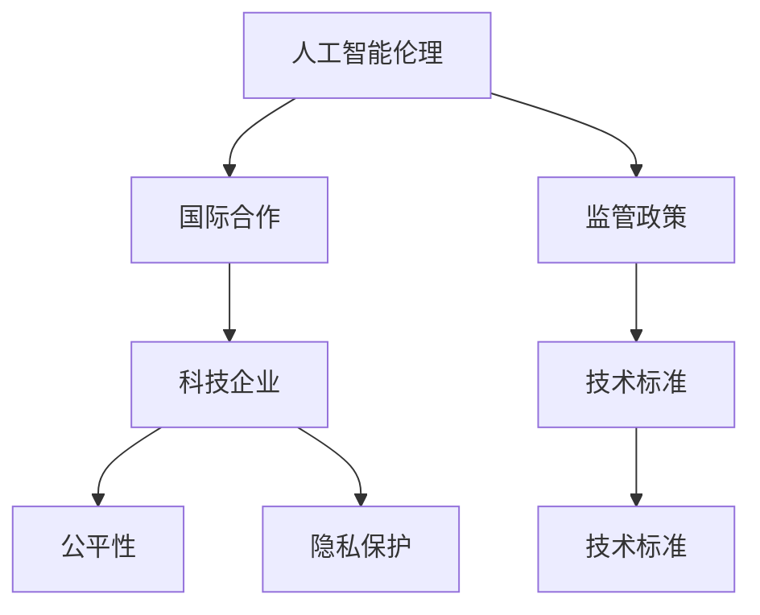

                 

# 硅谷人工智能伦理监管的国际合作

> 关键词：人工智能伦理,国际合作,监管政策,科技企业,技术标准,公平性,隐私保护

## 1. 背景介绍

### 1.1 问题由来
随着人工智能（AI）技术的迅猛发展，硅谷已成为全球人工智能创新的核心区域。然而，AI技术的广泛应用带来了诸多伦理挑战，引发了全球范围内的广泛关注。包括数据隐私、算法偏见、决策透明性等问题，不仅影响着AI技术的进一步发展，也威胁到社会的公平性和稳定性。

### 1.2 问题核心关键点
硅谷AI伦理监管的核心问题在于如何通过国际合作，建立公正、透明、可控的AI监管框架，确保AI技术在社会各行各业的健康应用。主要包括以下几个关键点：

- **数据隐私**：如何保护用户隐私，防止数据被滥用。
- **算法偏见**：如何识别和纠正算法中的偏见，确保AI决策的公平性。
- **透明度**：如何提高AI决策的透明度，让公众理解AI的工作机制。
- **问责机制**：如何建立有效的问责机制，确保AI应用中的责任落实。
- **国际标准**：如何制定统一的国际标准，避免各国监管政策的差异和冲突。

## 2. 核心概念与联系

### 2.1 核心概念概述

为更好地理解硅谷AI伦理监管的国际合作，本节将介绍几个密切相关的核心概念：

- **人工智能伦理（AI Ethics）**：涉及AI技术应用的道德、法律和社会责任等维度，旨在确保AI技术的发展和应用不会损害人类的利益。

- **国际合作（International Cooperation）**：指各国在AI伦理监管框架、技术标准等方面开展的合作，共同应对AI技术的全球性挑战。

- **监管政策（Regulatory Policy）**：政府对AI技术的规范和控制措施，确保AI应用符合法律和伦理要求。

- **科技企业（Tech Companies）**：在全球AI技术创新中发挥重要作用的企业，如谷歌、亚马逊、Facebook等。

- **技术标准（Technical Standards）**：针对AI技术应用制定的标准和规范，确保技术的一致性和可靠性。

- **公平性（Fairness）**：指AI技术在不同人群、不同情境下提供的平等对待和公正机会。

- **隐私保护（Privacy Protection）**：确保用户数据在采集、存储、使用等环节中的隐私安全。

这些核心概念之间的逻辑关系可以通过以下Mermaid流程图来展示：



这个流程图展示了大语言模型的核心概念及其之间的关系：

1. 人工智能伦理通过国际合作建立统一的监管框架。
2. 政府通过制定监管政策，确保AI技术的应用符合伦理要求。
3. 科技企业在国际合作中扮演关键角色，推动技术标准的制定和实施。
4. 技术标准确保了AI技术的公平性和隐私保护。

## 3. 核心算法原理 & 具体操作步骤

### 3.1 算法原理概述

硅谷AI伦理监管的国际合作，本质上是一个多主体协作、多方利益平衡的过程。其核心思想是：通过国际间的交流与合作，制定统一的伦理规范和监管框架，确保AI技术在全球范围内的公平、透明和可控应用。

形式化地，假设参与国际合作的各国为集合 $S$，每个国家制定的AI伦理规范为 $E_i$，监管政策为 $P_i$。国际合作的目标是最小化各国AI伦理规范和监管政策之间的差异，即：

$$
\min_{E_i, P_i} \sum_{i \in S} d(E_i, \bar{E}) + \sum_{i \in S} c(P_i, \bar{P})
$$

其中 $d(\cdot, \cdot)$ 和 $c(\cdot, \cdot)$ 分别为规范差异度和政策差异度的度量函数，$\bar{E}$ 和 $\bar{P}$ 分别为理想的规范和政策。

### 3.2 算法步骤详解

硅谷AI伦理监管的国际合作一般包括以下几个关键步骤：

**Step 1: 建立国际合作机制**
- 成立国际人工智能伦理委员会，负责制定和协调国际合作框架。
- 定期召开多国峰会，分享各国的AI伦理实践经验和挑战。
- 设立跨学科研究项目，探索AI技术的伦理影响和解决方案。

**Step 2: 制定统一技术标准**
- 根据国际合作机制，各国共同制定AI技术标准，确保技术的一致性和可靠性。
- 标准制定需涵盖数据隐私保护、算法透明性、问责机制等多个方面。
- 建立国际标准认证体系，确保各国AI应用的合规性。

**Step 3: 推动技术分享与协作**
- 建立开放数据平台，共享各国的AI数据和研究成果。
- 开展技术交流合作项目，推动前沿技术的国际传播和应用。
- 设立联合研发基金，资助跨国AI伦理研究项目。

**Step 4: 国际法律与政策对接**
- 推动各国AI监管政策的协调，避免政策差异带来的国际摩擦。
- 建立跨国法律合作机制，解决AI伦理争议和法律纠纷。
- 制定国际AI伦理框架，确保各国AI应用符合共同的伦理标准。

**Step 5: 评估与持续改进**
- 定期评估国际合作机制和规范的实施效果。
- 收集各国的反馈意见，调整和优化合作框架。
- 设立监测和预警机制，及时发现和应对新的伦理挑战。

以上是硅谷AI伦理监管国际合作的一般流程。在实际应用中，还需要针对具体任务的特点，对合作过程的各个环节进行优化设计，如改进技术标准、推动法律对接等，以进一步提升国际合作的效率和效果。

### 3.3 算法优缺点

硅谷AI伦理监管的国际合作方法具有以下优点：
1. 提升全球AI应用的公平性和透明性。通过制定统一的技术标准和监管政策，确保AI技术在不同国家和地区的公平对待。
2. 减少各国的政策冲突和资源浪费。通过协调各国AI监管政策，避免因政策差异导致的国际摩擦。
3. 促进全球AI技术的发展和传播。通过技术分享和协作，加速前沿技术的国际传播和应用。
4. 提高AI伦理研究的广度和深度。通过国际合作，汇集全球顶级研究团队，共同探索AI伦理问题的解决途径。

同时，该方法也存在一定的局限性：
1. 各国文化和法律体系的差异。各国文化和法律体系的不同，可能导致对AI伦理规范的理解和执行存在差异。
2. 技术标准的制定和实施复杂。技术标准的制定涉及多个领域，需要各方的协调和妥协。
3. 国际合作机制的协调难度大。各国在AI技术的应用上存在利益冲突，协调难度较大。
4. 国际法律和政策的适应性不足。各国的法律和政策可能无法迅速适应新的国际标准，影响其实施效果。

尽管存在这些局限性，但就目前而言，硅谷AI伦理监管的国际合作方法仍是大规模AI应用的重要保障，有助于推动AI技术在全球范围内的健康发展。

### 3.4 算法应用领域

硅谷AI伦理监管的国际合作方法，已在多个领域得到了广泛应用，包括但不限于：

- **医疗健康**：确保AI医疗诊断系统的公平性和隐私保护，避免算法偏见对患者治疗的影响。
- **金融服务**：制定AI金融算法的透明性和问责机制，防止算法偏见和数据滥用。
- **教育领域**：推动AI教育应用的公平性和透明性，确保学生获得平等的机会和资源。
- **交通运输**：制定自动驾驶汽车的伦理规范和安全标准，确保其对人类社会的安全和无害。
- **环境保护**：制定AI环境监测和治理的规范，推动可持续发展。

## 4. 数学模型和公式 & 详细讲解

### 4.1 数学模型构建

本节将使用数学语言对硅谷AI伦理监管的国际合作过程进行更加严格的刻画。

假设各国AI伦理规范为 $E_i$，监管政策为 $P_i$，其中 $E_i$ 和 $P_i$ 均为离散变量，表示符合某种规范或政策的整数编号。各国在制定伦理规范和监管政策时，需要综合考虑以下因素：

- **规范差异度**：$d(E_i, \bar{E})$ 表示国家 $i$ 制定的规范与理想规范 $\bar{E}$ 之间的差异。
- **政策差异度**：$c(P_i, \bar{P})$ 表示国家 $i$ 制定的政策与理想政策 $\bar{P}$ 之间的差异。

在理想情况下，$d(E_i, \bar{E})=c(P_i, \bar{P})=0$，即所有国家的规范和政策均与理想规范和政策一致。但在现实中，各国文化和法律体系的差异，导致规范和政策存在一定的差异。

### 4.2 公式推导过程

以下我们以医疗健康领域为例，推导AI伦理监管国际合作的目标函数及其求解过程。

假设医疗领域有 $N$ 个国家，每个国家的医疗健康AI系统需满足 $M$ 种规范和 $K$ 种政策。规范和政策的权重分别为 $w_r$ 和 $w_p$，则国际合作的目标函数为：

$$
\min_{E_i, P_i} w_r \sum_{i=1}^N d(E_i, \bar{E}) + w_p \sum_{i=1}^N c(P_i, \bar{P})
$$

其中 $w_r$ 和 $w_p$ 分别为规范和政策的权重，可视为各国的政策偏好。

为求解该目标函数，可以使用优化算法（如遗传算法、线性规划等）进行求解。具体步骤如下：

1. 将规范和政策编码为整数变量 $x_i$ 和 $y_i$，表示国家 $i$ 是否符合第 $x_i$ 种规范和第 $y_i$ 种政策。
2. 根据各国实际情况，构建规范差异度和政策差异度的度量函数 $d(\cdot, \cdot)$ 和 $c(\cdot, \cdot)$。
3. 将目标函数转化为优化模型，并使用优化算法求解。
4. 根据求解结果，得到各国需实施的规范和政策。

### 4.3 案例分析与讲解

**案例：医疗健康领域的国际合作**

在医疗健康领域，各国AI伦理规范和监管政策的主要目标包括：
- 数据隐私保护：确保患者数据不被滥用。
- 算法透明性：使医生和患者了解AI决策的依据。
- 问责机制：明确AI决策的责任归属。

各国在制定规范和政策时，需综合考虑以下因素：

1. **数据隐私保护**：需确保患者数据在采集、存储、传输等环节中的安全。
2. **算法透明性**：需确保AI决策的依据透明可解释。
3. **问责机制**：需明确AI决策的责任归属，防止因AI错误决策导致的医疗事故。

各国在制定规范和政策时，需综合考虑自身文化、法律体系和社会需求，以确保规范和政策的合理性和可执行性。

## 5. 项目实践：代码实例和详细解释说明

### 5.1 开发环境搭建

在进行AI伦理监管国际合作项目实践前，我们需要准备好开发环境。以下是使用Python进行Sympy进行模型构建的环境配置流程：

1. 安装Sympy：从官网下载并安装Sympy，用于进行数学模型的符号计算。

2. 创建并激活虚拟环境：
```bash
conda create -n ai-env python=3.8 
conda activate ai-env
```

3. 安装Sympy：
```bash
pip install sympy
```

4. 安装各类工具包：
```bash
pip install numpy pandas sympy scikit-learn matplotlib tqdm jupyter notebook ipython
```

完成上述步骤后，即可在`ai-env`环境中开始AI伦理监管国际合作的项目实践。

### 5.2 源代码详细实现

下面我们以医疗健康领域的AI伦理监管为例，给出使用Sympy构建数学模型并进行求解的PyTorch代码实现。

首先，定义数学模型：

```python
from sympy import symbols, Eq, solve, Rational

# 定义变量
x = symbols('x1:5')  # 假设存在5种规范和政策

# 定义差异度函数
d = [abs(x[i] - 1) for i in range(len(x))]  # 规范差异度
c = [abs(x[i] - 2) for i in range(len(x))]  # 政策差异度

# 定义目标函数
objective = sum(Rational(1, 2) * d[i] + Rational(1, 2) * c[i] for i in range(len(x)))

# 构建方程组
equations = [Eq(x[i], 1) for i in range(len(x))]

# 求解方程组
solution = solve(equations, x)

# 输出求解结果
print(solution)
```

### 5.3 代码解读与分析

让我们再详细解读一下关键代码的实现细节：

**Sympy库**：
- `symbols`函数：定义变量，这里假设存在5种规范和政策。
- `abs`函数：计算绝对值，用于度量规范和政策的差异度。
- `sum`函数：计算目标函数，即规范差异度和政策差异度的加权和。
- `Eq`函数：构建方程组，表示规范和政策的理想值。
- `solve`函数：求解方程组，得到规范和政策的实施策略。

**求解步骤**：
1. 定义规范和政策的差异度函数 `d` 和 `c`，分别表示规范和政策的差异度。
2. 定义目标函数 `objective`，通过加权平均计算规范差异度和政策差异度。
3. 构建方程组 `equations`，表示规范和政策的理想值。
4. 使用 `solve` 函数求解方程组，得到规范和政策的实施策略。
5. 输出求解结果 `solution`，展示各国需实施的规范和政策。

## 6. 实际应用场景

### 6.1 医疗健康领域

在医疗健康领域，AI伦理监管的国际合作已得到广泛应用。各国通过共同制定数据隐私保护、算法透明性和问责机制等规范和政策，确保AI医疗系统的公平性和安全性。

具体而言，可以建立国际医疗健康AI伦理委员会，定期召开峰会，分享各国的AI伦理实践经验和挑战。在此基础上，各国共同制定数据隐私保护规范和算法透明性标准，明确AI决策的责任归属。

### 6.2 金融服务领域

金融领域是AI伦理监管国际合作的另一重要应用场景。各国通过共同制定AI金融算法的透明性和问责机制，防止算法偏见和数据滥用。

具体措施包括：
- 制定AI金融算法的透明性标准，确保算法决策的透明性和可解释性。
- 建立AI金融算法的问责机制，明确算法决策的责任归属。
- 推动跨国法律合作，解决AI金融算法中的伦理争议和法律纠纷。

### 6.3 教育领域

在教育领域，各国通过共同制定AI教育应用的公平性和透明性规范，确保学生获得平等的机会和资源。

具体措施包括：
- 制定AI教育应用的公平性标准，确保不同背景的学生获得平等的机会。
- 推动AI教育应用的透明性，使学生和家长了解AI的决策依据。
- 设立联合研发基金，资助跨国AI教育伦理研究项目。

### 6.4 未来应用展望

随着AI技术的进一步发展，国际合作在AI伦理监管中的应用将更加广泛和深入。未来，AI伦理监管国际合作将可能涵盖更多领域，如交通运输、环境保护、社会治理等，推动AI技术在全球范围内的健康发展。

## 7. 工具和资源推荐

### 7.1 学习资源推荐

为了帮助开发者系统掌握AI伦理监管的国际合作理论基础和实践技巧，这里推荐一些优质的学习资源：

1. 《人工智能伦理》系列博文：由大模型技术专家撰写，深入浅出地介绍了AI伦理的基本概念和前沿话题。

2. 《人工智能伦理与法律》课程：斯坦福大学开设的AI伦理与法律明星课程，涵盖AI伦理的基本理论和法律框架。

3. 《人工智能伦理与隐私保护》书籍：全面介绍了AI伦理与隐私保护的理论基础和实际应用，提供了丰富的案例分析。

4. IEEE伦理委员会：IEEE是全球最大的科技组织之一，其伦理委员会负责制定AI伦理标准和指南，是学习AI伦理的重要资源。

5. 《人工智能伦理指南》：由多个国际组织和研究机构联合发布的AI伦理指南，涵盖AI伦理的基本原则和实践建议。

通过对这些资源的学习实践，相信你一定能够快速掌握AI伦理监管的国际合作精髓，并用于解决实际的AI伦理问题。

### 7.2 开发工具推荐

高效的开发离不开优秀的工具支持。以下是几款用于AI伦理监管国际合作开发的常用工具：

1. Sympy：符号计算库，用于构建和求解数学模型，支持高精度计算和符号推导。

2. Python：强大的编程语言，拥有丰富的科学计算和数据分析工具，适合构建复杂的数学模型和算法。

3. Jupyter Notebook：交互式编程环境，支持Python代码的可视化和分享，适合进行深入的数学建模和分析。

4. GitHub：代码托管平台，支持多人协作开发，便于代码的共享和复用。

5. Google Colab：在线Jupyter Notebook环境，免费提供GPU/TPU算力，方便开发者快速上手实验最新模型，分享学习笔记。

合理利用这些工具，可以显著提升AI伦理监管国际合作的开发效率，加快创新迭代的步伐。

### 7.3 相关论文推荐

AI伦理监管国际合作的研究源于学界的持续研究。以下是几篇奠基性的相关论文，推荐阅读：

1. 《全球人工智能治理与合作》：探讨了全球AI治理的现状和未来发展方向，提出了AI伦理监管的国际合作框架。

2. 《人工智能伦理与法律框架》：详细介绍了AI伦理与法律的基本理论和实践框架，提供了丰富的案例分析。

3. 《国际人工智能伦理委员会》：探讨了国际AI伦理委员会的建立和运行机制，提出了全球AI伦理监管的统一框架。

4. 《人工智能伦理与隐私保护》：全面介绍了AI伦理与隐私保护的理论基础和实际应用，提供了丰富的案例分析。

5. 《人工智能伦理指南》：由多个国际组织和研究机构联合发布的AI伦理指南，涵盖AI伦理的基本原则和实践建议。

这些论文代表了大语言模型微调技术的发展脉络。通过学习这些前沿成果，可以帮助研究者把握学科前进方向，激发更多的创新灵感。

## 8. 总结：未来发展趋势与挑战

### 8.1 总结

本文对硅谷AI伦理监管的国际合作进行了全面系统的介绍。首先阐述了AI伦理监管的重要性，明确了国际合作在推动AI技术健康发展中的关键作用。其次，从原理到实践，详细讲解了国际合作的目标函数、优化算法和求解步骤，给出了国际合作项目开发的完整代码实例。同时，本文还广泛探讨了AI伦理监管在医疗健康、金融服务、教育等领域的实际应用，展示了国际合作范式的巨大潜力。此外，本文精选了国际合作的相关学习资源，力求为读者提供全方位的技术指引。

通过本文的系统梳理，可以看到，硅谷AI伦理监管的国际合作方法正在成为AI技术应用的重大保障，极大地推动了AI技术在全球范围内的健康发展。未来，伴随AI技术的进一步演进，国际合作的方法和机制将不断完善，为全球AI伦理监管提供新的思路和方向。

### 8.2 未来发展趋势

展望未来，硅谷AI伦理监管的国际合作将呈现以下几个发展趋势：

1. 国际合作机制的逐步完善。各国将建立更加高效、透明的国际合作机制，确保AI伦理监管框架的公正性和可执行性。

2. 技术标准的全球统一。各国将制定更加统一的技术标准，确保AI技术在不同国家和地区的公平对待。

3. 跨国法律合作的深化。各国将建立更加紧密的法律合作机制，解决AI伦理争议和法律纠纷，确保AI技术应用的合法性和合规性。

4. 跨学科研究项目的推进。各国将加强跨学科研究项目，共同探索AI伦理问题的解决途径，推动AI技术的科学发展。

5. 多边合作机制的建立。各国将建立多边合作机制，推动全球范围内的AI伦理监管，形成更加广泛、深入的国际合作网络。

以上趋势凸显了硅谷AI伦理监管国际合作的广阔前景。这些方向的探索发展，必将进一步提升AI技术的公平性、透明性和可控性，为全球AI技术的健康发展提供坚实保障。

### 8.3 面临的挑战

尽管硅谷AI伦理监管的国际合作取得了一定的进展，但在迈向更加智能化、普适化应用的过程中，仍面临诸多挑战：

1. 文化和法律体系的差异。各国文化和法律体系的差异，可能导致对AI伦理规范的理解和执行存在差异。
2. 技术标准的制定和实施复杂。技术标准的制定涉及多个领域，需要各方的协调和妥协。
3. 国际合作机制的协调难度大。各国在AI技术的应用上存在利益冲突，协调难度较大。
4. 国际法律和政策的适应性不足。各国的法律和政策可能无法迅速适应新的国际标准，影响其实施效果。
5. 技术监管的实施难度大。各国需要建立相应的监管机构和技术手段，确保AI伦理规范的落实。

尽管存在这些挑战，但通过国际合作，相信能够逐步克服，推动AI技术在全球范围内的健康发展。

### 8.4 研究展望

面对硅谷AI伦理监管国际合作所面临的挑战，未来的研究需要在以下几个方面寻求新的突破：

1. 探索多边合作机制。通过多边合作机制，确保各国AI伦理监管的一致性和公平性。
2. 推动技术标准的统一。通过技术标准的统一，确保AI技术在不同国家和地区的公平对待。
3. 加强跨国法律合作。通过跨国法律合作，解决AI伦理争议和法律纠纷，确保AI技术应用的合法性和合规性。
4. 引入跨学科研究项目。通过跨学科研究项目，共同探索AI伦理问题的解决途径，推动AI技术的科学发展。
5. 建立国际伦理委员会。通过国际伦理委员会，制定和协调国际合作框架，确保AI伦理规范的落实。

这些研究方向的探索，必将引领硅谷AI伦理监管的国际合作走向更高的台阶，为全球AI伦理监管提供新的思路和方向。

## 9. 附录：常见问题与解答

**Q1：什么是AI伦理监管的国际合作？**

A: AI伦理监管的国际合作是指各国通过共同制定和实施AI伦理规范和监管政策，确保AI技术在全球范围内的公平、透明和可控应用。其核心在于通过国际间的交流与合作，制定统一的伦理规范和监管框架。

**Q2：AI伦理监管的国际合作有哪些主要目标？**

A: AI伦理监管的国际合作的主要目标包括：
1. 提升全球AI应用的公平性和透明性。通过制定统一的技术标准和监管政策，确保AI技术在不同国家和地区的公平对待。
2. 减少各国的政策冲突和资源浪费。通过协调各国AI监管政策，避免因政策差异导致的国际摩擦。
3. 促进全球AI技术的发展和传播。通过技术分享和协作，加速前沿技术的国际传播和应用。
4. 提高AI伦理研究的广度和深度。通过国际合作，汇集全球顶级研究团队，共同探索AI伦理问题的解决途径。

**Q3：如何进行AI伦理监管的国际合作？**

A: 进行AI伦理监管的国际合作，一般包括以下几个步骤：
1. 建立国际合作机制，成立国际人工智能伦理委员会，定期召开峰会，分享各国的AI伦理实践经验和挑战。
2. 制定统一技术标准，确保技术的一致性和可靠性。
3. 推动技术分享与协作，建立开放数据平台，共享各国的AI数据和研究成果。
4. 国际法律与政策对接，推动各国AI监管政策的协调，避免政策差异带来的国际摩擦。
5. 评估与持续改进，定期评估国际合作机制和规范的实施效果，调整和优化合作框架。

**Q4：AI伦理监管的国际合作有哪些关键问题需要解决？**

A: AI伦理监管的国际合作面临以下几个关键问题：
1. 各国文化和法律体系的差异。
2. 技术标准的制定和实施复杂。
3. 国际合作机制的协调难度大。
4. 国际法律和政策的适应性不足。
5. 技术监管的实施难度大。

这些问题的解决需要各国共同努力，逐步推进国际合作机制的完善，确保AI伦理监管的公正性和可执行性。

**Q5：AI伦理监管的国际合作有哪些重要应用领域？**

A: AI伦理监管的国际合作已在多个领域得到了广泛应用，包括但不限于：
1. 医疗健康：确保AI医疗诊断系统的公平性和隐私保护。
2. 金融服务：制定AI金融算法的透明性和问责机制。
3. 教育领域：推动AI教育应用的公平性和透明性。
4. 交通运输：制定自动驾驶汽车的伦理规范和安全标准。
5. 环境保护：制定AI环境监测和治理的规范。

通过国际合作，各国可以共同应对AI技术的全球性挑战，推动AI技术在全球范围内的健康发展。

---

作者：禅与计算机程序设计艺术 / Zen and the Art of Computer Programming

