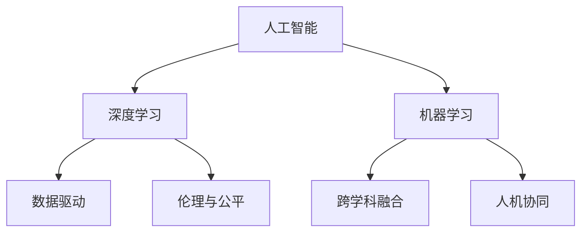

                 

# 硅谷的AI竞赛：贾扬清观察，产品落地与基础研究并重

> 关键词：
1. 人工智能(AI)竞赛
2. 产品落地
3. 基础研究
4. 数据驱动
5. 深度学习
6. 机器学习
7. 硅谷创新

## 1. 背景介绍

### 1.1 问题由来

近年来，人工智能(AI)技术飞速发展，尤其在硅谷，各大科技巨头纷纷加大AI领域的投入，推动了人工智能技术的快速发展。然而，尽管AI技术在学术界取得了诸多突破，但在实际应用中仍面临诸多挑战。如何平衡基础研究与应用落地的关系，实现AI技术的商业化应用，成为了硅谷AI竞赛的核心问题。

### 1.2 问题核心关键点

要理解硅谷AI竞赛的关键点，需要关注以下几个方面：

1. **数据驱动与算法优化**：AI技术的进步离不开大量高质量数据。如何在数据稀缺的条件下，通过算法优化提升AI模型的性能，是硅谷AI竞赛的一个重要挑战。

2. **基础研究与应用落地的平衡**：AI研究往往在基础理论和实际应用之间摇摆。如何在追求理论创新与解决实际问题之间找到平衡点，是硅谷AI竞赛的关键。

3. **跨学科融合**：AI技术不仅需要计算机科学的支撑，还需要生物学、医学、经济学等多学科的合作。如何在不同学科之间建立桥梁，促进交叉创新，是硅谷AI竞赛的核心。

4. **伦理与公平**：随着AI技术的普及，如何确保AI系统的公平性、透明性，避免偏见和歧视，是硅谷AI竞赛中必须面对的问题。

5. **人机协同**：AI系统的目标是辅助人类，而不是替代人类。如何在人机协同中发挥AI的优势，实现高效、精准的智能辅助，是硅谷AI竞赛的重要方向。

### 1.3 问题研究意义

研究硅谷AI竞赛的现状与趋势，对于理解AI技术的发展脉络、推动AI技术的落地应用、促进跨学科的合作创新具有重要意义：

1. **提升AI技术的应用价值**：通过了解硅谷AI竞赛的最新动态，可以更好地将AI技术应用于各行各业，解决实际问题，提高工作效率和生活质量。

2. **促进基础研究的深化**：硅谷AI竞赛的成功案例可以提供宝贵的经验和借鉴，推动AI基础研究的深入，形成更坚实的理论基础。

3. **推动跨学科创新**：硅谷AI竞赛强调多学科的合作，可以加速AI与其他学科的融合，推动新理论、新方法的诞生。

4. **构建伦理规范**：硅谷AI竞赛的竞争中，也伴随着对AI伦理的探讨。通过这些讨论，可以形成更加完善的AI伦理规范，确保AI技术的安全、可靠。

5. **激发产业变革**：硅谷AI竞赛的激烈竞争可以推动AI技术的商业化应用，加速各行业的数字化转型，提升产业竞争力。

## 2. 核心概念与联系

### 2.1 核心概念概述

硅谷AI竞赛的核心概念包括：

1. **人工智能(AI)**：涵盖机器学习、深度学习、自然语言处理等领域的综合性技术。

2. **深度学习(Deep Learning)**：一种特殊的机器学习技术，通过多层神经网络模拟人类大脑的认知过程。

3. **机器学习(Machine Learning)**：通过数据驱动的算法优化，让计算机具备一定的智能推理能力。

4. **数据驱动**：AI技术的发展高度依赖于数据的质量和数量。数据驱动是大数据时代AI技术进步的基石。

5. **跨学科融合**：AI技术需要与其他学科的深度结合，才能实现其潜在的价值。

6. **伦理与公平**：AI技术的应用需遵循伦理规范，确保数据和模型的公平性、透明性。

7. **人机协同**：AI技术的最终目标是人机协同，辅助人类解决复杂问题。

### 2.2 核心概念原理和架构的 Mermaid 流程图



这个流程图展示了AI技术的主要组成部分及其相互关系。人工智能的进步离不开深度学习和机器学习算法的发展，而这些算法又依赖于高质量的数据，同时需要跨学科的合作，并在伦理和公平的框架下实现人机协同，最终推动AI技术在实际应用中的落地。

## 3. 核心算法原理 & 具体操作步骤

### 3.1 算法原理概述

硅谷AI竞赛中的核心算法原理主要围绕以下几个方面展开：

1. **数据增强与扩充**：在数据不足的情况下，通过数据增强技术（如数据回译、数据扩充等）提升模型性能。

2. **模型优化与调整**：通过优化算法（如AdamW、SGD等）和调整超参数（如学习率、批大小、迭代次数等），提升模型的泛化能力和性能。

3. **参数高效微调**：通过固定预训练参数，仅微调顶层部分参数，减少模型复杂度，提高训练效率。

4. **迁移学习**：通过迁移学习技术，将预训练模型的知识应用于新任务，提升模型性能。

5. **对抗训练**：引入对抗样本，提升模型的鲁棒性和泛化能力。

6. **提示学习**：通过精心设计输入模板，引导模型生成高质量输出，减少微调参数。

### 3.2 算法步骤详解

1. **数据准备**：收集、清洗和标注数据集，划分为训练集、验证集和测试集。

2. **模型选择**：选择合适的预训练模型（如BERT、GPT等）作为基础模型。

3. **任务适配**：在预训练模型的基础上，设计并添加任务特定的输出层和损失函数。

4. **模型微调**：使用深度学习框架（如PyTorch、TensorFlow等）进行模型微调，通过优化算法和调整超参数，提升模型性能。

5. **模型评估**：在测试集上评估微调后模型的性能，对比微调前后的精度提升。

6. **模型部署**：将微调后的模型集成到实际应用中，进行规模化部署。

### 3.3 算法优缺点

硅谷AI竞赛中的算法优缺点如下：

**优点**：

1. **高效**：通过预训练模型，可以在较少的标注样本下快速提升模型性能，实现高效的AI技术落地。

2. **灵活**：算法具备高度灵活性，可以根据具体任务需求进行调整和优化。

3. **可解释性**：通过微调过程的优化和调整，可以更好地理解模型的决策逻辑。

**缺点**：

1. **依赖数据**：模型的性能高度依赖于数据的质量和数量，数据不足的情况下性能难以提升。

2. **复杂度**：算法实现复杂，需要具备较强的算法和工程能力。

3. **资源消耗**：大规模模型的训练和推理消耗大量计算资源，部署成本较高。

4. **过拟合风险**：在数据不足的情况下，模型容易过拟合，泛化能力受限。

5. **公平性问题**：数据和模型中可能存在偏见，导致模型输出不公平。

### 3.4 算法应用领域

硅谷AI竞赛中的算法广泛应用于以下领域：

1. **自然语言处理(NLP)**：如文本分类、情感分析、问答系统等。

2. **计算机视觉(CV)**：如图像识别、目标检测、图像生成等。

3. **推荐系统**：如商品推荐、内容推荐、个性化推荐等。

4. **医疗健康**：如医疗影像分析、疾病诊断、健康监测等。

5. **金融科技**：如风险评估、交易预测、信用评分等。

6. **智能制造**：如质量检测、设备维护、智能调度等。

7. **智慧城市**：如交通管理、环境监测、公共安全等。

## 4. 数学模型和公式 & 详细讲解 & 举例说明

### 4.1 数学模型构建

在硅谷AI竞赛中，模型的构建主要基于以下数学模型：

1. **损失函数**：用于衡量模型预测输出与真实标签之间的差异，常见的损失函数包括交叉熵损失、均方误差损失等。

2. **优化算法**：通过优化算法最小化损失函数，更新模型参数，常见的优化算法包括AdamW、SGD等。

3. **数据增强**：通过数据增强技术扩充训练集，常见的数据增强方法包括数据回译、数据扩充等。

4. **迁移学习**：通过迁移学习技术，将预训练模型的知识应用于新任务，提升模型性能。

### 4.2 公式推导过程

以二分类任务为例，推导交叉熵损失函数及其梯度的计算公式：

1. **交叉熵损失函数**：

$$
\ell(y, \hat{y}) = -y \log \hat{y} - (1-y) \log(1-\hat{y})
$$

其中 $y$ 为真实标签，$\hat{y}$ 为模型预测概率。

2. **梯度计算**：

$$
\frac{\partial \ell(y, \hat{y})}{\partial \theta} = -\frac{1}{N}\sum_{i=1}^N \left( \frac{y_i}{\hat{y}_i} - \frac{1-y_i}{1-\hat{y}_i} \right) \frac{\partial \hat{y}_i}{\partial \theta}
$$

其中 $\theta$ 为模型参数，$\hat{y}_i$ 为模型在第 $i$ 个样本上的预测概率，$\frac{\partial \hat{y}_i}{\partial \theta}$ 为模型参数的梯度。

3. **模型训练**：

$$
\theta \leftarrow \theta - \eta \nabla_{\theta}\ell(\theta, D)
$$

其中 $\eta$ 为学习率，$D$ 为训练集。

### 4.3 案例分析与讲解

以医疗影像分类为例，分析模型训练和优化过程：

1. **数据准备**：收集医疗影像数据，并标注影像类别。

2. **模型选择**：选择预训练模型ResNet作为基础模型。

3. **任务适配**：在ResNet的顶层添加全连接层和Softmax函数，设计交叉熵损失函数。

4. **模型微调**：使用AdamW优化算法，在标注数据上训练模型。

5. **模型评估**：在测试集上评估模型性能，计算准确率、召回率等指标。

6. **模型部署**：将微调后的模型集成到医疗影像分类系统中，进行实际应用。

## 5. 项目实践：代码实例和详细解释说明

### 5.1 开发环境搭建

1. **安装PyTorch**：

```bash
pip install torch torchvision torchaudio
```

2. **安装TensorFlow**：

```bash
pip install tensorflow
```

3. **安装Numpy、Pandas、Scikit-learn等工具包**：

```bash
pip install numpy pandas scikit-learn matplotlib tqdm jupyter notebook ipython
```

4. **安装相关库**：

```bash
pip install transformers
```

### 5.2 源代码详细实现

以下是一个使用PyTorch进行医疗影像分类的示例代码：

```python
import torch
from torch.utils.data import DataLoader
from transformers import ResNet, ResNetFeatureExtractor

# 加载预训练ResNet模型和特征提取器
model = ResNet.from_pretrained('resnet18')
feature_extractor = ResNetFeatureExtractor.from_pretrained('resnet18')

# 准备数据
train_dataset = YourMedicalImageDataset()
train_dataloader = DataLoader(train_dataset, batch_size=32)

# 定义损失函数和优化器
criterion = torch.nn.CrossEntropyLoss()
optimizer = torch.optim.Adam(model.parameters(), lr=0.001)

# 模型微调
device = torch.device('cuda' if torch.cuda.is_available() else 'cpu')
model.to(device)
for epoch in range(10):
    model.train()
    for images, labels in train_dataloader:
        images = images.to(device)
        labels = labels.to(device)
        outputs = model(feature_extractor(images, return_tensors='pt'))
        loss = criterion(outputs.logits, labels)
        optimizer.zero_grad()
        loss.backward()
        optimizer.step()

# 模型评估
model.eval()
test_dataset = YourMedicalImageDataset(test=True)
test_dataloader = DataLoader(test_dataset, batch_size=32)
correct = 0
total = 0
with torch.no_grad():
    for images, labels in test_dataloader:
        images = images.to(device)
        labels = labels.to(device)
        outputs = model(feature_extractor(images, return_tensors='pt'))
        _, predicted = torch.max(outputs.logits, 1)
        total += labels.size(0)
        correct += (predicted == labels).sum().item()
print('Accuracy: {:.2f}%'.format(100 * correct / total))
```

### 5.3 代码解读与分析

**数据准备**：

- `YourMedicalImageDataset`：定义医疗影像数据集，包含影像路径和标签。

**模型微调**：

- `ResNet`：加载预训练ResNet模型。
- `ResNetFeatureExtractor`：加载特征提取器。
- `CrossEntropyLoss`：定义交叉熵损失函数。
- `Adam`：定义优化器。
- `.to(device)`：将模型和数据转移到GPU上。

**模型训练**：

- `model.train()`：将模型设置为训练模式。
- `for images, labels in train_dataloader:`：遍历训练集数据。
- `images.to(device)`：将影像数据转移到GPU上。
- `labels.to(device)`：将标签数据转移到GPU上。
- `outputs = model(feature_extractor(images, return_tensors='pt'))`：特征提取和模型前向传播。
- `loss = criterion(outputs.logits, labels)`：计算损失。
- `optimizer.zero_grad()`：清空梯度。
- `loss.backward()`：反向传播。
- `optimizer.step()`：更新模型参数。

**模型评估**：

- `model.eval()`：将模型设置为评估模式。
- `test_dataset = YourMedicalImageDataset(test=True)`：加载测试集数据集。
- `test_dataloader = DataLoader(test_dataset, batch_size=32)`：创建测试集数据加载器。
- `with torch.no_grad():`：开启无梯度模式，避免计算梯度。
- `predicted = torch.max(outputs.logits, 1)[1]`：计算预测结果。
- `correct += (predicted == labels).sum().item()`：计算正确预测数量。

**运行结果展示**：

- `print('Accuracy: {:.2f}%'.format(100 * correct / total))`：打印模型准确率。

## 6. 实际应用场景

### 6.1 智能客服系统

基于AI的智能客服系统通过自然语言处理技术，能够自动理解客户咨询意图，生成应答回复，极大提升客户服务体验。硅谷AI竞赛中的自然语言处理技术在智能客服系统中的应用，展示了AI技术的强大应用价值。

1. **数据准备**：收集历史客户咨询记录，标注问题和答案。

2. **模型选择**：选择BERT等预训练模型，并进行微调。

3. **任务适配**：设计问答系统，训练模型识别问题和应答生成。

4. **模型部署**：集成到客服系统中，提供自然语言互动。

5. **持续优化**：通过客户反馈和数据分析，不断优化模型，提升服务质量。

### 6.2 金融科技

硅谷AI竞赛中的AI技术在金融科技领域也有广泛应用，如风险评估、交易预测、信用评分等。通过分析大量的交易数据，AI模型能够识别出潜在的风险，辅助金融决策。

1. **数据准备**：收集金融交易数据，标注交易类别和风险等级。

2. **模型选择**：选择预训练模型，并进行微调。

3. **任务适配**：设计风险评估系统，训练模型识别交易风险。

4. **模型部署**：集成到交易系统中，提供实时风险评估。

5. **持续优化**：通过数据分析和反馈，不断优化模型，提升风险评估的准确性。

### 6.3 医疗健康

在医疗健康领域，AI技术可以用于疾病诊断、影像分类、健康监测等。硅谷AI竞赛中的医疗影像分类技术，通过分析影像数据，辅助医生进行诊断和治疗决策。

1. **数据准备**：收集医疗影像数据，标注影像类别。

2. **模型选择**：选择预训练模型，并进行微调。

3. **任务适配**：设计医疗影像分类系统，训练模型识别影像类型。

4. **模型部署**：集成到医疗系统中，提供实时影像分析。

5. **持续优化**：通过医生反馈和数据分析，不断优化模型，提升诊断准确性。

## 7. 工具和资源推荐

### 7.1 学习资源推荐

1. **《Deep Learning》书籍**：Ian Goodfellow所著，详细介绍了深度学习的理论基础和实践应用。

2. **CS231n《深度学习与计算机视觉》课程**：斯坦福大学开设的计算机视觉课程，涵盖图像分类、目标检测等领域的经典技术。

3. **Transformers库官方文档**：HuggingFace开发的NLP工具库，提供了丰富的预训练模型和微调样例。

4. **Kaggle竞赛平台**：通过参与Kaggle竞赛，可以接触到各种实际应用场景和优秀解决方案，积累实战经验。

5. **Coursera《人工智能基础》课程**：由吴恩达教授主讲的AI入门课程，涵盖AI技术的各个方面。

### 7.2 开发工具推荐

1. **PyTorch**：深度学习框架，支持动态计算图，适合研究和实验。

2. **TensorFlow**：由Google主导开发的深度学习框架，适合生产部署。

3. **Weights & Biases**：模型训练实验跟踪工具，支持可视化和监控。

4. **TensorBoard**：TensorFlow配套的可视化工具，支持实时监控和模型调试。

5. **Jupyter Notebook**：交互式编程环境，支持实时预览和调试。

### 7.3 相关论文推荐

1. **Attention is All You Need**：Transformer原论文，提出了自注意力机制，开创了预训练大模型的新时代。

2. **BERT: Pre-training of Deep Bidirectional Transformers for Language Understanding**：提出了BERT模型，引入了基于掩码的自监督预训练任务。

3. **Language Models are Unsupervised Multitask Learners**：展示了深度语言模型的强大零样本学习能力，推动了语言模型的研究。

4. **Parameter-Efficient Transfer Learning for NLP**：提出了Adapter等参数高效微调方法，提高了微调的效率和效果。

5. **AdaLoRA: Adaptive Low-Rank Adaptation for Parameter-Efficient Fine-Tuning**：通过自适应低秩适应的微调方法，提升了微调模型的参数效率。

## 8. 总结：未来发展趋势与挑战

### 8.1 研究成果总结

硅谷AI竞赛展示了AI技术的强大应用潜力和广泛应用场景，推动了AI技术在各行各业的落地。通过数据驱动和模型优化，AI技术在医疗、金融、客服等多个领域取得了显著进展。

### 8.2 未来发展趋势

1. **数据驱动**：随着数据的积累和标注工作的进展，数据驱动的AI技术将进一步提升模型的性能。

2. **跨学科融合**：AI技术与多学科的深度融合，将推动更多创新技术的诞生。

3. **伦理与公平**：AI技术的伦理与公平问题将受到更多关注，推动AI技术的可持续发展。

4. **人机协同**：AI技术将进一步增强人机协同，提升人类工作效率和生活质量。

5. **可解释性与可控性**：AI技术的可解释性和可控性将得到更多重视，确保AI技术的安全和可靠。

### 8.3 面临的挑战

1. **数据获取**：高质量数据获取困难，数据不足将成为AI技术发展的瓶颈。

2. **模型复杂性**：大规模模型的训练和推理成本高昂，需要更加高效的算法和硬件支持。

3. **伦理与安全**：AI技术的伦理与安全问题需进一步研究，避免偏见和歧视。

4. **公平性与透明性**：确保AI技术的公平性和透明性，避免数据偏见和算法歧视。

5. **人机协同**：在提升AI技术性能的同时，需确保人类在决策中的主导地位。

### 8.4 研究展望

未来，硅谷AI竞赛将继续推动AI技术的发展，以下是几个可能的研究方向：

1. **数据增强与扩充**：通过数据增强技术提升模型性能，缓解数据不足的问题。

2. **跨模态融合**：推动视觉、语音、文本等多模态数据的融合，提升模型的综合能力。

3. **伦理与公平**：通过AI伦理研究，确保AI技术的安全、可靠、公正。

4. **人机协同**：推动AI技术与人类决策的深度融合，实现高效协同。

5. **模型压缩与优化**：通过模型压缩和优化技术，提升AI技术的计算效率和推理速度。

## 9. 附录：常见问题与解答

**Q1: 数据驱动在AI竞赛中的重要性是什么？**

A: 数据驱动是AI竞赛成功的关键，高质量的数据是提升模型性能的基础。通过数据增强和扩充技术，可以在数据不足的情况下，提升模型的泛化能力和性能。

**Q2: 如何选择合适的模型和任务适配层？**

A: 在选择模型时，需要根据具体任务的需求选择合适的预训练模型。在任务适配层的设计上，需要考虑任务的特征和目标，设计合适的输出层和损失函数。

**Q3: 如何缓解模型的过拟合问题？**

A: 过拟合是AI竞赛中的常见问题，可以通过数据增强、正则化、对抗训练等技术缓解。同时，可以通过参数高效微调，减少模型的复杂度，避免过拟合。

**Q4: 如何提升模型的可解释性？**

A: 通过优化模型的决策过程，使其具备更好的可解释性。同时，可以通过提示学习等技术，减少微调参数，提升模型的可解释性。

**Q5: 如何确保AI技术的伦理与安全？**

A: 通过AI伦理研究，确保AI技术的安全、可靠、公正。在模型设计和应用中，需考虑数据偏见、算法歧视等问题，确保AI技术的公平性和透明性。

综上所述，硅谷AI竞赛展示了AI技术在实际应用中的强大潜力和广阔前景。通过数据驱动和模型优化，AI技术在医疗、金融、客服等多个领域取得了显著进展。未来，随着AI技术的不断发展和完善，将为各行各业带来更深刻的变化和创新。

---

作者：禅与计算机程序设计艺术 / Zen and the Art of Computer Programming

