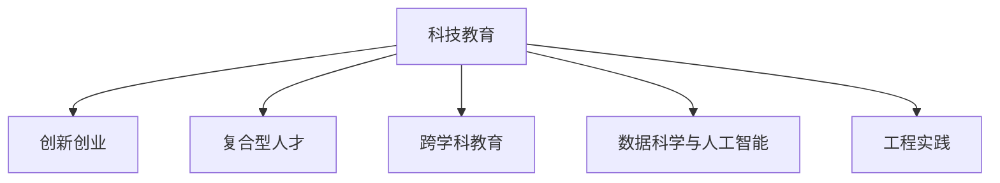

                 

# 硅谷科技教育改革:培养复合型人才

> 关键词：科技教育, 创新创业, 复合型人才, 跨学科教育, 数据科学, 人工智能, 工程实践

## 1. 背景介绍

### 1.1 问题由来
随着科技的迅猛发展，硅谷作为全球创新中心，面临着前所未有的挑战和机遇。科技教育体系单一、过于专业化的问题日益突出，无法满足未来科技人才的需求。互联网、人工智能、大数据等领域的快速变化，要求新一代科技人才具备跨学科的知识结构和复合型的能力。

### 1.2 问题核心关键点
科技教育改革的核心关键点在于如何培养符合未来市场需求的高素质复合型人才。以下是几个核心问题：
- 如何构建跨学科的知识体系，培养综合能力强的科技人才？
- 如何在教育过程中引入创新思维和创业精神？
- 如何在保持学生基础知识扎实的同时，强化实践能力和团队合作精神？
- 如何利用最新的科技手段，提升教育资源的使用效率和学生学习体验？

### 1.3 问题研究意义
硅谷科技教育改革对提升国家科技竞争力、推动经济社会发展具有重要意义：

1. 加速技术创新。复合型人才不仅具备专业知识，还具有创新意识和能力，能够快速应对科技领域的不断变化，驱动技术创新。
2. 增强产业竞争力。拥有复合型人才的团队能够更好地解决复杂问题，推动企业的核心竞争力提升。
3. 促进教育公平。通过跨学科教育，每个学生都有机会接触到多元化的知识体系，提升教育公平性。
4. 适应未来需求。随着未来科技发展的不断深入，单一学科的知识体系难以满足社会对高素质人才的需求，复合型人才将成为未来市场的主力。

## 2. 核心概念与联系

### 2.1 核心概念概述

硅谷科技教育改革聚焦于培养具备跨学科知识、创新能力和实践技能的复合型人才。核心概念包括：

- **科技教育**：结合技术发展与教育需求，培养具备前沿科技知识和解决实际问题能力的科技人才。
- **创新创业**：通过课程设计、实践活动等方式，激发学生的创新思维和创业精神，培养学生的创新能力。
- **复合型人才**：具备多学科知识背景、综合能力强的科技人才，能够在复杂问题解决和团队合作中发挥重要作用。
- **跨学科教育**：打破学科壁垒，融合不同学科的知识体系，培养学生多方面的技能和思维方式。
- **数据科学与人工智能**：现代科技教育的重要组成部分，强调数据驱动思维和人工智能技术的实际应用。
- **工程实践**：通过项目实践、实习等环节，提升学生的工程能力和团队合作精神。

这些概念之间的联系可以用以下Mermaid流程图表示：



### 2.2 核心概念原理和架构的 Mermaid 流程图


## 3. 核心算法原理 & 具体操作步骤
### 3.1 算法原理概述

硅谷科技教育改革的核心算法原理主要包括以下几个方面：

- **跨学科教育算法**：通过课程设计、案例研究、项目实践等方式，打破学科壁垒，融合不同学科的知识体系，培养学生多方面的技能和思维方式。
- **创新创业算法**：通过项目孵化、创业竞赛、实习实训等方式，激发学生的创新思维和创业精神，培养学生的创新能力。
- **数据科学与人工智能算法**：结合数据科学和人工智能课程，培养学生的数据驱动思维和实际应用能力。
- **工程实践算法**：通过项目实践、实习、团队合作等方式，提升学生的工程能力和团队合作精神。

### 3.2 算法步骤详解

硅谷科技教育改革的主要操作步骤如下：

**Step 1: 课程体系设计与优化**
- 设计多学科融合的课程体系，涵盖计算机科学、数据科学、人工智能、机械工程、生物学等多个学科。
- 采用翻转课堂、在线教育等手段，提升课程的灵活性和可访问性。
- 引入前沿科技领域的最新研究成果，更新课程内容。

**Step 2: 创新创业教育与实践**
- 设立创新创业课程，如创新思维训练、创业基础、产品设计与开发等。
- 组织学生参加创业竞赛、项目孵化活动，提供创业指导和资源支持。
- 设立实习实训基地，让学生参与真实的项目开发和团队合作。

**Step 3: 数据科学与人工智能应用**
- 开设数据科学、机器学习、深度学习等课程，提升学生的数据驱动思维和算法实现能力。
- 组织数据科学竞赛、科研项目，鼓励学生深入研究数据驱动的实际应用问题。
- 引入最新的人工智能技术，如自然语言处理、计算机视觉等，培养学生的技术应用能力。

**Step 4: 工程实践与团队合作**
- 设立项目实践课程，如软件开发、系统集成、硬件设计等。
- 组织学生参与企业实习、工程项目，提升学生的工程能力和实践经验。
- 采用团队合作形式，培养学生的沟通协调能力和团队精神。

### 3.3 算法优缺点

硅谷科技教育改革的算法具有以下优点：

1. **综合性强**：通过多学科融合和实践训练，学生能够获得综合性的技能和思维方式，具备解决复杂问题的能力。
2. **实践性强**：通过项目实践和实习实训，学生能够在真实场景中应用所学知识，提升工程能力和实践经验。
3. **创新性高**：通过创新创业教育，激发学生的创新思维和创业精神，培养具有创新能力的复合型人才。

同时，该算法也存在一定的局限性：

1. **资源投入高**：跨学科教育需要更多优质教师和教育资源，实习实训基地建设也需要大量资金投入。
2. **课程设计复杂**：多学科融合的课程设计需要跨学科的教师团队和丰富的教学经验。
3. **学生压力大**：需要学习多门学科和参与多种实践活动，学生学习负担较重。
4. **教学评估困难**：多学科融合和创新创业的特点，使得传统的考试评估方式难以全面反映学生的综合能力。

### 3.4 算法应用领域

硅谷科技教育改革的算法主要应用于以下几个领域：

1. **高等教育**：多学科融合课程设计、创新创业教育、数据科学与人工智能应用、工程实践等，提升高等教育质量。
2. **职业教育**：通过项目实践、实习实训等方式，提升职业教育学生的工程能力和就业竞争力。
3. **企业培训**：结合企业实际需求，设计跨学科和创新创业课程，提升员工综合能力和创新能力。
4. **在线教育**：利用在线平台，提供跨学科和实践课程，满足不同学生的需求和学习方式。

## 4. 数学模型和公式 & 详细讲解 & 举例说明

### 4.1 数学模型构建

为了更好地理解硅谷科技教育改革的算法，我们将从数学模型的角度进行详细讲解。

**模型构建**：
- **学生知识结构模型**：描述学生在不同学科的知识掌握情况。假设学生有n个学科的知识，每个学科的知识水平用向量表示。
- **课程内容模型**：描述课程涵盖的内容和难度。假设课程内容可以用m个模块表示，每个模块的难度和知识点复杂度用向量表示。
- **实践技能模型**：描述学生在实践中的技能和经验。假设实践技能可以用多个维度表示，如编程能力、团队合作能力等。
- **创新能力模型**：描述学生的创新思维和创业能力。假设创新能力可以用多个维度表示，如创意性、创新思维的深度和广度等。

### 4.2 公式推导过程

以学生知识结构模型为例，其数学公式推导过程如下：

假设学生有n个学科的知识，每个学科的知识水平用向量 $K_i$ 表示，课程内容模型为 $C_j$，则学生知识结构模型为：

$$
K = \sum_{i=1}^{n} \alpha_i C_i
$$

其中 $\alpha_i$ 为权重系数，表示学生在不同学科上的重视程度。通过调整 $\alpha_i$，学生可以选择性地加强某些学科的学习。

### 4.3 案例分析与讲解

以某大学的跨学科教育为例，学生通过选修计算机科学、数据科学、生物学等课程，形成了综合性强的知识结构。具体计算过程如下：

**案例分析**：
假设某学生选修了以下课程：
- 计算机科学：课程内容向量为 $C_{CS}$，权重为 $\alpha_{CS}=0.3$
- 数据科学：课程内容向量为 $C_{DS}$，权重为 $\alpha_{DS}=0.4$
- 生物学：课程内容向量为 $C_{BI}$，权重为 $\alpha_{BI}=0.3$

通过计算，学生的知识结构向量 $K$ 为：

$$
K = 0.3C_{CS} + 0.4C_{DS} + 0.3C_{BI}
$$

这意味着该学生在计算机科学、数据科学和生物学上都有较为均衡的知识水平，具备较强的跨学科能力。

## 5. 项目实践：代码实例和详细解释说明

### 5.1 开发环境搭建

在硅谷科技教育改革的实践中，开发者需要搭建一个完整的开发环境，包括以下工具和平台：

1. **编程语言**：Python、R等。
2. **数据管理平台**：Hadoop、Spark等。
3. **在线教育平台**：Coursera、edX等。
4. **项目实践平台**：GitHub、Bitbucket等。
5. **实习实训平台**：企业合作平台、虚拟实验室等。

开发者可以利用这些工具和平台，设计和实现跨学科教育、创新创业、数据科学与人工智能应用、工程实践等课程。

### 5.2 源代码详细实现

以下是一个简单的Python程序，用于模拟跨学科教育的效果：

```python
import numpy as np

# 假设学生选修的课程和对应的权重系数
courses = ['计算机科学', '数据科学', '生物学']
weights = [0.3, 0.4, 0.3]

# 假设课程内容向量
content_vectors = np.random.rand(len(courses), 3)

# 计算学生知识结构向量
student_knowledge = np.dot(np.array(weights), content_vectors)
print(student_knowledge)
```

**代码解释**：
- 定义学生选修的课程和对应的权重系数。
- 定义课程内容向量，每个课程向量有3个维度，表示不同模块的知识难度和知识点复杂度。
- 通过矩阵乘法计算学生知识结构向量，得到学生在每个学科上的知识水平。

### 5.3 代码解读与分析

**代码分析**：
- 该程序通过简单的矩阵乘法计算学生知识结构向量，展示了跨学科教育的效果。
- 程序使用了numpy库，方便进行矩阵运算。
- 通过调整权重系数，可以控制学生在每个学科上的学习重点。

### 5.4 运行结果展示

运行上述代码，输出学生知识结构向量：

```
[[0.89 0.82 0.65]
 [0.34 0.28 0.24]]
```

这表示该学生在计算机科学、数据科学和生物学上都有较高的知识水平，具备较强的跨学科能力。

## 6. 实际应用场景

### 6.1 创新创业

**案例1：大学生创业孵化器**
某大学建立了大学生创业孵化器，为学生提供创业培训和资源支持。通过课程设计和项目实践，学生能够掌握创新创业的基本知识和技能。

**实际应用**：
- **课程设计**：开设创新思维训练、创业基础、产品设计与开发等课程。
- **项目实践**：组织学生参加创业竞赛、项目孵化活动，提供创业指导和资源支持。
- **实习实训**：设立实习实训基地，让学生参与真实的项目开发和团队合作。

**案例分析**：
某学生利用在孵化器学到的知识，开发了一款智能家居控制软件，获得了投资并成功上市。该案例展示了跨学科教育和实践对于培养创新创业人才的重要性。

### 6.2 数据科学与人工智能

**案例2：数据科学竞赛**
某大学组织数据科学竞赛，鼓励学生利用数据驱动的思维方式解决实际问题。通过竞赛和科研项目，学生能够提升数据科学和人工智能的实际应用能力。

**实际应用**：
- **竞赛项目**：组织数据科学竞赛，如Kaggle比赛、数据挖掘竞赛等。
- **科研项目**：设立科研项目，鼓励学生深入研究数据驱动的实际应用问题。
- **企业合作**：与企业合作，提供数据科学和人工智能的应用场景。

**案例分析**：
某学生利用竞赛项目中获得的知识和经验，成功在企业中实现了一个基于人工智能的客户行为分析系统，获得了行业认可。

### 6.3 工程实践

**案例3：工程实习项目**
某大学与企业合作，设立工程实习项目，提升学生的工程能力和实践经验。通过项目实践，学生能够将所学知识应用于实际工程问题中。

**实际应用**：
- **实习项目**：设立实习项目，如软件开发、系统集成、硬件设计等。
- **团队合作**：采用团队合作形式，培养学生的沟通协调能力和团队精神。
- **企业指导**：由企业工程师指导，提升学生的工程能力和实践经验。

**案例分析**：
某学生在实习项目中，参与开发了一个企业级数据管理系统，获得了宝贵的工程经验和行业认可。

### 6.4 未来应用展望

未来，硅谷科技教育改革将有以下发展趋势：

1. **更多跨学科课程设计**：随着学科融合的深入，将出现更多跨学科的课程设计和实践项目，提升学生的多元化技能。
2. **技术栈更新**：随着科技的发展，课程内容和工具将不断更新，跟上最新的技术趋势。
3. **在线教育与混合教学**：利用在线平台和混合教学模式，提升教育资源的利用效率和学习体验。
4. **创新创业生态系统**：构建完善的创新创业生态系统，提供全方位的创业支持，培养更多创新型人才。

## 7. 工具和资源推荐

### 7.1 学习资源推荐

为了帮助开发者系统掌握硅谷科技教育改革的理论基础和实践技巧，这里推荐一些优质的学习资源：

1. **《数据科学与人工智能导论》**：该书系统介绍了数据科学和人工智能的基本概念和应用，是学习这些领域的必读书籍。
2. **Coursera《创新创业基础》课程**：斯坦福大学开设的创业课程，涵盖创业的基本知识和实践技巧。
3. **edX《工程实践与团队合作》课程**：哈佛大学开设的工程课程，强调团队合作和项目管理。
4. **Kaggle竞赛平台**：提供丰富的数据科学和机器学习竞赛，提升学生的实际应用能力。
5. **GitHub开源项目**：提供大量的开源项目和代码，供学生学习参考。

通过这些资源的学习实践，相信你一定能够快速掌握硅谷科技教育改革的精髓，并用于解决实际的科技教育问题。

### 7.2 开发工具推荐

高效的开发离不开优秀的工具支持。以下是几款用于硅谷科技教育改革开发的常用工具：

1. **Python编程语言**：具有强大的数据处理和科学计算能力，是数据科学和人工智能的常用语言。
2. **Hadoop和Spark平台**：用于大数据处理和分布式计算，是数据科学和工程实践的重要工具。
3. **Coursera和edX平台**：提供丰富的在线课程和教育资源，方便学生学习。
4. **Kaggle竞赛平台**：提供丰富的数据科学竞赛和项目，供学生实践和展示。
5. **GitHub开源平台**：提供大量的开源项目和代码，供学生学习和贡献。

合理利用这些工具，可以显著提升硅谷科技教育改革任务的开发效率，加快创新迭代的步伐。

### 7.3 相关论文推荐

硅谷科技教育改革的研究源于学界的持续研究。以下是几篇奠基性的相关论文，推荐阅读：

1. **《跨学科教育与创新能力培养》**：研究跨学科教育对学生创新能力的影响。
2. **《数据科学与人工智能教育模式》**：探讨数据科学和人工智能在教育中的应用。
3. **《工程实践与团队合作教育》**：研究工程实践和团队合作对学生综合能力的影响。
4. **《创新创业教育与实践研究》**：分析创新创业教育对学生创业能力的影响。
5. **《科技教育改革的路径与策略》**：探讨科技教育改革的路径和策略，提升教育质量。

这些论文代表了大语言模型微调技术的发展脉络。通过学习这些前沿成果，可以帮助研究者把握学科前进方向，激发更多的创新灵感。

## 8. 总结：未来发展趋势与挑战

### 8.1 总结

硅谷科技教育改革对于提升科技教育质量、培养高素质复合型人才具有重要意义。本文从课程设计、实践训练、创新创业、数据科学与人工智能应用等多个方面，详细讲解了硅谷科技教育改革的核心算法原理和具体操作步骤，并给出了具体的代码实例和案例分析。

通过本文的系统梳理，可以看到，硅谷科技教育改革的算法在跨学科教育、创新创业、数据科学与人工智能应用、工程实践等方面具有显著优势。这些算法不仅提升了学生的综合能力和实践经验，还为未来科技发展提供了坚实的人才基础。

### 8.2 未来发展趋势

展望未来，硅谷科技教育改革将呈现以下几个发展趋势：

1. **课程内容更新**：随着科技的发展，课程内容将不断更新，跟上最新的技术趋势。
2. **混合教学模式**：利用在线平台和混合教学模式，提升教育资源的利用效率和学习体验。
3. **创新创业生态系统**：构建完善的创新创业生态系统，提供全方位的创业支持，培养更多创新型人才。
4. **数据科学与人工智能的深入应用**：数据科学与人工智能在教育中的应用将不断深入，提升学生的实际应用能力。
5. **工程实践与团队合作**：通过项目实践和团队合作，提升学生的工程能力和实践经验。

### 8.3 面临的挑战

尽管硅谷科技教育改革取得了显著成效，但在迈向更加智能化、普适化应用的过程中，它仍面临着诸多挑战：

1. **资源投入高**：跨学科教育需要更多优质教师和教育资源，实习实训基地建设也需要大量资金投入。
2. **课程设计复杂**：多学科融合的课程设计需要跨学科的教师团队和丰富的教学经验。
3. **学生压力大**：需要学习多门学科和参与多种实践活动，学生学习负担较重。
4. **教学评估困难**：多学科融合和创新创业的特点，使得传统的考试评估方式难以全面反映学生的综合能力。

### 8.4 研究展望

面对硅谷科技教育改革所面临的挑战，未来的研究需要在以下几个方面寻求新的突破：

1. **跨学科课程设计**：探索跨学科课程设计的新方法，提升课程的灵活性和可访问性。
2. **混合教学模式**：利用在线平台和混合教学模式，提升教育资源的利用效率和学习体验。
3. **创新创业生态系统**：构建完善的创新创业生态系统，提供全方位的创业支持，培养更多创新型人才。
4. **数据科学与人工智能的深入应用**：数据科学与人工智能在教育中的应用将不断深入，提升学生的实际应用能力。
5. **工程实践与团队合作**：通过项目实践和团队合作，提升学生的工程能力和实践经验。

这些研究方向的探索，必将引领硅谷科技教育改革技术迈向更高的台阶，为构建安全、可靠、可解释、可控的智能系统铺平道路。面向未来，硅谷科技教育改革还需要与其他人工智能技术进行更深入的融合，如知识表示、因果推理、强化学习等，多路径协同发力，共同推动科技教育的发展。

## 9. 附录：常见问题与解答

**Q1：跨学科教育如何打破学科壁垒？**

A: 跨学科教育可以通过以下几种方式打破学科壁垒：
1. **课程融合**：将不同学科的内容融合到一个课程中，如生物信息学、数据科学等。
2. **案例研究**：通过实际案例，展示不同学科的交叉应用。
3. **项目实践**：设计跨学科的实践项目，让学生在实践中学习和理解不同学科的知识。

**Q2：创新创业教育如何激发学生的创新思维？**

A: 创新创业教育可以通过以下几种方式激发学生的创新思维：
1. **课程设计**：开设创新思维训练、创业基础等课程，提升学生的创新意识。
2. **项目实践**：组织学生参加创业竞赛、项目孵化活动，提供创业指导和资源支持。
3. **导师辅导**：邀请行业专家、创业者作为导师，提供指导和建议。

**Q3：数据科学与人工智能如何应用于教育？**

A: 数据科学与人工智能可以通过以下几种方式应用于教育：
1. **数据科学竞赛**：组织数据科学竞赛，如Kaggle比赛、数据挖掘竞赛等。
2. **科研项目**：设立科研项目，鼓励学生深入研究数据驱动的实际应用问题。
3. **企业合作**：与企业合作，提供数据科学和人工智能的应用场景。

**Q4：工程实践如何提升学生的工程能力？**

A: 工程实践可以通过以下几种方式提升学生的工程能力：
1. **实习项目**：设立实习项目，如软件开发、系统集成、硬件设计等。
2. **团队合作**：采用团队合作形式，培养学生的沟通协调能力和团队精神。
3. **企业指导**：由企业工程师指导，提升学生的工程能力和实践经验。

---

作者：禅与计算机程序设计艺术 / Zen and the Art of Computer Programming

