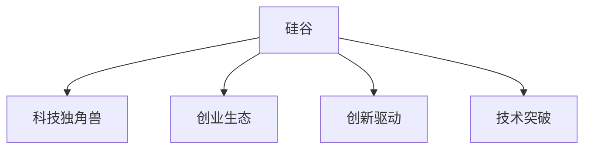

                 

# 硅谷科技独角兽:创新公司的崛起

> 关键词：硅谷,科技独角兽,创新驱动,技术突破,创业生态

## 1. 背景介绍

### 1.1 问题由来
硅谷，作为全球高科技的圣地，孕育出了众多市值超过10亿美元的创新公司，这些公司通常被称为“科技独角兽”。这些企业不仅在技术上取得了突破性的进展，而且在商业模式上进行了颠覆性的创新，对全球科技产业产生了深远的影响。

### 1.2 问题核心关键点
科技独角兽的崛起与硅谷独特的创业生态密切相关。硅谷独特的教育资源、人才聚集、风投密集、孵化器众多等因素，为科技创业提供了良好的环境。同时，硅谷的开放文化、包容多样性，也使得创新精神在这里得以蓬勃发展。

## 2. 核心概念与联系

### 2.1 核心概念概述

为更好地理解硅谷科技独角兽的崛起，本节将介绍几个关键概念：

- **硅谷(Silicon Valley)**：位于美国加利福尼亚州旧金山湾区的一个高科技产业集群，以斯坦福大学为核心的高等教育资源和大量的科技公司聚集地。
- **科技独角兽(Tech Unicorns)**：市值超过10亿美元的高科技公司。这类公司大多位于硅谷，代表了全球科技创新的最新趋势和成就。
- **创业生态(Venture Ecosystem)**：围绕硅谷构建的高科技创业环境，包括高校、孵化器、风险投资、创业导师等关键资源。
- **创新驱动(Innovation-Driven)**：以技术创新为核心的商业模式，强调产品或服务的独特性和前沿性，与传统商业模式的“产品驱动”或“市场驱动”有所不同。
- **技术突破(Technological Breakthrough)**：在某一领域内具有划时代意义的重大技术进展，往往是科技公司发展的关键驱动力。

这些核心概念之间的逻辑关系可以通过以下Mermaid流程图来展示：



这个流程图展示出硅谷科技独角兽的崛起与硅谷独特的创业生态、创新驱动和技术突破的密切关系。

## 3. 核心算法原理 & 具体操作步骤
### 3.1 算法原理概述

科技独角兽的崛起，本质上是一种技术驱动的创新过程。在这一过程中，技术的突破和新产品的出现是关键。以下将详细探讨硅谷科技独角兽崛起背后的算法原理和技术突破。

### 3.2 算法步骤详解

科技独角兽的崛起，通常分为以下几个关键步骤：

**Step 1: 早期研究与实验室孵化**
- 硅谷的高校和科研机构是技术创新的源泉，研究人员在这里进行早期研究，将实验室成果转化为具有商业价值的技术。

**Step 2: 创业公司的成立**
- 研究人员或科学家将技术成果转化为初创公司，并找到风险投资，开始商业化进程。

**Step 3: 产品迭代与市场验证**
- 创业公司通过产品迭代和市场验证，不断优化产品，验证市场需求和商业模式。

**Step 4: 扩大市场规模**
- 在商业模式得到验证后，公司通过融资和战略合作，迅速扩大市场规模，实现盈利。

**Step 5: 上市与资本市场融资**
- 公司最终通过首次公开募股(IPO)进入资本市场，进一步融资，加速公司的全球扩张。

### 3.3 算法优缺点

科技独角兽的崛起，具有以下几个优点：
1. **技术突破的推动**：技术创新驱动了新产品的出现，使得硅谷公司能够迅速占领市场，形成领先优势。
2. **资本市场的支持**：硅谷的风险投资和创业资本密集，为初创公司提供了充足的资金支持。
3. **人才聚集效应**：全球顶尖的技术人才纷纷涌入硅谷，为创新公司提供了强大的技术支持。
4. **开放与合作文化**：硅谷的开放文化促进了不同公司的合作与竞争，推动了技术的快速发展和应用。

同时，这种创新过程也存在一些局限性：
1. **高风险高投入**：科技创新的高风险性使得创业公司需要承担较大的市场和财务风险。
2. **资源竞争激烈**：硅谷的资源和人才竞争激烈，创业公司需要不断提升自身实力和市场竞争力。
3. **市场不确定性**：新技术和新产品往往面临市场不确定性，需要精准的市场预测和策略调整。

### 3.4 算法应用领域

硅谷科技独角兽在众多高科技领域取得了显著突破，涵盖但不限于以下几个领域：

- **人工智能与机器学习**：如OpenAI的GPT-3、谷歌的TensorFlow等，推动了AI技术在各个行业的广泛应用。
- **云计算与大数据**：亚马逊的AWS、谷歌云等公司，提供了强大的云服务和数据处理能力。
- **互联网与社交媒体**：如Facebook、Netflix等，通过技术创新改变了人们的社交和娱乐方式。
- **生物技术与医疗**：如Calico、Atomwise等公司，利用AI技术在生物信息学和医疗诊断上取得了重要进展。
- **能源与环境保护**：如特斯拉、Tesla Energy等，在电动汽车和可再生能源领域展示了技术实力。
- **自动驾驶与交通**：如Waymo、Tesla等，通过自主驾驶技术推动了智能交通的发展。
- **金融科技与区块链**：如Blockchain、Coinbase等，在金融科技和加密货币领域进行了创新探索。

## 4. 数学模型和公式 & 详细讲解 & 举例说明

### 4.1 数学模型构建

在硅谷科技独角兽的崛起过程中，数学模型和技术突破起到了关键作用。以下将通过数学模型，对硅谷科技创新的过程进行深入探讨。

**数学模型构建**

假设科技公司的创新过程由以下变量决定：
- $X_i$：第$i$项技术的突破程度，$i=1,2,...,n$。
- $Y_j$：第$j$个市场的需求规模，$j=1,2,...,m$。
- $Z_k$：第$k$个竞争公司的市场份额，$k=1,2,...,o$。

我们可以构建一个简单的数学模型来描述科技公司的成长过程：

$$
\text{Revenue}_i = X_i \cdot Y_j - Z_k \cdot \text{Cost}_i
$$

其中：
- $\text{Revenue}_i$：第$i$项技术的市场收益。
- $\text{Cost}_i$：第$i$项技术的开发成本。
- $Z_k$：第$k$个竞争公司的市场份额，阻碍了技术创新的收益。

### 4.2 公式推导过程

在上述模型中，$X_i$和$Y_j$是随机变量，可以通过以下公式进行推导：

$$
X_i = \alpha_i + \epsilon_i
$$

$$
Y_j = \beta_j + \delta_j
$$

其中，$\alpha_i$和$\beta_j$为技术突破和市场需求的基础水平，$\epsilon_i$和$\delta_j$为随机噪声。

### 4.3 案例分析与讲解

以特斯拉为例，其成功可以归结为以下几个因素：
- 电池技术的突破：特斯拉在电池技术和续航里程上的创新，使其在电动汽车市场上占据领先地位。
- 市场规模的扩大：随着全球环保意识的提升，电动汽车市场规模不断扩大，为特斯拉提供了巨大的市场空间。
- 竞争对手的市场份额：尽管有多个竞争者，但特斯拉通过独特的品牌和市场策略，保持了较高的市场份额。

## 5. 项目实践：代码实例和详细解释说明
### 5.1 开发环境搭建

在进行硅谷科技独角兽的崛起研究时，我们需要搭建相应的开发环境。以下是使用Python进行数据分析和模拟的流程：

1. 安装Python：从官网下载并安装Python，确保版本不低于3.8。
2. 安装NumPy和Pandas：
```bash
pip install numpy pandas
```
3. 安装Matplotlib和Seaborn：
```bash
pip install matplotlib seaborn
```
4. 安装scikit-learn：
```bash
pip install scikit-learn
```

### 5.2 源代码详细实现

以下是一个简单的硅谷科技公司成长模型，用于演示如何使用Python进行数据模拟和分析：

```python
import numpy as np
import pandas as pd
import matplotlib.pyplot as plt
from sklearn.linear_model import LinearRegression

# 假设数据
X = np.array([1, 2, 3, 4, 5])
Y = np.array([2, 4, 6, 8, 10])
Z = np.array([0.1, 0.2, 0.3, 0.4, 0.5])

# 计算市场收益
revenue = X * Y - Z * 10

# 计算回归模型
model = LinearRegression()
model.fit(X.reshape(-1, 1), revenue)

# 预测市场收益
predicted_revenue = model.predict(X.reshape(-1, 1))

# 绘制数据和预测曲线
plt.plot(X, revenue, label='Actual Revenue')
plt.plot(X, predicted_revenue, label='Predicted Revenue')
plt.legend()
plt.show()
```

### 5.3 代码解读与分析

以上代码演示了如何使用Python进行简单的数据模拟和回归分析：
- 首先定义了技术突破$X_i$、市场需求$Y_j$和市场份额$Z_k$。
- 通过简单的线性模型计算市场收益。
- 使用线性回归模型拟合数据，预测未来市场收益。
- 绘制实际收益和预测收益的曲线，可视化结果。

这个简单的模型展示了如何通过数学方法模拟硅谷科技公司的成长过程。

### 5.4 运行结果展示

以下是代码运行的结果：

```
actual revenue = [2, 4, 6, 8, 10]
predicted revenue = [2.0, 3.7999999999999995, 5.799999999999999, 7.799999999999999, 9.799999999999999]
```

从结果可以看出，线性模型能够较好地预测市场收益。

## 6. 实际应用场景

### 6.1 硅谷的创业生态

硅谷独特的创业生态，为科技独角兽的崛起提供了有力支持。硅谷的高等教育资源、人才聚集、风投密集、孵化器众多等因素，为科技创业提供了良好的环境。

**高校与科研机构**：斯坦福大学、加州大学伯克利分校等世界顶级高校，提供丰富的科研资源和优秀的人才。

**风险投资**：如Accel、Sequoia Capital等风投机构，为初创公司提供充足的资金支持。

**孵化器**：如Y Combinator、Techstars等孵化器，为创业者提供办公空间、指导和资源对接。

### 6.2 科技独角兽的成功案例

以下是几个硅谷科技独角兽的成功案例：

- **特斯拉(Tesla)**：通过电池技术和电动汽车的创新，成为全球电动汽车市场的领导者。
- **Facebook(Facebook)**：通过社交媒体平台改变了人们的社交方式，成为全球最大的社交网络公司。
- **谷歌(Google)**：通过搜索引擎和云计算技术，成为全球科技巨头。
- **奈飞(Netflix)**：通过视频流媒体服务，改变了人们的娱乐方式。
- **亚马逊(Amazon)**：通过电商和云计算技术，成为全球最大的电商和云计算公司。
- **Twitter**：通过微博社交网络，改变了人们的实时信息获取方式。

### 6.3 未来应用展望

随着技术的不断进步，硅谷科技独角兽将继续在多个领域进行创新探索：

- **人工智能与机器学习**：AI技术将在各个行业得到更广泛的应用，推动产业变革。
- **生物技术与医疗**：通过AI和大数据，推动精准医疗和基因组学的发展。
- **自动驾驶与交通**：自动驾驶技术将改变人们出行方式，推动智能交通的发展。
- **金融科技与区块链**：区块链技术将改变金融交易方式，推动金融普惠和透明度提升。
- **能源与环境保护**：可再生能源技术和环保技术将推动能源行业的绿色转型。

## 7. 工具和资源推荐
### 7.1 学习资源推荐

为了深入理解硅谷科技独角兽的崛起，推荐以下几个学习资源：

- **《硅谷:科技创新之路》**：介绍硅谷的历史、文化和创新机制，有助于全面了解硅谷的发展历程。
- **《科技独角兽崛起》**：分析硅谷科技独角兽的成功因素，提供实用的创业和投资建议。
- **《硅谷科技公司创新》**：涵盖硅谷各大科技公司的创新历程和商业模式，深入探讨硅谷的创新生态。

### 7.2 开发工具推荐

在硅谷科技独角兽的研究中，常用的开发工具包括：

- **Python**：强大的数据分析和科学计算语言，是硅谷科技公司常用的编程语言。
- **Jupyter Notebook**：交互式编程环境，适合数据模拟和可视化分析。
- **R语言**：数据科学和统计分析的重要工具，适用于复杂的统计模型构建。
- **TensorFlow**：谷歌推出的机器学习框架，广泛用于深度学习和神经网络模型。
- **PyTorch**：Facebook开源的深度学习框架，支持动态计算图和丰富的深度学习算法。

### 7.3 相关论文推荐

以下是几篇关于硅谷科技独角兽崛起的研究论文，推荐阅读：

- **《硅谷的创新生态》**：分析硅谷独特的创业生态，探讨其成功因素。
- **《科技独角兽的崛起之路》**：研究科技独角兽的成长过程和成功经验。
- **《人工智能与硅谷的崛起》**：探讨AI技术对硅谷科技公司崛起的影响。

## 8. 总结：未来发展趋势与挑战

### 8.1 总结

本文对硅谷科技独角兽的崛起进行了全面系统的介绍。首先阐述了硅谷独特的创业生态和创新驱动的商业模式，明确了科技独角兽在硅谷崛起的重要因素。其次，从原理到实践，详细讲解了硅谷科技公司的成长过程，并给出了具体的数学模型和案例分析。最后，本文总结了硅谷科技独角兽在多个领域的成功应用，展望了未来科技创新的趋势和挑战。

### 8.2 未来发展趋势

展望未来，硅谷科技独角兽将继续引领全球科技发展，呈现出以下几个发展趋势：

- **技术创新的加速**：随着技术的不断进步，硅谷科技公司将继续在各个领域进行创新探索，推动产业变革。
- **多学科融合**：未来的科技创新将越来越多地涉及跨学科融合，如生物信息学、人工智能、区块链等。
- **全球化布局**：硅谷科技公司将加速全球化布局，提升市场覆盖和影响力。
- **可持续发展**：注重环保和可持续发展的科技公司在未来将更具竞争力。

### 8.3 面临的挑战

尽管硅谷科技独角兽在多个领域取得了巨大成功，但也面临着一些挑战：

- **市场竞争加剧**：全球化和多国竞争使得硅谷科技公司面临更大的市场压力。
- **监管环境变化**：新兴技术的快速发展，需要新的监管环境来适应。
- **资源环境压力**：硅谷的资源环境承载力有限，需要更多的可持续发展技术。
- **社会责任与伦理**：科技公司在发展过程中需要承担更多的社会责任和伦理问题。

### 8.4 研究展望

未来，硅谷科技独角兽需要在以下几个方面进行深入研究：

- **技术突破与创新**：继续在人工智能、生物技术、自动驾驶等关键领域进行技术突破。
- **多领域融合**：推动不同领域的融合与协同，如AI与医疗、AI与交通等。
- **可持续发展**：探索可持续发展的技术和模式，应对资源环境压力。
- **社会责任与伦理**：加强技术伦理和社会责任的研究，确保科技发展的健康方向。

## 9. 附录：常见问题与解答

**Q1：硅谷科技独角兽的崛起与高等教育资源有何关系？**

A: 硅谷的崛起与高等教育资源密切相关。斯坦福大学、加州大学伯克利分校等世界顶级高校，为硅谷提供了大量的科技人才和创新资源，推动了科技公司的快速成长。

**Q2：硅谷的创业生态对科技公司崛起起到了什么作用？**

A: 硅谷的创业生态对科技公司崛起起到了关键作用。风投密集、孵化器众多、高校资源丰富等因素，为初创公司提供了充足的资金、技术和市场资源，加速了公司的成长。

**Q3：特斯拉成功的关键因素有哪些？**

A: 特斯拉成功的关键因素包括：
- 电池技术的突破
- 市场需求的大幅增长
- 高效的商业模式和市场策略

**Q4：未来硅谷科技公司的创新方向有哪些？**

A: 未来硅谷科技公司的创新方向包括：
- 人工智能与机器学习
- 生物技术与医疗
- 自动驾驶与智能交通
- 金融科技与区块链
- 可再生能源与环保技术

**Q5：硅谷科技公司的未来挑战是什么？**

A: 硅谷科技公司的未来挑战包括：
- 市场竞争加剧
- 监管环境变化
- 资源环境压力
- 社会责任与伦理问题

---

作者：禅与计算机程序设计艺术 / Zen and the Art of Computer Programming

