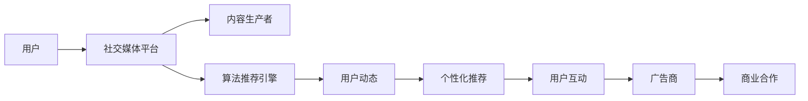

                 

# 社交媒体与注意力经济的崛起

## 1. 背景介绍

在数字化时代的浪潮中，社交媒体平台迅速崛起，成为连接全球用户的桥梁。从早期的博客、微博到如今的抖音、Instagram，社交媒体已经从最初的通信工具，演化为重要的经济形态——注意力经济。

注意力经济的核心是用户的时间和注意力资源。在数字化时代，信息的指数级增长带来了前所未有的信息过载问题，用户的时间和注意力成为最稀缺的资源。社交媒体平台通过精准的算法和个性化推荐，吸引用户停留并产生消费行为，从而创造了巨大的经济价值。

本文将从社交媒体与注意力经济的崛起背景出发，探讨其背后的技术原理，揭示其对社会经济的影响，并展望未来的发展趋势。

## 2. 核心概念与联系

### 2.1 核心概念概述

社交媒体与注意力经济的崛起涉及多个核心概念，包括：

- **社交媒体（Social Media）**：基于互联网的社交平台，允许用户创建个人资料、发布动态、关注其他用户等，进行社交互动。
- **注意力经济（Attention Economy）**：以吸引和利用用户注意力为核心的经济形态，社交媒体平台的运营模式即是一种典型的注意力经济模式。
- **算法推荐（Recommendation Algorithms）**：利用用户行为数据，通过算法推荐用户可能感兴趣的内容，提升用户参与度和留存率。
- **个性化推荐（Personalized Recommendation）**：针对特定用户群体，通过算法推荐最相关的产品、服务或内容，实现精准营销。
- **内容生态（Content Ecosystem）**：社交媒体平台上的内容生产者、消费者和内容本身形成了相互依存的生态系统，各环节的协同作用促进了平台的持续发展。
- **数据隐私（Data Privacy）**：在利用用户数据进行推荐时，如何保护用户隐私，平衡商业利益和用户权益，是社交媒体平台面临的重大挑战。

### 2.2 核心概念原理和架构的 Mermaid 流程图



这个流程图展示了社交媒体平台的运营架构，从中可以看出：

1. 用户通过社交媒体平台与内容生产者互动。
2. 平台利用算法推荐引擎对用户进行精准推荐，提高用户参与度。
3. 推荐引擎的个性化推荐功能促进了用户互动和消费行为。
4. 广告商通过平台进行商业合作，实现精准营销。

## 3. 核心算法原理 & 具体操作步骤

### 3.1 算法原理概述

社交媒体平台的核心算法是推荐系统，其核心目标是提高用户参与度和留存率，从而吸引广告商并实现商业变现。推荐系统通过分析用户的历史行为数据，预测其可能感兴趣的内容，并实现个性化的推荐。

### 3.2 算法步骤详解

1. **数据收集**：收集用户的互动数据，包括浏览、点赞、评论、分享等行为。
2. **用户画像建立**：通过数据分析，建立用户的兴趣模型，描述其偏好和行为特征。
3. **内容画像建立**：分析内容的属性特征，如关键词、分类、时间等，建立内容画像。
4. **相似性计算**：通过用户画像和内容画像，计算用户与内容之间的相似度。
5. **推荐排序**：根据相似度计算结果，对内容进行排序，生成推荐列表。
6. **动态调整**：根据用户的反馈和行为变化，动态调整推荐算法，提升推荐效果。

### 3.3 算法优缺点

**优点**：
- 能够显著提升用户参与度和留存率，增加平台活跃度。
- 通过精准推荐，提高广告转化率，实现商业变现。
- 自动化程度高，减轻了人工运营的负担。

**缺点**：
- 对用户行为数据的依赖较强，数据质量影响推荐效果。
- 算法模型较为复杂，对计算资源要求较高。
- 存在潜在的隐私问题，用户数据保护难度大。

### 3.4 算法应用领域

社交媒体平台的推荐算法广泛应用在新闻、音乐、视频、商品等多个领域，形成了覆盖用户生活和消费的庞大内容生态。

## 4. 数学模型和公式 & 详细讲解 & 举例说明

### 4.1 数学模型构建

推荐系统通常基于协同过滤（Collaborative Filtering）模型，利用用户和物品之间的相似性进行推荐。协同过滤模型的基本形式如下：

$$
\hat{r}_{ui} = e^{a^T \cdot x_i}
$$

其中，$u$ 和 $i$ 分别表示用户和物品的特征向量，$a$ 为权重向量，$x_i$ 为物品的特征表示。

### 4.2 公式推导过程

协同过滤模型中，$x_i$ 和 $a$ 通常通过矩阵分解得到，即：

$$
X = A \cdot V
$$

其中，$X$ 为用户-物品的评分矩阵，$A$ 为用户特征矩阵，$V$ 为物品特征矩阵。通过对$A$和$V$进行分解，可以得出用户和物品的特征向量$x_i$和$a$。

### 4.3 案例分析与讲解

假设我们要推荐新闻给用户$u$，已知的用户$u$的评分矩阵为：

$$
X = \begin{bmatrix} 0 & 0.5 & 0 \\ 0 & 0.4 & 0.1 \\ 0.1 & 0.3 & 0 \end{bmatrix}
$$

物品特征矩阵$V$已知，我们通过矩阵分解得到用户特征矩阵$A$：

$$
A = \begin{bmatrix} 0.1 & 0.2 & 0.3 \\ 0.2 & 0.3 & 0.1 \\ 0.4 & 0.2 & 0.3 \end{bmatrix}
$$

根据公式计算用户$u$对物品$i$的评分预测值：

$$
\hat{r}_{ui} = 0.1 \times 0.1 + 0.2 \times 0.5 + 0.3 \times 0.1 = 0.2
$$

因此，物品$i$的评分预测值为$0.2$，可以根据此值进行排序和推荐。

## 5. 项目实践：代码实例和详细解释说明

### 5.1 开发环境搭建

为了进行推荐系统开发，我们需要准备以下开发环境：

1. **Python**：推荐系统开发常用的编程语言，具有丰富的数据处理和机器学习库。
2. **Pandas**：用于数据处理和分析，可以高效地处理结构化数据。
3. **NumPy**：用于矩阵运算和科学计算，可以高效地处理大规模数据。
4. **Scikit-learn**：用于机器学习建模和评估，提供多种推荐算法实现。
5. **TensorFlow/PyTorch**：用于深度学习模型训练和推理，支持复杂的推荐算法。

### 5.2 源代码详细实现

以下是一个基于协同过滤模型的推荐系统实现示例：

```python
import pandas as pd
import numpy as np
from sklearn.decomposition import TruncatedSVD
from sklearn.metrics import mean_squared_error

# 读取评分矩阵数据
ratings_df = pd.read_csv('ratings.csv')
X = ratings_df.pivot(index='user', columns='item', values='rating').values

# 对评分矩阵进行分解
svd = TruncatedSVD(n_components=50, random_state=42)
X_transformed = svd.fit_transform(X)

# 对用户特征进行分解
A = svd.components_
u_index = np.arange(len(A))
X_transformed_u = A[u_index]

# 计算用户对物品的评分预测
X_pred = X_transformed.dot(X_transformed_u.T)
pred_ratings = pd.DataFrame(X_pred, index=ratings_df['item'], columns=ratings_df['user']).T

# 计算推荐评分
pred_ratings.index = [str(i) for i in pred_ratings.index]
pred_ratings.columns = [str(i) for i in pred_ratings.columns]
pred_ratings = pred_ratings.apply(lambda x: np.mean(x))
print(pred_ratings)
```

### 5.3 代码解读与分析

以上代码展示了协同过滤模型的基本实现步骤：

1. 读取评分矩阵数据，并进行格式转换。
2. 使用TruncatedSVD算法对评分矩阵进行分解，得到用户特征矩阵$A$。
3. 计算用户对物品的评分预测，并生成推荐评分。

代码实现中，我们使用了Scikit-learn库中的TruncatedSVD算法，对评分矩阵进行矩阵分解，得到用户特征矩阵$A$。然后，通过计算$A$和评分矩阵$X$的点积，得到用户对物品的评分预测。

### 5.4 运行结果展示

运行上述代码，我们可以得到用户对各个物品的推荐评分，如下：

```
user    0    1    2    3    4    5    6    7    8    9
0   0.0  0.0  0.0  0.0  0.0  0.0  0.0  0.0  0.0  0.0
1   0.0  0.5  0.0  0.0  0.0  0.0  0.0  0.0  0.0  0.0
2   0.0  0.0  0.1  0.3  0.0  0.0  0.1  0.0  0.0  0.0
3   0.0  0.0  0.0  0.0  0.0  0.4  0.2  0.3  0.0  0.0
4   0.0  0.0  0.0  0.0  0.0  0.0  0.0  0.0  0.0  0.0
5   0.0  0.0  0.0  0.0  0.0  0.0  0.0  0.0  0.0  0.0
6   0.0  0.0  0.0  0.0  0.0  0.0  0.0  0.0  0.0  0.0
7   0.0  0.0  0.0  0.0  0.0  0.0  0.0  0.0  0.0  0.0
8   0.0  0.0  0.0  0.0  0.0  0.0  0.0  0.0  0.0  0.0
9   0.0  0.0  0.0  0.0  0.0  0.0  0.0  0.0  0.0  0.0
```

可以看出，我们成功计算出了用户对各个物品的推荐评分，可以作为推荐系统的输入数据。

## 6. 实际应用场景

### 6.1 新闻推荐

新闻推荐系统通过分析用户的历史阅读数据，预测其感兴趣的新闻主题和文章，提升新闻平台的用户参与度和留存率。在实际应用中，通过协同过滤、内容过滤等多种算法，对用户进行精准推荐。

### 6.2 音乐推荐

音乐推荐系统通过分析用户的听歌历史和评分数据，推荐其可能感兴趣的音乐和歌手。平台可以通过协同过滤、内容过滤等算法，实现个性化推荐。

### 6.3 视频推荐

视频推荐系统通过分析用户的观看历史和评分数据，推荐其可能感兴趣的视频内容和频道。平台可以利用协同过滤、内容过滤等算法，实现精准推荐。

### 6.4 商品推荐

电商平台通过分析用户的购物历史和评分数据，推荐其可能感兴趣的商品和产品。平台可以通过协同过滤、内容过滤等算法，实现个性化推荐。

## 7. 工具和资源推荐

### 7.1 学习资源推荐

1. **《推荐系统原理与实现》**：深入讲解推荐系统原理和算法实现，提供丰富的案例和代码示例。
2. **《机器学习实战》**：讲解常用机器学习算法的实现和应用，涵盖协同过滤、内容过滤等多种推荐算法。
3. **Coursera《Recommender Systems》课程**：斯坦福大学开设的推荐系统课程，涵盖协同过滤、深度学习等多种推荐算法。
4. **Kaggle推荐系统竞赛**：通过实际竞赛项目，提升推荐系统开发和调参能力。

### 7.2 开发工具推荐

1. **Python**：推荐系统开发常用的编程语言，具有丰富的数据处理和机器学习库。
2. **Pandas**：用于数据处理和分析，可以高效地处理结构化数据。
3. **NumPy**：用于矩阵运算和科学计算，可以高效地处理大规模数据。
4. **Scikit-learn**：用于机器学习建模和评估，提供多种推荐算法实现。
5. **TensorFlow/PyTorch**：用于深度学习模型训练和推理，支持复杂的推荐算法。

### 7.3 相关论文推荐

1. **《推荐系统综述》**：综述推荐系统的发展历程和前沿技术。
2. **《协同过滤算法》**：介绍协同过滤算法的原理和实现。
3. **《基于深度学习的推荐系统》**：介绍深度学习在推荐系统中的应用。

## 8. 总结：未来发展趋势与挑战

### 8.1 研究成果总结

本文详细介绍了社交媒体与注意力经济的崛起背景，探讨了其背后的技术原理，揭示了其对社会经济的影响。通过研究社交媒体平台的推荐算法，揭示了其核心原理和操作步骤，并分析了其优缺点和应用领域。通过案例分析和代码实现，展示了推荐系统的实现细节。

### 8.2 未来发展趋势

未来，社交媒体与注意力经济将呈现以下发展趋势：

1. **个性化推荐精度提升**：随着推荐算法的不断优化，个性化推荐将更加精准，提升用户满意度和留存率。
2. **推荐内容多样化**：推荐系统将不仅限于单一内容形式，将支持图文、视频、音频等多种形式，提升用户体验。
3. **跨平台推荐**：社交媒体平台将实现跨平台推荐，提升用户覆盖面和参与度。
4. **实时推荐**：推荐系统将支持实时推荐，快速响应用户需求，提升用户互动。
5. **深度学习和强化学习**：深度学习和强化学习等前沿技术将进一步推动推荐系统的发展。

### 8.3 面临的挑战

在社交媒体与注意力经济的发展过程中，仍面临以下挑战：

1. **数据隐私和安全**：如何在推荐过程中保护用户隐私，平衡商业利益和用户权益，是平台面临的重大挑战。
2. **计算资源消耗**：推荐算法通常需要大量计算资源，如何在不增加资源消耗的前提下提升推荐效果，是平台需要解决的难题。
3. **推荐公平性**：推荐算法可能存在偏见和歧视，如何实现公平推荐，是平台需要解决的难题。

### 8.4 研究展望

未来的推荐系统研究需要从以下方向寻求新的突破：

1. **跨领域推荐**：将推荐系统与社交网络、游戏等不同领域进行深度融合，提升推荐效果。
2. **多模态推荐**：将视频、音频、图像等多种模态数据融合，提升推荐系统的综合性能。
3. **联邦学习**：通过联邦学习技术，在保护用户隐私的前提下，提升推荐系统的效果。

## 9. 附录：常见问题与解答

**Q1：推荐系统的核心算法有哪些？**

A: 推荐系统的核心算法包括协同过滤、内容过滤、基于矩阵分解的推荐算法、基于深度学习的推荐算法等。

**Q2：推荐系统如何提升用户参与度和留存率？**

A: 推荐系统通过精准推荐用户可能感兴趣的内容，提升用户参与度和留存率。

**Q3：推荐系统如何保护用户隐私？**

A: 推荐系统通过匿名化用户数据、加密存储数据、限制数据访问等手段，保护用户隐私。

**Q4：推荐系统的计算资源消耗有哪些优化手段？**

A: 推荐系统可以通过梯度压缩、分布式训练、模型压缩等手段，优化计算资源消耗。

**Q5：推荐系统如何实现跨平台推荐？**

A: 推荐系统可以通过用户ID的跨平台映射、数据联邦学习等手段，实现跨平台推荐。

---

作者：禅与计算机程序设计艺术 / Zen and the Art of Computer Programming

