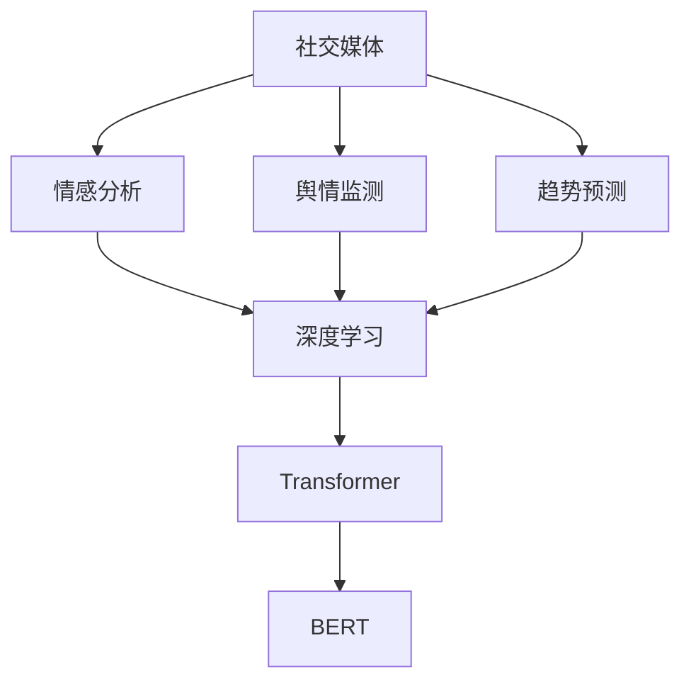

                 

# 社交媒体分析：舆情监测与趋势预测

> 关键词：社交媒体,舆情监测,情感分析,趋势预测,深度学习,Transformer

## 1. 背景介绍

### 1.1 问题由来
在数字化时代，社交媒体已成为信息传播的重要平台，用户在这里分享、讨论、评论各种事件，形成庞大的网络舆情。实时、准确地分析社交媒体上的舆情，对于政府、企业、媒体等都具有重要意义。它可以帮助决策者掌握公众情绪，了解舆论动向，进行舆情预测和风险预警。

传统舆情监测往往依赖于手动分析和关键词搜索，存在数据量有限、分析速度慢、信息获取不完全等问题。随着深度学习技术的迅猛发展，基于深度神经网络的社交媒体分析方法逐渐兴起，能够在短时间内处理海量数据，自动发现舆情趋势，提升舆情监测的效率和精准度。

### 1.2 问题核心关键点
社交媒体分析的核心在于如何利用深度学习技术，从大规模文本数据中抽取语义信息，进而分析和预测社会舆情。主要问题包括：

1. 如何高效处理大规模数据：社交媒体上文本数据量巨大，如何设计高效的模型结构，以低计算成本实现对大量文本数据的快速处理，是一个关键问题。
2. 如何理解多源异构数据：社交媒体数据类型丰富，包括文本、图片、视频、音频等，如何综合利用多种数据源，提升对舆情的全面理解，是一个难点。
3. 如何捕捉语义情感信息：社交媒体上的文本往往情感丰富，包含正向、负向、中性等多种情绪，如何准确识别和抽取这些情感信息，对舆情进行情绪分析，是一个重要课题。
4. 如何发现舆情趋势：舆情不仅是静态的情感表达，更是一个动态过程，如何通过深度学习模型，捕捉舆情变化趋势，进行预测，是另一个关键点。
5. 如何保证分析结果的准确性和鲁棒性：社交媒体数据噪声较多，如何通过算法优化，提高模型对噪声的鲁棒性，减少误报和漏报，是社交媒体分析中一个核心问题。

### 1.3 问题研究意义
研究社交媒体分析的算法和模型，对政府、企业、媒体等机构有着重要的应用价值：

1. 提高舆情监测效率：基于深度学习的社交媒体分析能够快速处理海量数据，显著提高舆情监测的速度和效率。
2. 全面理解舆情信息：通过综合利用不同类型的数据源，能够对舆情进行全面、多角度的理解。
3. 提升舆情分析精度：深度学习模型能够自动抽取文本中的语义信息，对情感进行自动分析，从而提高舆情分析的准确性。
4. 进行舆情趋势预测：利用深度学习模型捕捉舆情变化趋势，预测未来的舆情走向，有助于及时应对舆情危机。
5. 构建舆情预警机制：建立基于深度学习的舆情预警系统，能够实时监测舆情变化，及时预警潜在的舆情风险。

## 2. 核心概念与联系

### 2.1 核心概念概述

要深入理解社交媒体分析的算法，首先需要对核心概念有清晰的认识。以下是几个关键概念的概述：

1. **社交媒体**：指各种用户可以发布、共享和互动的内容平台，包括Twitter、Facebook、微博、微信等。
2. **舆情监测**：指通过算法和工具，对社交媒体上的用户言论进行实时或定期收集、分析和处理，以了解公众情绪和社会态度。
3. **情感分析**：指通过文本分析技术，自动识别和抽取文本中的情感信息，如正向、负向、中性等。
4. **趋势预测**：指基于历史数据和当前舆情信息，通过模型预测未来的舆情变化趋势。
5. **深度学习**：指一类基于神经网络的机器学习方法，能够自动从数据中学习特征表示，进行分类、回归、生成等任务。
6. **Transformer**：一种神经网络结构，常用于自然语言处理任务，能够并行计算，提升模型效率。
7. **BERT**：一种预训练语言模型，通过大量无标签文本预训练，获得强大的语言表示能力，用于下游任务微调。

这些核心概念之间的逻辑关系可以通过以下Mermaid流程图来展示：



这个流程图展示社交媒体分析的核心概念及其相互关系：

1. 社交媒体是数据来源。
2. 舆情监测、情感分析和趋势预测是主要任务。
3. 深度学习是实现这些任务的技术手段。
4. Transformer和BERT是深度学习中的重要模型结构。

## 3. 核心算法原理 & 具体操作步骤

### 3.1 算法原理概述

社交媒体分析的核心算法基于深度学习，主要包括以下几个步骤：

1. **数据收集与预处理**：从社交媒体平台收集数据，并进行清洗和预处理，去除噪声数据。
2. **特征抽取与编码**：将文本数据转换为模型可接受的特征表示，如词嵌入、句向量等。
3. **模型训练与优化**：利用深度学习模型，对数据进行训练和优化，学习舆情特征。
4. **结果分析与预测**：对训练好的模型进行评估，分析舆情信息，并进行趋势预测。

其中，Transformer和BERT在特征抽取和模型训练中起着至关重要的作用。

### 3.2 算法步骤详解

#### 3.2.1 数据收集与预处理

社交媒体数据收集通常使用API接口，获取平台公开的数据。预处理包括文本清洗、分词、去停用词等步骤，以去除无用信息，提升数据质量。

#### 3.2.2 特征抽取与编码

常用的特征抽取方法包括：

- **词嵌入**：使用预训练的词向量模型，如Word2Vec、GloVe等，将文本转换为向量表示。
- **句向量**：使用预训练的句向量模型，如ELMo、SentenceBERT等，将句子转换为向量表示。
- **BERT特征**：直接使用BERT模型的输出作为特征，包含丰富的语义信息。

#### 3.2.3 模型训练与优化

深度学习模型通常包括：

- **情感分类模型**：使用分类器对文本进行情感分类，如逻辑回归、SVM、神经网络等。
- **趋势预测模型**：使用回归器对舆情变化趋势进行预测，如LSTM、GRU等。
- **模型优化**：采用优化算法，如Adam、SGD等，对模型进行优化，提升模型精度和鲁棒性。

#### 3.2.4 结果分析与预测

训练好的模型可以进行舆情分析，并生成趋势预测报告。分析报告包括：

- **情感分布**：展示不同情感的分布比例，识别舆情情绪。
- **关键词分析**：提取文本中的高频关键词，分析舆情关注点。
- **时间趋势**：绘制舆情变化趋势图，分析舆情发展过程。

### 3.3 算法优缺点

社交媒体分析算法具有以下优点：

1. **高效性**：基于深度学习的模型能够快速处理大规模数据，显著提高舆情监测效率。
2. **准确性**：深度学习模型自动抽取语义信息，准确度较高，减少人工干预。
3. **自适应性**：深度学习模型能够自动适应数据变化，具有较强的自适应能力。
4. **鲁棒性**：通过正则化等技术，提升模型对噪声数据的鲁棒性，减少误报和漏报。

同时，算法也存在一些缺点：

1. **数据依赖性强**：算法效果依赖于数据质量和数据量，需要高质量标注数据。
2. **模型复杂度**：深度学习模型结构复杂，训练和调参难度较大。
3. **计算资源需求高**：需要高性能计算资源，如GPU/TPU等。
4. **可解释性差**：深度学习模型为"黑盒"模型，难以解释其决策过程。

### 3.4 算法应用领域

社交媒体分析算法已经在多个领域得到应用，如：

- **政府舆情监测**：帮助政府机构了解公众情绪，进行舆情预警和应对。
- **企业品牌管理**：监测品牌声誉和市场反馈，提升品牌形象。
- **媒体新闻分析**：分析新闻报道中的舆情情绪，辅助新闻编辑和发布。
- **社交网络分析**：分析用户互动和社交网络结构，了解用户群体特征。
- **市场趋势预测**：分析市场舆情变化，预测股票价格、消费趋势等。

## 4. 数学模型和公式 & 详细讲解  
### 4.1 数学模型构建

社交媒体分析的核心是构建深度学习模型，以下给出常见的数学模型构建方式。

### 4.2 公式推导过程

以情感分类模型为例，假设模型输入为文本向量 $x$，输出为情感类别 $y$，目标是最小化交叉熵损失函数 $L(y,\hat{y})$。设模型参数为 $\theta$，则模型输出为 $\hat{y}=f_\theta(x)$。损失函数定义如下：

$$
L(y,\hat{y})=-\sum_{i=1}^N[y_i\log\hat{y_i}+(1-y_i)\log(1-\hat{y_i})]
$$

其中 $y_i$ 为真实标签，$\hat{y_i}$ 为模型预测的概率，$N$ 为样本数。

### 4.3 案例分析与讲解

假设我们有一个包含1000条微博的数据集，使用BERT特征进行情感分类。具体步骤如下：

1. **数据预处理**：收集1000条微博数据，并进行清洗和预处理，去除噪声数据。
2. **特征提取**：使用BERT模型对每条微博进行特征提取，生成向量表示。
3. **模型训练**：构建情感分类模型，如BERT+全连接层，使用交叉熵损失函数进行训练。
4. **模型评估**：在验证集上评估模型性能，调整模型参数。
5. **结果分析**：使用测试集评估模型，分析情感分布，绘制情感分类混淆矩阵。

## 5. 项目实践：代码实例和详细解释说明

### 5.1 开发环境搭建

在开发前，需要搭建好开发环境。以下是一个基于Python的开发环境搭建步骤：

1. 安装Python：从官网下载安装Python。
2. 安装深度学习框架：使用pip安装TensorFlow、PyTorch等深度学习框架。
3. 安装文本处理库：使用pip安装NLTK、SpaCy等文本处理库。
4. 安装BERT模型：使用pip安装HuggingFace的BERT模型，并下载预训练模型。
5. 搭建模型架构：使用Keras、PyTorch等框架搭建模型。

### 5.2 源代码详细实现

以下是使用Keras搭建BERT情感分类模型的代码实现：

```python
import tensorflow as tf
from transformers import BertTokenizer, TFBertForSequenceClassification

# 加载BERT模型和分词器
tokenizer = BertTokenizer.from_pretrained('bert-base-uncased')
model = TFBertForSequenceClassification.from_pretrained('bert-base-uncased', num_labels=2)

# 构建输入序列
def build_input(text):
    tokens = tokenizer.tokenize(text)
    input_ids = [tokenizer.convert_tokens_to_ids(tokens)]
    return input_ids

# 构建数据集
train_dataset = tf.data.Dataset.from_tensor_slices(train_data)
train_dataset = train_dataset.map(build_input).batch(16)

# 训练模型
model.compile(optimizer=tf.keras.optimizers.Adam(learning_rate=2e-5), loss=tf.keras.losses.SparseCategoricalCrossentropy(from_logits=True), metrics=['accuracy'])
model.fit(train_dataset, epochs=3)

# 评估模型
test_dataset = tf.data.Dataset.from_tensor_slices(test_data)
test_dataset = test_dataset.map(build_input).batch(16)
model.evaluate(test_dataset)
```

### 5.3 代码解读与分析

这段代码使用了Keras框架，加载了预训练的BERT模型，并进行了情感分类任务的训练和评估。

1. **数据预处理**：使用分词器将文本转换为token序列。
2. **模型加载**：加载预训练的BERT模型和分类层，并指定输出层为二分类。
3. **输入构建**：将文本转换为模型可接受的输入序列。
4. **数据集构建**：将文本数据转换为模型可处理的格式，并进行批处理。
5. **模型训练**：使用Adam优化器，进行模型训练。
6. **模型评估**：在测试集上评估模型性能，输出准确率等指标。

## 6. 实际应用场景

### 6.1 政府舆情监测

政府机构通过社交媒体分析，能够实时监测舆情变化，了解公众情绪，及时应对舆情危机。例如，在疫情期间，政府可以监测社交媒体上对疫情防控措施的舆情，了解公众的意见和建议，及时调整政策，提升公共卫生水平。

### 6.2 企业品牌管理

企业可以通过社交媒体分析，了解品牌声誉和市场反馈，调整市场策略。例如，通过监测用户对品牌的评论和反馈，及时发现问题，提升产品和服务质量。

### 6.3 媒体新闻分析

新闻机构通过社交媒体分析，能够分析新闻报道中的舆情情绪，辅助新闻编辑和发布。例如，在选举期间，新闻机构可以分析用户对候选人的评论，生成热门话题报道。

### 6.4 社交网络分析

社交媒体分析能够分析用户互动和社交网络结构，了解用户群体特征。例如，通过分析社交网络中用户的互动关系，了解用户兴趣和社交圈，进行用户画像分析。

### 6.5 市场趋势预测

企业可以通过社交媒体分析，分析市场舆情变化，预测股票价格、消费趋势等。例如，通过监测市场对某个行业的舆情，预测该行业的未来发展趋势。

## 7. 工具和资源推荐

### 7.1 学习资源推荐

以下是一些学习社交媒体分析的推荐资源：

1. **《深度学习》课程**：斯坦福大学的深度学习课程，涵盖了深度学习的基本概念和算法。
2. **《自然语言处理》课程**：斯坦福大学的自然语言处理课程，介绍了NLP中的重要算法和技术。
3. **《社交媒体分析》书籍**：介绍社交媒体数据分析的理论和方法，包括舆情监测、情感分析等。
4. **HuggingFace官方文档**：提供大量预训练模型和代码样例，适合学习和实践。
5. **NLTK和SpaCy**：常用的自然语言处理库，提供丰富的文本处理功能。

### 7.2 开发工具推荐

以下是一些常用的社交媒体分析工具：

1. **TensorFlow**：深度学习框架，支持多种模型结构。
2. **PyTorch**：深度学习框架，支持动态计算图。
3. **HuggingFace Transformers**：NLP工具库，提供了多种预训练模型和微调接口。
4. **NLTK和SpaCy**：自然语言处理库，提供丰富的文本处理功能。
5. **Jupyter Notebook**：交互式编程环境，适合数据探索和模型训练。

### 7.3 相关论文推荐

以下是一些重要的社交媒体分析论文：

1. **BERT预训练语言模型**：介绍BERT模型的构建和应用，提供了基于BERT的情感分类和舆情监测方法。
2. **Transformer网络**：介绍Transformer网络结构，提供了多种基于Transformer的NLP模型。
3. **深度学习在舆情分析中的应用**：总结了深度学习在舆情分析中的最新研究成果，包括情感分类、趋势预测等。

## 8. 总结：未来发展趋势与挑战

### 8.1 研究成果总结

社交媒体分析技术近年来取得了显著进展，主要体现在以下几个方面：

1. **模型结构优化**：Transformer和BERT等模型的出现，显著提升了模型的准确性和鲁棒性。
2. **数据处理技术**：通过预训练和微调，能够更好地处理大规模数据和复杂文本。
3. **应用场景拓展**：社交媒体分析技术在政府、企业、媒体等多个领域得到了广泛应用。
4. **跨模态分析**：将文本、图片、视频等多模态数据综合利用，提升了对舆情的全面理解。

### 8.2 未来发展趋势

展望未来，社交媒体分析技术将呈现以下几个发展趋势：

1. **模型规模增大**：基于Transformer和BERT等模型，未来社交媒体分析模型规模将进一步增大，提升对大规模数据的处理能力。
2. **多模态分析**：跨模态分析技术将得到进一步发展，提升对舆情的全面理解。
3. **实时分析**：实时分析技术将得到广泛应用，提升舆情监测的实时性。
4. **增强可解释性**：通过可解释性技术，提升模型决策的透明性和可信度。
5. **跨领域应用**：社交媒体分析技术将广泛应用于更多领域，如医疗、金融等。

### 8.3 面临的挑战

尽管社交媒体分析技术取得了显著进展，但面临以下挑战：

1. **数据隐私问题**：社交媒体数据涉及用户隐私，如何保护数据隐私，是一个重要问题。
2. **模型鲁棒性不足**：模型对噪声数据的鲁棒性不足，容易受到数据变化的影响。
3. **计算资源需求高**：深度学习模型计算资源需求高，需要高性能计算设备和算法优化。
4. **可解释性差**：深度学习模型为"黑盒"模型，难以解释其决策过程。
5. **跨领域应用挑战**：不同领域的舆情特点各异，模型难以在所有领域都表现优异。

### 8.4 研究展望

未来社交媒体分析技术需要解决以下几个关键问题：

1. **数据隐私保护**：开发隐私保护算法，保护用户数据隐私。
2. **模型鲁棒性提升**：提升模型对噪声数据的鲁棒性，减少误报和漏报。
3. **计算资源优化**：优化计算资源使用，提高模型训练和推理效率。
4. **可解释性增强**：开发可解释性技术，提升模型决策的透明性和可信度。
5. **跨领域应用研究**：针对不同领域的舆情特点，开发具有适应性的模型。

## 9. 附录：常见问题与解答

**Q1：如何处理大规模数据？**

A: 处理大规模数据可以使用分布式训练和数据并行技术。例如，使用TensorFlow的TPU集群，可以显著提高数据处理效率。

**Q2：模型如何优化？**

A: 模型优化可以使用多种算法，如Adam、SGD等。同时，可以通过正则化、Dropout等技术提升模型鲁棒性。

**Q3：模型效果如何评估？**

A: 模型效果可以使用各种评估指标，如准确率、召回率、F1值等。同时，可以使用混淆矩阵等可视化方法，直观展示模型表现。

**Q4：如何保护数据隐私？**

A: 数据隐私保护可以使用差分隐私、联邦学习等技术，确保数据在保护隐私的前提下，仍然能够用于模型训练。

**Q5：模型如何部署？**

A: 模型部署可以使用多种方式，如API接口、Web应用等。同时，可以使用Docker、Kubernetes等技术，实现模型的高可用性和可扩展性。

**Q6：如何处理多模态数据？**

A: 多模态数据可以使用跨模态表示学习技术，将不同模态的数据表示成统一的向量空间，进行综合分析。

---

作者：禅与计算机程序设计艺术 / Zen and the Art of Computer Programming

