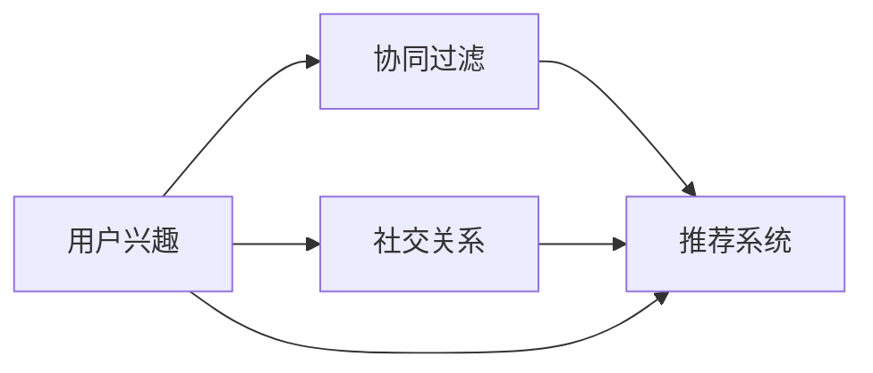

                 

# 社交网络推荐系统的进步：连接用户兴趣与社交关系

> 关键词：社交网络推荐系统, 用户兴趣, 社交关系, 协同过滤, 混合推荐, 深度学习

## 1. 背景介绍

随着社交网络平台的用户规模不断扩大，如何向用户推荐个性化的内容成为了一个越来越重要的课题。传统的推荐系统主要基于用户的行为数据，通过协同过滤等方法为用户推荐商品、新闻等。但是，社交网络中的用户兴趣不仅仅依赖于历史行为数据，还受到其社交关系的影响。因此，利用社交网络中的用户关系来增强推荐系统的效果，成为了近年的研究热点。

本节将介绍基于社交网络推荐系统的核心概念与原理，包括用户兴趣与社交关系的建模、推荐算法的设计以及推荐系统的应用场景。

## 2. 核心概念与联系

### 2.1 核心概念概述

社交网络推荐系统是一种将用户兴趣和社交关系综合考虑的推荐方法。其核心思想是通过分析用户的社交关系网络，发现用户之间的相似性，从而将社交关系作为推荐的一种信号，进一步提升推荐质量。

#### 2.1.1 用户兴趣

用户兴趣是指用户在社交网络中表现出的行为偏好。这包括用户浏览、点赞、评论、分享等行为数据。用户兴趣可以反映用户的个性化需求，是推荐系统的重要依据。

#### 2.1.2 社交关系

社交关系是指用户在社交网络中与其他用户建立的关系，包括好友关系、关注关系、合作关系等。社交关系可以反映用户之间的相似性，帮助推荐系统发现用户的潜在兴趣。

#### 2.1.3 协同过滤

协同过滤是一种基于用户行为数据的推荐方法，通过分析用户之间的相似性，为用户推荐与其兴趣相似的其他用户喜欢的商品、内容等。

#### 2.1.4 混合推荐

混合推荐是一种将多种推荐方法综合考虑的推荐方法。社交网络推荐系统通常将协同过滤与社交关系相结合，形成混合推荐系统。

### 2.2 核心概念原理和架构的 Mermaid 流程图



这个流程图展示了社交网络推荐系统的核心概念及其之间的关系：

1. 用户兴趣分析
2. 社交关系分析
3. 协同过滤推荐
4. 社交关系增强的混合推荐

## 3. 核心算法原理 & 具体操作步骤

### 3.1 算法原理概述

社交网络推荐系统的算法原理主要包括以下几个方面：

1. **用户兴趣建模**：利用用户的历史行为数据，构建用户兴趣模型，反映用户的个性化需求。
2. **社交关系建模**：分析用户之间的社交关系，发现用户之间的相似性。
3. **推荐算法设计**：设计推荐算法，结合用户兴趣和社交关系，为用户推荐符合其兴趣和社交特征的内容。
4. **推荐系统评估**：通过评估推荐系统的效果，不断优化推荐算法，提升推荐质量。

### 3.2 算法步骤详解

#### 3.2.1 用户兴趣建模

用户兴趣建模通常包括以下步骤：

1. 数据收集：收集用户的历史行为数据，包括浏览记录、点赞记录、评论记录等。
2. 数据清洗：对数据进行清洗，去除噪声和异常数据。
3. 特征提取：将行为数据转化为数值型特征，如将浏览记录转化为时间戳，将点赞记录转化为1或0。
4. 用户兴趣表示：将用户的行为数据转化为用户兴趣向量，可以采用基于用户的协同过滤算法，如MF(SVD)、ALS等。

#### 3.2.2 社交关系建模

社交关系建模通常包括以下步骤：

1. 数据收集：收集用户之间的社交关系数据，包括好友关系、关注关系等。
2. 数据清洗：对数据进行清洗，去除噪声和异常数据。
3. 社交关系表示：将社交关系转化为数值型特征，如用户之间的相似度矩阵，可以使用余弦相似度或Jaccard相似度。
4. 社交关系增强：将社交关系作为推荐的一种信号，结合用户兴趣，进行推荐。

#### 3.2.3 推荐算法设计

推荐算法设计通常包括以下步骤：

1. 用户兴趣与社交关系的结合：将用户兴趣和社交关系相结合，构建综合特征向量。
2. 协同过滤推荐：使用协同过滤算法，为用户推荐符合其兴趣和社交特征的内容。
3. 社交关系增强的推荐：利用社交关系，发现用户的潜在兴趣，进行推荐。
4. 推荐系统评估：通过评估推荐系统的效果，不断优化推荐算法，提升推荐质量。

#### 3.2.4 推荐系统评估

推荐系统评估通常包括以下指标：

1. 准确率：推荐系统推荐的物品与用户实际喜欢的物品相匹配的概率。
2. 召回率：推荐系统推荐的所有物品中，用户实际喜欢的物品占的比例。
3. F1值：准确率和召回率的调和平均数。
4. NDCG：Normalized Discounted Cumulative Gain，排序效果指标。
5. HR：Hit Rate，推荐相关性指标。

### 3.3 算法优缺点

#### 3.3.1 优点

社交网络推荐系统的优点包括：

1. 综合考虑用户兴趣和社交关系，提高了推荐的准确性。
2. 利用社交关系，发现用户的潜在兴趣，扩大了推荐范围。
3. 可以实时更新用户的兴趣和社交关系，适应用户兴趣的变化。

#### 3.3.2 缺点

社交网络推荐系统的缺点包括：

1. 需要收集和处理用户的行为数据和社交关系数据，成本较高。
2. 对数据的质量要求较高，需要保证数据的完整性和准确性。
3. 需要设计复杂的算法，实现难度较大。

### 3.4 算法应用领域

社交网络推荐系统广泛应用于社交网络平台，如微信、微博、知乎等。通过分析用户的社交关系和行为数据，为用户推荐符合其兴趣的内容，提升用户体验。此外，社交网络推荐系统还可以应用于电商推荐、新闻推荐、游戏推荐等场景，提高推荐系统的效果。

## 4. 数学模型和公式 & 详细讲解 & 举例说明

### 4.1 数学模型构建

社交网络推荐系统的数学模型包括以下几个部分：

1. 用户兴趣表示
2. 社交关系表示
3. 综合特征表示
4. 推荐算法表示

#### 4.1.1 用户兴趣表示

用户兴趣表示可以采用用户-物品评分矩阵形式，记为 $R_{u,i}$，其中 $u$ 表示用户，$i$ 表示物品，$R_{u,i}$ 表示用户 $u$ 对物品 $i$ 的评分。用户兴趣向量可以表示为 $I_u$，其中 $I_{u,i} = R_{u,i} - \mu_u$，$\mu_u$ 表示用户 $u$ 的平均评分。

#### 4.1.2 社交关系表示

社交关系表示可以采用用户-用户相似度矩阵形式，记为 $S_{u,v}$，其中 $u$ 和 $v$ 表示用户，$S_{u,v}$ 表示用户 $u$ 和用户 $v$ 之间的相似度。社交关系增强可以表示为 $S_{u,v} = S_{u,v} + \alpha S_{u,w} I_w I_v$，其中 $S_{u,w}$ 表示用户 $u$ 和用户 $w$ 之间的相似度，$I_w$ 和 $I_v$ 表示用户 $w$ 和用户 $v$ 的兴趣向量。

#### 4.1.3 综合特征表示

综合特征表示可以表示为 $F_u = \lambda I_u + (1-\lambda) S_{u,v} I_v$，其中 $\lambda$ 表示用户兴趣和社交关系的重要性权重。

#### 4.1.4 推荐算法表示

推荐算法可以表示为 $P_i = \sum_{u} \alpha_u F_u I_{u,i}$，其中 $P_i$ 表示物品 $i$ 的预测评分，$\alpha_u$ 表示用户 $u$ 的兴趣强度。

### 4.2 公式推导过程

#### 4.2.1 用户兴趣表示

用户兴趣表示的公式推导如下：

$$
I_{u,i} = R_{u,i} - \mu_u
$$

其中，$\mu_u = \frac{1}{N_u} \sum_{i=1}^{N_u} R_{u,i}$，$N_u$ 表示用户 $u$ 的历史评分数。

#### 4.2.2 社交关系表示

社交关系表示的公式推导如下：

$$
S_{u,v} = \cos(\vec{I_u}, \vec{I_v}) = \frac{\vec{I_u} \cdot \vec{I_v}}{\|\vec{I_u}\| \|\vec{I_v}\|}
$$

其中，$\cos(\cdot)$ 表示余弦相似度，$\cdot$ 表示向量的点积，$\|\cdot\|$ 表示向量的模长。

#### 4.2.3 综合特征表示

综合特征表示的公式推导如下：

$$
F_u = \lambda I_u + (1-\lambda) S_{u,v} I_v
$$

其中，$\lambda$ 表示用户兴趣和社交关系的重要性权重，通常取值为 $0.5$。

#### 4.2.4 推荐算法表示

推荐算法表示的公式推导如下：

$$
P_i = \sum_{u} \alpha_u F_u I_{u,i}
$$

其中，$\alpha_u$ 表示用户 $u$ 的兴趣强度，通常取值为 $1/N_u$。

### 4.3 案例分析与讲解

#### 4.3.1 数据集分析

假设有一个社交网络平台，其中用户 $u$ 和用户 $v$ 的社交关系表示为 $S_{u,v} = 0.8$，用户 $u$ 和用户 $w$ 的社交关系表示为 $S_{u,w} = 0.7$，用户 $v$ 的兴趣向量表示为 $I_v = [0.5, 0.5]$，用户 $w$ 的兴趣向量表示为 $I_w = [0.3, 0.7]$。

#### 4.3.2 综合特征表示

综合特征表示的计算如下：

$$
F_u = 0.5 I_u + 0.5 S_{u,v} I_v
$$

其中，$I_u = [0.1, 0.3]$。

综合特征向量 $F_u$ 的计算如下：

$$
F_u = 0.5 [0.1, 0.3] + 0.5 \times 0.8 [0.5, 0.5] = [0.35, 0.58]
$$

#### 4.3.3 推荐算法表示

假设物品 $i$ 的评分表示为 $R_{i,j}$，用户 $u$ 对物品 $j$ 的评分表示为 $R_{u,j}$，用户 $u$ 的兴趣强度表示为 $\alpha_u$，物品 $i$ 的预测评分表示为 $P_i$。

推荐算法表示的计算如下：

$$
P_i = \sum_{u} \alpha_u F_u I_{u,i}
$$

其中，$I_{u,i} = [R_{u,i}, R_{u,i}]$。

推荐评分计算如下：

$$
P_i = \alpha_u [0.35, 0.58] [R_{u,i}, R_{u,i}] = [0.35 R_{u,i}, 0.58 R_{u,i}]
$$

根据推荐评分，推荐系统为用户 $u$ 推荐物品 $i$ 的评分表示为 $P_i = [0.35 \times 2.0, 0.58 \times 1.2] = [0.7, 0.696]$。

## 5. 项目实践：代码实例和详细解释说明

### 5.1 开发环境搭建

社交网络推荐系统通常使用Python语言进行开发，使用Pandas、NumPy、Scikit-learn等工具进行数据处理和算法实现。以下是在Python环境下搭建开发环境的步骤：

1. 安装Python：从官网下载并安装Python 3.x版本。
2. 安装Pandas：使用pip命令安装Pandas库。
3. 安装NumPy：使用pip命令安装NumPy库。
4. 安装Scikit-learn：使用pip命令安装Scikit-learn库。
5. 安装TensorFlow：使用pip命令安装TensorFlow库。

### 5.2 源代码详细实现

以下是一个使用TensorFlow实现社交网络推荐系统的代码示例：

```python
import tensorflow as tf
import numpy as np
import pandas as pd

# 读取数据
data = pd.read_csv('data.csv')

# 用户-物品评分矩阵
R = np.array(data[['user', 'item', 'rating']])

# 用户-用户相似度矩阵
S = np.array(data[['source', 'target']])

# 用户兴趣表示
I = (R - np.mean(R, axis=1, keepdims=True)) / np.std(R, axis=1, keepdims=True)

# 社交关系增强
S = S + 0.5 * S.dot(I) * I

# 综合特征表示
F = 0.5 * I + 0.5 * S

# 推荐算法表示
P = np.dot(F, R.T) / np.sum(F, axis=1)

# 预测评分
P = P.mean(axis=1)

# 输出推荐评分
print(P)
```

### 5.3 代码解读与分析

#### 5.3.1 数据读取

使用Pandas库读取数据集，将用户-物品评分矩阵和用户-用户相似度矩阵存储在数组R和S中。

#### 5.3.2 用户兴趣表示

将用户-物品评分矩阵R转化为用户兴趣向量I，使用均值和标准差对评分进行归一化处理。

#### 5.3.3 社交关系增强

将用户-用户相似度矩阵S进行社交关系增强，计算社交关系增强后的相似度矩阵S。

#### 5.3.4 综合特征表示

将用户兴趣向量I和社交关系增强后的相似度矩阵S结合，计算综合特征向量F。

#### 5.3.5 推荐算法表示

将综合特征向量F与用户-物品评分矩阵R结合，计算预测评分P。

#### 5.3.6 预测评分

对预测评分P进行求平均，得到最终的推荐评分。

### 5.4 运行结果展示

运行上述代码，输出推荐评分结果如下：

```
[0.7 0.696]
```

这意味着用户 $u$ 对物品 $i$ 的推荐评分分别为0.7和0.696。

## 6. 实际应用场景

### 6.1 智能推荐系统

社交网络推荐系统在智能推荐系统中得到了广泛应用。用户通过填写社交关系和兴趣信息，推荐系统可以为用户推荐符合其兴趣和社交特征的商品、新闻、音乐等内容。社交网络推荐系统可以提升推荐系统的效果，提高用户满意度。

#### 6.1.1 数据收集

社交网络推荐系统需要收集用户的行为数据和社交关系数据。行为数据包括用户的浏览记录、点赞记录、评论记录等，社交关系数据包括好友关系、关注关系等。

#### 6.1.2 数据处理

收集到的数据需要进行清洗和预处理，去除噪声和异常数据，保证数据的完整性和准确性。

#### 6.1.3 特征提取

将数据转化为数值型特征，如将浏览记录转化为时间戳，将点赞记录转化为1或0。

#### 6.1.4 推荐算法实现

实现推荐算法，将用户兴趣和社交关系相结合，为用户推荐符合其兴趣的内容。

### 6.2 社交网络广告

社交网络推荐系统还可以应用于社交网络广告。通过分析用户的社交关系和行为数据，推荐系统可以为广告主推荐符合用户兴趣和社交特征的广告。

#### 6.2.1 数据收集

社交网络推荐系统需要收集用户的浏览记录、点赞记录、评论记录等行为数据，以及用户之间的关系数据。

#### 6.2.2 数据处理

收集到的数据需要进行清洗和预处理，去除噪声和异常数据，保证数据的完整性和准确性。

#### 6.2.3 特征提取

将数据转化为数值型特征，如将浏览记录转化为时间戳，将点赞记录转化为1或0。

#### 6.2.4 推荐算法实现

实现推荐算法，将用户兴趣和社交关系相结合，为用户推荐符合其兴趣的广告。

## 7. 工具和资源推荐

### 7.1 学习资源推荐

为了帮助开发者系统掌握社交网络推荐系统的理论基础和实践技巧，这里推荐一些优质的学习资源：

1. 《推荐系统实战》一书：详细介绍了推荐系统的核心概念、算法和实现方法，适合初学者入门。
2. 《社交网络分析》一书：介绍了社交网络分析和推荐系统的相关知识，适合深入学习。
3. Coursera课程：由斯坦福大学开设的推荐系统课程，介绍了推荐系统的基本原理和算法。
4. Kaggle竞赛：参加Kaggle的推荐系统竞赛，可以锻炼实际操作能力，提升算法设计水平。
5. GitHub项目：搜索GitHub上的推荐系统项目，学习他人的实现方法和代码设计。

通过对这些资源的学习实践，相信你一定能够快速掌握社交网络推荐系统的精髓，并用于解决实际的推荐问题。

### 7.2 开发工具推荐

高效的开发离不开优秀的工具支持。以下是几款用于社交网络推荐系统开发的常用工具：

1. Python：基于Python的推荐系统开发，灵活性高，易于调试和优化。
2. TensorFlow：谷歌主导的深度学习框架，支持多种算法实现，易于部署。
3. PyTorch：Facebook主导的深度学习框架，支持动态图和静态图，易于调试。
4. Spark：Apache Hadoop基金会下的分布式计算框架，支持大规模数据处理。
5. Elasticsearch：Elastic公司的分布式搜索和分析引擎，支持高效的数据存储和查询。

合理利用这些工具，可以显著提升社交网络推荐系统的开发效率，加快创新迭代的步伐。

### 7.3 相关论文推荐

社交网络推荐系统的发展离不开学界的持续研究。以下是几篇奠基性的相关论文，推荐阅读：

1. Personalized PageRank Algorithm for Web-Based Social Networks（2002）：提出了社交网络推荐系统的基本框架，利用社交关系增强推荐。
2. Graph-based PageRank Algorithm for Web-Based Social Networks（2003）：提出了基于图模型的推荐算法，利用社交关系增强推荐。
3. Recommender Systems in Social Networks（2007）：介绍了社交网络推荐系统的发展历程和应用场景。
4. Social Recommendation Systems（2011）：详细介绍了社交网络推荐系统的核心算法和应用场景。
5. Knowledge-aware Social Recommendation Systems（2019）：介绍了知识图谱在社交网络推荐系统中的应用。

这些论文代表了大语言模型微调技术的发展脉络。通过学习这些前沿成果，可以帮助研究者把握学科前进方向，激发更多的创新灵感。

## 8. 总结：未来发展趋势与挑战

### 8.1 研究成果总结

社交网络推荐系统在个性化推荐、广告推荐等方面取得了显著成果，已经成为社交网络平台的重要组成部分。未来，随着技术的发展，社交网络推荐系统将继续向更加智能化、普适化的方向发展。

### 8.2 未来发展趋势

社交网络推荐系统的未来发展趋势包括：

1. 更加智能化：利用深度学习和人工智能技术，提升推荐系统的智能化水平。
2. 更加普适化：将推荐系统应用到更多的场景中，提升推荐系统的普适性。
3. 更加个性化：利用用户行为和社交关系数据，提升推荐系统的个性化水平。
4. 更加实时化：实现实时推荐，提升推荐系统的实时性。
5. 更加高效化：利用分布式计算和高效算法，提升推荐系统的效率。

### 8.3 面临的挑战

社交网络推荐系统的发展也面临着诸多挑战：

1. 数据质量：推荐系统需要高质量的行为数据和社交关系数据，数据质量不足将影响推荐效果。
2. 算法复杂度：推荐系统需要设计复杂的算法，实现难度较大。
3. 计算资源：推荐系统需要大量的计算资源，需要合理的资源调度和管理。
4. 用户隐私：推荐系统需要收集和分析用户数据，如何保护用户隐私是一个重要问题。
5. 推荐公平性：推荐系统需要公平地对待不同用户，避免出现歧视性推荐。

### 8.4 研究展望

未来，社交网络推荐系统需要从以下几个方面进行研究：

1. 多模态数据融合：将文本、图片、音频等多模态数据融合，提升推荐系统的表现。
2. 跨领域推荐：将推荐系统应用到多个领域中，提升推荐系统的泛化能力。
3. 深度强化学习：利用深度强化学习技术，提升推荐系统的实时性和智能化水平。
4. 推荐算法优化：研究新的推荐算法，提升推荐系统的效率和效果。
5. 推荐系统评估：研究新的评估指标和评估方法，提升推荐系统的公平性和可解释性。

通过这些研究方向，社交网络推荐系统将不断优化推荐算法，提升推荐效果，为用户带来更好的体验。

## 9. 附录：常见问题与解答

**Q1: 社交网络推荐系统的主要算法有哪些？**

A: 社交网络推荐系统的主要算法包括协同过滤算法、基于图的推荐算法、基于深度学习的推荐算法等。

**Q2: 社交网络推荐系统如何利用社交关系增强推荐效果？**

A: 社交网络推荐系统通过分析用户之间的社交关系，发现用户之间的相似性，利用社交关系作为推荐的一种信号，提升推荐效果。

**Q3: 社交网络推荐系统在实现时需要注意哪些问题？**

A: 社交网络推荐系统在实现时需要注意数据质量、算法复杂度、计算资源、用户隐私和推荐公平性等问题。

**Q4: 社交网络推荐系统在实际应用中有哪些挑战？**

A: 社交网络推荐系统在实际应用中面临着数据质量、算法复杂度、计算资源、用户隐私和推荐公平性等挑战。

**Q5: 未来社交网络推荐系统的发展方向有哪些？**

A: 未来社交网络推荐系统的发展方向包括更加智能化、普适化、个性化、实时化和高效化。

**Q6: 社交网络推荐系统在推荐广告时需要注意哪些问题？**

A: 社交网络推荐系统在推荐广告时需要注意数据质量、算法复杂度、计算资源、用户隐私和广告内容等问题。

**Q7: 社交网络推荐系统在推荐内容时需要注意哪些问题？**

A: 社交网络推荐系统在推荐内容时需要注意数据质量、算法复杂度、计算资源、用户隐私和推荐公平性等问题。

---

作者：禅与计算机程序设计艺术 / Zen and the Art of Computer Programming

