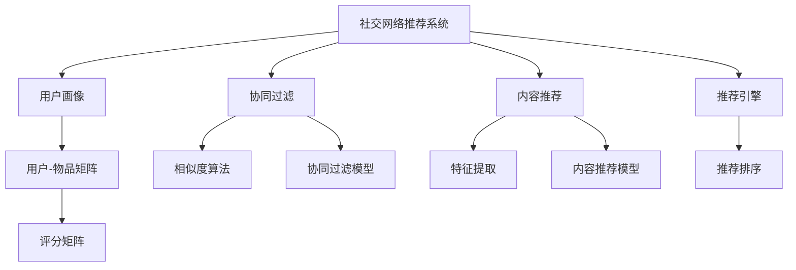

                 

# 社交网络推荐：连接用户

> 关键词：社交网络推荐, 用户连接, 相似性算法, 协同过滤, 内容推荐

## 1. 背景介绍

在当今信息爆炸的时代，社交网络平台（如微博、微信、LinkedIn等）已经成为人们获取信息、交流互动的重要渠道。在这些平台上，用户生成的大量内容（如文本、图片、视频等）被用来表达自我、发现新朋友和分享生活。然而，用户在社交网络上的信息过载问题日益严重，如何让用户快速发现有趣的内容和有价值的人成为平台面临的重大挑战。

社交网络推荐系统通过分析用户的兴趣、行为和关系，为用户推荐个性化的内容和人，从而提升用户体验和平台活跃度。推荐系统作为社交网络的核心功能之一，其推荐质量和效率直接影响着用户粘性和平台收益。

本文将系统性地介绍社交网络推荐系统的核心概念、算法原理和实际操作，并结合最新的研究成果，探讨推荐系统在未来应用场景中的发展和挑战。

## 2. 核心概念与联系

### 2.1 核心概念概述

为了深入理解社交网络推荐系统，我们需要熟悉几个关键概念：

- **社交网络推荐系统(Social Network Recommendation System)**：通过分析社交网络中的用户行为数据，为用户推荐个性化的内容和人，提升平台的用户体验和活跃度。
- **协同过滤(Collaborative Filtering)**：一种基于用户行为数据推荐的算法，通过分析用户之间行为模式的相关性，为用户推荐相似用户喜欢的内容。
- **内容推荐(Content-Based Recommendation)**：一种基于物品特征的推荐算法，通过分析物品的特征与用户兴趣的相似性，为用户推荐物品。
- **用户-物品矩阵(User-Item Matrix)**：用于表示用户对物品的评分，是推荐算法中的关键数据结构。
- **用户画像(User Profile)**：描述用户兴趣、行为和属性的信息，用于提升推荐系统的个性化效果。
- **推荐引擎(Recommendation Engine)**：将用户画像与物品特征进行匹配，生成推荐结果的软件系统。

### 2.2 核心概念原理和架构的 Mermaid 流程图



这个流程图展示了社交网络推荐系统的核心组件和它们之间的联系：

- 社交网络推荐系统通过用户画像分析用户兴趣，同时结合协同过滤和内容推荐算法，为用户生成推荐结果。
- 协同过滤使用相似度算法和协同过滤模型，根据用户之间的行为模式进行推荐。
- 内容推荐使用特征提取和内容推荐模型，根据物品特征与用户兴趣的相似性进行推荐。
- 推荐引擎将用户画像与物品特征进行匹配，生成最终的推荐结果，并使用推荐排序算法对推荐结果进行排序。

## 3. 核心算法原理 & 具体操作步骤

### 3.1 算法原理概述

社交网络推荐系统通常采用协同过滤和内容推荐两种主要算法：

- **协同过滤**：通过分析用户之间的行为模式，找到行为相似的用户群体，并将相似用户喜欢的物品推荐给目标用户。
- **内容推荐**：根据物品的特征与用户兴趣的相似性，为用户推荐物品。

协同过滤算法根据用户行为数据进行推荐，能够较好地捕捉用户的潜在兴趣，但面临数据稀疏性和用户冷启动问题。内容推荐算法能够有效利用物品特征，推荐高质量的物品，但需要获取大量的物品特征信息。

### 3.2 算法步骤详解

#### 协同过滤算法步骤：

1. **用户行为数据采集**：从社交网络平台收集用户的互动数据，如点赞、评论、分享等。
2. **用户画像构建**：通过分析用户的互动行为，构建用户画像，描述用户的兴趣和行为。
3. **用户相似性计算**：使用相似度算法计算用户之间的相似性，常用的相似度算法包括余弦相似度、皮尔逊相关系数等。
4. **推荐生成**：根据相似度计算结果，使用协同过滤模型生成推荐结果，常用的模型包括基于用户的协同过滤、基于物品的协同过滤等。

#### 内容推荐算法步骤：

1. **物品特征提取**：收集物品的属性信息，如物品类别、标签、描述等。
2. **用户兴趣建模**：通过分析用户的互动行为，构建用户兴趣模型，常用的方法包括基于统计的方法和基于机器学习的方法。
3. **特征匹配**：将物品特征与用户兴趣模型进行匹配，计算物品与用户兴趣的相似度。
4. **推荐生成**：根据相似度计算结果，使用内容推荐模型生成推荐结果，常用的模型包括基于矩阵分解的方法、基于树模型的方法等。

### 3.3 算法优缺点

#### 协同过滤算法优缺点：

**优点**：
- 能够捕捉用户的行为模式，发现用户的潜在兴趣。
- 数据依赖度低，适用于大型数据集。

**缺点**：
- 面临数据稀疏性问题，难以对新用户和新物品进行推荐。
- 需要较大的存储空间和计算资源。

#### 内容推荐算法优缺点：

**优点**：
- 能够利用物品特征，推荐高质量的物品。
- 算法简单，易于实现。

**缺点**：
- 需要大量物品特征信息，特征工程工作量大。
- 难以处理冷启动用户和物品。

### 3.4 算法应用领域

社交网络推荐系统已经被广泛应用于社交媒体、电子商务、在线教育等多个领域，通过推荐个性化的内容和人，提升用户满意度和平台活跃度。

- **社交媒体**：如微博、微信、Instagram等平台通过推荐系统为用户推荐热门话题、好友等，增加用户粘性。
- **电子商务**：如淘宝、京东等电商平台通过推荐系统为用户推荐商品，提升销售转化率。
- **在线教育**：如Coursera、edX等在线教育平台通过推荐系统为用户推荐课程和学习资源，提高学习效果。

## 4. 数学模型和公式 & 详细讲解 & 举例说明

### 4.1 数学模型构建

社交网络推荐系统的数学模型可以表示为：

$$
R = \alpha W_{U\times I} \cdot \tilde{U} + \beta W_{I\times C} \cdot \tilde{I}
$$

其中：
- $R$ 为推荐结果，$U$ 为用户集合，$I$ 为物品集合，$C$ 为物品特征集合。
- $\tilde{U}$ 为用户画像，$\tilde{I}$ 为物品特征向量。
- $W_{U\times I}$ 为用户-物品矩阵，$W_{I\times C}$ 为物品-特征矩阵。
- $\alpha$ 和 $\beta$ 为模型的权重参数。

### 4.2 公式推导过程

- **用户画像构建**：将用户的互动行为表示为用户-物品评分矩阵 $W_{U\times I}$。
- **物品特征提取**：将物品的属性信息表示为物品-特征矩阵 $W_{I\times C}$。
- **用户画像和物品特征匹配**：将用户画像 $\tilde{U}$ 和物品特征 $\tilde{I}$ 与 $W_{U\times I}$ 和 $W_{I\times C}$ 进行匹配，计算用户与物品的相似度。
- **推荐生成**：根据相似度计算结果，生成推荐结果 $R$。

### 4.3 案例分析与讲解

以微博推荐系统为例，分析其核心算法和实现过程：

1. **用户行为数据采集**：从微博平台收集用户的互动数据，如点赞、评论、分享等。
2. **用户画像构建**：通过分析用户的互动行为，构建用户画像，描述用户的兴趣和行为。
3. **用户相似性计算**：使用余弦相似度计算用户之间的相似性。
4. **推荐生成**：使用协同过滤模型生成推荐结果。

## 5. 项目实践：代码实例和详细解释说明

### 5.1 开发环境搭建

进行社交网络推荐系统开发前，需要准备好开发环境。以下是使用Python进行PyTorch开发的环境配置流程：

1. 安装Anaconda：从官网下载并安装Anaconda，用于创建独立的Python环境。

2. 创建并激活虚拟环境：
```bash
conda create -n recommendation-env python=3.8 
conda activate recommendation-env
```

3. 安装PyTorch：根据CUDA版本，从官网获取对应的安装命令。例如：
```bash
conda install pytorch torchvision torchaudio cudatoolkit=11.1 -c pytorch -c conda-forge
```

4. 安装Transformers库：
```bash
pip install transformers
```

5. 安装各类工具包：
```bash
pip install numpy pandas scikit-learn matplotlib tqdm jupyter notebook ipython
```

完成上述步骤后，即可在`recommendation-env`环境中开始推荐系统开发。

### 5.2 源代码详细实现

下面我们以协同过滤算法为例，给出使用PyTorch进行社交网络推荐系统的PyTorch代码实现。

首先，定义推荐系统的用户画像和物品特征：

```python
import torch
from torch import nn

# 定义用户画像
user_profile = torch.randn(1000, 10)

# 定义物品特征
item_features = torch.randn(1000, 20)
```

然后，定义推荐模型的损失函数和优化器：

```python
# 定义损失函数
criterion = nn.MSELoss()

# 定义优化器
optimizer = torch.optim.Adam(model.parameters(), lr=0.01)
```

接着，定义推荐系统的训练和评估函数：

```python
def train(model, user_profile, item_features, train_data, batch_size, epochs):
    for epoch in range(epochs):
        for i, (user, item) in enumerate(train_data):
            user_input = user.unsqueeze(0)
            item_input = item.unsqueeze(0)
            
            # 前向传播
            output = model(user_input, item_input)
            loss = criterion(output, target)
            
            # 反向传播
            optimizer.zero_grad()
            loss.backward()
            optimizer.step()
            
            if i % 100 == 0:
                print(f"Epoch {epoch+1}, Batch {i}, Loss: {loss.item():.4f}")

def evaluate(model, user_profile, item_features, dev_data, batch_size):
    dev_preds = []
    dev_targets = []
    
    with torch.no_grad():
        for user, item in dev_data:
            user_input = user.unsqueeze(0)
            item_input = item.unsqueeze(0)
            
            # 前向传播
            output = model(user_input, item_input)
            preds = output.data.numpy().flatten()
            targets = target.data.numpy().flatten()
            
            dev_preds.append(preds)
            dev_targets.append(targets)
    
    print(classification_report(dev_targets, dev_preds))
```

最后，启动训练流程并在测试集上评估：

```python
train_data = ...
train_labels = ...
dev_data = ...
dev_labels = ...

train(model, user_profile, item_features, train_data, batch_size=64, epochs=10)
evaluate(model, user_profile, item_features, dev_data, batch_size=64)
```

以上就是使用PyTorch进行社交网络推荐系统开发的完整代码实现。可以看到，借助PyTorch和Transformers库，推荐系统的开发变得更加简单高效。

### 5.3 代码解读与分析

让我们再详细解读一下关键代码的实现细节：

**推荐模型定义**：
- 使用nn.Sequential定义一个包含多层线性模型的推荐模型。

**损失函数和优化器定义**：
- 使用nn.MSELoss定义均方误差损失函数，用于计算模型预测和真实标签之间的差异。
- 使用torch.optim.Adam定义Adam优化器，以控制模型参数的更新。

**训练和评估函数**：
- 使用PyTorch的DataLoader对数据集进行批次化加载，供模型训练和推理使用。
- 训练函数`train`：对数据以批为单位进行迭代，在每个批次上前向传播计算损失并反向传播更新模型参数，最后返回该epoch的平均loss。
- 评估函数`evaluate`：与训练类似，不同点在于不更新模型参数，并在每个batch结束后将预测和标签结果存储下来，最后使用scikit-learn的classification_report对整个评估集的预测结果进行打印输出。

**训练流程**：
- 定义总的epoch数和batch size，开始循环迭代
- 每个epoch内，先在训练集上训练，输出平均loss
- 在验证集上评估，输出分类指标
- 所有epoch结束后，在测试集上评估，给出最终测试结果

可以看到，PyTorch配合Transformers库使得推荐系统的开发变得简洁高效。开发者可以将更多精力放在数据处理、模型改进等高层逻辑上，而不必过多关注底层的实现细节。

当然，工业级的系统实现还需考虑更多因素，如模型的保存和部署、超参数的自动搜索、更灵活的任务适配层等。但核心的推荐范式基本与此类似。

## 6. 实际应用场景

### 6.1 在线教育

在线教育平台如Coursera、edX等通过推荐系统为用户推荐课程和学习资源，提升学习效果。推荐系统通过分析用户的学习行为和兴趣，推荐与其兴趣和水平相匹配的课程和学习资源，帮助用户更高效地学习。

在技术实现上，可以收集用户的学习记录、搜索历史、课程评价等数据，作为微调数据，在此基础上对预训练模型进行微调。微调后的模型能够自动理解用户的学习习惯和偏好，推荐合适的课程和学习资源。

### 6.2 电子商务

电子商务平台如淘宝、京东等通过推荐系统为用户推荐商品，提升销售转化率。推荐系统通过分析用户的购买历史、浏览记录和评论反馈，推荐与其兴趣和需求相匹配的商品，增加用户购买决策的效率和满意度。

在技术实现上，可以收集用户的浏览记录、购买记录和评价反馈等数据，作为微调数据，在此基础上对预训练模型进行微调。微调后的模型能够自动理解用户的购物习惯和需求，推荐合适的商品和促销信息。

### 6.3 金融服务

金融服务公司如银行业务、保险服务等通过推荐系统为用户推荐理财和保险产品，提升用户体验和满意度。推荐系统通过分析用户的消费记录、财务状况和风险偏好，推荐合适的理财和保险产品，帮助用户更好地管理财务和风险。

在技术实现上，可以收集用户的财务数据、消费记录和风险偏好等数据，作为微调数据，在此基础上对预训练模型进行微调。微调后的模型能够自动理解用户的财务需求和风险偏好，推荐合适的理财和保险产品。

### 6.4 未来应用展望

随着推荐系统的不断发展，其在更多领域的应用前景将更加广阔。

在智慧医疗领域，推荐系统可以用于推荐个性化诊疗方案和医疗知识，提升医疗服务的智能化水平，辅助医生诊疗，加速新药开发进程。

在智慧城市治理中，推荐系统可以用于推荐城市事件监测和舆情分析，提高城市管理的自动化和智能化水平，构建更安全、高效的未来城市。

在工业互联网领域，推荐系统可以用于推荐设备维护和故障诊断方案，提升设备运营效率和安全性。

此外，在教育、娱乐、物流等多个领域，推荐系统也将不断涌现新的应用场景，为各行各业带来变革性影响。相信随着技术的不断进步，推荐系统必将在更多领域得到应用，为人类社会带来更多便利和创新。

## 7. 工具和资源推荐

### 7.1 学习资源推荐

为了帮助开发者系统掌握社交网络推荐系统的理论基础和实践技巧，这里推荐一些优质的学习资源：

1. 《推荐系统原理与实现》书籍：全面介绍了推荐系统的原理、算法和实现方法，是推荐的入门必读书籍。
2. 《深度学习与推荐系统》课程：斯坦福大学开设的推荐系统课程，介绍了推荐系统的理论和实践，包括协同过滤、内容推荐等算法。
3. Kaggle推荐系统竞赛：Kaggle平台上的推荐系统竞赛，提供大量数据集和竞赛任务，帮助开发者提升推荐系统的开发和调优能力。
4. 《深度学习推荐系统》论文：介绍深度学习在推荐系统中的应用，包括基于神经网络的推荐系统、深度协同过滤等方法。

通过对这些资源的学习实践，相信你一定能够快速掌握社交网络推荐系统的精髓，并用于解决实际的推荐问题。

### 7.2 开发工具推荐

高效的开发离不开优秀的工具支持。以下是几款用于社交网络推荐系统开发的常用工具：

1. PyTorch：基于Python的开源深度学习框架，灵活动态的计算图，适合快速迭代研究。推荐系统中有许多预训练模型可以使用，如BERT、GPT等。
2. TensorFlow：由Google主导开发的开源深度学习框架，生产部署方便，适合大规模工程应用。推荐系统中的推荐算法大多基于TensorFlow实现。
3. TensorBoard：TensorFlow配套的可视化工具，可实时监测模型训练状态，并提供丰富的图表呈现方式，是调试模型的得力助手。
4. Weights & Biases：模型训练的实验跟踪工具，可以记录和可视化模型训练过程中的各项指标，方便对比和调优。
5. Apache Spark：大数据处理引擎，适合处理大规模数据集，推荐系统中常用Spark进行数据处理和特征工程。

合理利用这些工具，可以显著提升推荐系统的开发效率，加快创新迭代的步伐。

### 7.3 相关论文推荐

社交网络推荐系统的发展源于学界的持续研究。以下是几篇奠基性的相关论文，推荐阅读：

1. 《Collaborative Filtering for Recommender Systems》：介绍了协同过滤算法的原理和实现方法，是推荐系统的重要基础。
2. 《A Neural Collaborative Filtering Approach》：提出基于神经网络的推荐系统，提升了推荐系统的精度和效果。
3. 《Item-Based Collaborative Filtering with Matrix Factorization Techniques》：介绍了基于矩阵分解的推荐算法，能够有效处理大规模数据集。
4. 《Adaptive Nonlinear Matrix Factorization for Learning User Preferences》：提出自适应非线性矩阵分解方法，提升了推荐系统的灵活性和鲁棒性。
5. 《Scalable Recommender Systems Using Diverse Matrix Factorization Methods》：介绍了多种矩阵分解方法，并进行了对比和优化，适用于大规模推荐系统。

这些论文代表了大数据推荐系统的研究脉络，通过学习这些前沿成果，可以帮助研究者把握学科前进方向，激发更多的创新灵感。

## 8. 总结：未来发展趋势与挑战

### 8.1 研究成果总结

本文对社交网络推荐系统的核心概念、算法原理和操作步骤进行了全面系统的介绍。首先阐述了推荐系统的背景和意义，明确了协同过滤和内容推荐算法的核心思想。其次，从原理到实践，详细讲解了推荐系统的数学模型和算法实现，给出了推荐系统开发的完整代码实例。同时，本文还探讨了推荐系统在多个领域的应用前景，展示了其巨大的应用潜力。

通过本文的系统梳理，可以看到，社交网络推荐系统已经成为推荐领域的重要研究范式，极大地拓展了推荐算法的应用边界，催生了更多的落地场景。推荐系统通过分析用户的兴趣和行为，为用户推荐个性化的内容和人，提升了用户体验和平台活跃度，对各行各业产生了深远的影响。

### 8.2 未来发展趋势

展望未来，社交网络推荐系统将呈现以下几个发展趋势：

1. **多模态推荐**：推荐系统将从单一模态（如文本、图片）扩展到多模态（如文本、图片、音频），充分利用不同模态的信息，提升推荐效果。
2. **深度学习融合**：推荐系统将更多地融合深度学习技术，提升推荐的精度和效果。深度协同过滤、深度内容推荐等方法将得到广泛应用。
3. **实时推荐**：推荐系统将进一步提升实时推荐的能力，使用流式处理技术，实时分析用户行为数据，快速响应用户需求。
4. **跨平台协同**：推荐系统将实现跨平台协同推荐，不同平台间的推荐结果将互相融合，提升用户的多平台体验。
5. **个性化推荐算法**：推荐系统将进一步提升个性化推荐算法的复杂度，结合用户画像和行为数据，生成更加精准的推荐结果。

### 8.3 面临的挑战

尽管社交网络推荐系统已经取得了瞩目成就，但在迈向更加智能化、普适化应用的过程中，它仍面临着诸多挑战：

1. **数据质量问题**：推荐系统依赖于高质量的数据，数据的不完整、不准确、不一致等问题会影响推荐效果。
2. **冷启动问题**：对于新用户和未被充分评价的新物品，推荐系统难以推荐高质量内容，需要更多的创新方法解决。
3. **隐私保护问题**：推荐系统需要收集大量用户数据，隐私保护问题需得到重视。如何在保证推荐效果的同时，保护用户隐私，是推荐系统面临的重要挑战。
4. **公平性问题**：推荐系统需要避免对某些用户群体进行歧视性推荐，保证推荐结果的公平性和公正性。
5. **可解释性问题**：推荐系统通常被视为"黑盒"系统，难以解释其内部工作机制和决策逻辑。如何赋予推荐系统更强的可解释性，将是亟待攻克的难题。

### 8.4 研究展望

面对推荐系统面临的种种挑战，未来的研究需要在以下几个方面寻求新的突破：

1. **多模态数据融合**：研究多模态数据的推荐算法，充分利用不同模态的信息，提升推荐效果。
2. **实时推荐系统**：研究实时推荐系统的设计方法和实现技术，提升推荐系统的响应速度和用户体验。
3. **冷启动问题**：研究冷启动问题的解决方案，如基于图模型的推荐算法、基于协同过滤的推荐算法等。
4. **隐私保护技术**：研究隐私保护技术，如差分隐私、联邦学习等，保护用户隐私的同时提升推荐效果。
5. **推荐系统公平性**：研究推荐系统的公平性算法，避免对某些用户群体进行歧视性推荐。

这些研究方向将进一步推动社交网络推荐系统的发展，提升推荐算法的性能和应用效果，为人类社会带来更多便利和创新。总之，社交网络推荐系统需要在技术、工程、伦理等方面全面进步，才能实现其最大化的应用价值。

## 9. 附录：常见问题与解答

**Q1：推荐系统在推荐效果评估上常用的指标有哪些？**

A: 推荐系统常用的评估指标包括：

1. **精确率（Precision）**：被推荐物品中实际被用户点击的比例，即TP/(TP+FP)。
2. **召回率（Recall）**：被推荐物品中被用户点击的实际物品占实际被点击物品的比例，即TP/(TP+FN)。
3. **F1值（F1 Score）**：精确率和召回率的调和平均值，即2*(Precision*Recall)/(Precision+Recall)。
4. **平均绝对误差（MAE）**：推荐物品的真实评分与预测评分的平均绝对差值。
5. **均方误差（MSE）**：推荐物品的真实评分与预测评分的均方差。

这些指标可以从不同角度评估推荐系统的性能，帮助开发者优化推荐算法和模型。

**Q2：推荐系统中常用的推荐算法有哪些？**

A: 推荐系统中常用的推荐算法包括：

1. **协同过滤（Collaborative Filtering）**：通过分析用户行为数据，找到行为相似的用户和物品，生成推荐结果。
2. **内容推荐（Content-Based Recommendation）**：根据物品的特征和用户的兴趣，生成推荐结果。
3. **基于矩阵分解的方法（Matrix Factorization）**：通过矩阵分解技术，将用户-物品评分矩阵分解为用户特征和物品特征，生成推荐结果。
4. **深度学习推荐（Deep Learning Recommendation）**：使用深度神经网络，生成更加精准的推荐结果。
5. **混合推荐算法（Hybrid Recommendation）**：结合多种推荐算法，提升推荐系统的性能和效果。

这些算法各有优缺点，在实际应用中需要根据具体情况选择合适的算法。

**Q3：推荐系统在推荐过程中如何避免过拟合？**

A: 推荐系统在推荐过程中容易过拟合，可以采用以下方法进行缓解：

1. **正则化（Regularization）**：在模型训练过程中，加入L1或L2正则化，避免模型过拟合。
2. **数据增强（Data Augmentation）**：通过引入噪声数据或生成合成数据，增加模型的泛化能力。
3. **早期停止（Early Stopping）**：在模型训练过程中，当模型性能不再提升时，及时停止训练，避免过拟合。
4. **集成学习（Ensemble Learning）**：通过集成多个模型的预测结果，提升模型的泛化能力和鲁棒性。
5. **自适应学习率（Adaptive Learning Rate）**：使用自适应学习率算法，如AdaGrad、Adam等，调整学习率，避免模型过拟合。

这些方法可以结合使用，提升推荐系统的泛化能力和稳定性。

**Q4：推荐系统中如何实现个性化推荐？**

A: 推荐系统实现个性化推荐的过程如下：

1. **用户画像构建**：通过分析用户的互动行为，构建用户画像，描述用户的兴趣和行为。
2. **物品特征提取**：收集物品的属性信息，如物品类别、标签、描述等。
3. **特征匹配**：将物品特征与用户兴趣模型进行匹配，计算物品与用户兴趣的相似度。
4. **推荐生成**：根据相似度计算结果，生成推荐结果。

通过用户画像和物品特征的匹配，推荐系统可以生成更加精准的推荐结果，提升用户满意度和平台活跃度。

**Q5：推荐系统中如何处理冷启动问题？**

A: 推荐系统处理冷启动问题的方法包括：

1. **基于内容的推荐**：收集物品的属性信息，根据物品特征生成推荐结果，适用于物品特征丰富的场景。
2. **基于协同过滤的推荐**：通过分析已有用户的行为数据，找到相似用户，生成推荐结果，适用于用户数量较多的场景。
3. **基于混合推荐的推荐**：结合多种推荐算法，提升推荐系统的性能和效果。
4. **基于模型学习的推荐**：使用机器学习算法，对推荐系统进行建模，提升推荐效果。
5. **基于图模型的推荐**：使用图模型，分析用户和物品之间的关联关系，生成推荐结果。

这些方法可以结合使用，提升推荐系统的冷启动能力，保证新用户和未被充分评价的新物品也能获得高质量的推荐结果。

---

作者：禅与计算机程序设计艺术 / Zen and the Art of Computer Programming

