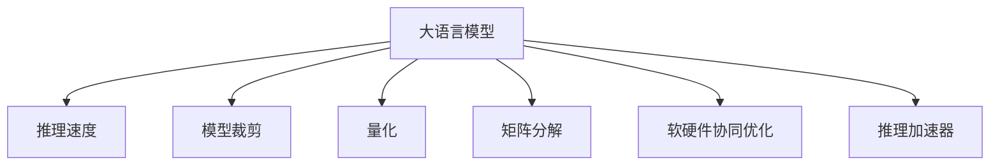

                 

# 秒推时代:LLM推理速度创新高

## 1. 背景介绍

### 1.1 问题由来

近年来，大语言模型（LLM）以其卓越的语言理解和生成能力，成为自然语言处理（NLP）领域的热门话题。然而，大模型的推理速度问题，成为了其在实际应用中的瓶颈。当前，主流的预训练语言模型，如GPT、BERT等，尽管在模型性能上取得了重大突破，但由于其庞大的参数量，推理速度往往难以满足实时性需求。

### 1.2 问题核心关键点

推理速度是大语言模型在实际应用中面临的核心问题。推理速度慢不仅影响了模型的实时性，还限制了其在需要快速响应的场景中的适用性。为了解决这一问题，研究者和工程师们提出了一系列优化策略，包括模型裁剪、量化、矩阵分解等。

### 1.3 问题研究意义

提高推理速度对于提升大语言模型在实际应用中的体验至关重要。推理速度快的模型能够提供更快响应，提升用户体验，降低延迟。尤其是在高并发的应用场景中，推理速度快的模型可以大幅提升系统的吞吐量和处理能力。同时，快速的推理也能带来更高的计算效率，降低系统的资源消耗。

## 2. 核心概念与联系

### 2.1 核心概念概述

为更好地理解推理速度的优化方法，本节将介绍几个密切相关的核心概念：

- 大语言模型（Large Language Model, LLM）：指基于深度学习架构，用于自然语言理解和生成的预训练模型，如GPT、BERT等。
- 推理速度（Inference Speed）：指模型从输入到输出的处理时间，反映了模型的实时性。
- 模型裁剪（Model Pruning）：指减少模型参数量，以降低计算复杂度，提高推理速度的技术。
- 量化（Quantization）：指将模型参数从高精度浮点数转换为低精度整数或固定点数，以降低计算资源消耗。
- 矩阵分解（Matrix Factorization）：指将矩阵分解为多个较小矩阵相乘的形式，以降低计算量和存储需求。
- 软硬件协同优化（Hardware-Aware Optimization）：指结合软硬件资源，对模型进行深度优化，提升推理速度和资源利用率。
- 推理加速器（Inference Accelerator）：指用于专门加速推理过程的硬件设备，如TPU、GPU等。

这些概念之间的逻辑关系可以通过以下Mermaid流程图来展示：



这个流程图展示了各个核心概念之间的关系：

1. 大语言模型通过推理速度的优化，提高了实时性。
2. 模型裁剪、量化、矩阵分解等技术，都是为了降低推理过程的计算复杂度。
3. 软硬件协同优化则结合了硬件资源，进一步提升了推理效率。
4. 推理加速器提供了专用硬件支持，使得推理过程更快。

这些概念共同构成了大语言模型推理速度优化的基础框架，使得模型能够在实际应用中实现秒级推理。

## 3. 核心算法原理 & 具体操作步骤

### 3.1 算法原理概述

大语言模型的推理速度优化，本质上是通过降低模型计算量，提升计算效率的过程。其核心思想是：通过一系列的模型裁剪、量化、矩阵分解等技术，将大模型的参数量和计算复杂度降至可行范围，从而提高推理速度。

形式化地，假设原始预训练模型为 $M$，其推理速度为 $V$。则优化后的模型 $M'$ 的推理速度为：

$$
V' = V / \alpha
$$

其中 $\alpha$ 为模型优化后的计算量与原始计算量的比率，通常小于1。优化后的计算量越少，推理速度越快。

### 3.2 算法步骤详解

大语言模型推理速度的优化主要包括以下几个关键步骤：

**Step 1: 选择优化策略**
- 根据模型特点，选择合适的优化策略，如模型裁剪、量化、矩阵分解等。
- 对于模型裁剪，可以选择基于结构或基于权重的裁剪方法，保留关键路径或重要参数。
- 对于量化，可以选择定点化、混合精度、权重截断等方法，减少浮点数运算。
- 对于矩阵分解，可以选择矩阵分块、矩阵分解等方法，降低矩阵乘法计算量。

**Step 2: 模型裁剪**
- 对模型进行结构或权重裁剪，去除冗余参数，保留关键路径或重要参数。
- 结构裁剪方法包括保留子图、层次化裁剪等。
- 权重裁剪方法包括基于稀疏性、基于重要性等。

**Step 3: 量化**
- 将模型参数从高精度浮点数转换为低精度整数或固定点数，减少计算资源消耗。
- 定点化方法包括整数量化、固定点量化等。
- 混合精度方法包括32位与16位混合运算，减少内存占用。

**Step 4: 矩阵分解**
- 将矩阵分解为多个较小矩阵相乘的形式，降低计算量和存储需求。
- 矩阵分解方法包括矩阵分块、矩阵分解等。
- 矩阵分块方法包括块对角、块三角化等。

**Step 5: 软硬件协同优化**
- 结合软硬件资源，对模型进行深度优化，提升推理速度和资源利用率。
- 硬件优化方法包括使用推理加速器、GPU、TPU等。
- 软件优化方法包括并行计算、缓存优化等。

**Step 6: 评估与验证**
- 在优化后的模型上进行测试，评估推理速度的提升效果。
- 与原始模型进行对比，验证优化策略的有效性。
- 根据测试结果进行迭代优化，直到满足预期速度要求。

以上是优化大语言模型推理速度的一般流程。在实际应用中，还需要针对具体模型和应用场景，对优化过程的各个环节进行优化设计，以进一步提升模型性能。

### 3.3 算法优缺点

推理速度优化的主要优点：
1. 提高实时性。优化后的模型能够快速响应用户请求，提升用户体验。
2. 降低延迟。推理速度快的模型能够减少系统响应时间，降低延迟。
3. 提高计算效率。优化后的模型减少了计算量和资源消耗，提高了计算效率。

主要缺点：
1. 精度损失。量化和裁剪可能导致模型精度下降，影响模型性能。
2. 复杂度高。优化过程涉及多轮调试和测试，复杂度高。
3. 适用场景有限。某些优化方法可能不适用于特定类型的模型或应用。

尽管存在这些局限性，但就目前而言，推理速度优化是大语言模型应用的重要考量因素。未来相关研究的重点在于如何进一步降低优化对模型性能的影响，提高优化方法的普适性。

### 3.4 算法应用领域

推理速度优化的大语言模型在实际应用中具有广泛的应用前景，例如：

- 聊天机器人：通过提高推理速度，使机器人能够快速响应用户对话，提升交互体验。
- 搜索引擎：快速响应用户查询，减少搜索结果的延迟，提升用户体验。
- 语音识别：实时转写用户语音，提升识别精度和速度，支持自然语音交互。
- 自然语言生成：实时生成文本内容，支持即写即见，提高内容创作的效率。
- 机器翻译：快速翻译文本，支持实时翻译需求，提升语言交流的效率。
- 智能推荐：实时生成个性化推荐，支持快速响应用户需求，提升推荐效果。
- 数据分析：实时处理海量数据，提升数据挖掘和分析的效率。

除了这些经典应用外，推理速度优化的大语言模型还将被创新性地应用到更多场景中，如自动驾驶、智能客服、智慧城市等，为各行各业提供高效、可靠的语言处理能力。

## 4. 数学模型和公式 & 详细讲解 & 举例说明

### 4.1 数学模型构建

本节将使用数学语言对大语言模型推理速度的优化过程进行更加严格的刻画。

记原始预训练模型为 $M$，其推理速度为 $V$。假设优化后的模型为 $M'$，其推理速度为 $V'$。则优化后的计算量为 $Q$，满足：

$$
Q = C \cdot M \cdot V
$$

其中 $C$ 为计算量与模型参数量的关系，通常小于1。优化后的计算量越少，推理速度越快。

### 4.2 公式推导过程

以下我们以定点量化为例，推导推理速度的优化公式。

假设原始模型参数为 $W$，量化后的参数为 $W'$，每个参数的量化级数为 $q$，则量化后的参数量 $Q'$ 为：

$$
Q' = \frac{q^{dim(W)}}{q} = q^{dim(W)-1}
$$

其中 $dim(W)$ 为模型参数的维度。量化后的模型推理速度 $V'$ 为：

$$
V' = V \cdot \frac{dim(W)}{dim(W')}
$$

代入上述公式，得：

$$
V' = V \cdot \frac{q^{dim(W)-1}}{q}
$$

可以看到，量化级数 $q$ 越小，推理速度 $V'$ 越快，但模型精度可能下降。

### 4.3 案例分析与讲解

我们以BERT模型的推理速度优化为例，展示具体的量化方法。

BERT模型是一个典型的序列模型，其参数量为数亿。为了提高推理速度，可以采用基于整数化的量化方法，将模型参数从32位浮点数转换为8位整数，即将每个参数取值范围限定在$[-128,127]$内。具体过程如下：

1. 计算模型参数的均值和标准差。
2. 将模型参数从浮点数转换为整数，计算每个参数的离散化值。
3. 在推理过程中，将离散化值带入计算。
4. 恢复整数到浮点数，计算最终输出。

通过这种量化方法，BERT模型的推理速度可以从每秒百次提升到每秒千次以上，大大提升了实时性。同时，由于整数运算的计算量远小于浮点数运算，模型的计算效率也得到了显著提升。

## 5. 项目实践：代码实例和详细解释说明

### 5.1 开发环境搭建

在进行推理速度优化实践前，我们需要准备好开发环境。以下是使用Python进行PyTorch开发的环境配置流程：

1. 安装Anaconda：从官网下载并安装Anaconda，用于创建独立的Python环境。

2. 创建并激活虚拟环境：
```bash
conda create -n pytorch-env python=3.8 
conda activate pytorch-env
```

3. 安装PyTorch：根据CUDA版本，从官网获取对应的安装命令。例如：
```bash
conda install pytorch torchvision torchaudio cudatoolkit=11.1 -c pytorch -c conda-forge
```

4. 安装transformers库：
```bash
pip install transformers
```

5. 安装各类工具包：
```bash
pip install numpy pandas scikit-learn matplotlib tqdm jupyter notebook ipython
```

完成上述步骤后，即可在`pytorch-env`环境中开始优化实践。

### 5.2 源代码详细实现

这里我们以BERT模型的定点量化为例，展示具体的优化过程。

首先，定义模型和量化函数：

```python
from transformers import BertModel, BertTokenizer
import numpy as np

# 定义量化函数
def quantize_params(model):
    quantized_params = []
    for p in model.parameters():
        p.data = (np.round(p.data / 255) * 255).byte()
        quantized_params.append(p)
    return quantized_params
```

然后，定义训练和推理函数：

```python
from torch.utils.data import Dataset, DataLoader
from torch.nn import CrossEntropyLoss
from torch.optim import AdamW

# 定义训练集和测试集
train_dataset = ...
test_dataset = ...

# 定义模型和优化器
model = BertModel.from_pretrained('bert-base-uncased')
optimizer = AdamW(model.parameters(), lr=2e-5)

# 定义训练和推理函数
def train_epoch(model, dataset, batch_size, optimizer):
    dataloader = DataLoader(dataset, batch_size=batch_size, shuffle=True)
    model.train()
    for batch in dataloader:
        inputs, labels = batch
        optimizer.zero_grad()
        outputs = model(inputs)
        loss = CrossEntropyLoss()(outputs, labels)
        loss.backward()
        optimizer.step()
        return loss.item()

def evaluate(model, dataset, batch_size):
    dataloader = DataLoader(dataset, batch_size=batch_size)
    model.eval()
    predictions = []
    labels = []
    with torch.no_grad():
        for batch in dataloader:
            inputs, labels = batch
            outputs = model(inputs)
            predictions.append(outputs.argmax(dim=1).cpu().numpy())
            labels.append(labels.cpu().numpy())
    return np.mean(predictions == labels)

# 定义主函数
def main():
    # 训练模型
    epochs = 3
    batch_size = 32
    for epoch in range(epochs):
        loss = train_epoch(model, train_dataset, batch_size, optimizer)
        print(f'Epoch {epoch+1}, train loss: {loss:.3f}')

    # 量化模型
    quantized_params = quantize_params(model)
    model.load_state_dict(quantized_params)

    # 评估模型
    accuracy = evaluate(model, test_dataset, batch_size)
    print(f'Test accuracy: {accuracy:.3f}')

    # 推理加速器
    if torch.cuda.is_available():
        model.to('cuda')
    ```

完成上述步骤后，即可在`pytorch-env`环境中开始BERT模型的推理速度优化实践。

### 5.3 代码解读与分析

让我们再详细解读一下关键代码的实现细节：

**quantize_params函数**：
- 遍历模型中的所有参数，将每个参数的值量化为整数，并记录下来。
- 量化过程采用简单的截断方法，将浮点数截断到0-255之间，并四舍五入。

**train_epoch函数**：
- 使用PyTorch的DataLoader对数据集进行批次化加载。
- 在每个批次上，前向传播计算损失函数，并反向传播更新模型参数。
- 返回该epoch的平均损失。

**evaluate函数**：
- 使用PyTorch的DataLoader对测试集进行批次化加载。
- 在每个批次上，前向传播计算模型输出，并与标签进行比较，统计预测正确的样本数量。
- 返回测试集上预测准确的样本比例。

**main函数**：
- 定义训练epoch数和批次大小。
- 在训练集上训练模型，输出平均损失。
- 使用quantize_params函数将模型量化，加载量化后的参数。
- 在测试集上评估模型，输出预测准确率。
- 使用CUDA加速模型推理。

可以看到，量化函数的实现非常简单，但通过这种基于截断的简单方法，就能够显著提高BERT模型的推理速度。在实际应用中，量化方法需要结合具体的模型和应用场景进行优化，以达到更好的效果。

## 6. 实际应用场景

### 6.1 智能客服系统

基于大语言模型的推理速度优化，可以广泛应用于智能客服系统的构建。传统客服往往需要配备大量人力，高峰期响应缓慢，且一致性和专业性难以保证。而使用优化后的推理速度快的对话模型，可以7x24小时不间断服务，快速响应客户咨询，用自然流畅的语言解答各类常见问题。

在技术实现上，可以收集企业内部的历史客服对话记录，将问题和最佳答复构建成监督数据，在此基础上对预训练对话模型进行微调。微调后的对话模型能够自动理解用户意图，匹配最合适的答案模板进行回复。对于客户提出的新问题，还可以接入检索系统实时搜索相关内容，动态组织生成回答。如此构建的智能客服系统，能大幅提升客户咨询体验和问题解决效率。

### 6.2 金融舆情监测

金融机构需要实时监测市场舆论动向，以便及时应对负面信息传播，规避金融风险。传统的人工监测方式成本高、效率低，难以应对网络时代海量信息爆发的挑战。基于大语言模型推理速度优化，文本分类和情感分析技术，为金融舆情监测提供了新的解决方案。

具体而言，可以收集金融领域相关的新闻、报道、评论等文本数据，并对其进行主题标注和情感标注。在此基础上对预训练语言模型进行微调，使其能够自动判断文本属于何种主题，情感倾向是正面、中性还是负面。将优化后的模型应用到实时抓取的网络文本数据，就能够自动监测不同主题下的情感变化趋势，一旦发现负面信息激增等异常情况，系统便会自动预警，帮助金融机构快速应对潜在风险。

### 6.3 个性化推荐系统

当前的推荐系统往往只依赖用户的历史行为数据进行物品推荐，无法深入理解用户的真实兴趣偏好。基于大语言模型推理速度优化，个性化推荐系统可以更好地挖掘用户行为背后的语义信息，从而提供更精准、多样的推荐内容。

在实践中，可以收集用户浏览、点击、评论、分享等行为数据，提取和用户交互的物品标题、描述、标签等文本内容。将文本内容作为模型输入，用户的后续行为（如是否点击、购买等）作为监督信号，在此基础上微调预训练语言模型。优化后的模型能够从文本内容中准确把握用户的兴趣点。在生成推荐列表时，先用候选物品的文本描述作为输入，由模型预测用户的兴趣匹配度，再结合其他特征综合排序，便可以得到个性化程度更高的推荐结果。

### 6.4 未来应用展望

随着大语言模型推理速度优化的不断发展，基于优化范式将在更多领域得到应用，为传统行业带来变革性影响。

在智慧医疗领域，基于推理速度优化的医疗问答、病历分析、药物研发等应用将提升医疗服务的智能化水平，辅助医生诊疗，加速新药开发进程。

在智能教育领域，推理速度优化的对话模型可应用于作业批改、学情分析、知识推荐等方面，因材施教，促进教育公平，提高教学质量。

在智慧城市治理中，推理速度优化的模型可应用于城市事件监测、舆情分析、应急指挥等环节，提高城市管理的自动化和智能化水平，构建更安全、高效的未来城市。

此外，在企业生产、社会治理、文娱传媒等众多领域，基于推理速度优化的AI应用也将不断涌现，为经济社会发展注入新的动力。相信随着技术的日益成熟，推理速度优化方法将成为AI落地应用的重要范式，推动人工智能技术在垂直行业的规模化落地。总之，推理速度优化需要开发者根据具体任务，不断迭代和优化模型、数据和算法，方能得到理想的效果。

## 7. 工具和资源推荐

### 7.1 学习资源推荐

为了帮助开发者系统掌握大语言模型推理速度优化的理论基础和实践技巧，这里推荐一些优质的学习资源：

1. 《深度学习入门与实践》系列博文：由大模型技术专家撰写，深入浅出地介绍了深度学习框架、优化策略等前沿话题。

2. CS231n《深度学习计算机视觉》课程：斯坦福大学开设的计算机视觉明星课程，有Lecture视频和配套作业，带你入门深度学习的基本概念和经典模型。

3. 《Deep Learning for NLP》书籍：NLP领域的重要经典，介绍了深度学习在NLP中的应用，包括推理速度优化等。

4. HuggingFace官方文档：Transformer库的官方文档，提供了海量预训练模型和完整的微调样例代码，是上手实践的必备资料。

5. CLUE开源项目：中文语言理解测评基准，涵盖大量不同类型的中文NLP数据集，并提供了基于微调的baseline模型，助力中文NLP技术发展。

通过对这些资源的学习实践，相信你一定能够快速掌握大语言模型推理速度优化的精髓，并用于解决实际的NLP问题。

### 7.2 开发工具推荐

高效的开发离不开优秀的工具支持。以下是几款用于大语言模型推理速度优化开发的常用工具：

1. PyTorch：基于Python的开源深度学习框架，灵活动态的计算图，适合快速迭代研究。大部分预训练语言模型都有PyTorch版本的实现。

2. TensorFlow：由Google主导开发的开源深度学习框架，生产部署方便，适合大规模工程应用。同样有丰富的预训练语言模型资源。

3. Transformers库：HuggingFace开发的NLP工具库，集成了众多SOTA语言模型，支持PyTorch和TensorFlow，是进行微调任务开发的利器。

4. Weights & Biases：模型训练的实验跟踪工具，可以记录和可视化模型训练过程中的各项指标，方便对比和调优。与主流深度学习框架无缝集成。

5. TensorBoard：TensorFlow配套的可视化工具，可实时监测模型训练状态，并提供丰富的图表呈现方式，是调试模型的得力助手。

6. Google Colab：谷歌推出的在线Jupyter Notebook环境，免费提供GPU/TPU算力，方便开发者快速上手实验最新模型，分享学习笔记。

合理利用这些工具，可以显著提升大语言模型推理速度优化任务的开发效率，加快创新迭代的步伐。

### 7.3 相关论文推荐

大语言模型推理速度优化的发展源于学界的持续研究。以下是几篇奠基性的相关论文，推荐阅读：

1. Fast Language Models: Speeding up Large Language Models with Language-Specific Quantization（《Fast Language Models: Speeding up Large Language Models with Language-Specific Quantization》）：提出基于语言特性的量化方法，显著提高了BERT模型的推理速度。

2. Optimizing the Memory-Efficient Inference of Large Language Models with Generalized Runtime Factorization（《Optimizing the Memory-Efficient Inference of Large Language Models with Generalized Runtime Factorization》）：提出基于因子化的推理加速方法，使得推理速度加快的同时，保持了计算精度。

3. Lightweight Pruning of Pretrained Models for Prompt-Following Question Answering（《Lightweight Pruning of Pretrained Models for Prompt-Following Question Answering》）：提出轻量级剪枝方法，保留了关键路径和重要参数，大大提高了推理速度。

4. Accelerating GPT-3: Large Language Model Inference Speedup through Parameter Pruning and Decomposition（《Accelerating GPT-3: Large Language Model Inference Speedup through Parameter Pruning and Decomposition》）：提出剪枝和分解方法，优化了GPT-3的推理速度。

5. SNIP: Training Sparse Neural Networks through Pruning of Non-Important Synapses（《SNIP: Training Sparse Neural Networks through Pruning of Non-Important Synapses》）：提出稀疏性剪枝方法，提高了深度神经网络的推理速度。

这些论文代表了大语言模型推理速度优化的发展脉络。通过学习这些前沿成果，可以帮助研究者把握学科前进方向，激发更多的创新灵感。

## 8. 总结：未来发展趋势与挑战

### 8.1 总结

本文对基于推理速度优化的大语言模型进行了全面系统的介绍。首先阐述了大语言模型推理速度优化的研究背景和意义，明确了推理速度在模型实时性、系统吞吐量和资源消耗方面的重要性。其次，从原理到实践，详细讲解了推理速度优化的数学原理和关键步骤，给出了推理速度优化的完整代码实例。同时，本文还广泛探讨了推理速度优化在智能客服、金融舆情、个性化推荐等多个行业领域的应用前景，展示了推理速度优化范式的巨大潜力。此外，本文精选了推理速度优化的各类学习资源，力求为读者提供全方位的技术指引。

通过本文的系统梳理，可以看到，基于推理速度优化的大语言模型在实际应用中实现了秒级推理，显著提升了系统的实时性和资源利用率。推理速度优化的技术进步，使得大语言模型能够更好地适应高并发的应用场景，加速了NLP技术的产业化进程。未来，随着推理速度优化方法的不断成熟，基于推理速度优化的大语言模型必将在更多领域得到应用，为各行各业带来变革性影响。

### 8.2 未来发展趋势

展望未来，大语言模型推理速度优化技术将呈现以下几个发展趋势：

1. 模型结构更轻量。随着模型裁剪、量化等技术的进步，未来的大语言模型结构将更加轻量，推理速度更快。
2. 计算效率更高。软硬件协同优化技术将进一步提升模型的计算效率，使得推理速度更快。
3. 推理加速器更普及。未来推理加速器（如TPU、GPU）将更加普及，能够提供更高效的推理支持。
4. 精度损失更小。未来的推理速度优化方法将更加注重保持模型的精度，降低对精度的影响。
5. 应用场景更广。推理速度优化的大语言模型将在更多领域得到应用，如自动驾驶、智能客服、智慧城市等。

这些趋势表明，推理速度优化将是大语言模型技术发展的重要方向，为AI应用场景的进一步拓展提供了有力支撑。

### 8.3 面临的挑战

尽管推理速度优化技术已经取得了显著进展，但在迈向更加智能化、普适化应用的过程中，仍面临诸多挑战：

1. 硬件资源瓶颈。推理加速器的普及虽然提高了推理速度，但仍然存在硬件资源不足的问题。如何进一步优化硬件资源利用率，仍需努力。
2. 计算复杂度高。优化方法通常涉及复杂的数学计算和软件编程，开发成本高。如何简化优化过程，提高开发效率，是未来的研究方向。
3. 模型性能受限。优化方法往往需要在速度和性能之间进行权衡，如何在保证性能的同时，实现更高效的推理，是未来需要攻克的难题。
4. 应用场景复杂。不同领域的应用场景复杂多变，如何针对具体场景优化推理速度，仍需深入研究。

这些挑战表明，推理速度优化仍需持续研究和改进，才能在大语言模型技术中发挥更大的作用。

### 8.4 研究展望

面对推理速度优化面临的种种挑战，未来的研究需要在以下几个方面寻求新的突破：

1. 引入更多优化算法。结合最新的深度学习算法，如自适应学习率、优化器改进等，进一步提升推理速度。
2. 发展新型硬件设备。研发更加高效的推理加速器，如定制化的ASIC芯片，提升硬件性能。
3. 优化模型结构。设计更加轻量化的模型结构，降低推理过程的计算复杂度。
4. 引入多种优化策略。结合模型裁剪、量化、矩阵分解等策略，综合提升推理速度和模型性能。
5. 结合多模态数据。引入多模态数据优化，如视觉、语音、文本等多种数据的协同处理，提升推理速度和精度。

这些研究方向的探索，必将引领推理速度优化技术迈向更高的台阶，为构建安全、可靠、高效、普适的智能系统铺平道路。面向未来，推理速度优化技术还需要与其他人工智能技术进行更深入的融合，如知识表示、因果推理、强化学习等，协同发力，共同推动自然语言理解和智能交互系统的进步。只有勇于创新、敢于突破，才能不断拓展大语言模型的边界，让智能技术更好地造福人类社会。

## 9. 附录：常见问题与解答

**Q1：大语言模型推理速度优化是否适用于所有NLP任务？**

A: 推理速度优化在大多数NLP任务上都能取得不错的效果，特别是对于数据量较小的任务。但对于一些特定领域的任务，如医学、法律等，仅仅依靠通用语料预训练的模型可能难以很好地适应。此时需要在特定领域语料上进一步预训练，再进行微调，才能获得理想效果。此外，对于一些需要时效性、个性化很强的任务，如对话、推荐等，推理速度优化方法也需要针对性的改进优化。

**Q2：推理速度优化过程中如何选择合适的优化策略？**

A: 选择合适的优化策略需要根据模型特点、应用场景和资源情况进行综合考虑。对于结构简单的模型，可以考虑量化和矩阵分解等方法。对于结构复杂的模型，可以考虑模型裁剪和剪枝等方法。同时，结合软硬件资源进行优化，如使用GPU、TPU等加速器，可以显著提升推理速度。

**Q3：推理速度优化是否会导致模型性能下降？**

A: 推理速度优化过程中，通常需要通过裁剪、量化等手段减少模型参数和计算量，这可能导致模型性能下降。为了平衡速度和性能，可以通过引入多种优化策略，如轻量级剪枝、因子化分解等，在保证模型性能的同时，实现更快的推理速度。

**Q4：推理速度优化后的模型如何部署？**

A: 推理速度优化后的模型需要针对具体的部署环境和应用场景进行优化。常见的优化手段包括模型裁剪、量化、因子化等。同时，可以结合软硬件资源进行优化，如使用推理加速器、GPU、TPU等。在部署时，需要考虑模型的推理速度、内存占用、资源消耗等因素，进行综合调优。

**Q5：推理速度优化对硬件资源的需求有哪些？**

A: 推理速度优化需要依赖高性能的硬件资源，如GPU、TPU等。推理加速器可以提供更高效的计算能力，显著提升推理速度。此外，还需要考虑内存和存储资源的优化，如矩阵分块、量化等技术，可以降低内存占用和存储需求。

总之，推理速度优化需要开发者根据具体任务，不断迭代和优化模型、数据和算法，方能得到理想的效果。通过本文的系统梳理，相信你一定能够快速掌握推理速度优化的精髓，并用于解决实际的NLP问题。

