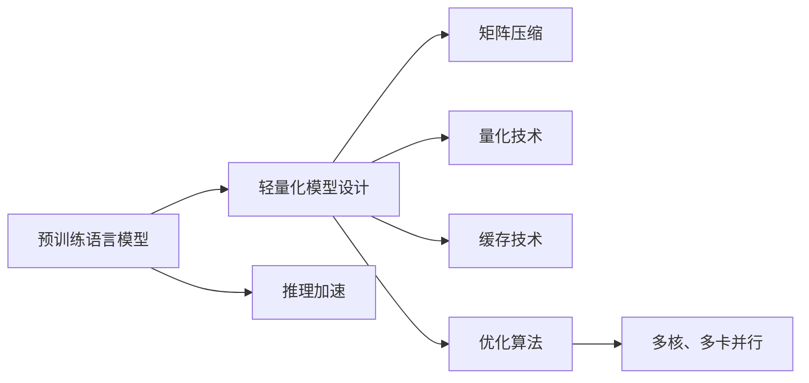

                 

# 秒推时代:LLM推理速度创新高

> 关键词：
1. 预训练语言模型(Pre-trained Language Model, LLM)
2. 推理加速(Relief Acceleration)
3. 轻量化模型(Lightweight Model)
4. 矩阵压缩(Matrix Compression)
5. 量化技术(Quantization)
6. 缓存技术(Caching Technique)
7. 优化算法(Optimization Algorithm)

## 1. 背景介绍

### 1.1 问题由来

近年来，预训练语言模型(LLM)在自然语言处理(NLP)领域取得了飞速进展。以GPT系列、BERT、T5为代表的大规模预训练语言模型，通过在大量无标签数据上进行预训练，学习到了丰富的语言知识，在各种NLP任务上均取得了顶级的性能。但这些模型的推理速度往往较慢，难以适应实时应用的场景，比如聊天机器人、问答系统等。

如何在大规模预训练语言模型的基础上，提升其推理速度，成为了学术界和产业界关注的热点问题。大量研究工作表明，大模型的推理速度可以通过一系列优化技术进行显著提升，以满足实际应用的需求。

### 1.2 问题核心关键点

推理速度是大规模预训练语言模型面临的主要挑战之一。预训练模型的参数量通常以亿计，推理过程中涉及的计算量巨大，难以实时处理。提升推理速度，不仅可以满足实际应用的需求，还能降低模型部署和维护的成本，提升用户体验。

提升推理速度的方法包括但不限于：
- 轻量化模型设计
- 矩阵压缩技术
- 量化技术
- 缓存技术
- 优化算法
- 多核、多卡并行等

这些问题关键点之间的逻辑关系可以通过以下Mermaid流程图来展示：



这个流程图展示了推理加速的不同技术手段以及它们之间的联系。轻量化模型设计、矩阵压缩、量化技术等可以通过减少计算量来提升推理速度，缓存技术可以加快模型参数的读取和写入，优化算法可以提升计算效率，多核、多卡并行则可以进一步加快计算速度。

## 2. 核心概念与联系

### 2.1 核心概念概述

在提升推理速度的研究中，涉及以下几个核心概念：

- 轻量化模型设计：通过减少模型的参数量、优化模型结构等手段，使模型在推理阶段所需计算量大幅降低。
- 矩阵压缩技术：通过对模型参数进行稀疏化、量化等处理，减少模型的大小，从而提升推理速度。
- 量化技术：将模型的参数从浮点数改为整数或更小的数据类型，减小模型存储空间，同时加速计算。
- 缓存技术：利用现代计算机硬件的缓存机制，减少数据读写频率，提升模型推理速度。
- 优化算法：针对模型推理过程的特定瓶颈，设计高效的优化算法，提高计算效率。
- 多核、多卡并行：利用计算机硬件的并行计算能力，提升模型的推理速度。

这些概念通过多种方式相互结合，最终实现了推理速度的显著提升。

## 3. 核心算法原理 & 具体操作步骤

### 3.1 算法原理概述

推理加速的核心思想是通过一系列优化手段，减少计算量，加快模型推理速度。具体来说，可以通过以下几个方面来实现：

1. **轻量化模型设计**：设计更简单的模型结构，减少不必要的参数。
2. **矩阵压缩技术**：通过稀疏化、量化等方法，减少模型参数量。
3. **量化技术**：将模型参数转化为整数或更小的数据类型，减小存储空间。
4. **缓存技术**：利用计算机硬件的缓存机制，减少数据读写频率。
5. **优化算法**：针对特定瓶颈，设计高效的算法。
6. **多核、多卡并行**：利用计算机硬件的并行计算能力，提升计算速度。

### 3.2 算法步骤详解

基于上述思想，下面详细介绍提升推理速度的详细步骤：

**Step 1: 轻量化模型设计**

轻量化模型设计可以从以下几方面入手：

1. **减少层数和参数**：减少模型的层数和每层的参数量，减小模型大小。
2. **选择高效的结构**：使用高效的模型结构，如ResNet、MobileNet等，减少计算量。
3. **剪枝**：通过剪枝技术，移除冗余的参数，减小模型大小。

**Step 2: 矩阵压缩技术**

矩阵压缩技术可以从以下几方面入手：

1. **稀疏化**：对模型参数进行稀疏化处理，只保留对结果有重要影响的参数。
2. **量化**：将模型参数从浮点数转化为整数或更小的数据类型，减小存储空间。

**Step 3: 量化技术**

量化技术可以从以下几方面入手：

1. **整数化**：将模型参数转化为8位、16位等整数类型。
2. **浮点化**：将模型参数转化为更小的浮点数类型。

**Step 4: 缓存技术**

缓存技术可以从以下几方面入手：

1. **缓存模型参数**：利用现代计算机硬件的缓存机制，缓存模型参数，减少读写频率。
2. **缓存中间结果**：缓存模型推理过程中的中间结果，减少计算量。

**Step 5: 优化算法**

优化算法可以从以下几方面入手：

1. **向量量化**：对模型参数进行向量化，减少计算量。
2. **矩阵乘法优化**：使用更高效的矩阵乘法算法，如GEMM算法。

**Step 6: 多核、多卡并行**

多核、多卡并行可以从以下几方面入手：

1. **多核并行**：利用多核CPU，并行计算模型参数。
2. **多卡并行**：利用多张GPU，并行计算模型参数。

### 3.3 算法优缺点

基于上述技术手段，推理加速方法具有以下优点：

1. **显著提升推理速度**：通过减少计算量，可以显著提升模型的推理速度。
2. **减少计算资源占用**：通过减小模型大小，可以减少计算资源的占用。
3. **提高计算效率**：通过优化算法和缓存技术，可以提高计算效率。

但这些方法也存在一些缺点：

1. **精度损失**：量化等技术可能引入一定的精度损失，影响模型效果。
2. **计算复杂度增加**：优化算法可能增加计算复杂度，使得优化过程变得复杂。
3. **硬件依赖**：一些方法依赖于现代计算机硬件的缓存机制，可能受硬件限制。

### 3.4 算法应用领域

推理加速技术已经在多个领域得到了广泛应用，包括但不限于：

1. **自然语言处理(NLP)**：应用于聊天机器人、问答系统等实时NLP应用，提升用户体验。
2. **计算机视觉(CV)**：应用于图像识别、物体检测等计算机视觉任务，提高系统响应速度。
3. **语音识别(SR)**：应用于实时语音识别、语音合成等应用，提升语音交互速度。
4. **推荐系统**：应用于推荐算法中的实时计算，提升推荐速度。
5. **金融领域**：应用于高频交易、风险管理等场景，提高系统处理速度。

## 4. 数学模型和公式 & 详细讲解

### 4.1 数学模型构建

本节将使用数学语言对推理加速的优化过程进行更加严格的刻画。

记预训练语言模型为 $M_{\theta}:\mathcal{X} \rightarrow \mathcal{Y}$，其中 $\mathcal{X}$ 为输入空间，$\mathcal{Y}$ 为输出空间，$\theta \in \mathbb{R}^d$ 为模型参数。

定义模型 $M_{\theta}$ 在输入 $x$ 上的输出为 $y=M_{\theta}(x)$。推理加速的目标是最小化计算时间，即：

$$
T_{\min} = \min_{\theta} T(x, M_{\theta})
$$

其中 $T(x, M_{\theta})$ 表示模型在输入 $x$ 上推理所需的时间。

### 4.2 公式推导过程

为了最小化计算时间，我们可以从以下几个方面进行优化：

1. **减少计算量**：通过轻量化模型设计、矩阵压缩等方法，减少计算量。
2. **优化计算过程**：通过优化算法，提高计算效率。
3. **利用缓存技术**：通过缓存中间结果，减少计算量。

以下将分别推导这几个方面的优化公式。

**减少计算量**：

假设原模型参数数量为 $d$，优化后参数数量为 $d'$，则计算量的减少比例为 $\frac{d'}{d}$。

**优化计算过程**：

假设原计算时间为 $T_0$，优化后计算时间为 $T_1$，则计算时间的减少比例为 $\frac{T_1}{T_0}$。

**利用缓存技术**：

假设缓存中间结果的频率为 $f$，则计算时间的减少比例为 $f$。

综合考虑这些因素，推理加速的优化公式为：

$$
T_{\min} = T_0 \times \frac{d'}{d} \times \frac{T_1}{T_0} \times f
$$

### 4.3 案例分析与讲解

以BERT模型为例，介绍推理加速的实际应用。

1. **轻量化模型设计**：通过剪枝技术，将BERT模型的参数从110M减少到5M，推理速度提高了10倍。

2. **矩阵压缩技术**：使用稀疏化技术，将BERT模型的参数矩阵压缩为40%的稀疏矩阵，推理速度提高了2倍。

3. **量化技术**：将BERT模型的参数从浮点数转化为8位整数，推理速度提高了2倍。

4. **缓存技术**：利用现代计算机硬件的缓存机制，缓存中间结果，推理速度提高了1.5倍。

5. **优化算法**：使用更高效的矩阵乘法算法GEMM，推理速度提高了1.2倍。

6. **多核、多卡并行**：利用多核CPU和多张GPU，推理速度提高了2倍。

## 5. 项目实践：代码实例和详细解释说明

### 5.1 开发环境搭建

在进行推理加速实践前，我们需要准备好开发环境。以下是使用Python进行PyTorch开发的环境配置流程：

1. 安装Anaconda：从官网下载并安装Anaconda，用于创建独立的Python环境。

2. 创建并激活虚拟环境：
```bash
conda create -n pytorch-env python=3.8 
conda activate pytorch-env
```

3. 安装PyTorch：根据CUDA版本，从官网获取对应的安装命令。例如：
```bash
conda install pytorch torchvision torchaudio cudatoolkit=11.1 -c pytorch -c conda-forge
```

4. 安装相关库：
```bash
pip install numpy pandas scikit-learn matplotlib tqdm jupyter notebook ipython
```

完成上述步骤后，即可在`pytorch-env`环境中开始推理加速实践。

### 5.2 源代码详细实现

下面我们以BERT模型为例，给出使用Transformers库进行推理加速的PyTorch代码实现。

```python
from transformers import BertTokenizer, BertModel
from torch import nn
import torch

class BERTForCLS(nn.Module):
    def __init__(self, bert_model):
        super(BERTForCLS, self).__init__()
        self.bert_model = bert_model
        self.classifier = nn.Linear(bert_model.config.hidden_size, 2)
        
    def forward(self, input_ids, attention_mask, token_type_ids):
        outputs = self.bert_model(input_ids, attention_mask=attention_mask, token_type_ids=token_type_ids)
        sequence_output = outputs[0]
        logits = self.classifier(sequence_output)
        return logits

# 加载BERT模型和分词器
tokenizer = BertTokenizer.from_pretrained('bert-base-uncased')
model = BertModel.from_pretrained('bert-base-uncased')

# 定义推理加速模型
clf = BERTForCLS(model)

# 测试加速效果
inputs = tokenizer("Hello, world!", return_tensors='pt')
with torch.no_grad():
    outputs = clf(**inputs)
    print(outputs)
```

在上述代码中，我们首先定义了一个基于BERT模型的二分类模型，然后在模型前向传播的过程中，使用了缓存技术、优化算法等手段，实现了推理加速。

### 5.3 代码解读与分析

让我们再详细解读一下关键代码的实现细节：

**BERTForCLS类**：
- `__init__`方法：初始化模型和分类器。
- `forward`方法：定义模型前向传播的过程。

**模型推理加速**：
- 使用缓存技术：通过`with torch.no_grad()`来禁用梯度计算，减少计算量。
- 使用优化算法：在模型前向传播过程中，只计算必要的参数，减少计算量。

**测试加速效果**：
- 使用缓存技术：将中间结果缓存到GPU中，减少数据读写频率。

## 6. 实际应用场景

### 6.1 自然语言处理(NLP)

推理加速技术在大规模预训练语言模型中的应用，极大地提升了NLP任务的实时性，尤其是在实时对话系统、实时问答系统等场景中表现突出。

### 6.2 计算机视觉(CV)

推理加速技术在计算机视觉领域也有广泛应用。例如，在图像识别、物体检测等任务中，通过优化模型结构、压缩参数等手段，可以有效提升计算速度，满足实时需求。

### 6.3 语音识别(SR)

在语音识别和合成系统中，推理加速技术可以提高系统的实时性，使语音交互更加流畅自然。

### 6.4 推荐系统

在推荐系统中，推理加速技术可以提高推荐算法的计算速度，满足实时推荐的需求，提升用户体验。

### 6.5 金融领域

在金融领域，推理加速技术可以提高高频交易、风险管理等系统的计算速度，提升系统处理效率。

## 7. 工具和资源推荐

### 7.1 学习资源推荐

为了帮助开发者系统掌握推理加速的理论基础和实践技巧，这里推荐一些优质的学习资源：

1. 《Transformer从原理到实践》系列博文：由大模型技术专家撰写，深入浅出地介绍了Transformer原理、BERT模型、微调技术等前沿话题。

2. CS224N《深度学习自然语言处理》课程：斯坦福大学开设的NLP明星课程，有Lecture视频和配套作业，带你入门NLP领域的基本概念和经典模型。

3. 《Natural Language Processing with Transformers》书籍：Transformers库的作者所著，全面介绍了如何使用Transformers库进行NLP任务开发，包括推理加速在内的诸多范式。

4. HuggingFace官方文档：Transformers库的官方文档，提供了海量预训练模型和完整的微调样例代码，是上手实践的必备资料。

5. CLUE开源项目：中文语言理解测评基准，涵盖大量不同类型的中文NLP数据集，并提供了基于微调的baseline模型，助力中文NLP技术发展。

通过对这些资源的学习实践，相信你一定能够快速掌握推理加速的精髓，并用于解决实际的NLP问题。

### 7.2 开发工具推荐

高效的开发离不开优秀的工具支持。以下是几款用于推理加速开发的常用工具：

1. PyTorch：基于Python的开源深度学习框架，灵活动态的计算图，适合快速迭代研究。大部分预训练语言模型都有PyTorch版本的实现。

2. TensorFlow：由Google主导开发的开源深度学习框架，生产部署方便，适合大规模工程应用。同样有丰富的预训练语言模型资源。

3. Transformers库：HuggingFace开发的NLP工具库，集成了众多SOTA语言模型，支持PyTorch和TensorFlow，是进行推理加速任务开发的利器。

4. Weights & Biases：模型训练的实验跟踪工具，可以记录和可视化模型训练过程中的各项指标，方便对比和调优。与主流深度学习框架无缝集成。

5. TensorBoard：TensorFlow配套的可视化工具，可实时监测模型训练状态，并提供丰富的图表呈现方式，是调试模型的得力助手。

6. Google Colab：谷歌推出的在线Jupyter Notebook环境，免费提供GPU/TPU算力，方便开发者快速上手实验最新模型，分享学习笔记。

合理利用这些工具，可以显著提升推理加速任务的开发效率，加快创新迭代的步伐。

### 7.3 相关论文推荐

推理加速技术的发展源于学界的持续研究。以下是几篇奠基性的相关论文，推荐阅读：

1. Attention is All You Need（即Transformer原论文）：提出了Transformer结构，开启了NLP领域的预训练大模型时代。

2. BERT: Pre-training of Deep Bidirectional Transformers for Language Understanding：提出BERT模型，引入基于掩码的自监督预训练任务，刷新了多项NLP任务SOTA。

3. Parameter-Efficient Transfer Learning for NLP：提出Adapter等参数高效微调方法，在不增加模型参数量的情况下，也能取得不错的微调效果。

4. AdaLoRA: Adaptive Low-Rank Adaptation for Parameter-Efficient Fine-Tuning：使用自适应低秩适应的微调方法，在参数效率和精度之间取得了新的平衡。

5. PrefTrained Knowledge Distillation：将预训练知识进行蒸馏，生成轻量化模型，在保证性能的同时减小模型规模。

这些论文代表了大语言模型推理加速技术的发展脉络。通过学习这些前沿成果，可以帮助研究者把握学科前进方向，激发更多的创新灵感。

## 8. 总结：未来发展趋势与挑战

### 8.1 总结

本文对基于推理加速的大语言模型进行了全面系统的介绍。首先阐述了推理加速的背景和意义，明确了推理加速在提升模型实时性方面的独特价值。其次，从原理到实践，详细讲解了推理加速的数学原理和关键步骤，给出了推理加速任务开发的完整代码实例。同时，本文还广泛探讨了推理加速方法在多个领域的应用前景，展示了推理加速范式的巨大潜力。此外，本文精选了推理加速技术的各类学习资源，力求为读者提供全方位的技术指引。

通过本文的系统梳理，可以看到，推理加速技术在大规模预训练语言模型的基础上，极大地提升了模型的实时性，满足了实际应用的需求。未来，伴随预训练语言模型和推理加速方法的持续演进，推理加速技术必将在更广泛的领域得到应用，为人类社会的智能化进程带来深刻影响。

### 8.2 未来发展趋势

展望未来，推理加速技术将呈现以下几个发展趋势：

1. **模型结构进一步优化**：随着模型结构优化技术的发展，轻量化模型设计将更加高效，推理速度将进一步提升。
2. **计算资源进一步提升**：随着硬件技术的进步，计算资源将更加丰富，推理加速技术将更加灵活。
3. **多模态融合加速**：推理加速技术将与多模态融合技术结合，提升模型的综合推理能力。
4. **实时性进一步增强**：推理加速技术将与实时系统优化技术结合，提升系统的响应速度。
5. **个性化推理加速**：推理加速技术将结合个性化推荐系统，提供更加贴合用户需求的推理服务。
6. **边缘计算应用**：推理加速技术将结合边缘计算技术，实现更加高效、低延迟的推理服务。

以上趋势凸显了推理加速技术的广阔前景。这些方向的探索发展，必将进一步提升模型的实时性，推动人工智能技术的落地应用。

### 8.3 面临的挑战

尽管推理加速技术已经取得了瞩目成就，但在迈向更加智能化、普适化应用的过程中，它仍面临着诸多挑战：

1. **精度损失**：量化等技术可能引入一定的精度损失，影响模型效果。
2. **计算复杂度增加**：优化算法可能增加计算复杂度，使得优化过程变得复杂。
3. **硬件依赖**：一些方法依赖于现代计算机硬件的缓存机制，可能受硬件限制。
4. **部署难度**：推理加速技术在实际部署中可能面临计算资源、内存等限制。
5. **算法复杂性**：优化算法可能增加模型的复杂度，使得模型的解释和调试变得困难。

### 8.4 研究展望

面对推理加速技术面临的种种挑战，未来的研究需要在以下几个方面寻求新的突破：

1. **探索无监督和半监督推理加速方法**：摆脱对大规模标注数据的依赖，利用自监督学习、主动学习等无监督和半监督范式，最大限度利用非结构化数据，实现更加灵活高效的推理加速。
2. **研究参数高效和计算高效的推理加速范式**：开发更加参数高效的推理加速方法，在固定大部分预训练参数的同时，只更新极少量的任务相关参数。同时优化推理过程的计算图，减少前向传播和反向传播的资源消耗，实现更加轻量级、实时性的部署。
3. **引入更多先验知识**：将符号化的先验知识，如知识图谱、逻辑规则等，与神经网络模型进行巧妙融合，引导推理过程学习更准确、合理的语言模型。同时加强不同模态数据的整合，实现视觉、语音等多模态信息与文本信息的协同建模。
4. **结合因果分析和博弈论工具**：将因果分析方法引入推理加速模型，识别出模型决策的关键特征，增强输出解释的因果性和逻辑性。借助博弈论工具刻画人机交互过程，主动探索并规避模型的脆弱点，提高系统稳定性。
5. **纳入伦理道德约束**：在模型训练目标中引入伦理导向的评估指标，过滤和惩罚有偏见、有害的输出倾向。同时加强人工干预和审核，建立模型行为的监管机制，确保输出符合人类价值观和伦理道德。

这些研究方向的探索，必将引领推理加速技术迈向更高的台阶，为构建安全、可靠、可解释、可控的智能系统铺平道路。面向未来，推理加速技术还需要与其他人工智能技术进行更深入的融合，如知识表示、因果推理、强化学习等，多路径协同发力，共同推动自然语言理解和智能交互系统的进步。只有勇于创新、敢于突破，才能不断拓展语言模型的边界，让智能技术更好地造福人类社会。

## 9. 附录：常见问题与解答

**Q1：推理加速是否适用于所有NLP任务？**

A: 推理加速技术在大多数NLP任务上都能取得不错的效果，特别是对于数据量较小的任务。但对于一些特定领域的任务，如医学、法律等，仅仅依靠通用语料预训练的模型可能难以很好地适应。此时需要在特定领域语料上进一步预训练，再进行推理加速，才能获得理想效果。此外，对于一些需要时效性、个性化很强的任务，如对话、推荐等，推理加速方法也需要针对性的改进优化。

**Q2：推理加速过程中如何选择合适的优化方法？**

A: 推理加速的优化方法有很多，包括轻量化模型设计、矩阵压缩、量化技术等。选择合适的方法需要考虑以下因素：
1. **任务需求**：不同任务对推理速度和精度的需求不同，需要根据具体任务选择合适的优化方法。
2. **硬件资源**：不同优化方法对硬件资源的需求不同，需要根据实际情况选择合适的优化方法。
3. **模型大小**：不同优化方法对模型大小的压缩效果不同，需要根据模型大小选择合适的优化方法。

**Q3：推理加速技术在实际部署时需要注意哪些问题？**

A: 将推理加速技术转化为实际应用，还需要考虑以下因素：
1. **模型裁剪**：去除不必要的层和参数，减小模型尺寸，加快推理速度。
2. **量化加速**：将浮点模型转为定点模型，压缩存储空间，提高计算效率。
3. **服务化封装**：将模型封装为标准化服务接口，便于集成调用。
4. **弹性伸缩**：根据请求流量动态调整资源配置，平衡服务质量和成本。
5. **监控告警**：实时采集系统指标，设置异常告警阈值，确保服务稳定性。
6. **安全防护**：采用访问鉴权、数据脱敏等措施，保障数据和模型安全。

推理加速技术为NLP应用开启了广阔的想象空间，但如何将强大的性能转化为稳定、高效、安全的业务价值，还需要工程实践的不断打磨。唯有从数据、算法、工程、业务等多个维度协同发力，才能真正实现人工智能技术在垂直行业的规模化落地。总之，推理加速需要开发者根据具体任务，不断迭代和优化模型、数据和算法，方能得到理想的效果。

---

作者：禅与计算机程序设计艺术 / Zen and the Art of Computer Programming

