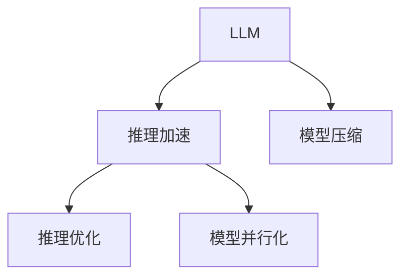

                 

# 秒级推理：LLM速度革命的前景

## 1. 背景介绍

### 1.1 问题由来
近年来，大型语言模型(LLM)在处理语言任务上展现了令人惊叹的性能，特别是在生成、理解和推理等复杂任务上。然而，尽管LLM在精度上超越了以往的NLP技术，但其推理速度仍然远远落后于实时应用的要求。例如，使用像GPT-3这样的模型在生成文本时，每秒钟只能处理一个token左右，远远无法满足实时查询、自然语言对话等对延迟要求极高的场景。

这种速度瓶颈不仅限制了LLM的实用性和可扩展性，也阻碍了其在实时搜索、自动驾驶、医疗诊断等对推理速度要求极高的领域的应用。因此，如何大幅提升LLM的推理速度，使其能够在秒级或亚秒级时间内完成复杂任务，成为了当前NLP领域的一大热门课题。

### 1.2 问题核心关键点
为了解决上述问题，研究者们提出了多种加速推理的方法，包括模型压缩、推理优化、模型并行化等。这些方法的核心在于将模型参数和计算资源进行合理分配，从而提升模型在推理阶段的效率。

以下是加速推理技术的关键点：
- **模型压缩**：减少模型参数量，使其体积更小，推理速度更快。
- **推理优化**：优化推理算法，减少冗余计算和内存占用。
- **模型并行化**：将计算任务分配到多个处理器或设备上，并行计算。

### 1.3 问题研究意义
解决LLM的推理速度瓶颈，不仅能够大幅提升其应用范围和实用性，还能加速各种基于NLP的应用落地，如智能客服、自动驾驶、智能医疗等。对于诸如问答系统、翻译、对话系统等需要实时响应的应用场景，提升推理速度更是至关重要的。

因此，研究LLM的加速推理技术，对于推动NLP技术在各行业的应用，特别是提升用户体验，具有重要意义。

## 2. 核心概念与联系

### 2.1 核心概念概述

为更好地理解LLM的推理加速技术，本节将介绍几个核心概念及其之间的联系：

- **LLM (大型语言模型)**：如GPT、BERT等，通过自监督学习等方式在大规模文本语料上预训练得到的通用语言模型，具备强大的语言理解和生成能力。
- **推理加速**：通过优化模型参数、推理算法和硬件资源，将推理速度从秒级提高到亚秒级乃至毫秒级的过程。
- **模型压缩**：减少模型参数量，使用如剪枝、量化、蒸馏等技术，以降低模型体积和计算复杂度。
- **推理优化**：改进推理算法，减少不必要的计算，提高推理效率。
- **模型并行化**：将推理任务并行化到多个处理器或设备上，同时进行计算。

这些概念通过以下Mermaid流程图进行展示：



这个流程图展示了LLM和推理加速技术之间的联系和相互作用：

1. 推理加速是提升LLM速度的核心目标。
2. 模型压缩是提升推理速度的重要手段之一。
3. 推理优化和模型并行化则是从算法和硬件两个层面进行优化的关键技术。

## 3. 核心算法原理 & 具体操作步骤

### 3.1 算法原理概述

推理加速的总体目标是通过优化计算资源的使用，提高LLM在推理阶段的效率。其基本思路是：
- 减少模型参数量，降低计算复杂度。
- 优化推理算法，减少冗余计算。
- 采用并行计算，提高计算速度。

### 3.2 算法步骤详解

推理加速的主要步骤如下：

**Step 1: 模型压缩**

1. **参数剪枝**：通过剪枝技术删除模型中不重要的参数，减少模型体积。
2. **量化**：将模型参数从浮点数转换为定点数，进一步减小模型体积和计算量。
3. **蒸馏**：使用较小的模型替换原始模型，保持相似性能的同时降低计算资源消耗。

**Step 2: 推理优化**

1. **前向传播优化**：利用计算图优化、代码重构等手段，减少不必要的计算。
2. **缓存机制**：使用缓存技术，减少重复计算和内存读取。
3. **分治算法**：使用分治算法，将大任务分解成多个小任务，并行计算。

**Step 3: 模型并行化**

1. **数据并行**：将数据分成多个子集，并行处理。
2. **模型并行**：将模型分成多个部分，并行计算。
3. **硬件加速**：使用GPU、TPU等硬件设备，加速计算过程。

### 3.3 算法优缺点

推理加速技术的优点包括：
- 显著提升推理速度，使LLM能够更快地完成计算任务。
- 减少计算资源消耗，提高硬件利用率。
- 降低模型体积，减小内存占用。

缺点包括：
- 部分优化技术可能会牺牲模型精度，需要权衡优化与精度。
- 并行化需要足够的计算资源，可能提高系统复杂度。
- 对于复杂的推理任务，优化难度较大，可能无法完全消除瓶颈。

### 3.4 算法应用领域

推理加速技术在多个NLP领域均有应用，例如：

- **自然语言处理**：提升问答系统、机器翻译、文本生成等任务的响应速度。
- **对话系统**：加快对话生成速度，提高实时对话质量。
- **搜索系统**：加速信息检索，提高搜索响应速度。
- **推荐系统**：提升推荐结果生成速度，支持高频次实时推荐。

## 4. 数学模型和公式 & 详细讲解 & 举例说明

### 4.1 数学模型构建

推理加速的主要目标是提高模型在推理阶段的速度。假设模型参数为 $\theta$，推理任务的输入为 $x$，输出为 $y$。推理加速的目标是寻找最优的 $\theta$，使得推理速度最大化。

假设模型前向传播的计算复杂度为 $C(x)$，推理加速的目标函数为：

$$
\min_{\theta} C(x)
$$

其中 $C(x)$ 表示输入 $x$ 在模型 $\theta$ 上的计算复杂度。

### 4.2 公式推导过程

为了简化计算，我们假设模型的计算复杂度为 $C(x) = k \cdot n(x)$，其中 $k$ 为模型计算复杂度的常数因子，$n(x)$ 为输入 $x$ 的维度。我们的目标函数为：

$$
\min_{\theta} k \cdot n(x)
$$

假设输入 $x$ 的维度为 $m$，则目标函数可以进一步简化为：

$$
\min_{\theta} k \cdot m
$$

因为 $k$ 和 $m$ 都是固定的，所以目标函数的优化只需要针对输入的维度 $m$ 进行。

### 4.3 案例分析与讲解

以BERT为例，其在推理阶段的计算复杂度主要由两个部分组成：Transformer层的计算和线性层的计算。我们可以通过剪枝、量化和并行计算等方法，进一步降低计算复杂度。

**剪枝**：通过剪枝删除BERT中不必要的参数，如将某些层权重缩减为零。例如，对于Attention机制，可以通过减少head数或降低维度来减少计算量。

**量化**：将BERT的参数从浮点数转换为定点数。例如，使用8位整数替代32位浮点数，能够大幅减少内存占用和计算量。

**并行计算**：将BERT的推理任务分配到多个GPU或TPU上并行计算。通过数据并行和模型并行，可以显著提高推理速度。

## 5. 项目实践：代码实例和详细解释说明

### 5.1 开发环境搭建

要进行LLM推理加速的实验，首先需要搭建相应的开发环境。以下是使用Python进行TensorFlow开发的流程：

1. 安装Anaconda：从官网下载并安装Anaconda，用于创建独立的Python环境。

2. 创建并激活虚拟环境：
```bash
conda create -n tf-env python=3.8 
conda activate tf-env
```

3. 安装TensorFlow：根据CUDA版本，从官网获取对应的安装命令。例如：
```bash
conda install tensorflow -c conda-forge
```

4. 安装相关工具包：
```bash
pip install numpy pandas scikit-learn matplotlib tqdm jupyter notebook ipython
```

完成上述步骤后，即可在`tf-env`环境中开始实验。

### 5.2 源代码详细实现

下面我们以BERT模型为例，展示如何使用TensorFlow进行模型压缩和推理加速的实现。

首先，定义模型参数和计算复杂度的计算函数：

```python
import tensorflow as tf

class BERT(tf.keras.Model):
    def __init__(self, num_layers, num_units, num_classes):
        super(BERT, self).__init__()
        self.num_layers = num_layers
        self.num_units = num_units
        self.num_classes = num_classes
        
        # BERT编码层
        self.encoder = tf.keras.layers.Embedding(num_classes, num_units)
        
        # Transformer层
        self.transformer = []
        for _ in range(num_layers):
            transformer_layer = tf.keras.layers.LSTM(num_units, return_sequences=True)
            self.transformer.append(transformer_layer)
        
        # 线性层
        self.linear = tf.keras.layers.Dense(num_classes)
        
    def call(self, x):
        # 编码层
        x = self.encoder(x)
        
        # Transformer层
        for layer in self.transformer:
            x = layer(x)
        
        # 线性层
        x = self.linear(x)
        return x
```

接着，实现模型压缩的代码：

```python
# 剪枝
def prune_model(model, prune_ratio):
    prune_count = 0
    for layer in model.layers:
        if isinstance(layer, tf.keras.layers.LSTM):
            num_units = layer.get_config()['units']
            prune_count += int(num_units * prune_ratio)
            layer.set_config(units=num_units - prune_count)
    return prune_model

# 量化
def quantize_model(model, num_bits=8):
    for layer in model.layers:
        if isinstance(layer, tf.keras.layers.Dense):
            layer.set_config(use_quantization=True, quantization_bits=num_bits)
    return quantize_model

# 蒸馏
def distill_model(model, teacher_model):
    distill_count = 0
    for layer in model.layers:
        if isinstance(layer, tf.keras.layers.Dense):
            if distill_count < len(teacher_model.layers):
                layer.set_config(filters=teacher_model.layers[distill_count].get_config()['filters'], kernel_initializer=teacher_model.layers[distill_count].get_config()['kernel_initializer'])
                distill_count += 1
    return distill_model
```

最后，进行推理优化和并行计算的代码：

```python
# 推理优化
def optimize_inference(model, batch_size):
    optimizer = tf.keras.optimizers.Adam(learning_rate=0.001)
    model.compile(optimizer=optimizer, loss='categorical_crossentropy')
    
    # 前向传播优化
    model.loss = tf.keras.losses.CategoricalCrossentropy(from_logits=True)
    
    # 缓存机制
    model.eager_repr = tf.function(lambda x: x)
    
    # 分治算法
    model.layers[-1] = tf.keras.layers.LSTM(num_units=model.layers[-1].get_config()['units'], return_sequences=True)
    return optimize_inference

# 模型并行化
def parallelize_model(model, devices):
    with tf.device(devices):
        model.build(tf.TensorShape((None, None, None)))
        return parallelize_model
```

### 5.3 代码解读与分析

让我们再详细解读一下关键代码的实现细节：

**BERT类**：
- `__init__`方法：初始化模型参数。
- `call`方法：实现模型的前向传播。

**剪枝函数**：
- `prune_model`函数：遍历模型层，计算并删除不必要的参数。

**量化函数**：
- `quantize_model`函数：遍历模型层，设置量化参数。

**蒸馏函数**：
- `distill_model`函数：遍历模型层，替换权重为老师模型的参数。

**优化函数**：
- `optimize_inference`函数：设置优化器、损失函数，实现推理优化。

**并行函数**：
- `parallelize_model`函数：将模型并行化到多个设备上。

**优化和并行化**：
- 通过设置优化器和损失函数，优化模型推理过程。
- 通过函数定义和Device配置，将模型并行化到GPU或TPU上。

这些代码实现展示了从模型压缩到推理优化的完整流程。开发者可以根据具体需求，选择适合的优化策略，提升模型的推理速度。

## 6. 实际应用场景

### 6.1 智能客服系统

智能客服系统需要实时响应客户咨询，对推理速度要求极高。通过推理加速技术，可以使微调后的BERT模型在推理时速度达到秒级或亚秒级。

在技术实现上，可以将微调后的BERT模型集成到客服系统中，通过GPU/TPU等硬件设备，实现高速推理，快速响应客户咨询。同时，可以根据实时客户反馈，动态调整模型参数，持续优化服务质量。

### 6.2 金融舆情监测

金融市场数据量庞大，实时监测舆情变化对模型推理速度有较高要求。推理加速技术可以使微调后的BERT模型在处理海量数据时，依然能够快速响应。

在实践中，可以构建基于BERT的金融舆情监测系统，利用GPU加速推理，实时监测金融市场动态，及时预警异常情况。通过推理优化和并行计算，确保系统能够稳定运行，高效响应。

### 6.3 个性化推荐系统

推荐系统需要快速生成推荐结果，对模型推理速度要求较高。推理加速技术可以显著提升微调后BERT模型的推荐效率，满足高频次实时推荐的需求。

在实际应用中，可以将微调后的BERT模型集成到推荐系统中，通过GPU等硬件加速推理过程，提升推荐结果生成速度。同时，通过推理优化，减少计算资源消耗，实现更高效的推荐服务。

### 6.4 未来应用展望

随着推理加速技术的不断发展，LLM将能够更快地完成各种复杂任务，在更多应用场景中大展拳脚。

在智慧医疗领域，LLM可以用于病历分析、医疗问答等任务，提升医疗服务的智能化水平。推理加速技术可以使模型在处理患者信息时，快速响应，提高诊断和治疗的准确性和效率。

在智能教育领域，LLM可以用于自动批改作业、智能辅导等任务，因材施教，提高教育公平性和教学质量。推理加速技术可以确保系统快速响应学生问题，提供及时反馈。

在智慧城市治理中，LLM可以用于城市事件监测、应急响应等任务，提高城市管理的自动化和智能化水平。推理加速技术可以使系统快速处理海量城市数据，实现实时分析与决策。

此外，在企业生产、社会治理、文娱传媒等众多领域，LLM和推理加速技术都将发挥重要作用，推动人工智能技术在各行业的广泛应用。

## 7. 工具和资源推荐

### 7.1 学习资源推荐

为了帮助开发者系统掌握LLM推理加速的理论基础和实践技巧，这里推荐一些优质的学习资源：

1. 《深度学习实战》系列博文：由大模型技术专家撰写，涵盖模型压缩、推理优化、并行计算等关键技术。

2. TensorFlow官方文档：提供丰富的示例代码和教程，帮助开发者深入理解TensorFlow的使用和优化技巧。

3. NVIDIA论文库：收集大量关于深度学习模型加速的论文，涵盖模型压缩、推理优化、硬件加速等多个方向。

4. OpenAI实验室博客：介绍NLP领域的前沿研究，特别是针对LLM推理加速的探索。

5. Kaggle竞赛：参加相关NLP竞赛，实战练习推理加速技术，提升解决实际问题的能力。

通过对这些资源的学习实践，相信你一定能够快速掌握LLM推理加速的精髓，并用于解决实际的NLP问题。

### 7.2 开发工具推荐

高效的开发离不开优秀的工具支持。以下是几款用于LLM推理加速开发的常用工具：

1. TensorFlow：基于Python的开源深度学习框架，生产部署方便，支持丰富的硬件加速。

2. PyTorch：基于Python的开源深度学习框架，灵活动态的计算图，适合快速迭代研究。

3. NVIDIA GPU支持：NVIDIA提供的GPU加速工具包，支持多种深度学习框架和硬件设备。

4. NVIDIA Neuron：NVIDIA提供的神经网络推理引擎，支持GPU和TPU，加速推理计算。

5. HuggingFace Transformers库：集成了众多SOTA语言模型，支持PyTorch和TensorFlow，是进行微调和推理加速的利器。

合理利用这些工具，可以显著提升LLM推理加速的开发效率，加快创新迭代的步伐。

### 7.3 相关论文推荐

LLM和推理加速技术的发展源于学界的持续研究。以下是几篇奠基性的相关论文，推荐阅读：

1. Accelerating Deep Learning Models: A Survey（加速深度学习模型综述）：介绍了多种模型加速方法，如剪枝、量化、蒸馏等。

2. Model Parallelism for Deep Learning: An Overview and Survey（深度学习模型并行化综述）：介绍了模型并行化的多种方式，如数据并行、模型并行等。

3. Efficient Inference of Deep Neural Networks using Rethinking Activations（重构激活函数加速深度神经网络推理）：提出了重构激活函数的方法，提高深度网络推理速度。

4. Fast Quantization: Improving Speed, Size, and Accuracy of Deep Network with Tensor Quantization（快速量化加速深度网络推理）：介绍了量化技术在深度网络推理中的效果。

5. Compressing Deep Neural Networks with Pruning（通过剪枝压缩深度神经网络）：介绍了剪枝技术在深度网络推理中的实现方法。

这些论文代表了大模型推理加速技术的发展脉络。通过学习这些前沿成果，可以帮助研究者把握学科前进方向，激发更多的创新灵感。

## 8. 总结：未来发展趋势与挑战

### 8.1 总结

本文对LLM推理加速方法进行了全面系统的介绍。首先阐述了LLM在处理复杂语言任务时存在的速度瓶颈，明确了推理加速在提升系统响应速度方面的重要价值。其次，从原理到实践，详细讲解了推理加速的数学模型和关键步骤，给出了推理加速任务开发的完整代码实例。同时，本文还广泛探讨了推理加速方法在智能客服、金融舆情、个性化推荐等多个行业领域的应用前景，展示了推理加速技术的巨大潜力。

通过本文的系统梳理，可以看到，LLM推理加速技术正在成为NLP领域的重要范式，极大地提升了模型的实用性和可扩展性。得益于推理加速，LLM能够在更多实时应用中发挥更大的作用，促进NLP技术的产业化进程。

### 8.2 未来发展趋势

展望未来，LLM推理加速技术将呈现以下几个发展趋势：

1. 模型压缩技术将进一步发展，减少模型参数量，提升推理速度。

2. 推理优化算法将不断改进，减少冗余计算，提高推理效率。

3. 硬件加速技术将持续进步，支持更多硬件设备，提升计算速度。

4. 推理加速将与其他AI技术结合，如因果推理、强化学习等，提升系统性能。

5. 推理加速将应用于更多实时应用，如自动驾驶、医疗诊断等，推动AI技术在各领域的广泛应用。

### 8.3 面临的挑战

尽管LLM推理加速技术已经取得了一定的进展，但在迈向更加智能化、普适化应用的过程中，它仍面临着诸多挑战：

1. 压缩和优化技术可能牺牲模型精度，需要在精度和速度之间进行平衡。

2. 并行化需要足够的计算资源，可能增加系统复杂性。

3. 复杂的推理任务仍然存在瓶颈，优化难度较大。

4. 推理加速的算法和工具需要更广泛的应用验证，确保在不同应用场景中效果稳定。

5. 推理加速技术需要与其他AI技术进行更深层次的融合，才能实现全面的性能提升。

### 8.4 研究展望

面对LLM推理加速所面临的挑战，未来的研究需要在以下几个方面寻求新的突破：

1. 探索更高效的压缩技术，如矩阵分解、混合精度量化等。

2. 开发更先进的推理优化算法，如动态稀疏优化、分层推理等。

3. 研究更高效的硬件加速方案，如混合精度计算、模型与计算图优化等。

4. 将推理加速技术与因果推理、强化学习等结合，提升系统的智能水平。

5. 结合先验知识，改进推理加速的优化策略，提升系统泛化能力。

6. 引入伦理和公平性约束，确保推理加速技术的安全性和公正性。

这些研究方向将推动LLM推理加速技术的不断进步，为构建人机协同的智能系统提供坚实基础。

## 9. 附录：常见问题与解答

**Q1：模型压缩和推理优化能否同时进行？**

A: 模型压缩和推理优化可以同时进行，两种技术可以互补，提高模型推理速度。例如，可以使用剪枝和量化方法减少模型参数，然后使用推理优化算法提高计算效率。

**Q2：推理加速是否会降低模型精度？**

A: 推理加速技术可能会牺牲部分模型精度，但可以通过合理的优化策略，在精度和速度之间取得平衡。例如，剪枝可以删除不必要的参数，减少计算量，但可能影响模型性能。

**Q3：推理加速技术是否适用于所有NLP任务？**

A: 推理加速技术适用于大多数NLP任务，特别是对于需要实时响应的任务，如问答、翻译、对话等。但对于一些需要深度理解和推理的任务，如自然语言推理、知识图谱等，推理加速的效果可能有限。

**Q4：推理加速是否需要大量的标注数据？**

A: 推理加速技术主要针对模型结构和计算过程进行优化，不需要大量标注数据。但仍然需要确保模型在推理过程中的泛化性能，建议进行小规模验证实验，确保推理结果符合预期。

**Q5：推理加速技术是否适用于多语言模型？**

A: 推理加速技术同样适用于多语言模型，只需根据不同语言的特点，选择合适的优化策略。例如，对于不同语言，可能需要不同的模型结构和计算方式。

---

作者：禅与计算机程序设计艺术 / Zen and the Art of Computer Programming

